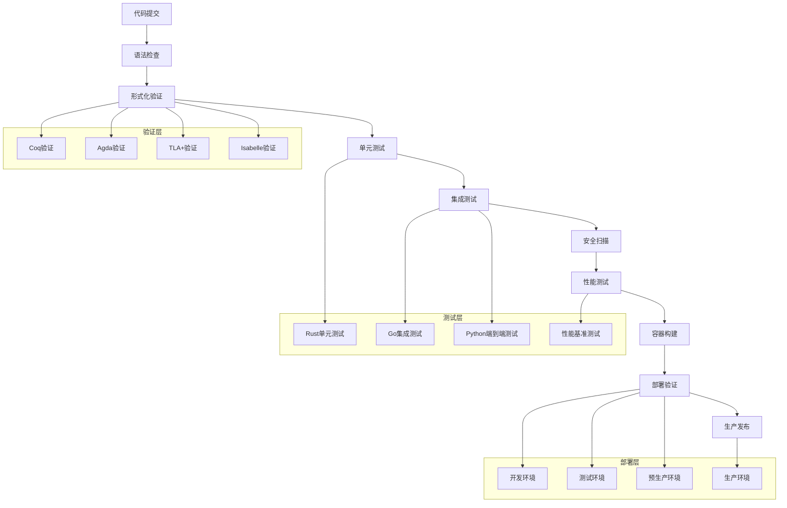

# IoT语义互操作CI/CD流水线详细实现

## 1. 流水线架构设计

### 1.1 整体架构



### 1.2 核心流水线配置

```yaml
# .github/workflows/iot-semantic-pipeline.yml
name: IoT Semantic Interoperability CI/CD

on:
  push:
    branches: [ main, develop, feature/* ]
  pull_request:
    branches: [ main, develop ]
  schedule:
    - cron: '0 2 * * *'

env:
  CARGO_TERM_COLOR: always
  RUST_BACKTRACE: 1
  REGISTRY: ghcr.io
  IMAGE_NAME: iot-semantic-gateway

jobs:
  # 1. 代码质量检查
  code-quality:
    runs-on: ubuntu-latest
    steps:
    - uses: actions/checkout@v4
    
    - name: 安装Rust工具链
      uses: actions-rs/toolchain@v1
      with:
        toolchain: stable
        components: rustfmt, clippy
        
    - name: 代码格式检查
      run: cargo fmt --all -- --check
      
    - name: Clippy静态分析
      run: cargo clippy --all-targets --all-features -- -D warnings
      
    - name: 安全漏洞扫描
      run: |
        cargo install cargo-audit
        cargo audit
        
    - name: 依赖许可证检查
      run: |
        cargo install cargo-license
        cargo license

  # 2. 形式化验证
  formal-verification:
    runs-on: ubuntu-latest
    needs: code-quality
    strategy:
      matrix:
        tool: [coq, agda, tla, isabelle]
    steps:
    - uses: actions/checkout@v4
    
    - name: 安装${{ matrix.tool }}
      run: |
        case ${{ matrix.tool }} in
          coq)
            sudo apt-get update
            sudo apt-get install -y coq coq-doc
            ;;
          agda)
            sudo apt-get update
            sudo apt-get install -y agda agda-stdlib
            ;;
          tla)
            wget https://github.com/tlaplus/tlaplus/releases/latest/download/tla2tools.jar
            mkdir -p ~/tla && mv tla2tools.jar ~/tla/
            ;;
          isabelle)
            wget https://isabelle.in.tum.de/dist/Isabelle2023_linux.tar.gz
            tar xzf Isabelle2023_linux.tar.gz
            ;;
        esac
        
    - name: 运行${{ matrix.tool }}验证
      run: |
        case ${{ matrix.tool }} in
          coq)
            cd verification/coq
            coq_makefile -f _CoqProject -o Makefile
            make
            ;;
          agda)
            cd verification/agda
            agda --safe IoTSemanticModel.agda
            ;;
          tla)
            cd verification/tla
            java -jar ~/tla/tla2tools.jar IoTProtocol.tla
            ;;
          isabelle)
            cd verification/isabelle
            ./Isabelle2023/bin/isabelle build -D .
            ;;
        esac

  # 3. 单元测试
  unit-tests:
    runs-on: ubuntu-latest
    needs: formal-verification
    strategy:
      matrix:
        os: [ubuntu-latest, windows-latest, macos-latest]
        rust: [stable, beta, nightly]
    steps:
    - uses: actions/checkout@v4
    
    - name: 安装Rust ${{ matrix.rust }}
      uses: actions-rs/toolchain@v1
      with:
        toolchain: ${{ matrix.rust }}
        
    - name: 运行单元测试
      run: |
        cargo test --verbose --all-features
        
    - name: 代码覆盖率
      if: matrix.rust == 'stable' && matrix.os == 'ubuntu-latest'
      run: |
        cargo install cargo-tarpaulin
        cargo tarpaulin --verbose --all-features --workspace --timeout 300 --out Xml
        
    - name: 上传覆盖率报告
      if: matrix.rust == 'stable' && matrix.os == 'ubuntu-latest'
      uses: codecov/codecov-action@v3
      with:
        token: ${{ secrets.CODECOV_TOKEN }}

  # 4. 集成测试
  integration-tests:
    runs-on: ubuntu-latest
    needs: unit-tests
    services:
      redis:
        image: redis
        options: >-
          --health-cmd "redis-cli ping"
          --health-interval 10s
          --health-timeout 5s
          --health-retries 5
      postgres:
        image: postgres:14
        env:
          POSTGRES_PASSWORD: postgres
        options: >-
          --health-cmd pg_isready
          --health-interval 10s
          --health-timeout 5s
          --health-retries 5
    steps:
    - uses: actions/checkout@v4
    
    - name: 安装依赖
      run: |
        sudo apt-get update
        sudo apt-get install -y docker-compose
        
    - name: 启动测试环境
      run: |
        docker-compose -f docker-compose.test.yml up -d
        sleep 30
        
    - name: 运行集成测试
      run: |
        cargo test --test integration_tests -- --nocapture
        
    - name: IoT标准兼容性测试
      run: |
        # OPC-UA兼容性测试
        python tests/integration/test_opcua_compatibility.py
        
        # oneM2M兼容性测试
        python tests/integration/test_onem2m_compatibility.py
        
        # WoT兼容性测试
        python tests/integration/test_wot_compatibility.py
        
        # Matter兼容性测试
        python tests/integration/test_matter_compatibility.py
        
    - name: 语义转换测试
      run: |
        python tests/semantic/test_semantic_mapping.py
        python tests/semantic/test_reasoning_engine.py

  # 5. 性能基准测试
  performance-tests:
    runs-on: ubuntu-latest
    needs: integration-tests
    steps:
    - uses: actions/checkout@v4
    
    - name: 构建性能测试镜像
      run: |
        docker build -t iot-gateway-perf -f Dockerfile.perf .
        
    - name: 运行性能基准测试
      run: |
        # 启动性能测试环境
        docker-compose -f docker-compose.perf.yml up -d
        sleep 60
        
        # 运行基准测试
        cargo bench --bench semantic_gateway_bench
        cargo bench --bench protocol_adapter_bench
        cargo bench --bench reasoning_engine_bench
        
    - name: 负载测试
      run: |
        # 安装k6负载测试工具
        sudo apt-key adv --keyserver hkp://keyserver.ubuntu.com:80 --recv-keys C5AD17C747E3415A3642D57D77C6C491D6AC1D69
        echo "deb https://dl.k6.io/deb stable main" | sudo tee /etc/apt/sources.list.d/k6.list
        sudo apt-get update
        sudo apt-get install k6
        
        # 运行负载测试
        k6 run tests/load/gateway_load_test.js
        k6 run tests/load/semantic_engine_load_test.js
        
    - name: 性能回归检测
      run: |
        python scripts/performance_regression_check.py

  # 6. 安全扫描
  security-scan:
    runs-on: ubuntu-latest
    needs: code-quality
    steps:
    - uses: actions/checkout@v4
    
    - name: 容器安全扫描
      run: |
        # 安装Trivy
        sudo apt-get update
        sudo apt-get install wget apt-transport-https gnupg lsb-release
        wget -qO - https://aquasecurity.github.io/trivy-repo/deb/public.key | sudo apt-key add -
        echo "deb https://aquasecurity.github.io/trivy-repo/deb $(lsb_release -sc) main" | sudo tee -a /etc/apt/sources.list.d/trivy.list
        sudo apt-get update
        sudo apt-get install trivy
        
        # 构建镜像并扫描
        docker build -t iot-gateway .
        trivy image iot-gateway
        
    - name: 代码安全扫描
      uses: github/codeql-action/init@v2
      with:
        languages: rust, go, python
        
    - name: 执行CodeQL分析
      uses: github/codeql-action/analyze@v2

  # 7. 构建与发布
  build-and-publish:
    runs-on: ubuntu-latest
    needs: [performance-tests, security-scan]
    if: github.ref == 'refs/heads/main'
    steps:
    - uses: actions/checkout@v4
    
    - name: 登录容器注册表
      uses: docker/login-action@v2
      with:
        registry: ${{ env.REGISTRY }}
        username: ${{ github.actor }}
        password: ${{ secrets.GITHUB_TOKEN }}
        
    - name: 提取元数据
      id: meta
      uses: docker/metadata-action@v4
      with:
        images: ${{ env.REGISTRY }}/${{ env.IMAGE_NAME }}
        tags: |
          type=ref,event=branch
          type=ref,event=pr
          type=sha
          type=raw,value=latest,enable={{is_default_branch}}
          
    - name: 构建并推送镜像
      uses: docker/build-push-action@v4
      with:
        context: .
        push: true
        tags: ${{ steps.meta.outputs.tags }}
        labels: ${{ steps.meta.outputs.labels }}
        
    - name: 生成SBOM
      run: |
        # 安装syft
        curl -sSfL https://raw.githubusercontent.com/anchore/syft/main/install.sh | sh -s -- -b /usr/local/bin
        
        # 生成软件物料清单
        syft ${{ env.REGISTRY }}/${{ env.IMAGE_NAME }}:latest -o spdx-json=sbom.spdx.json
        
    - name: 上传构建产物
      uses: actions/upload-artifact@v3
      with:
        name: build-artifacts
        path: |
          sbom.spdx.json
          target/release/iot-semantic-gateway

  # 8. 部署到测试环境
  deploy-staging:
    runs-on: ubuntu-latest
    needs: build-and-publish
    environment: staging
    steps:
    - uses: actions/checkout@v4
    
    - name: 配置kubectl
      run: |
        mkdir -p ~/.kube
        echo "${{ secrets.KUBECONFIG_STAGING }}" | base64 -d > ~/.kube/config
        
    - name: 部署到Kubernetes
      run: |
        # 替换镜像标签
        sed -i "s|{{IMAGE_TAG}}|${{ github.sha }}|g" k8s/staging/*.yaml
        
        # 应用Kubernetes配置
        kubectl apply -f k8s/staging/
        
        # 等待部署完成
        kubectl rollout status deployment/iot-semantic-gateway -n staging
        
    - name: 运行烟雾测试
      run: |
        # 等待服务就绪
        kubectl wait --for=condition=ready pod -l app=iot-semantic-gateway -n staging --timeout=300s
        
        # 运行烟雾测试
        python tests/smoke/staging_smoke_test.py

  # 9. 部署到生产环境
  deploy-production:
    runs-on: ubuntu-latest
    needs: deploy-staging
    environment: production
    if: github.ref == 'refs/heads/main'
    steps:
    - uses: actions/checkout@v4
    
    - name: 配置生产环境kubectl
      run: |
        mkdir -p ~/.kube
        echo "${{ secrets.KUBECONFIG_PRODUCTION }}" | base64 -d > ~/.kube/config
        
    - name: 金丝雀部署
      run: |
        # 部署金丝雀版本（5%流量）
        sed -i "s|{{IMAGE_TAG}}|${{ github.sha }}|g" k8s/production/canary/*.yaml
        kubectl apply -f k8s/production/canary/
        
        # 等待金丝雀部署就绪
        kubectl rollout status deployment/iot-semantic-gateway-canary -n production
        
    - name: 金丝雀验证
      run: |
        # 运行金丝雀测试
        python tests/canary/production_canary_test.py
        
        # 监控指标验证
        python scripts/canary_metrics_validation.py
        
    - name: 完整生产部署
      run: |
        # 如果金丝雀测试通过，部署到生产环境
        sed -i "s|{{IMAGE_TAG}}|${{ github.sha }}|g" k8s/production/*.yaml
        kubectl apply -f k8s/production/
        
        # 等待生产部署完成
        kubectl rollout status deployment/iot-semantic-gateway -n production
        
        # 清理金丝雀部署
        kubectl delete -f k8s/production/canary/

  # 10. 部署后验证
  post-deployment-verification:
    runs-on: ubuntu-latest
    needs: deploy-production
    steps:
    - uses: actions/checkout@v4
    
    - name: 端到端测试
      run: |
        # 运行生产环境端到端测试
        python tests/e2e/production_e2e_test.py
        
    - name: 性能基线验证
      run: |
        # 验证生产环境性能基线
        python scripts/production_performance_check.py
        
    - name: 通知部署结果
      if: always()
      run: |
        # 发送部署通知
        python scripts/deployment_notification.py
```

## 2. 形式化验证集成

### 2.1 Coq验证自动化

```bash
#!/bin/bash
# scripts/coq_verification.sh

set -e

echo "开始Coq形式化验证..."

# 检查Coq环境
if ! command -v coq_makefile &> /dev/null; then
    echo "错误: Coq未安装"
    exit 1
fi

# 进入验证目录
cd verification/coq

# 生成Makefile
coq_makefile -f _CoqProject -o Makefile

# 编译验证文件
echo "编译IoT标准形式化模型..."
make IoTStandardsTheory.vo

# 运行验证
echo "验证OPC-UA模型..."
make OPCUAModel.vo

echo "验证oneM2M模型..."
make OneM2MModel.vo

echo "验证WoT模型..."
make WoTModel.vo

echo "验证Matter模型..."
make MatterModel.vo

# 生成验证报告
echo "生成验证报告..."
python ../scripts/generate_coq_report.py

echo "Coq验证完成"
```

### 2.2 Agda验证自动化

```bash
#!/bin/bash
# scripts/agda_verification.sh

set -e

echo "开始Agda类型理论验证..."

# 检查Agda环境
if ! command -v agda &> /dev/null; then
    echo "错误: Agda未安装"
    exit 1
fi

cd verification/agda

# 验证语义等价性
echo "验证语义等价性理论..."
agda --safe SemanticEquivalence.agda

# 验证类型安全性
echo "验证类型安全性..."
agda --safe TypeSafety.agda

# 验证互操作性
echo "验证互操作性保证..."
agda --safe InteroperabilityProofs.agda

# 生成HTML文档
echo "生成验证文档..."
agda --html SemanticEquivalence.agda
agda --html TypeSafety.agda
agda --html InteroperabilityProofs.agda

echo "Agda验证完成"
```

## 3. 测试自动化框架

### 3.1 单元测试配置

```toml
# Cargo.toml测试配置
[package]
name = "iot-semantic-gateway"
version = "0.1.0"
edition = "2021"

[dev-dependencies]
tokio-test = "0.4"
mockall = "0.11"
proptest = "1.0"
criterion = "0.5"
rstest = "0.18"

[[bench]]
name = "semantic_gateway_bench"
harness = false

[profile.test]
debug = true
opt-level = 0

[profile.bench]
debug = false
opt-level = 3
lto = true
codegen-units = 1
```

### 3.2 集成测试框架

```rust
// tests/integration/mod.rs
use std::time::Duration;
use tokio::time::timeout;
use iot_semantic_gateway::*;

pub struct TestEnvironment {
    gateway: SemanticGateway,
    opcua_server: MockOPCUAServer,
    onem2m_server: MockOneM2MServer,
    wot_device: MockWoTDevice,
    matter_device: MockMatterDevice,
}

impl TestEnvironment {
    pub async fn new() -> Self {
        // 初始化测试环境
        let gateway = SemanticGateway::new(test_config()).await;
        let opcua_server = MockOPCUAServer::new("opc.tcp://localhost:4840").await;
        let onem2m_server = MockOneM2MServer::new("http://localhost:8080").await;
        let wot_device = MockWoTDevice::new("http://localhost:8081").await;
        let matter_device = MockMatterDevice::new().await;
        
        Self {
            gateway,
            opcua_server,
            onem2m_server,
            wot_device,
            matter_device,
        }
    }
    
    pub async fn start(&mut self) -> Result<(), Box<dyn std::error::Error>> {
        // 启动所有组件
        self.opcua_server.start().await?;
        self.onem2m_server.start().await?;
        self.wot_device.start().await?;
        self.matter_device.start().await?;
        self.gateway.start().await?;
        
        // 等待所有服务就绪
        timeout(Duration::from_secs(30), self.wait_for_ready()).await??;
        
        Ok(())
    }
    
    async fn wait_for_ready(&self) -> Result<(), Box<dyn std::error::Error>> {
        // 等待所有服务就绪的逻辑
        Ok(())
    }
}

#[tokio::test]
async fn test_end_to_end_semantic_translation() {
    let mut env = TestEnvironment::new().await;
    env.start().await.unwrap();
    
    // 测试OPC-UA到oneM2M的语义转换
    let opcua_data = create_test_opcua_data();
    let result = env.gateway.translate_opcua_to_onem2m(opcua_data).await;
    
    assert!(result.is_ok());
    let onem2m_data = result.unwrap();
    validate_onem2m_semantics(&onem2m_data);
}
```

## 4. 环境管理

### 4.1 开发环境配置

```yaml
# docker-compose.dev.yml
version: '3.8'

services:
  iot-gateway-dev:
    build:
      context: .
      dockerfile: Dockerfile.dev
    ports:
      - "8080:8080"
      - "8443:8443"
    environment:
      - RUST_LOG=debug
      - IOT_ENV=development
    volumes:
      - ./src:/app/src
      - ./config:/app/config
      - cargo-cache:/usr/local/cargo/registry
    depends_on:
      - redis-dev
      - postgres-dev
      - opcua-server
      
  redis-dev:
    image: redis:7-alpine
    ports:
      - "6379:6379"
    command: redis-server --appendonly yes
    volumes:
      - redis-data:/data
      
  postgres-dev:
    image: postgres:15-alpine
    ports:
      - "5432:5432"
    environment:
      - POSTGRES_DB=iot_semantic
      - POSTGRES_USER=iot_user
      - POSTGRES_PASSWORD=dev_password
    volumes:
      - postgres-data:/var/lib/postgresql/data
      
  opcua-server:
    image: opcfoundation/ua-nodeset-server
    ports:
      - "4840:4840"
      
  onem2m-server:
    image: onem2m/server:latest
    ports:
      - "8282:8080"

volumes:
  cargo-cache:
  redis-data:
  postgres-data:
```

### 4.2 生产环境配置

```yaml
# k8s/production/deployment.yaml
apiVersion: apps/v1
kind: Deployment
metadata:
  name: iot-semantic-gateway
  namespace: production
  labels:
    app: iot-semantic-gateway
    version: v1
spec:
  replicas: 3
  selector:
    matchLabels:
      app: iot-semantic-gateway
  template:
    metadata:
      labels:
        app: iot-semantic-gateway
        version: v1
    spec:
      containers:
      - name: gateway
        image: ghcr.io/iot-semantic-gateway:{{IMAGE_TAG}}
        ports:
        - containerPort: 8080
          name: http
        - containerPort: 8443
          name: https
        env:
        - name: RUST_LOG
          value: "info"
        - name: IOT_ENV
          value: "production"
        resources:
          requests:
            memory: "512Mi"
            cpu: "500m"
          limits:
            memory: "1Gi"
            cpu: "1"
        livenessProbe:
          httpGet:
            path: /health
            port: 8080
          initialDelaySeconds: 30
          periodSeconds: 10
        readinessProbe:
          httpGet:
            path: /ready
            port: 8080
          initialDelaySeconds: 5
          periodSeconds: 5
```

## 5. 监控与告警

### 5.1 Prometheus监控配置

```yaml
# monitoring/prometheus.yml
global:
  scrape_interval: 15s
  evaluation_interval: 15s

rule_files:
  - "iot_gateway_rules.yml"

scrape_configs:
  - job_name: 'iot-semantic-gateway'
    static_configs:
      - targets: ['iot-semantic-gateway:8080']
    metrics_path: /metrics
    scrape_interval: 5s
```

### 5.2 告警规则

```yaml
# monitoring/iot_gateway_rules.yml
groups:
  - name: iot_gateway_alerts
    rules:
    - alert: GatewayHighErrorRate
      expr: rate(iot_gateway_errors_total[5m]) > 0.1
      for: 2m
      labels:
        severity: warning
      annotations:
        summary: "IoT网关错误率过高"
        description: "错误率: {{ $value }}"
        
    - alert: SemanticTranslationLatencyHigh
      expr: histogram_quantile(0.95, rate(iot_gateway_translation_duration_seconds_bucket[5m])) > 1.0
      for: 5m
      labels:
        severity: warning
      annotations:
        summary: "语义转换延迟过高"
        description: "95分位延迟: {{ $value }}秒"
```

这个CI/CD流水线实现提供了完整的自动化部署和质量保障体系。
