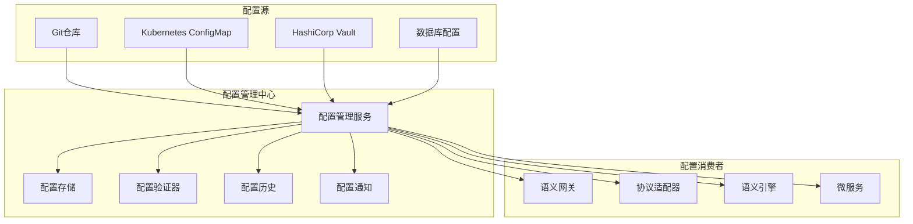

# IoT语义互操作配置管理中心详细实现

## 1. 配置管理架构设计

### 1.1 系统架构



### 1.2 核心组件设计

```rust
// src/config/manager.rs
use std::collections::HashMap;
use std::sync::Arc;
use tokio::sync::RwLock;
use serde::{Deserialize, Serialize};
use uuid::Uuid;

#[derive(Debug, Clone, Serialize, Deserialize)]
pub struct ConfigEntry {
    pub id: Uuid,
    pub key: String,
    pub value: serde_json::Value,
    pub version: u64,
    pub environment: String,
    pub namespace: String,
    pub created_at: chrono::DateTime<chrono::Utc>,
    pub updated_at: chrono::DateTime<chrono::Utc>,
    pub created_by: String,
    pub tags: HashMap<String, String>,
    pub schema_version: String,
}

#[derive(Debug, Clone, Serialize, Deserialize)]
pub struct ConfigVersion {
    pub version: u64,
    pub config_id: Uuid,
    pub changes: Vec<ConfigChange>,
    pub comment: String,
    pub created_at: chrono::DateTime<chrono::Utc>,
    pub created_by: String,
}

#[derive(Debug, Clone, Serialize, Deserialize)]
pub struct ConfigChange {
    pub field: String,
    pub old_value: Option<serde_json::Value>,
    pub new_value: serde_json::Value,
    pub operation: ChangeOperation,
}

#[derive(Debug, Clone, Serialize, Deserialize)]
pub enum ChangeOperation {
    Create,
    Update,
    Delete,
}

pub struct ConfigManager {
    storage: Arc<dyn ConfigStorage>,
    validator: Arc<dyn ConfigValidator>,
    notifier: Arc<dyn ConfigNotifier>,
    cache: Arc<RwLock<HashMap<String, ConfigEntry>>>,
    watchers: Arc<RwLock<HashMap<String, Vec<ConfigWatcher>>>>,
}

#[async_trait::async_trait]
pub trait ConfigStorage: Send + Sync {
    async fn get(&self, key: &str, environment: &str) -> Result<Option<ConfigEntry>, ConfigError>;
    async fn set(&self, entry: &ConfigEntry) -> Result<(), ConfigError>;
    async fn delete(&self, key: &str, environment: &str) -> Result<(), ConfigError>;
    async fn list(&self, namespace: &str, environment: &str) -> Result<Vec<ConfigEntry>, ConfigError>;
    async fn get_history(&self, key: &str, environment: &str) -> Result<Vec<ConfigVersion>, ConfigError>;
}

#[async_trait::async_trait]
pub trait ConfigValidator: Send + Sync {
    async fn validate(&self, entry: &ConfigEntry) -> Result<ValidationResult, ConfigError>;
    async fn validate_schema(&self, value: &serde_json::Value, schema: &str) -> Result<bool, ConfigError>;
}

#[async_trait::async_trait]
pub trait ConfigNotifier: Send + Sync {
    async fn notify_change(&self, change: &ConfigChange, entry: &ConfigEntry) -> Result<(), ConfigError>;
}

pub type ConfigWatcher = tokio::sync::mpsc::UnboundedSender<ConfigEvent>;

#[derive(Debug, Clone)]
pub enum ConfigEvent {
    Created(ConfigEntry),
    Updated(ConfigEntry, ConfigEntry), // (old, new)
    Deleted(ConfigEntry),
}

impl ConfigManager {
    pub fn new(
        storage: Arc<dyn ConfigStorage>,
        validator: Arc<dyn ConfigValidator>,
        notifier: Arc<dyn ConfigNotifier>,
    ) -> Self {
        Self {
            storage,
            validator,
            notifier,
            cache: Arc::new(RwLock::new(HashMap::new())),
            watchers: Arc::new(RwLock::new(HashMap::new())),
        }
    }
    
    pub async fn get_config(&self, key: &str, environment: &str) -> Result<Option<ConfigEntry>, ConfigError> {
        // 首先检查缓存
        let cache_key = format!("{}:{}", environment, key);
        {
            let cache = self.cache.read().await;
            if let Some(entry) = cache.get(&cache_key) {
                return Ok(Some(entry.clone()));
            }
        }
        
        // 从存储加载
        if let Some(entry) = self.storage.get(key, environment).await? {
            // 更新缓存
            let mut cache = self.cache.write().await;
            cache.insert(cache_key, entry.clone());
            Ok(Some(entry))
        } else {
            Ok(None)
        }
    }
    
    pub async fn set_config(&self, mut entry: ConfigEntry) -> Result<(), ConfigError> {
        // 验证配置
        let validation_result = self.validator.validate(&entry).await?;
        if !validation_result.is_valid {
            return Err(ConfigError::ValidationFailed(validation_result.errors));
        }
        
        // 获取旧版本（如果存在）
        let old_entry = self.get_config(&entry.key, &entry.environment).await?;
        
        // 设置版本号
        entry.version = old_entry.as_ref().map(|e| e.version + 1).unwrap_or(1);
        entry.updated_at = chrono::Utc::now();
        
        // 保存到存储
        self.storage.set(&entry).await?;
        
        // 更新缓存
        let cache_key = format!("{}:{}", entry.environment, entry.key);
        {
            let mut cache = self.cache.write().await;
            cache.insert(cache_key.clone(), entry.clone());
        }
        
        // 通知变更
        let change = if let Some(old) = old_entry {
            ConfigChange {
                field: "value".to_string(),
                old_value: Some(old.value),
                new_value: entry.value.clone(),
                operation: ChangeOperation::Update,
            }
        } else {
            ConfigChange {
                field: "value".to_string(),
                old_value: None,
                new_value: entry.value.clone(),
                operation: ChangeOperation::Create,
            }
        };
        
        self.notifier.notify_change(&change, &entry).await?;
        
        // 通知观察者
        self.notify_watchers(&entry, old_entry.as_ref()).await;
        
        Ok(())
    }
    
    pub async fn watch_config(&self, key: &str, environment: &str) -> tokio::sync::mpsc::UnboundedReceiver<ConfigEvent> {
        let (tx, rx) = tokio::sync::mpsc::unbounded_channel();
        let watch_key = format!("{}:{}", environment, key);
        
        let mut watchers = self.watchers.write().await;
        watchers.entry(watch_key).or_insert_with(Vec::new).push(tx);
        
        rx
    }
    
    async fn notify_watchers(&self, new_entry: &ConfigEntry, old_entry: Option<&ConfigEntry>) {
        let watch_key = format!("{}:{}", new_entry.environment, new_entry.key);
        let watchers = self.watchers.read().await;
        
        if let Some(watcher_list) = watchers.get(&watch_key) {
            let event = if let Some(old) = old_entry {
                ConfigEvent::Updated(old.clone(), new_entry.clone())
            } else {
                ConfigEvent::Created(new_entry.clone())
            };
            
            for watcher in watcher_list {
                let _ = watcher.send(event.clone());
            }
        }
    }
}

#[derive(Debug, thiserror::Error)]
pub enum ConfigError {
    #[error("Storage error: {0}")]
    Storage(String),
    #[error("Validation failed: {0:?}")]
    ValidationFailed(Vec<String>),
    #[error("Configuration not found")]
    NotFound,
    #[error("Serialization error: {0}")]
    Serialization(#[from] serde_json::Error),
}

#[derive(Debug, Clone)]
pub struct ValidationResult {
    pub is_valid: bool,
    pub errors: Vec<String>,
    pub warnings: Vec<String>,
}
```

## 2. 存储实现

### 2.1 PostgreSQL存储实现

```rust
// src/config/storage/postgres.rs
use sqlx::{PgPool, Row};
use super::*;

pub struct PostgresConfigStorage {
    pool: PgPool,
}

impl PostgresConfigStorage {
    pub fn new(pool: PgPool) -> Self {
        Self { pool }
    }
    
    pub async fn init_schema(&self) -> Result<(), sqlx::Error> {
        sqlx::query(r#"
            CREATE TABLE IF NOT EXISTS config_entries (
                id UUID PRIMARY KEY,
                key VARCHAR NOT NULL,
                value JSONB NOT NULL,
                version BIGINT NOT NULL,
                environment VARCHAR NOT NULL,
                namespace VARCHAR NOT NULL,
                created_at TIMESTAMPTZ NOT NULL,
                updated_at TIMESTAMPTZ NOT NULL,
                created_by VARCHAR NOT NULL,
                tags JSONB,
                schema_version VARCHAR NOT NULL,
                UNIQUE(key, environment)
            );
            
            CREATE TABLE IF NOT EXISTS config_versions (
                id UUID PRIMARY KEY,
                config_id UUID NOT NULL REFERENCES config_entries(id),
                version BIGINT NOT NULL,
                changes JSONB NOT NULL,
                comment TEXT,
                created_at TIMESTAMPTZ NOT NULL,
                created_by VARCHAR NOT NULL
            );
            
            CREATE INDEX IF NOT EXISTS idx_config_key_env ON config_entries(key, environment);
            CREATE INDEX IF NOT EXISTS idx_config_namespace_env ON config_entries(namespace, environment);
            CREATE INDEX IF NOT EXISTS idx_config_versions_config_id ON config_versions(config_id);
        "#).execute(&self.pool).await?;
        
        Ok(())
    }
}

#[async_trait::async_trait]
impl ConfigStorage for PostgresConfigStorage {
    async fn get(&self, key: &str, environment: &str) -> Result<Option<ConfigEntry>, ConfigError> {
        let row = sqlx::query(
            "SELECT id, key, value, version, environment, namespace, created_at, updated_at, created_by, tags, schema_version 
             FROM config_entries WHERE key = $1 AND environment = $2"
        )
        .bind(key)
        .bind(environment)
        .fetch_optional(&self.pool)
        .await
        .map_err(|e| ConfigError::Storage(e.to_string()))?;
        
        if let Some(row) = row {
            let tags: serde_json::Value = row.get("tags");
            let tags: HashMap<String, String> = serde_json::from_value(tags)
                .unwrap_or_default();
            
            Ok(Some(ConfigEntry {
                id: row.get("id"),
                key: row.get("key"),
                value: row.get("value"),
                version: row.get::<i64, _>("version") as u64,
                environment: row.get("environment"),
                namespace: row.get("namespace"),
                created_at: row.get("created_at"),
                updated_at: row.get("updated_at"),
                created_by: row.get("created_by"),
                tags,
                schema_version: row.get("schema_version"),
            }))
        } else {
            Ok(None)
        }
    }
    
    async fn set(&self, entry: &ConfigEntry) -> Result<(), ConfigError> {
        // 先保存版本历史
        if entry.version > 1 {
            if let Some(old_entry) = self.get(&entry.key, &entry.environment).await? {
                let changes = vec![ConfigChange {
                    field: "value".to_string(),
                    old_value: Some(old_entry.value),
                    new_value: entry.value.clone(),
                    operation: ChangeOperation::Update,
                }];
                
                let version = ConfigVersion {
                    version: old_entry.version,
                    config_id: old_entry.id,
                    changes,
                    comment: "Automated update".to_string(),
                    created_at: chrono::Utc::now(),
                    created_by: entry.created_by.clone(),
                };
                
                sqlx::query(
                    "INSERT INTO config_versions (id, config_id, version, changes, comment, created_at, created_by)
                     VALUES ($1, $2, $3, $4, $5, $6, $7)"
                )
                .bind(Uuid::new_v4())
                .bind(version.config_id)
                .bind(version.version as i64)
                .bind(serde_json::to_value(&version.changes).unwrap())
                .bind(&version.comment)
                .bind(version.created_at)
                .bind(&version.created_by)
                .execute(&self.pool)
                .await
                .map_err(|e| ConfigError::Storage(e.to_string()))?;
            }
        }
        
        // 保存或更新配置
        sqlx::query(
            "INSERT INTO config_entries (id, key, value, version, environment, namespace, created_at, updated_at, created_by, tags, schema_version)
             VALUES ($1, $2, $3, $4, $5, $6, $7, $8, $9, $10, $11)
             ON CONFLICT (key, environment) DO UPDATE SET
             value = $3, version = $4, updated_at = $8, tags = $10"
        )
        .bind(entry.id)
        .bind(&entry.key)
        .bind(&entry.value)
        .bind(entry.version as i64)
        .bind(&entry.environment)
        .bind(&entry.namespace)
        .bind(entry.created_at)
        .bind(entry.updated_at)
        .bind(&entry.created_by)
        .bind(serde_json::to_value(&entry.tags).unwrap())
        .bind(&entry.schema_version)
        .execute(&self.pool)
        .await
        .map_err(|e| ConfigError::Storage(e.to_string()))?;
        
        Ok(())
    }
    
    async fn delete(&self, key: &str, environment: &str) -> Result<(), ConfigError> {
        sqlx::query("DELETE FROM config_entries WHERE key = $1 AND environment = $2")
            .bind(key)
            .bind(environment)
            .execute(&self.pool)
            .await
            .map_err(|e| ConfigError::Storage(e.to_string()))?;
            
        Ok(())
    }
    
    async fn list(&self, namespace: &str, environment: &str) -> Result<Vec<ConfigEntry>, ConfigError> {
        let rows = sqlx::query(
            "SELECT id, key, value, version, environment, namespace, created_at, updated_at, created_by, tags, schema_version 
             FROM config_entries WHERE namespace = $1 AND environment = $2"
        )
        .bind(namespace)
        .bind(environment)
        .fetch_all(&self.pool)
        .await
        .map_err(|e| ConfigError::Storage(e.to_string()))?;
        
        let mut entries = Vec::new();
        for row in rows {
            let tags: serde_json::Value = row.get("tags");
            let tags: HashMap<String, String> = serde_json::from_value(tags)
                .unwrap_or_default();
            
            entries.push(ConfigEntry {
                id: row.get("id"),
                key: row.get("key"),
                value: row.get("value"),
                version: row.get::<i64, _>("version") as u64,
                environment: row.get("environment"),
                namespace: row.get("namespace"),
                created_at: row.get("created_at"),
                updated_at: row.get("updated_at"),
                created_by: row.get("created_by"),
                tags,
                schema_version: row.get("schema_version"),
            });
        }
        
        Ok(entries)
    }
    
    async fn get_history(&self, key: &str, environment: &str) -> Result<Vec<ConfigVersion>, ConfigError> {
        let config_entry = self.get(key, environment).await?
            .ok_or(ConfigError::NotFound)?;
        
        let rows = sqlx::query(
            "SELECT id, config_id, version, changes, comment, created_at, created_by
             FROM config_versions WHERE config_id = $1 ORDER BY version DESC"
        )
        .bind(config_entry.id)
        .fetch_all(&self.pool)
        .await
        .map_err(|e| ConfigError::Storage(e.to_string()))?;
        
        let mut versions = Vec::new();
        for row in rows {
            let changes: serde_json::Value = row.get("changes");
            let changes: Vec<ConfigChange> = serde_json::from_value(changes)
                .map_err(|e| ConfigError::Storage(e.to_string()))?;
            
            versions.push(ConfigVersion {
                version: row.get::<i64, _>("version") as u64,
                config_id: row.get("config_id"),
                changes,
                comment: row.get("comment"),
                created_at: row.get("created_at"),
                created_by: row.get("created_by"),
            });
        }
        
        Ok(versions)
    }
}
```

## 3. 配置验证器

### 3.1 JSON Schema验证器

```rust
// src/config/validator.rs
use jsonschema::{JSONSchema, ValidationError};
use std::collections::HashMap;

pub struct JsonSchemaValidator {
    schemas: HashMap<String, JSONSchema>,
}

impl JsonSchemaValidator {
    pub fn new() -> Self {
        let mut validator = Self {
            schemas: HashMap::new(),
        };
        
        // 加载预定义的模式
        validator.load_predefined_schemas();
        validator
    }
    
    fn load_predefined_schemas(&mut self) {
        // IoT网关配置模式
        let gateway_schema = serde_json::json!({
            "type": "object",
            "properties": {
                "server": {
                    "type": "object",
                    "properties": {
                        "host": {"type": "string"},
                        "port": {"type": "integer", "minimum": 1, "maximum": 65535},
                        "https": {"type": "boolean"}
                    },
                    "required": ["host", "port"]
                },
                "protocols": {
                    "type": "object",
                    "properties": {
                        "opcua": {"$ref": "#/definitions/protocol_config"},
                        "onem2m": {"$ref": "#/definitions/protocol_config"},
                        "wot": {"$ref": "#/definitions/protocol_config"},
                        "matter": {"$ref": "#/definitions/protocol_config"}
                    }
                },
                "semantic": {
                    "type": "object",
                    "properties": {
                        "reasoning_engine": {"type": "string"},
                        "cache_size": {"type": "integer", "minimum": 1},
                        "timeout_ms": {"type": "integer", "minimum": 100}
                    }
                }
            },
            "definitions": {
                "protocol_config": {
                    "type": "object",
                    "properties": {
                        "enabled": {"type": "boolean"},
                        "endpoint": {"type": "string"},
                        "timeout_ms": {"type": "integer", "minimum": 100},
                        "retry_count": {"type": "integer", "minimum": 0}
                    },
                    "required": ["enabled"]
                }
            },
            "required": ["server", "protocols"]
        });
        
        if let Ok(schema) = JSONSchema::compile(&gateway_schema) {
            self.schemas.insert("iot_gateway".to_string(), schema);
        }
        
        // 数据库配置模式
        let database_schema = serde_json::json!({
            "type": "object",
            "properties": {
                "url": {"type": "string", "pattern": "^postgresql://"},
                "pool_size": {"type": "integer", "minimum": 1, "maximum": 100},
                "timeout_seconds": {"type": "integer", "minimum": 1},
                "ssl_mode": {"type": "string", "enum": ["disable", "prefer", "require"]}
            },
            "required": ["url"]
        });
        
        if let Ok(schema) = JSONSchema::compile(&database_schema) {
            self.schemas.insert("database".to_string(), schema);
        }
        
        // 监控配置模式
        let monitoring_schema = serde_json::json!({
            "type": "object",
            "properties": {
                "metrics": {
                    "type": "object",
                    "properties": {
                        "enabled": {"type": "boolean"},
                        "interval_seconds": {"type": "integer", "minimum": 1},
                        "endpoint": {"type": "string"}
                    }
                },
                "logging": {
                    "type": "object",
                    "properties": {
                        "level": {"type": "string", "enum": ["trace", "debug", "info", "warn", "error"]},
                        "format": {"type": "string", "enum": ["json", "plain"]},
                        "output": {"type": "string", "enum": ["stdout", "file", "syslog"]}
                    }
                }
            }
        });
        
        if let Ok(schema) = JSONSchema::compile(&monitoring_schema) {
            self.schemas.insert("monitoring".to_string(), schema);
        }
    }
    
    pub fn add_schema(&mut self, name: String, schema: serde_json::Value) -> Result<(), String> {
        match JSONSchema::compile(&schema) {
            Ok(compiled_schema) => {
                self.schemas.insert(name, compiled_schema);
                Ok(())
            }
            Err(e) => Err(format!("Invalid schema: {}", e))
        }
    }
}

#[async_trait::async_trait]
impl ConfigValidator for JsonSchemaValidator {
    async fn validate(&self, entry: &ConfigEntry) -> Result<ValidationResult, ConfigError> {
        let mut errors = Vec::new();
        let mut warnings = Vec::new();
        
        // 基本验证
        if entry.key.is_empty() {
            errors.push("Configuration key cannot be empty".to_string());
        }
        
        if entry.namespace.is_empty() {
            errors.push("Configuration namespace cannot be empty".to_string());
        }
        
        if entry.environment.is_empty() {
            errors.push("Configuration environment cannot be empty".to_string());
        }
        
        // Schema验证
        if let Some(schema) = self.schemas.get(&entry.namespace) {
            if let Err(validation_errors) = schema.validate(&entry.value) {
                for error in validation_errors {
                    errors.push(format!("Schema validation error: {}", error));
                }
            }
        } else {
            warnings.push(format!("No schema found for namespace: {}", entry.namespace));
        }
        
        // 环境特定验证
        match entry.environment.as_str() {
            "production" => {
                // 生产环境严格验证
                if let Some(server) = entry.value.get("server") {
                    if let Some(host) = server.get("host") {
                        if host.as_str() == Some("localhost") || host.as_str() == Some("127.0.0.1") {
                            errors.push("Production environment cannot use localhost".to_string());
                        }
                    }
                }
            }
            "development" | "testing" => {
                // 开发/测试环境警告
                if let Some(ssl) = entry.value.get("ssl_enabled") {
                    if ssl.as_bool() == Some(false) {
                        warnings.push("SSL is disabled in development environment".to_string());
                    }
                }
            }
            _ => {}
        }
        
        Ok(ValidationResult {
            is_valid: errors.is_empty(),
            errors,
            warnings,
        })
    }
    
    async fn validate_schema(&self, value: &serde_json::Value, schema_name: &str) -> Result<bool, ConfigError> {
        if let Some(schema) = self.schemas.get(schema_name) {
            Ok(schema.validate(value).is_ok())
        } else {
            Err(ConfigError::Storage(format!("Schema not found: {}", schema_name)))
        }
    }
}
```

## 4. 配置通知器

### 4.1 多渠道通知实现

```rust
// src/config/notifier.rs
use tokio::sync::mpsc;

pub struct MultiChannelNotifier {
    webhook_client: reqwest::Client,
    webhook_urls: Vec<String>,
    event_sender: Option<mpsc::UnboundedSender<ConfigEvent>>,
}

impl MultiChannelNotifier {
    pub fn new(webhook_urls: Vec<String>) -> Self {
        Self {
            webhook_client: reqwest::Client::new(),
            webhook_urls,
            event_sender: None,
        }
    }
    
    pub fn with_event_channel(&mut self, sender: mpsc::UnboundedSender<ConfigEvent>) {
        self.event_sender = Some(sender);
    }
}

#[async_trait::async_trait]
impl ConfigNotifier for MultiChannelNotifier {
    async fn notify_change(&self, change: &ConfigChange, entry: &ConfigEntry) -> Result<(), ConfigError> {
        // 构造通知消息
        let notification = ConfigNotification {
            event_type: match change.operation {
                ChangeOperation::Create => "config.created".to_string(),
                ChangeOperation::Update => "config.updated".to_string(),
                ChangeOperation::Delete => "config.deleted".to_string(),
            },
            config_key: entry.key.clone(),
            environment: entry.environment.clone(),
            namespace: entry.namespace.clone(),
            version: entry.version,
            change: change.clone(),
            timestamp: chrono::Utc::now(),
        };
        
        // Webhook通知
        for webhook_url in &self.webhook_urls {
            let result = self.webhook_client
                .post(webhook_url)
                .json(&notification)
                .send()
                .await;
                
            if let Err(e) = result {
                eprintln!("Failed to send webhook notification: {}", e);
            }
        }
        
        // 事件通道通知
        if let Some(sender) = &self.event_sender {
            let event = match change.operation {
                ChangeOperation::Create => ConfigEvent::Created(entry.clone()),
                ChangeOperation::Update => {
                    // 这里需要构造旧的配置项，简化处理
                    ConfigEvent::Updated(entry.clone(), entry.clone())
                }
                ChangeOperation::Delete => ConfigEvent::Deleted(entry.clone()),
            };
            
            let _ = sender.send(event);
        }
        
        Ok(())
    }
}

#[derive(Debug, Clone, Serialize)]
struct ConfigNotification {
    event_type: String,
    config_key: String,
    environment: String,
    namespace: String,
    version: u64,
    change: ConfigChange,
    timestamp: chrono::DateTime<chrono::Utc>,
}
```

## 5. Web API接口

### 5.1 RESTful API实现

```rust
// src/config/api.rs
use axum::{
    routing::{get, post, put, delete},
    Router, Json, Path, Query,
    extract::State,
    response::IntoResponse,
    http::StatusCode,
};
use serde::{Deserialize, Serialize};
use std::sync::Arc;

pub struct ConfigApi {
    manager: Arc<ConfigManager>,
}

#[derive(Deserialize)]
struct CreateConfigRequest {
    key: String,
    value: serde_json::Value,
    environment: String,
    namespace: String,
    tags: Option<HashMap<String, String>>,
}

#[derive(Deserialize)]
struct UpdateConfigRequest {
    value: serde_json::Value,
    tags: Option<HashMap<String, String>>,
}

#[derive(Deserialize)]
struct ListConfigQuery {
    namespace: String,
    environment: String,
    tags: Option<String>, // JSON encoded tags filter
}

#[derive(Serialize)]
struct ApiResponse<T> {
    success: bool,
    data: Option<T>,
    error: Option<String>,
}

impl ConfigApi {
    pub fn new(manager: Arc<ConfigManager>) -> Self {
        Self { manager }
    }
    
    pub fn router(self) -> Router {
        Router::new()
            .route("/api/v1/config", post(Self::create_config))
            .route("/api/v1/config", get(Self::list_configs))
            .route("/api/v1/config/:environment/:key", get(Self::get_config))
            .route("/api/v1/config/:environment/:key", put(Self::update_config))
            .route("/api/v1/config/:environment/:key", delete(Self::delete_config))
            .route("/api/v1/config/:environment/:key/history", get(Self::get_config_history))
            .route("/api/v1/config/:environment/:key/watch", get(Self::watch_config))
            .with_state(Arc::new(self))
    }
    
    async fn create_config(
        State(api): State<Arc<ConfigApi>>,
        Json(request): Json<CreateConfigRequest>,
    ) -> impl IntoResponse {
        let entry = ConfigEntry {
            id: Uuid::new_v4(),
            key: request.key,
            value: request.value,
            version: 1,
            environment: request.environment,
            namespace: request.namespace,
            created_at: chrono::Utc::now(),
            updated_at: chrono::Utc::now(),
            created_by: "api".to_string(), // TODO: 从认证中获取
            tags: request.tags.unwrap_or_default(),
            schema_version: "1.0".to_string(),
        };
        
        match api.manager.set_config(entry.clone()).await {
            Ok(_) => {
                let response = ApiResponse {
                    success: true,
                    data: Some(entry),
                    error: None,
                };
                (StatusCode::CREATED, Json(response))
            }
            Err(e) => {
                let response = ApiResponse::<ConfigEntry> {
                    success: false,
                    data: None,
                    error: Some(e.to_string()),
                };
                (StatusCode::BAD_REQUEST, Json(response))
            }
        }
    }
    
    async fn get_config(
        State(api): State<Arc<ConfigApi>>,
        Path((environment, key)): Path<(String, String)>,
    ) -> impl IntoResponse {
        match api.manager.get_config(&key, &environment).await {
            Ok(Some(entry)) => {
                let response = ApiResponse {
                    success: true,
                    data: Some(entry),
                    error: None,
                };
                (StatusCode::OK, Json(response))
            }
            Ok(None) => {
                let response = ApiResponse::<ConfigEntry> {
                    success: false,
                    data: None,
                    error: Some("Configuration not found".to_string()),
                };
                (StatusCode::NOT_FOUND, Json(response))
            }
            Err(e) => {
                let response = ApiResponse::<ConfigEntry> {
                    success: false,
                    data: None,
                    error: Some(e.to_string()),
                };
                (StatusCode::INTERNAL_SERVER_ERROR, Json(response))
            }
        }
    }
    
    async fn update_config(
        State(api): State<Arc<ConfigApi>>,
        Path((environment, key)): Path<(String, String)>,
        Json(request): Json<UpdateConfigRequest>,
    ) -> impl IntoResponse {
        // 获取现有配置
        match api.manager.get_config(&key, &environment).await {
            Ok(Some(mut entry)) => {
                entry.value = request.value;
                if let Some(tags) = request.tags {
                    entry.tags = tags;
                }
                entry.updated_at = chrono::Utc::now();
                
                match api.manager.set_config(entry.clone()).await {
                    Ok(_) => {
                        let response = ApiResponse {
                            success: true,
                            data: Some(entry),
                            error: None,
                        };
                        (StatusCode::OK, Json(response))
                    }
                    Err(e) => {
                        let response = ApiResponse::<ConfigEntry> {
                            success: false,
                            data: None,
                            error: Some(e.to_string()),
                        };
                        (StatusCode::BAD_REQUEST, Json(response))
                    }
                }
            }
            Ok(None) => {
                let response = ApiResponse::<ConfigEntry> {
                    success: false,
                    data: None,
                    error: Some("Configuration not found".to_string()),
                };
                (StatusCode::NOT_FOUND, Json(response))
            }
            Err(e) => {
                let response = ApiResponse::<ConfigEntry> {
                    success: false,
                    data: None,
                    error: Some(e.to_string()),
                };
                (StatusCode::INTERNAL_SERVER_ERROR, Json(response))
            }
        }
    }
}
```

这个配置管理中心实现提供了完整的配置生命周期管理、多环境支持、版本控制和实时通知功能。
