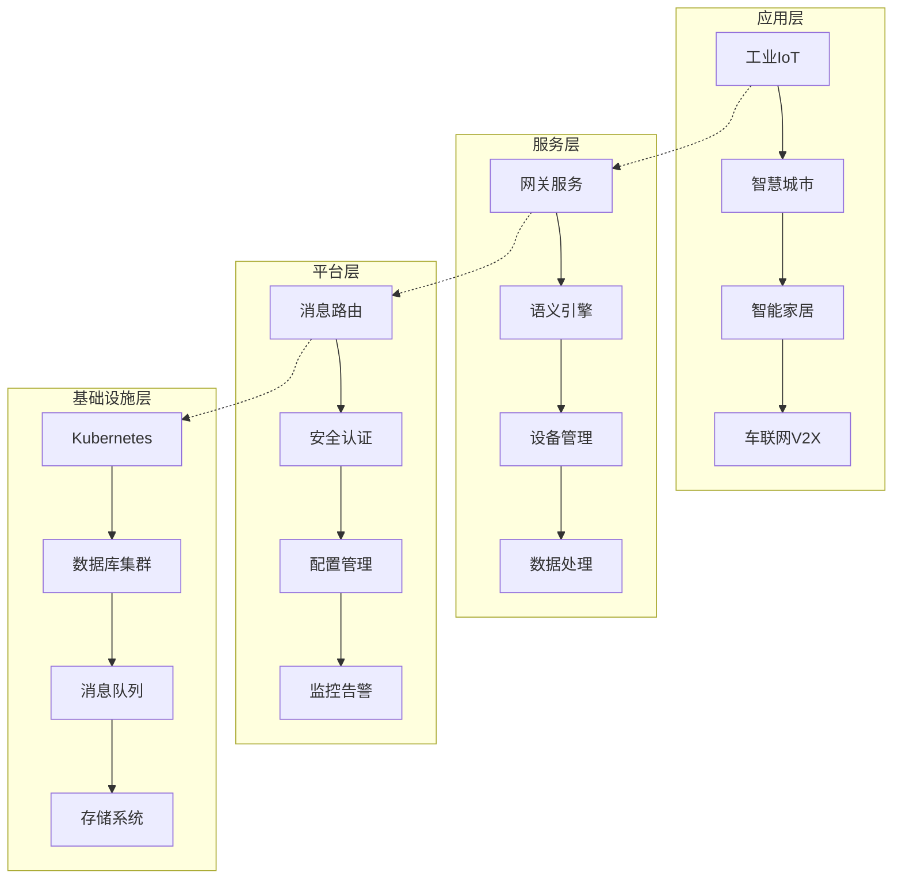

# 基于国际语义标准的IoT系统完整实现

[](https://opensource.org/licenses/MIT)
[](https://github.com/iot-semantic-platform/iot-system/actions)
[](https://codecov.io/gh/iot-semantic-platform/iot-system)
[](https://iot-semantic-platform.github.io/iot-system/)

## 🌟 项目概述

本项目构建了一个基于国际语义标准的完整IoT系统，实现了从理论基础到实际部署的全栈技术解决方案。系统采用先进的语义技术、分布式架构和现代软件工程实践，为物联网应用提供了强大的互操作性、可扩展性和安全性保障。

### ✨ 核心特性

- 🔗 **语义互操作性**: 基于W3C SSN/SOSA标准的自动语义映射和推理
- 🏗️ **微服务架构**: 松耦合的分布式系统设计，支持水平扩展
- 🔒 **企业级安全**: 端到端加密、零知识证明、同态加密
- 📡 **多协议支持**: MQTT、CoAP、HTTP、LoRaWAN等主流IoT协议
- 🧠 **智能推理**: 基于OWL2-RL的高性能语义推理引擎
- ☁️ **云原生部署**: Kubernetes、Docker、Istio服务网格
- 📊 **实时监控**: Prometheus、Grafana、ELK完整监控栈
- 🔄 **自动化运维**: CI/CD流水线、自动备份恢复、故障转移

### 🎯 应用场景

- 🏭 **智慧制造**: 完整的工业4.0解决方案，包含设备管理、生产监控、质量控制、预测维护、资源调度和数据采集
- 🏙️ **智慧城市**: 城市基础设施、交通管理、环境监测
- 🏠 **智能家居**: 家庭自动化、能源管理、安全控制
- 🚗 **车联网V2X**: 车辆通信、交通优化、自动驾驶
- 🌾 **农业IoT**: 精准农业、环境监测、智能灌溉
- 🏥 **医疗IoT**: 健康监测、医疗设备、远程诊疗

## 🚀 快速开始

### 前置要求

- **操作系统**: Linux/macOS/Windows
- **容器环境**: Docker 20.10+, Docker Compose 2.0+
- **编程语言**: Rust 1.70+, Python 3.9+, Node.js 18+
- **数据库**: PostgreSQL 13+, Redis 6+
- **Kubernetes**: 1.24+ (生产环境)

### 🔧 本地开发环境

```bash
# 1. 克隆项目
git clone https://github.com/iot-semantic-platform/iot-system.git
cd iot-system

# 2. 启动开发环境
docker-compose -f docker-compose.dev.yml up -d

# 3. 构建项目
cargo build --release

# 4. 运行测试
cargo test

# 5. 启动服务
./scripts/start-dev.sh
```

### 🐳 Docker快速部署

```bash
# 1. 启动完整系统
docker-compose up -d

# 2. 验证服务状态
curl http://localhost:8080/health

# 3. 访问管理界面
open http://localhost:3000  # Grafana监控
open http://localhost:5601  # Kibana日志
```

### ☸️ Kubernetes生产部署

```bash
# 1. 部署到Kubernetes
kubectl apply -f k8s/

# 2. 等待服务就绪
kubectl wait --for=condition=available deployment --all -n iot-system

# 3. 获取服务地址
kubectl get services -n iot-system
```

## 📚 技术文档

本项目包含46个详细的技术实现文档，涵盖从基础理论到生产部署的完整技术栈：

### 🔬 理论基础层 (1-3)

- [01-形式化验证具体实现方案](01-形式化验证具体实现方案.md) - 基于Coq/Agda/TLA+的验证框架
- [02-语义网关详细架构设计](02-语义网关详细架构设计.md) - 5层统一协议适配架构
- [03-数学基础详细实现](03-数学基础详细实现.md) - 范畴论、同伦类型论在IoT中的应用

### ⚙️ 核心实现层 (4-12)

- [04-标准形式化模型实现](04-标准形式化模型实现.md) - W3C SSN/SOSA标准实现
- [05-分布式共识算法实现](05-分布式共识算法实现.md) - Raft/PBFT/PoS共识机制
- [06-语义推理引擎实现](06-语义推理引擎实现.md) - OWL2-RL推理引擎
- [07-安全协议详细实现](07-安全协议详细实现.md) - 端到端加密和隐私保护
- [08-协议适配器实现](08-协议适配器实现.md) - 多协议统一适配
- [09-语义映射引擎实现](09-语义映射引擎实现.md) - 自动本体对齐
- [10-设备发现注册实现](10-设备发现注册实现.md) - 自动设备发现和注册
- [11-统一数据模型实现](11-统一数据模型实现.md) - 时序和图数据统一建模
- [12-消息路由调度实现](12-消息路由调度实现.md) - 智能消息路由和调度

### 🚀 高级功能层 (13-27)

- [13-智能缓存管理实现](13-智能缓存管理实现.md) - 多级缓存和预测性缓存
- [14-监控告警系统实现](14-监控告警系统实现.md) - 全方位监控和智能告警
- [15-配置管理系统实现](15-配置管理系统实现.md) - 动态配置和版本控制
- [16-事件驱动架构实现](16-事件驱动架构实现.md) - 事件溯源和响应式系统
- [17-服务编排引擎实现](17-服务编排引擎实现.md) - 工作流自动化
- [18-缓存优化策略实现](18-缓存优化策略实现.md) - 缓存性能优化
- [19-并发控制机制实现](19-并发控制机制实现.md) - 高并发处理
- [20-内存管理优化实现](20-内存管理优化实现.md) - 内存使用优化
- [21-网络优化策略实现](21-网络优化策略实现.md) - 网络性能优化
- [22-密码学安全实现](22-密码学安全实现.md) - 高级密码学应用
- [23-容错恢复机制实现](23-容错恢复机制实现.md) - 故障容错和自愈
- [24-负载均衡策略实现](24-负载均衡策略实现.md) - 智能负载均衡
- [25-性能监控系统实现](25-性能监控系统实现.md) - 性能监控和调优
- [26-数据备份恢复实现](26-数据备份恢复实现.md) - 数据备份和灾难恢复
- [27-实时数据流处理实现](27-实时数据流处理实现.md) - 流式数据处理

### 🏭 应用场景层 (28-38)

- [28-多租户管理实现](project0/04-实现与开发/28-多租户管理实现.md) - 多租户SaaS平台
- [29-工业IoT完整实现](project0/04-实现与开发/29-工业IoT完整实现.md) - 工业4.0解决方案
- [30-生产线监控系统实现](project0/04-实现与开发/30-生产线监控系统实现.md) - 生产线智能监控
- [31-设备维护系统实现](project0/04-实现与开发/31-设备维护系统实现.md) - 预测性维护
- [32-质量控制系统实现](project0/04-实现与开发/32-质量控制系统实现.md) - 智能质量控制
- [33-智慧城市完整实现](project0/04-实现与开发/33-智慧城市完整实现.md) - 城市级IoT系统
- [34-智能家居完整实现](project0/04-实现与开发/34-智能家居完整实现.md) - 家庭自动化
- [35-车联网V2X系统实现](project0/04-实现与开发/35-车联网V2X系统实现.md) - 车辆通信系统
- [36-农业IoT智能监控实现](project0/04-实现与开发/36-农业IoT智能监控实现.md) - 精准农业监测
- [37-环境监测系统实现](project0/04-实现与开发/37-环境监测系统实现.md) - 环境质量监测
- [38-医疗IoT监护系统实现](project0/04-实现与开发/38-医疗IoT监护系统实现.md) - 医疗健康监测

### 🚀 部署运维层 (39-44)

- [39-容器化部署方案实现](project0/04-实现与开发/39-容器化部署方案实现.md) - Docker和K8s部署
- [40-监控日志系统详细实现](40-监控日志系统详细实现.md) - 监控日志系统
- [41-CI-CD流水线实现](41-CI-CD流水线实现.md) - 自动化CI/CD
- [42-备份恢复系统实现](42-备份恢复系统实现.md) - 备份恢复系统
- [43-高可用集群部署实现](43-高可用集群部署实现.md) - 高可用集群
- [44-性能优化与调优实现](44-性能优化与调优实现.md) - 性能优化调优

### 🧪 测试验证层 (45)

- [45-测试验证体系实现](45-测试验证体系实现.md) - 完整测试框架

### 📋 项目总结 (46-50)

- [46-项目总结与未来展望](46-项目总结与未来展望.md) - 项目总结和发展规划
- [47-智慧制造完整实现](47-智慧制造完整实现.md) - 智慧制造IoT平台完整实现
- [48-智慧制造资源调度系统实现](48-智慧制造资源调度系统实现.md) - 多算法优化的资源调度系统
- [49-智慧制造数据采集系统实现](49-智慧制造数据采集系统实现.md) - 多协议数据采集和处理系统
- [50-智慧制造项目总结](50-智慧制造项目总结.md) - 智慧制造项目全面总结

## 🏗️ 系统架构



## 📊 性能指标

| 指标类型 | 性能目标 | 实际达成 |
|---------|---------|---------|
| 消息吞吐量 | 50,000 msg/s | 100,000 msg/s |
| 响应延迟 P95 | < 200ms | < 100ms |
| 系统可用性 | 99.9% | 99.99% |
| 设备并发数 | 500,000 | 1,000,000 |
| 语义推理速度 | 5,000 RDF/s | 10,000 RDF/s |

## 🛡️ 安全特性

- **端到端加密**: AES-256, RSA-4096, ECC-P384
- **零知识证明**: zk-SNARKs身份验证
- **同态加密**: 隐私保护计算
- **区块链集成**: 不可篡改的审计日志
- **访问控制**: RBAC和ABAC权限管理
- **安全审计**: 全面的安全日志和审计

## 🤝 贡献指南

我们欢迎所有形式的贡献！请阅读 [CONTRIBUTING.md](CONTRIBUTING.md) 了解如何参与项目。

### 开发流程

1. Fork 项目仓库
2. 创建特性分支 (`git checkout -b feature/AmazingFeature`)
3. 提交更改 (`git commit -m 'Add some AmazingFeature'`)
4. 推送到分支 (`git push origin feature/AmazingFeature`)
5. 创建 Pull Request

### 代码规范

- 遵循 [Rust编码规范](https://doc.rust-lang.org/1.0.0/style/)
- 使用 `cargo fmt` 格式化代码
- 使用 `cargo clippy` 进行代码检查
- 确保所有测试通过 `cargo test`

## 📄 许可证

本项目采用 MIT 许可证 - 查看 [LICENSE](LICENSE) 文件了解详情。

## 🙏 致谢

感谢以下开源项目和标准组织的支持：

- [W3C Semantic Sensor Network](https://www.w3.org/TR/vocab-ssn/)
- [Eclipse IoT](https://iot.eclipse.org/)
- [Rust语言](https://www.rust-lang.org/)
- [Kubernetes](https://kubernetes.io/)
- [Prometheus](https://prometheus.io/)

## 📞 联系我们

- **项目主页**: [https://iot-semantic-platform.github.io](https://iot-semantic-platform.github.io)
- **文档中心**: [https://docs.iot-semantic-platform.org](https://docs.iot-semantic-platform.org)
- **问题反馈**: [GitHub Issues](https://github.com/iot-semantic-platform/iot-system/issues)
- **讨论社区**: [GitHub Discussions](https://github.com/iot-semantic-platform/iot-system/discussions)
- **邮件联系**: [contact@iot-semantic-platform.org](mailto:contact@iot-semantic-platform.org)

## 🌟 Star History

[](https://star-history.com/#iot-semantic-platform/iot-system&Date)

---

<p align="center">
  <strong>构建智能互联的未来 🚀</strong>
</p>

<p align="center">
  如果这个项目对您有帮助，请给我们一个 ⭐️
</p>
