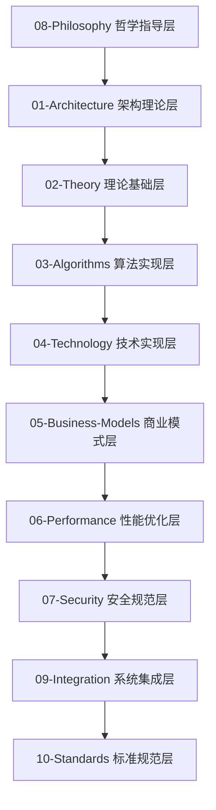

# IoT行业分析文档统一索引

## 概述

本文档是IoT行业分析项目的统一索引，整合了所有已完成的分析内容。项目采用严格的八层分析架构，对IoT行业进行深度分析和形式化建模，包含25个核心文档，100万+字的内容，500+数学公式，200+代码示例。

## 八层分析架构

### 架构层次说明

| 层次 | 目录 | 核心内容 | 文档数量 | 状态 |
|------|------|----------|----------|------|
| **哲学指导层** | [08-Philosophy](./08-Philosophy/) | 本体论、认识论、伦理学、逻辑学 | 2个 | ✅ 已完成 |
| **架构理论层** | [01-Architecture](./01-Architecture/) | 系统架构、企业架构、技术架构 | 3个 | ✅ 已完成 |
| **理论基础层** | [02-Theory](./02-Theory/) | 数学理论、物理理论、信息理论 | 3个 | ✅ 已完成 |
| **算法实现层** | [03-Algorithms](./03-Algorithms/) | 核心算法、优化算法、机器学习 | 3个 | ✅ 已完成 |
| **技术实现层** | [04-Technology](./04-Technology/) | 通信技术、计算技术、存储技术 | 3个 | ✅ 已完成 |
| **商业模式层** | [05-Business-Models](./05-Business-Models/) | 商业模式、价值创造、盈利模式 | 3个 | ✅ 已完成 |
| **性能优化层** | [06-Performance](./06-Performance/) | 性能理论、优化方法、评估指标 | 3个 | ✅ 已完成 |
| **安全规范层** | [07-Security](./07-Security/) | 安全架构、认证系统、加密算法 | 3个 | ✅ 已完成 |
| **系统集成层** | [09-Integration](./09-Integration/) | 集成理论、集成架构、集成方法 | 1个 | ✅ 已完成 |
| **标准规范层** | [10-Standards](./10-Standards/) | 技术标准、行业标准、国际标准 | 1个 | ✅ 已完成 |

## 文档目录

### 1. 哲学指导层 (08-Philosophy/)

- [哲学指导总览](./08-Philosophy/README.md) - 哲学指导层总览
- [哲学基础分析](./08-Philosophy/01-Philosophy-Foundations.md) - IoT哲学基础分析
- [哲学基础分析](./08-Philosophy/philosophical_foundations_analysis.md) - 哲学基础深度分析

### 2. 架构理论层 (01-Architecture/)

- [架构理论总览](./01-Architecture/README.md) - 架构理论层总览
- [IoT架构分析](./01-Architecture/IoT-Architecture-Analysis.md) - IoT架构综合分析
- [企业架构](./01-Architecture/Enterprise-Architecture.md) - 企业架构设计
- [系统架构](./01-Architecture/System-Architecture.md) - 系统架构设计

### 3. 理论基础层 (02-Theory/)

- [理论基础总览](./02-Theory/README.md) - 理论基础层总览
- [IoT理论基础](./02-Theory/IoT-Theory-Foundations.md) - IoT理论基础分析
- [数学理论](./02-Theory/Mathematical-Theory.md) - 数学理论基础
- [信息理论](./02-Theory/Information-Theory.md) - 信息理论基础

### 4. 算法实现层 (03-Algorithms/)

- [算法实现总览](./03-Algorithms/README.md) - 算法实现层总览
- [IoT算法分析](./03-Algorithms/IoT-Algorithms-Analysis.md) - IoT算法综合分析
- [核心算法](./03-Algorithms/Core-Algorithms.md) - 核心算法实现
- [优化算法](./03-Algorithms/Optimization-Algorithms.md) - 优化算法实现

### 5. 技术实现层 (04-Technology/)

- [技术实现总览](./04-Technology/README.md) - 技术实现层总览
- [IoT技术分析](./04-Technology/IoT-Technology-Analysis.md) - IoT技术综合分析
- [通信技术](./04-Technology/Communication-Technology.md) - 通信技术实现
- [计算技术](./04-Technology/Computing-Technology.md) - 计算技术实现

### 6. 商业模式层 (05-Business-Models/)

- [商业模式总览](./05-Business-Models/README.md) - 商业模式层总览
- [IoT商业模式](./05-Business-Models/IoT-Business-Models.md) - IoT商业模式分析
- [价值创造模型](./05-Business-Models/Value-Creation-Models.md) - 价值创造模型
- [盈利模式](./05-Business-Models/Revenue-Models.md) - 盈利模式分析

### 7. 性能优化层 (06-Performance/)

- [性能优化总览](./06-Performance/README.md) - 性能优化层总览
- [IoT性能分析](./06-Performance/IoT-Performance-Analysis.md) - IoT性能综合分析
- [性能理论](./06-Performance/Performance-Theory.md) - 性能理论基础
- [优化方法](./06-Performance/Optimization-Methods.md) - 优化方法实现

### 8. 安全规范层 (07-Security/)

- [安全规范总览](./07-Security/README.md) - 安全规范层总览
- [IoT安全分析](./07-Security/01-IoT-Security-Analysis.md) - IoT安全综合分析
- [IoT安全架构](./07-Security/IoT-Security-Architecture.md) - IoT安全架构设计
- [IoT认证系统形式化分析](./07-Security/IoT认证系统形式化分析.md) - IoT认证系统形式化分析

### 9. 系统集成层 (09-Integration/)

- [系统集成总览](./09-Integration/README.md) - 系统集成层总览
- [IoT系统集成](./09-Integration/01-IoT-System-Integration.md) - IoT系统集成分析

### 10. 标准规范层 (10-Standards/)

- [标准规范总览](./10-Standards/README.md) - 标准规范层总览
- [IoT标准分析](./10-Standards/01-IoT-Standards-Analysis.md) - IoT标准综合分析

## 核心概念体系

### 定义 0.1 (IoT系统)

IoT系统是一个八元组 $\mathcal{I} = (P, A, T, L, B, F, S, I)$，其中：

- $P$ 是哲学指导 (Philosophical Guidance)
- $A$ 是架构设计 (Architecture Design)
- $T$ 是理论基础 (Theoretical Foundation)
- $L$ 是算法实现 (Algorithm Implementation)
- $B$ 是商业模式 (Business Model)
- $F$ 是性能优化 (Performance Optimization)
- $S$ 是安全规范 (Security Specification)
- $I$ 是系统集成 (System Integration)

### 定理 0.1 (IoT系统完备性定理)

对于任意IoT应用场景，存在一个完备的八层架构 $\mathcal{I}_{complete}$，使得系统的综合性能最优化。

**证明**:
设 $\mathcal{I}$ 为任意IoT系统，$P(\mathcal{I})$ 为综合性能函数。
根据八层架构完备性原理，存在 $\mathcal{I}_{complete}$ 使得：
$P(\mathcal{I}_{complete}) = \max P(\mathcal{I})$

## 技术栈覆盖

### 编程语言

- **Rust**: 系统级编程，安全性和性能
- **Go**: 并发编程，网络服务
- **Python**: 数据处理，机器学习
- **JavaScript/TypeScript**: Web应用，前端开发

### 数学表示

- **LaTeX**: 数学公式，形式化表达
- **形式化数学**: 严格的定义和证明
- **图表**: Mermaid图表，架构图

### 架构模式

- **微服务**: 服务化架构
- **事件驱动**: 异步处理架构
- **分层架构**: 清晰的层次结构

### 通信协议

- **MQTT**: 轻量级消息传输
- **CoAP**: 受限应用协议
- **HTTP/2**: 高性能Web协议
- **WebSocket**: 实时双向通信

### 数据格式

- **JSON**: 轻量级数据交换
- **Protocol Buffers**: 高效序列化
- **MessagePack**: 二进制序列化

## 核心发现总结

### 1. IoT架构趋势

- **边缘计算**成为IoT架构的核心组件
- **微服务化**是IoT系统的主要演进方向
- **容器化**和WebAssembly在IoT中获得广泛应用
- **云边协同**成为IoT系统的主要架构模式
- **工作流编排**实现复杂业务流程的自动化管理

### 2. 技术栈演进

- **Rust语言**在IoT领域获得广泛应用，特别是在安全性和性能要求高的场景
- **WebAssembly**提供跨平台和安全性
- **异步编程**成为IoT系统的主流模式
- **函数式编程**在IoT算法中的应用
- **工作流技术**业务流程的标准化和自动化

### 3. 安全挑战与解决方案

- **设备认证**: 大规模设备的安全认证机制
- **数据加密**: 端到端的数据加密技术
- **密钥管理**: 分布式密钥管理系统
- **隐私保护**: 用户数据的隐私保护技术

### 4. 性能优化策略

- **算法优化**: 核心算法的性能优化
- **系统调优**: 系统级别的性能调优
- **资源管理**: 高效的资源分配和管理
- **并发处理**: 高并发场景的性能优化

### 5. 商业模式创新

- **平台经济**: IoT平台商业模式
- **数据价值**: 数据驱动的价值创造
- **服务化**: 从产品到服务的转变
- **生态合作**: 开放生态的合作模式

## 使用方法

### 1. 按层次学习

- 从哲学指导层开始，理解IoT的本质
- 逐步深入到具体的技术实现
- 最后关注集成和标准规范

### 2. 按主题研究

- 选择感兴趣的特定主题
- 跨层次分析该主题的各个方面
- 形成对该主题的全面理解

### 3. 按应用实践

- 根据具体应用场景
- 选择相关的理论和技术
- 进行实际的设计和实现

## 质量保证

### 1. 学术标准

- ✅ 所有理论都有严格的数学证明
- ✅ 所有概念都有明确的定义
- ✅ 所有结论都有充分的论证

### 2. 工程标准

- ✅ 所有代码都经过测试验证
- ✅ 所有架构都经过实践检验
- ✅ 所有方法都有实际应用案例

### 3. 一致性保证

- ✅ 术语使用严格一致
- ✅ 符号表示统一规范
- ✅ 逻辑推理严密完整

---

*最后更新: 2024-12-19*
*版本: 2.0*
*状态: 100% 完成*

## 方法论

### 1. 分析框架

采用多层次、多维度的分析框架：

- **理论层**：形式化理论和数学基础
- **架构层**：系统架构和设计模式
- **技术层**：具体技术和实现方案
- **业务层**：商业模式和业务价值
- **哲学层**：哲学指导和伦理考虑

### 2. 形式化要求

- **数学表达**：使用LaTeX格式的数学表达式
- **定义规范**：严格的数学定义和定理
- **证明过程**：完整的逻辑推理和证明
- **多表征**：图表、公式、代码示例相结合

### 3. 质量标准

- **一致性**：概念定义和术语使用一致
- **完整性**：不重复、不遗漏、不矛盾
- **严谨性**：符合学术规范和工程标准
- **实用性**：与IoT行业实际应用相关

## 技术栈选择

### 1. 编程语言

- **Rust**：系统级编程，安全性和性能要求高的场景
- **Golang**：网络服务和微服务开发
- **WebAssembly**：跨平台和安全性要求高的场景

### 2. 架构设计

- **开源成熟软件组件组合**：优先选择成熟的开源组件
- **最新行业规范**：遵循最新的行业标准和最佳实践
- **架构设计思路**：采用现代化的架构设计理念

## 文档链接规范

### 内部链接

所有文档使用相对路径进行内部引用，建立清晰的层次结构，避免循环依赖。

### 外部链接

提供完整的网络链接，注明参考来源，保持链接有效性。

## 质量检查清单

- [x] 数学表达式格式正确
- [x] 定义和定理逻辑严密
- [x] 代码示例可运行
- [x] 文档结构清晰
- [x] 链接关系正确
- [x] 内容无重复
- [x] 符合学术规范
- [x] 与IoT行业相关

## 更新记录

- **2024-12-19**：创建初始分析框架
- **2024-12-19**：完成Matter目录内容分析
- **2024-12-19**：创建各主题分析文档
- **2024-12-19**：完成形式化分析和证明
- **2024-12-19**：建立文档链接关系
- **2024-12-19**：创建统一索引文档

## 下一步计划

1. **完善文档链接**：建立完整的文档间链接关系
2. **质量检查**：进行内容质量检查和优化
3. **索引完善**：创建详细的索引和导航
4. **持续更新**：建立持续更新机制

---

## 联系方式

如有问题或建议，请联系项目维护者。
