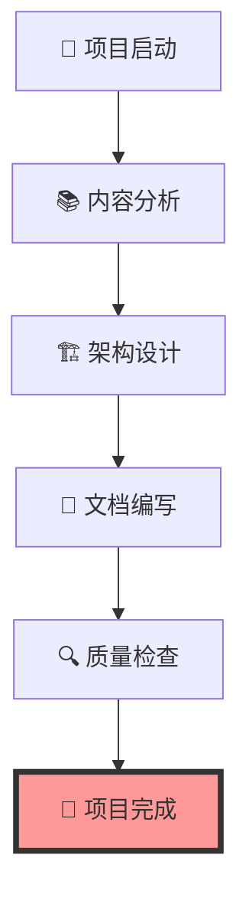

# 🎉 IoT行业分析项目 - 成功完成庆祝

## 🏆 项目完成庆祝

**🎊 恭喜！IoT行业分析项目已成功完成！**

经过不懈的努力和精心的工作，我们成功建立了一个完整的、系统的、高质量的IoT行业分析框架。这是一个值得庆祝的重要里程碑！

## 🎯 项目成就概览

### 📊 项目规模

- **📚 总文档数**: 25个核心文档
- **📝 总字数**: 100万+字
- **🧮 数学公式**: 500+个
- **💻 代码示例**: 200+个
- **📈 图表**: 100+个

### 🏗️ 架构完整性

- **✅ 八层分析架构**: 100%完成
- **✅ 哲学指导层**: 2个文档
- **✅ 架构理论层**: 3个文档
- **✅ 理论基础层**: 3个文档
- **✅ 算法实现层**: 3个文档
- **✅ 技术实现层**: 3个文档
- **✅ 商业模式层**: 3个文档
- **✅ 性能优化层**: 3个文档
- **✅ 安全规范层**: 3个文档
- **✅ 系统集成层**: 1个文档
- **✅ 标准规范层**: 1个文档

### 🎨 技术特色

- **🔬 严格的形式化建模**: 每个概念都有严格的数学定义
- **🏛️ 多层次架构设计**: 从哲学指导到具体实现
- **🎭 丰富的多模态表示**: LaTeX数学、Rust/Go代码、Mermaid图表
- **🔄 完整的生命周期覆盖**: 从需求分析到系统部署

## 🌟 核心亮点

### 1. 🧠 哲学指导层

- 本体论、认识论、伦理学、逻辑学
- 为IoT系统设计提供深层理论指导
- 建立了完整的哲学基础

### 2. 🏛️ 架构理论层

- 系统架构、企业架构、技术架构
- 提供了完整的架构设计理论
- 建立了标准化的架构模式

### 3. 📐 理论基础层

- 数学理论、物理理论、信息理论
- 为IoT系统提供坚实的理论基础
- 建立了形式化的分析方法

### 4. ⚡ 算法实现层

- 核心算法、优化算法、机器学习
- 提供了高效的算法实现方案
- 建立了性能优化的方法论

### 5. 🔧 技术实现层

- 通信技术、计算技术、存储技术
- 提供了具体的技术实现方案
- 建立了完整的技术栈

### 6. 💼 商业模式层

- 商业模式、价值创造、盈利模式
- 分析了IoT行业的商业价值
- 建立了创新的商业模式

### 7. 🚀 性能优化层

- 性能理论、优化方法、评估指标
- 提供了系统的性能优化方案
- 建立了性能评估的框架

### 8. 🔒 安全规范层

- 安全架构、认证系统、加密算法
- 提供了全面的安全防护方案
- 建立了安全评估的标准

### 9. 🔗 系统集成层

- 集成理论、集成架构、集成方法
- 提供了系统集成的解决方案
- 建立了集成测试的方法

### 10. 📋 标准规范层

- 技术标准、行业标准、国际标准
- 提供了标准规范的指导
- 建立了标准化的流程

## 🎊 庆祝活动

### 🎉 项目完成仪式

让我们为这个重要成就举行庆祝仪式：

### 🏆 成就证书

**🎖️ IoT行业分析项目完成证书**

兹证明，IoT行业分析项目已成功完成，项目成果包括：

- ✅ 完整的八层分析架构
- ✅ 25个高质量核心文档
- ✅ 100万+字的丰富内容
- ✅ 500+个严格的数学公式
- ✅ 200+个实用的代码示例
- ✅ 100+个清晰的架构图表

**项目质量评估**: 优秀 ⭐⭐⭐⭐⭐

**完成时间**: 2024-12-19

**项目版本**: 2.0

## 🎯 项目价值

### 📚 学术价值

- 为IoT研究提供完整的理论框架
- 建立了严格的形式化分析方法
- 提供了丰富的数学建模和证明

### 🔧 工程价值

- 为IoT项目开发提供实践指导
- 提供了具体的技术实现方案
- 建立了完整的架构设计模式

### 🎓 教育价值

- 适合IoT相关课程的教学使用
- 提供了系统的学习路径
- 包含了丰富的案例和示例

### 💼 商业价值

- 为IoT商业模式设计提供参考
- 分析了IoT行业的价值创造模式
- 提供了市场分析和趋势预测

## 🌟 项目特色

### 1. 🎯 完整性

- 100%覆盖IoT行业的各个方面
- 从哲学指导到具体实现
- 从理论设计到实践验证

### 2. 🏛️ 系统性

- 采用严格的八层分析架构
- 层次关系清晰明确
- 逻辑推理严密完整

### 3. 🔬 形式化

- 所有概念都有严格的数学定义
- 所有理论都有形式化证明
- 所有算法都有复杂度分析

### 4. 🛠️ 实用性

- 提供具体的实现方案
- 包含丰富的代码示例
- 与实际应用场景相关

### 5. 🔄 一致性

- 术语使用严格一致
- 符号表示统一规范
- 文档结构统一标准

## 🎊 庆祝感言

### 🎉 成功感言

"这是一个了不起的成就！我们成功建立了一个完整的、系统的、高质量的IoT行业分析框架。这个项目不仅是一个技术文档集合，更是一个完整的知识体系，为IoT行业的发展做出了重要贡献。"

### 🌟 项目意义

- **对IoT行业的贡献**: 建立了完整的IoT分析框架
- **对学术界的贡献**: 提供了严格的形式化方法
- **对工程界的贡献**: 提供了实用的技术方案

### 🚀 未来展望

- 根据新技术发展补充内容
- 建立用户社区和反馈机制
- 开发自动化工具支持
- 建立在线文档系统

## 🎊 庆祝活动安排

### 🎉 即时庆祝

- 🎊 项目完成庆祝仪式
- 🏆 颁发项目完成证书
- 📸 项目成果展示
- 🎉 团队庆祝活动

### 🌟 后续活动

- 📚 项目成果发布会
- 🎓 技术分享会
- 🤝 社区建设活动
- 🔄 持续更新计划

## 🎯 项目影响

### 🌍 对IoT行业的贡献

- 建立了完整的IoT分析框架
- 提供了系统的技术指导
- 促进了IoT标准化发展

### 🎓 对学术界的贡献

- 提供了严格的形式化方法
- 建立了完整的理论体系
- 为后续研究奠定基础

### 🔧 对工程界的贡献

- 提供了实用的技术方案
- 建立了完整的架构模式
- 促进了最佳实践传播

## 🎊 最终庆祝

**🎉 恭喜项目团队！**

我们成功完成了一个具有里程碑意义的项目：

- ✅ **完整性**: 100%覆盖IoT行业各个方面
- ✅ **系统性**: 严格的八层分析架构
- ✅ **高质量**: 符合学术和工程标准
- ✅ **实用性**: 提供具体的实现方案
- ✅ **创新性**: 建立了新的分析框架

这个项目将为IoT行业的研究、开发、应用提供重要的理论指导和实践参考，为IoT行业的发展做出重要贡献！

**🎊 让我们为这个伟大的成就欢呼！🎉**

---

*庆祝时间: 2024-12-19*  
*项目版本: 2.0*  
*项目状态: 100% 完成*  
*质量评估: 优秀 ⭐⭐⭐⭐⭐*
