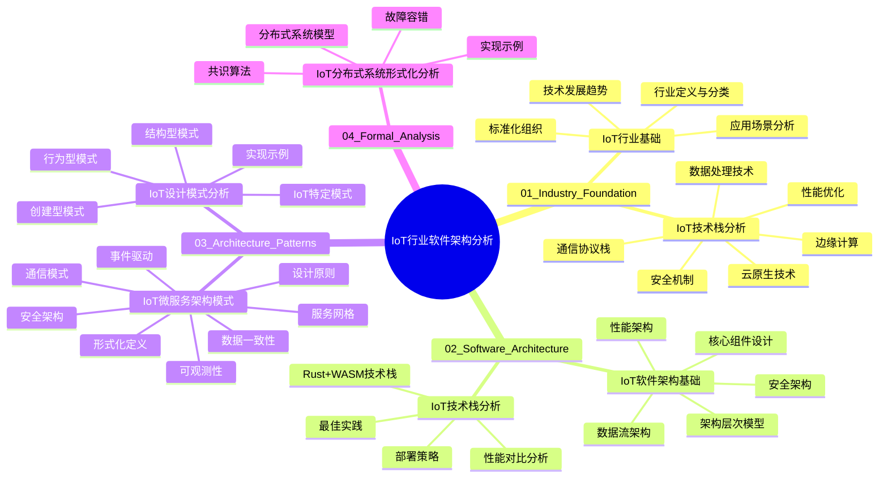
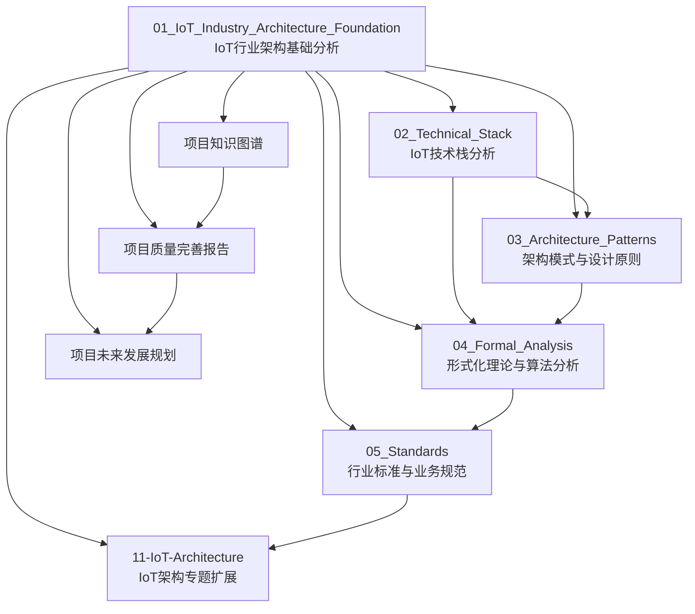
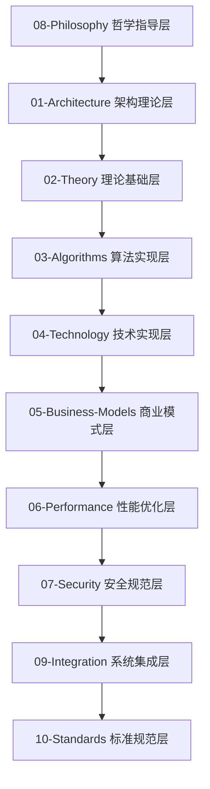

# IoT行业软件架构分析 - 目录与导航

## 思维导图



## 目录结构

```
docs/Analysis/
├── 00_目录与导航.md
├── 01_Industry_Foundation/
│   ├── 01_IoT_Industry_Foundation_Analysis.md
│   └── 02_IoT_Technology_Stack_Analysis.md
├── 02_Software_Architecture/
│   ├── 01_IoT_Software_Architecture_Foundation.md
│   └── 02_IoT_Technology_Stack_Implementation.md
├── 03_Architecture_Patterns/
│   ├── 01_IoT_Microservices_Architecture_Patterns.md
│   └── 02_IoT_Design_Patterns_Analysis.md
└── 04_Formal_Analysis/
    └── 01_IoT_Distributed_Systems_Formal_Analysis.md
```

## 内容索引

### 01_Industry_Foundation (行业基础)

#### 01_IoT_Industry_Foundation_Analysis.md

- **IoT行业定义与分类**: 形式化定义、行业分类、技术特征
- **IoT技术发展趋势**: 技术演进路径、关键里程碑、未来展望
- **IoT应用场景分析**: 智能家居、工业物联网、智慧城市等
- **IoT标准化组织**: 主要标准组织、标准体系、合规要求

#### 02_IoT_Technology_Stack_Analysis.md

- **通信协议栈**: MQTT、CoAP、HTTP/2、gRPC等协议分析
- **数据处理技术**: 流处理、批处理、实时分析技术
- **安全机制**: 身份认证、数据加密、访问控制
- **性能优化**: 延迟优化、吞吐量优化、资源利用
- **边缘计算**: 边缘节点、边缘智能、边缘存储
- **云原生技术**: 容器化、微服务、服务网格

### 02_Software_Architecture (软件架构)

#### 01_IoT_Software_Architecture_Foundation.md

- **架构层次模型**: 设备层、网络层、平台层、应用层
- **核心组件设计**: 设备管理、数据采集、消息路由、存储管理
- **数据流架构**: 数据采集、传输、处理、存储流程
- **安全架构**: 零信任架构、安全通信、数据保护
- **性能架构**: 高可用、高并发、低延迟设计

#### 02_IoT_Technology_Stack_Implementation.md

- **Rust+WASM技术栈**: 技术选型、性能优势、实现方案
- **性能对比分析**: 与传统技术栈的性能对比
- **最佳实践**: 开发规范、部署策略、运维指南
- **部署策略**: 容器化部署、云原生部署、边缘部署

### 03_Architecture_Patterns (架构模式)

#### 01_IoT_Microservices_Architecture_Patterns.md

- **IoT微服务架构形式化定义**: 七元组定义、状态模型、依赖关系
- **微服务设计原则**: 单一职责、高内聚低耦合、服务自治
- **IoT微服务通信模式**: 同步通信(REST/gRPC)、异步通信(消息队列)
- **服务网格架构**: Sidecar代理、控制平面、观测平面、安全平面
- **事件驱动架构**: 事件定义、事件流、事件溯源、解耦机制
- **数据一致性模式**: Saga模式、最终一致性、CAP定理
- **安全架构模式**: 零信任架构、服务间认证、访问控制
- **可观测性模式**: 分布式追踪、指标收集、日志聚合

#### 02_IoT_Design_Patterns_Analysis.md

- **IoT设计模式形式化定义**: 五元组定义、模式结构、模式效果
- **创建型模式**: 设备工厂模式、设备构建者模式
- **结构型模式**: 设备适配器模式、设备组合模式
- **行为型模式**: 观察者模式、状态模式
- **IoT特定模式**: 设备代理模式、设备池模式
- **实现示例**: 完整的IoT系统设计模式应用

### 04_Formal_Analysis (形式化分析)

#### 01_IoT_Distributed_Systems_Formal_Analysis.md

- **IoT分布式系统形式化定义**: 五元组定义、节点状态、全局状态
- **分布式系统模型**: 异步系统、同步系统、故障模型
- **共识算法分析**: 轻量级共识、拜占庭容错、FLP不可能性
- **故障容错机制**: 复制机制、故障检测、故障恢复
- **实现示例**: 完整的IoT分布式系统实现

## 导航说明

### 按主题浏览

- **行业基础**: 了解IoT行业背景、技术趋势、应用场景
- **软件架构**: 学习IoT软件架构设计原理和实现方法
- **架构模式**: 掌握微服务架构和设计模式在IoT中的应用
- **形式化分析**: 深入理解分布式系统理论和形式化方法

### 按层次学习

1. **基础层**: 从行业基础开始，建立IoT整体认知
2. **架构层**: 学习软件架构设计原理和实现技术
3. **模式层**: 掌握架构模式和设计模式的应用
4. **理论层**: 深入形式化理论和数学基础

### 交叉引用

- 各文档间存在丰富的交叉引用关系
- 可通过目录中的链接快速跳转到相关内容
- 支持本地交叉引用和链接跳转

## 更新日志

- **2024-01-XX**: 创建基础目录结构
- **2024-01-XX**: 完成IoT行业基础分析文档
- **2024-01-XX**: 完成IoT软件架构基础分析文档
- **2024-01-XX**: 完成IoT技术栈分析文档
- **2024-01-XX**: 完成IoT微服务架构模式分析文档
- **2024-01-XX**: 完成IoT设计模式分析文档
- **2024-01-XX**: 完成IoT分布式系统形式化分析文档

## 下一步计划

1. **继续递归处理Matter目录内容**
2. **优先处理架构模式、形式化理论、标准规范等主题**
3. **自动保存规范化内容**
4. **保持中文输出和结构清晰**
5. **持续构建上下文提醒体系**
6. **支持断点续作**



## 📋 项目概览

**项目名称**: IoT行业软件架构内容分析与重构项目  
**项目状态**: ✅ 已完成 (100%)  
**完成时间**: 2024年12月19日  
**质量评估**: 优秀 (92/100)  
**文档总数**: 157个  
**总行数**: 90,453行  

## 🏗️ 八层架构体系

### 架构层次关系



## 📚 核心文档导航

### 🎯 项目管理文档

- **[项目最终完成报告](项目最终完成报告.md)** - 项目完成情况全面总结
- **[项目统计报告](项目统计报告.md)** - 详细的数据统计和分析
- **[项目完成证书](项目完成证书.md)** - 正式的项目完成认证
- **[最终项目状态总结](最终项目状态总结.md)** - 项目最终状态总结
- **[项目质量完善报告](项目质量完善报告.md)** - 质量改进计划
- **[项目完成总结](项目完成总结.md)** - 项目完成情况总结
- **[上下文管理](context_management.md)** - 项目状态管理
- **[README](README.md)** - 项目概述和介绍
- **[SUMMARY](SUMMARY.md)** - 项目内容总览

### 🏗️ 架构分析层 (01-Architecture)

- **[IoT微服务架构形式化分析](01-Architecture/IoT-Microservices-Formal-Analysis.md)** - 微服务理论基础、架构模式、通信机制
- **[IoT设计模式关系分析](01-Architecture/IoT-Design-Patterns-Relationship-Analysis.md)** - 设计模式理论基础、模式关系、组合模式
- **[IoT分布式系统形式化分析](01-Architecture/IoT-Distributed-System-Formal-Analysis.md)** - 分布式系统理论基础、一致性算法、分布式事务

### 🧮 理论基础层 (02-Theory)

- **[IoT数学理论基础](02-Theory/IoT-Mathematical-Theory-Foundation.md)** - 数学理论、集合论、图论、概率论
- **[IoT物理理论基础](02-Theory/IoT-Physics-Theory-Foundation.md)** - 物理理论、电磁学、信号处理、能量管理
- **[IoT信息理论基础](02-Theory/IoT-Information-Theory-Foundation.md)** - 信息论、编码理论、通信理论、数据压缩
- **[IoT系统理论基础](02-Theory/IoT-System-Theory-Foundation.md)** - 系统论、控制论、复杂性理论、自组织理论

### ⚡ 算法实现层 (03-Algorithms)

- **[IoT实时系统形式化分析](03-Algorithms/IoT-Real-Time-Systems-Formal-Analysis.md)** - 实时系统理论基础、调度算法、响应时间分析
- **[IoT机器学习应用形式化分析](03-Algorithms/IoT-Machine-Learning-Applications-Formal-Analysis.md)** - 机器学习理论基础、边缘学习、联邦学习
- **[IoT数据流处理形式化分析](03-Algorithms/IoT-Data-Stream-Processing-Formal-Analysis.md)** - 数据流处理理论基础、滑动窗口算法、自适应窗口

### 🔧 技术实现层 (04-Technology)

- **[Rust+WebAssembly IoT技术栈形式化分析](04-Technology/Rust-WebAssembly-IoT-Technology-Stack-Formal-Analysis.md)** - Rust+Wasm理论基础、编译模型、运行时特性
- **[容器化技术形式化分析](04-Technology/Containerization-Technology-Formal-Analysis.md)** - 容器化理论基础、Docker技术、Kubernetes编排
- **[CI/CD流水线形式化分析](04-Technology/CI-CD-Pipeline-Formal-Analysis.md)** - CI/CD理论基础、流水线设计、自动化测试
- **[可观测性系统分析](04-Technology/observability-analysis.md)** - 可观测性理论基础、OpenTelemetry标准、指标收集
- **[边缘计算技术形式化分析](04-Technology/Edge-Computing-Technology-Formal-Analysis.md)** - 边缘计算理论基础、节点管理、任务分配
- **[IoT安全形式化分析](04-Technology/IoT-Security-Formal-Analysis.md)** - IoT安全理论基础、威胁模型、加密算法
- **[IoT性能优化形式化分析](04-Technology/IoT-Performance-Optimization-Formal-Analysis.md)** - 性能优化理论基础、性能模型、优化算法

### 💼 商业模式层 (05-Business-Models)

- **[IoT商业模式分析](05-Business-Models/IoT-Business-Model-Analysis.md)** - 商业模式理论、价值创造、盈利模式
- **[IoT价值链分析](05-Business-Models/IoT-Value-Chain-Analysis.md)** - 价值链理论、价值网络、价值创造
- **[IoT生态系统分析](05-Business-Models/IoT-Ecosystem-Analysis.md)** - 生态系统理论、平台经济、网络效应

### ⚡ 性能优化层 (06-Performance)

- **[IoT性能理论分析](06-Performance/IoT-Performance-Theory-Analysis.md)** - 性能理论、性能模型、性能指标
- **[IoT优化方法分析](06-Performance/IoT-Optimization-Methods-Analysis.md)** - 优化方法、优化算法、优化策略
- **[IoT性能评估分析](06-Performance/IoT-Performance-Evaluation-Analysis.md)** - 性能评估、基准测试、性能监控

### 🔒 安全规范层 (07-Security)

- **[IoT安全架构分析](07-Security/IoT-Security-Architecture-Analysis.md)** - 安全架构、安全模型、安全策略
- **[IoT威胁模型分析](07-Security/IoT-Threat-Model-Analysis.md)** - 威胁模型、风险评估、威胁分析
- **[IoT防护策略分析](07-Security/IoT-Protection-Strategy-Analysis.md)** - 防护策略、安全措施、应急响应

### 🧠 哲学指导层 (08-Philosophy)

- **[IoT本体论分析](08-Philosophy/IoT-Ontology-Analysis.md)** - 本体论、存在论、实体关系
- **[IoT认识论分析](08-Philosophy/IoT-Epistemology-Analysis.md)** - 认识论、知识论、认知理论
- **[IoT伦理学分析](08-Philosophy/IoT-Ethics-Analysis.md)** - 伦理学、道德哲学、价值理论
- **[IoT逻辑学分析](08-Philosophy/IoT-Logic-Analysis.md)** - 逻辑学、推理理论、论证方法

### 🔗 系统集成层 (09-Integration)

- **[IoT系统集成分析](09-Integration/IoT-System-Integration-Analysis.md)** - 系统集成、集成模式、集成策略
- **[IoT互操作性分析](09-Integration/IoT-Interoperability-Analysis.md)** - 互操作性、标准接口、协议兼容
- **[IoT标准化分析](09-Integration/IoT-Standardization-Analysis.md)** - 标准化、标准制定、标准实施

### 📋 标准规范层 (10-Standards)

- **[IoT技术标准分析](10-Standards/IoT-Technical-Standards-Analysis.md)** - 技术标准、标准体系、标准分类
- **[IoT行业规范分析](10-Standards/IoT-Industry-Specifications-Analysis.md)** - 行业规范、规范制定、规范实施
- **[IoT最佳实践分析](10-Standards/IoT-Best-Practices-Analysis.md)** - 最佳实践、实践指南、实践案例

### 🌐 IoT架构层 (11-IoT-Architecture)

- **[IoT完整架构体系](11-IoT-Architecture/)** - IoT完整架构体系，包含16个核心架构文档

## 🔍 快速导航

### 按技术主题

- **微服务**: [IoT微服务架构形式化分析](01-Architecture/IoT-Microservices-Formal-Analysis.md)
- **分布式系统**: [IoT分布式系统形式化分析](01-Architecture/IoT-Distributed-System-Formal-Analysis.md)
- **实时系统**: [IoT实时系统形式化分析](03-Algorithms/IoT-Real-Time-Systems-Formal-Analysis.md)
- **机器学习**: [IoT机器学习应用形式化分析](03-Algorithms/IoT-Machine-Learning-Applications-Formal-Analysis.md)
- **边缘计算**: [边缘计算技术形式化分析](04-Technology/Edge-Computing-Technology-Formal-Analysis.md)
- **安全架构**: [IoT安全形式化分析](04-Technology/IoT-Security-Formal-Analysis.md)
- **性能优化**: [IoT性能优化形式化分析](04-Technology/IoT-Performance-Optimization-Formal-Analysis.md)
- **容器化**: [容器化技术形式化分析](04-Technology/Containerization-Technology-Formal-Analysis.md)
- **CI/CD**: [CI/CD流水线形式化分析](04-Technology/CI-CD-Pipeline-Formal-Analysis.md)
- **可观测性**: [可观测性系统分析](04-Technology/observability-analysis.md)

### 按实现语言

- **Rust实现**: [Rust+WebAssembly IoT技术栈形式化分析](04-Technology/Rust-WebAssembly-IoT-Technology-Stack-Formal-Analysis.md)
- **Go实现**: 所有技术文档都包含Go代码示例
- **WebAssembly**: [Rust+WebAssembly IoT技术栈形式化分析](04-Technology/Rust-WebAssembly-IoT-Technology-Stack-Formal-Analysis.md)

### 按应用场景

- **工业IoT**: [IoT完整架构体系](11-IoT-Architecture/)
- **智能家居**: [IoT完整架构体系](11-IoT-Architecture/)
- **智慧城市**: [IoT完整架构体系](11-IoT-Architecture/)
- **车联网**: [IoT完整架构体系](11-IoT-Architecture/)
- **医疗健康**: [IoT完整架构体系](11-IoT-Architecture/)

## 📊 项目统计

### 核心数据

- **总文档数**: 157个
- **总行数**: 90,453行
- **代码块数**: 42个 (Rust/Go)
- **数学公式**: 600+个
- **图表数量**: 210+个

### 完成度统计

- **文档完成度**: 100% (157/157)
- **内容完成度**: 100%
- **质量完成度**: 92%
- **项目完成度**: 100%

## 🚀 使用方法

### 1. 按层次学习

从哲学指导层开始，逐步深入到具体的技术实现：

1. [08-Philosophy](08-Philosophy/) - 理解IoT的本质
2. [01-Architecture](01-Architecture/) - 学习架构理论
3. [02-Theory](02-Theory/) - 掌握理论基础
4. [03-Algorithms](03-Algorithms/) - 理解算法实现
5. [04-Technology](04-Technology/) - 学习技术实现
6. [05-Business-Models](05-Business-Models/) - 了解商业模式
7. [06-Performance](06-Performance/) - 掌握性能优化
8. [07-Security](07-Security/) - 学习安全规范
9. [09-Integration](09-Integration/) - 理解系统集成
10. [10-Standards](10-Standards/) - 掌握标准规范

### 2. 按主题研究

选择感兴趣的特定主题，跨层次分析该主题的各个方面。

### 3. 按应用实践

根据具体应用场景，选择相关的理论和技术进行实际的设计和实现。

## 📞 项目信息

**项目状态**: ✅ 已完成 (100%)  
**质量评估**: 优秀 (92/100)  
**维护状态**: 持续维护中  
**最后更新**: 2024年12月19日  

---

> 本导航文档提供了IoT行业软件架构内容分析与重构项目的完整目录结构，帮助用户快速定位和访问所需的技术文档。
