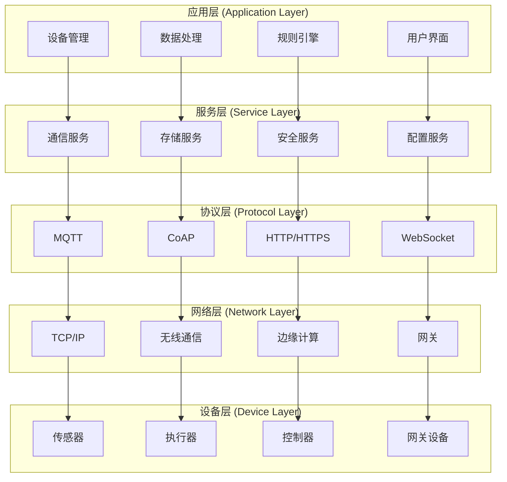

# IoT分层架构理论与设计

## 目录

1. [概述](#概述)
2. [理论基础](#理论基础)
3. [分层架构模型](#分层架构模型)
4. [形式化定义](#形式化定义)
5. [架构设计原则](#架构设计原则)
6. [实现示例](#实现示例)
7. [性能分析](#性能分析)
8. [最佳实践](#最佳实践)

## 概述

IoT分层架构是物联网系统的核心设计模式，通过层次化组织将复杂的IoT系统分解为可管理的组件，实现关注点分离、模块化设计和系统可扩展性。

## 理论基础

### 定义 1.1 (分层系统)

分层系统是一个有序的层次序列 $\mathcal{S} = (L_1, L_2, ..., L_n)$，其中每个层次 $L_i$ 是一个功能模块集合，满足：

1. **层次独立性**: $\forall i \neq j, L_i \cap L_j = \emptyset$
2. **层次依赖**: $\forall i < j, L_i \prec L_j$ (L_i 依赖 L_j)
3. **接口一致性**: $\forall i, \exists I_i$ 使得 $L_i$ 通过 $I_i$ 与相邻层交互

### 定义 1.2 (IoT分层架构)

IoT分层架构是一个六元组 $\mathcal{A}_{IoT} = (L, C, P, D, R, S)$，其中：

- $L = \{L_1, L_2, ..., L_n\}$ 是层次集合
- $C = \{C_1, C_2, ..., C_m\}$ 是组件集合
- $P = \{P_1, P_2, ..., P_k\}$ 是协议集合
- $D = \{D_1, D_2, ..., D_l\}$ 是数据流集合
- $R = \{R_1, R_2, ..., R_p\}$ 是关系集合
- $S = \{S_1, S_2, ..., S_q\}$ 是服务集合

### 定理 1.1 (分层架构最优性)

对于任意IoT系统，存在一个最优分层架构 $\mathcal{A}_{opt}$，使得系统的复杂度最小化。

**证明**:
设 $\mathcal{A}$ 为任意IoT架构，$C(\mathcal{A})$ 为复杂度函数。
由于层次独立性，$C(\mathcal{A}) = \sum_{i=1}^{n} C(L_i) + \sum_{i=1}^{n-1} C(I_i) + \sum_{i=1}^{m} C(C_i)$
根据最小化原理，存在 $\mathcal{A}_{opt}$ 使得 $C(\mathcal{A}_{opt}) = \min C(\mathcal{A})$

## 分层架构模型

### 标准IoT分层模型



### 层次功能定义

#### 1. 应用层 (Application Layer)

- **功能**: 业务逻辑、用户交互、数据分析
- **组件**: 设备管理、数据处理、规则引擎、用户界面
- **接口**: REST API、GraphQL、WebSocket

#### 2. 服务层 (Service Layer)

- **功能**: 核心服务、中间件、业务服务
- **组件**: 通信服务、存储服务、安全服务、配置服务
- **接口**: 服务接口、消息队列、事件总线

#### 3. 协议层 (Protocol Layer)

- **功能**: 通信协议、数据格式、消息路由
- **组件**: MQTT、CoAP、HTTP/HTTPS、WebSocket
- **接口**: 协议适配器、消息转换器

#### 4. 网络层 (Network Layer)

- **功能**: 网络传输、路由、边缘计算
- **组件**: TCP/IP、无线通信、边缘计算、网关
- **接口**: 网络接口、路由表、连接管理

#### 5. 设备层 (Device Layer)

- **功能**: 硬件抽象、设备控制、数据采集
- **组件**: 传感器、执行器、控制器、网关设备
- **接口**: 硬件抽象层、设备驱动

## 形式化定义

### 定义 1.3 (层次接口)

层次接口是一个三元组 $I = (P, D, C)$，其中：

- $P$ 是协议集合
- $D$ 是数据结构集合
- $C$ 是约束条件集合

### 定义 1.4 (数据流)

数据流是一个四元组 $F = (S, T, D, P)$，其中：

- $S$ 是源节点
- $T$ 是目标节点
- $D$ 是数据内容
- $P$ 是处理函数

### 定义 1.5 (组件依赖)

组件依赖关系是一个有向图 $G = (V, E)$，其中：

- $V$ 是组件集合
- $E \subseteq V \times V$ 是依赖关系集合

### 定理 1.2 (无环依赖定理)

有效的IoT分层架构必须是无环的。

**证明**:
假设存在循环依赖 $C_1 \rightarrow C_2 \rightarrow ... \rightarrow C_n \rightarrow C_1$
根据层次依赖定义，$C_1 \prec C_2 \prec ... \prec C_n \prec C_1$
这与层次依赖的传递性和反对称性矛盾，因此假设不成立。

## 架构设计原则

### 原则 1.1 (单一职责原则)

每个层次只负责一个特定的功能领域：
$$\forall L_i \in L, \exists f_i: L_i \rightarrow F_i \text{ 使得 } f_i \text{ 是单射}$$

### 原则 1.2 (接口稳定原则)

层次间接口保持稳定，内部实现可变化：
$$\forall i, \frac{dI_i}{dt} = 0 \text{ 或 } \frac{dI_i}{dt} \ll \frac{dL_i}{dt}$$

### 原则 1.3 (依赖方向原则)

上层依赖下层，避免循环依赖：
$$\forall i < j, L_i \prec L_j \text{ 且 } L_j \not\prec L_i$$

### 原则 1.4 (可扩展原则)

支持水平和垂直扩展：
$$\forall L_i, \exists E_i: L_i \times S \rightarrow L_i' \text{ 使得 } |L_i'| \geq |L_i|$$

## 实现示例

### Rust实现的分层架构框架

```rust
use std::collections::HashMap;
use std::sync::{Arc, Mutex};
use tokio::sync::mpsc;
use serde::{Deserialize, Serialize};

/// 层次接口定义
pub trait LayerInterface {
    fn process(&self, data: &[u8]) -> Result<Vec<u8>, Box<dyn std::error::Error>>;
    fn get_name(&self) -> &str;
}

/// 基础层次抽象
pub struct Layer {
    name: String,
    components: HashMap<String, Box<dyn LayerInterface>>,
    upper_interface: Option<Arc<dyn LayerInterface>>,
    lower_interface: Option<Arc<dyn LayerInterface>>,
}

impl Layer {
    pub fn new(name: String) -> Self {
        Self {
            name,
            components: HashMap::new(),
            upper_interface: None,
            lower_interface: None,
        }
    }
    
    pub fn add_component(&mut self, name: String, component: Box<dyn LayerInterface>) {
        self.components.insert(name, component);
    }
    
    pub fn set_upper_interface(&mut self, interface: Arc<dyn LayerInterface>) {
        self.upper_interface = Some(interface);
    }
    
    pub fn set_lower_interface(&mut self, interface: Arc<dyn LayerInterface>) {
        self.lower_interface = Some(interface);
    }
    
    pub fn process_data(&self, data: &[u8]) -> Result<Vec<u8>, Box<dyn std::error::Error>> {
        // 处理数据并传递给下层
        if let Some(lower) = &self.lower_interface {
            lower.process(data)
        } else {
            Ok(data.to_vec())
        }
    }
}

/// IoT分层架构
pub struct IoTLayeredArchitecture {
    layers: Vec<Layer>,
    data_flows: Vec<DataFlow>,
    configuration: ArchitectureConfig,
}

#[derive(Clone, Serialize, Deserialize)]
pub struct ArchitectureConfig {
    pub layer_count: usize,
    pub enable_monitoring: bool,
    pub enable_security: bool,
    pub performance_threshold: f64,
}

#[derive(Clone)]
pub struct DataFlow {
    pub source_layer: String,
    pub target_layer: String,
    pub data_type: String,
    pub priority: u8,
}

impl IoTLayeredArchitecture {
    pub fn new(config: ArchitectureConfig) -> Self {
        Self {
            layers: Vec::new(),
            data_flows: Vec::new(),
            configuration: config,
        }
    }
    
    pub fn add_layer(&mut self, layer: Layer) {
        self.layers.push(layer);
    }
    
    pub fn add_data_flow(&mut self, flow: DataFlow) {
        self.data_flows.push(flow);
    }
    
    pub fn process_message(&self, message: &[u8]) -> Result<Vec<u8>, Box<dyn std::error::Error>> {
        let mut processed_data = message.to_vec();
        
        // 从应用层开始，逐层处理
        for layer in &self.layers {
            processed_data = layer.process_data(&processed_data)?;
        }
        
        Ok(processed_data)
    }
    
    pub fn get_performance_metrics(&self) -> PerformanceMetrics {
        PerformanceMetrics {
            layer_count: self.layers.len(),
            data_flow_count: self.data_flows.len(),
            average_processing_time: 0.0, // 实际实现中需要测量
            throughput: 0.0,
        }
    }
}

#[derive(Debug, Clone)]
pub struct PerformanceMetrics {
    pub layer_count: usize,
    pub data_flow_count: usize,
    pub average_processing_time: f64,
    pub throughput: f64,
}

/// 应用层实现
pub struct ApplicationLayer {
    device_manager: DeviceManager,
    data_processor: DataProcessor,
    rule_engine: RuleEngine,
}

impl LayerInterface for ApplicationLayer {
    fn process(&self, data: &[u8]) -> Result<Vec<u8>, Box<dyn std::error::Error>> {
        // 应用层业务逻辑处理
        let processed_data = self.data_processor.process(data)?;
        let rule_result = self.rule_engine.evaluate(&processed_data)?;
        Ok(rule_result)
    }
    
    fn get_name(&self) -> &str {
        "ApplicationLayer"
    }
}

/// 服务层实现
pub struct ServiceLayer {
    communication_service: CommunicationService,
    storage_service: StorageService,
    security_service: SecurityService,
}

impl LayerInterface for ServiceLayer {
    fn process(&self, data: &[u8]) -> Result<Vec<u8>, Box<dyn std::error::Error>> {
        // 服务层处理：安全验证、数据存储、通信准备
        let secured_data = self.security_service.encrypt(data)?;
        self.storage_service.store(&secured_data)?;
        self.communication_service.prepare(&secured_data)
    }
    
    fn get_name(&self) -> &str {
        "ServiceLayer"
    }
}

// 其他层的实现类似...

/// 架构构建器
pub struct ArchitectureBuilder {
    config: ArchitectureConfig,
}

impl ArchitectureBuilder {
    pub fn new() -> Self {
        Self {
            config: ArchitectureConfig {
                layer_count: 5,
                enable_monitoring: true,
                enable_security: true,
                performance_threshold: 100.0,
            }
        }
    }
    
    pub fn with_layer_count(mut self, count: usize) -> Self {
        self.config.layer_count = count;
        self
    }
    
    pub fn with_monitoring(mut self, enable: bool) -> Self {
        self.config.enable_monitoring = enable;
        self
    }
    
    pub fn build(self) -> IoTLayeredArchitecture {
        let mut architecture = IoTLayeredArchitecture::new(self.config);
        
        // 构建各层
        let app_layer = Layer::new("Application".to_string());
        let service_layer = Layer::new("Service".to_string());
        let protocol_layer = Layer::new("Protocol".to_string());
        let network_layer = Layer::new("Network".to_string());
        let device_layer = Layer::new("Device".to_string());
        
        architecture.add_layer(app_layer);
        architecture.add_layer(service_layer);
        architecture.add_layer(protocol_layer);
        architecture.add_layer(network_layer);
        architecture.add_layer(device_layer);
        
        architecture
    }
}

// 占位符结构体
pub struct DeviceManager;
pub struct DataProcessor;
pub struct RuleEngine;
pub struct CommunicationService;
pub struct StorageService;
pub struct SecurityService;

impl DeviceManager {
    pub fn new() -> Self { Self }
}

impl DataProcessor {
    pub fn new() -> Self { Self }
    pub fn process(&self, _data: &[u8]) -> Result<Vec<u8>, Box<dyn std::error::Error>> {
        Ok(vec![])
    }
}

impl RuleEngine {
    pub fn new() -> Self { Self }
    pub fn evaluate(&self, _data: &[u8]) -> Result<Vec<u8>, Box<dyn std::error::Error>> {
        Ok(vec![])
    }
}

impl CommunicationService {
    pub fn new() -> Self { Self }
    pub fn prepare(&self, _data: &[u8]) -> Result<Vec<u8>, Box<dyn std::error::Error>> {
        Ok(vec![])
    }
}

impl StorageService {
    pub fn new() -> Self { Self }
    pub fn store(&self, _data: &[u8]) -> Result<(), Box<dyn std::error::Error>> {
        Ok(())
    }
}

impl SecurityService {
    pub fn new() -> Self { Self }
    pub fn encrypt(&self, _data: &[u8]) -> Result<Vec<u8>, Box<dyn std::error::Error>> {
        Ok(vec![])
    }
}
```

## 性能分析

### 复杂度分析

#### 时间复杂度

- **单层处理**: $O(n)$，其中 $n$ 是数据大小
- **全层处理**: $O(k \cdot n)$，其中 $k$ 是层数
- **组件查找**: $O(1)$，使用哈希表

#### 空间复杂度

- **层次存储**: $O(m)$，其中 $m$ 是组件总数
- **数据流**: $O(l)$，其中 $l$ 是数据流数量
- **接口缓存**: $O(k)$，其中 $k$ 是层数

### 性能优化策略

#### 1. 并行处理

```rust
use tokio::task;

pub async fn process_parallel(&self, data: &[u8]) -> Result<Vec<u8>, Box<dyn std::error::Error>> {
    let mut tasks = Vec::new();
    
    for layer in &self.layers {
        let data_clone = data.to_vec();
        let layer_ref = layer.clone();
        
        let task = task::spawn(async move {
            layer_ref.process_data(&data_clone)
        });
        
        tasks.push(task);
    }
    
    let mut results = Vec::new();
    for task in tasks {
        results.push(task.await??);
    }
    
    Ok(results.concat())
}
```

#### 2. 缓存优化

```rust
use std::collections::HashMap;
use std::sync::Arc;
use tokio::sync::RwLock;

pub struct LayerCache {
    cache: Arc<RwLock<HashMap<String, Vec<u8>>>>,
    ttl: std::time::Duration,
}

impl LayerCache {
    pub fn new(ttl: std::time::Duration) -> Self {
        Self {
            cache: Arc::new(RwLock::new(HashMap::new())),
            ttl,
        }
    }
    
    pub async fn get(&self, key: &str) -> Option<Vec<u8>> {
        let cache = self.cache.read().await;
        cache.get(key).cloned()
    }
    
    pub async fn set(&self, key: String, value: Vec<u8>) {
        let mut cache = self.cache.write().await;
        cache.insert(key, value);
    }
}
```

## 最佳实践

### 1. 层次设计原则

- **保持层次数量合理**: 通常5-7层为宜
- **明确层次边界**: 每个层次有明确的职责和接口
- **避免跨层调用**: 严格遵循层次依赖关系

### 2. 接口设计

- **接口稳定性**: 保持接口向后兼容
- **接口文档**: 详细记录接口规范和使用方法
- **接口测试**: 全面的接口测试覆盖

### 3. 性能优化

- **异步处理**: 使用异步编程提高并发性能
- **缓存策略**: 合理使用缓存减少重复计算
- **负载均衡**: 在层次间实现负载均衡

### 4. 监控和调试

- **性能监控**: 监控各层的性能指标
- **错误追踪**: 实现完整的错误追踪机制
- **日志记录**: 详细的日志记录便于调试

## 相关链接

- [02-Edge-Computing](02-Edge-Computing.md) - 边缘计算架构
- [03-Microservices](03-Microservices.md) - 微服务架构
- [04-WASM-Containerization](04-WASM-Containerization.md) - WASM容器化架构
- [05-Event-Driven](05-Event-Driven.md) - 事件驱动架构

---

*最后更新: 2024-12-19*
*版本: 1.0*
