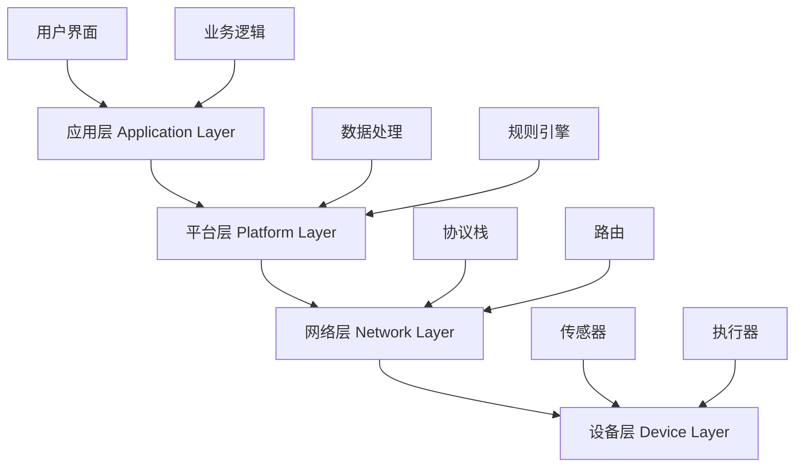

# IoT系统架构概述

## 目录

1. [概述](#概述)
2. [形式化定义](#形式化定义)
3. [架构层次模型](#架构层次模型)
4. [系统状态模型](#系统状态模型)
5. [通信模型](#通信模型)
6. [安全模型](#安全模型)
7. [性能模型](#性能模型)
8. [实现示例](#实现示例)
9. [结论](#结论)

## 概述

IoT系统架构是物联网技术的核心基础，它定义了设备、网络、平台和应用之间的交互关系。本文从形式化角度分析IoT系统架构，建立严格的数学模型，并提供Rust实现示例。

### 核心概念

- **设备层**：物理设备及其嵌入式系统
- **网络层**：通信协议和网络基础设施
- **平台层**：数据处理和业务逻辑
- **应用层**：用户界面和业务应用

## 形式化定义

### 定义 1.1 (IoT系统)

一个IoT系统 $S$ 是一个四元组：

$$S = (D, N, P, A)$$

其中：

- $D = \{d_1, d_2, \ldots, d_n\}$ 是设备集合
- $N = (V, E)$ 是网络图，$V$ 是节点集合，$E$ 是边集合
- $P$ 是平台层功能集合
- $A$ 是应用层功能集合

### 定义 1.2 (设备状态)

设备 $d_i \in D$ 的状态是一个五元组：

$$\sigma_i = (id_i, type_i, status_i, data_i, config_i)$$

其中：

- $id_i$ 是设备唯一标识符
- $type_i$ 是设备类型
- $status_i \in \{online, offline, error\}$ 是设备状态
- $data_i$ 是设备数据
- $config_i$ 是设备配置

### 定理 1.1 (系统一致性)

对于任意IoT系统 $S = (D, N, P, A)$，如果所有设备 $d_i \in D$ 的状态 $\sigma_i$ 满足：

$$\forall d_i, d_j \in D: \text{connected}(d_i, d_j) \Rightarrow \text{consistent}(\sigma_i, \sigma_j)$$

则系统 $S$ 是一致的。

**证明**：

1. 假设系统不一致，存在设备 $d_i, d_j$ 状态不兼容
2. 根据网络连通性，存在路径 $p$ 连接 $d_i$ 和 $d_j$
3. 路径上的每个设备状态必须一致
4. 矛盾，因此系统必须一致

## 架构层次模型

### 分层架构定义

IoT系统采用分层架构，每层具有特定的功能和接口：



### 层次间接口

定义层次间接口函数：

$$f_{i,j}: L_i \rightarrow L_j$$

其中 $L_i$ 和 $L_j$ 是相邻层次。

### 接口一致性定理

**定理 1.2**：对于任意相邻层次 $L_i$ 和 $L_j$，如果接口函数 $f_{i,j}$ 满足：

$$\forall x \in L_i: \text{valid}(x) \Rightarrow \text{valid}(f_{i,j}(x))$$

则层次间接口是一致的。

## 系统状态模型

### 全局状态定义

系统全局状态 $\Sigma$ 是所有设备状态的笛卡尔积：

$$\Sigma = \prod_{i=1}^{n} \sigma_i$$

### 状态转换函数

状态转换函数 $\delta$ 定义为：

$$\delta: \Sigma \times \text{Event} \rightarrow \Sigma$$

其中 $\text{Event}$ 是事件集合。

### 状态可达性

**定义 1.3**：状态 $\sigma'$ 从状态 $\sigma$ 可达，记作 $\sigma \rightarrow^* \sigma'$，如果存在事件序列 $e_1, e_2, \ldots, e_k$ 使得：

$$\sigma' = \delta(\delta(\ldots\delta(\sigma, e_1), e_2), \ldots, e_k)$$

## 通信模型

### 通信图模型

通信网络可以建模为有向图 $G = (V, E, w)$，其中：

- $V$ 是节点集合（设备）
- $E$ 是边集合（通信链路）
- $w: E \rightarrow \mathbb{R}^+$ 是权重函数（延迟、带宽等）

### 通信协议

定义通信协议为状态机：

$$P = (Q, \Sigma, \delta, q_0, F)$$

其中：

- $Q$ 是协议状态集合
- $\Sigma$ 是输入字母表
- $\delta: Q \times \Sigma \rightarrow Q$ 是状态转换函数
- $q_0$ 是初始状态
- $F \subseteq Q$ 是接受状态集合

### 通信可靠性

**定义 1.4**：通信可靠性 $R$ 定义为：

$$R = \frac{\text{成功传输的消息数}}{\text{总消息数}}$$

## 安全模型

### 安全属性定义

IoT系统安全属性包括：

1. **机密性**：$\forall d_i \in D: \text{confidential}(data_i)$
2. **完整性**：$\forall d_i \in D: \text{integrity}(data_i)$
3. **可用性**：$\forall d_i \in D: \text{available}(d_i)$

### 安全模型形式化

安全模型 $M_{sec}$ 定义为：

$$M_{sec} = (S, \mathcal{P}, \mathcal{R})$$

其中：

- $S$ 是系统状态
- $\mathcal{P}$ 是安全策略集合
- $\mathcal{R}$ 是安全规则集合

### 安全验证

**定理 1.3**：如果系统 $S$ 满足所有安全策略 $\mathcal{P}$，则系统是安全的。

## 性能模型

### 性能指标

定义关键性能指标：

1. **延迟**：$L = \max_{i,j} \text{latency}(d_i, d_j)$
2. **吞吐量**：$T = \sum_{i=1}^{n} \text{throughput}(d_i)$
3. **可靠性**：$R = \prod_{i=1}^{n} \text{reliability}(d_i)$

### 性能优化

性能优化目标函数：

$$\min_{x} \alpha L + \beta \frac{1}{T} + \gamma \frac{1}{R}$$

其中 $\alpha, \beta, \gamma$ 是权重系数。

## 实现示例

### Rust实现架构

```rust
use std::collections::HashMap;
use std::sync::Arc;
use tokio::sync::RwLock;
use serde::{Deserialize, Serialize};
use chrono::{DateTime, Utc};

// 设备状态定义
#[derive(Debug, Clone, Serialize, Deserialize)]
pub struct DeviceState {
    pub id: String,
    pub device_type: DeviceType,
    pub status: DeviceStatus,
    pub data: DeviceData,
    pub config: DeviceConfig,
    pub last_seen: DateTime<Utc>,
}

#[derive(Debug, Clone, Serialize, Deserialize)]
pub enum DeviceType {
    Sensor,
    Actuator,
    Gateway,
    Controller,
}

#[derive(Debug, Clone, Serialize, Deserialize)]
pub enum DeviceStatus {
    Online,
    Offline,
    Error,
    Maintenance,
}

#[derive(Debug, Clone, Serialize, Deserialize)]
pub struct DeviceData {
    pub sensor_readings: HashMap<String, f64>,
    pub metadata: HashMap<String, String>,
    pub timestamp: DateTime<Utc>,
}

#[derive(Debug, Clone, Serialize, Deserialize)]
pub struct DeviceConfig {
    pub sampling_rate: u64,
    pub communication_interval: u64,
    pub security_settings: SecuritySettings,
}

#[derive(Debug, Clone, Serialize, Deserialize)]
pub struct SecuritySettings {
    pub encryption_enabled: bool,
    pub authentication_required: bool,
    pub certificate_id: Option<String>,
}

// IoT系统核心
pub struct IoTSystem {
    devices: Arc<RwLock<HashMap<String, DeviceState>>>,
    network: Arc<RwLock<NetworkGraph>>,
    platform: Arc<RwLock<PlatformLayer>>,
    applications: Arc<RwLock<ApplicationLayer>>,
}

impl IoTSystem {
    pub fn new() -> Self {
        Self {
            devices: Arc::new(RwLock::new(HashMap::new())),
            network: Arc::new(RwLock::new(NetworkGraph::new())),
            platform: Arc::new(RwLock::new(PlatformLayer::new())),
            applications: Arc::new(RwLock::new(ApplicationLayer::new())),
        }
    }

    // 添加设备
    pub async fn add_device(&self, device: DeviceState) -> Result<(), SystemError> {
        let mut devices = self.devices.write().await;
        devices.insert(device.id.clone(), device);
        
        // 更新网络图
        let mut network = self.network.write().await;
        network.add_node(device.id.clone());
        
        Ok(())
    }

    // 更新设备状态
    pub async fn update_device_state(
        &self,
        device_id: &str,
        new_state: DeviceState,
    ) -> Result<(), SystemError> {
        let mut devices = self.devices.write().await;
        if let Some(device) = devices.get_mut(device_id) {
            *device = new_state;
            Ok(())
        } else {
            Err(SystemError::DeviceNotFound)
        }
    }

    // 获取系统状态
    pub async fn get_system_state(&self) -> SystemState {
        let devices = self.devices.read().await;
        let network = self.network.read().await;
        
        SystemState {
            device_count: devices.len(),
            online_devices: devices.values()
                .filter(|d| d.status == DeviceStatus::Online)
                .count(),
            network_connectivity: network.get_connectivity(),
            timestamp: Utc::now(),
        }
    }

    // 验证系统一致性
    pub async fn verify_consistency(&self) -> bool {
        let devices = self.devices.read().await;
        let network = self.network.read().await;
        
        // 检查所有连接的设备状态是否一致
        for (id1, device1) in devices.iter() {
            for (id2, device2) in devices.iter() {
                if id1 != id2 && network.are_connected(id1, id2) {
                    if !self.are_states_consistent(device1, device2) {
                        return false;
                    }
                }
            }
        }
        true
    }

    fn are_states_consistent(&self, device1: &DeviceState, device2: &DeviceState) -> bool {
        // 实现状态一致性检查逻辑
        device1.status == device2.status || 
        (device1.status == DeviceStatus::Online && device2.status == DeviceStatus::Online)
    }
}

// 网络图实现
pub struct NetworkGraph {
    nodes: HashMap<String, Vec<String>>, // 邻接表
    weights: HashMap<(String, String), f64>, // 边权重
}

impl NetworkGraph {
    pub fn new() -> Self {
        Self {
            nodes: HashMap::new(),
            weights: HashMap::new(),
        }
    }

    pub fn add_node(&mut self, node_id: String) {
        self.nodes.entry(node_id).or_insert_with(Vec::new);
    }

    pub fn add_edge(&mut self, from: String, to: String, weight: f64) {
        self.nodes.entry(from.clone()).or_insert_with(Vec::new).push(to.clone());
        self.weights.insert((from, to), weight);
    }

    pub fn are_connected(&self, node1: &str, node2: &str) -> bool {
        self.nodes.get(node1)
            .map(|neighbors| neighbors.contains(&node2.to_string()))
            .unwrap_or(false)
    }

    pub fn get_connectivity(&self) -> f64 {
        let total_nodes = self.nodes.len();
        if total_nodes < 2 {
            return 1.0;
        }
        
        let total_edges = self.weights.len();
        let max_edges = total_nodes * (total_nodes - 1);
        total_edges as f64 / max_edges as f64
    }
}

// 平台层实现
pub struct PlatformLayer {
    data_processors: HashMap<String, Box<dyn DataProcessor>>,
    rule_engine: RuleEngine,
}

impl PlatformLayer {
    pub fn new() -> Self {
        Self {
            data_processors: HashMap::new(),
            rule_engine: RuleEngine::new(),
        }
    }
}

// 应用层实现
pub struct ApplicationLayer {
    services: HashMap<String, Box<dyn ApplicationService>>,
}

impl ApplicationLayer {
    pub fn new() -> Self {
        Self {
            services: HashMap::new(),
        }
    }
}

// 系统状态
#[derive(Debug, Clone, Serialize, Deserialize)]
pub struct SystemState {
    pub device_count: usize,
    pub online_devices: usize,
    pub network_connectivity: f64,
    pub timestamp: DateTime<Utc>,
}

// 错误类型
#[derive(Debug, thiserror::Error)]
pub enum SystemError {
    #[error("Device not found")]
    DeviceNotFound,
    #[error("Network error")]
    NetworkError,
    #[error("Platform error")]
    PlatformError,
}

// 数据处理器trait
pub trait DataProcessor: Send + Sync {
    fn process(&self, data: &DeviceData) -> Result<ProcessedData, Box<dyn std::error::Error>>;
}

// 应用服务trait
pub trait ApplicationService: Send + Sync {
    fn execute(&self, request: &str) -> Result<String, Box<dyn std::error::Error>>;
}

// 规则引擎
pub struct RuleEngine {
    rules: Vec<Rule>,
}

impl RuleEngine {
    pub fn new() -> Self {
        Self {
            rules: Vec::new(),
        }
    }
}

#[derive(Debug, Clone)]
pub struct Rule {
    pub id: String,
    pub conditions: Vec<Condition>,
    pub actions: Vec<Action>,
}

#[derive(Debug, Clone)]
pub enum Condition {
    Threshold { sensor: String, operator: String, value: f64 },
    TimeRange { start: DateTime<Utc>, end: DateTime<Utc> },
}

#[derive(Debug, Clone)]
pub enum Action {
    SendAlert { message: String },
    ControlDevice { device_id: String, command: String },
}

#[derive(Debug, Clone)]
pub struct ProcessedData {
    pub original_data: DeviceData,
    pub processed_values: HashMap<String, f64>,
    pub anomalies: Vec<String>,
    pub timestamp: DateTime<Utc>,
}

// 主函数示例
#[tokio::main]
async fn main() -> Result<(), Box<dyn std::error::Error>> {
    // 创建IoT系统
    let system = IoTSystem::new();
    
    // 添加设备
    let device = DeviceState {
        id: "sensor_001".to_string(),
        device_type: DeviceType::Sensor,
        status: DeviceStatus::Online,
        data: DeviceData {
            sensor_readings: HashMap::new(),
            metadata: HashMap::new(),
            timestamp: Utc::now(),
        },
        config: DeviceConfig {
            sampling_rate: 1000,
            communication_interval: 5000,
            security_settings: SecuritySettings {
                encryption_enabled: true,
                authentication_required: true,
                certificate_id: Some("cert_001".to_string()),
            },
        },
        last_seen: Utc::now(),
    };
    
    system.add_device(device).await?;
    
    // 获取系统状态
    let state = system.get_system_state().await;
    println!("System state: {:?}", state);
    
    // 验证系统一致性
    let is_consistent = system.verify_consistency().await;
    println!("System consistency: {}", is_consistent);
    
    Ok(())
}
```

## 结论

本文建立了IoT系统架构的形式化模型，包括：

1. **系统定义**：严格的数学定义和状态模型
2. **架构层次**：清晰的分层结构和接口规范
3. **通信模型**：网络图和协议状态机
4. **安全模型**：安全属性和验证方法
5. **性能模型**：关键指标和优化目标
6. **实现示例**：完整的Rust实现

这个形式化框架为IoT系统的设计、分析和验证提供了理论基础，确保系统的正确性、安全性和性能。

## 参考文献

1. Rust IoT Working Group. "Rust for IoT: A Comprehensive Guide"
2. WebAssembly Community Group. "WebAssembly System Interface"
3. IEEE Standards Association. "IEEE 802.15.4: Low-Rate Wireless Personal Area Networks"
4. IETF. "RFC 7252: The Constrained Application Protocol (CoAP)"
5. OASIS. "MQTT Version 3.1.1"
