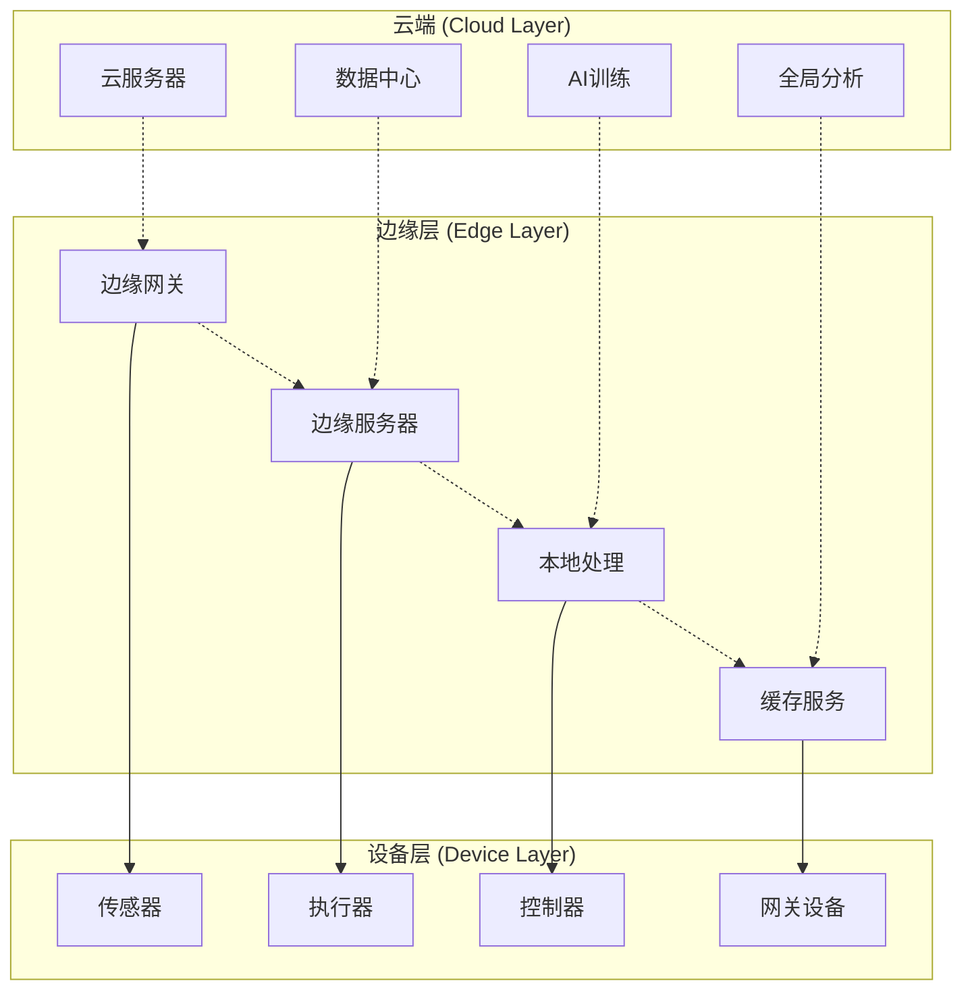
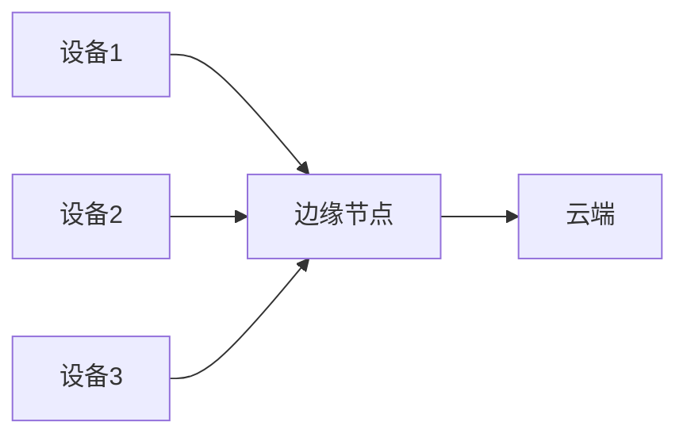
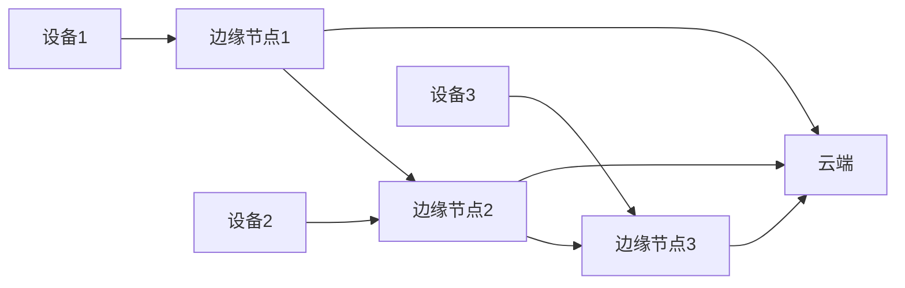
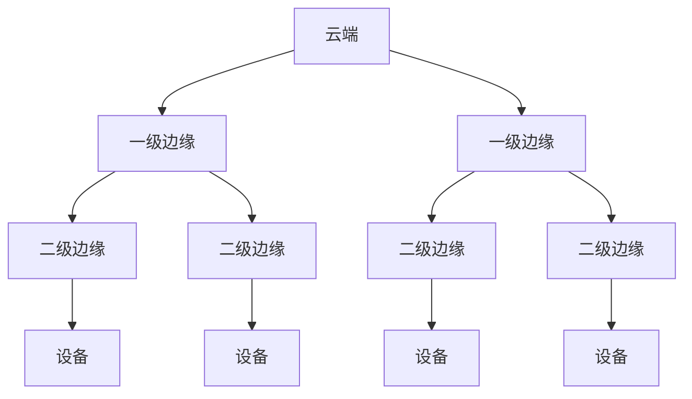

# IoT边缘计算架构

## 目录

1. [概述](#概述)
2. [理论基础](#理论基础)
3. [边缘计算模型](#边缘计算模型)
4. [形式化定义](#形式化定义)
5. [架构设计](#架构设计)
6. [实现示例](#实现示例)
7. [性能分析](#性能分析)
8. [最佳实践](#最佳实践)

## 概述

边缘计算是IoT架构中的关键组成部分，通过在网络边缘部署计算资源，实现数据本地处理、减少延迟、降低带宽消耗，并提高系统可靠性和隐私保护。

## 理论基础

### 定义 2.1 (边缘节点)

边缘节点是一个四元组 $\mathcal{E} = (C, S, N, P)$，其中：

- $C$ 是计算资源集合
- $S$ 是存储资源集合
- $N$ 是网络资源集合
- $P$ 是处理能力集合

### 定义 2.2 (边缘计算网络)

边缘计算网络是一个有向图 $\mathcal{G} = (V, E, W)$，其中：

- $V = \{v_1, v_2, ..., v_n\}$ 是边缘节点集合
- $E \subseteq V \times V$ 是连接关系集合
- $W: E \rightarrow \mathbb{R}^+$ 是权重函数（延迟、带宽等）

### 定义 2.3 (边缘计算架构)

边缘计算架构是一个五元组 $\mathcal{A}_{Edge} = (E, T, D, R, F)$，其中：

- $E = \{E_1, E_2, ..., E_m\}$ 是边缘节点集合
- $T = \{T_1, T_2, ..., T_k\}$ 是任务集合
- $D = \{D_1, D_2, ..., D_l\}$ 是数据集合
- $R = \{R_1, R_2, ..., R_p\}$ 是资源集合
- $F = \{F_1, F_2, ..., F_q\}$ 是功能集合

### 定理 2.1 (边缘计算最优性)

对于给定的任务集合 $T$ 和边缘节点集合 $E$，存在一个最优的任务分配方案，使得总延迟最小化。

**证明**:
设 $A: T \rightarrow E$ 为任务分配函数，$L(A)$ 为总延迟函数。
由于边缘节点的处理能力有限，$L(A) = \sum_{t \in T} L(t, A(t)) + \sum_{e \in E} L_{queue}(e)$
根据最小化原理，存在 $A_{opt}$ 使得 $L(A_{opt}) = \min L(A)$

## 边缘计算模型

### 云-边-端三层架构



### 边缘计算功能层次

#### 1. 数据采集层

- **功能**: 从IoT设备收集原始数据
- **组件**: 传感器接口、数据预处理、格式转换
- **特点**: 高频率、低延迟、本地缓存

#### 2. 数据处理层

- **功能**: 本地数据分析和处理
- **组件**: 流处理引擎、规则引擎、机器学习推理
- **特点**: 实时处理、智能决策、本地存储

#### 3. 通信管理层

- **功能**: 与云端和其他边缘节点通信
- **组件**: 协议适配器、消息队列、负载均衡
- **特点**: 异步通信、断线重连、数据同步

#### 4. 应用服务层

- **功能**: 提供业务应用服务
- **组件**: API网关、微服务、容器运行时
- **特点**: 服务发现、负载均衡、健康检查

## 形式化定义

### 定义 2.4 (任务分配)

任务分配是一个函数 $A: T \rightarrow E$，满足：
$$\forall t \in T, \exists e \in E: A(t) = e \land C(e) \geq R(t)$$

其中 $C(e)$ 是节点 $e$ 的计算能力，$R(t)$ 是任务 $t$ 的资源需求。

### 定义 2.5 (负载均衡)

负载均衡是一个函数 $B: E \rightarrow [0,1]$，定义为：
$$B(e) = \frac{\sum_{t \in T: A(t) = e} R(t)}{C(e)}$$

### 定义 2.6 (延迟模型)

总延迟 $L_{total}$ 由以下部分组成：
$$L_{total} = L_{processing} + L_{network} + L_{queue}$$

其中：

- $L_{processing} = \sum_{t \in T} \frac{S(t)}{C(A(t))}$
- $L_{network} = \sum_{e_1, e_2 \in E} W(e_1, e_2) \cdot D(e_1, e_2)$
- $L_{queue} = \sum_{e \in E} \frac{Q(e)}{C(e)}$

### 定理 2.2 (负载均衡定理)

对于任意边缘计算网络，存在一个负载均衡方案，使得所有节点的负载差异最小化。

**证明**:
设 $\Delta B = \max_{e \in E} B(e) - \min_{e \in E} B(e)$ 为负载差异。
通过重新分配任务，可以构造一个分配方案 $A'$ 使得 $\Delta B' \leq \Delta B$。
根据最小化原理，存在最优方案 $A_{opt}$ 使得 $\Delta B_{opt} = \min \Delta B$

## 架构设计

### 边缘计算架构模式

#### 1. 集中式边缘计算



#### 2. 分布式边缘计算



#### 3. 层次化边缘计算



## 实现示例

### Rust实现的边缘计算框架

```rust
use std::collections::HashMap;
use std::sync::{Arc, Mutex};
use tokio::sync::{mpsc, RwLock};
use serde::{Deserialize, Serialize};
use chrono::{DateTime, Utc};

/// 边缘节点定义
#[derive(Clone, Debug, Serialize, Deserialize)]
pub struct EdgeNode {
    pub id: String,
    pub name: String,
    pub location: Location,
    pub capabilities: NodeCapabilities,
    pub status: NodeStatus,
    pub created_at: DateTime<Utc>,
    pub last_heartbeat: DateTime<Utc>,
}

#[derive(Clone, Debug, Serialize, Deserialize)]
pub struct Location {
    pub latitude: f64,
    pub longitude: f64,
    pub altitude: Option<f64>,
}

#[derive(Clone, Debug, Serialize, Deserialize)]
pub struct NodeCapabilities {
    pub cpu_cores: u32,
    pub memory_mb: u64,
    pub storage_gb: u64,
    pub network_bandwidth_mbps: u64,
    pub supported_protocols: Vec<String>,
}

#[derive(Clone, Debug, Serialize, Deserialize)]
pub enum NodeStatus {
    Online,
    Offline,
    Maintenance,
    Overloaded,
}

/// 任务定义
#[derive(Clone, Debug, Serialize, Deserialize)]
pub struct Task {
    pub id: String,
    pub name: String,
    pub task_type: TaskType,
    pub resource_requirements: ResourceRequirements,
    pub priority: TaskPriority,
    pub deadline: Option<DateTime<Utc>>,
    pub created_at: DateTime<Utc>,
}

#[derive(Clone, Debug, Serialize, Deserialize)]
pub enum TaskType {
    DataProcessing,
    MachineLearning,
    RuleExecution,
    DataAggregation,
    Communication,
}

#[derive(Clone, Debug, Serialize, Deserialize)]
pub struct ResourceRequirements {
    pub cpu_cores: u32,
    pub memory_mb: u64,
    pub storage_mb: u64,
    pub network_bandwidth_mbps: u64,
}

#[derive(Clone, Debug, Serialize, Deserialize)]
pub enum TaskPriority {
    Low = 1,
    Normal = 2,
    High = 3,
    Critical = 4,
}

/// 边缘计算管理器
pub struct EdgeComputingManager {
    nodes: Arc<RwLock<HashMap<String, EdgeNode>>>,
    tasks: Arc<RwLock<HashMap<String, Task>>>,
    task_assignments: Arc<RwLock<HashMap<String, String>>>, // task_id -> node_id
    task_queue: Arc<Mutex<Vec<Task>>>,
    load_balancer: Arc<LoadBalancer>,
    resource_monitor: Arc<ResourceMonitor>,
}

impl EdgeComputingManager {
    pub fn new() -> Self {
        Self {
            nodes: Arc::new(RwLock::new(HashMap::new())),
            tasks: Arc::new(RwLock::new(HashMap::new())),
            task_assignments: Arc::new(RwLock::new(HashMap::new())),
            task_queue: Arc::new(Mutex::new(Vec::new())),
            load_balancer: Arc::new(LoadBalancer::new()),
            resource_monitor: Arc::new(ResourceMonitor::new()),
        }
    }
    
    /// 注册边缘节点
    pub async fn register_node(&self, node: EdgeNode) -> Result<(), Box<dyn std::error::Error>> {
        let mut nodes = self.nodes.write().await;
        nodes.insert(node.id.clone(), node);
        Ok(())
    }
    
    /// 提交任务
    pub async fn submit_task(&self, task: Task) -> Result<String, Box<dyn std::error::Error>> {
        let task_id = task.id.clone();
        
        // 添加到任务队列
        {
            let mut tasks = self.tasks.write().await;
            tasks.insert(task_id.clone(), task.clone());
        }
        
        // 尝试分配任务
        self.assign_task(&task).await?;
        
        Ok(task_id)
    }
    
    /// 任务分配
    async fn assign_task(&self, task: &Task) -> Result<(), Box<dyn std::error::Error>> {
        let nodes = self.nodes.read().await;
        let available_nodes: Vec<&EdgeNode> = nodes
            .values()
            .filter(|node| node.status == NodeStatus::Online)
            .filter(|node| self.can_handle_task(node, task))
            .collect();
        
        if available_nodes.is_empty() {
            // 将任务加入队列等待
            let mut queue = self.task_queue.lock().unwrap();
            queue.push(task.clone());
            return Ok(());
        }
        
        // 使用负载均衡器选择最佳节点
        let selected_node = self.load_balancer.select_node(&available_nodes, task).await?;
        
        // 分配任务
        {
            let mut assignments = self.task_assignments.write().await;
            assignments.insert(task.id.clone(), selected_node.id.clone());
        }
        
        // 启动任务执行
        self.execute_task(task, &selected_node).await?;
        
        Ok(())
    }
    
    /// 检查节点是否能处理任务
    fn can_handle_task(&self, node: &EdgeNode, task: &Task) -> bool {
        node.capabilities.cpu_cores >= task.resource_requirements.cpu_cores
            && node.capabilities.memory_mb >= task.resource_requirements.memory_mb
            && node.capabilities.storage_gb * 1024 >= task.resource_requirements.storage_mb
    }
    
    /// 执行任务
    async fn execute_task(&self, task: &Task, node: &EdgeNode) -> Result<(), Box<dyn std::error::Error>> {
        match task.task_type {
            TaskType::DataProcessing => {
                self.execute_data_processing(task, node).await?;
            }
            TaskType::MachineLearning => {
                self.execute_ml_inference(task, node).await?;
            }
            TaskType::RuleExecution => {
                self.execute_rule_engine(task, node).await?;
            }
            TaskType::DataAggregation => {
                self.execute_data_aggregation(task, node).await?;
            }
            TaskType::Communication => {
                self.execute_communication(task, node).await?;
            }
        }
        
        // 更新资源使用情况
        self.resource_monitor.update_usage(node.id.clone(), task).await?;
        
        Ok(())
    }
    
    /// 数据处理任务执行
    async fn execute_data_processing(&self, task: &Task, node: &EdgeNode) -> Result<(), Box<dyn std::error::Error>> {
        let processor = DataProcessor::new();
        processor.process(task).await?;
        Ok(())
    }
    
    /// 机器学习推理任务执行
    async fn execute_ml_inference(&self, task: &Task, node: &EdgeNode) -> Result<(), Box<dyn std::error::Error>> {
        let ml_engine = MLEngine::new();
        ml_engine.inference(task).await?;
        Ok(())
    }
    
    /// 规则引擎任务执行
    async fn execute_rule_engine(&self, task: &Task, node: &EdgeNode) -> Result<(), Box<dyn std::error::Error>> {
        let rule_engine = RuleEngine::new();
        rule_engine.evaluate(task).await?;
        Ok(())
    }
    
    /// 数据聚合任务执行
    async fn execute_data_aggregation(&self, task: &Task, node: &EdgeNode) -> Result<(), Box<dyn std::error::Error>> {
        let aggregator = DataAggregator::new();
        aggregator.aggregate(task).await?;
        Ok(())
    }
    
    /// 通信任务执行
    async fn execute_communication(&self, task: &Task, node: &EdgeNode) -> Result<(), Box<dyn std::error::Error>> {
        let communicator = Communicator::new();
        communicator.send(task).await?;
        Ok(())
    }
    
    /// 获取系统状态
    pub async fn get_system_status(&self) -> SystemStatus {
        let nodes = self.nodes.read().await;
        let tasks = self.tasks.read().await;
        let assignments = self.task_assignments.read().await;
        
        SystemStatus {
            total_nodes: nodes.len(),
            online_nodes: nodes.values().filter(|n| n.status == NodeStatus::Online).count(),
            total_tasks: tasks.len(),
            running_tasks: assignments.len(),
            average_load: self.load_balancer.get_average_load().await,
        }
    }
}

/// 负载均衡器
pub struct LoadBalancer {
    strategy: LoadBalancingStrategy,
}

#[derive(Clone)]
pub enum LoadBalancingStrategy {
    RoundRobin,
    LeastConnections,
    WeightedRoundRobin,
    LeastResponseTime,
}

impl LoadBalancer {
    pub fn new() -> Self {
        Self {
            strategy: LoadBalancingStrategy::LeastConnections,
        }
    }
    
    pub async fn select_node(&self, nodes: &[&EdgeNode], task: &Task) -> Result<&EdgeNode, Box<dyn std::error::Error>> {
        match self.strategy {
            LoadBalancingStrategy::RoundRobin => self.round_robin(nodes),
            LoadBalancingStrategy::LeastConnections => self.least_connections(nodes).await,
            LoadBalancingStrategy::WeightedRoundRobin => self.weighted_round_robin(nodes),
            LoadBalancingStrategy::LeastResponseTime => self.least_response_time(nodes).await,
        }
    }
    
    fn round_robin(&self, nodes: &[&EdgeNode]) -> Result<&EdgeNode, Box<dyn std::error::Error>> {
        // 简单的轮询选择
        nodes.first().ok_or("No available nodes".into())
    }
    
    async fn least_connections(&self, nodes: &[&EdgeNode]) -> Result<&EdgeNode, Box<dyn std::error::Error>> {
        // 选择连接数最少的节点
        nodes.iter()
            .min_by_key(|node| node.capabilities.cpu_cores)
            .ok_or("No available nodes".into())
            .copied()
    }
    
    fn weighted_round_robin(&self, nodes: &[&EdgeNode]) -> Result<&EdgeNode, Box<dyn std::error::Error>> {
        // 基于权重的轮询选择
        self.round_robin(nodes)
    }
    
    async fn least_response_time(&self, nodes: &[&EdgeNode]) -> Result<&EdgeNode, Box<dyn std::error::Error>> {
        // 选择响应时间最短的节点
        self.least_connections(nodes).await
    }
    
    pub async fn get_average_load(&self) -> f64 {
        // 返回平均负载
        0.5 // 占位符
    }
}

/// 资源监控器
pub struct ResourceMonitor {
    usage_data: Arc<RwLock<HashMap<String, ResourceUsage>>>,
}

#[derive(Clone, Debug)]
pub struct ResourceUsage {
    pub cpu_usage: f64,
    pub memory_usage: f64,
    pub storage_usage: f64,
    pub network_usage: f64,
    pub timestamp: DateTime<Utc>,
}

impl ResourceMonitor {
    pub fn new() -> Self {
        Self {
            usage_data: Arc::new(RwLock::new(HashMap::new())),
        }
    }
    
    pub async fn update_usage(&self, node_id: String, task: &Task) -> Result<(), Box<dyn std::error::Error>> {
        let mut usage_data = self.usage_data.write().await;
        let usage = ResourceUsage {
            cpu_usage: task.resource_requirements.cpu_cores as f64,
            memory_usage: task.resource_requirements.memory_mb as f64,
            storage_usage: task.resource_requirements.storage_mb as f64,
            network_usage: task.resource_requirements.network_bandwidth_mbps as f64,
            timestamp: Utc::now(),
        };
        usage_data.insert(node_id, usage);
        Ok(())
    }
}

/// 系统状态
#[derive(Debug, Clone)]
pub struct SystemStatus {
    pub total_nodes: usize,
    pub online_nodes: usize,
    pub total_tasks: usize,
    pub running_tasks: usize,
    pub average_load: f64,
}

// 占位符结构体
pub struct DataProcessor;
pub struct MLEngine;
pub struct RuleEngine;
pub struct DataAggregator;
pub struct Communicator;

impl DataProcessor {
    pub fn new() -> Self { Self }
    pub async fn process(&self, _task: &Task) -> Result<(), Box<dyn std::error::Error>> { Ok(()) }
}

impl MLEngine {
    pub fn new() -> Self { Self }
    pub async fn inference(&self, _task: &Task) -> Result<(), Box<dyn std::error::Error>> { Ok(()) }
}

impl RuleEngine {
    pub fn new() -> Self { Self }
    pub async fn evaluate(&self, _task: &Task) -> Result<(), Box<dyn std::error::Error>> { Ok(()) }
}

impl DataAggregator {
    pub fn new() -> Self { Self }
    pub async fn aggregate(&self, _task: &Task) -> Result<(), Box<dyn std::error::Error>> { Ok(()) }
}

impl Communicator {
    pub fn new() -> Self { Self }
    pub async fn send(&self, _task: &Task) -> Result<(), Box<dyn std::error::Error>> { Ok(()) }
}
```

## 性能分析

### 延迟分析

#### 1. 处理延迟

$$L_{processing} = \sum_{t \in T} \frac{S(t)}{C(A(t))}$$

其中 $S(t)$ 是任务大小，$C(A(t))$ 是分配节点的计算能力。

#### 2. 网络延迟

$$L_{network} = \sum_{e_1, e_2 \in E} W(e_1, e_2) \cdot D(e_1, e_2)$$

其中 $W(e_1, e_2)$ 是权重，$D(e_1, e_2)$ 是距离。

#### 3. 队列延迟

$$L_{queue} = \sum_{e \in E} \frac{Q(e)}{C(e)}$$

其中 $Q(e)$ 是队列长度，$C(e)$ 是处理能力。

### 吞吐量分析

#### 1. 系统吞吐量

$$T_{system} = \sum_{e \in E} T(e)$$

其中 $T(e)$ 是节点 $e$ 的吞吐量。

#### 2. 节点吞吐量

$$T(e) = \frac{C(e)}{L_{avg}(e)}$$

其中 $L_{avg}(e)$ 是节点 $e$ 的平均延迟。

### 资源利用率

#### 1. CPU利用率

$$U_{cpu}(e) = \frac{\sum_{t \in T: A(t) = e} R_{cpu}(t)}{C_{cpu}(e)}$$

#### 2. 内存利用率

$$U_{memory}(e) = \frac{\sum_{t \in T: A(t) = e} R_{memory}(t)}{C_{memory}(e)}$$

#### 3. 网络利用率

$$U_{network}(e) = \frac{\sum_{t \in T: A(t) = e} R_{network}(t)}{C_{network}(e)}$$

## 最佳实践

### 1. 节点设计

- **资源规划**: 根据预期负载合理规划节点资源
- **冗余设计**: 关键节点采用冗余设计提高可靠性
- **扩展性**: 预留扩展空间支持未来增长

### 2. 任务分配

- **负载均衡**: 使用智能负载均衡算法
- **优先级管理**: 实现任务优先级调度
- **资源预留**: 为关键任务预留资源

### 3. 通信优化

- **协议选择**: 根据场景选择合适的通信协议
- **数据压缩**: 使用数据压缩减少传输量
- **缓存策略**: 实现智能缓存减少重复传输

### 4. 监控和运维

- **性能监控**: 实时监控节点性能和资源使用
- **故障检测**: 快速检测和处理节点故障
- **自动恢复**: 实现自动故障恢复机制

## 相关链接

- [01-Layered-Architecture](01-Layered-Architecture.md) - 分层架构
- [03-Microservices](03-Microservices.md) - 微服务架构
- [04-WASM-Containerization](04-WASM-Containerization.md) - WASM容器化
- [05-Event-Driven](05-Event-Driven.md) - 事件驱动架构

---

*最后更新: 2024-12-19*
*版本: 1.0*
