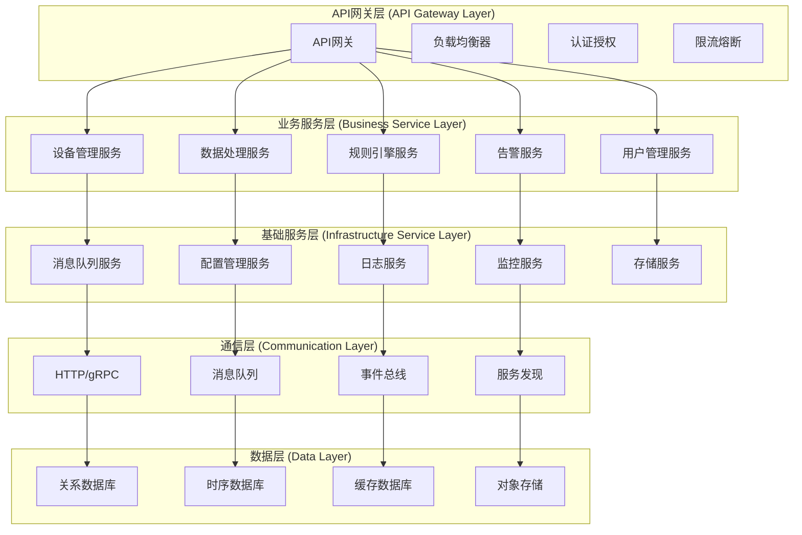
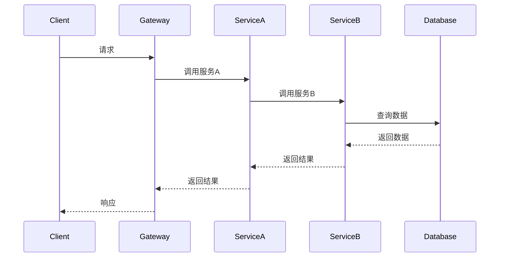
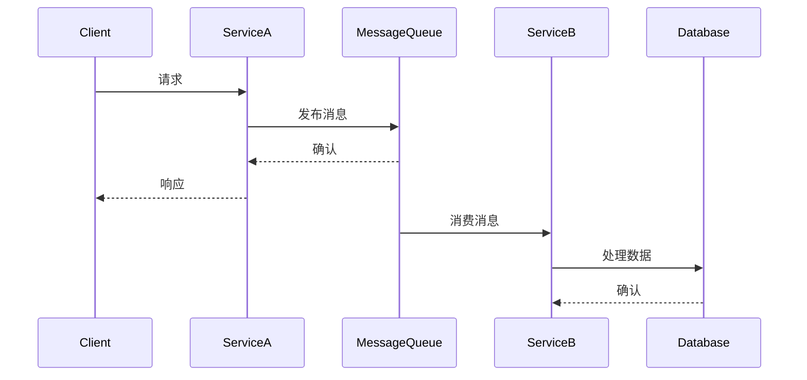

# IoT微服务架构

## 目录

1. [概述](#概述)
2. [理论基础](#理论基础)
3. [微服务架构模型](#微服务架构模型)
4. [形式化定义](#形式化定义)
5. [架构设计](#架构设计)
6. [实现示例](#实现示例)
7. [性能分析](#性能分析)
8. [最佳实践](#最佳实践)

## 概述

微服务架构是IoT系统中的重要架构模式，通过将大型单体应用分解为小型、独立的服务，实现高内聚、低耦合的系统设计，提高系统的可扩展性、可维护性和容错能力。

## 理论基础

### 定义 3.1 (微服务)

微服务是一个四元组 $\mathcal{M} = (F, I, D, S)$，其中：

- $F$ 是功能集合 (Functions)
- $I$ 是接口集合 (Interfaces)
- $D$ 是数据集合 (Data)
- $S$ 是状态集合 (States)

### 定义 3.2 (微服务架构)

微服务架构是一个五元组 $\mathcal{A}_{MS} = (M, C, N, D, R)$，其中：

- $M = \{M_1, M_2, ..., M_n\}$ 是微服务集合
- $C = \{C_1, C_2, ..., C_k\}$ 是通信机制集合
- $N = \{N_1, N_2, ..., N_l\}$ 是网络组件集合
- $D = \{D_1, D_2, ..., D_p\}$ 是数据存储集合
- $R = \{R_1, R_2, ..., R_q\}$ 是路由规则集合

### 定义 3.3 (服务依赖图)

服务依赖图是一个有向图 $\mathcal{G} = (V, E, W)$，其中：

- $V = \{v_1, v_2, ..., v_n\}$ 是微服务节点集合
- $E \subseteq V \times V$ 是依赖关系集合
- $W: E \rightarrow \mathbb{R}^+$ 是权重函数（延迟、吞吐量等）

### 定理 3.1 (微服务分解定理)

对于任意单体应用，存在一个最优的微服务分解方案，使得系统的复杂度和耦合度最小化。

**证明**:
设 $\mathcal{A}$ 为单体应用，$\mathcal{M}$ 为微服务分解，$C(\mathcal{M})$ 为复杂度函数。
由于功能的内聚性，$C(\mathcal{M}) = \sum_{i=1}^{n} C(M_i) + \sum_{i,j} C(M_i, M_j)$
根据最小化原理，存在 $\mathcal{M}_{opt}$ 使得 $C(\mathcal{M}_{opt}) = \min C(\mathcal{M})$

## 微服务架构模型

### IoT微服务架构层次



### 微服务通信模式

#### 1. 同步通信模式



#### 2. 异步通信模式



## 形式化定义

### 定义 3.4 (服务接口)

服务接口是一个三元组 $I = (P, D, C)$，其中：

- $P$ 是协议集合 (Protocols)
- $D$ 是数据结构集合 (Data Structures)
- $C$ 是约束条件集合 (Constraints)

### 定义 3.5 (服务调用)

服务调用是一个四元组 $C = (S, T, D, P)$，其中：

- $S$ 是源服务 (Source Service)
- $T$ 是目标服务 (Target Service)
- $D$ 是调用数据 (Data)
- $P$ 是调用参数 (Parameters)

### 定义 3.6 (服务发现)

服务发现是一个函数 $D: S \rightarrow L$，其中：

- $S$ 是服务集合
- $L$ 是位置集合

### 定义 3.7 (负载均衡)

负载均衡是一个函数 $B: R \rightarrow S$，其中：

- $R$ 是请求集合
- $S$ 是服务实例集合

### 定理 3.2 (服务发现一致性定理)

在分布式环境中，服务发现机制必须保证一致性，即所有节点看到的服务状态必须一致。

**证明**:
设 $\mathcal{N}$ 为节点集合，$\mathcal{S}$ 为服务集合，$D_i$ 为节点 $i$ 的服务发现函数。
一致性要求：$\forall i, j \in \mathcal{N}, \forall s \in \mathcal{S}: D_i(s) = D_j(s)$
这等价于：$\exists D: \forall i \in \mathcal{N}: D_i = D$
因此，存在一个全局一致的服务发现函数 $D$

## 架构设计

### 微服务设计原则

#### 原则 3.1 (单一职责原则)

每个微服务只负责一个业务功能：
$$\forall M_i \in \mathcal{M}, \exists f_i: M_i \rightarrow F_i \text{ 使得 } f_i \text{ 是单射}$$

#### 原则 3.2 (服务自治原则)

每个微服务可以独立部署和运行：
$$\forall M_i \in \mathcal{M}, M_i \text{ 可以独立运行}$$

#### 原则 3.3 (数据隔离原则)

每个微服务管理自己的数据：
$$\forall M_i \in \mathcal{M}, \exists D_i: M_i \text{ 管理 } D_i$$

#### 原则 3.4 (接口稳定原则)

服务接口保持向后兼容：
$$\forall t_1, t_2, \frac{dI}{dt} \ll \frac{dM}{dt}$$

### 微服务拆分策略

#### 1. 业务功能拆分

- **设备管理服务**: 设备注册、配置、状态管理
- **数据处理服务**: 数据采集、清洗、存储
- **规则引擎服务**: 规则定义、执行、管理
- **告警服务**: 告警生成、通知、管理
- **用户管理服务**: 用户认证、授权、管理

#### 2. 数据边界拆分

- **设备数据服务**: 设备相关数据
- **用户数据服务**: 用户相关数据
- **配置数据服务**: 系统配置数据
- **日志数据服务**: 系统日志数据

#### 3. 技术边界拆分

- **API网关服务**: 统一入口和路由
- **认证服务**: 身份认证和授权
- **消息服务**: 消息传递和队列
- **监控服务**: 系统监控和告警

## 实现示例

### Rust实现的微服务框架

```rust
use std::collections::HashMap;
use std::sync::{Arc, Mutex};
use tokio::sync::{mpsc, RwLock};
use serde::{Deserialize, Serialize};
use actix_web::{web, App, HttpServer, HttpResponse, Responder};
use actix_web::middleware::{Logger, DefaultHeaders};
use actix_cors::Cors;

/// 微服务定义
#[derive(Clone, Debug, Serialize, Deserialize)]
pub struct Microservice {
    pub id: String,
    pub name: String,
    pub version: String,
    pub endpoints: Vec<Endpoint>,
    pub dependencies: Vec<String>,
    pub health_check: HealthCheck,
    pub configuration: ServiceConfig,
}

#[derive(Clone, Debug, Serialize, Deserialize)]
pub struct Endpoint {
    pub path: String,
    pub method: String,
    pub handler: String,
    pub auth_required: bool,
}

#[derive(Clone, Debug, Serialize, Deserialize)]
pub struct HealthCheck {
    pub endpoint: String,
    pub interval: u64,
    pub timeout: u64,
}

#[derive(Clone, Debug, Serialize, Deserialize)]
pub struct ServiceConfig {
    pub port: u16,
    pub host: String,
    pub database_url: String,
    pub redis_url: String,
    pub log_level: String,
}

/// 微服务管理器
pub struct MicroserviceManager {
    services: Arc<RwLock<HashMap<String, Microservice>>>,
    service_registry: Arc<ServiceRegistry>,
    load_balancer: Arc<LoadBalancer>,
    circuit_breaker: Arc<CircuitBreaker>,
}

impl MicroserviceManager {
    pub fn new() -> Self {
        Self {
            services: Arc::new(RwLock::new(HashMap::new())),
            service_registry: Arc::new(ServiceRegistry::new()),
            load_balancer: Arc::new(LoadBalancer::new()),
            circuit_breaker: Arc::new(CircuitBreaker::new()),
        }
    }
    
    /// 注册微服务
    pub async fn register_service(&self, service: Microservice) -> Result<(), Box<dyn std::error::Error>> {
        let service_id = service.id.clone();
        
        // 注册到服务注册表
        self.service_registry.register(service.clone()).await?;
        
        // 添加到服务列表
        {
            let mut services = self.services.write().await;
            services.insert(service_id, service);
        }
        
        Ok(())
    }
    
    /// 启动微服务
    pub async fn start_service(&self, service_id: &str) -> Result<(), Box<dyn std::error::Error>> {
        let services = self.services.read().await;
        if let Some(service) = services.get(service_id) {
            self.start_http_server(service).await?;
        }
        Ok(())
    }
    
    /// 启动HTTP服务器
    async fn start_http_server(&self, service: &Microservice) -> Result<(), Box<dyn std::error::Error>> {
        let addr = format!("{}:{}", service.configuration.host, service.configuration.port);
        
        HttpServer::new(move || {
            App::new()
                .wrap(Logger::default())
                .wrap(DefaultHeaders::new().add(("X-Version", service.version.as_str())))
                .wrap(Cors::default().allow_any_origin())
                .service(
                    web::scope("/api/v1")
                        .route("/health", web::get().to(health_check))
                        .route("/metrics", web::get().to(metrics))
                        .service(configure_routes(service))
                )
        })
        .bind(&addr)?
        .run()
        .await?;
        
        Ok(())
    }
    
    /// 服务调用
    pub async fn call_service(&self, service_name: &str, endpoint: &str, data: &[u8]) -> Result<Vec<u8>, Box<dyn std::error::Error>> {
        // 服务发现
        let service_instances = self.service_registry.discover(service_name).await?;
        
        // 负载均衡
        let selected_instance = self.load_balancer.select(&service_instances).await?;
        
        // 熔断器检查
        if !self.circuit_breaker.is_closed(service_name).await? {
            return Err("Circuit breaker is open".into());
        }
        
        // 调用服务
        let result = self.make_http_call(&selected_instance, endpoint, data).await?;
        
        // 更新熔断器状态
        self.circuit_breaker.record_success(service_name).await?;
        
        Ok(result)
    }
    
    /// 发起HTTP调用
    async fn make_http_call(&self, instance: &ServiceInstance, endpoint: &str, data: &[u8]) -> Result<Vec<u8>, Box<dyn std::error::Error>> {
        let client = reqwest::Client::new();
        let url = format!("http://{}:{}{}", instance.host, instance.port, endpoint);
        
        let response = client
            .post(&url)
            .body(data.to_vec())
            .send()
            .await?;
        
        let response_data = response.bytes().await?;
        Ok(response_data.to_vec())
    }
}

/// 服务注册表
pub struct ServiceRegistry {
    services: Arc<RwLock<HashMap<String, Vec<ServiceInstance>>>>,
}

#[derive(Clone, Debug)]
pub struct ServiceInstance {
    pub id: String,
    pub name: String,
    pub host: String,
    pub port: u16,
    pub health_status: HealthStatus,
    pub last_heartbeat: std::time::Instant,
}

#[derive(Clone, Debug)]
pub enum HealthStatus {
    Healthy,
    Unhealthy,
    Unknown,
}

impl ServiceRegistry {
    pub fn new() -> Self {
        Self {
            services: Arc::new(RwLock::new(HashMap::new())),
        }
    }
    
    pub async fn register(&self, service: Microservice) -> Result<(), Box<dyn std::error::Error>> {
        let instance = ServiceInstance {
            id: service.id.clone(),
            name: service.name.clone(),
            host: service.configuration.host.clone(),
            port: service.configuration.port,
            health_status: HealthStatus::Healthy,
            last_heartbeat: std::time::Instant::now(),
        };
        
        let mut services = self.services.write().await;
        let instances = services.entry(service.name).or_insert_with(Vec::new);
        instances.push(instance);
        
        Ok(())
    }
    
    pub async fn discover(&self, service_name: &str) -> Result<Vec<ServiceInstance>, Box<dyn std::error::Error>> {
        let services = self.services.read().await;
        if let Some(instances) = services.get(service_name) {
            Ok(instances.clone())
        } else {
            Err("Service not found".into())
        }
    }
    
    pub async fn deregister(&self, service_id: &str) -> Result<(), Box<dyn std::error::Error>> {
        let mut services = self.services.write().await;
        for instances in services.values_mut() {
            instances.retain(|instance| instance.id != service_id);
        }
        Ok(())
    }
}

/// 负载均衡器
pub struct LoadBalancer {
    strategy: LoadBalancingStrategy,
}

#[derive(Clone)]
pub enum LoadBalancingStrategy {
    RoundRobin,
    LeastConnections,
    WeightedRoundRobin,
    LeastResponseTime,
}

impl LoadBalancer {
    pub fn new() -> Self {
        Self {
            strategy: LoadBalancingStrategy::RoundRobin,
        }
    }
    
    pub async fn select(&self, instances: &[ServiceInstance]) -> Result<&ServiceInstance, Box<dyn std::error::Error>> {
        match self.strategy {
            LoadBalancingStrategy::RoundRobin => self.round_robin(instances),
            LoadBalancingStrategy::LeastConnections => self.least_connections(instances),
            LoadBalancingStrategy::WeightedRoundRobin => self.weighted_round_robin(instances),
            LoadBalancingStrategy::LeastResponseTime => self.least_response_time(instances),
        }
    }
    
    fn round_robin(&self, instances: &[ServiceInstance]) -> Result<&ServiceInstance, Box<dyn std::error::Error>> {
        static COUNTER: std::sync::atomic::AtomicUsize = std::sync::atomic::AtomicUsize::new(0);
        let index = COUNTER.fetch_add(1, std::sync::atomic::Ordering::Relaxed) % instances.len();
        instances.get(index).ok_or("No instances available".into())
    }
    
    fn least_connections(&self, _instances: &[ServiceInstance]) -> Result<&ServiceInstance, Box<dyn std::error::Error>> {
        // 简化实现，实际应该跟踪连接数
        self.round_robin(_instances)
    }
    
    fn weighted_round_robin(&self, instances: &[ServiceInstance]) -> Result<&ServiceInstance, Box<dyn std::error::Error>> {
        self.round_robin(instances)
    }
    
    fn least_response_time(&self, instances: &[ServiceInstance]) -> Result<&ServiceInstance, Box<dyn std::error::Error>> {
        self.round_robin(instances)
    }
}

/// 熔断器
pub struct CircuitBreaker {
    states: Arc<RwLock<HashMap<String, CircuitState>>>,
}

#[derive(Clone, Debug)]
pub enum CircuitState {
    Closed,
    Open,
    HalfOpen,
}

impl CircuitBreaker {
    pub fn new() -> Self {
        Self {
            states: Arc::new(RwLock::new(HashMap::new())),
        }
    }
    
    pub async fn is_closed(&self, service_name: &str) -> Result<bool, Box<dyn std::error::Error>> {
        let states = self.states.read().await;
        match states.get(service_name) {
            Some(CircuitState::Closed) | Some(CircuitState::HalfOpen) => Ok(true),
            Some(CircuitState::Open) => Ok(false),
            None => Ok(true), // 默认关闭状态
        }
    }
    
    pub async fn record_success(&self, service_name: &str) -> Result<(), Box<dyn std::error::Error>> {
        let mut states = self.states.write().await;
        states.insert(service_name.to_string(), CircuitState::Closed);
        Ok(())
    }
    
    pub async fn record_failure(&self, service_name: &str) -> Result<(), Box<dyn std::error::Error>> {
        let mut states = self.states.write().await;
        states.insert(service_name.to_string(), CircuitState::Open);
        Ok(())
    }
}

/// HTTP处理器
async fn health_check() -> impl Responder {
    HttpResponse::Ok().json(serde_json::json!({
        "status": "healthy",
        "timestamp": chrono::Utc::now().to_rfc3339()
    }))
}

async fn metrics() -> impl Responder {
    HttpResponse::Ok().json(serde_json::json!({
        "requests_total": 1000,
        "requests_per_second": 10.5,
        "error_rate": 0.01
    }))
}

fn configure_routes(service: &Microservice) -> actix_web::Scope {
    let mut scope = web::scope(&format!("/{}", service.name));
    
    for endpoint in &service.endpoints {
        let path = endpoint.path.clone();
        let method = endpoint.method.clone();
        
        match method.as_str() {
            "GET" => {
                scope = scope.route(&path, web::get().to(mock_handler));
            }
            "POST" => {
                scope = scope.route(&path, web::post().to(mock_handler));
            }
            "PUT" => {
                scope = scope.route(&path, web::put().to(mock_handler));
            }
            "DELETE" => {
                scope = scope.route(&path, web::delete().to(mock_handler));
            }
            _ => {}
        }
    }
    
    scope
}

async fn mock_handler() -> impl Responder {
    HttpResponse::Ok().json(serde_json::json!({
        "message": "Service endpoint called successfully"
    }))
}

/// 设备管理微服务示例
pub struct DeviceManagementService {
    manager: Arc<MicroserviceManager>,
}

impl DeviceManagementService {
    pub fn new(manager: Arc<MicroserviceManager>) -> Self {
        Self { manager }
    }
    
    pub async fn register_device(&self, device_data: &[u8]) -> Result<Vec<u8>, Box<dyn std::error::Error>> {
        // 调用设备注册逻辑
        self.manager.call_service("device-service", "/register", device_data).await
    }
    
    pub async fn get_device_status(&self, device_id: &str) -> Result<Vec<u8>, Box<dyn std::error::Error>> {
        let data = serde_json::json!({"device_id": device_id}).to_string().into_bytes();
        self.manager.call_service("device-service", "/status", &data).await
    }
}

/// 数据处理微服务示例
pub struct DataProcessingService {
    manager: Arc<MicroserviceManager>,
}

impl DataProcessingService {
    pub fn new(manager: Arc<MicroserviceManager>) -> Self {
        Self { manager }
    }
    
    pub async fn process_sensor_data(&self, sensor_data: &[u8]) -> Result<Vec<u8>, Box<dyn std::error::Error>> {
        // 调用数据处理逻辑
        self.manager.call_service("data-service", "/process", sensor_data).await
    }
    
    pub async fn store_data(&self, data: &[u8]) -> Result<Vec<u8>, Box<dyn std::error::Error>> {
        self.manager.call_service("data-service", "/store", data).await
    }
}
```

## 性能分析

### 延迟分析

#### 1. 服务调用延迟

$$L_{call} = L_{discovery} + L_{routing} + L_{network} + L_{processing} + L_{response}$$

其中：

- $L_{discovery}$ 是服务发现延迟
- $L_{routing}$ 是路由延迟
- $L_{network}$ 是网络传输延迟
- $L_{processing}$ 是服务处理延迟
- $L_{response}$ 是响应延迟

#### 2. 网络延迟

$$L_{network} = \sum_{i=1}^{n} L_i$$

其中 $L_i$ 是第 $i$ 个网络跳的延迟。

#### 3. 处理延迟

$$L_{processing} = \frac{S_{data}}{C_{service}}$$

其中 $S_{data}$ 是数据大小，$C_{service}$ 是服务处理能力。

### 吞吐量分析

#### 1. 系统吞吐量

$$T_{system} = \min_{i=1}^{n} T_i$$

其中 $T_i$ 是第 $i$ 个服务的吞吐量。

#### 2. 服务吞吐量

$$T_i = \frac{C_i}{L_{avg,i}}$$

其中 $C_i$ 是服务 $i$ 的处理能力，$L_{avg,i}$ 是平均处理延迟。

### 可用性分析

#### 1. 服务可用性

$$A_i = \frac{T_{uptime,i}}{T_{total,i}}$$

其中 $T_{uptime,i}$ 是服务 $i$ 的可用时间，$T_{total,i}$ 是总时间。

#### 2. 系统可用性

$$A_{system} = \prod_{i=1}^{n} A_i$$

假设服务间是独立的。

## 最佳实践

### 1. 服务设计

- **单一职责**: 每个服务只负责一个业务功能
- **数据隔离**: 每个服务管理自己的数据
- **接口稳定**: 保持接口的向后兼容性
- **版本管理**: 实现服务版本管理机制

### 2. 通信设计

- **异步通信**: 优先使用异步通信模式
- **消息队列**: 使用消息队列解耦服务
- **事件驱动**: 采用事件驱动架构
- **API网关**: 使用API网关统一入口

### 3. 部署和运维

- **容器化**: 使用容器技术部署服务
- **自动化**: 实现自动化部署和测试
- **监控**: 建立完善的监控体系
- **日志**: 实现分布式日志收集

### 4. 安全和可靠性

- **熔断器**: 实现熔断器模式
- **重试机制**: 实现智能重试机制
- **限流**: 实现服务限流保护
- **认证授权**: 实现统一的认证授权

## 相关链接

- [01-Layered-Architecture](01-Layered-Architecture.md) - 分层架构
- [02-Edge-Computing](02-Edge-Computing.md) - 边缘计算架构
- [04-WASM-Containerization](04-WASM-Containerization.md) - WASM容器化架构
- [05-Event-Driven](05-Event-Driven.md) - 事件驱动架构

---

*最后更新: 2024-12-19*
*版本: 1.0*
