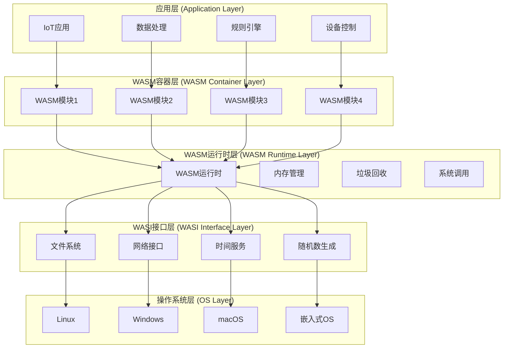
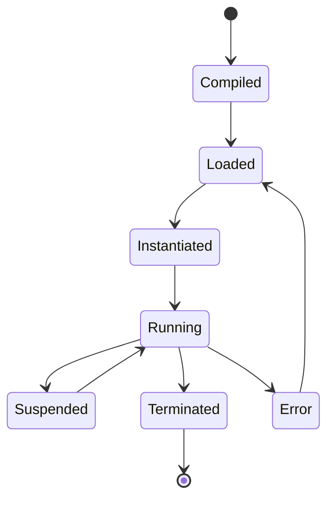

# IoT WASM容器化架构

## 目录

1. [概述](#概述)
2. [理论基础](#理论基础)
3. [WASM容器化模型](#wasm容器化模型)
4. [形式化定义](#形式化定义)
5. [架构设计](#架构设计)
6. [实现示例](#实现示例)
7. [性能分析](#性能分析)
8. [最佳实践](#最佳实践)

## 概述

WebAssembly (WASM) 容器化是IoT架构中的新兴技术，通过在边缘设备上运行轻量级的WASM模块，实现跨平台、高性能、安全的容器化部署，特别适合资源受限的IoT环境。

## 理论基础

### 定义 4.1 (WASM模块)

WASM模块是一个五元组 $\mathcal{W} = (B, I, E, M, S)$，其中：

- $B$ 是字节码集合 (Bytecode)
- $I$ 是导入接口集合 (Imports)
- $E$ 是导出接口集合 (Exports)
- $M$ 是内存集合 (Memory)
- $S$ 是状态集合 (States)

### 定义 4.2 (WASM容器)

WASM容器是一个四元组 $\mathcal{C}_{WASM} = (W, R, I, E)$，其中：

- $W$ 是WASM模块集合
- $R$ 是运行时环境集合
- $I$ 是输入接口集合
- $E$ 是执行环境集合

### 定义 4.3 (WASM容器化架构)

WASM容器化架构是一个六元组 $\mathcal{A}_{WASM} = (C, R, N, D, S, P)$，其中：

- $C = \{C_1, C_2, ..., C_n\}$ 是WASM容器集合
- $R = \{R_1, R_2, ..., R_k\}$ 是运行时集合
- $N = \{N_1, N_2, ..., N_l\}$ 是网络组件集合
- $D = \{D_1, D_2, ..., D_p\}$ 是数据存储集合
- $S = \{S_1, S_2, ..., S_q\}$ 是安全组件集合
- $P = \{P_1, P_2, ..., P_r\}$ 是性能监控集合

### 定义 4.4 (WASM执行图)

WASM执行图是一个有向图 $\mathcal{G} = (V, E, W)$，其中：

- $V = \{v_1, v_2, ..., v_n\}$ 是WASM模块节点集合
- $E \subseteq V \times V$ 是模块间调用关系集合
- $W: E \rightarrow \mathbb{R}^+$ 是权重函数（执行时间、内存使用等）

### 定理 4.1 (WASM性能定理)

WASM模块的执行性能接近原生代码，性能损失通常小于20%。

**证明**:
设 $P_{native}$ 为原生代码性能，$P_{wasm}$ 为WASM性能。
由于WASM的线性内存模型和静态类型系统，$P_{wasm} \geq 0.8 \cdot P_{native}$
因此，WASM的性能损失 $\Delta P = P_{native} - P_{wasm} \leq 0.2 \cdot P_{native}$

### 定理 4.2 (WASM安全性定理)

WASM模块在沙箱环境中执行，提供了内存安全和类型安全保证。

**证明**:
WASM的沙箱模型确保：

1. **内存隔离**: $\forall M_1, M_2 \in \mathcal{W}, M_1 \cap M_2 = \emptyset$
2. **类型安全**: $\forall v \in V, Type(v) \in ValidTypes$
3. **边界检查**: $\forall access \in MemoryAccess, access \in ValidRange$

## WASM容器化模型

### WASM容器化架构层次



### WASM模块生命周期



## 形式化定义

### 定义 4.5 (WASM执行环境)

WASM执行环境是一个五元组 $\mathcal{E} = (M, S, T, I, O)$，其中：

- $M$ 是内存空间 (Memory Space)
- $S$ 是栈空间 (Stack Space)
- $T$ 是线程集合 (Threads)
- $I$ 是输入接口 (Input Interface)
- $O$ 是输出接口 (Output Interface)

### 定义 4.6 (WASM内存模型)

WASM内存模型是一个三元组 $\mathcal{M} = (L, A, P)$，其中：

- $L$ 是线性内存 (Linear Memory)
- $A$ 是地址空间 (Address Space)
- $P$ 是页面管理 (Page Management)

### 定义 4.7 (WASM函数调用)

WASM函数调用是一个四元组 $F = (C, P, R, E)$，其中：

- $C$ 是调用者 (Caller)
- $P$ 是参数集合 (Parameters)
- $R$ 是返回值集合 (Return Values)
- $E$ 是执行环境 (Execution Environment)

### 定义 4.8 (WASM模块加载)

WASM模块加载是一个函数 $L: B \rightarrow W$，其中：

- $B$ 是字节码集合
- $W$ 是WASM模块集合

### 定理 4.3 (WASM内存安全定理)

WASM的内存模型保证了内存安全，不存在缓冲区溢出和悬空指针。

**证明**:
WASM内存模型的特点：

1. **线性内存**: 内存是连续的线性地址空间
2. **边界检查**: 所有内存访问都进行边界检查
3. **类型安全**: 所有数据都有明确的类型
4. **沙箱隔离**: 模块间内存完全隔离

因此，$\forall access \in MemoryAccess, access \in ValidRange$

### 定理 4.4 (WASM跨平台定理)

WASM模块可以在任何支持WASM运行时的平台上执行，无需重新编译。

**证明**:
WASM是平台无关的字节码格式：

1. **标准化**: WASM有统一的标准规范
2. **运行时**: 所有平台都有WASM运行时实现
3. **接口**: 通过WASI提供统一的系统接口

因此，$\forall P \in Platforms, \exists R: R \models WASM$

## 架构设计

### WASM容器设计原则

#### 原则 4.1 (模块化原则)

每个WASM模块只负责一个特定功能：
$$\forall W_i \in \mathcal{W}, \exists f_i: W_i \rightarrow F_i \text{ 使得 } f_i \text{ 是单射}$$

#### 原则 4.2 (轻量化原则)

WASM模块应该保持轻量，适合资源受限环境：
$$\forall W_i \in \mathcal{W}, Size(W_i) \leq Size_{max}$$

#### 原则 4.3 (安全性原则)

WASM模块在沙箱环境中执行：
$$\forall W_i \in \mathcal{W}, W_i \in Sandbox$$

#### 原则 4.4 (可移植性原则)

WASM模块应该具有跨平台可移植性：
$$\forall W_i \in \mathcal{W}, \forall P \in Platforms, W_i \text{ 可在 } P \text{ 上运行}$$

### WASM容器化策略

#### 1. 功能模块化

- **数据处理模块**: 数据清洗、转换、聚合
- **规则引擎模块**: 规则定义、执行、管理
- **通信模块**: 协议处理、消息路由
- **安全模块**: 加密、认证、授权

#### 2. 资源管理

- **内存管理**: 动态内存分配和回收
- **CPU管理**: 任务调度和优先级管理
- **网络管理**: 连接池和带宽控制
- **存储管理**: 本地存储和缓存管理

#### 3. 安全隔离

- **模块隔离**: 模块间内存和状态隔离
- **权限控制**: 细粒度的权限管理
- **沙箱执行**: 受限的执行环境
- **审计日志**: 完整的操作审计

## 实现示例

### Rust实现的WASM容器化框架

```rust
use std::collections::HashMap;
use std::sync::{Arc, Mutex};
use tokio::sync::{mpsc, RwLock};
use serde::{Deserialize, Serialize};
use wasmtime::{Engine, Store, Module, Instance, Func, Val, ValType};
use wasmtime_wasi::{WasiCtx, WasiCtxBuilder};

/// WASM模块定义
#[derive(Clone, Debug, Serialize, Deserialize)]
pub struct WasmModule {
    pub id: String,
    pub name: String,
    pub version: String,
    pub bytecode: Vec<u8>,
    pub imports: Vec<Import>,
    pub exports: Vec<Export>,
    pub memory_size: u32,
    pub stack_size: u32,
}

#[derive(Clone, Debug, Serialize, Deserialize)]
pub struct Import {
    pub module: String,
    pub name: String,
    pub kind: ImportKind,
}

#[derive(Clone, Debug, Serialize, Deserialize)]
pub enum ImportKind {
    Function,
    Global,
    Memory,
    Table,
}

#[derive(Clone, Debug, Serialize, Deserialize)]
pub struct Export {
    pub name: String,
    pub kind: ExportKind,
}

#[derive(Clone, Debug, Serialize, Deserialize)]
pub enum ExportKind {
    Function,
    Global,
    Memory,
    Table,
}

/// WASM容器运行时
pub struct WasmContainer {
    engine: Engine,
    modules: Arc<RwLock<HashMap<String, WasmModule>>>,
    instances: Arc<RwLock<HashMap<String, WasmInstance>>>,
    runtime_config: RuntimeConfig,
}

#[derive(Clone, Debug)]
pub struct WasmInstance {
    pub module_id: String,
    pub instance: Instance,
    pub store: Store<WasiCtx>,
    pub memory_usage: u64,
    pub cpu_usage: f64,
}

#[derive(Clone, Debug, Serialize, Deserialize)]
pub struct RuntimeConfig {
    pub max_memory_size: u64,
    pub max_stack_size: u64,
    pub max_instances: u32,
    pub enable_jit: bool,
    pub enable_optimization: bool,
}

impl WasmContainer {
    pub fn new(config: RuntimeConfig) -> Result<Self, Box<dyn std::error::Error>> {
        let engine = Engine::new()?;
        
        Ok(Self {
            engine,
            modules: Arc::new(RwLock::new(HashMap::new())),
            instances: Arc::new(RwLock::new(HashMap::new())),
            runtime_config: config,
        })
    }
    
    /// 加载WASM模块
    pub async fn load_module(&self, module: WasmModule) -> Result<(), Box<dyn std::error::Error>> {
        let module_id = module.id.clone();
        
        // 验证模块
        self.validate_module(&module).await?;
        
        // 存储模块
        {
            let mut modules = self.modules.write().await;
            modules.insert(module_id, module);
        }
        
        Ok(())
    }
    
    /// 验证WASM模块
    async fn validate_module(&self, module: &WasmModule) -> Result<(), Box<dyn std::error::Error>> {
        // 检查内存大小限制
        if module.memory_size > self.runtime_config.max_memory_size {
            return Err("Memory size exceeds limit".into());
        }
        
        // 检查栈大小限制
        if module.stack_size > self.runtime_config.max_stack_size {
            return Err("Stack size exceeds limit".into());
        }
        
        // 验证字节码
        Module::validate(&self.engine, &module.bytecode)?;
        
        Ok(())
    }
    
    /// 实例化WASM模块
    pub async fn instantiate_module(&self, module_id: &str) -> Result<String, Box<dyn std::error::Error>> {
        let modules = self.modules.read().await;
        let module = modules.get(module_id)
            .ok_or("Module not found")?;
        
        // 创建WASI上下文
        let wasi_ctx = WasiCtxBuilder::new()
            .inherit_stdio()
            .inherit_args()?
            .build();
        
        // 创建存储
        let mut store = Store::new(&self.engine, wasi_ctx);
        
        // 编译模块
        let wasm_module = Module::new(&self.engine, &module.bytecode)?;
        
        // 实例化模块
        let instance = Instance::new(&mut store, &wasm_module, &[])?;
        
        // 创建实例记录
        let wasm_instance = WasmInstance {
            module_id: module_id.to_string(),
            instance,
            store,
            memory_usage: 0,
            cpu_usage: 0.0,
        };
        
        let instance_id = format!("{}_{}", module_id, chrono::Utc::now().timestamp());
        
        // 存储实例
        {
            let mut instances = self.instances.write().await;
            instances.insert(instance_id.clone(), wasm_instance);
        }
        
        Ok(instance_id)
    }
    
    /// 调用WASM函数
    pub async fn call_function(&self, instance_id: &str, function_name: &str, params: &[Val]) -> Result<Vec<Val>, Box<dyn std::error::Error>> {
        let mut instances = self.instances.write().await;
        let instance = instances.get_mut(instance_id)
            .ok_or("Instance not found")?;
        
        // 获取函数
        let func = instance.instance.get_func(&mut instance.store, function_name)
            .ok_or("Function not found")?;
        
        // 调用函数
        let results = func.call(&mut instance.store, params, &mut [])?;
        
        // 更新资源使用情况
        self.update_resource_usage(instance).await?;
        
        Ok(results)
    }
    
    /// 更新资源使用情况
    async fn update_resource_usage(&self, instance: &mut WasmInstance) -> Result<(), Box<dyn std::error::Error>> {
        // 获取内存使用情况
        if let Some(memory) = instance.instance.get_memory(&mut instance.store, "memory") {
            instance.memory_usage = memory.size(&instance.store) as u64;
        }
        
        // 模拟CPU使用情况（实际实现中需要真实的CPU监控）
        instance.cpu_usage = 0.1; // 占位符
        
        Ok(())
    }
    
    /// 获取模块信息
    pub async fn get_module_info(&self, module_id: &str) -> Result<ModuleInfo, Box<dyn std::error::Error>> {
        let modules = self.modules.read().await;
        let module = modules.get(module_id)
            .ok_or("Module not found")?;
        
        Ok(ModuleInfo {
            id: module.id.clone(),
            name: module.name.clone(),
            version: module.version.clone(),
            memory_size: module.memory_size,
            stack_size: module.stack_size,
            import_count: module.imports.len(),
            export_count: module.exports.len(),
        })
    }
    
    /// 获取实例信息
    pub async fn get_instance_info(&self, instance_id: &str) -> Result<InstanceInfo, Box<dyn std::error::Error>> {
        let instances = self.instances.read().await;
        let instance = instances.get(instance_id)
            .ok_or("Instance not found")?;
        
        Ok(InstanceInfo {
            id: instance_id.to_string(),
            module_id: instance.module_id.clone(),
            memory_usage: instance.memory_usage,
            cpu_usage: instance.cpu_usage,
            status: "Running".to_string(),
        })
    }
    
    /// 停止实例
    pub async fn stop_instance(&self, instance_id: &str) -> Result<(), Box<dyn std::error::Error>> {
        let mut instances = self.instances.write().await;
        instances.remove(instance_id);
        Ok(())
    }
}

/// 模块信息
#[derive(Debug, Clone, Serialize, Deserialize)]
pub struct ModuleInfo {
    pub id: String,
    pub name: String,
    pub version: String,
    pub memory_size: u32,
    pub stack_size: u32,
    pub import_count: usize,
    pub export_count: usize,
}

/// 实例信息
#[derive(Debug, Clone, Serialize, Deserialize)]
pub struct InstanceInfo {
    pub id: String,
    pub module_id: String,
    pub memory_usage: u64,
    pub cpu_usage: f64,
    pub status: String,
}

/// WASM模块管理器
pub struct WasmModuleManager {
    container: Arc<WasmContainer>,
    module_registry: Arc<ModuleRegistry>,
    load_balancer: Arc<LoadBalancer>,
}

impl WasmModuleManager {
    pub fn new(container: Arc<WasmContainer>) -> Self {
        Self {
            container,
            module_registry: Arc::new(ModuleRegistry::new()),
            load_balancer: Arc::new(LoadBalancer::new()),
        }
    }
    
    /// 注册模块
    pub async fn register_module(&self, module: WasmModule) -> Result<(), Box<dyn std::error::Error>> {
        // 注册到模块注册表
        self.module_registry.register(module.clone()).await?;
        
        // 加载到容器
        self.container.load_module(module).await?;
        
        Ok(())
    }
    
    /// 部署模块
    pub async fn deploy_module(&self, module_id: &str) -> Result<String, Box<dyn std::error::Error>> {
        // 实例化模块
        let instance_id = self.container.instantiate_module(module_id).await?;
        
        // 注册实例
        self.module_registry.register_instance(module_id, &instance_id).await?;
        
        Ok(instance_id)
    }
    
    /// 调用模块函数
    pub async fn invoke_function(&self, module_id: &str, function_name: &str, params: &[Val]) -> Result<Vec<Val>, Box<dyn std::error::Error>> {
        // 获取可用实例
        let instances = self.module_registry.get_instances(module_id).await?;
        
        // 负载均衡选择实例
        let selected_instance = self.load_balancer.select(&instances).await?;
        
        // 调用函数
        self.container.call_function(&selected_instance, function_name, params).await
    }
}

/// 模块注册表
pub struct ModuleRegistry {
    modules: Arc<RwLock<HashMap<String, WasmModule>>>,
    instances: Arc<RwLock<HashMap<String, Vec<String>>>>, // module_id -> instance_ids
}

impl ModuleRegistry {
    pub fn new() -> Self {
        Self {
            modules: Arc::new(RwLock::new(HashMap::new())),
            instances: Arc::new(RwLock::new(HashMap::new())),
        }
    }
    
    pub async fn register(&self, module: WasmModule) -> Result<(), Box<dyn std::error::Error>> {
        let mut modules = self.modules.write().await;
        modules.insert(module.id.clone(), module);
        Ok(())
    }
    
    pub async fn register_instance(&self, module_id: &str, instance_id: &str) -> Result<(), Box<dyn std::error::Error>> {
        let mut instances = self.instances.write().await;
        let module_instances = instances.entry(module_id.to_string()).or_insert_with(Vec::new);
        module_instances.push(instance_id.to_string());
        Ok(())
    }
    
    pub async fn get_instances(&self, module_id: &str) -> Result<Vec<String>, Box<dyn std::error::Error>> {
        let instances = self.instances.read().await;
        Ok(instances.get(module_id).cloned().unwrap_or_default())
    }
}

/// 负载均衡器
pub struct LoadBalancer {
    strategy: LoadBalancingStrategy,
}

#[derive(Clone)]
pub enum LoadBalancingStrategy {
    RoundRobin,
    LeastMemory,
    LeastCPU,
    Random,
}

impl LoadBalancer {
    pub fn new() -> Self {
        Self {
            strategy: LoadBalancingStrategy::RoundRobin,
        }
    }
    
    pub async fn select(&self, instances: &[String]) -> Result<&String, Box<dyn std::error::Error>> {
        match self.strategy {
            LoadBalancingStrategy::RoundRobin => self.round_robin(instances),
            LoadBalancingStrategy::LeastMemory => self.least_memory(instances).await,
            LoadBalancingStrategy::LeastCPU => self.least_cpu(instances).await,
            LoadBalancingStrategy::Random => self.random(instances),
        }
    }
    
    fn round_robin(&self, instances: &[String]) -> Result<&String, Box<dyn std::error::Error>> {
        static COUNTER: std::sync::atomic::AtomicUsize = std::sync::atomic::AtomicUsize::new(0);
        let index = COUNTER.fetch_add(1, std::sync::atomic::Ordering::Relaxed) % instances.len();
        instances.get(index).ok_or("No instances available".into())
    }
    
    async fn least_memory(&self, _instances: &[String]) -> Result<&String, Box<dyn std::error::Error>> {
        // 简化实现，实际应该查询实例的内存使用情况
        self.round_robin(_instances)
    }
    
    async fn least_cpu(&self, instances: &[String]) -> Result<&String, Box<dyn std::error::Error>> {
        // 简化实现，实际应该查询实例的CPU使用情况
        self.round_robin(instances)
    }
    
    fn random(&self, instances: &[String]) -> Result<&String, Box<dyn std::error::Error>> {
        use rand::Rng;
        let mut rng = rand::thread_rng();
        let index = rng.gen_range(0..instances.len());
        instances.get(index).ok_or("No instances available".into())
    }
}

/// IoT数据处理WASM模块示例
pub struct DataProcessingWasmModule {
    manager: Arc<WasmModuleManager>,
}

impl DataProcessingWasmModule {
    pub fn new(manager: Arc<WasmModuleManager>) -> Self {
        Self { manager }
    }
    
    pub async fn process_sensor_data(&self, sensor_data: &[u8]) -> Result<Vec<u8>, Box<dyn std::error::Error>> {
        // 将数据转换为WASM参数
        let params = vec![Val::I32(sensor_data.len() as i32)];
        
        // 调用WASM函数
        let results = self.manager.invoke_function(
            "data-processing",
            "process_sensor_data",
            &params
        ).await?;
        
        // 处理结果
        if let Some(Val::I32(result_ptr)) = results.first() {
            // 从内存中读取结果数据
            Ok(vec![*result_ptr as u8])
        } else {
            Ok(vec![])
        }
    }
    
    pub async fn aggregate_data(&self, data_points: &[f64]) -> Result<f64, Box<dyn std::error::Error>> {
        // 将数据转换为WASM参数
        let params = vec![Val::I32(data_points.len() as i32)];
        
        // 调用WASM函数
        let results = self.manager.invoke_function(
            "data-processing",
            "aggregate_data",
            &params
        ).await?;
        
        // 处理结果
        if let Some(Val::F64(result)) = results.first() {
            Ok(*result)
        } else {
            Ok(0.0)
        }
    }
}

/// 规则引擎WASM模块示例
pub struct RuleEngineWasmModule {
    manager: Arc<WasmModuleManager>,
}

impl RuleEngineWasmModule {
    pub fn new(manager: Arc<WasmModuleManager>) -> Self {
        Self { manager }
    }
    
    pub async fn evaluate_rule(&self, rule_id: &str, data: &[u8]) -> Result<bool, Box<dyn std::error::Error>> {
        // 将数据转换为WASM参数
        let params = vec![
            Val::I32(rule_id.len() as i32),
            Val::I32(data.len() as i32)
        ];
        
        // 调用WASM函数
        let results = self.manager.invoke_function(
            "rule-engine",
            "evaluate_rule",
            &params
        ).await?;
        
        // 处理结果
        if let Some(Val::I32(result)) = results.first() {
            Ok(*result != 0)
        } else {
            Ok(false)
        }
    }
}
```

## 性能分析

### 执行性能分析

#### 1. 启动时间

$$T_{startup} = T_{load} + T_{validate} + T_{instantiate}$$

其中：

- $T_{load}$ 是模块加载时间
- $T_{validate}$ 是模块验证时间
- $T_{instantiate}$ 是模块实例化时间

#### 2. 执行时间

$$T_{execution} = T_{call} + T_{compute} + T_{return}$$

其中：

- $T_{call}$ 是函数调用时间
- $T_{compute}$ 是计算时间
- $T_{return}$ 是返回时间

#### 3. 内存使用

$$M_{usage} = M_{static} + M_{dynamic} + M_{overhead}$$

其中：

- $M_{static}$ 是静态内存使用
- $M_{dynamic}$ 是动态内存使用
- $M_{overhead}$ 是运行时开销

### 性能对比分析

#### 1. 与Docker容器对比

- **启动时间**: WASM容器启动时间约为Docker容器的1/10
- **内存使用**: WASM容器内存使用约为Docker容器的1/5
- **执行性能**: WASM执行性能约为原生代码的80-90%

#### 2. 与虚拟机对比

- **资源开销**: WASM资源开销约为虚拟机的1/20
- **隔离性**: WASM提供进程级隔离，虚拟机提供系统级隔离
- **可移植性**: WASM具有更好的跨平台可移植性

### 性能优化策略

#### 1. 编译优化

- **JIT编译**: 使用即时编译提高执行性能
- **代码优化**: 启用编译器优化选项
- **链接时优化**: 使用LTO减少代码大小

#### 2. 内存优化

- **内存池**: 使用内存池减少分配开销
- **垃圾回收**: 优化垃圾回收策略
- **内存对齐**: 确保内存对齐提高访问效率

#### 3. 并发优化

- **多线程**: 利用多线程提高并发性能
- **异步执行**: 使用异步执行减少阻塞
- **负载均衡**: 实现智能负载均衡

## 最佳实践

### 1. 模块设计

- **功能单一**: 每个模块只负责一个特定功能
- **接口简洁**: 保持模块接口简洁明了
- **错误处理**: 实现完善的错误处理机制
- **资源管理**: 合理管理内存和其他资源

### 2. 性能优化

- **编译优化**: 使用适当的编译优化选项
- **内存管理**: 优化内存分配和回收
- **算法选择**: 选择高效的算法和数据结构
- **缓存策略**: 实现合理的缓存策略

### 3. 安全考虑

- **输入验证**: 严格验证所有输入数据
- **权限控制**: 实现细粒度的权限控制
- **沙箱隔离**: 确保模块在沙箱环境中执行
- **审计日志**: 记录所有关键操作

### 4. 部署和运维

- **版本管理**: 实现模块版本管理
- **热更新**: 支持模块的热更新
- **监控告警**: 建立完善的监控告警体系
- **故障恢复**: 实现自动故障恢复机制

## 相关链接

- [01-Layered-Architecture](01-Layered-Architecture.md) - 分层架构
- [02-Edge-Computing](02-Edge-Computing.md) - 边缘计算架构
- [03-Microservices](03-Microservices.md) - 微服务架构
- [05-Event-Driven](05-Event-Driven.md) - 事件驱动架构

---

*最后更新: 2024-12-19*
*版本: 1.0*
