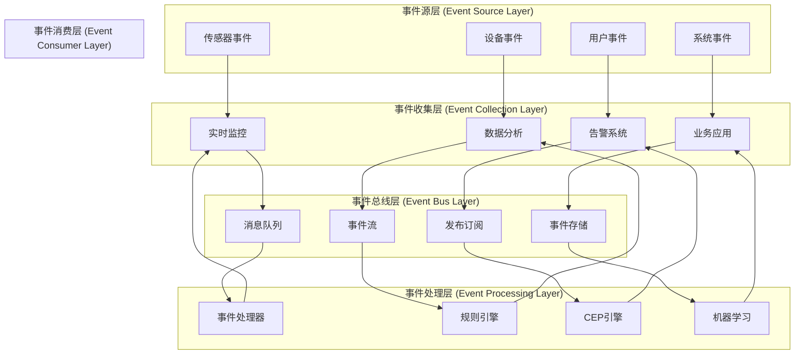
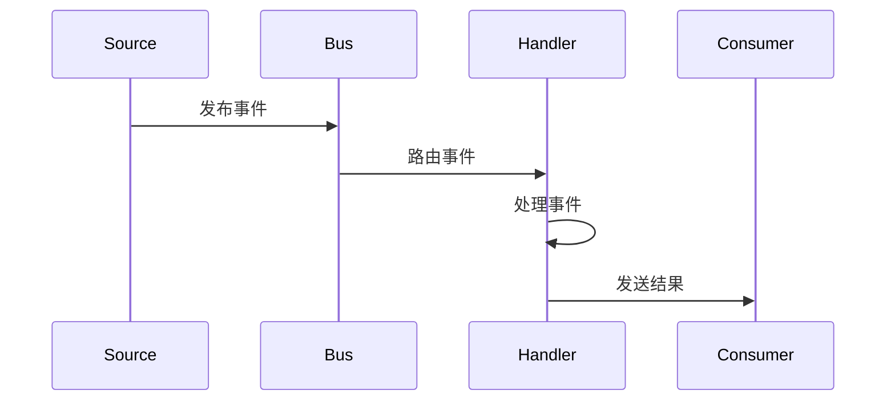
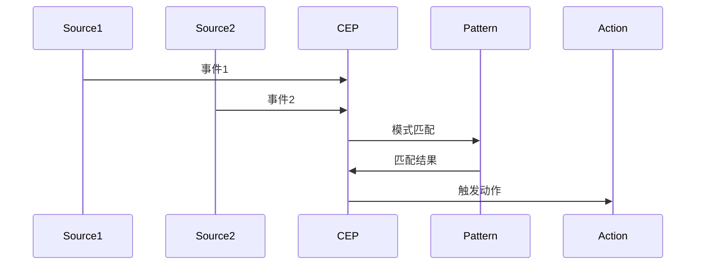
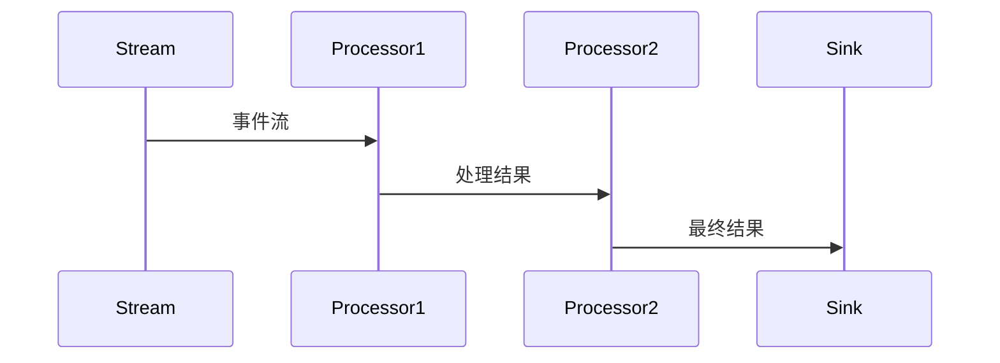

# IoT事件驱动架构

## 目录

1. [概述](#概述)
2. [理论基础](#理论基础)
3. [事件驱动架构模型](#事件驱动架构模型)
4. [形式化定义](#形式化定义)
5. [架构设计](#架构设计)
6. [实现示例](#实现示例)
7. [性能分析](#性能分析)
8. [最佳实践](#最佳实践)

## 概述

事件驱动架构是IoT系统中的核心架构模式，通过事件的生产、传播、消费和处理，实现系统组件间的松耦合通信，特别适合处理IoT环境中的异步、实时数据流和复杂事件处理场景。

## 理论基础

### 定义 5.1 (事件)

事件是一个四元组 $\mathcal{E} = (I, T, D, M)$，其中：

- $I$ 是事件标识符 (Identifier)
- $T$ 是时间戳 (Timestamp)
- $D$ 是事件数据 (Data)
- $M$ 是元数据 (Metadata)

### 定义 5.2 (事件流)

事件流是一个有序的事件序列 $\mathcal{S} = (E_1, E_2, ..., E_n)$，满足：
$$\forall i < j, T(E_i) \leq T(E_j)$$

### 定义 5.3 (事件驱动架构)

事件驱动架构是一个六元组 $\mathcal{A}_{ED} = (P, C, B, R, F, S)$，其中：

- $P = \{P_1, P_2, ..., P_n\}$ 是事件生产者集合
- $C = \{C_1, C_2, ..., C_k\}$ 是事件消费者集合
- $B = \{B_1, B_2, ..., B_l\}$ 是事件总线集合
- $R = \{R_1, R_2, ..., R_p\}$ 是路由规则集合
- $F = \{F_1, F_2, ..., F_q\}$ 是过滤器集合
- $S = \{S_1, S_2, ..., S_r\}$ 是存储组件集合

### 定义 5.4 (事件图)

事件图是一个有向图 $\mathcal{G} = (V, E, W)$，其中：

- $V = \{v_1, v_2, ..., v_n\}$ 是事件节点集合
- $E \subseteq V \times V$ 是事件流关系集合
- $W: E \rightarrow \mathbb{R}^+$ 是权重函数（延迟、吞吐量等）

### 定理 5.1 (事件因果性定理)

在事件驱动系统中，事件的因果性可以通过时间戳和依赖关系确定。

**证明**:
设 $E_1$ 和 $E_2$ 为两个事件，$E_1 \rightarrow E_2$ 表示 $E_1$ 因果先于 $E_2$。
因果性满足：

1. **传递性**: $E_1 \rightarrow E_2 \land E_2 \rightarrow E_3 \Rightarrow E_1 \rightarrow E_3$
2. **反对称性**: $E_1 \rightarrow E_2 \Rightarrow \neg(E_2 \rightarrow E_1)$
3. **时间一致性**: $E_1 \rightarrow E_2 \Rightarrow T(E_1) \leq T(E_2)$

### 定理 5.2 (事件处理一致性定理)

在分布式事件驱动系统中，存在一个一致性协议确保事件处理的顺序一致性。

**证明**:
设 $\mathcal{P}$ 为一致性协议，$\mathcal{E}$ 为事件集合。
一致性协议确保：

1. **全序性**: $\forall E_1, E_2 \in \mathcal{E}, E_1 \prec E_2 \lor E_2 \prec E_1$
2. **因果性**: $E_1 \rightarrow E_2 \Rightarrow E_1 \prec E_2$
3. **稳定性**: 一旦事件被传递，其顺序不再改变

## 事件驱动架构模型

### 事件驱动架构层次



### 事件处理模式

#### 1. 简单事件处理



#### 2. 复杂事件处理



#### 3. 事件流处理



## 形式化定义

### 定义 5.5 (事件生产者)

事件生产者是一个函数 $P: S \rightarrow E$，其中：

- $S$ 是状态集合
- $E$ 是事件集合

### 定义 5.6 (事件消费者)

事件消费者是一个函数 $C: E \rightarrow A$，其中：

- $E$ 是事件集合
- $A$ 是动作集合

### 定义 5.7 (事件总线)

事件总线是一个三元组 $B = (R, F, Q)$，其中：

- $R$ 是路由函数集合
- $F$ 是过滤器集合
- $Q$ 是队列集合

### 定义 5.8 (事件路由)

事件路由是一个函数 $R: E \times C \rightarrow \{true, false\}$，表示事件 $E$ 是否应该路由到消费者 $C$。

### 定义 5.9 (事件过滤器)

事件过滤器是一个函数 $F: E \rightarrow \{true, false\}$，表示事件 $E$ 是否通过过滤。

### 定义 5.10 (事件处理函数)

事件处理函数是一个函数 $H: E \times S \rightarrow S' \times A$，其中：

- $E$ 是输入事件
- $S$ 是当前状态
- $S'$ 是新状态
- $A$ 是输出动作

### 定理 5.3 (事件处理正确性定理)

事件处理函数必须保持状态一致性，即对于任意事件序列，最终状态与事件处理顺序无关。

**证明**:
设 $\mathcal{S} = (E_1, E_2, ..., E_n)$ 为事件序列，$H$ 为事件处理函数。
状态一致性要求：$\forall \pi \in Perm(\mathcal{S}), H(\pi(\mathcal{S})) = H(\mathcal{S})$
这等价于：$H$ 是交换的，即 $\forall E_1, E_2, H(E_1, H(E_2, S)) = H(E_2, H(E_1, S))$

### 定理 5.4 (事件处理性能定理)

事件处理的性能与事件队列长度和处理能力相关。

**证明**:
设 $L$ 为队列长度，$C$ 为处理能力，$T$ 为处理时间。
根据Little定律：$L = C \cdot T$
因此，$T = \frac{L}{C}$，处理时间与队列长度成正比，与处理能力成反比。

## 架构设计

### 事件驱动设计原则

#### 原则 5.1 (松耦合原则)

事件生产者和消费者之间应该保持松耦合：
$$\forall P \in \mathcal{P}, \forall C \in \mathcal{C}, P \not\prec C$$

#### 原则 5.2 (异步处理原则)

事件处理应该是异步的，避免阻塞：
$$\forall E \in \mathcal{E}, Process(E) \text{ 是异步的}$$

#### 原则 5.3 (事件不可变性原则)

事件一旦产生就不可变：
$$\forall E \in \mathcal{E}, \forall t > T(E), E(t) = E(T(E))$$

#### 原则 5.4 (幂等性原则)

事件处理应该是幂等的：
$$\forall E \in \mathcal{E}, \forall n \in \mathbb{N}, H^n(E) = H(E)$$

### 事件驱动模式

#### 1. 发布-订阅模式

- **发布者**: 产生事件但不关心谁消费
- **订阅者**: 订阅感兴趣的事件类型
- **事件总线**: 负责事件的路由和分发

#### 2. 事件流处理模式

- **流处理器**: 连续处理事件流
- **窗口操作**: 在时间或数量窗口内处理事件
- **聚合操作**: 对事件进行聚合计算

#### 3. 复杂事件处理模式

- **模式匹配**: 识别复杂的事件模式
- **事件关联**: 关联多个相关事件
- **规则引擎**: 基于规则处理事件

#### 4. 事件溯源模式

- **事件存储**: 存储所有事件历史
- **状态重建**: 通过重放事件重建状态
- **审计追踪**: 提供完整的审计追踪

## 实现示例

### Rust实现的事件驱动框架

```rust
use std::collections::HashMap;
use std::sync::{Arc, Mutex};
use tokio::sync::{mpsc, RwLock, broadcast};
use serde::{Deserialize, Serialize};
use chrono::{DateTime, Utc};
use uuid::Uuid;

/// 事件定义
#[derive(Clone, Debug, Serialize, Deserialize)]
pub struct Event {
    pub id: String,
    pub event_type: String,
    pub timestamp: DateTime<Utc>,
    pub data: EventData,
    pub metadata: HashMap<String, String>,
    pub source: String,
    pub version: String,
}

#[derive(Clone, Debug, Serialize, Deserialize)]
pub enum EventData {
    SensorData {
        sensor_id: String,
        value: f64,
        unit: String,
    },
    DeviceStatus {
        device_id: String,
        status: DeviceStatus,
        battery_level: Option<f64>,
    },
    Alert {
        alert_type: String,
        severity: AlertSeverity,
        message: String,
    },
    SystemEvent {
        event_code: String,
        description: String,
        parameters: HashMap<String, String>,
    },
}

#[derive(Clone, Debug, Serialize, Deserialize)]
pub enum DeviceStatus {
    Online,
    Offline,
    Error,
    Maintenance,
}

#[derive(Clone, Debug, Serialize, Deserialize)]
pub enum AlertSeverity {
    Low,
    Medium,
    High,
    Critical,
}

/// 事件总线
pub struct EventBus {
    publishers: Arc<RwLock<HashMap<String, mpsc::Sender<Event>>>>,
    subscribers: Arc<RwLock<HashMap<String, Vec<mpsc::Sender<Event>>>>>,
    broadcast_tx: broadcast::Sender<Event>,
    event_store: Arc<EventStore>,
    routing_rules: Arc<RoutingRules>,
}

impl EventBus {
    pub fn new() -> Self {
        let (broadcast_tx, _) = broadcast::channel(1000);
        
        Self {
            publishers: Arc::new(RwLock::new(HashMap::new())),
            subscribers: Arc::new(RwLock::new(HashMap::new())),
            broadcast_tx,
            event_store: Arc::new(EventStore::new()),
            routing_rules: Arc::new(RoutingRules::new()),
        }
    }
    
    /// 发布事件
    pub async fn publish(&self, event: Event) -> Result<(), Box<dyn std::error::Error>> {
        // 存储事件
        self.event_store.store(event.clone()).await?;
        
        // 广播事件
        let _ = self.broadcast_tx.send(event.clone());
        
        // 路由到特定订阅者
        self.route_event(&event).await?;
        
        Ok(())
    }
    
    /// 订阅事件
    pub async fn subscribe(&self, event_type: &str) -> mpsc::Receiver<Event> {
        let (tx, rx) = mpsc::channel(100);
        
        {
            let mut subscribers = self.subscribers.write().await;
            let event_subscribers = subscribers.entry(event_type.to_string()).or_insert_with(Vec::new);
            event_subscribers.push(tx);
        }
        
        rx
    }
    
    /// 路由事件
    async fn route_event(&self, event: &Event) -> Result<(), Box<dyn std::error::Error>> {
        let routing_rules = self.routing_rules.get_rules(&event.event_type).await?;
        
        for rule in routing_rules {
            if rule.matches(event).await? {
                let subscribers = self.subscribers.read().await;
                if let Some(event_subscribers) = subscribers.get(&rule.target) {
                    for subscriber in event_subscribers {
                        let _ = subscriber.send(event.clone()).await;
                    }
                }
            }
        }
        
        Ok(())
    }
    
    /// 获取事件历史
    pub async fn get_event_history(&self, event_type: Option<&str>, limit: usize) -> Result<Vec<Event>, Box<dyn std::error::Error>> {
        self.event_store.get_events(event_type, limit).await
    }
}

/// 事件存储
pub struct EventStore {
    events: Arc<RwLock<Vec<Event>>>,
    index: Arc<RwLock<HashMap<String, Vec<usize>>>>,
}

impl EventStore {
    pub fn new() -> Self {
        Self {
            events: Arc::new(RwLock::new(Vec::new())),
            index: Arc::new(RwLock::new(HashMap::new())),
        }
    }
    
    pub async fn store(&self, event: Event) -> Result<(), Box<dyn std::error::Error>> {
        let mut events = self.events.write().await;
        let event_index = events.len();
        events.push(event.clone());
        
        // 更新索引
        let mut index = self.index.write().await;
        let event_type_index = index.entry(event.event_type.clone()).or_insert_with(Vec::new);
        event_type_index.push(event_index);
        
        Ok(())
    }
    
    pub async fn get_events(&self, event_type: Option<&str>, limit: usize) -> Result<Vec<Event>, Box<dyn std::error::Error>> {
        let events = self.events.read().await;
        
        if let Some(event_type) = event_type {
            let index = self.index.read().await;
            if let Some(indices) = index.get(event_type) {
                let mut result = Vec::new();
                for &index in indices.iter().rev().take(limit) {
                    if index < events.len() {
                        result.push(events[index].clone());
                    }
                }
                Ok(result)
            } else {
                Ok(Vec::new())
            }
        } else {
            Ok(events.iter().rev().take(limit).cloned().collect())
        }
    }
}

/// 路由规则
pub struct RoutingRules {
    rules: Arc<RwLock<Vec<RoutingRule>>>,
}

#[derive(Clone)]
pub struct RoutingRule {
    pub event_type: String,
    pub target: String,
    pub condition: RuleCondition,
}

#[derive(Clone)]
pub enum RuleCondition {
    Always,
    FieldEquals { field: String, value: String },
    FieldContains { field: String, value: String },
    Custom(Box<dyn Fn(&Event) -> bool + Send + Sync>),
}

impl RoutingRules {
    pub fn new() -> Self {
        Self {
            rules: Arc::new(RwLock::new(Vec::new())),
        }
    }
    
    pub async fn add_rule(&self, rule: RoutingRule) -> Result<(), Box<dyn std::error::Error>> {
        let mut rules = self.rules.write().await;
        rules.push(rule);
        Ok(())
    }
    
    pub async fn get_rules(&self, event_type: &str) -> Result<Vec<RoutingRule>, Box<dyn std::error::Error>> {
        let rules = self.rules.read().await;
        Ok(rules.iter()
            .filter(|rule| rule.event_type == event_type)
            .cloned()
            .collect())
    }
}

impl RoutingRule {
    pub async fn matches(&self, event: &Event) -> Result<bool, Box<dyn std::error::Error>> {
        match &self.condition {
            RuleCondition::Always => Ok(true),
            RuleCondition::FieldEquals { field, value } => {
                // 简化实现，实际应该解析事件数据
                Ok(true)
            }
            RuleCondition::FieldContains { field, value } => {
                // 简化实现，实际应该解析事件数据
                Ok(true)
            }
            RuleCondition::Custom(predicate) => {
                Ok(predicate(event))
            }
        }
    }
}

/// 事件处理器
pub struct EventProcessor {
    bus: Arc<EventBus>,
    handlers: Arc<RwLock<HashMap<String, Box<dyn EventHandler + Send + Sync>>>>,
}

#[async_trait::async_trait]
pub trait EventHandler: Send + Sync {
    async fn handle(&self, event: &Event) -> Result<Vec<Event>, Box<dyn std::error::Error>>;
}

impl EventProcessor {
    pub fn new(bus: Arc<EventBus>) -> Self {
        Self {
            bus,
            handlers: Arc::new(RwLock::new(HashMap::new())),
        }
    }
    
    pub async fn register_handler(&self, event_type: &str, handler: Box<dyn EventHandler + Send + Sync>) -> Result<(), Box<dyn std::error::Error>> {
        let mut handlers = self.handlers.write().await;
        handlers.insert(event_type.to_string(), handler);
        Ok(())
    }
    
    pub async fn process_event(&self, event: &Event) -> Result<(), Box<dyn std::error::Error>> {
        let handlers = self.handlers.read().await;
        
        if let Some(handler) = handlers.get(&event.event_type) {
            let new_events = handler.handle(event).await?;
            
            // 发布新产生的事件
            for new_event in new_events {
                self.bus.publish(new_event).await?;
            }
        }
        
        Ok(())
    }
}

/// 传感器数据处理器
pub struct SensorDataHandler;

#[async_trait::async_trait]
impl EventHandler for SensorDataHandler {
    async fn handle(&self, event: &Event) -> Result<Vec<Event>, Box<dyn std::error::Error>> {
        let mut new_events = Vec::new();
        
        if let EventData::SensorData { sensor_id, value, unit } = &event.data {
            // 检查阈值
            if *value > 100.0 {
                let alert_event = Event {
                    id: Uuid::new_v4().to_string(),
                    event_type: "alert".to_string(),
                    timestamp: Utc::now(),
                    data: EventData::Alert {
                        alert_type: "threshold_exceeded".to_string(),
                        severity: AlertSeverity::High,
                        message: format!("Sensor {} value {} {} exceeds threshold", sensor_id, value, unit),
                    },
                    metadata: HashMap::new(),
                    source: "sensor_handler".to_string(),
                    version: "1.0".to_string(),
                };
                new_events.push(alert_event);
            }
        }
        
        Ok(new_events)
    }
}

/// 设备状态处理器
pub struct DeviceStatusHandler;

#[async_trait::async_trait]
impl EventHandler for DeviceStatusHandler {
    async fn handle(&self, event: &Event) -> Result<Vec<Event>, Box<dyn std::error::Error>> {
        let mut new_events = Vec::new();
        
        if let EventData::DeviceStatus { device_id, status, battery_level } = &event.data {
            match status {
                DeviceStatus::Offline => {
                    let alert_event = Event {
                        id: Uuid::new_v4().to_string(),
                        event_type: "alert".to_string(),
                        timestamp: Utc::now(),
                        data: EventData::Alert {
                            alert_type: "device_offline".to_string(),
                            severity: AlertSeverity::Medium,
                            message: format!("Device {} is offline", device_id),
                        },
                        metadata: HashMap::new(),
                        source: "device_handler".to_string(),
                        version: "1.0".to_string(),
                    };
                    new_events.push(alert_event);
                }
                DeviceStatus::Error => {
                    let alert_event = Event {
                        id: Uuid::new_v4().to_string(),
                        event_type: "alert".to_string(),
                        timestamp: Utc::now(),
                        data: EventData::Alert {
                            alert_type: "device_error".to_string(),
                            severity: AlertSeverity::Critical,
                            message: format!("Device {} has an error", device_id),
                        },
                        metadata: HashMap::new(),
                        source: "device_handler".to_string(),
                        version: "1.0".to_string(),
                    };
                    new_events.push(alert_event);
                }
                _ => {}
            }
        }
        
        Ok(new_events)
    }
}

/// 复杂事件处理器
pub struct ComplexEventProcessor {
    patterns: Arc<RwLock<Vec<EventPattern>>>,
    window_size: usize,
    time_window: std::time::Duration,
}

#[derive(Clone)]
pub struct EventPattern {
    pub pattern_id: String,
    pub events: Vec<String>,
    pub time_constraint: Option<std::time::Duration>,
    pub action: PatternAction,
}

#[derive(Clone)]
pub enum PatternAction {
    GenerateAlert { message: String, severity: AlertSeverity },
    TriggerAction { action_type: String, parameters: HashMap<String, String> },
}

impl ComplexEventProcessor {
    pub fn new(window_size: usize, time_window: std::time::Duration) -> Self {
        Self {
            patterns: Arc::new(RwLock::new(Vec::new())),
            window_size,
            time_window,
        }
    }
    
    pub async fn add_pattern(&self, pattern: EventPattern) -> Result<(), Box<dyn std::error::Error>> {
        let mut patterns = self.patterns.write().await;
        patterns.push(pattern);
        Ok(())
    }
    
    pub async fn process_event(&self, event: &Event, event_window: &[Event]) -> Result<Vec<Event>, Box<dyn std::error::Error>> {
        let mut new_events = Vec::new();
        let patterns = self.patterns.read().await;
        
        for pattern in patterns.iter() {
            if self.matches_pattern(event, event_window, pattern).await? {
                let pattern_event = self.generate_pattern_event(event, pattern).await?;
                new_events.push(pattern_event);
            }
        }
        
        Ok(new_events)
    }
    
    async fn matches_pattern(&self, event: &Event, event_window: &[Event], pattern: &EventPattern) -> Result<bool, Box<dyn std::error::Error>> {
        // 检查事件类型序列
        let event_types: Vec<String> = event_window.iter()
            .map(|e| e.event_type.clone())
            .collect();
        
        if event_types.len() < pattern.events.len() {
            return Ok(false);
        }
        
        // 检查时间约束
        if let Some(time_constraint) = pattern.time_constraint {
            let window_start = event_window.first().map(|e| e.timestamp).unwrap_or(Utc::now());
            let window_end = event_window.last().map(|e| e.timestamp).unwrap_or(Utc::now());
            let window_duration = window_end - window_start;
            
            if window_duration > chrono::Duration::from_std(time_constraint)? {
                return Ok(false);
            }
        }
        
        // 检查事件序列匹配
        for (i, expected_type) in pattern.events.iter().enumerate() {
            if i >= event_types.len() || &event_types[i] != expected_type {
                return Ok(false);
            }
        }
        
        Ok(true)
    }
    
    async fn generate_pattern_event(&self, trigger_event: &Event, pattern: &EventPattern) -> Result<Event, Box<dyn std::error::Error>> {
        match &pattern.action {
            PatternAction::GenerateAlert { message, severity } => {
                Ok(Event {
                    id: Uuid::new_v4().to_string(),
                    event_type: "pattern_alert".to_string(),
                    timestamp: Utc::now(),
                    data: EventData::Alert {
                        alert_type: format!("pattern_{}", pattern.pattern_id),
                        severity: severity.clone(),
                        message: message.clone(),
                    },
                    metadata: HashMap::new(),
                    source: "complex_event_processor".to_string(),
                    version: "1.0".to_string(),
                })
            }
            PatternAction::TriggerAction { action_type, parameters } => {
                Ok(Event {
                    id: Uuid::new_v4().to_string(),
                    event_type: "pattern_action".to_string(),
                    timestamp: Utc::now(),
                    data: EventData::SystemEvent {
                        event_code: action_type.clone(),
                        description: format!("Pattern {} triggered", pattern.pattern_id),
                        parameters: parameters.clone(),
                    },
                    metadata: HashMap::new(),
                    source: "complex_event_processor".to_string(),
                    version: "1.0".to_string(),
                })
            }
        }
    }
}

/// 事件流处理器
pub struct EventStreamProcessor {
    processors: Arc<RwLock<HashMap<String, Box<dyn StreamProcessor + Send + Sync>>>>,
}

#[async_trait::async_trait]
pub trait StreamProcessor: Send + Sync {
    async fn process_stream(&self, events: &[Event]) -> Result<Vec<Event>, Box<dyn std::error::Error>>;
}

impl EventStreamProcessor {
    pub fn new() -> Self {
        Self {
            processors: Arc::new(RwLock::new(HashMap::new())),
        }
    }
    
    pub async fn register_processor(&self, stream_type: &str, processor: Box<dyn StreamProcessor + Send + Sync>) -> Result<(), Box<dyn std::error::Error>> {
        let mut processors = self.processors.write().await;
        processors.insert(stream_type.to_string(), processor);
        Ok(())
    }
    
    pub async fn process_stream(&self, stream_type: &str, events: &[Event]) -> Result<Vec<Event>, Box<dyn std::error::Error>> {
        let processors = self.processors.read().await;
        
        if let Some(processor) = processors.get(stream_type) {
            processor.process_stream(events).await
        } else {
            Ok(Vec::new())
        }
    }
}

/// 数据聚合处理器
pub struct DataAggregationProcessor;

#[async_trait::async_trait]
impl StreamProcessor for DataAggregationProcessor {
    async fn process_stream(&self, events: &[Event]) -> Result<Vec<Event>, Box<dyn std::error::Error>> {
        let mut aggregated_events = Vec::new();
        
        // 按传感器ID分组
        let mut sensor_groups: HashMap<String, Vec<f64>> = HashMap::new();
        
        for event in events {
            if let EventData::SensorData { sensor_id, value, unit } = &event.data {
                sensor_groups.entry(sensor_id.clone()).or_insert_with(Vec::new).push(*value);
            }
        }
        
        // 计算聚合值
        for (sensor_id, values) in sensor_groups {
            let avg_value = values.iter().sum::<f64>() / values.len() as f64;
            let max_value = values.iter().fold(f64::NEG_INFINITY, |a, &b| a.max(b));
            let min_value = values.iter().fold(f64::INFINITY, |a, &b| a.min(b));
            
            let aggregated_event = Event {
                id: Uuid::new_v4().to_string(),
                event_type: "aggregated_data".to_string(),
                timestamp: Utc::now(),
                data: EventData::SystemEvent {
                    event_code: "data_aggregation".to_string(),
                    description: format!("Aggregated data for sensor {}", sensor_id),
                    parameters: {
                        let mut params = HashMap::new();
                        params.insert("sensor_id".to_string(), sensor_id);
                        params.insert("avg_value".to_string(), avg_value.to_string());
                        params.insert("max_value".to_string(), max_value.to_string());
                        params.insert("min_value".to_string(), min_value.to_string());
                        params.insert("count".to_string(), values.len().to_string());
                        params
                    },
                },
                metadata: HashMap::new(),
                source: "stream_processor".to_string(),
                version: "1.0".to_string(),
            };
            
            aggregated_events.push(aggregated_event);
        }
        
        Ok(aggregated_events)
    }
}
```

## 性能分析

### 事件处理性能分析

#### 1. 事件吞吐量

$$T_{throughput} = \frac{N_{events}}{T_{processing}}$$

其中 $N_{events}$ 是处理的事件数量，$T_{processing}$ 是处理时间。

#### 2. 事件延迟

$$L_{latency} = L_{publish} + L_{routing} + L_{processing} + L_{delivery}$$

其中：

- $L_{publish}$ 是发布延迟
- $L_{routing}$ 是路由延迟
- $L_{processing}$ 是处理延迟
- $L_{delivery}$ 是投递延迟

#### 3. 事件队列长度

$$Q_{length} = \lambda \cdot W$$

其中 $\lambda$ 是到达率，$W$ 是等待时间。

### 性能优化策略

#### 1. 并行处理

```rust
use tokio::task;

pub async fn process_events_parallel(&self, events: &[Event]) -> Result<Vec<Event>, Box<dyn std::error::Error>> {
    let mut tasks = Vec::new();
    
    for event in events {
        let event_clone = event.clone();
        let processor_clone = self.clone();
        
        let task = task::spawn(async move {
            processor_clone.process_event(&event_clone).await
        });
        
        tasks.push(task);
    }
    
    let mut results = Vec::new();
    for task in tasks {
        results.push(task.await??);
    }
    
    Ok(results)
}
```

#### 2. 批量处理

```rust
pub async fn process_events_batch(&self, events: &[Event], batch_size: usize) -> Result<Vec<Event>, Box<dyn std::error::Error>> {
    let mut results = Vec::new();
    
    for chunk in events.chunks(batch_size) {
        let batch_results = self.process_events_parallel(chunk).await?;
        results.extend(batch_results);
    }
    
    Ok(results)
}
```

#### 3. 缓存优化

```rust
use std::collections::HashMap;
use tokio::sync::RwLock;

pub struct EventCache {
    cache: Arc<RwLock<HashMap<String, Event>>>,
    ttl: std::time::Duration,
}

impl EventCache {
    pub fn new(ttl: std::time::Duration) -> Self {
        Self {
            cache: Arc::new(RwLock::new(HashMap::new())),
            ttl,
        }
    }
    
    pub async fn get(&self, key: &str) -> Option<Event> {
        let cache = self.cache.read().await;
        cache.get(key).cloned()
    }
    
    pub async fn set(&self, key: String, event: Event) {
        let mut cache = self.cache.write().await;
        cache.insert(key, event);
    }
}
```

## 最佳实践

### 1. 事件设计

- **事件不可变性**: 事件一旦产生就不可变
- **事件幂等性**: 事件处理应该是幂等的
- **事件版本化**: 实现事件版本管理
- **事件序列化**: 使用高效的序列化格式

### 2. 性能优化

- **异步处理**: 使用异步处理避免阻塞
- **批量处理**: 批量处理提高吞吐量
- **并行处理**: 利用多线程提高并发性能
- **缓存策略**: 实现合理的缓存策略

### 3. 可靠性保证

- **事件持久化**: 确保事件不丢失
- **重试机制**: 实现智能重试机制
- **死信队列**: 处理无法处理的事件
- **监控告警**: 建立完善的监控体系

### 4. 扩展性设计

- **水平扩展**: 支持水平扩展
- **分区策略**: 实现合理的事件分区
- **负载均衡**: 实现负载均衡
- **服务发现**: 支持动态服务发现

## 相关链接

- [01-Layered-Architecture](01-Layered-Architecture.md) - 分层架构
- [02-Edge-Computing](02-Edge-Computing.md) - 边缘计算架构
- [03-Microservices](03-Microservices.md) - 微服务架构
- [04-WASM-Containerization](04-WASM-Containerization.md) - WASM容器化架构

---

*最后更新: 2024-12-19*
*版本: 1.0*
