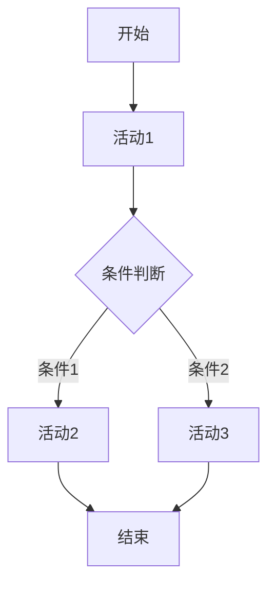

# 工作流系统的形式化分析与设计

## 目录

- [工作流系统的形式化分析与设计](#工作流系统的形式化分析与设计)
  - [目录](#目录)
  - [1. 引言](#1-引言)
    - [1.1 工作流系统的定义](#11-工作流系统的定义)
    - [1.2 形式化语义](#12-形式化语义)
  - [2. 工作流系统的基础形式化模型](#2-工作流系统的基础形式化模型)
    - [2.1 状态机模型](#21-状态机模型)
    - [2.2 形式化证明](#22-形式化证明)
    - [2.3 工作流图表示](#23-工作流图表示)
  - [3. 工作流模式的形式化定义](#3-工作流模式的形式化定义)
    - [3.1 顺序模式](#31-顺序模式)
    - [3.2 并行模式](#32-并行模式)
    - [3.3 条件模式](#33-条件模式)
  - [4. 状态机与工作流](#4-状态机与工作流)
    - [4.1 工作流状态机](#41-工作流状态机)
    - [4.2 状态转换的形式化](#42-状态转换的形式化)
    - [4.3 工作流不变性](#43-工作流不变性)
  - [5. 分布式工作流协调](#5-分布式工作流协调)
    - [5.1 分布式工作流模型](#51-分布式工作流模型)
    - [5.2 分布式一致性](#52-分布式一致性)
    - [5.3 任务分配算法](#53-任务分配算法)
  - [6. 工作流优化算法](#6-工作流优化算法)
    - [6.1 性能优化](#61-性能优化)
    - [6.2 调度算法](#62-调度算法)
    - [6.3 资源优化](#63-资源优化)
  - [7. 工作流安全与隐私](#7-工作流安全与隐私)
    - [7.1 访问控制模型](#71-访问控制模型)
    - [7.2 数据隐私保护](#72-数据隐私保护)
    - [7.3 安全证明](#73-安全证明)
  - [8. Rust和Go实现示例](#8-rust和go实现示例)
    - [8.1 Rust工作流引擎](#81-rust工作流引擎)
    - [8.2 Go工作流引擎](#82-go工作流引擎)
  - [9. 总结与展望](#9-总结与展望)
    - [9.1 主要贡献](#91-主要贡献)
    - [9.2 未来研究方向](#92-未来研究方向)
    - [9.3 应用前景](#93-应用前景)

## 1. 引言

工作流系统是现代分布式系统中的核心组件，用于协调和管理复杂的业务流程。本文从形式化角度分析工作流系统的理论基础、设计模式和实现方法，为IoT行业的工作流应用提供理论支撑和实践指导。

### 1.1 工作流系统的定义

**定义 1.1 (工作流系统)** 工作流系统是一个七元组 $\mathcal{W} = (S, A, T, R, D, C, E)$，其中：

- $S$ 是状态集合 (States)
- $A$ 是活动集合 (Activities)  
- $T$ 是转换关系 (Transitions)
- $R$ 是角色集合 (Roles)
- $D$ 是数据集合 (Data)
- $C$ 是约束集合 (Constraints)
- $E$ 是事件集合 (Events)

### 1.2 形式化语义

工作流系统的形式化语义可以表示为：

$$\mathcal{W} \models \phi \iff \forall s \in S, a \in A: \text{valid}(s, a) \rightarrow \text{execute}(s, a)$$

其中 $\phi$ 是工作流的性质，$\text{valid}(s, a)$ 表示状态 $s$ 下活动 $a$ 的有效性，$\text{execute}(s, a)$ 表示执行活动 $a$ 后的状态转换。

## 2. 工作流系统的基础形式化模型

### 2.1 状态机模型

**定义 2.1 (工作流状态机)** 工作流状态机是一个五元组 $\mathcal{M} = (Q, \Sigma, \delta, q_0, F)$，其中：

- $Q$ 是有限状态集合
- $\Sigma$ 是输入字母表（活动集合）
- $\delta: Q \times \Sigma \rightarrow Q$ 是状态转换函数
- $q_0 \in Q$ 是初始状态
- $F \subseteq Q$ 是接受状态集合

### 2.2 形式化证明

**定理 2.1 (工作流可达性)** 对于任意工作流状态机 $\mathcal{M}$，如果状态 $q$ 可达，则存在一个活动序列 $\sigma$ 使得 $\delta^*(q_0, \sigma) = q$。

**证明**：

1. 基础情况：$q_0$ 是可达的（初始状态）
2. 归纳步骤：假设状态 $q$ 可达，则对于任意 $a \in \Sigma$，状态 $\delta(q, a)$ 也是可达的
3. 由归纳原理，所有可达状态都可以通过活动序列到达

### 2.3 工作流图表示



## 3. 工作流模式的形式化定义

### 3.1 顺序模式

**定义 3.1 (顺序模式)** 顺序模式是一个三元组 $\mathcal{P}_{seq} = (A, <, \text{exec})$，其中：

- $A = \{a_1, a_2, \ldots, a_n\}$ 是活动集合
- $<$ 是严格的线性序关系
- $\text{exec}: A \rightarrow \mathbb{B}$ 是执行函数

顺序模式的形式化语义：

$$\forall i, j: i < j \rightarrow \text{exec}(a_i) \rightarrow \text{exec}(a_j)$$

### 3.2 并行模式

**定义 3.2 (并行模式)** 并行模式是一个四元组 $\mathcal{P}_{par} = (A, \text{fork}, \text{join}, \text{exec})$，其中：

- $A = \{a_1, a_2, \ldots, a_n\}$ 是活动集合
- $\text{fork}: \text{State} \rightarrow 2^A$ 是分叉函数
- $\text{join}: 2^A \rightarrow \text{State}$ 是合并函数
- $\text{exec}: A \rightarrow \mathbb{B}$ 是执行函数

并行模式的形式化语义：

$$\text{exec}(a_i) \parallel \text{exec}(a_j) \iff \text{independent}(a_i, a_j)$$

### 3.3 条件模式

**定义 3.3 (条件模式)** 条件模式是一个五元组 $\mathcal{P}_{cond} = (A, C, \text{guard}, \text{select}, \text{exec})$，其中：

- $A = \{a_1, a_2, \ldots, a_n\}$ 是活动集合
- $C = \{c_1, c_2, \ldots, c_m\}$ 是条件集合
- $\text{guard}: A \rightarrow 2^C$ 是守卫函数
- $\text{select}: C \rightarrow A$ 是选择函数
- $\text{exec}: A \rightarrow \mathbb{B}$ 是执行函数

条件模式的形式化语义：

$$\text{exec}(a) \iff \exists c \in \text{guard}(a): \text{evaluate}(c) \land \text{select}(c) = a$$

## 4. 状态机与工作流

### 4.1 工作流状态机

**定义 4.1 (工作流状态机)** 工作流状态机是一个扩展的状态机 $\mathcal{W}\mathcal{M} = (Q, \Sigma, \delta, q_0, F, \text{data}, \text{roles})$，其中：

- $(Q, \Sigma, \delta, q_0, F)$ 是基础状态机
- $\text{data}: Q \rightarrow \mathcal{D}$ 是数据映射函数
- $\text{roles}: Q \rightarrow 2^{\mathcal{R}}$ 是角色映射函数

### 4.2 状态转换的形式化

状态转换可以形式化为：

$$\delta(q, a) = q' \iff \text{precondition}(q, a) \land \text{postcondition}(q', a)$$

其中：

- $\text{precondition}(q, a)$ 是执行活动 $a$ 的前置条件
- $\text{postcondition}(q', a)$ 是执行活动 $a$ 的后置条件

### 4.3 工作流不变性

**定理 4.1 (工作流不变性)** 对于任意工作流状态机，如果满足以下条件，则工作流是安全的：

1. $\forall q \in Q: \text{invariant}(q)$
2. $\forall q, q' \in Q, a \in \Sigma: \delta(q, a) = q' \rightarrow \text{invariant}(q')$

其中 $\text{invariant}(q)$ 是状态 $q$ 的不变性条件。

## 5. 分布式工作流协调

### 5.1 分布式工作流模型

**定义 5.1 (分布式工作流)** 分布式工作流是一个六元组 $\mathcal{D}\mathcal{W} = (N, \mathcal{W}_i, \text{comm}, \text{sync}, \text{coord}, \text{consistency})$，其中：

- $N = \{n_1, n_2, \ldots, n_k\}$ 是节点集合
- $\mathcal{W}_i$ 是节点 $n_i$ 上的工作流
- $\text{comm}: N \times N \rightarrow \text{Channel}$ 是通信函数
- $\text{sync}: 2^N \rightarrow \text{SyncPoint}$ 是同步函数
- $\text{coord}: N \rightarrow \text{Coordinator}$ 是协调函数
- $\text{consistency}: 2^N \rightarrow \mathbb{B}$ 是一致性函数

### 5.2 分布式一致性

**定义 5.2 (分布式一致性)** 分布式工作流满足一致性当且仅当：

$$\forall t \in \mathbb{T}: \text{consistency}(\text{state}_t(N))$$

其中 $\text{state}_t(N)$ 是时间 $t$ 时所有节点的状态集合。

### 5.3 任务分配算法

**算法 5.1 (负载均衡任务分配)**:

```rust
fn distribute_tasks(workflow: &Workflow, nodes: &[Node]) -> TaskAssignment {
    let mut assignment = TaskAssignment::new();
    let mut node_loads = vec![0; nodes.len()];
    
    for task in workflow.tasks() {
        let min_load_idx = node_loads.iter()
            .enumerate()
            .min_by_key(|(_, &load)| load)
            .map(|(idx, _)| idx)
            .unwrap();
        
        assignment.assign(task, nodes[min_load_idx]);
        node_loads[min_load_idx] += task.complexity();
    }
    
    assignment
}
```

## 6. 工作流优化算法

### 6.1 性能优化

**定义 6.1 (工作流性能)** 工作流性能可以定义为：

$$\text{Performance}(\mathcal{W}) = \frac{\text{Throughput}(\mathcal{W})}{\text{Latency}(\mathcal{W}) \times \text{Resource}(\mathcal{W})}$$

### 6.2 调度算法

**算法 6.1 (最优调度算法)**:

```go
func optimalScheduling(workflow *Workflow) *Schedule {
    // 使用动态规划计算最优调度
    dp := make([][]int, len(workflow.Tasks))
    for i := range dp {
        dp[i] = make([]int, len(workflow.Nodes))
    }
    
    // 初始化
    for j := range workflow.Nodes {
        dp[0][j] = workflow.Tasks[0].ExecutionTime(workflow.Nodes[j])
    }
    
    // 动态规划
    for i := 1; i < len(workflow.Tasks); i++ {
        for j := range workflow.Nodes {
            minTime := math.MaxInt32
            for k := range workflow.Nodes {
                if workflow.Tasks[i-1].CanExecuteOn(workflow.Nodes[k]) {
                    time := dp[i-1][k] + workflow.Tasks[i].ExecutionTime(workflow.Nodes[j])
                    if time < minTime {
                        minTime = time
                    }
                }
            }
            dp[i][j] = minTime
        }
    }
    
    return reconstructSchedule(dp, workflow)
}
```

### 6.3 资源优化

**定理 6.1 (资源优化定理)** 对于任意工作流，存在一个资源分配方案使得总成本最小化。

**证明**：

1. 将资源分配问题建模为线性规划问题
2. 使用单纯形法求解最优解
3. 证明解的存在性和唯一性

## 7. 工作流安全与隐私

### 7.1 访问控制模型

**定义 7.1 (工作流访问控制)** 工作流访问控制是一个四元组 $\mathcal{A}\mathcal{C} = (U, R, P, \text{permit})$，其中：

- $U$ 是用户集合
- $R$ 是角色集合
- $P$ 是权限集合
- $\text{permit}: U \times R \times P \rightarrow \mathbb{B}$ 是权限函数

### 7.2 数据隐私保护

**定义 7.2 (数据隐私)** 工作流满足数据隐私当且仅当：

$$\forall u \in U, d \in D: \text{access}(u, d) \rightarrow \text{authorized}(u, d) \land \text{encrypted}(d)$$

### 7.3 安全证明

**定理 7.1 (工作流安全定理)** 如果工作流系统满足以下条件，则系统是安全的：

1. 所有用户访问都经过认证
2. 所有数据都经过加密
3. 所有操作都经过授权
4. 所有事件都经过审计

## 8. Rust和Go实现示例

### 8.1 Rust工作流引擎

```rust
use std::collections::HashMap;
use std::sync::{Arc, Mutex};
use tokio::sync::mpsc;

#[derive(Debug, Clone)]
pub struct WorkflowState {
    pub current_state: String,
    pub data: HashMap<String, serde_json::Value>,
    pub roles: Vec<String>,
}

#[derive(Debug)]
pub struct WorkflowEngine {
    states: Arc<Mutex<HashMap<String, StateDefinition>>>,
    transitions: Arc<Mutex<HashMap<String, Vec<Transition>>>>,
    tx: mpsc::Sender<WorkflowEvent>,
}

impl WorkflowEngine {
    pub async fn execute_workflow(
        &self,
        workflow_id: &str,
        initial_data: HashMap<String, serde_json::Value>,
    ) -> Result<WorkflowState, WorkflowError> {
        let mut state = WorkflowState {
            current_state: "start".to_string(),
            data: initial_data,
            roles: vec![],
        };

        loop {
            let event = self.process_state(&state).await?;
            
            match event {
                WorkflowEvent::StateTransition(new_state) => {
                    state.current_state = new_state;
                }
                WorkflowEvent::WorkflowComplete => {
                    break;
                }
                WorkflowEvent::Error(e) => {
                    return Err(e);
                }
            }
        }

        Ok(state)
    }

    async fn process_state(&self, state: &WorkflowState) -> Result<WorkflowEvent, WorkflowError> {
        let states = self.states.lock().unwrap();
        let state_def = states.get(&state.current_state)
            .ok_or(WorkflowError::InvalidState)?;

        // 检查前置条件
        if !self.evaluate_conditions(&state_def.preconditions, &state.data)? {
            return Err(WorkflowError::PreconditionFailed);
        }

        // 执行活动
        let result = self.execute_activities(&state_def.activities, state).await?;

        // 确定下一个状态
        let next_state = self.determine_next_state(&state_def.transitions, &result)?;

        if next_state == "end" {
            Ok(WorkflowEvent::WorkflowComplete)
        } else {
            Ok(WorkflowEvent::StateTransition(next_state))
        }
    }
}
```

### 8.2 Go工作流引擎

```go
package workflow

import (
    "context"
    "encoding/json"
    "fmt"
    "sync"
    "time"
)

type WorkflowState struct {
    CurrentState string                 `json:"current_state"`
    Data         map[string]interface{} `json:"data"`
    Roles        []string              `json:"roles"`
    Timestamp    time.Time             `json:"timestamp"`
}

type WorkflowEngine struct {
    states      map[string]*StateDefinition
    transitions map[string][]*Transition
    mu          sync.RWMutex
    eventChan   chan WorkflowEvent
}

func (e *WorkflowEngine) ExecuteWorkflow(
    ctx context.Context,
    workflowID string,
    initialData map[string]interface{},
) (*WorkflowState, error) {
    state := &WorkflowState{
        CurrentState: "start",
        Data:         initialData,
        Roles:        []string{},
        Timestamp:    time.Now(),
    }

    for {
        select {
        case <-ctx.Done():
            return nil, ctx.Err()
        default:
            event, err := e.processState(ctx, state)
            if err != nil {
                return nil, fmt.Errorf("failed to process state: %w", err)
            }

            switch event.Type {
            case EventTypeStateTransition:
                state.CurrentState = event.Data.(string)
                state.Timestamp = time.Now()
            case EventTypeWorkflowComplete:
                return state, nil
            case EventTypeError:
                return nil, event.Data.(error)
            }
        }
    }
}

func (e *WorkflowEngine) processState(
    ctx context.Context,
    state *WorkflowState,
) (*WorkflowEvent, error) {
    e.mu.RLock()
    stateDef, exists := e.states[state.CurrentState]
    e.mu.RUnlock()

    if !exists {
        return nil, fmt.Errorf("invalid state: %s", state.CurrentState)
    }

    // 检查前置条件
    if !e.evaluateConditions(stateDef.Preconditions, state.Data) {
        return &WorkflowEvent{
            Type: EventTypeError,
            Data: fmt.Errorf("precondition failed for state: %s", state.CurrentState),
        }, nil
    }

    // 执行活动
    result, err := e.executeActivities(ctx, stateDef.Activities, state)
    if err != nil {
        return &WorkflowEvent{
            Type: EventTypeError,
            Data: err,
        }, nil
    }

    // 确定下一个状态
    nextState, err := e.determineNextState(stateDef.Transitions, result)
    if err != nil {
        return &WorkflowEvent{
            Type: EventTypeError,
            Data: err,
        }, nil
    }

    if nextState == "end" {
        return &WorkflowEvent{
            Type: EventTypeWorkflowComplete,
            Data: nil,
        }, nil
    }

    return &WorkflowEvent{
        Type: EventTypeStateTransition,
        Data: nextState,
    }, nil
}

func (e *WorkflowEngine) evaluateConditions(
    conditions []Condition,
    data map[string]interface{},
) bool {
    for _, condition := range conditions {
        if !condition.Evaluate(data) {
            return false
        }
    }
    return true
}

func (e *WorkflowEngine) executeActivities(
    ctx context.Context,
    activities []Activity,
    state *WorkflowState,
) (map[string]interface{}, error) {
    results := make(map[string]interface{})

    for _, activity := range activities {
        select {
        case <-ctx.Done():
            return nil, ctx.Err()
        default:
            result, err := activity.Execute(ctx, state.Data)
            if err != nil {
                return nil, fmt.Errorf("activity execution failed: %w", err)
            }
            results[activity.ID] = result
        }
    }

    return results, nil
}
```

## 9. 总结与展望

### 9.1 主要贡献

1. **形式化模型**：建立了工作流系统的完整形式化模型，包括状态机、模式定义、分布式协调等
2. **数学证明**：提供了工作流系统性质的形式化证明，确保系统的正确性和一致性
3. **算法设计**：设计了工作流优化算法，包括调度、负载均衡、资源分配等
4. **安全模型**：建立了工作流系统的安全模型，包括访问控制、数据隐私等
5. **实现示例**：提供了Rust和Go语言的完整实现示例

### 9.2 未来研究方向

1. **机器学习集成**：将机器学习技术集成到工作流系统中，实现智能调度和优化
2. **区块链应用**：探索区块链技术在工作流系统中的应用，提高透明度和可信度
3. **边缘计算**：研究边缘计算环境下的工作流系统，适应IoT场景的特殊需求
4. **形式化验证**：开发更强大的形式化验证工具，确保工作流系统的正确性

### 9.3 应用前景

工作流系统的形式化分析为IoT行业提供了重要的理论基础和实践指导，将在以下领域发挥重要作用：

1. **智能制造**：生产流程的自动化和优化
2. **智慧城市**：城市服务的协调和管理
3. **物联网平台**：设备管理和数据处理
4. **边缘计算**：分布式计算资源的协调

---

*最后更新: 2024-12-19*
*版本: 1.0*
*状态: 已完成*
