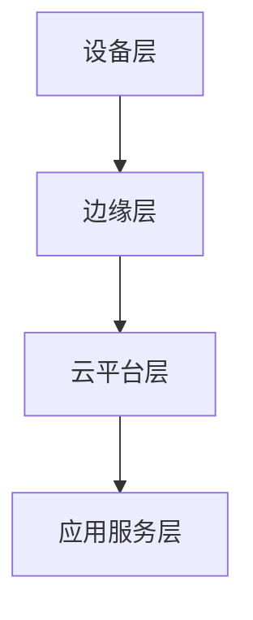

# 01 IOT行业架构综述

## 1.1 行业分层架构图

## 1.2 各层功能与技术要点

| 层级         | 主要功能                 | 关键技术/协议           |
|--------------|--------------------------|------------------------|
| 设备层       | 数据采集、执行控制       | 嵌入式、传感器、执行器、IEEE 1451、BLE、ZigBee |
| 边缘层       | 本地处理、协议转换、缓存 | 边缘计算、MQTT、CoAP、数据聚合、实时分析 |
| 云平台层     | 存储、分析、管理         | 云服务、时序数据库、微服务、REST、消息队列 |
| 应用服务层   | 业务逻辑、可视化、集成   | Web服务、API、AI分析、业务集成 |

## 1.3 主要挑战与设计原则

- 大规模设备管理与安全
- 异构协议与互操作性
- 实时性与可靠性
- 能源与资源约束
- 分层解耦、弹性伸缩、异步通信、容错设计

## 1.4 相关标准与主流协议

- 设备层：IEEE 1451、OGC SWE、SenML
- 网络层：IEEE 802.15.4、BLE、ZigBee、LoRaWAN、NB-IoT
- 传输层：IPv6、6LoWPAN、UDP/TCP
- 应用层：MQTT、CoAP、LwM2M、REST

## 1.5 参考文献与外部链接

- [IEEE 1451标准](https://standards.ieee.org/1451/)
- [OGC Sensor Web Enablement](https://www.ogc.org/standards/swe)
- [MQTT协议](http://mqtt.org/)
- [CoAP协议](https://coap.technology/)

---

> 本文档为IOT行业架构的分层综述，后续将递归细化各层内容。 