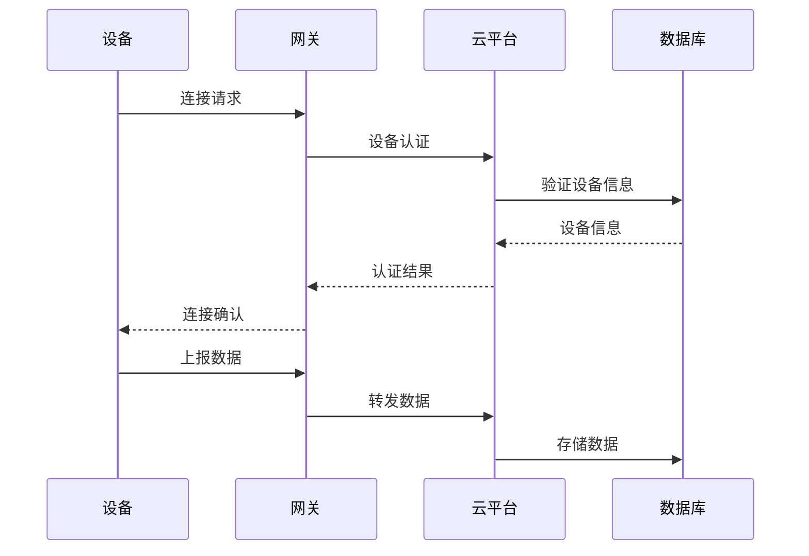
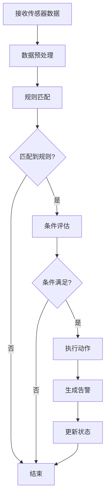

# 02 企业架构与业务建模

## 2.1 业务领域建模

### 2.1.1 核心业务概念

```mermaid
classDiagram
    class Device {
        +String id
        +String name
        +DeviceType type
        +Location location
        +DeviceStatus status
        +List~Capability~ capabilities
        +DeviceConfiguration config
        +DateTime lastSeen
        +isOnline() Boolean
        +canCommunicate() Boolean
        +updateStatus(DeviceStatus) void
    }
    
    class SensorData {
        +String id
        +String deviceId
        +String sensorType
        +Double value
        +String unit
        +DateTime timestamp
        +DataQuality quality
        +SensorMetadata metadata
        +isValid() Boolean
        +isOutlier(List~SensorData~) Boolean
    }
    
    class Rule {
        +String id
        +String name
        +List~Condition~ conditions
        +List~Action~ actions
        +Integer priority
        +Boolean enabled
        +evaluate(RuleContext) Boolean
    }
    
    class Alert {
        +String id
        +String deviceId
        +AlertType type
        +AlertSeverity severity
        +String message
        +DateTime timestamp
        +Boolean acknowledged
        +Boolean resolved
    }
    
    Device ||--o{ SensorData : generates
    Device ||--o{ Alert : triggers
    Rule ||--o{ Alert : generates
```

### 2.1.2 Rust结构体定义

```rust
#[derive(Debug, Clone, Serialize, Deserialize)]
pub struct Device {
    pub id: DeviceId,
    pub name: String,
    pub device_type: DeviceType,
    pub location: Location,
    pub status: DeviceStatus,
    pub capabilities: Vec<Capability>,
    pub configuration: DeviceConfiguration,
    pub last_seen: DateTime<Utc>,
}

#[derive(Debug, Clone, Serialize, Deserialize)]
pub struct SensorData {
    pub id: SensorDataId,
    pub device_id: DeviceId,
    pub sensor_type: SensorType,
    pub value: f64,
    pub unit: String,
    pub timestamp: DateTime<Utc>,
    pub quality: DataQuality,
    pub metadata: SensorMetadata,
}

#[derive(Debug, Clone, Serialize, Deserialize)]
pub struct Rule {
    pub id: RuleId,
    pub name: String,
    pub conditions: Vec<Condition>,
    pub actions: Vec<Action>,
    pub priority: u32,
    pub enabled: bool,
}

#[derive(Debug, Clone, Serialize, Deserialize)]
pub struct Alert {
    pub id: AlertId,
    pub device_id: DeviceId,
    pub alert_type: AlertType,
    pub severity: AlertSeverity,
    pub message: String,
    pub timestamp: DateTime<Utc>,
    pub acknowledged: bool,
    pub resolved: bool,
}
```

### 2.1.3 Go接口定义

```go
type Device struct {
    ID            string                 `json:"id"`
    Name          string                 `json:"name"`
    DeviceType    DeviceType             `json:"deviceType"`
    Location      Location               `json:"location"`
    Status        DeviceStatus           `json:"status"`
    Capabilities  []Capability           `json:"capabilities"`
    Configuration DeviceConfiguration    `json:"configuration"`
    LastSeen      time.Time              `json:"lastSeen"`
}

type SensorData struct {
    ID         string         `json:"id"`
    DeviceID   string         `json:"deviceId"`
    SensorType string         `json:"sensorType"`
    Value      float64        `json:"value"`
    Unit       string         `json:"unit"`
    Timestamp  time.Time      `json:"timestamp"`
    Quality    DataQuality    `json:"quality"`
    Metadata   SensorMetadata `json:"metadata"`
}

type Rule struct {
    ID        string     `json:"id"`
    Name      string     `json:"name"`
    Conditions []Condition `json:"conditions"`
    Actions   []Action   `json:"actions"`
    Priority  int        `json:"priority"`
    Enabled   bool       `json:"enabled"`
}

type Alert struct {
    ID          string        `json:"id"`
    DeviceID    string        `json:"deviceId"`
    AlertType   AlertType     `json:"alertType"`
    Severity    AlertSeverity `json:"severity"`
    Message     string        `json:"message"`
    Timestamp   time.Time     `json:"timestamp"`
    Acknowledged bool         `json:"acknowledged"`
    Resolved    bool          `json:"resolved"`
}
```

## 2.2 业务流程建模

### 2.2.1 设备注册与管理流程



### 2.2.2 规则引擎执行流程



## 2.3 业务规则与约束

### 2.3.1 设备管理规则

1. **设备唯一性约束**：每个设备ID在系统中必须唯一
2. **状态一致性**：设备状态变更必须通过状态机验证
3. **数据完整性**：传感器数据必须包含时间戳和单位信息
4. **规则优先级**：高优先级规则优先执行

### 2.3.2 数据质量规则

1. **数值范围检查**：传感器数值必须在合理范围内
2. **时间连续性**：数据时间戳必须递增
3. **异常检测**：使用统计方法检测异常值
4. **数据补全**：缺失数据使用插值方法补全

## 2.4 业务指标与监控

### 2.4.1 关键业务指标

| 指标类别 | 具体指标 | 计算方法 | 目标值 |
|----------|----------|----------|--------|
| 设备管理 | 设备在线率 | 在线设备数/总设备数 | >95% |
| 数据处理 | 数据完整性 | 有效数据量/总数据量 | >99% |
| 系统性能 | 响应时间 | 请求到响应时间 | <100ms |
| 业务价值 | 告警准确率 | 正确告警数/总告警数 | >90% |

### 2.4.2 监控仪表板

```rust
pub struct BusinessMetrics {
    pub device_online_rate: f64,
    pub data_integrity_rate: f64,
    pub average_response_time: Duration,
    pub alert_accuracy_rate: f64,
    pub total_devices: u32,
    pub active_rules: u32,
    pub daily_data_volume: u64,
}

impl BusinessMetrics {
    pub fn calculate_device_online_rate(&self, online_devices: u32, total_devices: u32) -> f64 {
        if total_devices == 0 {
            0.0
        } else {
            (online_devices as f64 / total_devices as f64) * 100.0
        }
    }
    
    pub fn calculate_data_integrity_rate(&self, valid_data: u64, total_data: u64) -> f64 {
        if total_data == 0 {
            0.0
        } else {
            (valid_data as f64 / total_data as f64) * 100.0
        }
    }
}
```

## 2.5 业务集成与扩展

### 2.5.1 外部系统集成

1. **ERP系统集成**：设备资产管理与财务系统对接
2. **MES系统集成**：生产制造执行系统数据交换
3. **CRM系统集成**：客户关系管理与设备服务关联
4. **第三方API集成**：天气、地图、支付等外部服务

### 2.5.2 业务扩展点

1. **多租户支持**：企业级多租户架构
2. **国际化支持**：多语言、多时区、多货币
3. **行业定制**：不同行业的业务规则定制
4. **AI集成**：机器学习与预测分析

---

> 本文档详细描述了IOT企业架构的业务建模，包含领域模型、业务流程、业务规则和集成扩展点。
