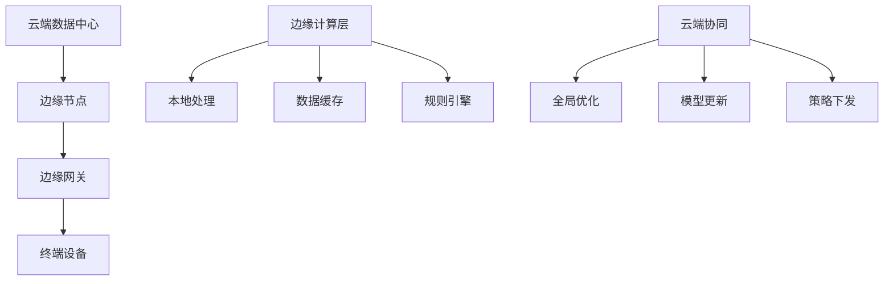

# 03 分层与边缘计算

## 5.1 边缘计算理论基础

### 5.1.1 边缘计算定义

**定义 5.1.1** (边缘计算)
边缘计算是一种分布式计算范式，将计算能力从云端数据中心扩展到网络边缘，在数据源附近进行数据处理和存储。

**定理 5.1.1** (边缘计算延迟优化)
边缘计算可以将端到端延迟从 $T_{cloud}$ 降低到 $T_{edge}$，其中：
$$T_{edge} = T_{local} + T_{edge\_process} < T_{cloud} = T_{transmission} + T_{cloud\_process}$$

**证明**：
边缘计算避免了长距离数据传输，本地处理时间 $T_{local}$ 远小于传输时间 $T_{transmission}$，因此 $T_{edge} < T_{cloud}$。

### 5.1.2 边缘计算架构模型



## 5.2 边缘计算分层架构

### 5.2.1 三层边缘架构

```rust
// 边缘计算三层架构定义
pub struct EdgeComputingArchitecture {
    cloud_layer: CloudLayer,
    edge_layer: EdgeLayer,
    device_layer: DeviceLayer,
}

pub struct CloudLayer {
    global_orchestrator: GlobalOrchestrator,
    model_repository: ModelRepository,
    analytics_engine: AnalyticsEngine,
    policy_manager: PolicyManager,
}

pub struct EdgeLayer {
    edge_nodes: Vec<EdgeNode>,
    local_orchestrator: LocalOrchestrator,
    data_cache: DataCache,
    rule_engine: RuleEngine,
}

pub struct DeviceLayer {
    devices: Vec<IoTDevice>,
    device_manager: DeviceManager,
    sensor_processor: SensorProcessor,
    actuator_controller: ActuatorController,
}
```

### 5.2.2 边缘节点实现

```rust
// 边缘节点核心组件
pub struct EdgeNode {
    node_id: String,
    location: Location,
    capabilities: NodeCapabilities,
    resource_manager: ResourceManager,
    data_processor: DataProcessor,
    communication_manager: CommunicationManager,
    security_manager: SecurityManager,
}

impl EdgeNode {
    pub async fn run(&mut self) -> Result<(), EdgeError> {
        loop {
            // 1. 收集设备数据
            let device_data = self.collect_device_data().await?;
            
            // 2. 本地数据处理
            let processed_data = self.process_data_locally(device_data).await?;
            
            // 3. 规则引擎执行
            let actions = self.execute_rules(&processed_data).await?;
            
            // 4. 执行本地动作
            self.execute_local_actions(actions).await?;
            
            // 5. 上传重要数据到云端
            self.upload_to_cloud(processed_data).await?;
            
            // 6. 接收云端指令
            self.receive_cloud_commands().await?;
            
            tokio::time::sleep(Duration::from_secs(1)).await;
        }
    }
    
    async fn collect_device_data(&self) -> Result<Vec<DeviceData>, EdgeError> {
        // 从连接的设备收集数据
        let mut collected_data = Vec::new();
        
        for device in &self.connected_devices {
            if let Ok(data) = device.read_sensor_data().await {
                collected_data.push(data);
            }
        }
        
        Ok(collected_data)
    }
    
    async fn process_data_locally(&self, data: Vec<DeviceData>) -> Result<ProcessedData, EdgeError> {
        // 本地数据处理逻辑
        let mut processed = ProcessedData::new();
        
        for device_data in data {
            // 数据验证
            if self.validate_data(&device_data).await? {
                // 数据转换
                let transformed = self.transform_data(device_data).await?;
                // 数据聚合
                processed.aggregate(transformed);
            }
        }
        
        Ok(processed)
    }
    
    async fn execute_rules(&self, data: &ProcessedData) -> Result<Vec<Action>, EdgeError> {
        // 规则引擎执行
        let mut actions = Vec::new();
        
        for rule in &self.active_rules {
            if rule.evaluate(data).await? {
                actions.extend(rule.get_actions().clone());
            }
        }
        
        Ok(actions)
    }
}
```

## 5.3 云端协同机制

### 5.3.1 全局编排器

```rust
// 全局编排器实现
pub struct GlobalOrchestrator {
    edge_nodes: Arc<RwLock<HashMap<String, EdgeNodeInfo>>>,
    load_balancer: LoadBalancer,
    resource_monitor: ResourceMonitor,
    policy_engine: PolicyEngine,
}

impl GlobalOrchestrator {
    pub async fn orchestrate_workload(&self) -> Result<(), OrchestrationError> {
        // 1. 监控边缘节点状态
        let node_status = self.monitor_edge_nodes().await?;
        
        // 2. 分析负载分布
        let load_analysis = self.analyze_load_distribution(&node_status).await?;
        
        // 3. 制定负载均衡策略
        let balancing_strategy = self.create_balancing_strategy(&load_analysis).await?;
        
        // 4. 执行负载迁移
        self.execute_load_migration(&balancing_strategy).await?;
        
        Ok(())
    }
    
    pub async fn update_edge_policies(&self, policies: Vec<Policy>) -> Result<(), OrchestrationError> {
        for policy in policies {
            // 确定目标边缘节点
            let target_nodes = self.select_target_nodes(&policy).await?;
            
            // 下发策略
            for node_id in target_nodes {
                self.deploy_policy_to_node(&node_id, &policy).await?;
            }
        }
        Ok(())
    }
    
    pub async fn collect_global_metrics(&self) -> Result<GlobalMetrics, OrchestrationError> {
        let mut global_metrics = GlobalMetrics::new();
        
        let nodes = self.edge_nodes.read().await;
        for (node_id, node_info) in nodes.iter() {
            let node_metrics = self.get_node_metrics(node_id).await?;
            global_metrics.aggregate(node_metrics);
        }
        
        Ok(global_metrics)
    }
}
```

### 5.3.2 模型更新机制

```rust
// 模型更新管理器
pub struct ModelUpdateManager {
    model_repository: ModelRepository,
    version_controller: VersionController,
    deployment_strategy: DeploymentStrategy,
}

impl ModelUpdateManager {
    pub async fn deploy_model_update(&self, model: &MLModel) -> Result<(), ModelError> {
        // 1. 验证模型
        self.validate_model(model).await?;
        
        // 2. 版本控制
        let version = self.create_version(model).await?;
        
        // 3. 选择部署策略
        let strategy = self.select_deployment_strategy(model).await?;
        
        // 4. 执行部署
        match strategy {
            DeploymentStrategy::RollingUpdate => {
                self.rolling_update(model, &version).await?;
            }
            DeploymentStrategy::BlueGreen => {
                self.blue_green_deployment(model, &version).await?;
            }
            DeploymentStrategy::Canary => {
                self.canary_deployment(model, &version).await?;
            }
        }
        
        Ok(())
    }
    
    async fn rolling_update(&self, model: &MLModel, version: &Version) -> Result<(), ModelError> {
        let edge_nodes = self.get_target_edge_nodes().await?;
        
        for node in edge_nodes {
            // 逐个更新边缘节点
            self.update_node_model(&node, model, version).await?;
            
            // 验证更新结果
            if !self.verify_model_update(&node, version).await? {
                self.rollback_node_model(&node).await?;
                return Err(ModelError::UpdateFailed);
            }
        }
        
        Ok(())
    }
}
```

## 5.4 边缘计算优化策略

### 5.4.1 资源优化

```rust
// 边缘节点资源管理器
pub struct ResourceManager {
    cpu_monitor: CPUMonitor,
    memory_monitor: MemoryMonitor,
    network_monitor: NetworkMonitor,
    storage_monitor: StorageMonitor,
}

impl ResourceManager {
    pub async fn optimize_resources(&self) -> Result<ResourceOptimization, ResourceError> {
        // 1. 收集资源使用情况
        let cpu_usage = self.cpu_monitor.get_usage().await?;
        let memory_usage = self.memory_monitor.get_usage().await?;
        let network_usage = self.network_monitor.get_usage().await?;
        let storage_usage = self.storage_monitor.get_usage().await?;
        
        // 2. 分析资源瓶颈
        let bottlenecks = self.identify_bottlenecks(
            cpu_usage, memory_usage, network_usage, storage_usage
        ).await?;
        
        // 3. 制定优化策略
        let optimization = self.create_optimization_strategy(&bottlenecks).await?;
        
        // 4. 执行优化
        self.execute_optimization(&optimization).await?;
        
        Ok(optimization)
    }
    
    async fn identify_bottlenecks(
        &self,
        cpu: f64,
        memory: f64,
        network: f64,
        storage: f64,
    ) -> Result<Vec<Bottleneck>, ResourceError> {
        let mut bottlenecks = Vec::new();
        
        if cpu > 0.8 {
            bottlenecks.push(Bottleneck::CPU);
        }
        if memory > 0.85 {
            bottlenecks.push(Bottleneck::Memory);
        }
        if network > 0.9 {
            bottlenecks.push(Bottleneck::Network);
        }
        if storage > 0.9 {
            bottlenecks.push(Bottleneck::Storage);
        }
        
        Ok(bottlenecks)
    }
}
```

### 5.4.2 数据优化

```rust
// 边缘数据优化器
pub struct DataOptimizer {
    compression_engine: CompressionEngine,
    filtering_engine: FilteringEngine,
    aggregation_engine: AggregationEngine,
}

impl DataOptimizer {
    pub async fn optimize_data_transmission(&self, data: &RawData) -> Result<OptimizedData, DataError> {
        // 1. 数据过滤
        let filtered_data = self.filter_relevant_data(data).await?;
        
        // 2. 数据聚合
        let aggregated_data = self.aggregate_data(&filtered_data).await?;
        
        // 3. 数据压缩
        let compressed_data = self.compress_data(&aggregated_data).await?;
        
        Ok(OptimizedData {
            original_size: data.size(),
            optimized_size: compressed_data.size(),
            compression_ratio: data.size() as f64 / compressed_data.size() as f64,
            data: compressed_data,
        })
    }
    
    async fn filter_relevant_data(&self, data: &RawData) -> Result<FilteredData, DataError> {
        // 基于规则过滤不相关数据
        let mut filtered = FilteredData::new();
        
        for record in &data.records {
            if self.is_relevant(record).await? {
                filtered.add_record(record.clone());
            }
        }
        
        Ok(filtered)
    }
    
    async fn aggregate_data(&self, data: &FilteredData) -> Result<AggregatedData, DataError> {
        // 时间窗口聚合
        let mut aggregated = AggregatedData::new();
        
        for window in data.group_by_time_window(Duration::from_secs(60)) {
            let aggregated_window = self.aggregate_window(&window).await?;
            aggregated.add_window(aggregated_window);
        }
        
        Ok(aggregated)
    }
}
```

## 5.5 边缘计算安全机制

### 5.5.1 边缘安全框架

```rust
// 边缘安全管理器
pub struct EdgeSecurityManager {
    authentication_service: AuthenticationService,
    authorization_service: AuthorizationService,
    encryption_service: EncryptionService,
    audit_service: AuditService,
}

impl EdgeSecurityManager {
    pub async fn secure_edge_operation(&self, operation: &EdgeOperation) -> Result<(), SecurityError> {
        // 1. 身份认证
        let identity = self.authenticate_operation(operation).await?;
        
        // 2. 权限验证
        self.authorize_operation(operation, &identity).await?;
        
        // 3. 数据加密
        let encrypted_operation = self.encrypt_operation(operation).await?;
        
        // 4. 执行操作
        let result = self.execute_secure_operation(&encrypted_operation).await?;
        
        // 5. 审计日志
        self.audit_operation(operation, &identity, &result).await?;
        
        Ok(())
    }
    
    async fn authenticate_operation(&self, operation: &EdgeOperation) -> Result<Identity, SecurityError> {
        // 基于证书的身份认证
        let certificate = operation.get_certificate();
        let identity = self.authentication_service.verify_certificate(certificate).await?;
        
        Ok(identity)
    }
    
    async fn authorize_operation(&self, operation: &EdgeOperation, identity: &Identity) -> Result<(), SecurityError> {
        // 基于角色的访问控制
        let required_permissions = operation.get_required_permissions();
        let user_permissions = self.authorization_service.get_user_permissions(identity).await?;
        
        for permission in required_permissions {
            if !user_permissions.contains(permission) {
                return Err(SecurityError::InsufficientPermissions);
            }
        }
        
        Ok(())
    }
}
```

### 5.5.2 数据隐私保护

```rust
// 边缘数据隐私保护器
pub struct PrivacyProtector {
    anonymization_engine: AnonymizationEngine,
    differential_privacy: DifferentialPrivacy,
    data_masking: DataMasking,
}

impl PrivacyProtector {
    pub async fn protect_data_privacy(&self, data: &SensitiveData) -> Result<ProtectedData, PrivacyError> {
        // 1. 数据匿名化
        let anonymized_data = self.anonymize_data(data).await?;
        
        // 2. 差分隐私
        let differentially_private_data = self.apply_differential_privacy(&anonymized_data).await?;
        
        // 3. 数据脱敏
        let masked_data = self.mask_sensitive_fields(&differentially_private_data).await?;
        
        Ok(ProtectedData {
            original_data_hash: data.hash(),
            protection_level: ProtectionLevel::High,
            data: masked_data,
        })
    }
    
    async fn anonymize_data(&self, data: &SensitiveData) -> Result<AnonymizedData, PrivacyError> {
        // k-匿名化处理
        let k = 5; // k值
        let anonymized = self.anonymization_engine.k_anonymize(data, k).await?;
        
        Ok(anonymized)
    }
    
    async fn apply_differential_privacy(&self, data: &AnonymizedData) -> Result<DifferentiallyPrivateData, PrivacyError> {
        // 添加拉普拉斯噪声
        let epsilon = 1.0; // 隐私预算
        let differentially_private = self.differential_privacy.add_laplace_noise(data, epsilon).await?;
        
        Ok(differentially_private)
    }
}
```

## 5.6 边缘计算监控与运维

### 5.6.1 边缘节点监控

```rust
// 边缘节点监控器
pub struct EdgeNodeMonitor {
    health_checker: HealthChecker,
    performance_monitor: PerformanceMonitor,
    alert_manager: AlertManager,
}

impl EdgeNodeMonitor {
    pub async fn monitor_edge_node(&self, node: &EdgeNode) -> Result<MonitoringReport, MonitoringError> {
        // 1. 健康检查
        let health_status = self.health_checker.check_health(node).await?;
        
        // 2. 性能监控
        let performance_metrics = self.performance_monitor.collect_metrics(node).await?;
        
        // 3. 生成报告
        let report = MonitoringReport {
            node_id: node.get_id(),
            timestamp: Utc::now(),
            health_status,
            performance_metrics,
        };
        
        // 4. 检查告警条件
        self.check_alerts(&report).await?;
        
        Ok(report)
    }
    
    async fn check_alerts(&self, report: &MonitoringReport) -> Result<(), MonitoringError> {
        // 检查CPU使用率告警
        if report.performance_metrics.cpu_usage > 0.9 {
            self.alert_manager.raise_alert(Alert::HighCPUUsage {
                node_id: report.node_id.clone(),
                usage: report.performance_metrics.cpu_usage,
            }).await?;
        }
        
        // 检查内存使用率告警
        if report.performance_metrics.memory_usage > 0.85 {
            self.alert_manager.raise_alert(Alert::HighMemoryUsage {
                node_id: report.node_id.clone(),
                usage: report.performance_metrics.memory_usage,
            }).await?;
        }
        
        // 检查网络延迟告警
        if report.performance_metrics.network_latency > Duration::from_millis(100) {
            self.alert_manager.raise_alert(Alert::HighNetworkLatency {
                node_id: report.node_id.clone(),
                latency: report.performance_metrics.network_latency,
            }).await?;
        }
        
        Ok(())
    }
}
```

---

> 本文档详细描述了IOT系统的边缘计算架构，包含理论基础、分层设计、云端协同、优化策略和安全机制。
