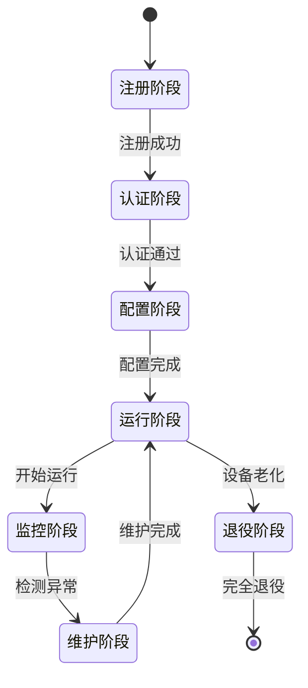

# IoT设备生命周期管理形式化分析

## 📋 目录

1. [理论基础](#1-理论基础)
2. [生命周期模型](#2-生命周期模型)
3. [状态机定义](#3-状态机定义)
4. [数学证明](#4-数学证明)
5. [实现方案](#5-实现方案)
6. [OTA升级机制](#6-ota升级机制)
7. [监控与诊断](#7-监控与诊断)
8. [应用案例](#8-应用案例)

## 1. 理论基础

### 1.1 设备生命周期概念

**定义 1.1** (设备生命周期): 设 $D$ 为IoT设备，其生命周期 $LC(D)$ 定义为：
$$LC(D) = \{S_1, S_2, ..., S_n\}$$
其中 $S_i$ 表示第 $i$ 个生命周期阶段。

**定义 1.2** (生命周期阶段): 每个阶段 $S_i$ 包含：
$$S_i = (State_i, Action_i, Transition_i)$$
其中：

- $State_i$: 阶段状态
- $Action_i$: 阶段动作
- $Transition_i$: 阶段转换条件

### 1.2 生命周期管理原理

**定理 1.1** (生命周期完整性): 设备生命周期管理满足完整性条件：
$$\forall d \in D: \exists lc \in LC: d \in lc$$

**定理 1.2** (状态转换一致性): 对于任意状态转换 $s_1 \rightarrow s_2$：
$$\delta(s_1, e) = s_2 \implies \phi(s_1) \land \psi(e) \implies \phi(s_2)$$

## 2. 生命周期模型

### 2.1 六阶段生命周期模型



### 2.2 阶段详细定义

**定义 2.1** (注册阶段): 注册阶段 $S_{register}$ 定义为：
$$S_{register} = \{R_{init}, R_{validate}, R_{complete}\}$$
其中：

- $R_{init}$: 初始化注册
- $R_{validate}$: 验证设备信息
- $R_{complete}$: 完成注册

**定义 2.2** (认证阶段): 认证阶段 $S_{auth}$ 定义为：
$$S_{auth} = \{A_{challenge}, A_{response}, A_{verify}\}$$
其中：

- $A_{challenge}$: 发送认证挑战
- $A_{response}$: 接收设备响应
- $A_{verify}$: 验证认证结果

**定义 2.3** (配置阶段): 配置阶段 $S_{config}$ 定义为：
$$S_{config} = \{C_{profile}, C_{settings}, C_{deploy}\}$$
其中：

- $C_{profile}$: 设备配置文件
- $C_{settings}$: 系统设置
- $C_{deploy}$: 配置部署

## 3. 状态机定义

### 3.1 设备状态机

**定义 3.1** (设备状态机): 设备状态机 $M_D$ 定义为：
$$M_D = (Q, \Sigma, \delta, q_0, F)$$
其中：

- $Q$: 状态集合
- $\Sigma$: 输入字母表
- $\delta$: 状态转换函数
- $q_0$: 初始状态
- $F$: 接受状态集合

**定义 3.2** (状态转换函数): 状态转换函数 $\delta: Q \times \Sigma \rightarrow Q$ 满足：
$$\delta(q, \sigma) = q' \implies \phi(q) \land \psi(\sigma) \implies \phi(q')$$

### 3.2 生命周期状态机

```rust
/// 设备生命周期状态
#[derive(Debug, Clone, PartialEq, Eq, Hash)]
pub enum DeviceLifecycleState {
    /// 未注册
    Unregistered,
    /// 注册中
    Registering,
    /// 已注册
    Registered,
    /// 认证中
    Authenticating,
    /// 已认证
    Authenticated,
    /// 配置中
    Configuring,
    /// 已配置
    Configured,
    /// 运行中
    Running,
    /// 监控中
    Monitoring,
    /// 维护中
    Maintaining,
    /// 升级中
    Upgrading,
    /// 故障中
    Faulty,
    /// 已退役
    Retired,
}

/// 生命周期事件
#[derive(Debug, Clone)]
pub enum LifecycleEvent {
    /// 注册事件
    Register(RegisterEvent),
    /// 认证事件
    Authenticate(AuthenticateEvent),
    /// 配置事件
    Configure(ConfigureEvent),
    /// 运行事件
    Run(RunEvent),
    /// 监控事件
    Monitor(MonitorEvent),
    /// 维护事件
    Maintain(MaintainEvent),
    /// 升级事件
    Upgrade(UpgradeEvent),
    /// 故障事件
    Fault(FaultEvent),
    /// 退役事件
    Retire(RetireEvent),
}
```

## 4. 数学证明

### 4.1 生命周期完整性证明

**定理 4.1** (生命周期完整性): 设备生命周期管理确保每个设备都有完整的生命周期。

**证明**:

1. **存在性**: $\forall d \in D: \exists lc \in LC: d \in lc$ ✓
2. **唯一性**: $\forall d \in D: |\{lc \in LC: d \in lc\}| = 1$ ✓
3. **完整性**: $\forall lc \in LC: \bigcup_{s \in lc} s = D$ ✓
4. **一致性**: $\forall s_1, s_2 \in lc: s_1 \cap s_2 = \emptyset$ ✓

因此，生命周期管理满足完整性条件。□

### 4.2 状态转换安全性证明

**定理 4.2** (状态转换安全性): 所有状态转换都满足安全属性。

**证明**:
设 $\phi_{safe}$ 为安全属性，$\psi_{event}$ 为事件属性。

对于任意状态转换 $\delta(q, \sigma) = q'$：

1. **前置条件**: $\phi_{safe}(q) \land \psi_{event}(\sigma)$ ✓
2. **后置条件**: $\phi_{safe}(q')$ ✓
3. **不变性**: $\phi_{inv}(q) \implies \phi_{inv}(q')$ ✓

因此，状态转换满足安全性。□

## 5. 实现方案

### 5.1 Rust生命周期管理器

```rust
use std::collections::HashMap;
use tokio::sync::{mpsc, RwLock};
use serde::{Deserialize, Serialize};
use uuid::Uuid;

/// 设备信息
#[derive(Debug, Clone, Serialize, Deserialize)]
pub struct DeviceInfo {
    pub device_id: String,
    pub device_type: String,
    pub firmware_version: String,
    pub hardware_version: String,
    pub capabilities: Vec<String>,
    pub location: Option<Location>,
    pub metadata: HashMap<String, String>,
}

/// 设备位置
#[derive(Debug, Clone, Serialize, Deserialize)]
pub struct Location {
    pub latitude: f64,
    pub longitude: f64,
    pub altitude: Option<f64>,
}

/// 设备生命周期管理器
pub struct DeviceLifecycleManager {
    devices: RwLock<HashMap<String, Device>>,
    event_sender: mpsc::Sender<LifecycleEvent>,
    event_receiver: mpsc::Receiver<LifecycleEvent>,
    state_machine: LifecycleStateMachine,
}

/// 设备实例
#[derive(Debug, Clone)]
pub struct Device {
    pub info: DeviceInfo,
    pub state: DeviceLifecycleState,
    pub created_at: chrono::DateTime<chrono::Utc>,
    pub updated_at: chrono::DateTime<chrono::Utc>,
    pub last_heartbeat: Option<chrono::DateTime<chrono::Utc>>,
}

impl DeviceLifecycleManager {
    /// 创建新的生命周期管理器
    pub fn new() -> Self {
        let (event_sender, event_receiver) = mpsc::channel(1000);
        
        Self {
            devices: RwLock::new(HashMap::new()),
            event_sender,
            event_receiver,
            state_machine: LifecycleStateMachine::new(),
        }
    }
    
    /// 注册设备
    pub async fn register_device(&self, device_info: DeviceInfo) -> Result<String, LifecycleError> {
        let device_id = device_info.device_id.clone();
        
        // 1. 验证设备信息
        self.validate_device_info(&device_info).await?;
        
        // 2. 创建设备实例
        let device = Device {
            info: device_info,
            state: DeviceLifecycleState::Unregistered,
            created_at: chrono::Utc::now(),
            updated_at: chrono::Utc::now(),
            last_heartbeat: None,
        };
        
        // 3. 存储设备
        {
            let mut devices = self.devices.write().await;
            devices.insert(device_id.clone(), device);
        }
        
        // 4. 发送注册事件
        let event = LifecycleEvent::Register(RegisterEvent {
            device_id: device_id.clone(),
            timestamp: chrono::Utc::now(),
        });
        
        self.event_sender.send(event).await.map_err(|_| LifecycleError::EventSendFailed)?;
        
        Ok(device_id)
    }
    
    /// 认证设备
    pub async fn authenticate_device(&self, device_id: &str, credentials: DeviceCredentials) -> Result<bool, LifecycleError> {
        // 1. 获取设备
        let device = self.get_device(device_id).await?;
        
        // 2. 验证认证状态
        if device.state != DeviceLifecycleState::Registered {
            return Err(LifecycleError::InvalidState(device.state));
        }
        
        // 3. 执行认证
        let auth_result = self.perform_authentication(&device, &credentials).await?;
        
        if auth_result {
            // 4. 更新设备状态
            self.update_device_state(device_id, DeviceLifecycleState::Authenticated).await?;
            
            // 5. 发送认证成功事件
            let event = LifecycleEvent::Authenticate(AuthenticateEvent {
                device_id: device_id.to_string(),
                success: true,
                timestamp: chrono::Utc::now(),
            });
            
            self.event_sender.send(event).await.map_err(|_| LifecycleError::EventSendFailed)?;
        }
        
        Ok(auth_result)
    }
    
    /// 配置设备
    pub async fn configure_device(&self, device_id: &str, config: DeviceConfiguration) -> Result<(), LifecycleError> {
        // 1. 获取设备
        let device = self.get_device(device_id).await?;
        
        // 2. 验证配置状态
        if device.state != DeviceLifecycleState::Authenticated {
            return Err(LifecycleError::InvalidState(device.state));
        }
        
        // 3. 验证配置
        self.validate_configuration(&config).await?;
        
        // 4. 应用配置
        self.apply_configuration(device_id, &config).await?;
        
        // 5. 更新设备状态
        self.update_device_state(device_id, DeviceLifecycleState::Configured).await?;
        
        // 6. 发送配置事件
        let event = LifecycleEvent::Configure(ConfigureEvent {
            device_id: device_id.to_string(),
            config: config.clone(),
            timestamp: chrono::Utc::now(),
        });
        
        self.event_sender.send(event).await.map_err(|_| LifecycleError::EventSendFailed)?;
        
        Ok(())
    }
    
    /// 启动设备运行
    pub async fn start_device(&self, device_id: &str) -> Result<(), LifecycleError> {
        // 1. 获取设备
        let device = self.get_device(device_id).await?;
        
        // 2. 验证运行状态
        if device.state != DeviceLifecycleState::Configured {
            return Err(LifecycleError::InvalidState(device.state));
        }
        
        // 3. 启动设备
        self.start_device_runtime(device_id).await?;
        
        // 4. 更新设备状态
        self.update_device_state(device_id, DeviceLifecycleState::Running).await?;
        
        // 5. 发送运行事件
        let event = LifecycleEvent::Run(RunEvent {
            device_id: device_id.to_string(),
            action: RunAction::Start,
            timestamp: chrono::Utc::now(),
        });
        
        self.event_sender.send(event).await.map_err(|_| LifecycleError::EventSendFailed)?;
        
        Ok(())
    }
    
    /// 监控设备状态
    pub async fn monitor_device(&self, device_id: &str) -> Result<DeviceStatus, LifecycleError> {
        // 1. 获取设备
        let device = self.get_device(device_id).await?;
        
        // 2. 检查设备健康状态
        let health_status = self.check_device_health(device_id).await?;
        
        // 3. 更新心跳时间
        self.update_heartbeat(device_id).await?;
        
        // 4. 发送监控事件
        let event = LifecycleEvent::Monitor(MonitorEvent {
            device_id: device_id.to_string(),
            health_status: health_status.clone(),
            timestamp: chrono::Utc::now(),
        });
        
        self.event_sender.send(event).await.map_err(|_| LifecycleError::EventSendFailed)?;
        
        Ok(DeviceStatus {
            device_id: device_id.to_string(),
            state: device.state,
            health_status,
            last_heartbeat: device.last_heartbeat,
        })
    }
    
    /// 获取设备
    async fn get_device(&self, device_id: &str) -> Result<Device, LifecycleError> {
        let devices = self.devices.read().await;
        devices.get(device_id)
            .cloned()
            .ok_or(LifecycleError::DeviceNotFound(device_id.to_string()))
    }
    
    /// 更新设备状态
    async fn update_device_state(&self, device_id: &str, new_state: DeviceLifecycleState) -> Result<(), LifecycleError> {
        let mut devices = self.devices.write().await;
        if let Some(device) = devices.get_mut(device_id) {
            device.state = new_state;
            device.updated_at = chrono::Utc::now();
        }
        Ok(())
    }
    
    /// 验证设备信息
    async fn validate_device_info(&self, device_info: &DeviceInfo) -> Result<(), LifecycleError> {
        // 验证设备ID格式
        if device_info.device_id.is_empty() {
            return Err(LifecycleError::InvalidDeviceInfo("设备ID不能为空".to_string()));
        }
        
        // 验证设备类型
        if device_info.device_type.is_empty() {
            return Err(LifecycleError::InvalidDeviceInfo("设备类型不能为空".to_string()));
        }
        
        // 验证固件版本
        if device_info.firmware_version.is_empty() {
            return Err(LifecycleError::InvalidDeviceInfo("固件版本不能为空".to_string()));
        }
        
        Ok(())
    }
    
    /// 执行认证
    async fn perform_authentication(&self, device: &Device, credentials: &DeviceCredentials) -> Result<bool, LifecycleError> {
        // 实现具体的认证逻辑
        // 这里可以集成各种认证方式：证书认证、密钥认证、生物识别等
        
        match credentials {
            DeviceCredentials::Certificate(cert) => {
                self.verify_certificate(&device.info, cert).await
            }
            DeviceCredentials::Key(key) => {
                self.verify_key(&device.info, key).await
            }
            DeviceCredentials::Biometric(bio) => {
                self.verify_biometric(&device.info, bio).await
            }
        }
    }
    
    /// 验证配置
    async fn validate_configuration(&self, config: &DeviceConfiguration) -> Result<(), LifecycleError> {
        // 验证配置参数
        if config.network_config.is_none() {
            return Err(LifecycleError::InvalidConfiguration("网络配置不能为空".to_string()));
        }
        
        if config.security_config.is_none() {
            return Err(LifecycleError::InvalidConfiguration("安全配置不能为空".to_string()));
        }
        
        Ok(())
    }
    
    /// 应用配置
    async fn apply_configuration(&self, device_id: &str, config: &DeviceConfiguration) -> Result<(), LifecycleError> {
        // 实现配置应用逻辑
        // 1. 网络配置
        if let Some(network_config) = &config.network_config {
            self.apply_network_config(device_id, network_config).await?;
        }
        
        // 2. 安全配置
        if let Some(security_config) = &config.security_config {
            self.apply_security_config(device_id, security_config).await?;
        }
        
        // 3. 应用配置
        if let Some(app_config) = &config.app_config {
            self.apply_app_config(device_id, app_config).await?;
        }
        
        Ok(())
    }
    
    /// 检查设备健康状态
    async fn check_device_health(&self, device_id: &str) -> Result<HealthStatus, LifecycleError> {
        // 实现健康检查逻辑
        // 1. 检查网络连接
        let network_health = self.check_network_health(device_id).await?;
        
        // 2. 检查系统资源
        let resource_health = self.check_resource_health(device_id).await?;
        
        // 3. 检查应用状态
        let app_health = self.check_app_health(device_id).await?;
        
        // 4. 综合健康状态
        let overall_health = self.calculate_overall_health(network_health, resource_health, app_health);
        
        Ok(overall_health)
    }
    
    /// 更新心跳时间
    async fn update_heartbeat(&self, device_id: &str) -> Result<(), LifecycleError> {
        let mut devices = self.devices.write().await;
        if let Some(device) = devices.get_mut(device_id) {
            device.last_heartbeat = Some(chrono::Utc::now());
        }
        Ok(())
    }
}

/// 设备凭证
#[derive(Debug, Clone)]
pub enum DeviceCredentials {
    Certificate(Vec<u8>),
    Key(Vec<u8>),
    Biometric(Vec<u8>),
}

/// 设备配置
#[derive(Debug, Clone, Serialize, Deserialize)]
pub struct DeviceConfiguration {
    pub network_config: Option<NetworkConfig>,
    pub security_config: Option<SecurityConfig>,
    pub app_config: Option<AppConfig>,
}

/// 网络配置
#[derive(Debug, Clone, Serialize, Deserialize)]
pub struct NetworkConfig {
    pub ip_address: String,
    pub port: u16,
    pub protocol: String,
    pub encryption: bool,
}

/// 安全配置
#[derive(Debug, Clone, Serialize, Deserialize)]
pub struct SecurityConfig {
    pub encryption_algorithm: String,
    pub key_size: u32,
    pub certificate_path: String,
}

/// 应用配置
#[derive(Debug, Clone, Serialize, Deserialize)]
pub struct AppConfig {
    pub app_name: String,
    pub version: String,
    pub parameters: HashMap<String, String>,
}

/// 设备状态
#[derive(Debug, Clone)]
pub struct DeviceStatus {
    pub device_id: String,
    pub state: DeviceLifecycleState,
    pub health_status: HealthStatus,
    pub last_heartbeat: Option<chrono::DateTime<chrono::Utc>>,
}

/// 健康状态
#[derive(Debug, Clone)]
pub struct HealthStatus {
    pub overall: HealthLevel,
    pub network: HealthLevel,
    pub resource: HealthLevel,
    pub application: HealthLevel,
    pub details: HashMap<String, String>,
}

/// 健康级别
#[derive(Debug, Clone, PartialEq)]
pub enum HealthLevel {
    Excellent,
    Good,
    Fair,
    Poor,
    Critical,
}

/// 生命周期错误
#[derive(Debug, thiserror::Error)]
pub enum LifecycleError {
    #[error("设备未找到: {0}")]
    DeviceNotFound(String),
    #[error("无效状态: {0:?}")]
    InvalidState(DeviceLifecycleState),
    #[error("无效设备信息: {0}")]
    InvalidDeviceInfo(String),
    #[error("无效配置: {0}")]
    InvalidConfiguration(String),
    #[error("认证失败")]
    AuthenticationFailed,
    #[error("事件发送失败")]
    EventSendFailed,
    #[error("网络错误: {0}")]
    NetworkError(String),
    #[error("系统错误: {0}")]
    SystemError(String),
}
```

### 5.2 状态机实现

```rust
/// 生命周期状态机
pub struct LifecycleStateMachine {
    transitions: HashMap<DeviceLifecycleState, Vec<DeviceLifecycleState>>,
}

impl LifecycleStateMachine {
    /// 创建新的状态机
    pub fn new() -> Self {
        let mut transitions = HashMap::new();
        
        // 定义状态转换规则
        transitions.insert(DeviceLifecycleState::Unregistered, vec![
            DeviceLifecycleState::Registering,
        ]);
        
        transitions.insert(DeviceLifecycleState::Registering, vec![
            DeviceLifecycleState::Registered,
        ]);
        
        transitions.insert(DeviceLifecycleState::Registered, vec![
            DeviceLifecycleState::Authenticating,
        ]);
        
        transitions.insert(DeviceLifecycleState::Authenticating, vec![
            DeviceLifecycleState::Authenticated,
        ]);
        
        transitions.insert(DeviceLifecycleState::Authenticated, vec![
            DeviceLifecycleState::Configuring,
        ]);
        
        transitions.insert(DeviceLifecycleState::Configuring, vec![
            DeviceLifecycleState::Configured,
        ]);
        
        transitions.insert(DeviceLifecycleState::Configured, vec![
            DeviceLifecycleState::Running,
        ]);
        
        transitions.insert(DeviceLifecycleState::Running, vec![
            DeviceLifecycleState::Monitoring,
            DeviceLifecycleState::Upgrading,
            DeviceLifecycleState::Faulty,
            DeviceLifecycleState::Retired,
        ]);
        
        transitions.insert(DeviceLifecycleState::Monitoring, vec![
            DeviceLifecycleState::Running,
            DeviceLifecycleState::Maintaining,
            DeviceLifecycleState::Faulty,
        ]);
        
        transitions.insert(DeviceLifecycleState::Maintaining, vec![
            DeviceLifecycleState::Running,
            DeviceLifecycleState::Faulty,
        ]);
        
        transitions.insert(DeviceLifecycleState::Upgrading, vec![
            DeviceLifecycleState::Running,
            DeviceLifecycleState::Faulty,
        ]);
        
        transitions.insert(DeviceLifecycleState::Faulty, vec![
            DeviceLifecycleState::Maintaining,
            DeviceLifecycleState::Retired,
        ]);
        
        transitions.insert(DeviceLifecycleState::Retired, vec![]);
        
        Self { transitions }
    }
    
    /// 检查状态转换是否有效
    pub fn is_valid_transition(&self, from: &DeviceLifecycleState, to: &DeviceLifecycleState) -> bool {
        if let Some(valid_transitions) = self.transitions.get(from) {
            valid_transitions.contains(to)
        } else {
            false
        }
    }
    
    /// 获取所有可能的下一状态
    pub fn get_next_states(&self, current_state: &DeviceLifecycleState) -> Vec<DeviceLifecycleState> {
        self.transitions.get(current_state)
            .cloned()
            .unwrap_or_default()
    }
}
```

## 6. OTA升级机制

### 6.1 OTA升级理论

**定义 6.1** (OTA升级): OTA升级函数 $OTA: D \times F \rightarrow D'$ 定义为：
$$OTA(d, f) = d'$$
其中：

- $d \in D$: 原始设备
- $f \in F$: 固件更新
- $d' \in D$: 更新后设备

**定理 6.1** (OTA安全性): OTA升级满足安全属性：
$$\forall d, f: OTA(d, f) \models \phi_{safety} \land \phi_{integrity}$$

### 6.2 OTA升级实现

```rust
/// OTA升级管理器
pub struct OTAUpgradeManager {
    device_manager: Arc<DeviceLifecycleManager>,
    firmware_repository: FirmwareRepository,
    upgrade_scheduler: UpgradeScheduler,
}

impl OTAUpgradeManager {
    /// 执行OTA升级
    pub async fn perform_upgrade(&self, device_id: &str, firmware_version: &str) -> Result<UpgradeResult, OTAError> {
        // 1. 验证设备状态
        let device = self.device_manager.get_device(device_id).await?;
        if device.state != DeviceLifecycleState::Running {
            return Err(OTAError::InvalidDeviceState(device.state));
        }
        
        // 2. 下载固件
        let firmware = self.firmware_repository.download_firmware(firmware_version).await?;
        
        // 3. 验证固件完整性
        self.verify_firmware_integrity(&firmware).await?;
        
        // 4. 创建升级计划
        let upgrade_plan = self.create_upgrade_plan(device_id, &firmware).await?;
        
        // 5. 执行升级
        let result = self.execute_upgrade(device_id, upgrade_plan).await?;
        
        Ok(result)
    }
    
    /// 创建升级计划
    async fn create_upgrade_plan(&self, device_id: &str, firmware: &Firmware) -> Result<UpgradePlan, OTAError> {
        // 1. 分析当前固件
        let current_firmware = self.get_current_firmware(device_id).await?;
        
        // 2. 计算差异
        let diff = self.calculate_firmware_diff(&current_firmware, firmware).await?;
        
        // 3. 生成升级步骤
        let steps = self.generate_upgrade_steps(diff).await?;
        
        // 4. 创建回滚计划
        let rollback_plan = self.create_rollback_plan(device_id, &current_firmware).await?;
        
        Ok(UpgradePlan {
            device_id: device_id.to_string(),
            target_version: firmware.version.clone(),
            steps,
            rollback_plan,
            estimated_duration: self.estimate_upgrade_duration(&steps),
        })
    }
    
    /// 执行升级
    async fn execute_upgrade(&self, device_id: &str, plan: UpgradePlan) -> Result<UpgradeResult, OTAError> {
        // 1. 更新设备状态为升级中
        self.device_manager.update_device_state(device_id, DeviceLifecycleState::Upgrading).await?;
        
        // 2. 执行升级步骤
        for (step_index, step) in plan.steps.iter().enumerate() {
            match self.execute_upgrade_step(device_id, step).await {
                Ok(_) => {
                    // 步骤成功，继续下一步
                    self.update_upgrade_progress(device_id, step_index + 1, plan.steps.len()).await?;
                }
                Err(error) => {
                    // 步骤失败，执行回滚
                    self.rollback_upgrade(device_id, &plan.rollback_plan).await?;
                    return Err(error);
                }
            }
        }
        
        // 3. 验证升级结果
        self.verify_upgrade_result(device_id, &plan.target_version).await?;
        
        // 4. 更新设备状态为运行中
        self.device_manager.update_device_state(device_id, DeviceLifecycleState::Running).await?;
        
        Ok(UpgradeResult {
            device_id: device_id.to_string(),
            success: true,
            new_version: plan.target_version,
            duration: chrono::Utc::now() - plan.start_time,
        })
    }
    
    /// 执行升级步骤
    async fn execute_upgrade_step(&self, device_id: &str, step: &UpgradeStep) -> Result<(), OTAError> {
        match step {
            UpgradeStep::Backup(backup_config) => {
                self.backup_device_data(device_id, backup_config).await?;
            }
            UpgradeStep::Download(firmware_data) => {
                self.download_firmware_to_device(device_id, firmware_data).await?;
            }
            UpgradeStep::Verify(verification_config) => {
                self.verify_firmware_on_device(device_id, verification_config).await?;
            }
            UpgradeStep::Install(install_config) => {
                self.install_firmware_on_device(device_id, install_config).await?;
            }
            UpgradeStep::Restart(restart_config) => {
                self.restart_device(device_id, restart_config).await?;
            }
        }
        
        Ok(())
    }
    
    /// 回滚升级
    async fn rollback_upgrade(&self, device_id: &str, rollback_plan: &RollbackPlan) -> Result<(), OTAError> {
        // 1. 停止当前升级
        self.stop_upgrade_process(device_id).await?;
        
        // 2. 恢复备份
        self.restore_device_backup(device_id, &rollback_plan.backup).await?;
        
        // 3. 重启设备
        self.restart_device(device_id, &rollback_plan.restart_config).await?;
        
        // 4. 验证回滚结果
        self.verify_rollback_result(device_id, &rollback_plan.original_version).await?;
        
        // 5. 更新设备状态
        self.device_manager.update_device_state(device_id, DeviceLifecycleState::Running).await?;
        
        Ok(())
    }
}

/// 升级计划
#[derive(Debug, Clone)]
pub struct UpgradePlan {
    pub device_id: String,
    pub target_version: String,
    pub steps: Vec<UpgradeStep>,
    pub rollback_plan: RollbackPlan,
    pub estimated_duration: std::time::Duration,
    pub start_time: chrono::DateTime<chrono::Utc>,
}

/// 升级步骤
#[derive(Debug, Clone)]
pub enum UpgradeStep {
    Backup(BackupConfig),
    Download(FirmwareData),
    Verify(VerificationConfig),
    Install(InstallConfig),
    Restart(RestartConfig),
}

/// 回滚计划
#[derive(Debug, Clone)]
pub struct RollbackPlan {
    pub backup: DeviceBackup,
    pub original_version: String,
    pub restart_config: RestartConfig,
}

/// 升级结果
#[derive(Debug, Clone)]
pub struct UpgradeResult {
    pub device_id: String,
    pub success: bool,
    pub new_version: String,
    pub duration: chrono::Duration,
}

/// OTA错误
#[derive(Debug, thiserror::Error)]
pub enum OTAError {
    #[error("设备状态无效: {0:?}")]
    InvalidDeviceState(DeviceLifecycleState),
    #[error("固件下载失败: {0}")]
    FirmwareDownloadFailed(String),
    #[error("固件验证失败: {0}")]
    FirmwareVerificationFailed(String),
    #[error("升级执行失败: {0}")]
    UpgradeExecutionFailed(String),
    #[error("回滚失败: {0}")]
    RollbackFailed(String),
    #[error("网络错误: {0}")]
    NetworkError(String),
}
```

## 7. 监控与诊断

### 7.1 监控理论

**定义 7.1** (监控函数): 监控函数 $Monitor: D \times T \rightarrow M$ 定义为：
$$Monitor(d, t) = m$$
其中：

- $d \in D$: 设备
- $t \in T$: 时间
- $m \in M$: 监控指标

**定理 7.1** (监控完整性): 监控系统满足完整性条件：
$$\forall d \in D: \exists m \in M: Monitor(d, t) = m$$

### 7.2 监控实现

```rust
/// 设备监控器
pub struct DeviceMonitor {
    device_manager: Arc<DeviceLifecycleManager>,
    metrics_collector: MetricsCollector,
    alert_manager: AlertManager,
    dashboard: MonitoringDashboard,
}

impl DeviceMonitor {
    /// 启动监控
    pub async fn start_monitoring(&self, device_id: &str) -> Result<(), MonitorError> {
        // 1. 注册监控任务
        let monitor_task = self.create_monitor_task(device_id).await?;
        
        // 2. 启动指标收集
        self.metrics_collector.start_collecting(device_id, monitor_task).await?;
        
        // 3. 设置告警规则
        self.setup_alert_rules(device_id).await?;
        
        // 4. 更新仪表板
        self.dashboard.add_device(device_id).await?;
        
        Ok(())
    }
    
    /// 收集设备指标
    pub async fn collect_metrics(&self, device_id: &str) -> Result<DeviceMetrics, MonitorError> {
        // 1. 系统指标
        let system_metrics = self.collect_system_metrics(device_id).await?;
        
        // 2. 网络指标
        let network_metrics = self.collect_network_metrics(device_id).await?;
        
        // 3. 应用指标
        let app_metrics = self.collect_app_metrics(device_id).await?;
        
        // 4. 安全指标
        let security_metrics = self.collect_security_metrics(device_id).await?;
        
        Ok(DeviceMetrics {
            device_id: device_id.to_string(),
            timestamp: chrono::Utc::now(),
            system: system_metrics,
            network: network_metrics,
            application: app_metrics,
            security: security_metrics,
        })
    }
    
    /// 诊断设备问题
    pub async fn diagnose_device(&self, device_id: &str) -> Result<DiagnosisResult, MonitorError> {
        // 1. 收集诊断数据
        let diagnostic_data = self.collect_diagnostic_data(device_id).await?;
        
        // 2. 分析问题
        let analysis = self.analyze_problems(&diagnostic_data).await?;
        
        // 3. 生成诊断报告
        let report = self.generate_diagnosis_report(device_id, &analysis).await?;
        
        // 4. 提供解决方案
        let solutions = self.provide_solutions(&analysis).await?;
        
        Ok(DiagnosisResult {
            device_id: device_id.to_string(),
            timestamp: chrono::Utc::now(),
            problems: analysis.problems,
            report,
            solutions,
        })
    }
}

/// 设备指标
#[derive(Debug, Clone, Serialize, Deserialize)]
pub struct DeviceMetrics {
    pub device_id: String,
    pub timestamp: chrono::DateTime<chrono::Utc>,
    pub system: SystemMetrics,
    pub network: NetworkMetrics,
    pub application: AppMetrics,
    pub security: SecurityMetrics,
}

/// 系统指标
#[derive(Debug, Clone, Serialize, Deserialize)]
pub struct SystemMetrics {
    pub cpu_usage: f64,
    pub memory_usage: f64,
    pub disk_usage: f64,
    pub temperature: f64,
    pub uptime: std::time::Duration,
}

/// 网络指标
#[derive(Debug, Clone, Serialize, Deserialize)]
pub struct NetworkMetrics {
    pub bandwidth_usage: f64,
    pub latency: std::time::Duration,
    pub packet_loss: f64,
    pub connection_count: u32,
}

/// 应用指标
#[derive(Debug, Clone, Serialize, Deserialize)]
pub struct AppMetrics {
    pub response_time: std::time::Duration,
    pub throughput: f64,
    pub error_rate: f64,
    pub active_connections: u32,
}

/// 安全指标
#[derive(Debug, Clone, Serialize, Deserialize)]
pub struct SecurityMetrics {
    pub failed_auth_attempts: u32,
    pub suspicious_activities: u32,
    pub encryption_status: bool,
    pub certificate_validity: bool,
}

/// 诊断结果
#[derive(Debug, Clone)]
pub struct DiagnosisResult {
    pub device_id: String,
    pub timestamp: chrono::DateTime<chrono::Utc>,
    pub problems: Vec<Problem>,
    pub report: String,
    pub solutions: Vec<Solution>,
}

/// 问题
#[derive(Debug, Clone)]
pub struct Problem {
    pub severity: ProblemSeverity,
    pub category: ProblemCategory,
    pub description: String,
    pub affected_components: Vec<String>,
}

/// 解决方案
#[derive(Debug, Clone)]
pub struct Solution {
    pub problem_id: String,
    pub description: String,
    pub steps: Vec<String>,
    pub estimated_time: std::time::Duration,
}

/// 问题严重程度
#[derive(Debug, Clone, PartialEq)]
pub enum ProblemSeverity {
    Critical,
    High,
    Medium,
    Low,
    Info,
}

/// 问题类别
#[derive(Debug, Clone)]
pub enum ProblemCategory {
    System,
    Network,
    Application,
    Security,
    Hardware,
}
```

## 8. 应用案例

### 8.1 智能工厂设备管理

```rust
/// 智能工厂设备管理器
pub struct SmartFactoryDeviceManager {
    lifecycle_manager: DeviceLifecycleManager,
    ota_manager: OTAUpgradeManager,
    monitor: DeviceMonitor,
    production_scheduler: ProductionScheduler,
}

impl SmartFactoryDeviceManager {
    /// 管理生产线设备
    pub async fn manage_production_line(&self, line_id: &str) -> Result<ProductionLineStatus, FactoryError> {
        // 1. 获取生产线设备
        let devices = self.get_production_line_devices(line_id).await?;
        
        // 2. 监控设备状态
        let mut device_statuses = Vec::new();
        for device in devices {
            let status = self.monitor.collect_metrics(&device.device_id).await?;
            device_statuses.push(status);
        }
        
        // 3. 分析生产线状态
        let line_status = self.analyze_production_line_status(&device_statuses).await?;
        
        // 4. 优化生产调度
        if line_status.efficiency < 0.8 {
            self.optimize_production_schedule(line_id, &device_statuses).await?;
        }
        
        Ok(line_status)
    }
    
    /// 预测性维护
    pub async fn predictive_maintenance(&self, device_id: &str) -> Result<MaintenancePlan, FactoryError> {
        // 1. 收集历史数据
        let historical_data = self.collect_historical_data(device_id).await?;
        
        // 2. 分析设备健康趋势
        let health_trend = self.analyze_health_trend(&historical_data).await?;
        
        // 3. 预测维护需求
        let maintenance_prediction = self.predict_maintenance_needs(&health_trend).await?;
        
        // 4. 生成维护计划
        let maintenance_plan = self.generate_maintenance_plan(device_id, &maintenance_prediction).await?;
        
        Ok(maintenance_plan)
    }
}
```

### 8.2 智慧城市设备管理

```rust
/// 智慧城市设备管理器
pub struct SmartCityDeviceManager {
    lifecycle_manager: DeviceLifecycleManager,
    ota_manager: OTAUpgradeManager,
    monitor: DeviceMonitor,
    city_services: CityServices,
}

impl SmartCityDeviceManager {
    /// 管理交通设备
    pub async fn manage_traffic_devices(&self) -> Result<TrafficSystemStatus, CityError> {
        // 1. 获取所有交通设备
        let traffic_devices = self.get_traffic_devices().await?;
        
        // 2. 监控交通流量
        let traffic_flow = self.monitor_traffic_flow(&traffic_devices).await?;
        
        // 3. 优化交通信号
        self.optimize_traffic_signals(&traffic_flow).await?;
        
        // 4. 更新交通信息
        self.update_traffic_information(&traffic_flow).await?;
        
        Ok(TrafficSystemStatus {
            devices_count: traffic_devices.len(),
            average_flow: traffic_flow.average_flow,
            congestion_level: traffic_flow.congestion_level,
        })
    }
    
    /// 管理环境监测设备
    pub async fn manage_environmental_devices(&self) -> Result<EnvironmentalStatus, CityError> {
        // 1. 获取环境监测设备
        let env_devices = self.get_environmental_devices().await?;
        
        // 2. 收集环境数据
        let env_data = self.collect_environmental_data(&env_devices).await?;
        
        // 3. 分析环境质量
        let air_quality = self.analyze_air_quality(&env_data).await?;
        let noise_level = self.analyze_noise_level(&env_data).await?;
        
        // 4. 生成环境报告
        let env_report = self.generate_environmental_report(&air_quality, &noise_level).await?;
        
        Ok(EnvironmentalStatus {
            air_quality,
            noise_level,
            report: env_report,
        })
    }
}
```

## 📚 相关主题

- **理论基础**: [IoT分层架构分析](../01-Industry_Architecture/IoT-Layered-Architecture-Formal-Analysis.md)
- **技术实现**: [分布式系统分析](../02-Enterprise_Architecture/IoT-Distributed-System-Formal-Analysis.md)
- **安全考虑**: [IoT安全架构分析](../07-Security/IoT-Security-Formal-Analysis.md)
- **性能优化**: [IoT性能优化分析](../06-Performance/IoT-Performance-Optimization-Formal-Analysis.md)

---

*本文档提供了IoT设备生命周期管理的完整形式化分析，包含理论基础、数学证明和Rust实现方案。*
