# IoT分布式系统分析

## 版本信息

- **版本**: 1.0.0
- **创建日期**: 2024-12-19
- **最后更新**: 2024-12-19
- **作者**: IoT团队
- **状态**: 正式版

## 📋 目录

- [IoT分布式系统分析](#iot分布式系统分析)
  - [版本信息](#版本信息)
  - [📋 目录](#-目录)
  - [1. 分布式系统概述](#1-分布式系统概述)
    - [1.1 IoT分布式系统定义](#11-iot分布式系统定义)
    - [1.2 分布式系统特性](#12-分布式系统特性)
  - [2. 分布式系统架构](#2-分布式系统架构)
    - [2.1 节点类型](#21-节点类型)
      - [2.1.1 边缘节点](#211-边缘节点)
      - [2.1.2 云节点](#212-云节点)
    - [2.2 网络拓扑](#22-网络拓扑)
      - [2.2.1 星型拓扑](#221-星型拓扑)
      - [2.2.2 网状拓扑](#222-网状拓扑)
  - [3. 一致性保证机制](#3-一致性保证机制)
    - [3.1 一致性模型](#31-一致性模型)
      - [3.1.1 强一致性](#311-强一致性)
      - [3.1.2 最终一致性](#312-最终一致性)
      - [3.1.3 因果一致性](#313-因果一致性)
    - [3.2 分布式共识算法](#32-分布式共识算法)
      - [3.2.1 Raft算法](#321-raft算法)
      - [3.2.2 Paxos算法](#322-paxos算法)
  - [4. 容错与恢复策略](#4-容错与恢复策略)
    - [4.1 故障检测](#41-故障检测)
      - [4.1.1 心跳机制](#411-心跳机制)
      - [4.1.2 故障检测算法](#412-故障检测算法)
    - [4.2 故障恢复](#42-故障恢复)
      - [4.2.1 自动恢复策略](#421-自动恢复策略)
      - [4.2.2 数据复制](#422-数据复制)
  - [5. 分布式算法实现](#5-分布式算法实现)
    - [5.1 分布式锁](#51-分布式锁)
      - [5.1.1 基于Redis的分布式锁](#511-基于redis的分布式锁)
    - [5.2 分布式计数器](#52-分布式计数器)
      - [5.2.1 CRDT计数器](#521-crdt计数器)
  - [6. 性能优化](#6-性能优化)
    - [6.1 网络优化](#61-网络优化)
      - [6.1.1 连接池管理](#611-连接池管理)
      - [6.1.2 消息压缩](#612-消息压缩)
    - [6.2 缓存优化](#62-缓存优化)
      - [6.2.1 分布式缓存](#621-分布式缓存)
  - [7. 监控和调试](#7-监控和调试)
    - [7.1 分布式追踪](#71-分布式追踪)
      - [7.1.1 追踪上下文](#711-追踪上下文)
    - [7.2 性能监控](#72-性能监控)
      - [7.2.1 指标收集](#721-指标收集)
  - [8. 应用场景](#8-应用场景)
    - [8.1 大规模IoT部署](#81-大规模iot部署)
    - [8.2 边缘计算](#82-边缘计算)
    - [8.3 实时数据处理](#83-实时数据处理)
  - [9. 总结](#9-总结)
    - [9.1 分布式系统特点](#91-分布式系统特点)
    - [9.2 技术优势](#92-技术优势)
    - [9.3 应用价值](#93-应用价值)

## 1. 分布式系统概述

### 1.1 IoT分布式系统定义

IoT分布式系统是由多个地理分布、功能独立的节点组成的物联网系统，这些节点通过网络进行通信和协作，共同完成复杂的IoT应用任务。

### 1.2 分布式系统特性

- **分布性**: 节点在地理位置上分布
- **并发性**: 多个节点同时执行任务
- **缺乏全局时钟**: 节点间时钟不同步
- **故障独立性**: 单个节点故障不影响整体
- **设备异构性**: 不同类型的IoT设备
- **网络不可靠**: 无线网络环境不稳定
- **资源受限**: 设备计算和存储能力有限
- **实时性要求**: 需要实时响应和处理

## 2. 分布式系统架构

### 2.1 节点类型

#### 2.1.1 边缘节点

```rust
#[derive(Debug, Clone)]
pub struct EdgeNode {
    pub node_id: String,
    pub node_type: EdgeNodeType,
    pub capabilities: Vec<Capability>,
    pub resources: ResourceInfo,
    pub location: Location,
}

#[derive(Debug, Clone)]
pub enum EdgeNodeType {
    SensorNode { sensor_types: Vec<SensorType> },
    GatewayNode { supported_protocols: Vec<Protocol> },
    ProcessingNode { compute_capacity: ComputeCapacity },
    ActuatorNode { actuator_types: Vec<ActuatorType> },
}
```

#### 2.1.2 云节点

```rust
#[derive(Debug, Clone)]
pub struct CloudNode {
    pub node_id: String,
    pub node_type: CloudNodeType,
    pub data_center: String,
    pub resources: CloudResourceInfo,
}

#[derive(Debug, Clone)]
pub enum CloudNodeType {
    DataProcessingNode { processing_units: Vec<ProcessingUnit> },
    AnalyticsNode { ml_models: Vec<MLModel> },
    OrchestrationNode { orchestration_engine: OrchestrationEngine },
}
```

### 2.2 网络拓扑

#### 2.2.1 星型拓扑

```mermaid
graph TB
    Cloud[云中心] --> Gateway1[网关1]
    Cloud --> Gateway2[网关2]
    Gateway1 --> Sensor1[传感器1]
    Gateway1 --> Sensor2[传感器2]
    Gateway2 --> Sensor3[传感器3]
    Gateway2 --> Sensor4[传感器4]
```



#### 2.2.2 网状拓扑

```mermaid
graph TB
    Node1[节点1] --- Node2[节点2]
    Node1 --- Node3[节点3]
    Node2 --- Node4[节点4]
    Node3 --- Node5[节点5]
    Node4 --- Node6[节点6]
```



## 3. 一致性保证机制

### 3.1 一致性模型

#### 3.1.1 强一致性

- **线性化**: 所有操作按全局顺序执行
- **串行化**: 事务按串行顺序执行
- **原子性**: 操作要么全部成功，要么全部失败

#### 3.1.2 最终一致性

- **收敛性**: 系统最终达到一致状态
- **冲突解决**: 采用特定策略解决冲突
- **延迟容忍**: 允许短暂的不一致状态

#### 3.1.3 因果一致性

- **因果顺序**: 保持因果关系的操作顺序
- **向量时钟**: 使用向量时钟跟踪因果关系
- **并发操作**: 允许并发但无因果关系的操作

### 3.2 分布式共识算法

#### 3.2.1 Raft算法

```rust
#[derive(Debug, Clone)]
pub enum RaftState {
    Follower,
    Candidate,
    Leader,
}

#[derive(Debug, Clone)]
pub struct RaftNode {
    pub id: String,
    pub state: RaftState,
    pub current_term: u64,
    pub voted_for: Option<String>,
    pub log: Vec<LogEntry>,
}
```

#### 3.2.2 Paxos算法

```rust
#[derive(Debug, Clone)]
pub struct PaxosNode {
    pub id: String,
    pub proposal_number: u64,
    pub accepted_proposal: Option<Proposal>,
    pub learned_value: Option<Value>,
}
```

## 4. 容错与恢复策略

### 4.1 故障检测

#### 4.1.1 心跳机制

```rust
#[derive(Debug, Clone)]
pub struct HeartbeatManager {
    pub node_id: String,
    pub heartbeat_interval: Duration,
    pub timeout: Duration,
    pub neighbors: HashMap<String, NeighborInfo>,
}

impl HeartbeatManager {
    pub async fn start_heartbeat(&self) -> Result<(), HeartbeatError> {
        let mut interval = tokio::time::interval(self.heartbeat_interval);
        loop {
            interval.tick().await;
            self.send_heartbeat().await?;
        }
    }
}
```

#### 4.1.2 故障检测算法

- **简单超时**: 基于时间窗口的故障检测
- **Phi Accrual**: 基于概率的故障检测
- **Gossip**: 基于谣言传播的故障检测

### 4.2 故障恢复

#### 4.2.1 自动恢复策略

```rust
#[derive(Debug, Clone)]
pub enum RecoveryStrategy {
    Failover { backup_node: String },
    Restart { max_attempts: u32 },
    DataRestore { backup_location: String },
    ServiceReplacement { new_service: String },
}
```

#### 4.2.2 数据复制

- **同步复制**: 强一致性保证
- **异步复制**: 高性能，最终一致性
- **半同步复制**: 平衡性能和一致性

## 5. 分布式算法实现

### 5.1 分布式锁

#### 5.1.1 基于Redis的分布式锁

```rust
pub struct RedisDistributedLock {
    pub redis_client: RedisClient,
    pub lock_key: String,
    pub lock_value: String,
    pub ttl: Duration,
}

impl RedisDistributedLock {
    pub async fn acquire(&self, timeout: Duration) -> Result<bool, LockError> {
        // 实现锁获取逻辑
        Ok(true)
    }
    
    pub async fn release(&self) -> Result<bool, LockError> {
        // 实现锁释放逻辑
        Ok(true)
    }
}
```

### 5.2 分布式计数器

#### 5.2.1 CRDT计数器

```rust
#[derive(Debug, Clone)]
pub struct GCounter {
    pub node_id: String,
    pub counters: HashMap<String, u64>,
}

impl GCounter {
    pub fn increment(&mut self, delta: u64) {
        let current = self.counters.get(&self.node_id).unwrap_or(&0);
        self.counters.insert(self.node_id.clone(), current + delta);
    }
    
    pub fn value(&self) -> u64 {
        self.counters.values().sum()
    }
    
    pub fn merge(&mut self, other: &GCounter) {
        for (node, value) in &other.counters {
            let current = self.counters.get(node).unwrap_or(&0);
            if value > current {
                self.counters.insert(node.clone(), *value);
            }
        }
    }
}
```

## 6. 性能优化

### 6.1 网络优化

#### 6.1.1 连接池管理

```rust
pub struct ConnectionPool {
    pub max_connections: u32,
    pub connections: VecDeque<Connection>,
    pub active_connections: u32,
}

impl ConnectionPool {
    pub async fn get_connection(&mut self) -> Result<Connection, PoolError> {
        // 实现连接获取逻辑
        Ok(Connection::new())
    }
}
```

#### 6.1.2 消息压缩

```rust
pub struct MessageCompressor {
    pub algorithm: CompressionAlgorithm,
    pub threshold: usize,
}

#[derive(Debug, Clone)]
pub enum CompressionAlgorithm {
    Gzip,
    LZ4,
    Snappy,
    Zstd,
}
```

### 6.2 缓存优化

#### 6.2.1 分布式缓存

```rust
pub struct DistributedCache {
    pub nodes: Vec<CacheNode>,
    pub hash_ring: ConsistentHashRing,
    pub replication_factor: u32,
}

impl DistributedCache {
    pub async fn get(&self, key: &str) -> Result<Option<Value>, CacheError> {
        // 实现分布式缓存获取逻辑
        Ok(None)
    }
}
```

## 7. 监控和调试

### 7.1 分布式追踪

#### 7.1.1 追踪上下文

```rust
#[derive(Debug, Clone)]
pub struct TraceContext {
    pub trace_id: String,
    pub span_id: String,
    pub parent_span_id: Option<String>,
    pub baggage: HashMap<String, String>,
}
```

### 7.2 性能监控

#### 7.2.1 指标收集

```rust
pub struct MetricsCollector {
    pub counters: HashMap<String, AtomicU64>,
    pub gauges: HashMap<String, AtomicI64>,
    pub histograms: HashMap<String, Histogram>,
}

impl MetricsCollector {
    pub fn increment_counter(&self, name: &str, value: u64) {
        // 实现计数器增加逻辑
    }
    
    pub fn set_gauge(&self, name: &str, value: i64) {
        // 实现仪表设置逻辑
    }
}
```

## 8. 应用场景

### 8.1 大规模IoT部署

- **设备管理**: 海量设备的注册、发现和管理
- **数据采集**: 分布式数据采集和处理
- **负载均衡**: 智能负载分配和调度

### 8.2 边缘计算

- **边缘节点**: 分布式边缘计算节点
- **协同处理**: 边缘节点间的协同计算
- **资源调度**: 边缘资源的动态调度

### 8.3 实时数据处理

- **流处理**: 分布式流数据处理
- **实时分析**: 实时数据分析和决策
- **事件驱动**: 事件驱动的分布式处理

## 9. 总结

### 9.1 分布式系统特点

1. **高可用性**: 通过冗余和故障恢复机制保证系统可用性
2. **可扩展性**: 支持水平扩展，适应业务增长需求
3. **容错性**: 具备故障检测和自动恢复能力
4. **一致性**: 提供不同级别的一致性保证

### 9.2 技术优势

1. **性能优化**: 多层次性能优化策略
2. **可靠性**: 完善的容错和恢复机制
3. **可维护性**: 清晰的架构和监控体系
4. **标准化**: 遵循分布式系统设计原则

### 9.3 应用价值

1. **大规模部署**: 支持海量设备接入和管理
2. **边缘计算**: 分布式边缘节点协同处理
3. **实时处理**: 分布式流处理和分析
4. **高可用服务**: 关键业务系统的高可用保障

---

**本文档为IoT分布式系统提供了全面的分析和设计指导，为构建高性能、高可用的分布式IoT系统奠定了坚实的基础。**
