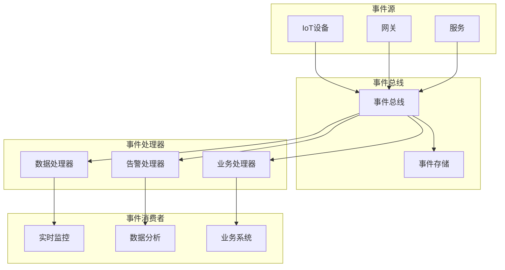

# IoT事件驱动系统分析

## 版本信息

- **版本**: 1.0.0
- **创建日期**: 2024-12-19
- **最后更新**: 2024-12-19
- **作者**: IoT团队
- **状态**: 正式版

## 📋 目录

- [IoT事件驱动系统分析](#iot事件驱动系统分析)
  - [版本信息](#版本信息)
  - [📋 目录](#-目录)
  - [1. 事件驱动系统概述](#1-事件驱动系统概述)
    - [1.1 定义与特征](#11-定义与特征)
      - [1.1.1 核心特征](#111-核心特征)
      - [1.1.2 事件驱动架构优势](#112-事件驱动架构优势)
    - [1.2 IoT事件驱动系统特点](#12-iot事件驱动系统特点)
      - [1.2.1 IoT特定特征](#121-iot特定特征)
  - [2. 事件驱动架构模式](#2-事件驱动架构模式)
    - [2.1 核心架构组件](#21-核心架构组件)
    - [2.2 事件流处理模式](#22-事件流处理模式)
      - [2.2.1 简单事件流](#221-简单事件流)
      - [2.2.2 复杂事件处理(CEP)](#222-复杂事件处理cep)
  - [3. 事件存储与持久化](#3-事件存储与持久化)
    - [3.1 事件存储策略](#31-事件存储策略)
      - [3.1.1 事件溯源(Event Sourcing)](#311-事件溯源event-sourcing)
      - [3.1.2 事件流存储](#312-事件流存储)
    - [3.2 事件序列化与反序列化](#32-事件序列化与反序列化)
  - [4. 事件路由与分发](#4-事件路由与分发)
    - [4.1 事件路由策略](#41-事件路由策略)
    - [4.2 事件分发机制](#42-事件分发机制)
  - [5. 事件处理与业务逻辑](#5-事件处理与业务逻辑)
    - [5.1 事件处理器设计](#51-事件处理器设计)
    - [5.2 业务逻辑实现](#52-业务逻辑实现)
  - [6. 性能优化与监控](#6-性能优化与监控)
    - [6.1 事件处理性能优化](#61-事件处理性能优化)
    - [6.2 事件监控与指标](#62-事件监控与指标)
  - [7. 容错与恢复机制](#7-容错与恢复机制)
    - [7.1 事件重试机制](#71-事件重试机制)
    - [7.2 事件恢复与重放](#72-事件恢复与重放)
  - [8. 事件驱动系统最佳实践](#8-事件驱动系统最佳实践)
    - [8.1 设计原则](#81-设计原则)
    - [8.2 实现建议](#82-实现建议)
  - [9. 总结](#9-总结)

## 1. 事件驱动系统概述

### 1.1 定义与特征

**事件驱动系统**是一种软件架构模式，其中系统的行为由事件的发生和传播驱动，而不是传统的请求-响应模式。

#### 1.1.1 核心特征

```rust
#[derive(Debug, Clone)]
pub struct Event {
    pub id: String,
    pub event_type: EventType,
    pub source: String,
    pub timestamp: DateTime<Utc>,
    pub payload: serde_json::Value,
    pub metadata: EventMetadata,
}

#[derive(Debug, Clone)]
pub enum EventType {
    DeviceData,           // 设备数据事件
    DeviceStatus,         // 设备状态事件
    Alert,                // 告警事件
    Command,              // 命令事件
    SystemEvent,          // 系统事件
    BusinessEvent,        // 业务事件
}

#[derive(Debug, Clone)]
pub struct EventMetadata {
    pub correlation_id: Option<String>,
    pub causation_id: Option<String>,
    pub version: String,
    pub priority: EventPriority,
    pub ttl: Option<Duration>,
}
```

#### 1.1.2 事件驱动架构优势

- **松耦合**: 事件发布者和订阅者之间解耦
- **可扩展性**: 易于添加新的事件处理器
- **实时性**: 支持实时事件处理
- **容错性**: 事件可以重放和恢复
- **可观测性**: 完整的事件轨迹追踪

### 1.2 IoT事件驱动系统特点

#### 1.2.1 IoT特定特征

```rust
#[derive(Debug, Clone)]
pub struct IoTEvent {
    pub base_event: Event,
    pub device_info: DeviceInfo,
    pub sensor_data: Option<SensorData>,
    pub location: Option<Location>,
    pub network_info: NetworkInfo,
}

#[derive(Debug, Clone)]
pub struct DeviceInfo {
    pub device_id: String,
    pub device_type: DeviceType,
    pub firmware_version: String,
    pub capabilities: Vec<Capability>,
}

#[derive(Debug, Clone)]
pub struct SensorData {
    pub sensor_type: SensorType,
    pub value: f64,
    pub unit: String,
    pub accuracy: Option<f64>,
    pub timestamp: DateTime<Utc>,
}
```

## 2. 事件驱动架构模式

### 2.1 核心架构组件



### 2.2 事件流处理模式

#### 2.2.1 简单事件流

```rust
pub trait EventProcessor {
    async fn process_event(&self, event: &Event) -> Result<(), ProcessingError>;
    async fn handle_error(&self, error: &ProcessingError) -> Result<(), ProcessingError>;
}

pub struct SimpleEventProcessor {
    pub processor_id: String,
    pub event_types: Vec<EventType>,
    pub processing_logic: Box<dyn EventProcessingLogic>,
}

impl EventProcessor for SimpleEventProcessor {
    async fn process_event(&self, event: &Event) -> Result<(), ProcessingError> {
        if !self.event_types.contains(&event.event_type) {
            return Ok(());
        }
        
        self.processing_logic.execute(event).await
    }
    
    async fn handle_error(&self, error: &ProcessingError) -> Result<(), ProcessingError> {
        log::error!("处理事件错误: {:?}", error);
        // 实现错误处理逻辑
        Ok(())
    }
}
```

#### 2.2.2 复杂事件处理(CEP)

```rust
#[derive(Debug, Clone)]
pub struct ComplexEventPattern {
    pub pattern_id: String,
    pub conditions: Vec<EventCondition>,
    pub time_window: Duration,
    pub aggregation_rules: Vec<AggregationRule>,
}

#[derive(Debug, Clone)]
pub enum EventCondition {
    Simple(SimpleCondition),
    Composite(CompositeCondition),
    Temporal(TemporalCondition),
}

#[derive(Debug, Clone)]
pub struct SimpleCondition {
    pub field: String,
    pub operator: ComparisonOperator,
    pub value: serde_json::Value,
}

#[derive(Debug, Clone)]
pub enum ComparisonOperator {
    Equals,
    NotEquals,
    GreaterThan,
    LessThan,
    Contains,
    Regex,
}

pub struct ComplexEventProcessor {
    pub patterns: Vec<ComplexEventPattern>,
    pub event_buffer: EventBuffer,
    pub pattern_matcher: PatternMatcher,
}

impl ComplexEventProcessor {
    pub async fn process_event(&mut self, event: &Event) -> Result<Vec<ComplexEvent>, ProcessingError> {
        self.event_buffer.add_event(event.clone());
        self.pattern_matcher.match_patterns(&self.event_buffer).await
    }
}
```

## 3. 事件存储与持久化

### 3.1 事件存储策略

#### 3.1.1 事件溯源(Event Sourcing)

```rust
#[derive(Debug, Clone)]
pub struct EventStore {
    pub storage_backend: Box<dyn EventStorageBackend>,
    pub serializer: Box<dyn EventSerializer>,
    pub event_schema_registry: EventSchemaRegistry,
}

pub trait EventStorageBackend {
    async fn append_events(&self, stream_id: &str, events: &[Event]) -> Result<(), StorageError>;
    async fn read_events(&self, stream_id: &str, from_version: u64) -> Result<Vec<Event>, StorageError>;
    async fn read_all_events(&self, from_timestamp: DateTime<Utc>) -> Result<Vec<Event>, StorageError>;
}

pub struct EventSourcedAggregate<T> {
    pub aggregate_id: String,
    pub version: u64,
    pub state: T,
    pub uncommitted_events: Vec<Event>,
}

impl<T: Aggregate> EventSourcedAggregate<T> {
    pub fn new(aggregate_id: String) -> Self {
        Self {
            aggregate_id,
            version: 0,
            state: T::new(),
            uncommitted_events: Vec::new(),
        }
    }
    
    pub fn apply_event(&mut self, event: &Event) -> Result<(), AggregateError> {
        self.state.apply(event)?;
        self.version += 1;
        Ok(())
    }
    
    pub fn add_event(&mut self, event: Event) {
        self.uncommitted_events.push(event);
    }
}
```

#### 3.1.2 事件流存储

```rust
pub struct EventStream {
    pub stream_id: String,
    pub events: Vec<Event>,
    pub metadata: StreamMetadata,
}

#[derive(Debug, Clone)]
pub struct StreamMetadata {
    pub created_at: DateTime<Utc>,
    pub last_updated: DateTime<Utc>,
    pub event_count: u64,
    pub version: u64,
    pub is_deleted: bool,
}

pub struct EventStreamManager {
    pub storage: Box<dyn EventStorageBackend>,
    pub stream_cache: StreamCache,
}

impl EventStreamManager {
    pub async fn create_stream(&self, stream_id: &str) -> Result<(), StorageError> {
        let metadata = StreamMetadata {
            created_at: Utc::now(),
            last_updated: Utc::now(),
            event_count: 0,
            version: 0,
            is_deleted: false,
        };
        
        self.storage.create_stream(stream_id, metadata).await
    }
    
    pub async fn append_to_stream(&self, stream_id: &str, events: &[Event]) -> Result<(), StorageError> {
        self.storage.append_events(stream_id, events).await
    }
}
```

### 3.2 事件序列化与反序列化

```rust
pub trait EventSerializer {
    fn serialize(&self, event: &Event) -> Result<Vec<u8>, SerializationError>;
    fn deserialize(&self, data: &[u8]) -> Result<Event, SerializationError>;
}

pub struct JsonEventSerializer {
    pub schema_registry: EventSchemaRegistry,
}

impl EventSerializer for JsonEventSerializer {
    fn serialize(&self, event: &Event) -> Result<Vec<u8>, SerializationError> {
        let json = serde_json::to_vec(event)?;
        Ok(json)
    }
    
    fn deserialize(&self, data: &[u8]) -> Result<Event, SerializationError> {
        let event: Event = serde_json::from_slice(data)?;
        Ok(event)
    }
}
```

## 4. 事件路由与分发

### 4.1 事件路由策略

```rust
#[derive(Debug, Clone)]
pub struct EventRouter {
    pub routing_rules: Vec<RoutingRule>,
    pub topic_mappings: HashMap<String, Vec<String>>,
    pub load_balancer: Box<dyn LoadBalancer>,
}

#[derive(Debug, Clone)]
pub struct RoutingRule {
    pub rule_id: String,
    pub conditions: Vec<RoutingCondition>,
    pub target_topics: Vec<String>,
    pub priority: u32,
}

#[derive(Debug, Clone)]
pub enum RoutingCondition {
    EventType(EventType),
    Source(String),
    PayloadField(String, serde_json::Value),
    TimeRange(DateTime<Utc>, DateTime<Utc>),
}

impl EventRouter {
    pub async fn route_event(&self, event: &Event) -> Result<Vec<String>, RoutingError> {
        let mut target_topics = Vec::new();
        
        for rule in &self.routing_rules {
            if self.matches_rule(event, rule) {
                target_topics.extend(rule.target_topics.clone());
            }
        }
        
        Ok(target_topics)
    }
    
    fn matches_rule(&self, event: &Event, rule: &RoutingRule) -> bool {
        rule.conditions.iter().all(|condition| self.matches_condition(event, condition))
    }
    
    fn matches_condition(&self, event: &Event, condition: &RoutingCondition) -> bool {
        match condition {
            RoutingCondition::EventType(event_type) => event.event_type == *event_type,
            RoutingCondition::Source(source) => event.source == *source,
            RoutingCondition::PayloadField(field, value) => {
                // 检查payload中的字段值
                if let Some(field_value) = event.payload.get(field) {
                    field_value == value
                } else {
                    false
                }
            }
            RoutingCondition::TimeRange(start, end) => {
                event.timestamp >= *start && event.timestamp <= *end
            }
        }
    }
}
```

### 4.2 事件分发机制

```rust
pub struct EventDispatcher {
    pub router: EventRouter,
    pub publishers: HashMap<String, Box<dyn EventPublisher>>,
    pub retry_policy: RetryPolicy,
}

pub trait EventPublisher {
    async fn publish(&self, topic: &str, event: &Event) -> Result<(), PublishError>;
    async fn publish_batch(&self, topic: &str, events: &[Event]) -> Result<(), PublishError>;
}

impl EventDispatcher {
    pub async fn dispatch_event(&self, event: &Event) -> Result<(), DispatchError> {
        let target_topics = self.router.route_event(event).await?;
        
        for topic in target_topics {
            if let Some(publisher) = self.publishers.get(&topic) {
                self.publish_with_retry(publisher, &topic, event).await?;
            }
        }
        
        Ok(())
    }
    
    async fn publish_with_retry(
        &self,
        publisher: &Box<dyn EventPublisher>,
        topic: &str,
        event: &Event,
    ) -> Result<(), DispatchError> {
        let mut attempts = 0;
        
        loop {
            match publisher.publish(topic, event).await {
                Ok(_) => return Ok(()),
                Err(error) => {
                    attempts += 1;
                    if attempts >= self.retry_policy.max_attempts {
                        return Err(DispatchError::MaxRetriesExceeded);
                    }
                    
                    tokio::time::sleep(self.retry_policy.backoff_delay(attempts)).await;
                }
            }
        }
    }
}
```

## 5. 事件处理与业务逻辑

### 5.1 事件处理器设计

```rust
pub trait EventHandler {
    async fn handle_event(&self, event: &Event) -> Result<(), HandlerError>;
    fn can_handle(&self, event: &Event) -> bool;
}

pub struct IoTEventHandler {
    pub handler_id: String,
    pub supported_event_types: Vec<EventType>,
    pub business_logic: Box<dyn BusinessLogic>,
    pub metrics_collector: MetricsCollector,
}

impl EventHandler for IoTEventHandler {
    async fn handle_event(&self, event: &Event) -> Result<(), HandlerError> {
        let start_time = Instant::now();
        
        // 执行业务逻辑
        let result = self.business_logic.execute(event).await;
        
        // 收集指标
        let duration = start_time.elapsed();
        self.metrics_collector.record_processing_time(event.event_type.clone(), duration);
        
        result
    }
    
    fn can_handle(&self, event: &Event) -> bool {
        self.supported_event_types.contains(&event.event_type)
    }
}
```

### 5.2 业务逻辑实现

```rust
pub trait BusinessLogic {
    async fn execute(&self, event: &Event) -> Result<(), HandlerError>;
}

pub struct DeviceDataProcessor {
    pub data_validator: DataValidator,
    pub data_transformer: DataTransformer,
    pub data_storage: DataStorage,
    pub alert_generator: AlertGenerator,
}

impl BusinessLogic for DeviceDataProcessor {
    async fn execute(&self, event: &Event) -> Result<(), HandlerError> {
        // 1. 验证数据
        let validated_data = self.data_validator.validate(event).await?;
        
        // 2. 转换数据
        let transformed_data = self.data_transformer.transform(validated_data).await?;
        
        // 3. 存储数据
        self.data_storage.store(transformed_data).await?;
        
        // 4. 检查告警条件
        if let Some(alert) = self.alert_generator.check_alert_conditions(&transformed_data).await? {
            // 生成告警事件
            self.alert_generator.publish_alert(alert).await?;
        }
        
        Ok(())
    }
}
```

## 6. 性能优化与监控

### 6.1 事件处理性能优化

```rust
pub struct EventProcessingPipeline {
    pub stages: Vec<Box<dyn ProcessingStage>>,
    pub buffer_size: usize,
    pub worker_count: usize,
    pub metrics: PipelineMetrics,
}

pub trait ProcessingStage {
    async fn process(&self, events: Vec<Event>) -> Result<Vec<Event>, ProcessingError>;
    fn stage_name(&self) -> &str;
}

impl EventProcessingPipeline {
    pub async fn process_events(&self, events: Vec<Event>) -> Result<Vec<Event>, ProcessingError> {
        let mut current_events = events;
        
        for stage in &self.stages {
            let stage_name = stage.stage_name();
            let start_time = Instant::now();
            
            current_events = stage.process(current_events).await?;
            
            let duration = start_time.elapsed();
            self.metrics.record_stage_processing_time(stage_name, duration);
        }
        
        Ok(current_events)
    }
}
```

### 6.2 事件监控与指标

```rust
#[derive(Debug, Clone)]
pub struct EventMetrics {
    pub total_events_processed: AtomicU64,
    pub events_per_second: AtomicU64,
    pub average_processing_time: AtomicU64,
    pub error_count: AtomicU64,
    pub event_type_distribution: Arc<RwLock<HashMap<EventType, u64>>>,
}

pub struct EventMonitor {
    pub metrics: EventMetrics,
    pub alert_manager: AlertManager,
    pub dashboard: MetricsDashboard,
}

impl EventMonitor {
    pub fn record_event_processed(&self, event_type: EventType, processing_time: Duration) {
        self.metrics.total_events_processed.fetch_add(1, Ordering::Relaxed);
        self.metrics.average_processing_time.store(
            processing_time.as_millis() as u64,
            Ordering::Relaxed,
        );
        
        // 更新事件类型分布
        if let Ok(mut distribution) = self.metrics.event_type_distribution.write() {
            *distribution.entry(event_type).or_insert(0) += 1;
        }
    }
    
    pub fn get_metrics_summary(&self) -> MetricsSummary {
        MetricsSummary {
            total_events: self.metrics.total_events_processed.load(Ordering::Relaxed),
            events_per_second: self.metrics.events_per_second.load(Ordering::Relaxed),
            average_processing_time: self.metrics.average_processing_time.load(Ordering::Relaxed),
            error_rate: self.calculate_error_rate(),
        }
    }
}
```

## 7. 容错与恢复机制

### 7.1 事件重试机制

```rust
#[derive(Debug, Clone)]
pub struct RetryPolicy {
    pub max_attempts: u32,
    pub initial_delay: Duration,
    pub max_delay: Duration,
    pub backoff_multiplier: f64,
    pub jitter: bool,
}

impl RetryPolicy {
    pub fn backoff_delay(&self, attempt: u32) -> Duration {
        let delay = self.initial_delay * (self.backoff_multiplier.powi(attempt as i32));
        let capped_delay = delay.min(self.max_delay);
        
        if self.jitter {
            let jitter = capped_delay.mul_f64(rand::random::<f64>() * 0.1);
            capped_delay + jitter
        } else {
            capped_delay
        }
    }
}

pub struct EventRetryHandler {
    pub retry_policy: RetryPolicy,
    pub dead_letter_queue: DeadLetterQueue,
    pub event_store: EventStore,
}

impl EventRetryHandler {
    pub async fn handle_failed_event(&self, event: Event, error: ProcessingError) -> Result<(), RetryError> {
        let retry_count = self.get_retry_count(&event).await?;
        
        if retry_count < self.retry_policy.max_attempts {
            // 重新调度事件
            self.schedule_retry(event, retry_count).await?;
        } else {
            // 发送到死信队列
            self.dead_letter_queue.send(event, error).await?;
        }
        
        Ok(())
    }
}
```

### 7.2 事件恢复与重放

```rust
pub struct EventRecoveryManager {
    pub event_store: EventStore,
    pub checkpoint_store: CheckpointStore,
    pub recovery_strategy: RecoveryStrategy,
}

#[derive(Debug, Clone)]
pub enum RecoveryStrategy {
    FromCheckpoint(String),
    FromTimestamp(DateTime<Utc>),
    FromEventId(String),
    FullReplay,
}

impl EventRecoveryManager {
    pub async fn recover_events(&self, strategy: RecoveryStrategy) -> Result<Vec<Event>, RecoveryError> {
        let events = match strategy {
            RecoveryStrategy::FromCheckpoint(checkpoint_id) => {
                let checkpoint = self.checkpoint_store.get_checkpoint(&checkpoint_id).await?;
                self.event_store.read_events(&checkpoint.stream_id, checkpoint.version).await?
            }
            RecoveryStrategy::FromTimestamp(timestamp) => {
                self.event_store.read_all_events(timestamp).await?
            }
            RecoveryStrategy::FromEventId(event_id) => {
                self.event_store.read_events_from_id(&event_id).await?
            }
            RecoveryStrategy::FullReplay => {
                self.event_store.read_all_events(DateTime::UNIX_EPOCH).await?
            }
        };
        
        Ok(events)
    }
}
```

## 8. 事件驱动系统最佳实践

### 8.1 设计原则

1. **事件不可变性**: 事件一旦发布就不能修改
2. **事件幂等性**: 重复处理同一事件不应产生副作用
3. **事件顺序性**: 确保事件的处理顺序
4. **事件原子性**: 事件处理要么完全成功，要么完全失败
5. **事件可追溯性**: 每个事件都应该有完整的处理轨迹

### 8.2 实现建议

```rust
// 事件幂等性检查
pub struct IdempotencyChecker {
    pub processed_events: Arc<RwLock<HashSet<String>>>,
    pub ttl: Duration,
}

impl IdempotencyChecker {
    pub async fn is_processed(&self, event_id: &str) -> bool {
        if let Ok(events) = self.processed_events.read() {
            events.contains(event_id)
        } else {
            false
        }
    }
    
    pub async fn mark_processed(&self, event_id: String) {
        if let Ok(mut events) = self.processed_events.write() {
            events.insert(event_id);
        }
    }
}

// 事件顺序保证
pub struct EventOrderingManager {
    pub sequence_numbers: Arc<RwLock<HashMap<String, u64>>>,
    pub out_of_order_buffer: Arc<RwLock<BTreeMap<u64, Event>>>,
}

impl EventOrderingManager {
    pub async fn process_in_order(&mut self, event: Event) -> Result<Option<Event>, OrderingError> {
        let expected_sequence = self.get_expected_sequence(&event.source).await;
        
        if event.sequence_number == expected_sequence {
            // 处理当前事件
            self.increment_sequence(&event.source).await;
            
            // 检查是否有后续事件可以处理
            self.process_buffered_events(&event.source).await
        } else if event.sequence_number > expected_sequence {
            // 缓存事件
            self.buffer_event(event).await;
            Ok(None)
        } else {
            // 重复或过时的事件
            Ok(None)
        }
    }
}
```

## 9. 总结

IoT事件驱动系统是现代IoT架构的核心组件，它提供了：

- **松耦合的架构**: 设备、服务和应用程序之间解耦
- **实时处理能力**: 支持大规模实时事件处理
- **可扩展性**: 易于添加新的事件源和处理器
- **容错性**: 内置重试、恢复和监控机制
- **可观测性**: 完整的事件轨迹和指标监控

通过合理设计事件驱动架构，可以构建高性能、高可靠性的IoT系统，满足各种复杂的业务需求。
