# IoT系统架构总览分析

## 版本信息

- **版本**: 1.0.0
- **创建日期**: 2024-12-19
- **最后更新**: 2024-12-19
- **作者**: IoT团队
- **状态**: 正式版

## 📋 目录

- [IoT系统架构总览分析](#iot系统架构总览分析)
  - [版本信息](#版本信息)
  - [📋 目录](#-目录)
  - [1. 系统架构概述](#1-系统架构概述)
    - [1.1 IoT系统架构定义](#11-iot系统架构定义)
    - [1.2 架构设计原则](#12-架构设计原则)
      - [1.2.1 分层设计原则](#121-分层设计原则)
      - [1.2.2 模块化设计原则](#122-模块化设计原则)
      - [1.2.3 分布式设计原则](#123-分布式设计原则)
  - [2. 核心组件分析](#2-核心组件分析)
    - [2.1 设备管理组件](#21-设备管理组件)
      - [2.1.1 设备注册与发现](#211-设备注册与发现)
      - [2.1.2 设备生命周期管理](#212-设备生命周期管理)
    - [2.2 数据管理组件](#22-数据管理组件)
      - [2.2.1 数据采集](#221-数据采集)
      - [2.2.2 数据存储](#222-数据存储)
      - [2.2.3 数据处理](#223-数据处理)
    - [2.3 通信管理组件](#23-通信管理组件)
      - [2.3.1 通信协议栈](#231-通信协议栈)
      - [2.3.2 消息路由](#232-消息路由)
    - [2.4 安全组件](#24-安全组件)
      - [2.4.1 身份认证](#241-身份认证)
      - [2.4.2 数据加密](#242-数据加密)
  - [3. 系统间交互关系](#3-系统间交互关系)
    - [3.1 组件交互模式](#31-组件交互模式)
      - [3.1.1 同步交互](#311-同步交互)
      - [3.1.2 异步交互](#312-异步交互)
    - [3.2 服务间通信](#32-服务间通信)
      - [3.2.1 RESTful API](#321-restful-api)
      - [3.2.2 gRPC通信](#322-grpc通信)
    - [3.3 事件驱动架构](#33-事件驱动架构)
      - [3.3.1 事件定义](#331-事件定义)
      - [3.3.2 事件处理](#332-事件处理)
  - [4. 架构模式选择](#4-架构模式选择)
    - [4.1 微服务架构](#41-微服务架构)
      - [4.1.1 服务拆分原则](#411-服务拆分原则)
      - [4.1.2 服务治理](#412-服务治理)
    - [4.2 事件驱动架构](#42-事件驱动架构)
      - [4.2.1 事件流处理](#421-事件流处理)
      - [4.2.2 事件溯源](#422-事件溯源)
    - [4.3 分层架构](#43-分层架构)
      - [4.3.1 表现层](#431-表现层)
      - [4.3.2 业务层](#432-业务层)
      - [4.3.3 数据层](#433-数据层)
  - [5. 性能优化策略](#5-性能优化策略)
    - [5.1 系统性能指标](#51-系统性能指标)
      - [5.1.1 响应时间](#511-响应时间)
      - [5.1.2 吞吐量](#512-吞吐量)
      - [5.1.3 可用性](#513-可用性)
    - [5.2 优化技术](#52-优化技术)
      - [5.2.1 缓存策略](#521-缓存策略)
      - [5.2.2 负载均衡](#522-负载均衡)
      - [5.2.3 数据库优化](#523-数据库优化)
  - [6. 部署和运维](#6-部署和运维)
    - [6.1 部署策略](#61-部署策略)
      - [6.1.1 容器化部署](#611-容器化部署)
      - [6.1.2 微服务部署](#612-微服务部署)
    - [6.2 监控和日志](#62-监控和日志)
      - [6.2.1 系统监控](#621-系统监控)
      - [6.2.2 日志管理](#622-日志管理)
  - [7. 总结](#7-总结)
    - [7.1 架构特点](#71-架构特点)
    - [7.2 技术优势](#72-技术优势)
    - [7.3 应用场景](#73-应用场景)

## 1. 系统架构概述

### 1.1 IoT系统架构定义

IoT系统架构是指物联网系统中各个组件、模块和服务之间的组织结构和交互关系，它定义了系统的整体设计原则、组件划分、通信机制和部署策略。

### 1.2 架构设计原则

#### 1.2.1 分层设计原则

```text
IoT系统分层架构
├── 感知层 (Perception Layer)
│   ├── 传感器网络
│   ├── 数据采集
│   └── 设备管理
├── 网络层 (Network Layer)
│   ├── 通信协议
│   ├── 路由转发
│   └── 网络管理
├── 平台层 (Platform Layer)
│   ├── 数据处理
│   ├── 业务逻辑
│   └── 服务管理
└── 应用层 (Application Layer)
    ├── 业务应用
    ├── 用户界面
    └── 系统集成
```

#### 1.2.2 模块化设计原则

- **高内聚**: 模块内部功能紧密相关
- **低耦合**: 模块间依赖关系最小化
- **可扩展**: 支持新功能的动态添加
- **可维护**: 便于系统维护和升级

#### 1.2.3 分布式设计原则

- **去中心化**: 避免单点故障
- **负载均衡**: 合理分配系统负载
- **容错性**: 具备故障恢复能力
- **可扩展性**: 支持水平扩展

## 2. 核心组件分析

### 2.1 设备管理组件

#### 2.1.1 设备注册与发现

```rust
#[derive(Debug, Clone)]
pub struct DeviceInfo {
    pub device_id: String,
    pub device_type: DeviceType,
    pub capabilities: Vec<Capability>,
    pub location: Option<Location>,
    pub status: DeviceStatus,
}

#[derive(Debug, Clone)]
pub enum DeviceType {
    Sensor(SensorType),
    Actuator(ActuatorType),
    Gateway(GatewayType),
    Controller(ControllerType),
}

pub trait DeviceManager {
    async fn register_device(&self, device: DeviceInfo) -> Result<(), DeviceError>;
    async fn discover_devices(&self, filter: DeviceFilter) -> Result<Vec<DeviceInfo>, DeviceError>;
    async fn update_device_status(&self, device_id: &str, status: DeviceStatus) -> Result<(), DeviceError>;
}
```

#### 2.1.2 设备生命周期管理

- **设备注册**: 新设备加入系统
- **设备认证**: 验证设备身份和权限
- **设备监控**: 实时监控设备状态
- **设备维护**: 远程维护和升级
- **设备退役**: 设备退出系统

### 2.2 数据管理组件

#### 2.2.1 数据采集

```rust
#[derive(Debug, Clone)]
pub struct DataPoint {
    pub device_id: String,
    pub timestamp: DateTime<Utc>,
    pub data_type: DataType,
    pub value: Value,
    pub quality: DataQuality,
}

#[derive(Debug, Clone)]
pub enum DataType {
    Temperature(f64),
    Humidity(f64),
    Pressure(f64),
    Location(Location),
    Status(DeviceStatus),
    Custom(String, Value),
}

pub trait DataCollector {
    async fn collect_data(&self, device_id: &str) -> Result<DataPoint, DataError>;
    async fn batch_collect(&self, device_ids: &[String]) -> Result<Vec<DataPoint>, DataError>;
    async fn stream_data(&self, device_id: &str) -> Result<DataStream, DataError>;
}
```

#### 2.2.2 数据存储

- **时序数据库**: 存储时间序列数据
- **关系数据库**: 存储结构化数据
- **文档数据库**: 存储半结构化数据
- **图数据库**: 存储关系数据
- **对象存储**: 存储大文件数据

#### 2.2.3 数据处理

- **数据清洗**: 去除噪声和异常数据
- **数据转换**: 格式转换和标准化
- **数据聚合**: 多源数据聚合
- **数据分析**: 统计分析和挖掘

### 2.3 通信管理组件

#### 2.3.1 通信协议栈

```text
IoT通信协议栈
├── 应用层 (Application Layer)
│   ├── MQTT
│   ├── CoAP
│   ├── HTTP/HTTPS
│   └── AMQP
├── 传输层 (Transport Layer)
│   ├── TCP
│   ├── UDP
│   └── WebSocket
├── 网络层 (Network Layer)
│   ├── IPv4/IPv6
│   ├── 6LoWPAN
│   └── LoRaWAN
└── 物理层 (Physical Layer)
    ├── WiFi
    ├── Bluetooth
    ├── Zigbee
    └── Cellular
```

#### 2.3.2 消息路由

```rust
#[derive(Debug, Clone)]
pub struct Message {
    pub id: String,
    pub source: String,
    pub destination: String,
    pub payload: Vec<u8>,
    pub timestamp: DateTime<Utc>,
    pub priority: MessagePriority,
}

#[derive(Debug, Clone)]
pub enum MessagePriority {
    Low,
    Normal,
    High,
    Critical,
}

pub trait MessageRouter {
    async fn route_message(&self, message: Message) -> Result<(), RoutingError>;
    async fn subscribe(&self, topic: &str, handler: MessageHandler) -> Result<(), SubscriptionError>;
    async fn publish(&self, topic: &str, message: Message) -> Result<(), PublishingError>;
}
```

### 2.4 安全组件

#### 2.4.1 身份认证

```rust
#[derive(Debug, Clone)]
pub struct Identity {
    pub id: String,
    pub name: String,
    pub role: Role,
    pub permissions: Vec<Permission>,
    pub certificate: Option<Certificate>,
}

#[derive(Debug, Clone)]
pub enum Role {
    Device,
    User,
    Administrator,
    Service,
}

pub trait AuthenticationService {
    async fn authenticate(&self, credentials: Credentials) -> Result<Identity, AuthError>;
    async fn verify_token(&self, token: &str) -> Result<Identity, AuthError>;
    async fn refresh_token(&self, token: &str) -> Result<String, AuthError>;
}
```

#### 2.4.2 数据加密

- **传输加密**: TLS/SSL协议
- **存储加密**: 数据存储加密
- **端到端加密**: 端到端数据保护
- **密钥管理**: 密钥生成、分发和管理

## 3. 系统间交互关系

### 3.1 组件交互模式

#### 3.1.1 同步交互

```mermaid
sequenceDiagram
    participant Client
    participant API Gateway
    participant Service A
    participant Service B
    participant Database
    
    Client->>API Gateway: 请求数据
    API Gateway->>Service A: 转发请求
    Service A->>Service B: 调用服务
    Service B->>Database: 查询数据
    Database-->>Service B: 返回数据
    Service B-->>Service A: 返回结果
    Service A-->>API Gateway: 返回结果
    API Gateway-->>Client: 返回数据
```



#### 3.1.2 异步交互

```mermaid
sequenceDiagram
    participant Producer
    participant Message Queue
    participant Consumer A
    participant Consumer B
    
    Producer->>Message Queue: 发布消息
    Message Queue->>Consumer A: 推送消息
    Message Queue->>Consumer B: 推送消息
    Consumer A-->>Message Queue: 确认处理
    Consumer B-->>Message Queue: 确认处理
```



### 3.2 服务间通信

#### 3.2.1 RESTful API

```rust
#[derive(Debug, Serialize, Deserialize)]
pub struct DeviceResponse {
    pub device_id: String,
    pub status: DeviceStatus,
    pub last_seen: DateTime<Utc>,
    pub data: Option<Vec<DataPoint>>,
}

#[derive(Debug, Serialize, Deserialize)]
pub struct CreateDeviceRequest {
    pub device_type: DeviceType,
    pub location: Option<Location>,
    pub capabilities: Vec<Capability>,
}

// RESTful API 端点
#[get("/devices/{device_id}")]
async fn get_device(device_id: Path<String>) -> Result<Json<DeviceResponse>, ApiError> {
    // 实现设备查询逻辑
}

#[post("/devices")]
async fn create_device(request: Json<CreateDeviceRequest>) -> Result<Json<DeviceResponse>, ApiError> {
    // 实现设备创建逻辑
}
```

#### 3.2.2 gRPC通信

```protobuf
syntax = "proto3";

package iot.v1;

service DeviceService {
    rpc GetDevice(GetDeviceRequest) returns (DeviceResponse);
    rpc CreateDevice(CreateDeviceRequest) returns (DeviceResponse);
    rpc UpdateDevice(UpdateDeviceRequest) returns (DeviceResponse);
    rpc DeleteDevice(DeleteDeviceRequest) returns (DeleteDeviceResponse);
    rpc ListDevices(ListDevicesRequest) returns (ListDevicesResponse);
}

message DeviceResponse {
    string device_id = 1;
    DeviceStatus status = 2;
    google.protobuf.Timestamp last_seen = 3;
    repeated DataPoint data = 4;
}
```

### 3.3 事件驱动架构

#### 3.3.1 事件定义

```rust
#[derive(Debug, Clone, Serialize, Deserialize)]
pub struct Event {
    pub id: String,
    pub event_type: EventType,
    pub source: String,
    pub timestamp: DateTime<Utc>,
    pub payload: EventPayload,
    pub metadata: HashMap<String, Value>,
}

#[derive(Debug, Clone, Serialize, Deserialize)]
pub enum EventType {
    DeviceRegistered,
    DeviceDisconnected,
    DataReceived,
    AlertTriggered,
    SystemMaintenance,
}

#[derive(Debug, Clone, Serialize, Deserialize)]
pub enum EventPayload {
    DeviceEvent(DeviceEvent),
    DataEvent(DataEvent),
    AlertEvent(AlertEvent),
    SystemEvent(SystemEvent),
}
```

#### 3.3.2 事件处理

```rust
pub trait EventHandler {
    async fn handle_event(&self, event: Event) -> Result<(), EventError>;
}

pub struct DeviceEventHandler {
    device_manager: Arc<DeviceManager>,
    notification_service: Arc<NotificationService>,
}

#[async_trait]
impl EventHandler for DeviceEventHandler {
    async fn handle_event(&self, event: Event) -> Result<(), EventError> {
        match event.event_type {
            EventType::DeviceRegistered => {
                self.handle_device_registered(event).await?;
            }
            EventType::DeviceDisconnected => {
                self.handle_device_disconnected(event).await?;
            }
            _ => {
                // 处理其他事件类型
            }
        }
        Ok(())
    }
}
```

## 4. 架构模式选择

### 4.1 微服务架构

#### 4.1.1 服务拆分原则

- **业务边界**: 按业务领域拆分服务
- **数据边界**: 按数据所有权拆分服务
- **团队边界**: 按团队组织拆分服务
- **技术边界**: 按技术栈拆分服务

#### 4.1.2 服务治理

```rust
#[derive(Debug, Clone)]
pub struct ServiceRegistry {
    pub service_name: String,
    pub service_version: String,
    pub service_endpoint: String,
    pub health_check_url: String,
    pub metadata: HashMap<String, String>,
}

pub trait ServiceDiscovery {
    async fn register_service(&self, service: ServiceRegistry) -> Result<(), RegistryError>;
    async fn discover_service(&self, service_name: &str) -> Result<Vec<ServiceRegistry>, DiscoveryError>;
    async fn deregister_service(&self, service_name: &str, service_id: &str) -> Result<(), RegistryError>;
}
```

### 4.2 事件驱动架构

#### 4.2.1 事件流处理

```rust
pub struct EventStream {
    pub stream_id: String,
    pub events: Vec<Event>,
    pub processing_status: ProcessingStatus,
}

pub trait EventProcessor {
    async fn process_event(&self, event: Event) -> Result<(), ProcessingError>;
    async fn process_event_stream(&self, stream: EventStream) -> Result<(), ProcessingError>;
    async fn handle_event_failure(&self, event: Event, error: ProcessingError) -> Result<(), ProcessingError>;
}
```

#### 4.2.2 事件溯源

```rust
#[derive(Debug, Clone, Serialize, Deserialize)]
pub struct EventStore {
    pub events: Vec<Event>,
    pub snapshots: Vec<Snapshot>,
}

pub trait EventSourcing {
    async fn append_event(&self, aggregate_id: &str, event: Event) -> Result<(), EventStoreError>;
    async fn get_events(&self, aggregate_id: &str) -> Result<Vec<Event>, EventStoreError>;
    async fn create_snapshot(&self, aggregate_id: &str, snapshot: Snapshot) -> Result<(), EventStoreError>;
}
```

### 4.3 分层架构

#### 4.3.1 表现层

- **API网关**: 统一入口和路由
- **负载均衡**: 请求分发和负载均衡
- **认证授权**: 身份验证和权限控制

#### 4.3.2 业务层

- **业务服务**: 核心业务逻辑
- **领域服务**: 领域特定服务
- **应用服务**: 应用协调服务

#### 4.3.3 数据层

- **数据访问**: 数据访问对象
- **数据存储**: 各种数据存储
- **缓存**: 数据缓存服务

## 5. 性能优化策略

### 5.1 系统性能指标

#### 5.1.1 响应时间

- **平均响应时间**: 系统平均响应时间
- **95%响应时间**: 95%请求的响应时间
- **99%响应时间**: 99%请求的响应时间
- **最大响应时间**: 系统最大响应时间

#### 5.1.2 吞吐量

- **请求吞吐量**: 每秒处理的请求数
- **数据吞吐量**: 每秒处理的数据量
- **并发用户数**: 同时在线用户数

#### 5.1.3 可用性

- **系统可用性**: 系统正常运行时间比例
- **故障恢复时间**: 从故障到恢复的时间
- **数据一致性**: 数据一致性的保证程度

### 5.2 优化技术

#### 5.2.1 缓存策略

```rust
pub trait Cache {
    async fn get(&self, key: &str) -> Result<Option<Value>, CacheError>;
    async fn set(&self, key: &str, value: Value, ttl: Option<Duration>) -> Result<(), CacheError>;
    async fn delete(&self, key: &str) -> Result<(), CacheError>;
    async fn clear(&self) -> Result<(), CacheError>;
}

pub struct MultiLevelCache {
    l1_cache: Arc<dyn Cache>, // 内存缓存
    l2_cache: Arc<dyn Cache>, // 分布式缓存
}
```

#### 5.2.2 负载均衡

```rust
#[derive(Debug, Clone)]
pub struct LoadBalancer {
    pub strategy: LoadBalancingStrategy,
    pub health_check: HealthCheck,
    pub backends: Vec<Backend>,
}

#[derive(Debug, Clone)]
pub enum LoadBalancingStrategy {
    RoundRobin,
    LeastConnections,
    WeightedRoundRobin,
    IPHash,
    ConsistentHash,
}
```

#### 5.2.3 数据库优化

- **索引优化**: 合理设计数据库索引
- **查询优化**: 优化SQL查询语句
- **分库分表**: 水平拆分和垂直拆分
- **读写分离**: 主从复制和读写分离

## 6. 部署和运维

### 6.1 部署策略

#### 6.1.1 容器化部署

```dockerfile
# Dockerfile示例
FROM rust:1.70 as builder
WORKDIR /app
COPY . .
RUN cargo build --release

FROM debian:bullseye-slim
RUN apt-get update && apt-get install -y ca-certificates && rm -rf /var/lib/apt/lists/*
COPY --from=builder /app/target/release/iot-service /usr/local/bin/
EXPOSE 8080
CMD ["iot-service"]
```

#### 6.1.2 微服务部署

```yaml
# docker-compose.yml示例
version: '3.8'
services:
  device-service:
    build: ./device-service
    ports:
      - "8081:8080"
    environment:
      - DATABASE_URL=postgresql://user:pass@db:5432/iot
    depends_on:
      - db
      - redis
  
  data-service:
    build: ./data-service
    ports:
      - "8082:8080"
    environment:
      - DATABASE_URL=postgresql://user:pass@db:5432/iot
    depends_on:
      - db
  
  db:
    image: postgres:13
    environment:
      - POSTGRES_DB=iot
      - POSTGRES_USER=user
      - POSTGRES_PASSWORD=pass
    volumes:
      - postgres_data:/var/lib/postgresql/data
  
  redis:
    image: redis:6-alpine
    ports:
      - "6379:6379"

volumes:
  postgres_data:
```

### 6.2 监控和日志

#### 6.2.1 系统监控

```rust
#[derive(Debug, Clone)]
pub struct Metrics {
    pub cpu_usage: f64,
    pub memory_usage: f64,
    pub disk_usage: f64,
    pub network_io: NetworkIO,
    pub request_count: u64,
    pub error_count: u64,
}

pub trait MetricsCollector {
    async fn collect_metrics(&self) -> Result<Metrics, MetricsError>;
    async fn record_metric(&self, name: &str, value: f64) -> Result<(), MetricsError>;
}
```

#### 6.2.2 日志管理

```rust
#[derive(Debug, Clone)]
pub struct LogEntry {
    pub timestamp: DateTime<Utc>,
    pub level: LogLevel,
    pub service: String,
    pub message: String,
    pub context: HashMap<String, Value>,
}

#[derive(Debug, Clone)]
pub enum LogLevel {
    Trace,
    Debug,
    Info,
    Warn,
    Error,
    Fatal,
}

pub trait Logger {
    async fn log(&self, entry: LogEntry) -> Result<(), LogError>;
    async fn log_with_context(&self, level: LogLevel, message: &str, context: HashMap<String, Value>) -> Result<(), LogError>;
}
```

## 7. 总结

### 7.1 架构特点

1. **分层设计**: 清晰的分层架构，便于理解和维护
2. **模块化**: 高内聚、低耦合的模块设计
3. **分布式**: 支持分布式部署和扩展
4. **可扩展**: 支持水平和垂直扩展
5. **高可用**: 具备容错和恢复能力

### 7.2 技术优势

1. **性能优化**: 多层次性能优化策略
2. **安全可靠**: 完善的安全机制
3. **易于维护**: 清晰的架构和文档
4. **标准化**: 遵循行业标准和最佳实践

### 7.3 应用场景

1. **工业物联网**: 智能制造、预测性维护
2. **智慧城市**: 交通管理、环境监控
3. **智能家居**: 设备控制、场景联动
4. **医疗健康**: 设备监控、数据采集

---

**本文档为IoT系统架构提供了全面的分析和设计指导，为构建高性能、高可用的IoT系统奠定了坚实的基础。**
