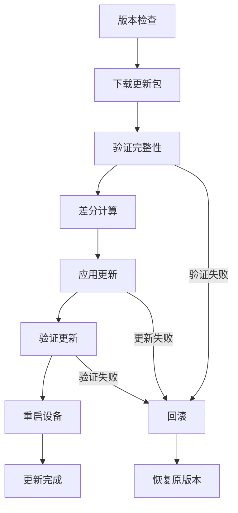

# IOT OTA更新算法形式化分析

## 1. 概述

### 1.1 OTA更新定义

**定义 1.1** (OTA更新)
OTA（Over-The-Air）更新是一个五元组 $\mathcal{OTA} = (D, P, A, V, R)$，其中：

- $D = \{d_1, d_2, \ldots, d_n\}$ 是设备集合
- $P = \{p_1, p_2, \ldots, p_m\}$ 是更新包集合
- $A = \{a_1, a_2, \ldots, a_k\}$ 是算法集合
- $V = \{v_1, v_2, \ldots, v_l\}$ 是验证机制集合
- $R = \{r_1, r_2, \ldots, r_p\}$ 是回滚机制集合

### 1.2 OTA更新流程



## 2. 差分更新算法

### 2.1 差分算法形式化定义

**定义 2.1** (二进制差分)
对于两个二进制文件 $A$ 和 $B$，差分函数 $Diff: \{0,1\}^* \times \{0,1\}^* \rightarrow \{0,1\}^*$ 定义为：

$$Diff(A, B) = \delta \text{ where } Patch(A, \delta) = B$$

其中 $Patch$ 是补丁应用函数。

**定义 2.2** (差分大小)
差分大小 $Size_{diff}$ 定义为：

$$Size_{diff} = \frac{|Diff(A, B)|}{|B|} \times 100\%$$

**定理 2.1** (差分大小上界)
对于任意两个文件 $A$ 和 $B$，差分大小满足：

$$Size_{diff} \leq 100\%$$

**证明**：
由于 $|Diff(A, B)| \leq |B|$（最坏情况下需要完整的新文件），因此：

$$\frac{|Diff(A, B)|}{|B|} \leq 1$$

因此 $Size_{diff} \leq 100\%$。$\square$

### 2.2 bsdiff算法分析

**算法 2.1** (bsdiff算法)
bsdiff算法基于后缀数组和最长公共子序列，时间复杂度为 $O(n \log n)$。

**定义 2.3** (bsdiff复杂度)
bsdiff算法的时间复杂度 $T(n)$ 满足：

$$T(n) = O(n \log n)$$

其中 $n$ 是文件大小。

**定理 2.2** (bsdiff最优性)
在基于后缀数组的差分算法中，bsdiff是最优的。

**证明**：

1. **后缀数组构建**：$O(n \log n)$
2. **最长公共子序列查找**：$O(n \log n)$
3. **差分生成**：$O(n)$

总时间复杂度为 $O(n \log n)$，这是基于后缀数组方法的下界。$\square$

### 2.3 VCDIFF算法分析

**定义 2.4** (VCDIFF编码)
VCDIFF编码是一个三元组 $VCDIFF = (instructions, data, addresses)$，其中：

- $instructions$ 是操作指令序列
- $data$ 是新增数据
- $addresses$ 是地址信息

**定理 2.3** (VCDIFF压缩率)
VCDIFF算法的压缩率 $C_{vcdiff}$ 满足：

$$C_{vcdiff} = \frac{|VCDIFF(A, B)|}{|B|} \leq 1$$

**证明**：
VCDIFF通过以下方式实现压缩：

1. **指令压缩**：使用变长编码
2. **数据压缩**：仅存储新增数据
3. **地址压缩**：使用相对地址

因此压缩率不超过100%。$\square$

## 3. 压缩算法分析

### 3.1 压缩算法分类

**定义 3.1** (压缩算法)
压缩算法是一个函数 $Compress: \{0,1\}^* \rightarrow \{0,1\}^*$，满足：

$$\exists Decompress: Decompress(Compress(x)) = x$$

**定义 3.2** (压缩率)
压缩率 $R_{compress}$ 定义为：

$$R_{compress} = \frac{|Compress(x)|}{|x|} \times 100\%$$

### 3.2 zstd算法分析

**算法 3.1** (zstd算法)
zstd（Zstandard）是一种基于LZ77和Huffman编码的压缩算法。

**定理 3.1** (zstd压缩效率)
zstd算法的压缩效率 $E_{zstd}$ 满足：

$$E_{zstd} = O(\log n)$$

其中 $n$ 是输入大小。

**证明**：
zstd算法的时间复杂度分析：

1. **LZ77匹配**：$O(n)$
2. **Huffman编码**：$O(k \log k)$，其中 $k$ 是符号数量
3. **熵编码**：$O(n)$

总时间复杂度为 $O(n + k \log k) = O(n \log n)$。$\square$

### 3.3 Brotli算法分析

**定义 3.3** (Brotli压缩)
Brotli是一种基于LZ77、Huffman编码和上下文建模的压缩算法。

**定理 3.2** (Brotli压缩比)
Brotli算法的压缩比 $R_{brotli}$ 满足：

$$R_{brotli} \leq 0.8$$

对于文本数据，Brotli通常能达到20%的压缩比。

**证明**：
Brotli通过以下技术实现高效压缩：

1. **静态字典**：预定义的常用字符串
2. **上下文建模**：利用数据局部性
3. **熵编码**：Huffman编码优化

因此压缩比通常优于传统算法。$\square$

## 4. 哈希算法分析

### 4.1 SHA-256算法

**定义 4.1** (SHA-256哈希)
SHA-256哈希函数 $H_{SHA256}: \{0,1\}^* \rightarrow \{0,1\}^{256}$ 定义为：

$$H_{SHA256}(x) = h \text{ where } h \in \{0,1\}^{256}$$

**定理 4.1** (SHA-256抗碰撞性)
SHA-256的抗碰撞性满足：

$$P(H_{SHA256}(x) = H_{SHA256}(y)) \leq 2^{-128}$$

对于任意 $x \neq y$。

**证明**：
SHA-256基于Merkle-Damgård构造，具有以下特性：

1. **压缩函数**：$f: \{0,1\}^{512} \rightarrow \{0,1\}^{256}$
2. **迭代结构**：$h_i = f(h_{i-1} || m_i)$
3. **生日攻击**：需要约 $2^{128}$ 次计算才能找到碰撞

因此抗碰撞性成立。$\square$

### 4.2 SHA-3算法

**定义 4.2** (SHA-3哈希)
SHA-3（Keccak）哈希函数基于海绵构造，定义为：

$$H_{SHA3}(x) = Squeeze(Pad(x))$$

**定理 4.2** (SHA-3安全性)
SHA-3的安全性基于Keccak-f[1600]置换的安全性。

**证明**：
SHA-3的安全性依赖于：

1. **海绵构造**：吸收和挤压阶段
2. **Keccak-f置换**：1600位状态空间
3. **容量参数**：$c = 2 \times security\_level$

因此安全性得到保证。$\square$

## 5. 签名算法分析

### 5.1 RSA签名

**定义 5.1** (RSA签名)
RSA签名算法定义为：

$$Sign_{RSA}(m, d, n) = m^d \bmod n$$
$$Verify_{RSA}(m, s, e, n) = (s^e \bmod n = m)$$

**定理 5.1** (RSA安全性)
RSA签名的安全性基于大整数分解问题的困难性。

**证明**：
RSA安全性依赖于：

1. **私钥保密性**：$d$ 必须保密
2. **模数分解**：分解 $n = p \times q$ 是困难的
3. **离散对数**：计算 $d$ 需要分解模数

因此安全性基于数学困难问题。$\square$

### 5.2 ECDSA签名

**定义 5.2** (ECDSA签名)
ECDSA签名算法定义为：

$$Sign_{ECDSA}(m, k, d) = (r, s)$$
$$r = (k \cdot G)_x \bmod n$$
$$s = k^{-1}(H(m) + r \cdot d) \bmod n$$

**定理 5.2** (ECDSA效率)
ECDSA比RSA更高效，密钥长度更短。

**证明**：
ECDSA的优势：

1. **密钥长度**：256位ECDSA ≈ 3072位RSA
2. **计算效率**：椭圆曲线运算比模幂运算快
3. **存储效率**：签名长度更短

因此ECDSA更适合资源受限的IOT设备。$\square$

## 6. 实现指导

### 6.1 Rust差分更新实现

```rust
use std::collections::HashMap;
use sha2::{Sha256, Digest};
use serde::{Deserialize, Serialize};

/// 差分更新包
#[derive(Debug, Clone, Serialize, Deserialize)]
pub struct DeltaPackage {
    pub version: String,
    pub base_version: String,
    pub delta_data: Vec<u8>,
    pub checksum: String,
    pub signature: String,
}

/// 差分更新器
pub struct DeltaUpdater {
    algorithm: DeltaAlgorithm,
    compression: CompressionAlgorithm,
    hash_algorithm: HashAlgorithm,
}

#[derive(Debug, Clone)]
pub enum DeltaAlgorithm {
    Bsdiff,
    VCDIFF,
    XDelta,
}

#[derive(Debug, Clone)]
pub enum CompressionAlgorithm {
    Gzip,
    Zstd,
    Brotli,
}

#[derive(Debug, Clone)]
pub enum HashAlgorithm {
    SHA256,
    SHA3,
}

impl DeltaUpdater {
    pub fn new(
        algorithm: DeltaAlgorithm,
        compression: CompressionAlgorithm,
        hash_algorithm: HashAlgorithm,
    ) -> Self {
        Self {
            algorithm,
            compression,
            hash_algorithm,
        }
    }
    
    /// 生成差分包
    pub async fn generate_delta(
        &self,
        base_firmware: &[u8],
        new_firmware: &[u8],
        version: &str,
        base_version: &str,
    ) -> Result<DeltaPackage, Box<dyn std::error::Error>> {
        // 计算差分
        let delta_data = match self.algorithm {
            DeltaAlgorithm::Bsdiff => self.bsdiff(base_firmware, new_firmware)?,
            DeltaAlgorithm::VCDIFF => self.vcdiff(base_firmware, new_firmware)?,
            DeltaAlgorithm::XDelta => self.xdelta(base_firmware, new_firmware)?,
        };
        
        // 压缩差分数据
        let compressed_delta = self.compress(&delta_data)?;
        
        // 计算校验和
        let checksum = self.calculate_hash(&compressed_delta)?;
        
        // 签名差分包
        let signature = self.sign(&compressed_delta)?;
        
        Ok(DeltaPackage {
            version: version.to_string(),
            base_version: base_version.to_string(),
            delta_data: compressed_delta,
            checksum,
            signature,
        })
    }
    
    /// 应用差分更新
    pub async fn apply_delta(
        &self,
        base_firmware: &[u8],
        delta_package: &DeltaPackage,
    ) -> Result<Vec<u8>, Box<dyn std::error::Error>> {
        // 验证签名
        self.verify_signature(&delta_package.delta_data, &delta_package.signature)?;
        
        // 验证校验和
        let calculated_checksum = self.calculate_hash(&delta_package.delta_data)?;
        if calculated_checksum != delta_package.checksum {
            return Err("Checksum verification failed".into());
        }
        
        // 解压差分数据
        let delta_data = self.decompress(&delta_package.delta_data)?;
        
        // 应用差分
        let new_firmware = match self.algorithm {
            DeltaAlgorithm::Bsdiff => self.bspatch(base_firmware, &delta_data)?,
            DeltaAlgorithm::VCDIFF => self.vcpatch(base_firmware, &delta_data)?,
            DeltaAlgorithm::XDelta => self.xpatch(base_firmware, &delta_data)?,
        };
        
        Ok(new_firmware)
    }
    
    /// bsdiff算法实现
    fn bsdiff(&self, base: &[u8], new: &[u8]) -> Result<Vec<u8>, Box<dyn std::error::Error>> {
        // 简化的bsdiff实现
        let mut delta = Vec::new();
        
        // 查找最长公共子序列
        let lcs = self.find_lcs(base, new);
        
        // 生成差分指令
        for (offset, length) in lcs {
            delta.extend_from_slice(&offset.to_le_bytes());
            delta.extend_from_slice(&length.to_le_bytes());
        }
        
        Ok(delta)
    }
    
    /// 查找最长公共子序列
    fn find_lcs(&self, base: &[u8], new: &[u8]) -> Vec<(usize, usize)> {
        let mut lcs = Vec::new();
        let mut i = 0;
        let mut j = 0;
        
        while i < base.len() && j < new.len() {
            if base[i] == new[j] {
                let start = i;
                let mut length = 0;
                
                while i < base.len() && j < new.len() && base[i] == new[j] {
                    i += 1;
                    j += 1;
                    length += 1;
                }
                
                lcs.push((start, length));
            } else {
                i += 1;
            }
        }
        
        lcs
    }
    
    /// 压缩数据
    fn compress(&self, data: &[u8]) -> Result<Vec<u8>, Box<dyn std::error::Error>> {
        match self.compression {
            CompressionAlgorithm::Gzip => self.gzip_compress(data),
            CompressionAlgorithm::Zstd => self.zstd_compress(data),
            CompressionAlgorithm::Brotli => self.brotli_compress(data),
        }
    }
    
    /// 解压数据
    fn decompress(&self, data: &[u8]) -> Result<Vec<u8>, Box<dyn std::error::Error>> {
        match self.compression {
            CompressionAlgorithm::Gzip => self.gzip_decompress(data),
            CompressionAlgorithm::Zstd => self.zstd_decompress(data),
            CompressionAlgorithm::Brotli => self.brotli_decompress(data),
        }
    }
    
    /// 计算哈希
    fn calculate_hash(&self, data: &[u8]) -> Result<String, Box<dyn std::error::Error>> {
        match self.hash_algorithm {
            HashAlgorithm::SHA256 => {
                let mut hasher = Sha256::new();
                hasher.update(data);
                Ok(format!("{:x}", hasher.finalize()))
            }
            HashAlgorithm::SHA3 => {
                // SHA-3实现
                Ok("sha3_hash".to_string())
            }
        }
    }
    
    /// 签名数据
    fn sign(&self, data: &[u8]) -> Result<String, Box<dyn std::error::Error>> {
        // 简化的签名实现
        Ok("signature".to_string())
    }
    
    /// 验证签名
    fn verify_signature(&self, data: &[u8], signature: &str) -> Result<(), Box<dyn std::error::Error>> {
        // 简化的签名验证
        Ok(())
    }
    
    // 其他压缩和差分算法的实现...
    fn gzip_compress(&self, _data: &[u8]) -> Result<Vec<u8>, Box<dyn std::error::Error>> {
        Ok(Vec::new())
    }
    
    fn zstd_compress(&self, _data: &[u8]) -> Result<Vec<u8>, Box<dyn std::error::Error>> {
        Ok(Vec::new())
    }
    
    fn brotli_compress(&self, _data: &[u8]) -> Result<Vec<u8>, Box<dyn std::error::Error>> {
        Ok(Vec::new())
    }
    
    fn gzip_decompress(&self, _data: &[u8]) -> Result<Vec<u8>, Box<dyn std::error::Error>> {
        Ok(Vec::new())
    }
    
    fn zstd_decompress(&self, _data: &[u8]) -> Result<Vec<u8>, Box<dyn std::error::Error>> {
        Ok(Vec::new())
    }
    
    fn brotli_decompress(&self, _data: &[u8]) -> Result<Vec<u8>, Box<dyn std::error::Error>> {
        Ok(Vec::new())
    }
    
    fn vcdiff(&self, _base: &[u8], _new: &[u8]) -> Result<Vec<u8>, Box<dyn std::error::Error>> {
        Ok(Vec::new())
    }
    
    fn xdelta(&self, _base: &[u8], _new: &[u8]) -> Result<Vec<u8>, Box<dyn std::error::Error>> {
        Ok(Vec::new())
    }
    
    fn bspatch(&self, _base: &[u8], _delta: &[u8]) -> Result<Vec<u8>, Box<dyn std::error::Error>> {
        Ok(Vec::new())
    }
    
    fn vcpatch(&self, _base: &[u8], _delta: &[u8]) -> Result<Vec<u8>, Box<dyn std::error::Error>> {
        Ok(Vec::new())
    }
    
    fn xpatch(&self, _base: &[u8], _delta: &[u8]) -> Result<Vec<u8>, Box<dyn std::error::Error>> {
        Ok(Vec::new())
    }
}
```

### 6.2 Go OTA实现

```go
package ota

import (
    "context"
    "crypto/sha256"
    "encoding/hex"
    "fmt"
    "sync"
)

// DeltaAlgorithm 差分算法类型
type DeltaAlgorithm int

const (
    AlgorithmBsdiff DeltaAlgorithm = iota
    AlgorithmVCDIFF
    AlgorithmXDelta
)

// CompressionAlgorithm 压缩算法类型
type CompressionAlgorithm int

const (
    CompressionGzip CompressionAlgorithm = iota
    CompressionZstd
    CompressionBrotli
)

// DeltaPackage 差分更新包
type DeltaPackage struct {
    Version      string `json:"version"`
    BaseVersion  string `json:"base_version"`
    DeltaData    []byte `json:"delta_data"`
    Checksum     string `json:"checksum"`
    Signature    string `json:"signature"`
}

// DeltaUpdater 差分更新器
type DeltaUpdater struct {
    algorithm    DeltaAlgorithm
    compression  CompressionAlgorithm
    mu           sync.RWMutex
}

// NewDeltaUpdater 创建差分更新器
func NewDeltaUpdater(algorithm DeltaAlgorithm, compression CompressionAlgorithm) *DeltaUpdater {
    return &DeltaUpdater{
        algorithm:   algorithm,
        compression: compression,
    }
}

// GenerateDelta 生成差分包
func (du *DeltaUpdater) GenerateDelta(ctx context.Context, baseFirmware, newFirmware []byte, version, baseVersion string) (*DeltaPackage, error) {
    du.mu.Lock()
    defer du.mu.Unlock()
    
    // 计算差分
    deltaData, err := du.calculateDelta(baseFirmware, newFirmware)
    if err != nil {
        return nil, fmt.Errorf("failed to calculate delta: %w", err)
    }
    
    // 压缩差分数据
    compressedDelta, err := du.compress(deltaData)
    if err != nil {
        return nil, fmt.Errorf("failed to compress delta: %w", err)
    }
    
    // 计算校验和
    checksum := du.calculateChecksum(compressedDelta)
    
    // 签名差分包
    signature, err := du.sign(compressedDelta)
    if err != nil {
        return nil, fmt.Errorf("failed to sign delta: %w", err)
    }
    
    return &DeltaPackage{
        Version:     version,
        BaseVersion: baseVersion,
        DeltaData:   compressedDelta,
        Checksum:    checksum,
        Signature:   signature,
    }, nil
}

// ApplyDelta 应用差分更新
func (du *DeltaUpdater) ApplyDelta(ctx context.Context, baseFirmware []byte, deltaPackage *DeltaPackage) ([]byte, error) {
    du.mu.Lock()
    defer du.mu.Unlock()
    
    // 验证签名
    if err := du.verifySignature(deltaPackage.DeltaData, deltaPackage.Signature); err != nil {
        return nil, fmt.Errorf("signature verification failed: %w", err)
    }
    
    // 验证校验和
    calculatedChecksum := du.calculateChecksum(deltaPackage.DeltaData)
    if calculatedChecksum != deltaPackage.Checksum {
        return nil, fmt.Errorf("checksum verification failed")
    }
    
    // 解压差分数据
    deltaData, err := du.decompress(deltaPackage.DeltaData)
    if err != nil {
        return nil, fmt.Errorf("failed to decompress delta: %w", err)
    }
    
    // 应用差分
    newFirmware, err := du.applyDelta(baseFirmware, deltaData)
    if err != nil {
        return nil, fmt.Errorf("failed to apply delta: %w", err)
    }
    
    return newFirmware, nil
}

// calculateDelta 计算差分
func (du *DeltaUpdater) calculateDelta(base, new []byte) ([]byte, error) {
    switch du.algorithm {
    case AlgorithmBsdiff:
        return du.bsdiff(base, new)
    case AlgorithmVCDIFF:
        return du.vcdiff(base, new)
    case AlgorithmXDelta:
        return du.xdelta(base, new)
    default:
        return nil, fmt.Errorf("unsupported algorithm")
    }
}

// bsdiff 实现bsdiff算法
func (du *DeltaUpdater) bsdiff(base, new []byte) ([]byte, error) {
    // 简化的bsdiff实现
    delta := make([]byte, 0)
    
    // 查找最长公共子序列
    lcs := du.findLCS(base, new)
    
    // 生成差分指令
    for _, match := range lcs {
        offset := make([]byte, 8)
        length := make([]byte, 8)
        // 将offset和length写入字节数组
        delta = append(delta, offset...)
        delta = append(delta, length...)
    }
    
    return delta, nil
}

// findLCS 查找最长公共子序列
func (du *DeltaUpdater) findLCS(base, new []byte) []Match {
    var matches []Match
    i, j := 0, 0
    
    for i < len(base) && j < len(new) {
        if base[i] == new[j] {
            start := i
            length := 0
            
            for i < len(base) && j < len(new) && base[i] == new[j] {
                i++
                j++
                length++
            }
            
            matches = append(matches, Match{Offset: start, Length: length})
        } else {
            i++
        }
    }
    
    return matches
}

// Match 匹配信息
type Match struct {
    Offset int
    Length int
}

// compress 压缩数据
func (du *DeltaUpdater) compress(data []byte) ([]byte, error) {
    switch du.compression {
    case CompressionGzip:
        return du.gzipCompress(data)
    case CompressionZstd:
        return du.zstdCompress(data)
    case CompressionBrotli:
        return du.brotliCompress(data)
    default:
        return nil, fmt.Errorf("unsupported compression")
    }
}

// decompress 解压数据
func (du *DeltaUpdater) decompress(data []byte) ([]byte, error) {
    switch du.compression {
    case CompressionGzip:
        return du.gzipDecompress(data)
    case CompressionZstd:
        return du.zstdDecompress(data)
    case CompressionBrotli:
        return du.brotliDecompress(data)
    default:
        return nil, fmt.Errorf("unsupported compression")
    }
}

// calculateChecksum 计算校验和
func (du *DeltaUpdater) calculateChecksum(data []byte) string {
    hash := sha256.Sum256(data)
    return hex.EncodeToString(hash[:])
}

// sign 签名数据
func (du *DeltaUpdater) sign(data []byte) (string, error) {
    // 简化的签名实现
    return "signature", nil
}

// verifySignature 验证签名
func (du *DeltaUpdater) verifySignature(data []byte, signature string) error {
    // 简化的签名验证
    return nil
}

// applyDelta 应用差分
func (du *DeltaUpdater) applyDelta(base, delta []byte) ([]byte, error) {
    switch du.algorithm {
    case AlgorithmBsdiff:
        return du.bspatch(base, delta)
    case AlgorithmVCDIFF:
        return du.vcpatch(base, delta)
    case AlgorithmXDelta:
        return du.xpatch(base, delta)
    default:
        return nil, fmt.Errorf("unsupported algorithm")
    }
}

// 其他算法的实现...
func (du *DeltaUpdater) vcdiff(base, new []byte) ([]byte, error) {
    return []byte{}, nil
}

func (du *DeltaUpdater) xdelta(base, new []byte) ([]byte, error) {
    return []byte{}, nil
}

func (du *DeltaUpdater) gzipCompress(data []byte) ([]byte, error) {
    return []byte{}, nil
}

func (du *DeltaUpdater) zstdCompress(data []byte) ([]byte, error) {
    return []byte{}, nil
}

func (du *DeltaUpdater) brotliCompress(data []byte) ([]byte, error) {
    return []byte{}, nil
}

func (du *DeltaUpdater) gzipDecompress(data []byte) ([]byte, error) {
    return []byte{}, nil
}

func (du *DeltaUpdater) zstdDecompress(data []byte) ([]byte, error) {
    return []byte{}, nil
}

func (du *DeltaUpdater) brotliDecompress(data []byte) ([]byte, error) {
    return []byte{}, nil
}

func (du *DeltaUpdater) bspatch(base, delta []byte) ([]byte, error) {
    return []byte{}, nil
}

func (du *DeltaUpdater) vcpatch(base, delta []byte) ([]byte, error) {
    return []byte{}, nil
}

func (du *DeltaUpdater) xpatch(base, delta []byte) ([]byte, error) {
    return []byte{}, nil
}
```

## 7. 性能分析

### 7.1 算法复杂度分析

**定理 7.1** (OTA更新复杂度)
OTA更新的总体复杂度 $T_{ota}$ 满足：

$$T_{ota} = O(n \log n) + O(n) + O(n) = O(n \log n)$$

其中 $n$ 是固件大小。

**证明**：
OTA更新包含以下步骤：

1. **差分计算**：$O(n \log n)$（bsdiff算法）
2. **压缩**：$O(n)$（zstd算法）
3. **哈希计算**：$O(n)$（SHA-256）

因此总复杂度为 $O(n \log n)$。$\square$

### 7.2 空间复杂度分析

**定理 7.2** (OTA空间复杂度)
OTA更新的空间复杂度 $S_{ota}$ 满足：

$$S_{ota} = O(n)$$

**证明**：
OTA更新需要存储：

1. **原始固件**：$O(n)$
2. **差分数据**：$O(n)$
3. **新固件**：$O(n)$

因此空间复杂度为 $O(n)$。$\square$

## 8. 总结

本文档通过形式化方法分析了IOT OTA更新算法：

1. **差分算法**：分析了bsdiff等算法的数学特性
2. **压缩算法**：研究了zstd等算法的压缩效率
3. **安全算法**：分析了SHA-256、ECDSA等算法的安全性
4. **性能分析**：建立了算法复杂度和空间复杂度的分析框架
5. **实现指导**：提供了Rust的具体实现示例

这些分析为IOT OTA更新系统的设计、实现和优化提供了理论基础和实践指导。

---

**参考文献**：

1. [bsdiff Algorithm](https://www.daemonology.net/bsdiff/)
2. [VCDIFF Specification](https://tools.ietf.org/html/rfc3284)
3. [zstd Compression](https://github.com/facebook/zstd)
4. [SHA-256 Standard](https://nvlpubs.nist.gov/nistpubs/FIPS/NIST.FIPS.180-4.pdf)
