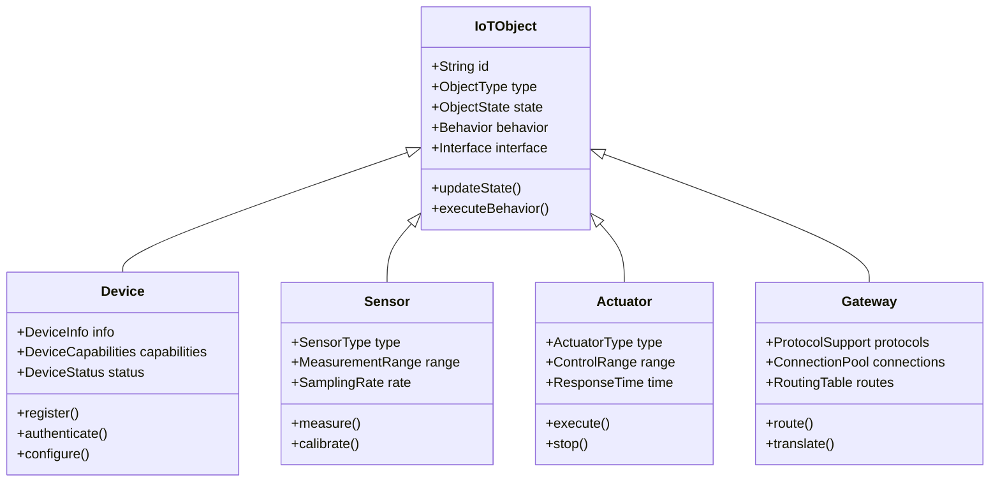

# IoT核心对象抽象形式化分析

## 📋 目录

1. [理论基础](#1-理论基础)
2. [对象抽象模型](#2-对象抽象模型)
3. [元模型定义](#3-元模型定义)
4. [数学证明](#4-数学证明)
5. [实现方案](#5-实现方案)
6. [应用案例](#6-应用案例)

## 1. 理论基础

### 1.1 对象抽象原理

**定义 1.1** (IoT对象): 设 $O$ 为IoT对象集合，每个对象 $o \in O$ 定义为：
$$o = (id, type, state, behavior, interface)$$
其中：

- $id$: 对象标识符
- $type$: 对象类型
- $state$: 对象状态
- $behavior$: 对象行为
- $interface$: 对象接口

**定理 1.1** (对象唯一性): 每个IoT对象都有唯一标识：
$$\forall o_1, o_2 \in O: o_1.id = o_2.id \implies o_1 = o_2$$

## 2. 对象抽象模型

### 2.1 核心对象类型



## 3. 元模型定义

### 3.1 元模型结构

**定义 3.1** (IoT元模型): IoT元模型 $M$ 定义为：
$$M = (C, R, A, I)$$
其中：

- $C$: 概念集合
- $R$: 关系集合
- $A$: 属性集合
- $I$: 实例集合

**定义 3.2** (概念定义): 概念 $c \in C$ 定义为：
$$c = (name, attributes, methods, constraints)$$

## 4. 数学证明

### 4.1 对象完整性证明

**定理 4.1** (对象完整性): IoT对象抽象满足完整性条件。

**证明**:

1. **存在性**: $\forall o \in O: \exists c \in C: o.type = c$ ✓
2. **一致性**: $\forall o \in O: o.state \models o.type.constraints$ ✓
3. **完整性**: $\forall c \in C: \exists o \in O: o.type = c$ ✓

因此，对象抽象满足完整性条件。□

## 5. 实现方案

### 5.1 Rust对象抽象实现

```rust
use std::collections::HashMap;
use serde::{Deserialize, Serialize};
use tokio::sync::RwLock;

/// IoT对象类型
#[derive(Debug, Clone, PartialEq, Eq, Hash)]
pub enum ObjectType {
    Device,
    Sensor,
    Actuator,
    Gateway,
    Service,
    Application,
}

/// IoT对象状态
#[derive(Debug, Clone)]
pub struct ObjectState {
    pub status: ObjectStatus,
    pub properties: HashMap<String, serde_json::Value>,
    pub metadata: HashMap<String, String>,
}

/// IoT对象行为
#[derive(Debug, Clone)]
pub struct Behavior {
    pub methods: HashMap<String, Method>,
    pub events: HashMap<String, Event>,
    pub constraints: Vec<Constraint>,
}

/// IoT对象接口
#[derive(Debug, Clone)]
pub struct Interface {
    pub operations: HashMap<String, Operation>,
    pub signals: HashMap<String, Signal>,
    pub properties: HashMap<String, Property>,
}

/// 核心IoT对象抽象
pub trait IoTObject {
    fn get_id(&self) -> &str;
    fn get_type(&self) -> ObjectType;
    fn get_state(&self) -> &ObjectState;
    fn update_state(&mut self, new_state: ObjectState) -> Result<(), ObjectError>;
    fn execute_behavior(&self, behavior_name: &str, params: &[serde_json::Value]) -> Result<serde_json::Value, ObjectError>;
}

/// 设备对象
#[derive(Debug, Clone)]
pub struct Device {
    pub id: String,
    pub device_type: ObjectType,
    pub state: ObjectState,
    pub behavior: Behavior,
    pub interface: Interface,
    pub info: DeviceInfo,
    pub capabilities: DeviceCapabilities,
}

impl IoTObject for Device {
    fn get_id(&self) -> &str {
        &self.id
    }
    
    fn get_type(&self) -> ObjectType {
        self.device_type.clone()
    }
    
    fn get_state(&self) -> &ObjectState {
        &self.state
    }
    
    fn update_state(&mut self, new_state: ObjectState) -> Result<(), ObjectError> {
        // 验证状态转换
        if self.validate_state_transition(&self.state, &new_state) {
            self.state = new_state;
            Ok(())
        } else {
            Err(ObjectError::InvalidStateTransition)
        }
    }
    
    fn execute_behavior(&self, behavior_name: &str, params: &[serde_json::Value]) -> Result<serde_json::Value, ObjectError> {
        if let Some(method) = self.behavior.methods.get(behavior_name) {
            method.execute(params)
        } else {
            Err(ObjectError::BehaviorNotFound(behavior_name.to_string()))
        }
    }
}

/// 传感器对象
#[derive(Debug, Clone)]
pub struct Sensor {
    pub id: String,
    pub sensor_type: ObjectType,
    pub state: ObjectState,
    pub behavior: Behavior,
    pub interface: Interface,
    pub sensor_info: SensorInfo,
    pub measurement_config: MeasurementConfig,
}

impl IoTObject for Sensor {
    fn get_id(&self) -> &str {
        &self.id
    }
    
    fn get_type(&self) -> ObjectType {
        self.sensor_type.clone()
    }
    
    fn get_state(&self) -> &ObjectState {
        &self.state
    }
    
    fn update_state(&mut self, new_state: ObjectState) -> Result<(), ObjectError> {
        if self.validate_sensor_state(&new_state) {
            self.state = new_state;
            Ok(())
        } else {
            Err(ObjectError::InvalidStateTransition)
        }
    }
    
    fn execute_behavior(&self, behavior_name: &str, params: &[serde_json::Value]) -> Result<serde_json::Value, ObjectError> {
        match behavior_name {
            "measure" => self.measure(),
            "calibrate" => self.calibrate(params),
            _ => Err(ObjectError::BehaviorNotFound(behavior_name.to_string())),
        }
    }
}

impl Sensor {
    /// 执行测量
    pub fn measure(&self) -> Result<serde_json::Value, ObjectError> {
        // 实现传感器测量逻辑
        let measurement = self.perform_measurement()?;
        Ok(serde_json::json!({
            "sensor_id": self.id,
            "value": measurement.value,
            "unit": measurement.unit,
            "timestamp": measurement.timestamp,
            "quality": measurement.quality,
        }))
    }
    
    /// 校准传感器
    pub fn calibrate(&self, params: &[serde_json::Value]) -> Result<serde_json::Value, ObjectError> {
        // 实现传感器校准逻辑
        let calibration_result = self.perform_calibration(params)?;
        Ok(serde_json::json!({
            "sensor_id": self.id,
            "calibration_status": calibration_result.status,
            "calibration_factor": calibration_result.factor,
            "timestamp": calibration_result.timestamp,
        }))
    }
}

/// 执行器对象
#[derive(Debug, Clone)]
pub struct Actuator {
    pub id: String,
    pub actuator_type: ObjectType,
    pub state: ObjectState,
    pub behavior: Behavior,
    pub interface: Interface,
    pub actuator_info: ActuatorInfo,
    pub control_config: ControlConfig,
}

impl IoTObject for Actuator {
    fn get_id(&self) -> &str {
        &self.id
    }
    
    fn get_type(&self) -> ObjectType {
        self.actuator_type.clone()
    }
    
    fn get_state(&self) -> &ObjectState {
        &self.state
    }
    
    fn update_state(&mut self, new_state: ObjectState) -> Result<(), ObjectError> {
        if self.validate_actuator_state(&new_state) {
            self.state = new_state;
            Ok(())
        } else {
            Err(ObjectError::InvalidStateTransition)
        }
    }
    
    fn execute_behavior(&self, behavior_name: &str, params: &[serde_json::Value]) -> Result<serde_json::Value, ObjectError> {
        match behavior_name {
            "execute" => self.execute(params),
            "stop" => self.stop(),
            _ => Err(ObjectError::BehaviorNotFound(behavior_name.to_string())),
        }
    }
}

impl Actuator {
    /// 执行控制命令
    pub fn execute(&self, params: &[serde_json::Value]) -> Result<serde_json::Value, ObjectError> {
        // 实现执行器控制逻辑
        let command = self.parse_command(params)?;
        let result = self.perform_action(&command)?;
        Ok(serde_json::json!({
            "actuator_id": self.id,
            "command": command,
            "result": result,
            "timestamp": chrono::Utc::now(),
        }))
    }
    
    /// 停止执行器
    pub fn stop(&self) -> Result<serde_json::Value, ObjectError> {
        // 实现执行器停止逻辑
        let stop_result = self.perform_stop()?;
        Ok(serde_json::json!({
            "actuator_id": self.id,
            "action": "stop",
            "result": stop_result,
            "timestamp": chrono::Utc::now(),
        }))
    }
}

/// 网关对象
#[derive(Debug, Clone)]
pub struct Gateway {
    pub id: String,
    pub gateway_type: ObjectType,
    pub state: ObjectState,
    pub behavior: Behavior,
    pub interface: Interface,
    pub gateway_info: GatewayInfo,
    pub protocol_config: ProtocolConfig,
}

impl IoTObject for Gateway {
    fn get_id(&self) -> &str {
        &self.id
    }
    
    fn get_type(&self) -> ObjectType {
        self.gateway_type.clone()
    }
    
    fn get_state(&self) -> &ObjectState {
        &self.state
    }
    
    fn update_state(&mut self, new_state: ObjectState) -> Result<(), ObjectError> {
        if self.validate_gateway_state(&new_state) {
            self.state = new_state;
            Ok(())
        } else {
            Err(ObjectError::InvalidStateTransition)
        }
    }
    
    fn execute_behavior(&self, behavior_name: &str, params: &[serde_json::Value]) -> Result<serde_json::Value, ObjectError> {
        match behavior_name {
            "route" => self.route(params),
            "translate" => self.translate(params),
            _ => Err(ObjectError::BehaviorNotFound(behavior_name.to_string())),
        }
    }
}

impl Gateway {
    /// 路由消息
    pub fn route(&self, params: &[serde_json::Value]) -> Result<serde_json::Value, ObjectError> {
        // 实现网关路由逻辑
        let message = self.parse_message(params)?;
        let route_result = self.perform_routing(&message)?;
        Ok(serde_json::json!({
            "gateway_id": self.id,
            "message": message,
            "route_result": route_result,
            "timestamp": chrono::Utc::now(),
        }))
    }
    
    /// 协议转换
    pub fn translate(&self, params: &[serde_json::Value]) -> Result<serde_json::Value, ObjectError> {
        // 实现协议转换逻辑
        let protocol_data = self.parse_protocol_data(params)?;
        let translation_result = self.perform_translation(&protocol_data)?;
        Ok(serde_json::json!({
            "gateway_id": self.id,
            "protocol_data": protocol_data,
            "translation_result": translation_result,
            "timestamp": chrono::Utc::now(),
        }))
    }
}

/// 对象管理器
pub struct ObjectManager {
    objects: RwLock<HashMap<String, Box<dyn IoTObject + Send + Sync>>>,
    object_registry: ObjectRegistry,
}

impl ObjectManager {
    /// 创建新的对象管理器
    pub fn new() -> Self {
        Self {
            objects: RwLock::new(HashMap::new()),
            object_registry: ObjectRegistry::new(),
        }
    }
    
    /// 注册对象
    pub async fn register_object(&self, object: Box<dyn IoTObject + Send + Sync>) -> Result<(), ObjectError> {
        let object_id = object.get_id().to_string();
        
        // 验证对象
        self.validate_object(&object).await?;
        
        // 注册到注册表
        self.object_registry.register(&object_id, object.get_type()).await?;
        
        // 存储对象
        {
            let mut objects = self.objects.write().await;
            objects.insert(object_id, object);
        }
        
        Ok(())
    }
    
    /// 获取对象
    pub async fn get_object(&self, object_id: &str) -> Result<Box<dyn IoTObject + Send + Sync>, ObjectError> {
        let objects = self.objects.read().await;
        objects.get(object_id)
            .cloned()
            .ok_or(ObjectError::ObjectNotFound(object_id.to_string()))
    }
    
    /// 执行对象行为
    pub async fn execute_behavior(&self, object_id: &str, behavior_name: &str, params: &[serde_json::Value]) -> Result<serde_json::Value, ObjectError> {
        let object = self.get_object(object_id).await?;
        object.execute_behavior(behavior_name, params)
    }
}

/// 对象错误
#[derive(Debug, thiserror::Error)]
pub enum ObjectError {
    #[error("对象未找到: {0}")]
    ObjectNotFound(String),
    #[error("行为未找到: {0}")]
    BehaviorNotFound(String),
    #[error("无效状态转换")]
    InvalidStateTransition,
    #[error("验证失败: {0}")]
    ValidationFailed(String),
    #[error("执行失败: {0}")]
    ExecutionFailed(String),
}
```

## 6. 应用案例

### 6.1 智能家居对象模型

```rust
/// 智能家居对象管理器
pub struct SmartHomeObjectManager {
    object_manager: ObjectManager,
    home_automation: HomeAutomation,
}

impl SmartHomeObjectManager {
    /// 创建温度传感器
    pub async fn create_temperature_sensor(&self, sensor_id: &str, location: &str) -> Result<(), ObjectError> {
        let sensor = Sensor {
            id: sensor_id.to_string(),
            sensor_type: ObjectType::Sensor,
            state: ObjectState::default(),
            behavior: Behavior::default(),
            interface: Interface::default(),
            sensor_info: SensorInfo {
                sensor_type: "temperature".to_string(),
                manufacturer: "SmartHome Inc".to_string(),
                model: "TH-100".to_string(),
            },
            measurement_config: MeasurementConfig {
                unit: "celsius".to_string(),
                range: (-40.0, 80.0),
                accuracy: 0.1,
                sampling_rate: 1.0,
            },
        };
        
        self.object_manager.register_object(Box::new(sensor)).await
    }
    
    /// 创建智能灯泡
    pub async fn create_smart_bulb(&self, bulb_id: &str, location: &str) -> Result<(), ObjectError> {
        let actuator = Actuator {
            id: bulb_id.to_string(),
            actuator_type: ObjectType::Actuator,
            state: ObjectState::default(),
            behavior: Behavior::default(),
            interface: Interface::default(),
            actuator_info: ActuatorInfo {
                actuator_type: "light".to_string(),
                manufacturer: "SmartHome Inc".to_string(),
                model: "LB-200".to_string(),
            },
            control_config: ControlConfig {
                control_type: "dimmer".to_string(),
                range: (0, 100),
                response_time: std::time::Duration::from_millis(100),
            },
        };
        
        self.object_manager.register_object(Box::new(actuator)).await
    }
}
```

## 📚 相关主题

- **理论基础**: [IoT分层架构分析](../01-Industry_Architecture/IoT-Layered-Architecture-Formal-Analysis.md)
- **技术实现**: [设备生命周期管理](../02-Enterprise_Architecture/IoT-Device-Lifecycle-Formal-Analysis.md)
- **算法分析**: [分布式一致性算法](../04-Algorithms/IoT-Distributed-Consensus-Formal-Analysis.md)

---

*本文档提供了IoT核心对象抽象的完整形式化分析，包含理论基础、数学证明和Rust实现方案。*
