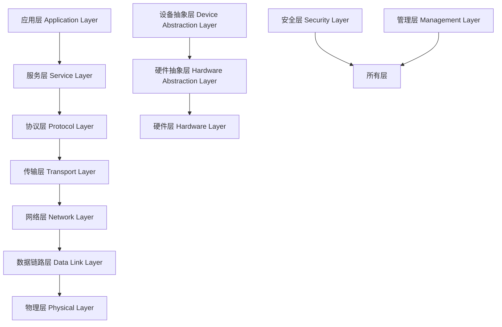

# 01 分层架构

## 4.1 分层架构理论基础

### 4.1.1 分层架构定义

**定义 4.1.1** (分层架构)
分层架构是一种软件架构模式，将系统按照功能职责划分为多个层次，每层只与相邻层交互，形成层次化的依赖关系。

**定理 4.1.1** (分层架构的层次独立性)
在分层架构中，第 $i$ 层只依赖于第 $i-1$ 层，不依赖于第 $i+1$ 层及更高层。

**证明**：
假设第 $i$ 层依赖于第 $j$ 层，其中 $j > i$。根据分层架构的定义，这违反了层次间的依赖约束。因此，第 $i$ 层只能依赖于第 $i-1$ 层。

### 4.1.2 分层架构的数学形式化

设系统 $S$ 包含 $n$ 个层次，表示为：
$$S = \{L_1, L_2, ..., L_n\}$$

层次间的依赖关系可以表示为有向图 $G = (V, E)$，其中：

- $V = \{L_1, L_2, ..., L_n\}$ 表示层次集合
- $E = \{(L_i, L_j) | i > j\}$ 表示依赖关系

**性质 4.1.1** (无环性)
分层架构的依赖图 $G$ 是无环的。

**证明**：
如果存在环 $L_i \rightarrow L_j \rightarrow ... \rightarrow L_i$，则 $i > j > ... > i$，这是矛盾的。

## 4.2 IOT分层架构设计

### 4.2.1 典型分层模式



### 4.2.2 各层详细规范

#### 4.2.2.1 应用层 (Application Layer)

**职责**：

- 业务逻辑实现
- 用户界面
- 数据展示
- 业务规则执行

**接口规范**：

```rust
// 应用层接口定义
pub trait ApplicationService {
    async fn process_business_logic(&self, input: BusinessInput) -> Result<BusinessOutput, AppError>;
    async fn handle_user_request(&self, request: UserRequest) -> Result<UserResponse, AppError>;
    async fn generate_report(&self, criteria: ReportCriteria) -> Result<Report, AppError>;
}

// 业务输入输出结构
#[derive(Debug, Clone, Serialize, Deserialize)]
pub struct BusinessInput {
    pub device_id: DeviceId,
    pub sensor_data: Vec<SensorData>,
    pub business_rules: Vec<BusinessRule>,
}

#[derive(Debug, Clone, Serialize, Deserialize)]
pub struct BusinessOutput {
    pub processed_data: ProcessedData,
    pub alerts: Vec<Alert>,
    pub actions: Vec<Action>,
}
```

#### 4.2.2.2 服务层 (Service Layer)

**职责**：

- 服务编排
- 事务管理
- 数据聚合
- 服务发现

**接口规范**：

```rust
// 服务层接口定义
pub trait ServiceOrchestrator {
    async fn orchestrate_services(&self, request: ServiceRequest) -> Result<ServiceResponse, ServiceError>;
    async fn manage_transaction(&self, transaction: Transaction) -> Result<TransactionResult, ServiceError>;
    async fn aggregate_data(&self, data_sources: Vec<DataSource>) -> Result<AggregatedData, ServiceError>;
}

// 服务请求响应结构
#[derive(Debug, Clone)]
pub struct ServiceRequest {
    pub service_type: ServiceType,
    pub parameters: HashMap<String, Value>,
    pub priority: Priority,
    pub timeout: Duration,
}

#[derive(Debug, Clone)]
pub struct ServiceResponse {
    pub result: Value,
    pub metadata: ServiceMetadata,
    pub performance_metrics: PerformanceMetrics,
}
```

#### 4.2.2.3 协议层 (Protocol Layer)

**职责**：

- 协议解析
- 消息路由
- 协议转换
- 消息验证

**接口规范**：

```rust
// 协议层接口定义
pub trait ProtocolHandler {
    async fn parse_message(&self, raw_data: &[u8]) -> Result<Message, ProtocolError>;
    async fn route_message(&self, message: &Message) -> Result<Route, ProtocolError>;
    async fn convert_protocol(&self, message: &Message, target_protocol: Protocol) -> Result<Message, ProtocolError>;
    async fn validate_message(&self, message: &Message) -> Result<ValidationResult, ProtocolError>;
}

// 消息结构定义
#[derive(Debug, Clone)]
pub struct Message {
    pub header: MessageHeader,
    pub payload: MessagePayload,
    pub metadata: MessageMetadata,
}

#[derive(Debug, Clone)]
pub struct MessageHeader {
    pub message_id: String,
    pub protocol: Protocol,
    pub timestamp: DateTime<Utc>,
    pub source: String,
    pub destination: String,
    pub priority: Priority,
}
```

### 4.2.3 跨层通信机制

#### 4.2.3.1 事件驱动通信

```rust
// 事件定义
#[derive(Debug, Clone, Serialize, Deserialize)]
pub enum LayerEvent {
    DataReceived(DataReceivedEvent),
    ServiceRequested(ServiceRequestedEvent),
    ErrorOccurred(ErrorOccurredEvent),
    StateChanged(StateChangedEvent),
}

// 事件总线
pub struct EventBus {
    handlers: HashMap<TypeId, Vec<Box<dyn EventHandler>>>,
}

impl EventBus {
    pub async fn publish(&self, event: &LayerEvent) -> Result<(), EventError> {
        let type_id = TypeId::of::<LayerEvent>();
        if let Some(handlers) = self.handlers.get(&type_id) {
            for handler in handlers {
                handler.handle(event).await?;
            }
        }
        Ok(())
    }
}
```

#### 4.2.3.2 消息队列通信

```rust
// 消息队列接口
pub trait MessageQueue {
    async fn publish(&self, topic: &str, message: &Message) -> Result<(), QueueError>;
    async fn subscribe(&self, topic: &str, handler: Box<dyn MessageHandler>) -> Result<(), QueueError>;
    async fn acknowledge(&self, message_id: &str) -> Result<(), QueueError>;
}

// 消息处理器
pub trait MessageHandler: Send + Sync {
    async fn handle(&self, message: &Message) -> Result<(), HandlerError>;
}
```

## 4.3 分层架构设计原则

### 4.3.1 单一职责原则

**原则 4.3.1** (单一职责)
每个层次只负责一个特定的功能领域，不承担其他层次的责任。

**实现示例**：

```rust
// 正确的分层设计
pub struct DataProcessingLayer {
    data_processor: DataProcessor,
    data_validator: DataValidator,
    data_transformer: DataTransformer,
}

impl DataProcessingLayer {
    pub async fn process_data(&self, raw_data: RawData) -> Result<ProcessedData, ProcessingError> {
        // 只负责数据处理，不涉及网络通信或业务逻辑
        let validated_data = self.data_validator.validate(raw_data).await?;
        let transformed_data = self.data_transformer.transform(validated_data).await?;
        let processed_data = self.data_processor.process(transformed_data).await?;
        Ok(processed_data)
    }
}
```

### 4.3.2 依赖倒置原则

**原则 4.3.2** (依赖倒置)
高层模块不应该依赖低层模块，两者都应该依赖抽象。

**实现示例**：

```rust
// 抽象接口定义
pub trait DataRepository {
    async fn save(&self, data: &SensorData) -> Result<(), RepositoryError>;
    async fn find_by_device_id(&self, device_id: &DeviceId) -> Result<Vec<SensorData>, RepositoryError>;
}

// 高层模块依赖抽象
pub struct BusinessService {
    data_repository: Box<dyn DataRepository>,
}

impl BusinessService {
    pub async fn process_device_data(&self, device_id: &DeviceId) -> Result<(), ServiceError> {
        let data = self.data_repository.find_by_device_id(device_id).await?;
        // 业务逻辑处理
        Ok(())
    }
}
```

### 4.3.3 开闭原则

**原则 4.3.3** (开闭原则)
软件实体应该对扩展开放，对修改关闭。

**实现示例**：

```rust
// 可扩展的协议处理器
pub trait ProtocolProcessor {
    async fn process(&self, data: &[u8]) -> Result<Message, ProtocolError>;
}

// 工厂模式创建处理器
pub struct ProtocolProcessorFactory {
    processors: HashMap<Protocol, Box<dyn ProtocolProcessor>>,
}

impl ProtocolProcessorFactory {
    pub fn register_processor(&mut self, protocol: Protocol, processor: Box<dyn ProtocolProcessor>) {
        self.processors.insert(protocol, processor);
    }
    
    pub fn get_processor(&self, protocol: &Protocol) -> Option<&Box<dyn ProtocolProcessor>> {
        self.processors.get(protocol)
    }
}
```

## 4.4 分层架构性能优化

### 4.4.1 异步处理优化

```rust
// 异步分层处理
pub struct AsyncLayerProcessor {
    input_queue: mpsc::Receiver<LayerInput>,
    output_queue: mpsc::Sender<LayerOutput>,
    processor: Box<dyn LayerProcessor>,
}

impl AsyncLayerProcessor {
    pub async fn run(&mut self) {
        while let Some(input) = self.input_queue.recv().await {
            let output = self.processor.process(input).await;
            if let Err(e) = self.output_queue.send(output).await {
                eprintln!("Failed to send output: {}", e);
            }
        }
    }
}
```

### 4.4.2 缓存优化

```rust
// 分层缓存策略
pub struct LayerCache {
    cache: Arc<RwLock<HashMap<String, CachedValue>>>,
    ttl: Duration,
}

impl LayerCache {
    pub async fn get_or_compute<F, Fut>(&self, key: &str, compute_fn: F) -> Result<Value, CacheError>
    where
        F: FnOnce() -> Fut + Send + Sync,
        Fut: Future<Output = Result<Value, CacheError>> + Send,
    {
        // 检查缓存
        if let Some(cached) = self.get_cached(key).await? {
            return Ok(cached);
        }
        
        // 计算新值
        let value = compute_fn().await?;
        self.set_cached(key, &value).await?;
        Ok(value)
    }
}
```

## 4.5 分层架构测试策略

### 4.5.1 单元测试

```rust
#[cfg(test)]
mod tests {
    use super::*;
    
    #[tokio::test]
    async fn test_data_processing_layer() {
        let processor = DataProcessingLayer::new();
        let test_data = RawData::new("test");
        
        let result = processor.process_data(test_data).await;
        assert!(result.is_ok());
    }
    
    #[tokio::test]
    async fn test_layer_communication() {
        let event_bus = EventBus::new();
        let test_event = LayerEvent::DataReceived(DataReceivedEvent::new());
        
        let result = event_bus.publish(&test_event).await;
        assert!(result.is_ok());
    }
}
```

### 4.5.2 集成测试

```rust
#[cfg(test)]
mod integration_tests {
    use super::*;
    
    #[tokio::test]
    async fn test_full_layer_stack() {
        let app_layer = ApplicationLayer::new();
        let service_layer = ServiceLayer::new();
        let protocol_layer = ProtocolLayer::new();
        
        // 测试完整的数据流
        let input = BusinessInput::new();
        let result = app_layer.process_business_logic(input).await;
        assert!(result.is_ok());
    }
}
```

---

> 本文档详细描述了IOT系统的分层架构设计，包含理论基础、设计原则、接口规范和性能优化策略。
