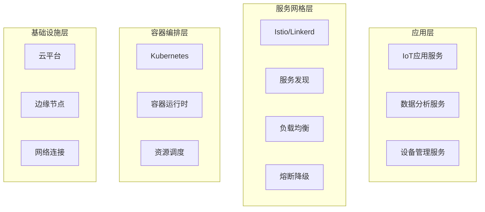

# IoT云原生技术栈深度分析

## 1. 云原生IoT概述

### 1.1 云原生IoT定义

云原生IoT是指将云原生技术理念和方法应用于物联网系统，实现IoT应用的容器化、微服务化、自动化和可观测性。

**核心特征**:
- **容器化部署**: 使用容器技术实现IoT应用的标准化部署
- **微服务架构**: 将IoT系统拆分为独立的微服务
- **服务网格**: 实现服务间的智能路由和治理
- **云边协同**: 实现云端和边缘计算的无缝协同
- **自动化运维**: 实现IoT系统的自动化部署和运维

### 1.2 技术栈架构



## 2. Kubernetes IoT扩展分析

### 2.1 Kubernetes IoT适配器

#### 2.1.1 设备连接适配器

```rust
#[derive(Debug, Clone)]
pub struct KubernetesIoTAdapter {
    pub device_connector: DeviceConnector,
    pub service_mesh: ServiceMesh,
    pub resource_manager: ResourceManager,
}

impl KubernetesIoTAdapter {
    pub async fn register_device(&self, device: IoTDevice) -> Result<(), DeviceError> {
        // 1. 创建设备Pod
        let device_pod = self.create_device_pod(&device).await?;
        
        // 2. 配置服务发现
        self.configure_service_discovery(&device).await?;
        
        // 3. 设置资源限制
        self.set_resource_limits(&device_pod).await?;
        
        // 4. 启动设备监控
        self.start_device_monitoring(&device).await?;
        
        Ok(())
    }
    
    async fn create_device_pod(&self, device: &IoTDevice) -> Result<Pod, K8sError> {
        let pod_spec = PodSpec {
            containers: vec![Container {
                name: format!("device-{}", device.id),
                image: device.container_image.clone(),
                resources: Some(ResourceRequirements {
                    requests: Some(device.resource_requests.clone()),
                    limits: Some(device.resource_limits.clone()),
                }),
                env: device.environment_variables.clone(),
                ports: device.exposed_ports.clone(),
                ..Default::default()
            }],
            ..Default::default()
        };
        
        let pod = Pod {
            metadata: ObjectMeta {
                name: Some(format!("device-{}", device.id)),
                labels: Some(device.labels.clone()),
                ..Default::default()
            },
            spec: Some(pod_spec),
            ..Default::default()
        };
        
        self.k8s_client.create_pod(&pod).await
    }
}
```

#### 2.1.2 设备生命周期管理

```rust
pub struct DeviceLifecycleManager {
    pub k8s_client: K8sClient,
    pub device_registry: DeviceRegistry,
    pub health_checker: HealthChecker,
}

impl DeviceLifecycleManager {
    pub async fn manage_device_lifecycle(&self, device_id: &str) -> Result<(), LifecycleError> {
        // 1. 设备注册
        self.register_device(device_id).await?;
        
        // 2. 健康检查
        self.start_health_checking(device_id).await?;
        
        // 3. 自动扩缩容
        self.setup_auto_scaling(device_id).await?;
        
        // 4. 故障恢复
        self.setup_failure_recovery(device_id).await?;
        
        Ok(())
    }
    
    async fn setup_auto_scaling(&self, device_id: &str) -> Result<(), ScalingError> {
        let hpa = HorizontalPodAutoscaler {
            metadata: ObjectMeta {
                name: Some(format!("hpa-{}", device_id)),
                ..Default::default()
            },
            spec: Some(HorizontalPodAutoscalerSpec {
                scale_target_ref: CrossVersionObjectReference {
                    kind: "Deployment".to_string(),
                    name: format!("device-{}", device_id),
                    api_version: "apps/v1".to_string(),
                },
                min_replicas: Some(1),
                max_replicas: 10,
                target_cpu_utilization_percentage: Some(70),
                ..Default::default()
            }),
            ..Default::default()
        };
        
        self.k8s_client.create_hpa(&hpa).await
    }
}
```

### 2.2 Kubernetes IoT Operator

#### 2.2.1 自定义资源定义

```rust
#[derive(Debug, Clone, Serialize, Deserialize)]
pub struct IoTDevice {
    pub metadata: ObjectMeta,
    pub spec: IoTDeviceSpec,
    pub status: Option<IoTDeviceStatus>,
}

#[derive(Debug, Clone, Serialize, Deserialize)]
pub struct IoTDeviceSpec {
    pub device_type: String,
    pub protocol: String,
    pub connection_config: ConnectionConfig,
    pub data_processing: DataProcessingConfig,
    pub security: SecurityConfig,
}

#[derive(Debug, Clone, Serialize, Deserialize)]
pub struct IoTDeviceStatus {
    pub phase: DevicePhase,
    pub conditions: Vec<DeviceCondition>,
    pub last_heartbeat: Option<DateTime<Utc>>,
    pub resource_usage: Option<ResourceUsage>,
}

#[derive(Debug, Clone, Serialize, Deserialize)]
pub enum DevicePhase {
    Pending,
    Running,
    Failed,
    Terminated,
}
```

#### 2.2.2 Operator控制器

```rust
pub struct IoTDeviceController {
    pub k8s_client: K8sClient,
    pub device_reconciler: DeviceReconciler,
    pub event_recorder: EventRecorder,
}

impl IoTDeviceController {
    pub async fn reconcile(&self, device: &IoTDevice) -> Result<ReconcileResult, ReconcileError> {
        match device.status.as_ref().map(|s| &s.phase) {
            Some(DevicePhase::Pending) => {
                self.handle_pending_device(device).await
            }
            Some(DevicePhase::Running) => {
                self.handle_running_device(device).await
            }
            Some(DevicePhase::Failed) => {
                self.handle_failed_device(device).await
            }
            _ => {
                self.handle_new_device(device).await
            }
        }
    }
    
    async fn handle_new_device(&self, device: &IoTDevice) -> Result<ReconcileResult, ReconcileError> {
        // 1. 验证设备配置
        self.validate_device_config(device).await?;
        
        // 2. 创建Kubernetes资源
        self.create_k8s_resources(device).await?;
        
        // 3. 更新设备状态
        self.update_device_status(device, DevicePhase::Pending).await?;
        
        Ok(ReconcileResult::RequeueAfter(Duration::from_secs(30)))
    }
    
    async fn handle_pending_device(&self, device: &IoTDevice) -> Result<ReconcileResult, ReconcileError> {
        // 检查设备是否准备就绪
        if self.is_device_ready(device).await? {
            self.update_device_status(device, DevicePhase::Running).await?;
            Ok(ReconcileResult::RequeueAfter(Duration::from_secs(60)))
        } else {
            Ok(ReconcileResult::RequeueAfter(Duration::from_secs(10)))
        }
    }
}
```

## 3. 服务网格在IoT中的应用

### 3.1 Istio IoT适配

#### 3.1.1 设备服务网格配置

```yaml
# device-mesh-config.yaml
apiVersion: networking.istio.io/v1beta1
kind: VirtualService
metadata:
  name: iot-device-service
spec:
  hosts:
  - "iot-device-service.default.svc.cluster.local"
  gateways:
  - iot-gateway
  http:
  - route:
    - destination:
        host: iot-device-service
        subset: v1
      weight: 80
    - destination:
        host: iot-device-service
        subset: v2
      weight: 20
    retries:
      attempts: 3
      perTryTimeout: 2s
    timeout: 10s
    fault:
      delay:
        percentage:
          value: 5
        fixedDelay: 2s
```

#### 3.1.2 设备间通信策略

```rust
pub struct IoTServiceMesh {
    pub istio_client: IstioClient,
    pub traffic_manager: TrafficManager,
    pub security_manager: SecurityManager,
}

impl IoTServiceMesh {
    pub async fn configure_device_communication(&self, device_config: &DeviceMeshConfig) -> Result<(), MeshError> {
        // 1. 配置服务发现
        self.configure_service_discovery(&device_config.services).await?;
        
        // 2. 设置流量管理
        self.configure_traffic_management(&device_config.traffic_rules).await?;
        
        // 3. 配置安全策略
        self.configure_security_policies(&device_config.security).await?;
        
        // 4. 设置可观测性
        self.configure_observability(&device_config.observability).await?;
        
        Ok(())
    }
    
    async fn configure_traffic_management(&self, traffic_rules: &[TrafficRule]) -> Result<(), TrafficError> {
        for rule in traffic_rules {
            let virtual_service = VirtualService {
                metadata: ObjectMeta {
                    name: Some(rule.service_name.clone()),
                    namespace: Some("iot".to_string()),
                    ..Default::default()
                },
                spec: Some(VirtualServiceSpec {
                    hosts: vec![rule.service_host.clone()],
                    http: Some(rule.http_routes.clone()),
                    tcp: rule.tcp_routes.clone(),
                    tls: rule.tls_routes.clone(),
                    ..Default::default()
                }),
                ..Default::default()
            };
            
            self.istio_client.create_virtual_service(&virtual_service).await?;
        }
        
        Ok(())
    }
}
```

### 3.2 设备间安全通信

#### 3.2.1 mTLS配置

```rust
pub struct IoTmTLSConfig {
    pub certificate_manager: CertificateManager,
    pub policy_enforcer: PolicyEnforcer,
}

impl IoTmTLSConfig {
    pub async fn enable_mutual_tls(&self, namespace: &str) -> Result<(), SecurityError> {
        // 1. 创建证书
        let cert = self.certificate_manager.create_certificate(namespace).await?;
        
        // 2. 配置PeerAuthentication
        let peer_auth = PeerAuthentication {
            metadata: ObjectMeta {
                name: Some("default".to_string()),
                namespace: Some(namespace.to_string()),
                ..Default::default()
            },
            spec: Some(PeerAuthenticationSpec {
                mtls: Some(PeerAuthentication_MutualTLS {
                    mode: Some(PeerAuthentication_MutualTLS_Mode::Strict as i32),
                }),
                port_level_mtls: Some(HashMap::new()),
                ..Default::default()
            }),
            ..Default::default()
        };
        
        self.istio_client.create_peer_authentication(&peer_auth).await?;
        
        // 3. 配置AuthorizationPolicy
        self.configure_authorization_policy(namespace).await?;
        
        Ok(())
    }
}
```

## 4. 云边协同架构设计

### 4.1 边缘节点管理

#### 4.1.1 边缘节点注册

```rust
pub struct EdgeNodeManager {
    pub k8s_client: K8sClient,
    pub edge_registry: EdgeRegistry,
    pub sync_manager: SyncManager,
}

impl EdgeNodeManager {
    pub async fn register_edge_node(&self, edge_node: &EdgeNode) -> Result<(), EdgeError> {
        // 1. 创建边缘节点资源
        let node = Node {
            metadata: ObjectMeta {
                name: Some(edge_node.name.clone()),
                labels: Some(edge_node.labels.clone()),
                annotations: Some(edge_node.annotations.clone()),
                ..Default::default()
            },
            spec: Some(NodeSpec {
                taints: edge_node.taints.clone(),
                ..Default::default()
            }),
            status: Some(NodeStatus {
                conditions: edge_node.conditions.clone(),
                capacity: edge_node.capacity.clone(),
                allocatable: edge_node.allocatable.clone(),
                ..Default::default()
            }),
            ..Default::default()
        };
        
        self.k8s_client.create_node(&node).await?;
        
        // 2. 配置边缘节点
        self.configure_edge_node(edge_node).await?;
        
        // 3. 启动同步服务
        self.start_sync_service(edge_node).await?;
        
        Ok(())
    }
}
```

#### 4.1.2 云边数据同步

```rust
pub struct CloudEdgeSync {
    pub sync_engine: SyncEngine,
    pub data_manager: DataManager,
    pub conflict_resolver: ConflictResolver,
}

impl CloudEdgeSync {
    pub async fn sync_data(&self, sync_config: &SyncConfig) -> Result<(), SyncError> {
        match sync_config.sync_mode {
            SyncMode::RealTime => {
                self.real_time_sync(sync_config).await
            }
            SyncMode::Batch => {
                self.batch_sync(sync_config).await
            }
            SyncMode::OnDemand => {
                self.on_demand_sync(sync_config).await
            }
        }
    }
    
    async fn real_time_sync(&self, config: &SyncConfig) -> Result<(), SyncError> {
        let mut sync_stream = self.sync_engine.create_realtime_stream(config).await?;
        
        while let Some(sync_event) = sync_stream.next().await {
            match sync_event {
                SyncEvent::DataChange(change) => {
                    self.handle_data_change(&change).await?;
                }
                SyncEvent::Conflict(conflict) => {
                    self.resolve_conflict(&conflict).await?;
                }
                SyncEvent::Error(error) => {
                    self.handle_sync_error(&error).await?;
                }
            }
        }
        
        Ok(())
    }
}
```

### 4.2 边缘计算框架

#### 4.2.1 EdgeX Foundry集成

```rust
pub struct EdgeXIntegration {
    pub edgex_client: EdgeXClient,
    pub device_manager: DeviceManager,
    pub data_processor: DataProcessor,
}

impl EdgeXIntegration {
    pub async fn integrate_with_edgex(&self, config: &EdgeXConfig) -> Result<(), EdgeXError> {
        // 1. 连接EdgeX Core Services
        self.connect_core_services(config).await?;
        
        // 2. 注册设备
        self.register_devices(&config.devices).await?;
        
        // 3. 配置数据处理管道
        self.configure_data_pipeline(&config.pipeline).await?;
        
        // 4. 启动边缘分析
        self.start_edge_analytics(&config.analytics).await?;
        
        Ok(())
    }
    
    async fn configure_data_pipeline(&self, pipeline: &DataPipeline) -> Result<(), PipelineError> {
        for stage in &pipeline.stages {
            match stage.stage_type {
                PipelineStageType::Filter => {
                    self.configure_filter_stage(stage).await?;
                }
                PipelineStageType::Transform => {
                    self.configure_transform_stage(stage).await?;
                }
                PipelineStageType::Enrich => {
                    self.configure_enrich_stage(stage).await?;
                }
                PipelineStageType::Aggregate => {
                    self.configure_aggregate_stage(stage).await?;
                }
            }
        }
        
        Ok(())
    }
}
```

## 5. 自动化运维

### 5.1 GitOps实践

#### 5.1.1 ArgoCD配置

```yaml
# argocd-iot-app.yaml
apiVersion: argoproj.io/v1alpha1
kind: Application
metadata:
  name: iot-platform
  namespace: argocd
spec:
  project: default
  source:
    repoURL: https://github.com/iot-org/iot-platform
    targetRevision: HEAD
    path: k8s/iot-platform
  destination:
    server: https://kubernetes.default.svc
    namespace: iot
  syncPolicy:
    automated:
      prune: true
      selfHeal: true
    syncOptions:
    - CreateNamespace=true
    - PrunePropagationPolicy=foreground
    - PruneLast=true
```

#### 5.1.2 自动化部署流水线

```rust
pub struct GitOpsPipeline {
    pub git_client: GitClient,
    pub argocd_client: ArgoCDClient,
    pub notification_manager: NotificationManager,
}

impl GitOpsPipeline {
    pub async fn deploy_iot_application(&self, app_config: &AppConfig) -> Result<(), DeploymentError> {
        // 1. 更新Git仓库
        self.update_git_repository(app_config).await?;
        
        // 2. 触发ArgoCD同步
        self.trigger_argocd_sync(app_config).await?;
        
        // 3. 监控部署状态
        self.monitor_deployment_status(app_config).await?;
        
        // 4. 发送通知
        self.send_deployment_notification(app_config).await?;
        
        Ok(())
    }
    
    async fn monitor_deployment_status(&self, app_config: &AppConfig) -> Result<(), MonitoringError> {
        let mut status_stream = self.argocd_client.watch_application_status(&app_config.name).await?;
        
        while let Some(status) = status_stream.next().await {
            match status.health.status.as_str() {
                "Healthy" => {
                    self.notification_manager.send_success_notification(app_config).await?;
                    break;
                }
                "Degraded" | "Missing" => {
                    self.notification_manager.send_failure_notification(app_config).await?;
                    return Err(MonitoringError::DeploymentFailed);
                }
                _ => {
                    // 继续监控
                    continue;
                }
            }
        }
        
        Ok(())
    }
}
```

### 5.2 监控和可观测性

#### 5.2.1 Prometheus IoT指标

```rust
pub struct IoTPrometheusMetrics {
    pub metrics_registry: Registry,
    pub device_metrics: DeviceMetrics,
    pub performance_metrics: PerformanceMetrics,
}

#[derive(Clone)]
pub struct DeviceMetrics {
    pub device_count: Counter,
    pub device_status: Gauge,
    pub data_ingestion_rate: Counter,
    pub processing_latency: Histogram,
}

impl IoTPrometheusMetrics {
    pub fn new() -> Self {
        let registry = Registry::new();
        
        let device_metrics = DeviceMetrics {
            device_count: Counter::new("iot_device_count", "Number of IoT devices").unwrap(),
            device_status: Gauge::new("iot_device_status", "Device status").unwrap(),
            data_ingestion_rate: Counter::new("iot_data_ingestion_total", "Total data ingested").unwrap(),
            processing_latency: Histogram::new("iot_processing_latency_seconds", "Data processing latency").unwrap(),
        };
        
        registry.register(Box::new(device_metrics.device_count.clone())).unwrap();
        registry.register(Box::new(device_metrics.device_status.clone())).unwrap();
        registry.register(Box::new(device_metrics.data_ingestion_rate.clone())).unwrap();
        registry.register(Box::new(device_metrics.processing_latency.clone())).unwrap();
        
        Self {
            metrics_registry: registry,
            device_metrics,
            performance_metrics: PerformanceMetrics::new(&registry),
        }
    }
}
```

#### 5.2.2 Grafana仪表板

```json
{
  "dashboard": {
    "title": "IoT Platform Dashboard",
    "panels": [
      {
        "title": "Device Status",
        "type": "stat",
        "targets": [
          {
            "expr": "iot_device_status",
            "legendFormat": "{{device_id}}"
          }
        ]
      },
      {
        "title": "Data Ingestion Rate",
        "type": "graph",
        "targets": [
          {
            "expr": "rate(iot_data_ingestion_total[5m])",
            "legendFormat": "Data Rate"
          }
        ]
      },
      {
        "title": "Processing Latency",
        "type": "heatmap",
        "targets": [
          {
            "expr": "rate(iot_processing_latency_seconds_bucket[5m])",
            "legendFormat": "Latency Distribution"
          }
        ]
      }
    ]
  }
}
```

## 6. 性能优化策略

### 6.1 资源优化

#### 6.1.1 容器资源管理

```rust
pub struct ContainerResourceOptimizer {
    pub resource_analyzer: ResourceAnalyzer,
    pub autoscaler: Autoscaler,
    pub resource_predictor: ResourcePredictor,
}

impl ContainerResourceOptimizer {
    pub async fn optimize_resources(&self, namespace: &str) -> Result<(), OptimizationError> {
        // 1. 分析当前资源使用情况
        let resource_usage = self.resource_analyzer.analyze_usage(namespace).await?;
        
        // 2. 预测资源需求
        let resource_prediction = self.resource_predictor.predict_demand(&resource_usage).await?;
        
        // 3. 优化资源配置
        self.optimize_resource_allocation(&resource_prediction).await?;
        
        // 4. 应用自动扩缩容策略
        self.apply_autoscaling_policies(&resource_prediction).await?;
        
        Ok(())
    }
}
```

### 6.2 网络优化

#### 6.2.1 服务网格优化

```rust
pub struct ServiceMeshOptimizer {
    pub traffic_analyzer: TrafficAnalyzer,
    pub routing_optimizer: RoutingOptimizer,
    pub load_balancer: LoadBalancer,
}

impl ServiceMeshOptimizer {
    pub async fn optimize_service_mesh(&self) -> Result<(), MeshOptimizationError> {
        // 1. 分析流量模式
        let traffic_patterns = self.traffic_analyzer.analyze_patterns().await?;
        
        // 2. 优化路由策略
        self.routing_optimizer.optimize_routes(&traffic_patterns).await?;
        
        // 3. 调整负载均衡
        self.load_balancer.optimize_distribution(&traffic_patterns).await?;
        
        // 4. 配置熔断和重试策略
        self.configure_resilience_policies(&traffic_patterns).await?;
        
        Ok(())
    }
}
```

## 7. 安全最佳实践

### 7.1 网络安全

#### 7.1.1 网络策略

```yaml
# network-policy.yaml
apiVersion: networking.k8s.io/v1
kind: NetworkPolicy
metadata:
  name: iot-network-policy
  namespace: iot
spec:
  podSelector:
    matchLabels:
      app: iot-device
  policyTypes:
  - Ingress
  - Egress
  ingress:
  - from:
    - namespaceSelector:
        matchLabels:
          name: iot-control
    ports:
    - protocol: TCP
      port: 8080
  egress:
  - to:
    - namespaceSelector:
        matchLabels:
          name: iot-data
    ports:
    - protocol: TCP
      port: 9090
```

### 7.2 密钥管理

#### 7.2.1 使用HashiCorp Vault

```rust
pub struct VaultSecretManager {
    pub vault_client: VaultClient,
    pub secret_rotator: SecretRotator,
}

impl VaultSecretManager {
    pub async fn manage_device_secrets(&self, device_id: &str) -> Result<(), SecretError> {
        // 1. 生成设备密钥
        let device_key = self.vault_client.generate_key(&format!("device-{}", device_id)).await?;
        
        // 2. 配置密钥轮换
        self.secret_rotator.configure_rotation(&device_key).await?;
        
        // 3. 分发密钥到设备
        self.distribute_secret_to_device(device_id, &device_key).await?;
        
        Ok(())
    }
}
```

## 8. 总结

云原生IoT技术栈为物联网系统提供了强大的容器化、微服务化和自动化能力。通过Kubernetes、服务网格、云边协同等技术的结合，可以实现：

1. **标准化部署**: 通过容器化实现IoT应用的标准化部署
2. **服务治理**: 通过服务网格实现IoT服务间的智能治理
3. **云边协同**: 实现云端和边缘计算的无缝协同
4. **自动化运维**: 通过GitOps实现IoT系统的自动化运维
5. **可观测性**: 提供全面的监控和可观测性能力

这些技术为构建大规模、高可靠、易维护的IoT系统提供了坚实的技术基础。

---

**文档版本**: v1.0  
**创建时间**: 2024年12月  
**状态**: 完成  
**负责人**: 云原生技术团队
