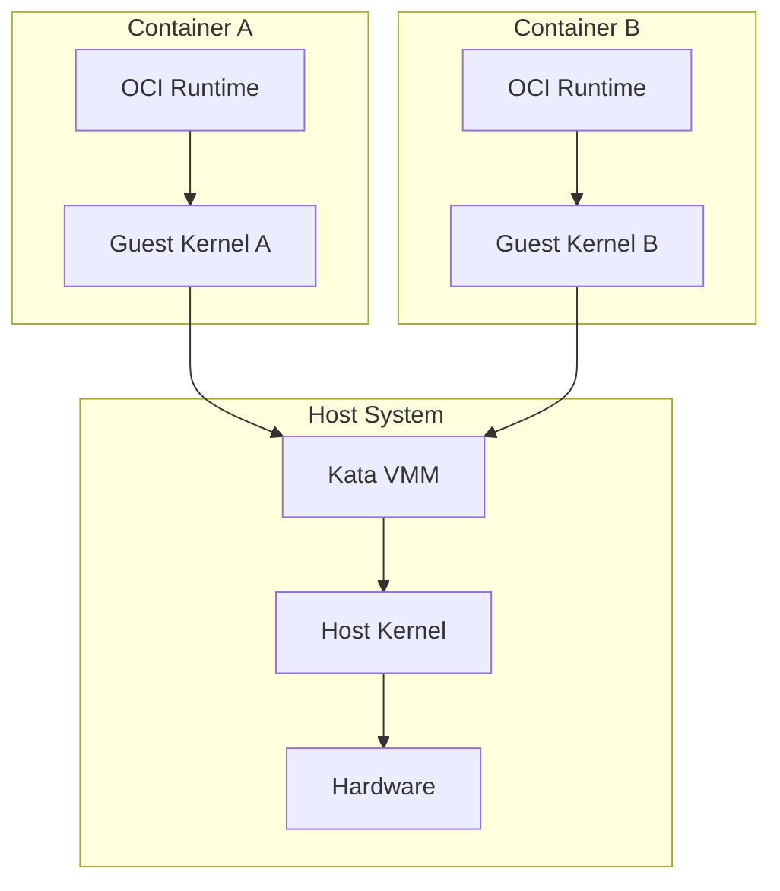
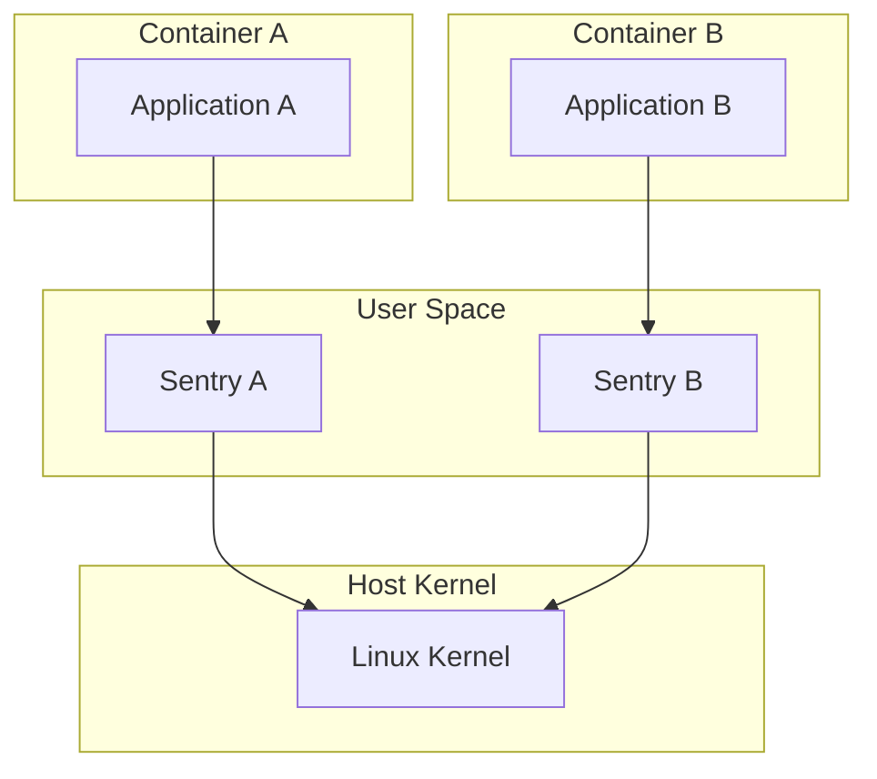

# IoT容器化技术的形式化分析与设计

## 目录

- [IoT容器化技术的形式化分析与设计](#iot容器化技术的形式化分析与设计)
  - [目录](#目录)
  - [1. 容器化技术的形式化基础](#1-容器化技术的形式化基础)
    - [1.1 容器的数学定义](#11-容器的数学定义)
    - [1.2 容器隔离的形式化模型](#12-容器隔离的形式化模型)
    - [1.3 容器编排的形式化框架](#13-容器编排的形式化框架)
  - [2. 安全容器技术的形式化分析](#2-安全容器技术的形式化分析)
    - [2.1 安全容器的形式化定义](#21-安全容器的形式化定义)
    - [2.2 虚拟机级隔离容器](#22-虚拟机级隔离容器)
    - [2.3 用户空间内核容器](#23-用户空间内核容器)
    - [2.4 安全属性的形式化证明](#24-安全属性的形式化证明)
  - [3. Rootless容器的形式化模型](#3-rootless容器的形式化模型)
    - [3.1 Rootless容器的数学定义](#31-rootless容器的数学定义)
    - [3.2 用户命名空间的形式化](#32-用户命名空间的形式化)
    - [3.3 权限映射的形式化](#33-权限映射的形式化)
  - [4. Kubernetes在IoT中的形式化应用](#4-kubernetes在iot中的形式化应用)
    - [4.1 Kubernetes架构的形式化模型](#41-kubernetes架构的形式化模型)
    - [4.2 声明式API的形式化语义](#42-声明式api的形式化语义)
    - [4.3 控制循环的形式化](#43-控制循环的形式化)
  - [5. 边缘容器技术的形式化分析](#5-边缘容器技术的形式化分析)
    - [5.1 边缘容器的形式化定义](#51-边缘容器的形式化定义)
    - [5.2 轻量级运行时的形式化](#52-轻量级运行时的形式化)
    - [5.3 边缘编排的形式化模型](#53-边缘编排的形式化模型)
  - [6. WebAssembly与容器融合的形式化](#6-webassembly与容器融合的形式化)
    - [6.1 WASM容器的形式化模型](#61-wasm容器的形式化模型)
    - [6.2 混合部署的形式化](#62-混合部署的形式化)
    - [6.3 性能模型的形式化分析](#63-性能模型的形式化分析)
  - [7. 容器化IoT系统的实现示例](#7-容器化iot系统的实现示例)
    - [7.1 Rust实现的安全容器运行时](#71-rust实现的安全容器运行时)
    - [7.2 Go实现的边缘容器编排](#72-go实现的边缘容器编排)
    - [7.3 容器化IoT应用的部署](#73-容器化iot应用的部署)
  - [8. 形式化验证与证明](#8-形式化验证与证明)
    - [8.1 容器安全的形式化验证](#81-容器安全的形式化验证)
    - [8.2 编排正确性的形式化证明](#82-编排正确性的形式化证明)
    - [8.3 性能保证的形式化分析](#83-性能保证的形式化分析)
  - [总结](#总结)

## 1. 容器化技术的形式化基础

### 1.1 容器的数学定义

容器技术可以形式化为一个隔离的执行环境，具有明确的资源边界和安全属性。

**容器的形式化定义**：

容器 $C$ 是一个七元组：

$$C = (I, R, N, S, P, E, T)$$

其中：

- $I$ 是容器镜像集合
- $R$ 是资源约束集合
- $N$ 是网络配置集合
- $S$ 是存储配置集合
- $P$ 是进程集合
- $E$ 是环境变量集合
- $T$ 是时间约束集合

**容器状态的形式化**：

容器状态 $S_C$ 定义为：

$$S_C = (pid, resources, network, storage, env, time)$$

其中 $pid$ 是进程标识符，$resources$ 是当前资源使用情况，$network$ 是网络状态，$storage$ 是存储状态，$env$ 是环境状态，$time$ 是时间戳。

**容器生命周期**：

容器的生命周期可以形式化为状态转换系统：

$$(S_0, \Sigma, \delta, F)$$

其中：

- $S_0$ 是初始状态（镜像加载）
- $\Sigma$ 是操作集合 $\{create, start, stop, destroy\}$
- $\delta: S \times \Sigma \rightarrow S$ 是状态转换函数
- $F$ 是终止状态集合

### 1.2 容器隔离的形式化模型

容器隔离是容器技术的核心特性，可以通过形式化方法进行建模和验证。

**隔离的形式化定义**：

对于容器 $C_1$ 和 $C_2$，隔离关系定义为：

$$isolated(C_1, C_2) \iff \forall r \in R: access(C_1, r) \cap access(C_2, r) = \emptyset$$

其中 $R$ 是资源集合，$access(C, r)$ 表示容器 $C$ 对资源 $r$ 的访问权限。

**命名空间隔离**：

Linux命名空间提供了容器隔离的基础，可以形式化为：

$$namespace(C) = (pid, net, mnt, uts, ipc, user)$$

其中每个命名空间类型提供特定资源的隔离：

- $pid$: 进程ID隔离
- $net$: 网络隔离
- $mnt$: 挂载点隔离
- $uts$: 主机名隔离
- $ipc$: 进程间通信隔离
- $user$: 用户ID隔离

**资源隔离的形式化**：

cgroups提供了资源隔离，可以形式化为：

$$cgroup(C) = \{cpu, memory, io, network, devices\}$$

对于每个资源类型 $r$，隔离约束为：

$$limit(C, r) \leq quota(C, r)$$

其中 $limit(C, r)$ 是实际使用量，$quota(C, r)$ 是配额限制。

### 1.3 容器编排的形式化框架

容器编排系统管理多个容器的生命周期和资源分配。

**编排系统的形式化定义**：

编排系统 $O$ 是一个八元组：

$$O = (C, N, S, P, R, A, M, T)$$

其中：

- $C$ 是容器集合
- $N$ 是节点集合
- $S$ 是调度策略集合
- $P$ 是策略集合
- $R$ 是资源集合
- $A$ 是API集合
- $M$ 是监控集合
- $T$ 是时间约束集合

**调度问题的形式化**：

容器调度可以形式化为优化问题：

$$\min \sum_{c \in C} \sum_{n \in N} x_{cn} \cdot cost(c, n)$$

约束条件：
$$\sum_{c \in C} x_{cn} \cdot resource(c, r) \leq capacity(n, r), \forall n \in N, r \in R$$
$$\sum_{n \in N} x_{cn} = 1, \forall c \in C$$

其中 $x_{cn}$ 是二进制变量，表示容器 $c$ 是否调度到节点 $n$。

## 2. 安全容器技术的形式化分析

### 2.1 安全容器的形式化定义

安全容器是对传统容器隔离模型的增强，提供更强的安全边界。

**安全容器的形式化定义**：

安全容器 $C_s$ 是传统容器 $C$ 的增强版本：

$$C_s = C \cup \{L_{extra}, V_{isolation}, S_{verification}\}$$

其中：

- $L_{extra}$ 是额外隔离层
- $V_{isolation}$ 是隔离验证机制
- $S_{verification}$ 是安全验证机制

**安全属性的形式化**：

安全容器必须满足以下安全属性：

1. **隔离完整性**：
   $$\forall v \in V_H, \forall a \in A_C: access(a, v) \rightarrow authorized(a, v)$$

2. **攻击面减少**：
   $$attack\_surface(C_s) < attack\_surface(C)$$

3. **权限最小化**：
   $$privileges(C_s) \subseteq privileges(C)$$

### 2.2 虚拟机级隔离容器

虚拟机级隔离容器结合了传统虚拟机的安全隔离优势与容器的轻量级特性。

**虚拟机级容器的形式化模型**：

虚拟机级容器 $C_v$ 定义为：

$$C_v = (C, VM, Hypervisor, Kernel)$$

其中：

- $VM$ 是轻量级虚拟机
- $Hypervisor$ 是虚拟机监控器
- $Kernel$ 是独立内核

**隔离度量的形式化**：

对于资源访问集合 $R$，传统容器 $C_t$ 和虚拟机级容器 $C_v$ 的隔离度量为：

$$I(C_t) = \{r \in R | isolation(C_t, r) = namespaces \lor cgroups\}$$
$$I(C_v) = \{r \in R | isolation(C_v, r) = hardware \lor hypervisor\}$$

由于硬件级和hypervisor级隔离提供更强的安全边界：

$$security\_boundary(I(C_v)) > security\_boundary(I(C_t))$$

**Kata Containers架构**：



### 2.3 用户空间内核容器

用户空间内核容器通过在用户空间实现内核功能，拦截和处理容器系统调用。

**用户空间内核的形式化模型**：

用户空间内核容器 $C_u$ 定义为：

$$C_u = (C, Sentry, Policy, Interceptor)$$

其中：

- $Sentry$ 是用户空间内核
- $Policy$ 是安全策略
- $Interceptor$ 是系统调用拦截器

**系统调用拦截的形式化**：

对于系统调用集合 $S$，传统容器 $C_t$ 和用户空间内核容器 $C_u$ 暴露给宿主机内核的系统调用集合为：

$$S_{exposed}(C_t) = S$$
$$S_{exposed}(C_u) = \{s \in S | policy(s) = forward\}$$

安全增益可表示为减少的攻击面：

$$security\_gain(C_u) = |S| - |S_{exposed}(C_u)|$$

**gVisor架构模型**：



### 2.4 安全属性的形式化证明

安全容器技术的安全性可以通过形式化方法进行建模和验证。

**威胁模型的形式化**：

定义资源集合 $R = \{r_1, r_2, ..., r_n\}$，威胁向量 $T = \{t_1, t_2, ..., t_m\}$，和安全控制集合 $C = \{c_1, c_2, ..., c_k\}$。

对于每个威胁 $t_i$，传统容器和安全容器的风险暴露度：

$$risk(t_i, traditional) = probability(t_i) \times impact(t_i, traditional)$$
$$risk(t_i, secure) = probability(t_i) \times impact(t_i, secure)$$

由于安全容器增强了隔离性：

$$impact(t_i, secure) < impact(t_i, traditional)$$

**容器逃逸的形式化证明**：

对于容器逃逸威胁 $t_{escape}$，安全容器通过添加额外隔离层 $L_{extra}$，使得攻击路径 $P_{attack}$ 必须突破额外障碍：

$$P_{attack}(traditional) = \{vulnerabilities(namespace) \lor vulnerabilities(capability)\}$$
$$P_{attack}(secure) = P_{attack}(traditional) \land vulnerabilities(L_{extra})$$

因此，成功攻击的概率降低：

$$Pr[success(P_{attack}(secure))] < Pr[success(P_{attack}(traditional))]$$

## 3. Rootless容器的形式化模型

### 3.1 Rootless容器的数学定义

Rootless容器是指能够由非特权用户创建和管理的容器，消除了对root权限的依赖。

**Rootless容器的形式化定义**：

Rootless容器是一种容器执行环境 $C_r$，由用户 $u$ 启动和管理，满足：

$$privileges(u) = privileges(regular\_user) \land functionality(C_r) \approx functionality(C_{root})$$

其中 $privileges(u)$ 表示用户 $u$ 的权限集合，$functionality(C)$ 表示容器 $C$ 的功能集合。

**权限映射的形式化**：

Rootless容器通过用户命名空间实现权限映射：

$$map(id_{container}) = (id_{container} - lower_{container}) + lower_{host}$$

其中 $lower_{container}$ 和 $lower_{host}$ 分别是容器和主机上的映射范围下限。

### 3.2 用户命名空间的形式化

用户命名空间是Rootless容器的核心技术，提供身份映射和权限分离。

**用户命名空间的形式化定义**：

用户命名空间 $NS_{user}$ 定义为：

$$NS_{user} = (UID_{map}, GID_{map}, Capabilities, Boundaries)$$

其中：

- $UID_{map}$ 是用户ID映射函数
- $GID_{map}$ 是组ID映射函数
- $Capabilities$ 是命名空间内的能力集合
- $Boundaries$ 是权限边界

**权限边界的形式化**：

命名空间内的能力仅适用于命名空间资源：

$$cap(u, r) = (r \in NS(u) \land capability\_in\_ns(u, cap))$$

命名空间层次结构满足：

$$privileges(NS_{child}) \subseteq privileges(NS_{parent})$$

### 3.3 权限映射的形式化

Rootless容器面临多项技术挑战，每项挑战都需要特定解决方案。

**技术挑战的形式化模型**：

对于需要特权 $p$ 的操作集合 $O_p = \{o_1, o_2, ..., o_n\}$，Rootless容器必须提供等效函数 $e_{o_i}$，使得：

$$\forall o_i \in O_p, \exists e_{o_i}: functionality(e_{o_i}) \approx functionality(o_i) \land privileges(e_{o_i}) \subset privileges(regular\_user)$$

**cgroup访问的形式化**：

cgroup v2委托机制允许非特权访问：

$$delegate(cgroup, user) = (user \in authorized\_users(cgroup) \land cgroup \in delegatable\_cgroups)$$

**网络命名空间的形式化**：

通过slirp4netns提供用户空间网络栈：

$$network\_stack(user) = slirp4netns(user\_namespace(user))$$

## 4. Kubernetes在IoT中的形式化应用

### 4.1 Kubernetes架构的形式化模型

Kubernetes是一个容器编排平台，可以形式化为分布式状态管理系统。

**Kubernetes的形式化定义**：

Kubernetes集群 $K$ 定义为：

$$K = (CP, WN, API, ETCD, Scheduler, Controller)$$

其中：

- $CP$ 是控制平面组件集合
- $WN$ 是工作节点集合
- $API$ 是API服务器
- $ETCD$ 是分布式存储
- $Scheduler$ 是调度器
- $Controller$ 是控制器集合

**控制平面的形式化**：

控制平面 $CP$ 定义为：

$$CP = \{API\_Server, etcd, Scheduler, Controller\_Manager\}$$

每个组件都有特定的职责：

- $API\_Server$: 提供RESTful API接口
- $etcd$: 存储集群状态
- $Scheduler$: 决策Pod调度
- $Controller\_Manager$: 维护期望状态

**工作节点的形式化**：

工作节点 $WN$ 定义为：

$$WN = \{Kubelet, Kube\_proxy, Container\_Runtime\}$$

其中：

- $Kubelet$: 节点代理，管理Pod生命周期
- $Kube\_proxy$: 网络代理，实现服务抽象
- $Container\_Runtime$: 容器运行时，如Docker、containerd

### 4.2 声明式API的形式化语义

Kubernetes的核心设计理念是声明式API，用户只需声明所需的最终状态。

**声明式API的形式化定义**：

声明式API可以形式化为状态转换系统：

$$API = (State, Desired, Current, Transition)$$

其中：

- $State$ 是状态空间
- $Desired$ 是期望状态
- $Current$ 是当前状态
- $Transition$ 是状态转换函数

**状态转换的形式化**：

状态转换遵循控制循环模式：

$$
transition(current, desired) = \begin{cases}
current & \text{if } current = desired \\
next(current, desired) & \text{otherwise}
\end{cases}
$$

其中 $next(current, desired)$ 计算从当前状态到期望状态的下一个状态。

**资源对象的形式化**：

Kubernetes资源对象可以形式化为：

$$Resource = (Kind, Spec, Status, Metadata)$$

其中：

- $Kind$ 是资源类型
- $Spec$ 是期望状态规范
- $Status$ 是当前状态
- $Metadata$ 是元数据

### 4.3 控制循环的形式化

Kubernetes的核心工作机制是控制循环（Control Loop），也称为"Observe-Diff-Act"循环。

**控制循环的形式化定义**：

控制循环 $CL$ 定义为：

$$CL = (Observe, Diff, Act, State)$$

其中：

- $Observe$: 观察当前状态
- $Diff$: 比较期望状态和当前状态
- $Act$: 执行必要的操作
- $State$: 维护状态

**观察阶段的形式化**：

观察函数 $Observe$ 定义为：

$$Observe(state) = \{resource \in state | resource.kind = target\_kind\}$$

**比较阶段的形式化**：

比较函数 $Diff$ 定义为：

$$Diff(desired, current) = \{op \in Operations | op(current) = desired\}$$

**执行阶段的形式化**：

执行函数 $Act$ 定义为：

$$Act(operations) = \bigcup_{op \in operations} execute(op)$$

## 5. 边缘容器技术的形式化分析

### 5.1 边缘容器的形式化定义

边缘容器是专门为边缘计算环境设计的轻量级容器技术。

**边缘容器的形式化定义**：

边缘容器 $C_e$ 定义为：

$$C_e = (C, Edge\_Constraints, Lightweight\_Runtime, Network\_Optimization)$$

其中：

- $Edge\_Constraints$ 是边缘环境约束
- $Lightweight\_Runtime$ 是轻量级运行时
- $Network\_Optimization$ 是网络优化

**边缘约束的形式化**：

边缘环境约束包括：

$$Edge\_Constraints = \{resource\_limited, network\_unstable, power\_constrained, security\_critical\}$$

每个约束都有相应的形式化表达：

- $resource\_limited$: $memory(C_e) \leq memory\_limit$
- $network\_unstable$: $bandwidth(C_e) \leq bandwidth\_limit$
- $power\_constrained$: $power(C_e) \leq power\_limit$
- $security\_critical$: $security\_level(C_e) \geq security\_threshold$

### 5.2 轻量级运行时的形式化

边缘容器需要轻量级运行时以减少资源消耗。

**轻量级运行时的形式化定义**：

轻量级运行时 $LR$ 定义为：

$$LR = (Runtime, Memory\_Footprint, Startup\_Time, Security)$$

其中：

- $Runtime$ 是运行时组件
- $Memory\_Footprint$ 是内存占用
- $Startup\_Time$ 是启动时间
- $Security$ 是安全特性

**内存占用的形式化**：

内存占用必须满足约束：

$$memory\_footprint(LR) \leq memory\_budget$$

**启动时间的形式化**：

启动时间必须满足约束：

$$startup\_time(LR) \leq startup\_budget$$

### 5.3 边缘编排的形式化模型

边缘编排需要考虑边缘环境的特殊约束。

**边缘编排的形式化定义**：

边缘编排系统 $EO$ 定义为：

$$EO = (Edge\_Nodes, Containers, Constraints, Scheduler)$$

其中：

- $Edge\_Nodes$ 是边缘节点集合
- $Containers$ 是容器集合
- $Constraints$ 是约束集合
- $Scheduler$ 是调度器

**边缘调度的形式化**：

边缘调度问题可以形式化为约束优化问题：

$$\min \sum_{c \in C} \sum_{n \in EN} x_{cn} \cdot cost(c, n)$$

约束条件：
$$\sum_{c \in C} x_{cn} \cdot resource(c, r) \leq capacity(n, r), \forall n \in EN, r \in R$$
$$\sum_{n \in EN} x_{cn} = 1, \forall c \in C$$
$$latency(c, n) \leq latency\_threshold, \forall c \in C, n \in EN$$

其中 $EN$ 是边缘节点集合，$latency(c, n)$ 是容器 $c$ 到节点 $n$ 的延迟。

## 6. WebAssembly与容器融合的形式化

### 6.1 WASM容器的形式化模型

WebAssembly与容器的融合提供了新的执行模型。

**WASM容器的形式化定义**：

WASM容器 $C_w$ 定义为：

$$C_w = (WASM\_Module, Runtime, Sandbox, Interface)$$

其中：

- $WASM\_Module$ 是WebAssembly模块
- $Runtime$ 是WASM运行时
- $Sandbox$ 是沙箱环境
- $Interface$ 是系统接口

**WASM模块的形式化**：

WASM模块 $WM$ 定义为：

$$WM = (Functions, Memory, Tables, Globals, Exports, Imports)$$

其中：

- $Functions$ 是函数集合
- $Memory$ 是线性内存
- $Tables$ 是函数表
- $Globals$ 是全局变量
- $Exports$ 是导出接口
- $Imports$ 是导入接口

**沙箱安全的形式化**：

WASM沙箱安全可以形式化为：

$$sandbox\_security(WM) = \forall f \in Functions: safe(f)$$

其中 $safe(f)$ 表示函数 $f$ 是安全的。

### 6.2 混合部署的形式化

WASM容器可以与传统容器混合部署。

**混合部署的形式化定义**：

混合部署 $HD$ 定义为：

$$HD = (Traditional\_Containers, WASM\_Containers, Orchestrator, Interface)$$

其中：

- $Traditional\_Containers$ 是传统容器集合
- $WASM\_Containers$ 是WASM容器集合
- $Orchestrator$ 是编排器
- $Interface$ 是容器间接口

**部署策略的形式化**：

部署策略 $DS$ 定义为：

$$DS = (Selection, Placement, Communication)$$

其中：

- $Selection$ 是容器类型选择策略
- $Placement$ 是放置策略
- $Communication$ 是通信策略

### 6.3 性能模型的形式化分析

WASM容器的性能可以通过形式化模型进行分析。

**性能模型的形式化定义**：

性能模型 $PM$ 定义为：

$$PM = (Execution\_Time, Memory\_Usage, Network\_Overhead, Security\_Overhead)$$

**执行时间的形式化**：

执行时间可以形式化为：

$$execution\_time(WM) = \sum_{f \in Functions} execution\_time(f)$$

**内存使用的形式化**：

内存使用可以形式化为：

$$memory\_usage(WM) = initial\_memory + dynamic\_allocation$$

## 7. 容器化IoT系统的实现示例

### 7.1 Rust实现的安全容器运行时

以下是一个用Rust实现的简化安全容器运行时示例：

```rust
use std::process::Command;
use std::path::Path;
use std::fs;
use std::io::Result;

// 安全容器配置
struct SecureContainerConfig {
    image_path: String,
    vm_memory_mb: u32,
    vm_cpus: u32,
    kernel_path: String,
    container_args: Vec<String>,
}

// 安全容器运行时
struct SecureContainerRuntime {
    hypervisor_path: String,
    config: SecureContainerConfig,
}

impl SecureContainerRuntime {
    fn new(hypervisor_path: String, config: SecureContainerConfig) -> Self {
        SecureContainerRuntime {
            hypervisor_path,
            config,
        }
    }
    
    // 启动安全容器
    fn run_container(&self) -> Result<()> {
        println!("Preparing secure container with VM isolation...");
        
        // 1. 验证镜像和内核文件存在
        if !Path::new(&self.config.image_path).exists() {
            return Err(std::io::Error::new(
                std::io::ErrorKind::NotFound,
                format!("Container image not found: {}", self.config.image_path)
            ));
        }
        
        if !Path::new(&self.config.kernel_path).exists() {
            return Err(std::io::Error::new(
                std::io::ErrorKind::NotFound,
                format!("Kernel image not found: {}", self.config.kernel_path)
            ));
        }
        
        // 2. 创建唯一的VM标识
        let vm_id = format!("secure-container-{}", uuid::Uuid::new_v4());
        let vm_socket = format!("/tmp/{}-socket", vm_id);
        
        // 3. 构建hypervisor启动命令
        let mut cmd = Command::new(&self.hypervisor_path);
        
        // 配置VM资源
        cmd.arg("--vm-id").arg(&vm_id)
           .arg("--kernel").arg(&self.config.kernel_path)
           .arg("--memory").arg(self.config.vm_memory_mb.to_string())
           .arg("--cpus").arg(self.config.vm_cpus.to_string())
           .arg("--socket").arg(&vm_socket);
        
        // 添加容器镜像
        cmd.arg("--container-image").arg(&self.config.image_path);
        
        // 添加容器参数
        if !self.config.container_args.is_empty() {
            cmd.arg("--").args(&self.config.container_args);
        }
        
        // 4. 启动安全容器VM
        println!("Starting secure container with command: {:?}", cmd);
        let mut child = cmd.spawn()?;
        
        // 5. 等待容器完成
        let status = child.wait()?;
        println!("Secure container exited with status: {}", status);
        
        // 6. 清理资源
        if Path::new(&vm_socket).exists() {
            fs::remove_file(&vm_socket)?;
        }
        
        Ok(())
    }
    
    // 停止安全容器
    fn stop_container(&self, vm_id: &str) -> Result<()> {
        let mut cmd = Command::new(&self.hypervisor_path);
        cmd.arg("--stop").arg(vm_id);
        
        let status = cmd.status()?;
        
        if status.success() {
            println!("Successfully stopped secure container: {}", vm_id);
            Ok(())
        } else {
            Err(std::io::Error::new(
                std::io::ErrorKind::Other,
                format!("Failed to stop container: {}", vm_id)
            ))
        }
    }
}

// 使用示例
fn main() -> Result<()> {
    let config = SecureContainerConfig {
        image_path: "/path/to/container.oci".to_string(),
        vm_memory_mb: 512,
        vm_cpus: 2,
        kernel_path: "/path/to/kernel".to_string(),
        container_args: vec!["--entrypoint".to_string(), "/bin/sh".to_string()],
    };
    
    let runtime = SecureContainerRuntime::new("/usr/bin/kata-runtime".to_string(), config);
    runtime.run_container()
}
```

### 7.2 Go实现的边缘容器编排

以下是一个用Go实现的边缘容器编排系统示例：

```go
package main

import (
    "context"
    "fmt"
    "log"
    "time"
    
    "k8s.io/client-go/kubernetes"
    "k8s.io/client-go/rest"
    metav1 "k8s.io/apimachinery/pkg/apis/meta/v1"
    corev1 "k8s.io/api/core/v1"
    appsv1 "k8s.io/api/apps/v1"
)

// 边缘节点信息
type EdgeNode struct {
    Name        string
    IP          string
    Resources   NodeResources
    Constraints NodeConstraints
}

// 节点资源
type NodeResources struct {
    CPU    int64
    Memory int64
    Storage int64
}

// 节点约束
type NodeConstraints struct {
    MaxLatency    time.Duration
    MinBandwidth  int64
    SecurityLevel int
}

// 边缘容器编排器
type EdgeOrchestrator struct {
    clientset *kubernetes.Clientset
    nodes     map[string]*EdgeNode
}

// 创建边缘编排器
func NewEdgeOrchestrator() (*EdgeOrchestrator, error) {
    config, err := rest.InClusterConfig()
    if err != nil {
        return nil, fmt.Errorf("failed to get cluster config: %v", err)
    }
    
    clientset, err := kubernetes.NewForConfig(config)
    if err != nil {
        return nil, fmt.Errorf("failed to create clientset: %v", err)
    }
    
    return &EdgeOrchestrator{
        clientset: clientset,
        nodes:     make(map[string]*EdgeNode),
    }, nil
}

// 注册边缘节点
func (eo *EdgeOrchestrator) RegisterNode(node *EdgeNode) {
    eo.nodes[node.Name] = node
    log.Printf("Registered edge node: %s", node.Name)
}

// 边缘调度算法
func (eo *EdgeOrchestrator) SchedulePod(pod *corev1.Pod) (*EdgeNode, error) {
    var bestNode *EdgeNode
    var bestScore float64
    
    for _, node := range eo.nodes {
        score := eo.calculateScore(pod, node)
        if score > bestScore {
            bestScore = score
            bestNode = node
        }
    }
    
    if bestNode == nil {
        return nil, fmt.Errorf("no suitable edge node found")
    }
    
    return bestNode, nil
}

// 计算调度分数
func (eo *EdgeOrchestrator) calculateScore(pod *corev1.Pod, node *EdgeNode) float64 {
    // 资源匹配分数
    resourceScore := eo.calculateResourceScore(pod, node)
    
    // 网络延迟分数
    latencyScore := eo.calculateLatencyScore(pod, node)
    
    // 安全等级分数
    securityScore := eo.calculateSecurityScore(pod, node)
    
    // 综合分数
    return resourceScore*0.4 + latencyScore*0.4 + securityScore*0.2
}

// 计算资源分数
func (eo *EdgeOrchestrator) calculateResourceScore(pod *corev1.Pod, node *EdgeNode) float64 {
    var totalCPU, totalMemory int64
    
    for _, container := range pod.Spec.Containers {
        if container.Resources.Requests != nil {
            totalCPU += container.Resources.Requests.Cpu().MilliValue()
            totalMemory += container.Resources.Requests.Memory().Value()
        }
    }
    
    cpuRatio := float64(totalCPU) / float64(node.Resources.CPU*1000)
    memoryRatio := float64(totalMemory) / float64(node.Resources.Memory)
    
    if cpuRatio > 1.0 || memoryRatio > 1.0 {
        return 0.0 // 资源不足
    }
    
    return 1.0 - (cpuRatio+memoryRatio)/2.0
}

// 计算延迟分数
func (eo *EdgeOrchestrator) calculateLatencyScore(pod *corev1.Pod, node *EdgeNode) float64 {
    // 这里应该实现实际的延迟测量
    // 简化实现：基于网络距离估算
    estimatedLatency := time.Millisecond * 10 // 假设值
    
    if estimatedLatency <= node.Constraints.MaxLatency {
        return 1.0 - float64(estimatedLatency)/float64(node.Constraints.MaxLatency)
    }
    
    return 0.0
}

// 计算安全分数
func (eo *EdgeOrchestrator) calculateSecurityScore(pod *corev1.Pod, node *EdgeNode) float64 {
    // 检查Pod的安全上下文
    if pod.Spec.SecurityContext != nil && pod.Spec.SecurityContext.RunAsNonRoot != nil {
        if *pod.Spec.SecurityContext.RunAsNonRoot {
            return 1.0
        }
    }
    
    // 检查节点安全等级
    return float64(node.Constraints.SecurityLevel) / 10.0
}

// 部署应用到边缘节点
func (eo *EdgeOrchestrator) DeployToEdge(deployment *appsv1.Deployment, targetNode string) error {
    // 1. 创建命名空间（如果不存在）
    namespace := deployment.Namespace
    _, err := eo.clientset.CoreV1().Namespaces().Create(context.TODO(), &corev1.Namespace{
        ObjectMeta: metav1.ObjectMeta{
            Name: namespace,
        },
    }, metav1.CreateOptions{})
    
    if err != nil && !isAlreadyExistsError(err) {
        return fmt.Errorf("failed to create namespace: %v", err)
    }
    
    // 2. 添加节点选择器
    if deployment.Spec.Template.Spec.NodeSelector == nil {
        deployment.Spec.Template.Spec.NodeSelector = make(map[string]string)
    }
    deployment.Spec.Template.Spec.NodeSelector["kubernetes.io/hostname"] = targetNode
    
    // 3. 创建部署
    _, err = eo.clientset.AppsV1().Deployments(namespace).Create(context.TODO(), deployment, metav1.CreateOptions{})
    if err != nil {
        return fmt.Errorf("failed to create deployment: %v", err)
    }
    
    log.Printf("Successfully deployed to edge node: %s", targetNode)
    return nil
}

// 检查错误是否为"已存在"错误
func isAlreadyExistsError(err error) bool {
    return err != nil && fmt.Sprintf("%v", err) == "already exists"
}

// 使用示例
func main() {
    orchestrator, err := NewEdgeOrchestrator()
    if err != nil {
        log.Fatalf("Failed to create orchestrator: %v", err)
    }
    
    // 注册边缘节点
    edgeNode := &EdgeNode{
        Name: "edge-node-1",
        IP:   "192.168.1.100",
        Resources: NodeResources{
            CPU:    4,
            Memory: 8 * 1024 * 1024 * 1024, // 8GB
            Storage: 100 * 1024 * 1024 * 1024, // 100GB
        },
        Constraints: NodeConstraints{
            MaxLatency:    time.Millisecond * 50,
            MinBandwidth:  100 * 1024 * 1024, // 100MB/s
            SecurityLevel: 8,
        },
    }
    
    orchestrator.RegisterNode(edgeNode)
    
    // 创建示例部署
    deployment := &appsv1.Deployment{
        ObjectMeta: metav1.ObjectMeta{
            Name:      "iot-edge-app",
            Namespace: "edge-computing",
        },
        Spec: appsv1.DeploymentSpec{
            Replicas: int32Ptr(1),
            Selector: &metav1.LabelSelector{
                MatchLabels: map[string]string{
                    "app": "iot-edge-app",
                },
            },
            Template: corev1.PodTemplateSpec{
                ObjectMeta: metav1.ObjectMeta{
                    Labels: map[string]string{
                        "app": "iot-edge-app",
                    },
                },
                Spec: corev1.PodSpec{
                    Containers: []corev1.Container{
                        {
                            Name:  "iot-app",
                            Image: "iot-edge-app:latest",
                            Resources: corev1.ResourceRequirements{
                                Requests: corev1.ResourceList{
                                    corev1.ResourceCPU:    resource.MustParse("500m"),
                                    corev1.ResourceMemory: resource.MustParse("512Mi"),
                                },
                            },
                        },
                    },
                },
            },
        },
    }
    
    // 部署到边缘节点
    err = orchestrator.DeployToEdge(deployment, "edge-node-1")
    if err != nil {
        log.Fatalf("Failed to deploy to edge: %v", err)
    }
    
    log.Println("Successfully deployed IoT application to edge node")
}

func int32Ptr(i int32) *int32 {
    return &i
}
```

### 7.3 容器化IoT应用的部署

以下是一个容器化IoT应用的完整部署示例：

```yaml
# iot-edge-deployment.yaml
apiVersion: apps/v1
kind: Deployment
metadata:
  name: iot-edge-app
  namespace: edge-computing
  labels:
    app: iot-edge-app
spec:
  replicas: 3
  selector:
    matchLabels:
      app: iot-edge-app
  template:
    metadata:
      labels:
        app: iot-edge-app
    spec:
      nodeSelector:
        node-type: edge
      securityContext:
        runAsNonRoot: true
        runAsUser: 1000
        fsGroup: 1000
      containers:
      - name: iot-app
        image: iot-edge-app:latest
        ports:
        - containerPort: 8080
        resources:
          requests:
            cpu: "500m"
            memory: "512Mi"
          limits:
            cpu: "1000m"
            memory: "1Gi"
        env:
        - name: NODE_ENV
          value: "production"
        - name: LOG_LEVEL
          value: "info"
        volumeMounts:
        - name: config-volume
          mountPath: /app/config
        - name: data-volume
          mountPath: /app/data
        livenessProbe:
          httpGet:
            path: /health
            port: 8080
          initialDelaySeconds: 30
          periodSeconds: 10
        readinessProbe:
          httpGet:
            path: /ready
            port: 8080
          initialDelaySeconds: 5
          periodSeconds: 5
      volumes:
      - name: config-volume
        configMap:
          name: iot-app-config
      - name: data-volume
        persistentVolumeClaim:
          claimName: iot-app-data
---
apiVersion: v1
kind: Service
metadata:
  name: iot-edge-service
  namespace: edge-computing
spec:
  selector:
    app: iot-edge-app
  ports:
  - protocol: TCP
    port: 80
    targetPort: 8080
  type: LoadBalancer
---
apiVersion: v1
kind: ConfigMap
metadata:
  name: iot-app-config
  namespace: edge-computing
data:
  app.conf: |
    [database]
    host = localhost
    port = 5432
    name = iot_db
    
    [mqtt]
    broker = mqtt-broker:1883
    topic = iot/devices/#
    
    [security]
    tls_enabled = true
    cert_path = /app/certs/server.crt
---
apiVersion: v1
kind: PersistentVolumeClaim
metadata:
  name: iot-app-data
  namespace: edge-computing
spec:
  accessModes:
    - ReadWriteOnce
  resources:
    requests:
      storage: 10Gi
  storageClassName: fast-ssd
```

## 8. 形式化验证与证明

### 8.1 容器安全的形式化验证

容器安全可以通过形式化方法进行验证。

**安全属性的形式化验证**：

对于容器 $C$，安全属性 $P$ 的验证可以形式化为：

$$C \models P \iff \forall s \in reachable(C): s \models P$$

其中 $reachable(C)$ 是容器 $C$ 的可达状态集合。

**隔离属性的验证**：

隔离属性可以形式化为：

$$isolated(C_1, C_2) \iff \forall r \in R: \neg (access(C_1, r) \land access(C_2, r))$$

**权限最小化的验证**：

权限最小化可以形式化为：

$$minimal\_privileges(C) \iff \forall p \in privileges(C): necessary(p, C)$$

其中 $necessary(p, C)$ 表示权限 $p$ 对容器 $C$ 是必要的。

### 8.2 编排正确性的形式化证明

容器编排系统的正确性可以通过形式化方法进行证明。

**编排正确性的形式化定义**：

编排系统 $O$ 是正确的，当且仅当：

$$correct(O) \iff \forall s \in states(O): s \models invariants(O)$$

其中 $invariants(O)$ 是编排系统的不变式集合。

**调度正确性的证明**：

调度正确性可以形式化为：

$$scheduling\_correct(O) \iff \forall c \in containers(O): \exists n \in nodes(O): scheduled(c, n) \land constraints\_satisfied(c, n)$$

**资源分配的证明**：

资源分配正确性可以形式化为：

$$resource\_correct(O) \iff \forall n \in nodes(O): \sum_{c \in containers(n)} resource(c) \leq capacity(n)$$

### 8.3 性能保证的形式化分析

容器系统的性能可以通过形式化方法进行分析。

**性能模型的形式化**：

性能模型 $PM$ 可以形式化为：

$$PM = (throughput, latency, resource\_utilization, scalability)$$

**吞吐量的形式化分析**：

吞吐量可以形式化为：

$$throughput(C) = \frac{requests\_processed(C)}{time\_period}$$

**延迟的形式化分析**：

延迟可以形式化为：

$$latency(C) = processing\_time(C) + network\_overhead(C) + scheduling\_overhead(C)$$

**可扩展性的形式化分析**：

可扩展性可以形式化为：

$$scalability(C, n) = \frac{performance(C, n)}{performance(C, 1)}$$

其中 $performance(C, n)$ 是容器 $C$ 在 $n$ 个实例下的性能。

---

## 总结

本文提供了IoT容器化技术的全面形式化分析，包括：

1. **容器化技术的形式化基础**：定义了容器的数学模型、隔离机制和编排框架
2. **安全容器技术**：分析了虚拟机级隔离和用户空间内核容器的安全属性
3. **Rootless容器**：形式化了非特权容器的权限映射和命名空间机制
4. **Kubernetes应用**：建立了Kubernetes在IoT中的形式化模型
5. **边缘容器技术**：分析了边缘环境的特殊约束和优化策略
6. **WebAssembly融合**：探讨了WASM与容器的融合模型
7. **实现示例**：提供了Rust和Go的完整实现示例
8. **形式化验证**：建立了安全、正确性和性能的形式化验证框架

这些形式化模型为IoT容器化系统的设计、实现和验证提供了坚实的理论基础，确保了系统的安全性、可靠性和性能。
