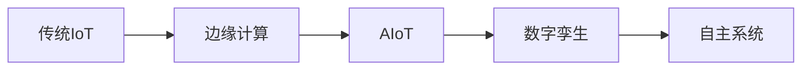

# IoT行业架构与业务模型分析

## 目录

- [IoT行业架构与业务模型分析](#iot行业架构与业务模型分析)
  - [目录](#目录)
  - [1. IoT行业概述](#1-iot行业概述)
    - [1.1 行业定义与特征](#11-行业定义与特征)
    - [1.2 技术发展趋势](#12-技术发展趋势)
    - [1.3 市场分析](#13-市场分析)
  - [2. IoT业务架构模型](#2-iot业务架构模型)
    - [2.1 分层架构理论](#21-分层架构理论)
    - [2.2 边缘计算架构](#22-边缘计算架构)
    - [2.3 事件驱动架构](#23-事件驱动架构)
  - [3. 核心业务实体](#3-核心业务实体)
    - [3.1 设备管理](#31-设备管理)
    - [3.2 数据流处理](#32-数据流处理)
    - [3.3 规则引擎](#33-规则引擎)
  - [4. 技术栈架构](#4-技术栈架构)
    - [4.1 通信协议](#41-通信协议)
    - [4.2 数据存储](#42-数据存储)
    - [4.3 安全框架](#43-安全框架)
  - [5. 行业标准与规范](#5-行业标准与规范)
    - [5.1 国际标准](#51-国际标准)
    - [5.2 行业协议](#52-行业协议)
    - [5.3 安全标准](#53-安全标准)
  - [6. 商业模式分析](#6-商业模式分析)
    - [6.1 平台即服务](#61-平台即服务)
    - [6.2 设备即服务](#62-设备即服务)
    - [6.3 数据即服务](#63-数据即服务)
  - [7. 性能与可扩展性](#7-性能与可扩展性)
    - [7.1 性能指标](#71-性能指标)
    - [7.2 扩展策略](#72-扩展策略)
    - [7.3 优化方法](#73-优化方法)

## 1. IoT行业概述

### 1.1 行业定义与特征

**定义 1.1**：物联网(IoT)是通过网络连接的物理设备、车辆、建筑物和其他嵌入电子设备、软件、传感器、执行器和网络连接的对象的网络，使这些对象能够收集和交换数据。

**IoT系统特征**：
1. **大规模连接**：支持数十亿设备同时连接
2. **异构性**：不同厂商、协议、平台的设备共存
3. **实时性**：低延迟的数据传输和处理
4. **资源约束**：设备通常具有有限的计算、存储和能源资源
5. **安全性**：设备认证、数据加密、安全更新

**形式化定义**：
IoT系统可以建模为图 \(G = (V, E, W)\)，其中：
- \(V\) 是设备节点集合
- \(E\) 是通信连接集合
- \(W\) 是连接权重（延迟、带宽等）

### 1.2 技术发展趋势

**当前趋势**：
1. **边缘计算**：将计算能力从云端迁移到网络边缘
2. **5G网络**：提供高带宽、低延迟的通信
3. **人工智能**：在边缘设备上运行AI算法
4. **区块链**：提供去中心化的信任机制
5. **数字孪生**：物理世界的数字表示

**技术演进路径**：


### 1.3 市场分析

**市场规模**：
- 2023年全球IoT市场规模：$1.1万亿美元
- 预计2027年达到：$2.4万亿美元
- 年复合增长率：18.4%

**主要应用领域**：
1. **工业IoT**：智能制造、预测性维护
2. **智慧城市**：交通管理、环境监测
3. **智能家居**：自动化控制、能源管理
4. **医疗健康**：远程监护、医疗设备管理
5. **农业IoT**：精准农业、环境监测

## 2. IoT业务架构模型

### 2.1 分层架构理论

**定义 2.1**：IoT分层架构是将系统功能按层次组织的架构模式，每层提供特定的服务给上层，并使用下层的服务。

**标准四层架构**：

```rust
// IoT分层架构实现
pub trait IoTLayer {
    fn process(&self, data: &[u8]) -> Result<Vec<u8>, IoError>;
    fn get_layer_name(&self) -> &'static str;
}

// 应用层
pub struct ApplicationLayer {
    device_manager: DeviceManager,
    data_processor: DataProcessor,
    rule_engine: RuleEngine,
}

impl IoTLayer for ApplicationLayer {
    fn process(&self, data: &[u8]) -> Result<Vec<u8>, IoError> {
        // 业务逻辑处理
        let device_data = self.device_manager.parse_data(data)?;
        let processed_data = self.data_processor.process(device_data)?;
        let actions = self.rule_engine.evaluate(&processed_data)?;
        
        Ok(actions.serialize()?)
    }
    
    fn get_layer_name(&self) -> &'static str {
        "Application Layer"
    }
}

// 服务层
pub struct ServiceLayer {
    communication_service: CommunicationService,
    storage_service: StorageService,
    security_service: SecurityService,
}

impl IoTLayer for ServiceLayer {
    fn process(&self, data: &[u8]) -> Result<Vec<u8>, IoError> {
        // 服务层处理
        let secured_data = self.security_service.encrypt(data)?;
        self.storage_service.store(&secured_data)?;
        
        Ok(secured_data)
    }
    
    fn get_layer_name(&self) -> &'static str {
        "Service Layer"
    }
}

// 协议层
pub struct ProtocolLayer {
    mqtt_client: MqttClient,
    coap_client: CoapClient,
    http_client: HttpClient,
}

impl IoTLayer for ProtocolLayer {
    fn process(&self, data: &[u8]) -> Result<Vec<u8>, IoError> {
        // 协议转换和传输
        match self.determine_protocol(data) {
            Protocol::MQTT => self.mqtt_client.send(data),
            Protocol::CoAP => self.coap_client.send(data),
            Protocol::HTTP => self.http_client.send(data),
        }
    }
    
    fn get_layer_name(&self) -> &'static str {
        "Protocol Layer"
    }
}

// 硬件层
pub struct HardwareLayer {
    sensors: Vec<Box<dyn Sensor>>,
    actuators: Vec<Box<dyn Actuator>>,
    communication_module: CommunicationModule,
}

impl IoTLayer for HardwareLayer {
    fn process(&self, data: &[u8]) -> Result<Vec<u8>, IoError> {
        // 硬件抽象层处理
        let sensor_data = self.collect_sensor_data()?;
        let command_data = self.execute_actuator_commands(data)?;
        
        Ok([sensor_data, command_data].concat())
    }
    
    fn get_layer_name(&self) -> &'static str {
        "Hardware Layer"
    }
}
```

**形式化定义**：
分层架构可以表示为：
\[L = \{L_1, L_2, ..., L_n\}\]
其中每层 \(L_i\) 提供接口 \(I_i\) 给上层，使用接口 \(I_{i-1}\) 调用下层。

### 2.2 边缘计算架构

**定义 2.2**：边缘计算是将计算能力部署在网络边缘，靠近数据源的位置，以减少延迟和带宽消耗。

**边缘计算模型**：
```rust
// 边缘节点架构
pub struct EdgeNode {
    device_manager: DeviceManager,
    data_processor: DataProcessor,
    rule_engine: RuleEngine,
    communication_manager: CommunicationManager,
    local_storage: LocalStorage,
    security_manager: SecurityManager,
}

impl EdgeNode {
    pub async fn run(&mut self) -> Result<(), EdgeError> {
        loop {
            // 1. 收集设备数据
            let device_data = self.device_manager.collect_data().await?;
            
            // 2. 本地数据处理
            let processed_data = self.data_processor.process(device_data).await?;
            
            // 3. 规则引擎执行
            let actions = self.rule_engine.evaluate(&processed_data).await?;
            
            // 4. 执行本地动作
            self.execute_actions(actions).await?;
            
            // 5. 上传重要数据到云端
            self.upload_to_cloud(processed_data).await?;
            
            // 6. 接收云端指令
            self.receive_cloud_commands().await?;
            
            tokio::time::sleep(Duration::from_secs(1)).await;
        }
    }
    
    async fn execute_actions(&self, actions: Vec<Action>) -> Result<(), EdgeError> {
        for action in actions {
            match action {
                Action::ControlDevice { device_id, command } => {
                    self.device_manager.control_device(device_id, command).await?;
                }
                Action::SendAlert { alert_type, recipients, message } => {
                    self.communication_manager.send_alert(alert_type, recipients, message).await?;
                }
                Action::StoreData { data, destination } => {
                    self.local_storage.store(data, destination).await?;
                }
            }
        }
        Ok(())
    }
}

// 云端服务架构
pub struct CloudService {
    device_registry: DeviceRegistry,
    data_ingestion: DataIngestion,
    analytics_engine: AnalyticsEngine,
    command_dispatcher: CommandDispatcher,
    global_rule_engine: GlobalRuleEngine,
}

impl CloudService {
    pub async fn run(&mut self) -> Result<(), CloudError> {
        // 1. 接收边缘节点数据
        self.data_ingestion.receive_data().await?;
        
        // 2. 设备状态管理
        self.device_registry.update_status().await?;
        
        // 3. 全局数据分析
        self.analytics_engine.analyze().await?;
        
        // 4. 全局规则执行
        let global_actions = self.global_rule_engine.evaluate().await?;
        
        // 5. 发送控制指令
        self.command_dispatcher.dispatch(global_actions).await?;
        
        Ok(())
    }
}
```

**边缘计算优势**：
1. **低延迟**：本地处理减少网络延迟
2. **带宽优化**：只上传重要数据
3. **隐私保护**：敏感数据本地处理
4. **可靠性**：网络中断时仍可工作

### 2.3 事件驱动架构

**定义 2.3**：事件驱动架构是基于事件的生产、检测、消费和反应的软件架构模式。

**事件驱动模型**：
```rust
// 事件定义
#[derive(Debug, Clone, Serialize, Deserialize)]
pub enum IoTEvent {
    DeviceConnected(DeviceConnectedEvent),
    DeviceDisconnected(DeviceDisconnectedEvent),
    SensorDataReceived(SensorDataEvent),
    AlertTriggered(AlertEvent),
    CommandExecuted(CommandEvent),
    RuleTriggered(RuleEvent),
}

#[derive(Debug, Clone, Serialize, Deserialize)]
pub struct DeviceConnectedEvent {
    pub device_id: DeviceId,
    pub timestamp: DateTime<Utc>,
    pub connection_type: ConnectionType,
    pub device_info: DeviceInfo,
}

#[derive(Debug, Clone, Serialize, Deserialize)]
pub struct SensorDataEvent {
    pub device_id: DeviceId,
    pub sensor_type: SensorType,
    pub value: f64,
    pub timestamp: DateTime<Utc>,
    pub quality: DataQuality,
}

// 事件处理器trait
pub trait EventHandler: Send + Sync {
    async fn handle(&self, event: &IoTEvent) -> Result<(), EventError>;
    fn get_event_type(&self) -> TypeId;
}

// 设备连接事件处理器
pub struct DeviceConnectionHandler {
    device_registry: Arc<DeviceRegistry>,
    notification_service: Arc<NotificationService>,
}

#[async_trait]
impl EventHandler for DeviceConnectionHandler {
    async fn handle(&self, event: &IoTEvent) -> Result<(), EventError> {
        if let IoTEvent::DeviceConnected(conn_event) = event {
            // 更新设备注册表
            self.device_registry.update_device_status(
                conn_event.device_id.clone(),
                DeviceStatus::Online,
            ).await?;
            
            // 发送通知
            self.notification_service.send_notification(
                NotificationType::DeviceConnected,
                &conn_event.device_id,
            ).await?;
        }
        Ok(())
    }
    
    fn get_event_type(&self) -> TypeId {
        TypeId::of::<DeviceConnectedEvent>()
    }
}

// 事件总线
pub struct EventBus {
    handlers: HashMap<TypeId, Vec<Box<dyn EventHandler>>>,
    event_queue: Arc<Mutex<VecDeque<IoTEvent>>>,
}

impl EventBus {
    pub fn new() -> Self {
        EventBus {
            handlers: HashMap::new(),
            event_queue: Arc::new(Mutex::new(VecDeque::new())),
        }
    }
    
    pub fn register_handler(&mut self, handler: Box<dyn EventHandler>) {
        let event_type = handler.get_event_type();
        self.handlers.entry(event_type)
            .or_insert_with(Vec::new)
            .push(handler);
    }
    
    pub async fn publish(&self, event: IoTEvent) -> Result<(), EventError> {
        // 将事件加入队列
        {
            let mut queue = self.event_queue.lock().unwrap();
            queue.push_back(event);
        }
        
        // 异步处理事件
        self.process_events().await?;
        Ok(())
    }
    
    async fn process_events(&self) -> Result<(), EventError> {
        let event_type = TypeId::of::<IoTEvent>();
        
        if let Some(handlers) = self.handlers.get(&event_type) {
            for handler in handlers {
                // 从队列中获取事件
                let event = {
                    let mut queue = self.event_queue.lock().unwrap();
                    queue.pop_front()
                };
                
                if let Some(event) = event {
                    handler.handle(&event).await?;
                }
            }
        }
        Ok(())
    }
}
```

## 3. 核心业务实体

### 3.1 设备管理

**定义 3.1**：设备管理是对IoT设备进行注册、监控、配置和控制的业务功能。

**设备管理模型**：
```rust
// 设备聚合根
#[derive(Debug, Clone)]
pub struct Device {
    pub id: DeviceId,
    pub name: String,
    pub device_type: DeviceType,
    pub model: String,
    pub manufacturer: String,
    pub firmware_version: String,
    pub location: Location,
    pub status: DeviceStatus,
    pub capabilities: Vec<Capability>,
    pub configuration: DeviceConfiguration,
    pub last_seen: DateTime<Utc>,
    pub created_at: DateTime<Utc>,
    pub updated_at: DateTime<Utc>,
}

#[derive(Debug, Clone)]
pub struct DeviceConfiguration {
    pub sampling_rate: Duration,
    pub threshold_values: HashMap<String, f64>,
    pub communication_interval: Duration,
    pub power_mode: PowerMode,
    pub security_settings: SecuritySettings,
}

impl Device {
    pub fn is_online(&self) -> bool {
        self.status == DeviceStatus::Online &&
        self.last_seen > Utc::now() - Duration::from_secs(300) // 5分钟内有活动
    }
    
    pub fn can_communicate(&self) -> bool {
        self.is_online() && self.capabilities.contains(&Capability::Communication)
    }
    
    pub fn update_status(&mut self, status: DeviceStatus) {
        self.status = status;
        self.updated_at = Utc::now();
        if status == DeviceStatus::Online {
            self.last_seen = Utc::now();
        }
    }
    
    pub fn check_threshold(&self, sensor_type: &str, value: f64) -> Option<ThresholdAlert> {
        if let Some(threshold) = self.configuration.threshold_values.get(sensor_type) {
            if value > *threshold {
                Some(ThresholdAlert {
                    device_id: self.id.clone(),
                    sensor_type: sensor_type.to_string(),
                    value,
                    threshold: *threshold,
                    timestamp: Utc::now(),
                })
            } else {
                None
            }
        } else {
            None
        }
    }
}

// 设备管理器
pub struct DeviceManager {
    devices: HashMap<DeviceId, Device>,
    device_registry: Arc<DeviceRegistry>,
    event_bus: Arc<EventBus>,
}

impl DeviceManager {
    pub async fn register_device(&mut self, device: Device) -> Result<(), DeviceError> {
        // 验证设备信息
        self.validate_device(&device)?;
        
        // 注册设备
        self.devices.insert(device.id.clone(), device.clone());
        self.device_registry.register(device.clone()).await?;
        
        // 发布设备注册事件
        let event = IoTEvent::DeviceRegistered(DeviceRegisteredEvent {
            device_id: device.id.clone(),
            timestamp: Utc::now(),
        });
        self.event_bus.publish(event).await?;
        
        Ok(())
    }
    
    pub async fn collect_data(&self) -> Result<Vec<SensorData>, DeviceError> {
        let mut all_data = Vec::new();
        
        for device in self.devices.values() {
            if device.can_communicate() {
                let device_data = self.collect_device_data(device).await?;
                all_data.extend(device_data);
            }
        }
        
        Ok(all_data)
    }
    
    async fn collect_device_data(&self, device: &Device) -> Result<Vec<SensorData>, DeviceError> {
        // 模拟从设备收集数据
        let mut data = Vec::new();
        
        for capability in &device.capabilities {
            if let Capability::Sensor(sensor_type) = capability {
                let value = self.read_sensor_value(device, sensor_type).await?;
                let sensor_data = SensorData {
                    id: SensorDataId::new(),
                    device_id: device.id.clone(),
                    sensor_type: sensor_type.clone(),
                    value,
                    unit: sensor_type.get_unit(),
                    timestamp: Utc::now(),
                    quality: DataQuality::Good,
                    metadata: SensorMetadata::default(),
                };
                data.push(sensor_data);
            }
        }
        
        Ok(data)
    }
}
```

### 3.2 数据流处理

**定义 3.2**：数据流处理是对IoT设备产生的连续数据流进行实时处理和分析的业务功能。

**数据流处理模型**：
```rust
// 数据处理器
pub struct DataProcessor {
    filters: Vec<Box<dyn DataFilter>>,
    transformers: Vec<Box<dyn DataTransformer>>,
    aggregators: Vec<Box<dyn DataAggregator>>,
    analytics_engine: AnalyticsEngine,
}

impl DataProcessor {
    pub async fn process(&self, data: Vec<SensorData>) -> Result<ProcessedData, ProcessingError> {
        let mut processed_data = data;
        
        // 1. 数据过滤
        for filter in &self.filters {
            processed_data = filter.filter(processed_data).await?;
        }
        
        // 2. 数据转换
        for transformer in &self.transformers {
            processed_data = transformer.transform(processed_data).await?;
        }
        
        // 3. 数据聚合
        let aggregated_data = self.aggregate_data(processed_data).await?;
        
        // 4. 数据分析
        let analytics_result = self.analytics_engine.analyze(&aggregated_data).await?;
        
        Ok(ProcessedData {
            raw_data: data,
            processed_data: aggregated_data,
            analytics_result,
            timestamp: Utc::now(),
        })
    }
    
    async fn aggregate_data(&self, data: Vec<SensorData>) -> Result<Vec<AggregatedData>, ProcessingError> {
        let mut aggregated = Vec::new();
        
        for aggregator in &self.aggregators {
            let result = aggregator.aggregate(&data).await?;
            aggregated.extend(result);
        }
        
        Ok(aggregated)
    }
}

// 数据过滤器trait
pub trait DataFilter: Send + Sync {
    async fn filter(&self, data: Vec<SensorData>) -> Result<Vec<SensorData>, ProcessingError>;
}

// 异常值过滤器
pub struct OutlierFilter {
    threshold: f64,
}

#[async_trait]
impl DataFilter for OutlierFilter {
    async fn filter(&self, data: Vec<SensorData>) -> Result<Vec<SensorData>, ProcessingError> {
        let filtered: Vec<SensorData> = data.into_iter()
            .filter(|sensor_data| !self.is_outlier(sensor_data))
            .collect();
        
        Ok(filtered)
    }
}

impl OutlierFilter {
    fn is_outlier(&self, data: &SensorData) -> bool {
        // 简化的异常值检测算法
        data.value.abs() > self.threshold
    }
}

// 数据聚合器trait
pub trait DataAggregator: Send + Sync {
    async fn aggregate(&self, data: &[SensorData]) -> Result<Vec<AggregatedData>, ProcessingError>;
}

// 时间窗口聚合器
pub struct TimeWindowAggregator {
    window_size: Duration,
    aggregation_type: AggregationType,
}

#[async_trait]
impl DataAggregator for TimeWindowAggregator {
    async fn aggregate(&self, data: &[SensorData]) -> Result<Vec<AggregatedData>, ProcessingError> {
        let mut aggregated = Vec::new();
        let mut current_window = Vec::new();
        let mut window_start = None;
        
        for sensor_data in data {
            if window_start.is_none() {
                window_start = Some(sensor_data.timestamp);
            }
            
            if let Some(start) = window_start {
                if sensor_data.timestamp - start <= self.window_size {
                    current_window.push(sensor_data.clone());
                } else {
                    // 处理当前窗口
                    if !current_window.is_empty() {
                        let aggregated_data = self.aggregate_window(&current_window)?;
                        aggregated.push(aggregated_data);
                    }
                    
                    // 开始新窗口
                    current_window = vec![sensor_data.clone()];
                    window_start = Some(sensor_data.timestamp);
                }
            }
        }
        
        // 处理最后一个窗口
        if !current_window.is_empty() {
            let aggregated_data = self.aggregate_window(&current_window)?;
            aggregated.push(aggregated_data);
        }
        
        Ok(aggregated)
    }
}

impl TimeWindowAggregator {
    fn aggregate_window(&self, data: &[SensorData]) -> Result<AggregatedData, ProcessingError> {
        let values: Vec<f64> = data.iter().map(|d| d.value).collect();
        
        let aggregated_value = match self.aggregation_type {
            AggregationType::Average => values.iter().sum::<f64>() / values.len() as f64,
            AggregationType::Sum => values.iter().sum(),
            AggregationType::Min => values.iter().fold(f64::INFINITY, |a, &b| a.min(b)),
            AggregationType::Max => values.iter().fold(f64::NEG_INFINITY, |a, &b| a.max(b)),
        };
        
        Ok(AggregatedData {
            device_id: data[0].device_id.clone(),
            sensor_type: data[0].sensor_type.clone(),
            aggregated_value,
            aggregation_type: self.aggregation_type.clone(),
            window_start: data[0].timestamp,
            window_end: data[data.len() - 1].timestamp,
            data_count: data.len(),
        })
    }
}
```

### 3.3 规则引擎

**定义 3.3**：规则引擎是根据预定义规则对数据进行评估并触发相应动作的业务功能。

**规则引擎模型**：
```rust
// 规则定义
#[derive(Debug, Clone)]
pub struct Rule {
    pub id: RuleId,
    pub name: String,
    pub description: String,
    pub conditions: Vec<Condition>,
    pub actions: Vec<Action>,
    pub priority: u32,
    pub enabled: bool,
    pub created_at: DateTime<Utc>,
    pub updated_at: DateTime<Utc>,
}

#[derive(Debug, Clone)]
pub enum Condition {
    Threshold {
        device_id: DeviceId,
        sensor_type: String,
        operator: ComparisonOperator,
        value: f64,
    },
    TimeRange {
        start_time: TimeOfDay,
        end_time: TimeOfDay,
        days_of_week: Vec<DayOfWeek>,
    },
    DeviceStatus {
        device_id: DeviceId,
        status: DeviceStatus,
    },
    Composite {
        conditions: Vec<Condition>,
        operator: LogicalOperator,
    },
}

#[derive(Debug, Clone)]
pub enum Action {
    SendAlert {
        alert_type: AlertType,
        recipients: Vec<String>,
        message_template: String,
    },
    ControlDevice {
        device_id: DeviceId,
        command: DeviceCommand,
    },
    StoreData {
        data_type: String,
        destination: String,
    },
    TriggerWorkflow {
        workflow_id: String,
        parameters: HashMap<String, String>,
    },
}

// 规则引擎
pub struct RuleEngine {
    rules: Vec<Rule>,
    condition_evaluator: ConditionEvaluator,
    action_executor: ActionExecutor,
    event_bus: Arc<EventBus>,
}

impl RuleEngine {
    pub async fn evaluate(&self, context: &RuleContext) -> Result<Vec<Action>, RuleError> {
        let mut triggered_actions = Vec::new();
        
        // 按优先级排序规则
        let mut sorted_rules = self.rules.clone();
        sorted_rules.sort_by(|a, b| b.priority.cmp(&a.priority));
        
        for rule in sorted_rules {
            if !rule.enabled {
                continue;
            }
            
            if self.evaluate_rule(&rule, context).await? {
                triggered_actions.extend(rule.actions.clone());
                
                // 发布规则触发事件
                let event = IoTEvent::RuleTriggered(RuleEvent {
                    rule_id: rule.id.clone(),
                    context: context.clone(),
                    timestamp: Utc::now(),
                });
                self.event_bus.publish(event).await?;
            }
        }
        
        Ok(triggered_actions)
    }
    
    async fn evaluate_rule(&self, rule: &Rule, context: &RuleContext) -> Result<bool, RuleError> {
        for condition in &rule.conditions {
            if !self.evaluate_condition(condition, context).await? {
                return Ok(false);
            }
        }
        Ok(true)
    }
    
    async fn evaluate_condition(&self, condition: &Condition, context: &RuleContext) -> Result<bool, RuleError> {
        match condition {
            Condition::Threshold { device_id, sensor_type, operator, value } => {
                if let Some(sensor_data) = context.get_sensor_data(device_id, sensor_type) {
                    match operator {
                        ComparisonOperator::GreaterThan => Ok(sensor_data.value > *value),
                        ComparisonOperator::LessThan => Ok(sensor_data.value < *value),
                        ComparisonOperator::EqualTo => Ok(sensor_data.value == *value),
                        ComparisonOperator::GreaterThanOrEqual => Ok(sensor_data.value >= *value),
                        ComparisonOperator::LessThanOrEqual => Ok(sensor_data.value <= *value),
                    }
                } else {
                    Ok(false)
                }
            }
            Condition::TimeRange { start_time, end_time, days_of_week } => {
                let now = Utc::now();
                let current_time = now.time();
                let current_day = now.weekday();
                
                let in_time_range = current_time >= *start_time && current_time <= *end_time;
                let in_day_range = days_of_week.contains(&current_day);
                
                Ok(in_time_range && in_day_range)
            }
            Condition::DeviceStatus { device_id, status } => {
                if let Some(device) = context.get_device(device_id) {
                    Ok(device.status == *status)
                } else {
                    Ok(false)
                }
            }
            Condition::Composite { conditions, operator } => {
                match operator {
                    LogicalOperator::And => {
                        for condition in conditions {
                            if !self.evaluate_condition(condition, context).await? {
                                return Ok(false);
                            }
                        }
                        Ok(true)
                    }
                    LogicalOperator::Or => {
                        for condition in conditions {
                            if self.evaluate_condition(condition, context).await? {
                                return Ok(true);
                            }
                        }
                        Ok(false)
                    }
                }
            }
        }
    }
}
```

## 4. 技术栈架构

### 4.1 通信协议

**IoT通信协议分类**：

1. **应用层协议**：
   - **MQTT**：轻量级消息传输协议
   - **CoAP**：受限应用协议
   - **HTTP/HTTPS**：超文本传输协议
   - **AMQP**：高级消息队列协议

2. **网络层协议**：
   - **IPv6**：互联网协议版本6
   - **6LoWPAN**：低功耗无线个人区域网络
   - **LoRaWAN**：长距离广域网

**协议选择标准**：
- **带宽要求**：低带宽设备选择MQTT或CoAP
- **延迟要求**：实时应用选择UDP协议
- **可靠性要求**：关键应用选择TCP协议
- **安全性要求**：敏感数据使用TLS/DTLS

### 4.2 数据存储

**存储架构模式**：

1. **分层存储**：
   - **热数据**：内存数据库（Redis）
   - **温数据**：关系数据库（PostgreSQL）
   - **冷数据**：对象存储（S3）

2. **时序数据库**：
   - **InfluxDB**：专门用于时序数据
   - **TimescaleDB**：PostgreSQL扩展
   - **Prometheus**：监控数据存储

### 4.3 安全框架

**安全架构层次**：

1. **设备安全**：
   - 设备认证
   - 固件签名
   - 安全启动

2. **通信安全**：
   - TLS/DTLS加密
   - 证书管理
   - 密钥交换

3. **数据安全**：
   - 数据加密
   - 访问控制
   - 审计日志

## 5. 行业标准与规范

### 5.1 国际标准

**主要标准组织**：
- **ISO/IEC**：国际标准化组织
- **IEEE**：电气电子工程师学会
- **IETF**：互联网工程任务组
- **3GPP**：第三代合作伙伴计划

**重要标准**：
- **ISO/IEC 27001**：信息安全管理
- **IEEE 802.15.4**：低速率无线个人区域网络
- **RFC 7252**：CoAP协议规范

### 5.2 行业协议

**工业协议**：
- **OPC UA**：开放平台通信统一架构
- **Modbus**：工业通信协议
- **PROFINET**：工业以太网标准

**消费协议**：
- **Zigbee**：低功耗无线网络协议
- **Z-Wave**：智能家居无线协议
- **Thread**：基于IPv6的无线协议

### 5.3 安全标准

**安全框架**：
- **NIST Cybersecurity Framework**：网络安全框架
- **OWASP IoT Top 10**：IoT安全风险
- **IEC 62443**：工业自动化和控制系统安全

## 6. 商业模式分析

### 6.1 平台即服务

**定义**：提供IoT平台服务，包括设备管理、数据处理、应用开发等。

**收入模式**：
- 按设备数量收费
- 按数据量收费
- 按API调用次数收费

### 6.2 设备即服务

**定义**：将设备作为服务提供，客户按使用量付费。

**优势**：
- 降低客户初始投资
- 提供持续服务支持
- 实现设备生命周期管理

### 6.3 数据即服务

**定义**：将处理后的数据作为服务提供给客户。

**应用场景**：
- 市场分析数据
- 预测性维护数据
- 环境监测数据

## 7. 性能与可扩展性

### 7.1 性能指标

**关键性能指标**：
- **延迟**：端到端响应时间
- **吞吐量**：每秒处理的消息数
- **可用性**：系统正常运行时间
- **并发性**：同时支持的连接数

### 7.2 扩展策略

**水平扩展**：
- 增加服务器节点
- 负载均衡
- 数据分片

**垂直扩展**：
- 增加硬件资源
- 优化算法
- 缓存策略

### 7.3 优化方法

**性能优化**：
- 异步处理
- 批量操作
- 索引优化
- 缓存策略

## 总结

本文档系统地分析了IoT行业的架构模型、业务实体、技术栈和行业标准。IoT系统需要综合考虑设备管理、数据处理、安全性和可扩展性等多个方面。

关键要点：
1. **分层架构提供了清晰的系统组织方式**
2. **边缘计算降低了延迟和带宽消耗**
3. **事件驱动架构支持松耦合的系统设计**
4. **标准化确保了系统的互操作性和安全性**

这些架构模式和最佳实践为构建可靠、高效、可扩展的IoT系统提供了重要指导。 