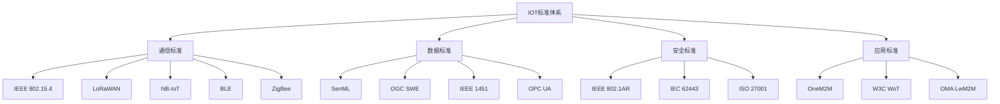

# 01 主流标准与协议

## 9.1 IOT标准体系概览

### 9.1.1 标准分类体系



### 9.1.2 标准成熟度评估

| 标准类别 | 标准名称 | 成熟度 | 应用范围 | 技术特点 |
|----------|----------|--------|----------|----------|
| 通信标准 | IEEE 802.15.4 | 高 | 广域 | 低功耗、短距离 |
| 通信标准 | LoRaWAN | 高 | 广域 | 长距离、低功耗 |
| 通信标准 | NB-IoT | 中 | 蜂窝 | 广覆盖、低功耗 |
| 数据标准 | SenML | 高 | 通用 | 轻量级、JSON |
| 安全标准 | IEEE 802.1AR | 高 | 设备认证 | 数字证书 |

## 9.2 通信协议标准

### 9.2.1 IEEE 802.15.4

**标准概述**：
IEEE 802.15.4是低速率无线个人区域网络(LR-WPAN)的标准，为IOT设备提供低功耗、低数据率的无线通信。

**技术规范**：

```rust
// IEEE 802.15.4 帧结构
#[derive(Debug, Clone)]
pub struct IEEE802154Frame {
    pub frame_control: FrameControl,
    pub sequence_number: u8,
    pub addressing_fields: AddressingFields,
    pub payload: Vec<u8>,
    pub fcs: u16,
}

#[derive(Debug, Clone)]
pub struct FrameControl {
    pub frame_type: FrameType,
    pub security_enabled: bool,
    pub frame_pending: bool,
    pub ack_request: bool,
    pub pan_id_compression: bool,
    pub destination_addressing_mode: AddressingMode,
    pub frame_version: FrameVersion,
    pub source_addressing_mode: AddressingMode,
}

#[derive(Debug, Clone)]
pub enum FrameType {
    Beacon = 0,
    Data = 1,
    Acknowledgment = 2,
    MACCommand = 3,
}

#[derive(Debug, Clone)]
pub enum AddressingMode {
    None = 0,
    Reserved = 1,
    ShortAddress = 2,
    ExtendedAddress = 3,
}
```

**协议栈实现**：

```rust
// IEEE 802.15.4 协议栈
pub struct IEEE802154Stack {
    phy_layer: PHYLayer,
    mac_layer: MACLayer,
    network_layer: NetworkLayer,
}

impl IEEE802154Stack {
    pub async fn send_frame(&mut self, frame: IEEE802154Frame) -> Result<(), ProtocolError> {
        // 1. 网络层处理
        let network_frame = self.network_layer.process_outgoing(frame).await?;
        
        // 2. MAC层处理
        let mac_frame = self.mac_layer.process_outgoing(network_frame).await?;
        
        // 3. 物理层发送
        self.phy_layer.transmit(mac_frame).await?;
        
        Ok(())
    }
    
    pub async fn receive_frame(&mut self) -> Result<IEEE802154Frame, ProtocolError> {
        // 1. 物理层接收
        let raw_frame = self.phy_layer.receive().await?;
        
        // 2. MAC层处理
        let mac_frame = self.mac_layer.process_incoming(raw_frame).await?;
        
        // 3. 网络层处理
        let network_frame = self.network_layer.process_incoming(mac_frame).await?;
        
        Ok(network_frame)
    }
}
```

### 9.2.2 LoRaWAN

**标准概述**：
LoRaWAN是低功耗广域网络(LPWAN)标准，基于LoRa调制技术，提供长距离、低功耗的无线通信。

**协议架构**：

```rust
// LoRaWAN 协议栈
pub struct LoRaWANStack {
    application_layer: ApplicationLayer,
    network_layer: NetworkLayer,
    mac_layer: MACLayer,
    phy_layer: PHYLayer,
}

#[derive(Debug, Clone)]
pub struct LoRaWANMessage {
    pub mhdr: MessageHeader,
    pub mac_payload: MACPayload,
    pub mic: u32,
}

#[derive(Debug, Clone)]
pub struct MessageHeader {
    pub message_type: MessageType,
    pub major_version: u8,
}

#[derive(Debug, Clone)]
pub enum MessageType {
    JoinRequest = 0,
    JoinAccept = 1,
    UnconfirmedDataUp = 2,
    UnconfirmedDataDown = 3,
    ConfirmedDataUp = 4,
    ConfirmedDataDown = 5,
    RejoinRequest = 6,
    Proprietary = 7,
}

#[derive(Debug, Clone)]
pub struct MACPayload {
    pub fhdr: FrameHeader,
    pub f_port: Option<u8>,
    pub frm_payload: Option<Vec<u8>>,
}

#[derive(Debug, Clone)]
pub struct FrameHeader {
    pub dev_addr: u32,
    pub f_ctrl: FrameControl,
    pub f_cnt: u16,
    pub f_opts: Vec<u8>,
}
```

**设备类型**：

```rust
// LoRaWAN 设备类型
#[derive(Debug, Clone)]
pub enum DeviceClass {
    ClassA, // 双向通信，上行优先
    ClassB, // 双向通信，下行调度
    ClassC, // 双向通信，持续下行
}

impl DeviceClass {
    pub fn get_receive_windows(&self) -> Vec<ReceiveWindow> {
        match self {
            DeviceClass::ClassA => vec![
                ReceiveWindow::new(1, Duration::from_secs(1)),
                ReceiveWindow::new(2, Duration::from_secs(1)),
            ],
            DeviceClass::ClassB => {
                let mut windows = vec![
                    ReceiveWindow::new(1, Duration::from_secs(1)),
                    ReceiveWindow::new(2, Duration::from_secs(1)),
                ];
                // 添加Class B的调度窗口
                windows.extend(self.get_class_b_windows());
                windows
            }
            DeviceClass::ClassC => {
                let mut windows = vec![
                    ReceiveWindow::new(1, Duration::from_secs(1)),
                    ReceiveWindow::new(2, Duration::from_secs(1)),
                ];
                // 添加Class C的持续接收窗口
                windows.extend(self.get_class_c_windows());
                windows
            }
        }
    }
}
```

### 9.2.3 MQTT协议

**协议概述**：
MQTT(Message Queuing Telemetry Transport)是轻量级的发布/订阅消息传输协议，广泛应用于IOT设备通信。

**协议实现**：

```rust
// MQTT 客户端实现
pub struct MQTTClient {
    connection: MQTTConnection,
    subscriptions: HashMap<String, Vec<Box<dyn MessageHandler>>>,
    message_id_counter: AtomicU16,
}

impl MQTTClient {
    pub async fn connect(&mut self, broker: &str, client_id: &str) -> Result<(), MQTTError> {
        let connect_packet = ConnectPacket {
            client_id: client_id.to_string(),
            clean_session: true,
            keep_alive: 60,
            username: None,
            password: None,
        };
        
        self.connection.send_packet(Packet::Connect(connect_packet)).await?;
        
        // 等待连接确认
        match self.connection.receive_packet().await? {
            Packet::ConnAck(conn_ack) => {
                if conn_ack.return_code == ConnectReturnCode::Accepted {
                    Ok(())
                } else {
                    Err(MQTTError::ConnectionRefused(conn_ack.return_code))
                }
            }
            _ => Err(MQTTError::UnexpectedPacket),
        }
    }
    
    pub async fn publish(&mut self, topic: &str, payload: &[u8], qos: QoS) -> Result<(), MQTTError> {
        let message_id = if qos > QoS::AtMostOnce {
            Some(self.message_id_counter.fetch_add(1, Ordering::SeqCst))
        } else {
            None
        };
        
        let publish_packet = PublishPacket {
            topic_name: topic.to_string(),
            packet_id: message_id,
            payload: payload.to_vec(),
            qos_level: qos,
            retain: false,
            dup: false,
        };
        
        self.connection.send_packet(Packet::Publish(publish_packet)).await?;
        
        // 等待QoS确认
        if qos > QoS::AtMostOnce {
            self.wait_for_ack(message_id.unwrap()).await?;
        }
        
        Ok(())
    }
    
    pub async fn subscribe(&mut self, topic: &str, qos: QoS) -> Result<(), MQTTError> {
        let message_id = self.message_id_counter.fetch_add(1, Ordering::SeqCst);
        
        let subscribe_packet = SubscribePacket {
            packet_id: message_id,
            topic_filters: vec![(topic.to_string(), qos)],
        };
        
        self.connection.send_packet(Packet::Subscribe(subscribe_packet)).await?;
        
        // 等待订阅确认
        match self.connection.receive_packet().await? {
            Packet::SubAck(sub_ack) => {
                if sub_ack.packet_id == message_id {
                    Ok(())
                } else {
                    Err(MQTTError::UnexpectedPacket)
                }
            }
            _ => Err(MQTTError::UnexpectedPacket),
        }
    }
}
```

## 9.3 数据格式标准

### 9.3.1 SenML (Sensor Markup Language)

**标准概述**：
SenML是IOT传感器数据的轻量级表示格式，基于JSON和CBOR，支持传感器数据的标准化表示。

**数据模型**：

```rust
// SenML 数据模型
#[derive(Debug, Clone, Serialize, Deserialize)]
pub struct SenMLRecord {
    #[serde(skip_serializing_if = "Option::is_none")]
    pub bn: Option<String>, // Base Name
    #[serde(skip_serializing_if = "Option::is_none")]
    pub bt: Option<f64>,    // Base Time
    #[serde(skip_serializing_if = "Option::is_none")]
    pub bu: Option<String>, // Base Unit
    #[serde(skip_serializing_if = "Option::is_none")]
    pub bv: Option<f64>,    // Base Value
    #[serde(skip_serializing_if = "Option::is_none")]
    pub bs: Option<f64>,    // Base Sum
    #[serde(skip_serializing_if = "Option::is_none")]
    pub bver: Option<u8>,   // Base Version
    
    #[serde(skip_serializing_if = "Option::is_none")]
    pub n: Option<String>,  // Name
    #[serde(skip_serializing_if = "Option::is_none")]
    pub u: Option<String>,  // Unit
    #[serde(skip_serializing_if = "Option::is_none")]
    pub v: Option<f64>,     // Value
    #[serde(skip_serializing_if = "Option::is_none")]
    pub vs: Option<String>, // String Value
    #[serde(skip_serializing_if = "Option::is_none")]
    pub vb: Option<bool>,   // Boolean Value
    #[serde(skip_serializing_if = "Option::is_none")]
    pub vd: Option<String>, // Data Value
    #[serde(skip_serializing_if = "Option::is_none")]
    pub t: Option<f64>,     // Time
    #[serde(skip_serializing_if = "Option::is_none")]
    pub ut: Option<f64>,    // Update Time
    #[serde(skip_serializing_if = "Option::is_none")]
    pub s: Option<f64>,     // Sum
}

// SenML 文档
#[derive(Debug, Clone, Serialize, Deserialize)]
pub struct SenMLDocument {
    pub records: Vec<SenMLRecord>,
}

impl SenMLDocument {
    pub fn new() -> Self {
        Self {
            records: Vec::new(),
        }
    }
    
    pub fn add_record(&mut self, record: SenMLRecord) {
        self.records.push(record);
    }
    
    pub fn to_json(&self) -> Result<String, serde_json::Error> {
        serde_json::to_string(self)
    }
    
    pub fn from_json(json: &str) -> Result<Self, serde_json::Error> {
        serde_json::from_str(json)
    }
    
    pub fn to_cbor(&self) -> Result<Vec<u8>, cbor::Error> {
        cbor::to_vec(self)
    }
    
    pub fn from_cbor(data: &[u8]) -> Result<Self, cbor::Error> {
        cbor::from_slice(data)
    }
}
```

**使用示例**：

```rust
// SenML 使用示例
pub fn create_temperature_sensor_data() -> SenMLDocument {
    let mut doc = SenMLDocument::new();
    
    // 添加温度传感器数据
    let temp_record = SenMLRecord {
        bn: Some("urn:dev:ow:10e2073a01080063".to_string()),
        bt: Some(1276020076.0),
        bu: Some("Cel".to_string()),
        bv: None,
        bs: None,
        bver: Some(5),
        
        n: Some("temp".to_string()),
        u: None,
        v: Some(23.5),
        vs: None,
        vb: None,
        vd: None,
        t: None,
        ut: None,
        s: None,
    };
    
    doc.add_record(temp_record);
    
    // 添加湿度传感器数据
    let hum_record = SenMLRecord {
        bn: Some("urn:dev:ow:10e2073a01080063".to_string()),
        bt: Some(1276020076.0),
        bu: Some("%RH".to_string()),
        bv: None,
        bs: None,
        bver: Some(5),
        
        n: Some("hum".to_string()),
        u: None,
        v: Some(45.2),
        vs: None,
        vb: None,
        vd: None,
        t: None,
        ut: None,
        s: None,
    };
    
    doc.add_record(hum_record);
    
    doc
}
```

### 9.3.2 OGC Sensor Web Enablement (SWE)

**标准概述**：
OGC SWE是一套用于传感器网络的标准，包括传感器数据模型、服务接口和数据编码格式。

**数据模型**：

```rust
// OGC SWE 数据模型
#[derive(Debug, Clone, Serialize, Deserialize)]
pub struct SWEObservation {
    pub id: String,
    pub phenomenon_time: TimeObject,
    pub result_time: TimeObject,
    pub procedure: Procedure,
    pub observed_property: ObservedProperty,
    pub feature_of_interest: FeatureOfInterest,
    pub result: ObservationResult,
}

#[derive(Debug, Clone, Serialize, Deserialize)]
pub struct TimeObject {
    pub time_position: DateTime<Utc>,
    pub time_interval: Option<TimeInterval>,
}

#[derive(Debug, Clone, Serialize, Deserialize)]
pub struct TimeInterval {
    pub begin: DateTime<Utc>,
    pub end: DateTime<Utc>,
}

#[derive(Debug, Clone, Serialize, Deserialize)]
pub struct Procedure {
    pub href: String,
    pub title: String,
}

#[derive(Debug, Clone, Serialize, Deserialize)]
pub struct ObservedProperty {
    pub href: String,
    pub title: String,
}

#[derive(Debug, Clone, Serialize, Deserialize)]
pub struct FeatureOfInterest {
    pub id: String,
    pub name: String,
    pub geometry: Option<Geometry>,
}

#[derive(Debug, Clone, Serialize, Deserialize)]
pub enum ObservationResult {
    Quantity(QuantityResult),
    Category(CategoryResult),
    Text(TextResult),
    Boolean(BooleanResult),
    Array(ArrayResult),
}

#[derive(Debug, Clone, Serialize, Deserialize)]
pub struct QuantityResult {
    pub value: f64,
    pub uom: String,
}

#[derive(Debug, Clone, Serialize, Deserialize)]
pub struct CategoryResult {
    pub value: String,
    pub code_space: Option<String>,
}
```

## 9.4 安全标准

### 9.4.1 IEEE 802.1AR

**标准概述**：
IEEE 802.1AR定义了设备身份认证的标准，为IOT设备提供唯一、可验证的身份标识。

**实现规范**：

```rust
// IEEE 802.1AR 设备身份
pub struct DeviceIdentity {
    pub device_id: DeviceId,
    pub manufacturer_id: ManufacturerId,
    pub model_number: String,
    pub serial_number: String,
    pub certificate: X509Certificate,
    pub private_key: PrivateKey,
}

impl DeviceIdentity {
    pub fn new(
        manufacturer_id: ManufacturerId,
        model_number: String,
        serial_number: String,
    ) -> Result<Self, IdentityError> {
        // 生成设备ID
        let device_id = Self::generate_device_id(&manufacturer_id, &model_number, &serial_number);
        
        // 生成密钥对
        let (private_key, public_key) = Self::generate_key_pair()?;
        
        // 生成证书
        let certificate = Self::generate_certificate(&device_id, &public_key)?;
        
        Ok(Self {
            device_id,
            manufacturer_id,
            model_number,
            serial_number,
            certificate,
            private_key,
        })
    }
    
    pub fn verify_identity(&self, challenge: &[u8]) -> Result<Vec<u8>, IdentityError> {
        // 使用私钥签名挑战
        let signature = self.private_key.sign(challenge)?;
        
        // 返回签名作为身份验证响应
        Ok(signature)
    }
    
    pub fn verify_certificate(&self, ca_certificate: &X509Certificate) -> Result<bool, IdentityError> {
        // 验证设备证书
        self.certificate.verify(ca_certificate)
    }
}
```

### 9.4.2 IEC 62443

**标准概述**：
IEC 62443是工业自动化和控制系统(IACS)的网络安全标准，适用于IOT工业应用。

**安全要求**：

```rust
// IEC 62443 安全要求
pub struct IEC62443Security {
    pub access_control: AccessControl,
    pub authentication: Authentication,
    pub encryption: Encryption,
    pub audit_logging: AuditLogging,
    pub vulnerability_management: VulnerabilityManagement,
}

impl IEC62443Security {
    pub fn implement_security_requirements(&self) -> Result<(), SecurityError> {
        // 实现访问控制
        self.access_control.implement()?;
        
        // 实现身份认证
        self.authentication.implement()?;
        
        // 实现加密
        self.encryption.implement()?;
        
        // 实现审计日志
        self.audit_logging.implement()?;
        
        // 实现漏洞管理
        self.vulnerability_management.implement()?;
        
        Ok(())
    }
}

pub struct AccessControl {
    pub role_based_access: RoleBasedAccess,
    pub attribute_based_access: AttributeBasedAccess,
}

impl AccessControl {
    pub fn implement(&self) -> Result<(), SecurityError> {
        // 实现基于角色的访问控制
        self.role_based_access.implement()?;
        
        // 实现基于属性的访问控制
        self.attribute_based_access.implement()?;
        
        Ok(())
    }
}
```

## 9.5 应用层标准

### 9.5.1 OneM2M

**标准概述**：
OneM2M是IOT服务层的标准，定义了IOT应用之间的互操作接口。

**服务架构**：

```rust
// OneM2M 服务架构
pub struct OneM2MService {
    pub common_service_entity: CommonServiceEntity,
    pub application_service_entity: ApplicationServiceEntity,
    pub network_service_entity: NetworkServiceEntity,
}

#[derive(Debug, Clone)]
pub struct CommonServiceEntity {
    pub cse_id: String,
    pub cse_type: CSEType,
    pub supported_resource_types: Vec<ResourceType>,
}

#[derive(Debug, Clone)]
pub enum CSEType {
    IN_CSE,    // Infrastructure CSE
    MN_CSE,    // Middle Node CSE
    ASN_CSE,   // Application Service Node CSE
}

#[derive(Debug, Clone)]
pub enum ResourceType {
    AccessControlPolicy,
    ApplicationEntity,
    Container,
    ContentInstance,
    CSEBase,
    Group,
    LocationPolicy,
    MgmtCmd,
    MgmtObj,
    Node,
    PollingChannel,
    RemoteCSE,
    Request,
    Subscription,
}

impl OneM2MService {
    pub async fn create_resource(&self, resource_type: ResourceType, content: Value) -> Result<String, OneM2MError> {
        // 创建OneM2M资源
        let request = CreateRequest {
            resource_type,
            content,
            to: self.cse_id.clone(),
            from: "application".to_string(),
            request_identifier: self.generate_request_id(),
        };
        
        let response = self.send_request(request).await?;
        
        Ok(response.resource_id)
    }
    
    pub async fn retrieve_resource(&self, resource_id: &str) -> Result<Value, OneM2MError> {
        // 检索OneM2M资源
        let request = RetrieveRequest {
            to: resource_id.to_string(),
            from: "application".to_string(),
            request_identifier: self.generate_request_id(),
        };
        
        let response = self.send_request(request).await?;
        
        Ok(response.content)
    }
}
```

### 9.5.2 W3C Web of Things (WoT)

**标准概述**：
W3C WoT定义了IOT设备的Web接口标准，使IOT设备可以通过Web技术进行互操作。

**Thing Description**：

```rust
// W3C WoT Thing Description
#[derive(Debug, Clone, Serialize, Deserialize)]
pub struct ThingDescription {
    pub id: String,
    pub title: String,
    pub description: Option<String>,
    pub version: ThingVersion,
    pub created: Option<DateTime<Utc>>,
    pub modified: Option<DateTime<Utc>>,
    pub support: Option<String>,
    pub base: Option<String>,
    pub properties: HashMap<String, PropertyAffordance>,
    pub actions: HashMap<String, ActionAffordance>,
    pub events: HashMap<String, EventAffordance>,
    pub links: Vec<Link>,
    pub forms: Vec<Form>,
    pub security: Vec<String>,
    pub security_definitions: HashMap<String, SecurityScheme>,
}

#[derive(Debug, Clone, Serialize, Deserialize)]
pub struct PropertyAffordance {
    pub title: Option<String>,
    pub description: Option<String>,
    pub read_only: Option<bool>,
    pub write_only: Option<bool>,
    pub observable: Option<bool>,
    pub data_schema: DataSchema,
    pub forms: Vec<Form>,
}

#[derive(Debug, Clone, Serialize, Deserialize)]
pub struct ActionAffordance {
    pub title: Option<String>,
    pub description: Option<String>,
    pub input: Option<DataSchema>,
    pub output: Option<DataSchema>,
    pub safe: Option<bool>,
    pub idempotent: Option<bool>,
    pub forms: Vec<Form>,
}

#[derive(Debug, Clone, Serialize, Deserialize)]
pub struct EventAffordance {
    pub title: Option<String>,
    pub description: Option<String>,
    pub data: Option<DataSchema>,
    pub subscription: Option<DataSchema>,
    pub cancellation: Option<DataSchema>,
    pub forms: Vec<Form>,
}

#[derive(Debug, Clone, Serialize, Deserialize)]
pub struct DataSchema {
    pub r#type: String,
    pub title: Option<String>,
    pub description: Option<String>,
    pub const_value: Option<Value>,
    pub default: Option<Value>,
    pub unit: Option<String>,
    pub one_of: Option<Vec<DataSchema>>,
    pub enum_values: Option<Vec<Value>>,
    pub read_only: Option<bool>,
    pub write_only: Option<bool>,
    pub format: Option<String>,
    pub items: Option<Box<DataSchema>>,
    pub min_items: Option<u32>,
    pub max_items: Option<u32>,
    pub properties: Option<HashMap<String, DataSchema>>,
    pub required: Option<Vec<String>>,
    pub minimum: Option<f64>,
    pub maximum: Option<f64>,
    pub exclusive_minimum: Option<bool>,
    pub exclusive_maximum: Option<bool>,
    pub multiple_of: Option<f64>,
    pub min_length: Option<u32>,
    pub max_length: Option<u32>,
    pub pattern: Option<String>,
}
```

---

> 本文档详细描述了IOT行业的主流标准与协议，包含通信标准、数据格式、安全标准和应用层标准。
