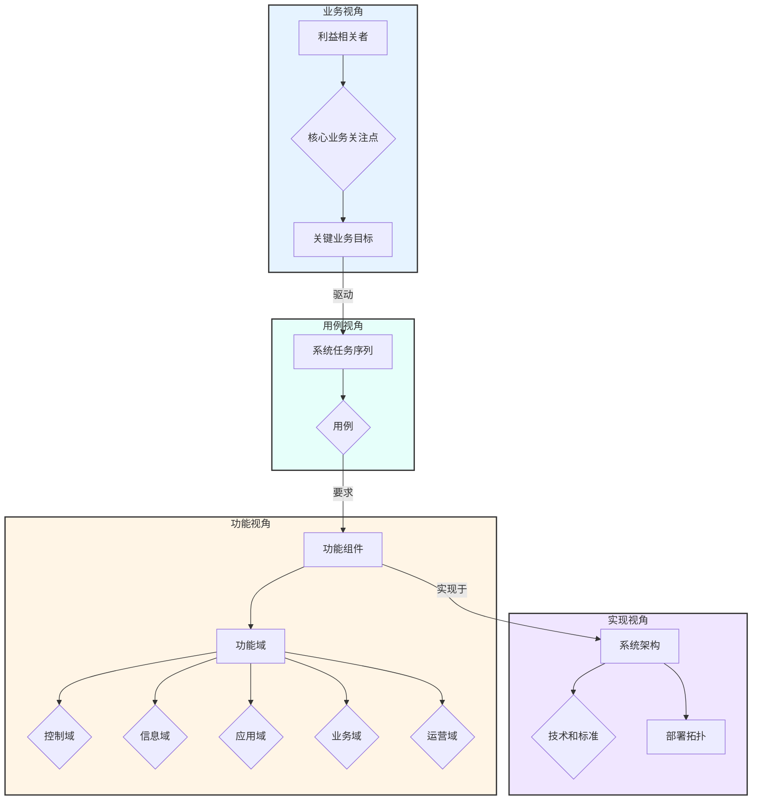

# 工业物联网(IIoT)参考架构形式化分析

## 1. 摘要

本报告对工业物联网(IIoT)的参考架构进行形式化分析，重点关注工业互联网联盟(IIC)发布的工业互联网参考架构(IIRA)。报告首先提供IIoT系统的形式化定义，然后详细剖析IIRA的四个核心视角（业务、用例、功能、实现），并建立它们之间的数学关系。最后，报告通过一个预测性维护的案例，展示了该架构在实际应用中的价值，并提供了关键组件的Rust代码实现思路。

## 2. 引言

工业物联网(IIoT)是物联网在工业领域的延伸，强调机器、设备与控制系统之间的高可靠性、低延迟和高安全性通信。建立一个标准化的参考架构对于指导IIoT系统的设计、开发和部署至关重要。工业互联网参考架构(IIRA)是目前业界广泛认可的模型之一，它提供了一套通用的词汇、概念和框架。本报告的目标是为IIRA提供一个形式化的基础，以增强其精确性、一致性和可验证性。

## 3. 形式化定义

**定义 1 (工业物联网系统 - IIoT System)**

一个工业物联网系统是一个八元组 $\mathcal{S}_{IIoT} = (\mathcal{D}, \mathcal{C}, \mathcal{N}, \mathcal{P}, \mathcal{S}, \mathcal{A}, \mathcal{T}_{const}, \mathcal{Q}_{req})$，其中：

- $\mathcal{D}$ (Devices): 工业设备集合，包括传感器、执行器、PLC等。
- $\mathcal{C}$ (Controls): 控制系统集合，负责执行实时控制逻辑。
- $\mathcal{N}$ (Network): 网络基础设施，支持确定性和非确定性通信。
- $\mathcal{P}$ (Platform): IIoT平台，提供数据处理、存储和分析能力。
- $\mathcal{S}$ (Security): 安全策略与机制集合。
- $\mathcal{A}$ (Application): 工业应用与业务逻辑。
- $\mathcal{T}_{const}$ (Time Constraints): 时间约束集合，如延迟、抖动等。
- $\mathcal{Q}_{req}$ (QoS Requirements): 服务质量需求集合，如可靠性、可用性。

**定义 2 (工业互联网参考架构 - IIRA)**

IIRA可以形式化地描述为一个映射关系 $\mathcal{F}_{IIRA}$，它将一组业务目标 $\mathcal{O}_{biz}$ 映射到一个具体的实现架构 $\mathcal{A}_{impl}$。

$\mathcal{F}_{IIRA}: \mathcal{O}_{biz} \rightarrow \mathcal{A}_{impl}$

该映射通过四个视角(Viewpoint)来逐步细化：

$\mathcal{F}_{IIRA} = V_{impl} \circ V_{func} \circ V_{usage} \circ V_{biz}$

其中 `∘` 表示函数的复合。

- $V_{biz}$: **业务视角 (Business Viewpoint)**，关注于系统的商业价值和投资回报。
- $V_{usage}$: **用例视角 (Usage Viewpoint)**，描述系统如何被使用以实现业务目标。
- $V_{func}$: **功能视角 (Functional Viewpoint)**，定义系统需要具备的功能组件。
- $V_{impl}$: **实现视角 (Implementation Viewpoint)**，描述系统如何通过具体技术和组件实现。

## 4. IIRA核心视角的形式化分析

### 4.1 业务视角 (Business Viewpoint)

业务视角关注系统的利益相关者(Stakeholders)和他们的核心业务关注点(Business Concerns)。

**定义 3 (业务视角模型)**

业务视角模型是一个三元组 $M_{biz} = (S, C_{biz}, V_{map})$，其中：

- $S$ 是利益相关者集合。
- $C_{biz}$ 是业务关注点集合，如效率、安全、成本等。
- $V_{map}: S \rightarrow 2^{C_{biz}}$ 是一个映射，将每个利益相关者映射到他们所关注的业务点集合。

### 4.2 用例视角 (Usage Viewpoint)

用例视角定义了系统为实现业务目标而执行的任务序列。

**定义 4 (用例模型)**

一个用例 $\mathcal{U}$ 是一个元组 $\mathcal{U} = (\text{ID}, \text{Actors}, \text{Precond}, \text{Tasks}, \text{Postcond})$，其中：

- $\text{ID}$: 用例的唯一标识。
- $\text{Actors} \subseteq S$: 参与该用例的利益相关者。
- $\text{Precond}$: 执行任务前必须满足的前置条件集合。
- $\text{Tasks}$: 一个有序的任务序列 $(t_1, t_2, ..., t_n)$。
- $\text{Postcond}$: 任务完成后系统所处的状态或结果。

### 4.3 功能视角 (Functional Viewpoint)

功能视角将用例中的任务映射到具体的功能组件上。IIRA定义了五个功能域(Functional Domains)。

**定义 5 (功能视角模型)**

功能视角模型是一个三元组 $M_{func} = (D_{func}, C_{func}, F_{map})$，其中：

- $D_{func} = \{d_1, ..., d_5\}$ 是五个功能域的集合：
    - $d_1$: 控制域 (Control Domain)
    - $d_2$: 信息域 (Information Domain)
    - $d_3$: 应用域 (Application Domain)
    - $d_4$: 业务域 (Business Domain)
    - $d_5$: 运营域 (Operations Domain)
- $C_{func}$ 是功能组件集合。
- $F_{map}: C_{func} \rightarrow D_{func}$ 将每个功能组件映射到其所属的功能域。

**定义 6 (任务到功能的映射)**

存在一个映射 $\mathcal{M}_{task \rightarrow func}: \text{Tasks} \rightarrow 2^{C_{func}}$，它将每个任务映射到执行该任务所需的功能组件集合。

### 4.4 实现视角 (Implementation Viewpoint)

实现视角描述了功能组件如何通过技术、软件和硬件来实现，并如何部署。

**定义 7 (实现视角模型)**

实现视角模型是一个四元组 $M_{impl} = (A_{arch}, T_{stack}, P_{pattern}, D_{deploy})$，其中：

- $A_{arch}$ 是系统架构，定义了组件的分布和交互方式 (例如，三层架构)。
- $T_{stack}$ 是技术栈集合，如操作系统、数据库、通信协议等。
- $P_{pattern}$ 是架构模式集合，如微服务、事件驱动等。
- $D_{deploy}$ 是部署策略，描述了组件在物理或虚拟节点上的分布。

## 5. IIRA架构图



## 6. 案例研究：基于IIRA的预测性维护系统

我们通过一个预测性维护的案例来展示IIRA的应用。

- **业务目标**: 减少设备意外停机时间，提高生产效率，降低维护成本。
- **用例**: 
    1. 实时收集设备振动和温度数据。
    2. 在边缘节点进行初步数据清洗和特征提取。
    3. 将处理后的数据发送到云平台。
    4. 云平台使用机器学习模型预测设备故障概率。
    5. 当概率超过阈值时，自动生成维护工单并通知运维人员。
- **功能组件**:
    - **控制域**: 传感器接口、数据采集器。
    - **信息域**: 数据存储、数据转换、机器学习模型训练与推理。
    - **应用域**: 预测分析应用、仪表盘。
    - **业务域**: 工单管理系统、企业资源规划(ERP)集成。
    - **运营域**: 设备管理、模型部署与更新。
- **实现架构**:
    - **架构**: 采用分层架构（边缘层、平台层、企业层）。
    - **技术栈**:
        - **边缘**: Rust (数据采集), WebAssembly (特征提取), MQTT (通信)。
        - **平台**: Kafka (消息队列), InfluxDB (时序数据库), Rust/Python (ML模型), gRPC (微服务通信)。
        - **企业**: REST API (集成)。
    - **部署**: 边缘节点部署在工厂现场，平台层部署在云端。

## 7. Rust代码实现思路

下面我们提供一个关键功能组件的Rust代码实现思路：边缘节点的数据处理。

```rust
use serde::{Deserialize, Serialize};
use std::time::{SystemTime, UNIX_EPOCH};

// 原始传感器数据结构
#[derive(Serialize, Deserialize, Debug)]
struct SensorData {
    device_id: String,
    temperature: f32,
    vibration: f32,
    timestamp: u64,
}

// 经过边缘计算处理后的特征数据
#[derive(Serialize, Deserialize, Debug)]
struct FeatureData {
    device_id: String,
    temp_rolling_avg: f32,
    vibration_peak: f32,
    timestamp: u64,
}

// 边缘处理逻辑接口
trait EdgeProcessor {
    fn process(&self, data: SensorData) -> Result<FeatureData, &'static str>;
}

// 一个简单的边缘处理器实现
struct SimpleEdgeProcessor {
    window_size: usize,
    temp_buffer: Vec<f32>,
}

impl SimpleEdgeProcessor {
    fn new(window_size: usize) -> Self {
        SimpleEdgeProcessor {
            window_size,
            temp_buffer: Vec::with_capacity(window_size),
        }
    }
}

impl EdgeProcessor for SimpleEdgeProcessor {
    fn process(&mut self, data: SensorData) -> Result<FeatureData, &'static str> {
        if data.temperature < 0.0 || data.temperature > 200.0 {
            return Err("Invalid temperature reading");
        }

        self.temp_buffer.push(data.temperature);
        if self.temp_buffer.len() > self.window_size {
            self.temp_buffer.remove(0);
        }

        let temp_avg = self.temp_buffer.iter().sum::<f32>() / self.temp_buffer.len() as f32;

        // 在实际应用中，这里会有更复杂的特征提取算法
        let vibration_peak = data.vibration; 

        Ok(FeatureData {
            device_id: data.device_id,
            temp_rolling_avg: temp_avg,
            vibration_peak,
            timestamp: data.timestamp,
        })
    }
}

fn main() {
    let mut processor = SimpleEdgeProcessor::new(10);

    let raw_data = SensorData {
        device_id: "CNC-001".to_string(),
        temperature: 85.5,
        vibration: 1.2,
        timestamp: SystemTime::now().duration_since(UNIX_EPOCH).unwrap().as_secs(),
    };

    match processor.process(raw_data) {
        Ok(features) => {
            println!("Processed features: {:?}", features);
            // 在这里，features可以被序列化并通过MQTT发送到云平台
        }
        Err(e) => {
            eprintln!("Error processing data: {}", e);
        }
    }
}
```

## 8. 结论

本报告通过引入形式化方法，为工业互联网参考架构(IIRA)提供了一个更严谨的分析框架。我们展示了如何将业务目标通过四个核心视角（业务、用例、功能、实现）系统地映射到具体的技术实现上。通过形式化定义和案例研究，我们阐明了IIRA在指导复杂IIoT系统设计中的核心价值。

未来的工作可以集中在以下几个方面：
1.  **扩展形式化模型**: 将网络、安全和时间约束等关键跨领域问题更深入地整合到形式化模型中。
2.  **模型验证**: 使用模型检测或定理证明工具来自动验证基于IIRA设计的系统是否满足特定的业务或安全需求。
3.  **代码生成**: 研究从高层功能描述自动生成部分实现代码框架的可能性，以提高开发效率。

---
**参考文献**

- Industrial Internet Consortium, "The Industrial Internet Reference Architecture", 2017.
- Object Management Group (OMG), "Unified Modeling Language (UML)", Version 2.5.1.
- E. A. Lee, "The Past, Present, and Future of Cyber-Physical Systems: A Focus on Models", 2015. 