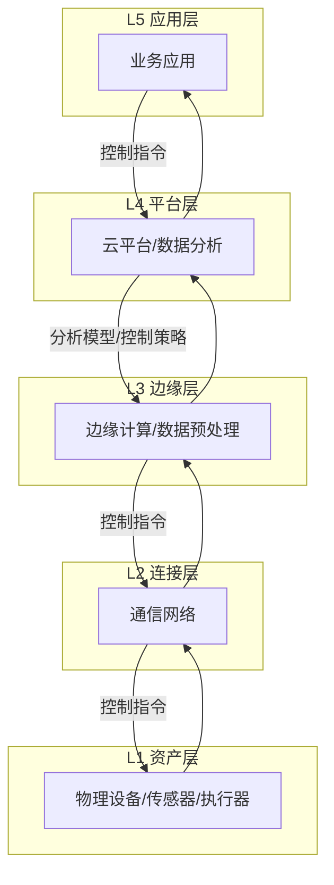
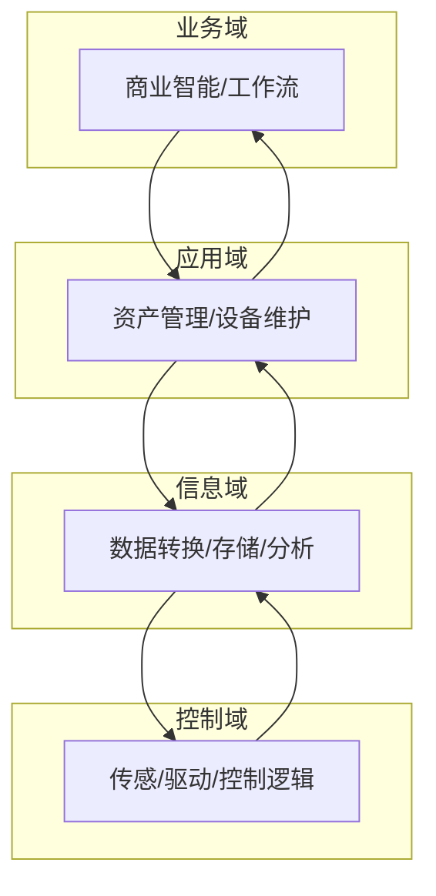

# 工业物联网参考架构形式化分析

## 目录

- [工业物联网参考架构形式化分析](#工业物联网参考架构形式化分析)
  - [目录](#目录)
  - [1. 引言](#1-引言)
  - [2. 工业物联网(IIoT)系统形式化定义](#2-工业物联网iiot系统形式化定义)
    - [2.1 核心系统模型](#21-核心系统模型)
    - [2.2 分层架构模型](#22-分层架构模型)
  - [3. IIRA参考架构的形式化视图](#3-iira参考架构的形式化视图)
    - [3.1 业务视图 (Business Viewpoint)](#31-业务视图-business-viewpoint)
    - [3.2 用例视图 (Usage Viewpoint)](#32-用例视图-usage-viewpoint)
    - [3.3 功能视图 (Functional Viewpoint)](#33-功能视图-functional-viewpoint)
    - [3.4 实现视图 (Implementation Viewpoint)](#34-实现视图-implementation-viewpoint)
  - [4. 核心功能组件形式化分析](#4-核心功能组件形式化分析)
    - [4.1 控制组件 (Control Domain)](#41-控制组件-control-domain)
    - [4.2 信息组件 (Information Domain)](#42-信息组件-information-domain)
    - [4.3 应用组件 (Application Domain)](#43-应用组件-application-domain)
    - [4.4 数字孪生模型 (Digital Twin)](#44-数字孪生模型-digital-twin)
  - [5. 安全与通信模型](#5-安全与通信模型)
    - [5.1 通信模型](#51-通信模型)
    - [5.2 安全模型](#52-安全模型)
  - [6. 案例研究：CNC设备的预测性维护](#6-案例研究cnc设备的预测性维护)
    - [6.1 场景定义](#61-场景定义)
    - [6.2 模型应用](#62-模型应用)
  - [7. 实现框架参考](#7-实现框架参考)
    - [7.1 Rust实现框架](#71-rust实现框架)
    - [7.2 Go实现框架](#72-go实现框架)
  - [8. 结论与展望](#8-结论与展望)

## 1. 引言

工业物联网(IIoT)是链接物理工业资产与数字世界的关键技术，是实现工业4.0和智能制造的基石。为了确保IIoT系统的互操作性、可靠性和安全性，需要一个标准化的参考架构。工业互联网参考架构(IIRA)为此提供了业界公认的框架。本文旨在对IIRA进行形式化分析，通过建立严格的数学模型来描述其核心视图、功能组件和内在关系，并为系统实现提供基于Rust和Go的参考框架。

## 2. 工业物联网(IIoT)系统形式化定义

### 2.1 核心系统模型

**定义 2.1 (工业物联网系统)**
一个IIoT系统可以形式化地定义为一个七元组 $\mathcal{S}_{IIoT} = (\mathcal{A}, \mathcal{N}, \mathcal{E}, \mathcal{P}, \mathcal{D}, \mathcal{U}, \mathcal{C})$，其中：

- $\mathcal{A}$ (Assets): 物理资产集合，包括传感器、执行器、PLC、机器人等。
- $\mathcal{N}$ (Network): 网络连接集合，定义了资产、系统之间的通信协议和拓扑。
- $\mathcal{E}$ (Edge): 边缘节点集合，提供边缘计算能力。
- $\mathcal{P}$ (Platform): 云平台集合，提供数据存储、分析和应用托管服务。
- $\mathcal{D}$ (Data): 系统中流动和存储的数据集合。
- $\mathcal{U}$ (Users): 用户和角色集合，包括操作员、工程师、管理者等。
- $\mathcal{C}$ (Control): 控制流集合，描述了系统的决策和执行逻辑。

### 2.2 分层架构模型

IIoT系统通常被划分为不同的功能层次，以管理其复杂性。



**定义 2.2 (分层模型)**
IIoT的分层架构 $\mathcal{L}$ 是一个有序集合 $\mathcal{L} = (L_{Asset}, L_{Conn}, L_{Edge}, L_{Platform}, L_{App})$。各层之间存在数据流 $\Phi_{data}: L_i \rightarrow L_{i+1}$ 和控制流 $\Phi_{ctrl}: L_{i+1} \rightarrow L_i$。

## 3. IIRA参考架构的形式化视图

IIRA通过四个视图来描述IIoT系统的不同方面。

### 3.1 业务视图 (Business Viewpoint)

关注系统的商业价值和投资回报。
**定义 3.1 (业务视图)**
业务视图 $\mathcal{V}_{Biz} = (\mathcal{S}, \mathcal{V}, \mathcal{K}, \mathcal{C}, f_{ROI})$，其中：

- $\mathcal{S}$ (Stakeholders): 关键利益相关者集合。
- $\mathcal{V}$ (Values): 系统期望创造的核心价值，如提升效率、降低成本。
- $\mathcal{K}$ (KPIs): 关键绩效指标集合，用于量化价值。
- $\mathcal{C}$ (Costs): 系统的总拥有成本。
- $f_{ROI}: (\mathcal{V}, \mathcal{K}, \mathcal{C}) \rightarrow \mathbb{R}$ 是计算投资回报率的函数。

### 3.2 用例视图 (Usage Viewpoint)

描述系统如何被使用以实现业务目标。
**定义 3.2 (用例视图)**
用例视图 $\mathcal{V}_{Use} = (\mathcal{U}, \mathcal{T}, \mathcal{Seq}, Pre, Post)$，其中：

- $\mathcal{U}$ (Users): 参与者集合。
- $\mathcal{T}$ (Tasks): 系统执行的任务序列，如"监控设备状态"、"执行远程诊断"。
- $\mathcal{Seq}: \mathcal{T} \rightarrow (\mathcal{A} \cup \mathcal{U})^*$ 是将任务映射到一系列动作的函数。
- $Pre, Post$ 分别是任务执行的前置和后置条件集合。

### 3.3 功能视图 (Functional Viewpoint)

关注系统的功能组件及其相互关系。
**定义 3.3 (功能视图)**
功能视图 $\mathcal{V}_{Func} = (\mathcal{D}_{Func}, \mathcal{R}_{Func}, \Phi_{Data}, \Phi_{Ctrl})$，其中：

- $\mathcal{D}_{Func}$ 是功能域的集合，$\mathcal{D}_{Func} = \{D_{Ctrl}, D_{Info}, D_{App}, D_{Biz}\}$。
- $\mathcal{R}_{Func}$ 是功能组件间的关系集合。
- $\Phi_{Data}, \Phi_{Ctrl}$ 分别是组件间的数据流和控制流。



### 3.4 实现视图 (Implementation Viewpoint)

描述实现功能视图所需的技术和系统架构。
**定义 3.4 (实现视图)**
实现视图 $\mathcal{V}_{Impl} = (\mathcal{L}, \mathcal{H}, \mathcal{S}, \mathcal{T}_{Proto}, M_{Dep})$，其中：

- $\mathcal{L}$ 是分层架构模型。
- $\mathcal{H}$ (Hardware): 硬件组件集合。
- $\mathcal{S}$ (Software): 软件组件集合。
- $\mathcal{T}_{Proto}$ (Protocols): 通信协议栈。
- $M_{Dep}: \mathcal{V}_{Func} \rightarrow (\mathcal{H} \times \mathcal{S})$ 是从功能到具体软硬件实现的部署映射。

## 4. 核心功能组件形式化分析

### 4.1 控制组件 (Control Domain)

**定义 4.1 (控制回路)**
一个控制回路是一个函数 $\mathcal{CL}: S_{state} \times S_{target} \rightarrow A_{ctrl}$，其中：

- $S_{state}$ 是从传感器获取的当前状态。
- $S_{target}$ 是目标状态。
- $A_{ctrl}$ 是计算出的控制动作，将被发送到执行器。

### 4.2 信息组件 (Information Domain)

**定义 4.2 (数据处理管道)**
数据处理管道是一个函数组合 $P_{data} = f_n \circ \dots \circ f_2 \circ f_1$，其中每个 $f_i$ 是一个处理函数（如过滤、转换、聚合、分析）。

### 4.3 应用组件 (Application Domain)

**定义 4.3 (应用服务)**
应用服务 $A_s$ 是一个函数 $A_s: D_{Info} \times D_{Biz} \rightarrow R_{Action}$，它利用信息域的数据和业务域的逻辑来产生有价值的业务行动或洞察 $R_{Action}$。

### 4.4 数字孪生模型 (Digital Twin)

**定义 4.4 (工业数字孪生)**
工业数字孪生 $\mathcal{DT}$ 是一个六元组 $\mathcal{DT} = (\mathcal{M}_{phy}, \mathcal{M}_{vir}, \mathcal{D}_{sync}, \mathcal{S}_{serv}, \mathcal{A}_{analy}, \mathcal{I}_{if})$，其中：

- $\mathcal{M}_{phy}$ 是物理实体。
- $\mathcal{M}_{vir}$ 是物理实体的虚拟模型。
- $\mathcal{D}_{sync}$ 是双向同步数据流。
- $\mathcal{S}_{serv}$ 是基于模型提供的服务（如状态监控、模拟）。
- $\mathcal{A}_{analy}$ 是分析与预测算法集合。
- $\mathcal{I}_{if}$ 是交互接口。

## 5. 安全与通信模型

### 5.1 通信模型

**定义 5.1 (通信协议栈)**
$\mathcal{T}_{Proto} = (T_{Fieldbus}, T_{Ethernet}, T_{Msg}, T_{App})$，其中：

- $T_{Fieldbus}$: 现场总线协议 (Modbus, Profibus)。
- $T_{Ethernet}$: 实时以太网 (EtherCAT, Profinet)。
- $T_{Msg}$: 消息传输协议 (MQTT, OPC UA, AMQP)。
- $T_{App}$: 应用协议 (HTTP/REST)。

### 5.2 安全模型

**定义 5.2 (零信任安全模型)**
基于IIRA的安全模型可采用零信任原则，定义为一个四元组 $\mathcal{S}_{ZT} = (S_{ubject}, R_{esource}, P_{olicy}, E_{nforcement})$，其中：

- $S_{ubject}$: 访问主体（用户或设备）。
- $R_{esource}$: 被访问的资源。
- $P_{olicy}$: 动态访问控制策略。
- $E_{nforcement}$: 策略执行点，持续验证每次访问。

## 6. 案例研究：CNC设备的预测性维护

### 6.1 场景定义

- **业务目标**: 最小化CNC设备的意外停机时间，降低维护成本。
- **用例**: 1. 实时采集主轴振动和温度数据。 2. 在边缘节点进行数据预处理。 3. 在云平台使用机器学习模型预测剩余使用寿命(RUL)。 4. 当RUL低于阈值时，自动创建维护工单。

### 6.2 模型应用

- **功能视图**: 控制域（传感器采集）、信息域（边缘预处理、云端ML模型）、应用域（工单系统集成）。
- **数字孪生**: 创建CNC主轴的数字孪生，其虚拟模型包含物理磨损模型。实时数据流 $\mathcal{D}_{sync}$ 不断更新孪生状态。预测算法 $\mathcal{A}_{analy}$ 在孪生模型上运行，估算RUL。

## 7. 实现框架参考

### 7.1 Rust实现框架

Rust的性能、安全性和并发模型使其非常适合构建IIoT的边缘和平台组件。

```rust
// 数字孪生核心结构
pub struct DigitalTwin {
    pub physical_asset_id: String,
    pub virtual_state: AssetState,
    predictor: Box<dyn RulPredictor>,
}

// 资产状态
pub struct AssetState {
    pub vibration: f64,
    pub temperature: f64,
    pub timestamp: u64,
}

// 剩余使用寿命(RUL)预测器特质
pub trait RulPredictor {
    fn predict(&self, state: &AssetState) -> f64;
}

impl DigitalTwin {
    // 从物理世界同步数据
    pub fn sync_data(&mut self, new_state: AssetState) {
        self.virtual_state = new_state;
    }

    // 执行预测
    pub fn estimate_rul(&self) -> f64 {
        self.predictor.predict(&self.virtual_state)
    }
}
```

### 7.2 Go实现框架

Go的简洁性和强大的云原生生态使其成为构建IIoT平台服务的绝佳选择。

```go
// DigitalTwin 数字孪生核心结构
type DigitalTwin struct {
 PhysicalAssetID string
 VirtualState    AssetState
 Predictor       RulPredictor
 stateChan       chan AssetState
}

// AssetState 资产状态
type AssetState struct {
 Vibration float64
 Temperature float64
 Timestamp int64
}

// RulPredictor 剩余使用寿命(RUL)预测器接口
type RulPredictor interface {
 Predict(state AssetState) float64
}

// NewDigitalTwin 创建并运行一个数字孪生实例
func NewDigitalTwin(assetID string, predictor RulPredictor) *DigitalTwin {
 dt := &DigitalTwin{
  PhysicalAssetID: assetID,
  Predictor:       predictor,
  stateChan:       make(chan AssetState, 100),
 }
 go dt.run() // 启动后台任务处理状态更新和预测
 return dt
}

// 后台运行的goroutine
func (dt *DigitalTwin) run() {
 for state := range dt.stateChan {
  dt.VirtualState = state
  rul := dt.Predictor.Predict(state)
  fmt.Printf("Asset %s - RUL Estimate: %.2f hours\n", dt.PhysicalAssetID, rul)
 }
}

// SyncData 外部接口，用于同步数据
func (dt *DigitalTwin) SyncData(newState AssetState) {
 dt.stateChan <- newState
}
```

## 8. 结论与展望

本文通过引入形式化方法和数学模型，对工业物联网参考架构（特别是IIRA）进行了系统性分析。我们定义了覆盖业务、用例、功能和实现四大视图的形式化模型，并对数字孪生等核心组件进行了深入探讨。这为设计和验证复杂IIoT系统提供了严谨的理论基础。

未来的研究方向包括：

1. **可组合性理论**: 研究如何形式化地保证不同厂商的IIoT组件可以安全、可靠地组合。
2. **AI驱动的自适应控制**: 探索能够根据实时数据流自我优化的控制理论与模型。
3. **端到端安全验证**: 使用形式化验证工具（如TLA+, Coq）来证明整个IIoT系统端到端安全策略的完备性。
