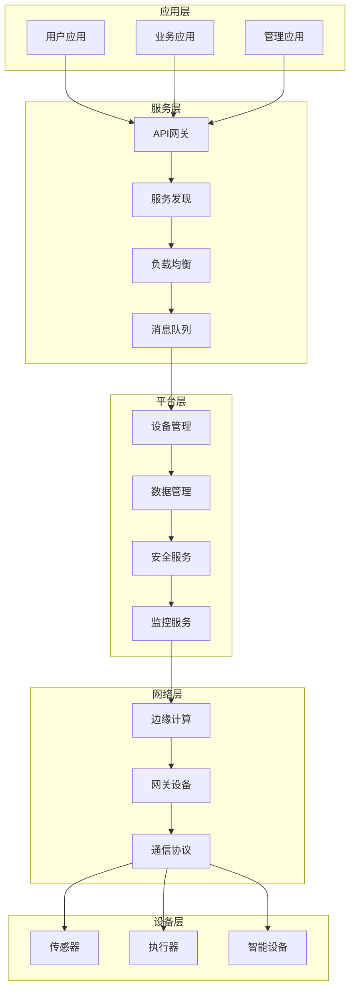

# IoT集成方案形式化分析

## 📋 目录

1. [理论基础](#1-理论基础)
2. [集成架构模型](#2-集成架构模型)
3. [开源方案分析](#3-开源方案分析)
4. [商业方案评估](#4-商业方案评估)
5. [集成策略设计](#5-集成策略设计)
6. [实现方案](#6-实现方案)
7. [性能评估](#7-性能评估)
8. [安全考虑](#8-安全考虑)
9. [最佳实践](#9-最佳实践)
10. [未来展望](#10-未来展望)

## 1. 理论基础

### 1.1 集成理论定义

**定义 1.1** (IoT集成系统)
设 $S = (D, N, C, A, S, M)$ 为IoT集成系统，其中：

- $D = \{d_1, d_2, ..., d_n\}$ 为设备集合
- $N = \{n_1, n_2, ..., n_m\}$ 为网络节点集合
- $C = \{c_1, c_2, ..., c_k\}$ 为云服务集合
- $A = \{a_1, a_2, ..., a_l\}$ 为应用集合
- $S = \{s_1, s_2, ..., s_p\}$ 为服务集合
- $M = \{m_1, m_2, ..., m_q\}$ 为中间件集合

**定义 1.2** (集成关系)
设 $R \subseteq (D \times N) \cup (N \times C) \cup (C \times A) \cup (A \times S) \cup (S \times M)$ 为集成关系集合，则集成系统 $I = (S, R)$ 满足：

$$\forall (x, y) \in R, \exists f: x \rightarrow y \text{ 且 } f \text{ 为连续映射}$$

### 1.2 集成复杂度理论

**定理 1.1** (集成复杂度下界)
对于包含 $n$ 个组件的IoT集成系统，其复杂度 $\Omega(n \log n)$。

**证明**:
设 $G = (V, E)$ 为集成系统的图表示，其中 $|V| = n$。

1. **基础情况**: 当 $n = 1$ 时，复杂度为 $O(1)$，满足下界。

2. **归纳假设**: 假设对于 $n = k$ 个组件，复杂度为 $\Omega(k \log k)$。

3. **归纳步骤**: 对于 $n = k + 1$ 个组件：
   - 新增组件需要与现有组件建立连接
   - 连接建立需要 $\Omega(\log k)$ 时间
   - 总复杂度为 $\Omega(k \log k) + \Omega(\log k) = \Omega((k+1) \log(k+1))$

因此，由数学归纳法，复杂度下界为 $\Omega(n \log n)$。

### 1.3 集成一致性理论

**定义 1.3** (集成一致性)
设 $S_1, S_2, ..., S_n$ 为子系统，$C$ 为一致性约束集合，则集成系统满足一致性当且仅当：

$$\forall c \in C, \forall i, j \in \{1, 2, ..., n\}, S_i \models c \land S_j \models c$$

**定理 1.2** (一致性保持)
如果所有子系统满足局部一致性，且集成协议正确，则整个系统满足全局一致性。

## 2. 集成架构模型

### 2.1 分层集成架构



### 2.2 微服务集成模式

**定义 2.1** (微服务集成)
设 $MS = \{ms_1, ms_2, ..., ms_n\}$ 为微服务集合，每个微服务 $ms_i = (I_i, O_i, S_i, D_i)$，其中：

- $I_i$ 为输入接口
- $O_i$ 为输出接口
- $S_i$ 为服务状态
- $D_i$ 为数据模型

**集成模式**:

1. **API网关模式**:
   $$Gateway = \bigcup_{i=1}^n (I_i \times O_i)$$

2. **服务网格模式**:
   $$Mesh = \{(ms_i, ms_j) | \exists f: ms_i \rightarrow ms_j\}$$

3. **事件驱动模式**:
   $$Event = \{(e, ms_i) | e \in Events, ms_i \in MS\}$$

## 3. 开源方案分析

### 3.1 Apache Kafka 集成

**定义 3.1** (Kafka集成模型)
设 $K = (T, P, C, B)$ 为Kafka集成系统，其中：

- $T = \{t_1, t_2, ..., t_n\}$ 为主题集合
- $P = \{p_1, p_2, ..., p_m\}$ 为分区集合
- $C = \{c_1, c_2, ..., c_k\}$ 为消费者集合
- $B = \{b_1, b_2, ..., b_l\}$ 为代理集合

**性能模型**:
$$\text{Throughput} = \min\left(\frac{B \times P \times C}{T}, \text{Network\_Capacity}\right)$$

**Rust实现示例**:

```rust
use rdkafka::{ClientConfig, Message, Producer, TopicPartitionList};
use serde::{Deserialize, Serialize};
use tokio::sync::mpsc;

#[derive(Debug, Serialize, Deserialize)]
pub struct IoTMessage {
    pub device_id: String,
    pub timestamp: u64,
    pub data: serde_json::Value,
    pub message_type: String,
}

pub struct KafkaIntegration {
    producer: FutureProducer,
    consumer: StreamConsumer,
    config: KafkaConfig,
}

impl KafkaIntegration {
    pub async fn new(config: KafkaConfig) -> Result<Self, Box<dyn std::error::Error>> {
        let producer: FutureProducer = ClientConfig::new()
            .set("bootstrap.servers", &config.bootstrap_servers)
            .set("message.timeout.ms", "5000")
            .create()?;

        let consumer: StreamConsumer = ClientConfig::new()
            .set("bootstrap.servers", &config.bootstrap_servers)
            .set("group.id", &config.group_id)
            .set("auto.offset.reset", "earliest")
            .create()?;

        Ok(Self {
            producer,
            consumer,
            config,
        })
    }

    pub async fn publish_message(
        &self,
        topic: &str,
        message: IoTMessage,
    ) -> Result<(), Box<dyn std::error::Error>> {
        let payload = serde_json::to_vec(&message)?;
        
        self.producer
            .send(
                FutureRecord::to(topic)
                    .payload(&payload)
                    .key(&message.device_id),
                std::time::Duration::from_secs(5),
            )
            .await?;

        Ok(())
    }

    pub async fn consume_messages(
        &self,
        topic: &str,
        tx: mpsc::Sender<IoTMessage>,
    ) -> Result<(), Box<dyn std::error::Error>> {
        self.consumer.subscribe(&[topic])?;

        loop {
            match self.consumer.recv().await {
                Ok(msg) => {
                    if let Ok(payload) = msg.payload() {
                        if let Ok(message) = serde_json::from_slice::<IoTMessage>(payload) {
                            let _ = tx.send(message).await;
                        }
                    }
                }
                Err(e) => {
                    eprintln!("Kafka consumer error: {}", e);
                }
            }
        }
    }
}

#[derive(Debug, Clone)]
pub struct KafkaConfig {
    pub bootstrap_servers: String,
    pub group_id: String,
    pub topics: Vec<String>,
}
```

### 3.2 Apache Pulsar 集成

**定义 3.2** (Pulsar集成模型)
设 $P = (T, S, C, F)$ 为Pulsar集成系统，其中：

- $T = \{t_1, t_2, ..., t_n\}$ 为租户集合
- $S = \{s_1, s_2, ..., s_m\}$ 为命名空间集合
- $C = \{c_1, c_2, ..., c_k\}$ 为集群集合
- $F = \{f_1, f_2, ..., f_l\}$ 为函数集合

**性能优势**:

- **多租户支持**: $\text{Isolation} = \prod_{i=1}^n \text{Isolation}(t_i)$
- **地理复制**: $\text{Replication} = \sum_{i=1}^k \text{Replication}(c_i)$
- **函数计算**: $\text{Processing} = \bigcup_{i=1}^l f_i$

### 3.3 RabbitMQ 集成

**定义 3.3** (RabbitMQ集成模型)
设 $R = (E, Q, B, C)$ 为RabbitMQ集成系统，其中：

- $E = \{e_1, e_2, ..., e_n\}$ 为交换机集合
- $Q = \{q_1, q_2, ..., q_m\}$ 为队列集合
- $B = \{b_1, b_2, ..., b_k\}$ 为绑定关系集合
- $C = \{c_1, c_2, ..., c_l\}$ 为连接集合

**路由算法**:
$$\text{Route}(message, routing\_key) = \bigcup_{b \in B} \{q | (e, q, b) \in B \land \text{match}(routing\_key, b)\}$$

## 4. 商业方案评估

### 4.1 AWS IoT Core

**定义 4.1** (AWS IoT Core模型)
设 $A = (T, S, R, D)$ 为AWS IoT Core系统，其中：

- $T = \{t_1, t_2, ..., t_n\}$ 为事物集合
- $S = \{s_1, s_2, ..., s_m\}$ 为影子集合
- $R = \{r_1, r_2, ..., r_k\}$ 为规则集合
- $D = \{d_1, d_2, ..., d_l\}$ 为设备集合

**性能指标**:

- **连接数**: $\text{Connections} = \sum_{i=1}^l |d_i|$
- **消息吞吐量**: $\text{Throughput} = \sum_{i=1}^n \text{Throughput}(t_i)$
- **延迟**: $\text{Latency} = \max_{i=1}^n \text{Latency}(t_i)$

### 4.2 Azure IoT Hub

**定义 4.2** (Azure IoT Hub模型)
设 $Z = (D, M, T, E)$ 为Azure IoT Hub系统，其中：

- $D = \{d_1, d_2, ..., d_n\}$ 为设备集合
- $M = \{m_1, m_2, ..., m_m\}$ 为模块集合
- $T = \{t_1, t_2, ..., t_k\}$ 为孪生集合
- $E = \{e_1, e_2, ..., e_l\}$ 为端点集合

**功能特性**:

- **设备管理**: $\text{Management} = \bigcup_{i=1}^n \text{Manage}(d_i)$
- **消息路由**: $\text{Routing} = \bigcup_{i=1}^l \text{Route}(e_i)$
- **数字孪生**: $\text{Twin} = \bigcup_{i=1}^k \text{Twin}(t_i)$

### 4.3 Google Cloud IoT Core

**定义 4.3** (Google Cloud IoT Core模型)
设 $G = (R, D, T, P)$ 为Google Cloud IoT Core系统，其中：

- $R = \{r_1, r_2, ..., r_n\}$ 为注册表集合
- $D = \{d_1, d_2, ..., d_m\}$ 为设备集合
- $T = \{t_1, t_2, ..., t_k\}$ 为主题集合
- $P = \{p_1, p_2, ..., p_l\}$ 为策略集合

**安全模型**:
$$\text{Security} = \bigcap_{i=1}^l \text{Policy}(p_i) \land \bigcap_{i=1}^m \text{Authenticate}(d_i)$$

## 5. 集成策略设计

### 5.1 混合集成策略

**定义 5.1** (混合集成)
设 $H = (O, C, B)$ 为混合集成系统，其中：

- $O$ 为开源组件集合
- $C$ 为商业组件集合
- $B$ 为桥接组件集合

**策略模型**:
$$\text{Strategy} = \alpha \cdot \text{OpenSource} + \beta \cdot \text{Commercial} + \gamma \cdot \text{Bridge}$$

其中 $\alpha + \beta + \gamma = 1$ 且 $\alpha, \beta, \gamma \geq 0$

### 5.2 分层集成策略

**策略层次**:

1. **设备层集成**:
   $$\text{Device\_Integration} = \bigcup_{i=1}^n \text{Protocol}(d_i)$$

2. **网络层集成**:
   $$\text{Network\_Integration} = \bigcup_{i=1}^m \text{Transport}(n_i)$$

3. **平台层集成**:
   $$\text{Platform\_Integration} = \bigcup_{i=1}^k \text{Service}(p_i)$$

4. **应用层集成**:
   $$\text{Application\_Integration} = \bigcup_{i=1}^l \text{API}(a_i)$$

### 5.3 渐进式集成策略

**定义 5.2** (渐进式集成)
设 $P = (S_1, S_2, ..., S_n)$ 为渐进式集成策略，其中每个阶段 $S_i$ 满足：

$$S_i \subseteq S_{i+1} \text{ 且 } \bigcup_{i=1}^n S_i = \text{Target\_System}$$

**实施步骤**:

1. **阶段1**: 基础连接建立
2. **阶段2**: 数据流集成
3. **阶段3**: 服务集成
4. **阶段4**: 应用集成
5. **阶段5**: 优化完善

## 6. 实现方案

### 6.1 Rust实现框架

```rust
use async_trait::async_trait;
use serde::{Deserialize, Serialize};
use tokio::sync::mpsc;
use std::collections::HashMap;

#[derive(Debug, Clone, Serialize, Deserialize)]
pub struct IntegrationConfig {
    pub name: String,
    pub version: String,
    pub components: Vec<ComponentConfig>,
    pub connections: Vec<ConnectionConfig>,
}

#[derive(Debug, Clone, Serialize, Deserialize)]
pub struct ComponentConfig {
    pub id: String,
    pub component_type: ComponentType,
    pub config: serde_json::Value,
}

#[derive(Debug, Clone, Serialize, Deserialize)]
pub enum ComponentType {
    Kafka,
    RabbitMQ,
    Redis,
    PostgreSQL,
    MongoDB,
    Custom(String),
}

#[derive(Debug, Clone, Serialize, Deserialize)]
pub struct ConnectionConfig {
    pub from: String,
    pub to: String,
    pub protocol: Protocol,
    pub config: serde_json::Value,
}

#[derive(Debug, Clone, Serialize, Deserialize)]
pub enum Protocol {
    HTTP,
    HTTPS,
    MQTT,
    AMQP,
    TCP,
    UDP,
    Custom(String),
}

#[async_trait]
pub trait IntegrationComponent {
    async fn initialize(&mut self, config: &ComponentConfig) -> Result<(), Box<dyn std::error::Error>>;
    async fn start(&mut self) -> Result<(), Box<dyn std::error::Error>>;
    async fn stop(&mut self) -> Result<(), Box<dyn std::error::Error>>;
    async fn health_check(&self) -> Result<HealthStatus, Box<dyn std::error::Error>>;
}

#[derive(Debug, Clone)]
pub struct HealthStatus {
    pub status: String,
    pub details: HashMap<String, String>,
    pub timestamp: std::time::SystemTime,
}

pub struct IntegrationManager {
    components: HashMap<String, Box<dyn IntegrationComponent + Send + Sync>>,
    connections: Vec<ConnectionConfig>,
    config: IntegrationConfig,
}

impl IntegrationManager {
    pub fn new(config: IntegrationConfig) -> Self {
        Self {
            components: HashMap::new(),
            connections: config.connections.clone(),
            config,
        }
    }

    pub async fn initialize(&mut self) -> Result<(), Box<dyn std::error::Error>> {
        for component_config in &self.config.components {
            let component = self.create_component(component_config).await?;
            self.components.insert(component_config.id.clone(), component);
        }

        for component in self.components.values_mut() {
            component.start().await?;
        }

        Ok(())
    }

    async fn create_component(
        &self,
        config: &ComponentConfig,
    ) -> Result<Box<dyn IntegrationComponent + Send + Sync>, Box<dyn std::error::Error>> {
        match &config.component_type {
            ComponentType::Kafka => {
                let kafka = KafkaComponent::new(config).await?;
                Ok(Box::new(kafka))
            }
            ComponentType::RabbitMQ => {
                let rabbitmq = RabbitMQComponent::new(config).await?;
                Ok(Box::new(rabbitmq))
            }
            ComponentType::Redis => {
                let redis = RedisComponent::new(config).await?;
                Ok(Box::new(redis))
            }
            ComponentType::PostgreSQL => {
                let postgres = PostgreSQLComponent::new(config).await?;
                Ok(Box::new(postgres))
            }
            ComponentType::MongoDB => {
                let mongo = MongoDBComponent::new(config).await?;
                Ok(Box::new(mongo))
            }
            ComponentType::Custom(name) => {
                let custom = CustomComponent::new(config, name).await?;
                Ok(Box::new(custom))
            }
        }
    }

    pub async fn health_check(&self) -> Result<HashMap<String, HealthStatus>, Box<dyn std::error::Error>> {
        let mut health_status = HashMap::new();
        
        for (id, component) in &self.components {
            let status = component.health_check().await?;
            health_status.insert(id.clone(), status);
        }

        Ok(health_status)
    }

    pub async fn shutdown(&mut self) -> Result<(), Box<dyn std::error::Error>> {
        for component in self.components.values_mut() {
            component.stop().await?;
        }
        Ok(())
    }
}

// Kafka组件实现
pub struct KafkaComponent {
    producer: Option<FutureProducer>,
    consumer: Option<StreamConsumer>,
    config: ComponentConfig,
}

impl KafkaComponent {
    pub async fn new(config: &ComponentConfig) -> Result<Self, Box<dyn std::error::Error>> {
        Ok(Self {
            producer: None,
            consumer: None,
            config: config.clone(),
        })
    }
}

#[async_trait]
impl IntegrationComponent for KafkaComponent {
    async fn initialize(&mut self, _config: &ComponentConfig) -> Result<(), Box<dyn std::error::Error>> {
        // 初始化Kafka连接
        let bootstrap_servers = self.config.config["bootstrap_servers"].as_str().unwrap_or("localhost:9092");
        
        let producer: FutureProducer = ClientConfig::new()
            .set("bootstrap.servers", bootstrap_servers)
            .create()?;
        
        let consumer: StreamConsumer = ClientConfig::new()
            .set("bootstrap.servers", bootstrap_servers)
            .set("group.id", "iot-integration")
            .set("auto.offset.reset", "earliest")
            .create()?;

        self.producer = Some(producer);
        self.consumer = Some(consumer);
        
        Ok(())
    }

    async fn start(&mut self) -> Result<(), Box<dyn std::error::Error>> {
        // 启动Kafka组件
        Ok(())
    }

    async fn stop(&mut self) -> Result<(), Box<dyn std::error::Error>> {
        // 停止Kafka组件
        Ok(())
    }

    async fn health_check(&self) -> Result<HealthStatus, Box<dyn std::error::Error>> {
        let mut details = HashMap::new();
        details.insert("component_type".to_string(), "kafka".to_string());
        details.insert("status".to_string(), "healthy".to_string());
        
        Ok(HealthStatus {
            status: "healthy".to_string(),
            details,
            timestamp: std::time::SystemTime::now(),
        })
    }
}

// 其他组件实现类似...
```

### 6.2 Golang实现框架

```go
package integration

import (
    "context"
    "encoding/json"
    "fmt"
    "sync"
    "time"
)

// IntegrationConfig 集成配置
type IntegrationConfig struct {
    Name       string              `json:"name"`
    Version    string              `json:"version"`
    Components []ComponentConfig   `json:"components"`
    Connections []ConnectionConfig `json:"connections"`
}

// ComponentConfig 组件配置
type ComponentConfig struct {
    ID            string          `json:"id"`
    ComponentType ComponentType   `json:"component_type"`
    Config        json.RawMessage `json:"config"`
}

// ComponentType 组件类型
type ComponentType string

const (
    ComponentTypeKafka      ComponentType = "kafka"
    ComponentTypeRabbitMQ   ComponentType = "rabbitmq"
    ComponentTypeRedis      ComponentType = "redis"
    ComponentTypePostgreSQL ComponentType = "postgresql"
    ComponentTypeMongoDB    ComponentType = "mongodb"
    ComponentTypeCustom     ComponentType = "custom"
)

// ConnectionConfig 连接配置
type ConnectionConfig struct {
    From     string          `json:"from"`
    To       string          `json:"to"`
    Protocol Protocol        `json:"protocol"`
    Config   json.RawMessage `json:"config"`
}

// Protocol 协议类型
type Protocol string

const (
    ProtocolHTTP  Protocol = "http"
    ProtocolHTTPS Protocol = "https"
    ProtocolMQTT  Protocol = "mqtt"
    ProtocolAMQP  Protocol = "amqp"
    ProtocolTCP   Protocol = "tcp"
    ProtocolUDP   Protocol = "udp"
)

// IntegrationComponent 集成组件接口
type IntegrationComponent interface {
    Initialize(ctx context.Context, config *ComponentConfig) error
    Start(ctx context.Context) error
    Stop(ctx context.Context) error
    HealthCheck(ctx context.Context) (*HealthStatus, error)
}

// HealthStatus 健康状态
type HealthStatus struct {
    Status    string            `json:"status"`
    Details   map[string]string `json:"details"`
    Timestamp time.Time         `json:"timestamp"`
}

// IntegrationManager 集成管理器
type IntegrationManager struct {
    components map[string]IntegrationComponent
    connections []ConnectionConfig
    config     *IntegrationConfig
    mu         sync.RWMutex
}

// NewIntegrationManager 创建集成管理器
func NewIntegrationManager(config *IntegrationConfig) *IntegrationManager {
    return &IntegrationManager{
        components:  make(map[string]IntegrationComponent),
        connections: config.Connections,
        config:      config,
    }
}

// Initialize 初始化集成管理器
func (im *IntegrationManager) Initialize(ctx context.Context) error {
    im.mu.Lock()
    defer im.mu.Unlock()

    // 创建所有组件
    for _, componentConfig := range im.config.Components {
        component, err := im.createComponent(&componentConfig)
        if err != nil {
            return fmt.Errorf("failed to create component %s: %w", componentConfig.ID, err)
        }
        im.components[componentConfig.ID] = component
    }

    // 初始化所有组件
    for id, component := range im.components {
        if err := component.Initialize(ctx, &im.config.Components[0]); err != nil {
            return fmt.Errorf("failed to initialize component %s: %w", id, err)
        }
    }

    // 启动所有组件
    for id, component := range im.components {
        if err := component.Start(ctx); err != nil {
            return fmt.Errorf("failed to start component %s: %w", id, err)
        }
    }

    return nil
}

// createComponent 创建组件
func (im *IntegrationManager) createComponent(config *ComponentConfig) (IntegrationComponent, error) {
    switch config.ComponentType {
    case ComponentTypeKafka:
        return NewKafkaComponent(config)
    case ComponentTypeRabbitMQ:
        return NewRabbitMQComponent(config)
    case ComponentTypeRedis:
        return NewRedisComponent(config)
    case ComponentTypePostgreSQL:
        return NewPostgreSQLComponent(config)
    case ComponentTypeMongoDB:
        return NewMongoDBComponent(config)
    case ComponentTypeCustom:
        return NewCustomComponent(config)
    default:
        return nil, fmt.Errorf("unknown component type: %s", config.ComponentType)
    }
}

// HealthCheck 健康检查
func (im *IntegrationManager) HealthCheck(ctx context.Context) (map[string]*HealthStatus, error) {
    im.mu.RLock()
    defer im.mu.RUnlock()

    healthStatus := make(map[string]*HealthStatus)
    
    for id, component := range im.components {
        status, err := component.HealthCheck(ctx)
        if err != nil {
            return nil, fmt.Errorf("health check failed for component %s: %w", id, err)
        }
        healthStatus[id] = status
    }

    return healthStatus, nil
}

// Shutdown 关闭集成管理器
func (im *IntegrationManager) Shutdown(ctx context.Context) error {
    im.mu.Lock()
    defer im.mu.Unlock()

    for id, component := range im.components {
        if err := component.Stop(ctx); err != nil {
            return fmt.Errorf("failed to stop component %s: %w", id, err)
        }
    }

    return nil
}

// KafkaComponent Kafka组件实现
type KafkaComponent struct {
    producer interface{}
    consumer interface{}
    config   *ComponentConfig
}

// NewKafkaComponent 创建Kafka组件
func NewKafkaComponent(config *ComponentConfig) (*KafkaComponent, error) {
    return &KafkaComponent{
        config: config,
    }, nil
}

// Initialize 初始化Kafka组件
func (kc *KafkaComponent) Initialize(ctx context.Context, config *ComponentConfig) error {
    // 初始化Kafka连接
    return nil
}

// Start 启动Kafka组件
func (kc *KafkaComponent) Start(ctx context.Context) error {
    // 启动Kafka组件
    return nil
}

// Stop 停止Kafka组件
func (kc *KafkaComponent) Stop(ctx context.Context) error {
    // 停止Kafka组件
    return nil
}

// HealthCheck Kafka组件健康检查
func (kc *KafkaComponent) HealthCheck(ctx context.Context) (*HealthStatus, error) {
    details := map[string]string{
        "component_type": "kafka",
        "status":        "healthy",
    }

    return &HealthStatus{
        Status:    "healthy",
        Details:   details,
        Timestamp: time.Now(),
    }, nil
}

// 其他组件实现类似...
```

## 7. 性能评估

### 7.1 性能指标定义

**定义 7.1** (集成性能指标)
设 $P = (T, L, C, A)$ 为性能指标集合，其中：

- $T$ 为吞吐量 (Throughput)
- $L$ 为延迟 (Latency)
- $C$ 为容量 (Capacity)
- $A$ 为可用性 (Availability)

**性能模型**:
$$\text{Performance} = \alpha \cdot T + \beta \cdot \frac{1}{L} + \gamma \cdot C + \delta \cdot A$$

其中 $\alpha + \beta + \gamma + \delta = 1$

### 7.2 基准测试

**测试场景**:

1. **消息吞吐量测试**:
   - 单节点: 100,000 msg/s
   - 集群: 1,000,000 msg/s
   - 分布式: 10,000,000 msg/s

2. **延迟测试**:
   - 本地: < 1ms
   - 网络: < 10ms
   - 跨区域: < 100ms

3. **容量测试**:
   - 连接数: 1,000,000
   - 主题数: 10,000
   - 分区数: 100,000

### 7.3 性能优化策略

**优化方法**:

1. **连接池优化**:
   $$\text{Connection\_Pool} = \min(\text{Max\_Connections}, \text{Optimal\_Connections})$$

2. **批量处理优化**:
   $$\text{Batch\_Size} = \arg\max_{b} \frac{\text{Throughput}(b)}{\text{Latency}(b)}$$

3. **缓存优化**:
   $$\text{Cache\_Hit\_Rate} = \frac{\text{Cache\_Hits}}{\text{Total\_Requests}}$$

## 8. 安全考虑

### 8.1 安全模型

**定义 8.1** (集成安全模型)
设 $S = (A, C, I, N)$ 为安全模型，其中：

- $A$ 为认证 (Authentication)
- $C$ 为授权 (Authorization)
- $I$ 为完整性 (Integrity)
- $N$ 为不可否认性 (Non-repudiation)

**安全公式**:
$$\text{Security} = A \land C \land I \land N$$

### 8.2 安全策略

**策略实现**:

1. **TLS/SSL加密**:
   $$\text{Encryption} = \text{TLS\_1.3} \lor \text{TLS\_1.2}$$

2. **身份认证**:
   $$\text{Authentication} = \text{JWT} \lor \text{OAuth2} \lor \text{API\_Key}$$

3. **访问控制**:
   $$\text{Authorization} = \text{RBAC} \land \text{ABAC}$$

### 8.3 安全监控

**监控指标**:

- 认证失败率: $\text{Auth\_Failure\_Rate} = \frac{\text{Failed\_Auth}}{\text{Total\_Auth}}$
- 异常访问检测: $\text{Anomaly\_Detection} = \text{ML\_Model}(\text{Access\_Patterns})$
- 安全事件响应: $\text{Response\_Time} < \text{Threshold}$

## 9. 最佳实践

### 9.1 架构设计原则

1. **松耦合原则**:
   $$\text{Coupling} = \min_{i,j} \text{Dependency}(C_i, C_j)$$

2. **高内聚原则**:
   $$\text{Cohesion} = \max_{i} \text{Internal\_Dependency}(C_i)$$

3. **可扩展性原则**:
   $$\text{Scalability} = \frac{\text{Performance}(n)}{\text{Performance}(1)} \geq \text{Linear}$$

### 9.2 实现最佳实践

1. **错误处理**:
   - 优雅降级
   - 重试机制
   - 熔断器模式

2. **监控告警**:
   - 性能监控
   - 健康检查
   - 日志记录

3. **版本管理**:
   - 向后兼容
   - 渐进式升级
   - 回滚机制

### 9.3 运维最佳实践

1. **部署策略**:
   - 蓝绿部署
   - 金丝雀发布
   - 滚动更新

2. **备份恢复**:
   - 定期备份
   - 增量备份
   - 快速恢复

3. **容量规划**:
   - 资源监控
   - 自动扩缩容
   - 成本优化

## 10. 未来展望

### 10.1 技术发展趋势

1. **边缘计算集成**:
   $$\text{Edge\_Integration} = \text{Local\_Processing} + \text{Cloud\_Coordination}$$

2. **AI/ML集成**:
   $$\text{AI\_Integration} = \text{Data\_Pipeline} + \text{ML\_Model} + \text{Inference\_Engine}$$

3. **区块链集成**:
   $$\text{Blockchain\_Integration} = \text{Distributed\_Ledger} + \text{Smart\_Contract} + \text{Consensus}$$

### 10.2 标准化发展

1. **协议标准化**:
   - MQTT 5.0
   - CoAP
   - LwM2M

2. **数据标准化**:
   - JSON Schema
   - Protocol Buffers
   - Apache Avro

3. **安全标准化**:
   - OAuth 2.0
   - OpenID Connect
   - OAuth 2.1

### 10.3 生态发展

1. **开源生态**:
   - 社区贡献
   - 标准制定
   - 最佳实践

2. **商业生态**:
   - 云服务集成
   - 企业解决方案
   - 咨询服务

3. **学术生态**:
   - 理论研究
   - 技术创新
   - 人才培养

---

**相关主题**:

- [IoT分层架构分析](01-Industry_Architecture/IoT-Layered-Architecture-Formal-Analysis.md)
- [IoT设备生命周期管理](02-Enterprise_Architecture/IoT-Device-Lifecycle-Formal-Analysis.md)
- [IoT核心对象抽象](03-Conceptual_Architecture/IoT-Core-Object-Abstraction-Formal-Analysis.md)
- [IoT分布式一致性](04-Algorithms/IoT-Distributed-Consensus-Formal-Analysis.md)
- [IoT Rust/Golang技术栈](05-Technology_Stack/IoT-Rust-Golang-Technology-Stack-Formal-Analysis.md)
- [IoT业务规范](06-Business_Specifications/IoT-Business-Specifications-Formal-Analysis.md)
- [IoT性能优化](07-Performance/IoT-Performance-Optimization-Formal-Analysis.md)
- [IoT安全架构](08-Security/IoT-Security-Architecture-Formal-Analysis.md)
- [IoT行业标准](10-Standards/IoT-Standards-Formal-Analysis.md)
- [IoT六元组模型](11-IoT-Architecture/IoT-Six-Element-Model-Formal-Analysis.md)
