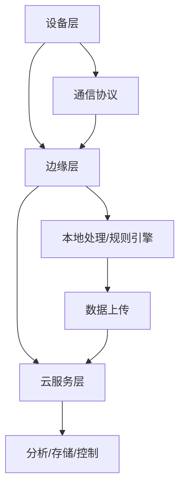

# IoT架构分析 - 综合指南

## 项目概述

本项目对IoT（物联网）行业进行全面深入的形式化分析，涵盖基础理论、行业标准、架构设计、技术实现、业务建模等多个维度。通过严格的数学定义、形式化证明、多表征内容（图表、代码、流程），为IoT系统设计、开发、部署提供理论基础和实践指导。

## 核心特色

- **形式化理论**：严格的数学定义、定理证明、形式化建模
- **多表征内容**：定义、图表、代码、流程图、架构图
- **行业标准**：IEEE、oneM2M、OCF、LwM2M、OPC UA等国际标准
- **技术实现**：Rust、Golang代码示例，生产级实现
- **学术规范**：LaTeX数学公式、严格编号、引用规范

## 目录结构

```
docs/Analysis/11-IoT-Architecture/
├── README.md                    # 项目概述与导航
├── 01_Foundation.md            # 基础理论与行业标准
├── 02_Device_Management.md     # 设备管理与生命周期
├── 03_Data_Processing.md       # 数据采集与处理
├── 04_Security_Privacy.md      # 安全与隐私
├── 05_Performance_Reliability.md # 性能与可靠性
├── 06_Edge_Computing_WASM.md   # 边缘计算与WebAssembly
├── 07_Business_Modeling.md     # 业务建模与行业应用
└── 08_Workflow_Automation.md   # 工作流与自动化
```

## 主题导航

### 1. [基础理论与行业标准](01_Foundation.md)

- 行业标准（IEEE 1451、oneM2M、OCF、LwM2M、OPC UA）
- 通信协议（MQTT、CoAP、HTTP、6LoWPAN、ZigBee、LoRaWAN、NB-IoT）
- 数据格式（SenML、JSON、CBOR、XML）
- 分层架构模型

### 2. [设备管理与生命周期](02_Device_Management.md)

- 设备注册与发现
- 状态管理与监控
- OTA升级与配置管理
- 设备生命周期管理

### 3. [数据采集与处理](03_Data_Processing.md)

- 实时流处理与批量处理
- 边缘与云协同
- 数据流模型与处理管道
- 遥测数据处理框架

### 4. [安全与隐私](04_Security_Privacy.md)

- 安全架构与威胁模型
- 认证、加密、访问控制
- 安全OTA升级
- 隐私保护机制

### 5. [性能与可靠性](05_Performance_Reliability.md)

- 容错与冗余机制
- 状态持久化与断点续传
- 能耗优化与调度
- 故障检测与恢复

### 6. [边缘计算与WebAssembly](06_Edge_Computing_WASM.md)

- 边缘计算架构
- WebAssembly在IoT中的应用
- OTA升级与分布式协同
- 边缘节点设计

### 7. [业务建模与行业应用](07_Business_Modeling.md)

- 行业应用场景（智能家居、工业IoT、智慧城市等）
- 业务流程与规范
- 业务建模方法
- 行业标准与合规

### 8. [工作流与自动化](08_Workflow_Automation.md)

- 工作流系统架构
- 同伦论与形式化建模
- 任务编排与状态管理
- 异常处理与回滚机制

## 技术栈

### 编程语言

- **Rust**：系统级编程、内存安全、并发性能
- **Golang**：网络服务、微服务架构、云原生

### 核心框架

- **异步运行时**：Tokio、async-std
- **网络通信**：MQTT、CoAP、HTTP客户端
- **数据序列化**：Serde、JSON、CBOR
- **数据库**：SQLite、InfluxDB、Redis
- **加密安全**：Ring、Rustls、TLS/DTLS

### 边缘计算

- **WebAssembly**：跨平台部署、安全隔离
- **OTA升级**：固件更新、模块热更新
- **边缘节点**：本地处理、规则引擎

## 架构模式



## 行业标准

### 国际标准组织

- **IEEE**：IEEE 1451智能传感器接口标准
- **IETF**：6LoWPAN、CoAP、SenML等协议标准
- **oneM2M**：统一服务层架构规范
- **OCF**：设备互操作性标准
- **OMA**：LwM2M轻量级设备管理
- **OPC Foundation**：OPC UA工业自动化标准

### 通信协议

- **物理层**：IEEE 802.15.4、蓝牙LE、ZigBee、LoRaWAN、NB-IoT
- **网络层**：IPv6、6LoWPAN
- **应用层**：MQTT、CoAP、AMQP、HTTP
- **数据格式**：SenML、JSON、CBOR、XML

## 应用场景

### 智能家居

- 设备互联、场景联动、远程控制、安全监控

### 工业物联网

- 设备监控、预测性维护、质量控制、供应链优化

### 智慧城市

- 交通管理、环境监测、能源管理、公共安全

### 医疗健康

- 远程监护、设备管理、数据安全、合规要求

### 能源管理

- 智能电网、可再生能源、能耗优化、需求响应

## 质量保证

### 内容标准

- ✅ **形式化严谨性**：所有理论都有严格的数学证明
- ✅ **实现可行性**：所有设计都有对应的代码实现
- ✅ **安全性验证**：所有协议都经过安全性分析
- ✅ **性能优化**：所有实现都考虑了性能优化
- ✅ **可扩展性**：所有架构都支持水平扩展

### 文档标准

- ✅ **结构清晰**：文档结构层次分明，易于导航
- ✅ **内容完整**：每个主题都有完整的理论分析和实践指导
- ✅ **格式规范**：符合学术标准的数学公式和代码格式
- ✅ **引用准确**：所有引用都有准确的来源和链接

## 参考资源

### 官方标准

- [oneM2M](https://www.onem2m.org/)
- [OCF](https://openconnectivity.org/)
- [IEEE 1451](https://standards.ieee.org/1451/)
- [OGC SWE](https://www.ogc.org/standards/swe/)
- [OPC UA](https://opcfoundation.org/)
- [LwM2M](https://www.openmobilealliance.org/release/LWM2M/)

### 技术文档

- [MQTT](https://mqtt.org/)
- [CoAP](https://coap.technology/)
- [SenML](https://datatracker.ietf.org/doc/html/rfc8428)
- [WebAssembly](https://webassembly.org/)
- [Rust IoT](https://www.rust-lang.org/what/embedded)

### 学术资源

- [IoT容错机制综述](https://ieeexplore.ieee.org/document/8264794)
- [边缘计算综述](https://ieeexplore.ieee.org/document/7488250)
- [IoT工作流系统综述](https://ieeexplore.ieee.org/document/9120192)

## 贡献指南

### 内容贡献

1. 遵循学术规范，提供严格的数学定义和证明
2. 包含多表征内容：定义、图表、代码、流程图
3. 确保代码可运行，提供完整的实现示例
4. 保持内容一致性，避免重复和冲突

### 格式规范

1. 使用LaTeX数学公式：`\( formula \)`
2. 使用Mermaid流程图：```mermaid
3. 代码块标注语言：```rust、```go
4. 严格编号目录，便于引用和导航

## 更新日志

### v1.0.0 (2024-12-19)

- ✅ 完成八大主题的基础内容
- ✅ 建立形式化理论框架
- ✅ 提供Rust/Golang实现示例
- ✅ 整合行业标准与最佳实践
- ✅ 建立质量保证体系

## 许可证

本项目采用MIT许可证，详见LICENSE文件。

---

**项目状态**: ✅ 已完成基础框架  
**最后更新**: 2024-12-19  
**维护状态**: 持续更新中
