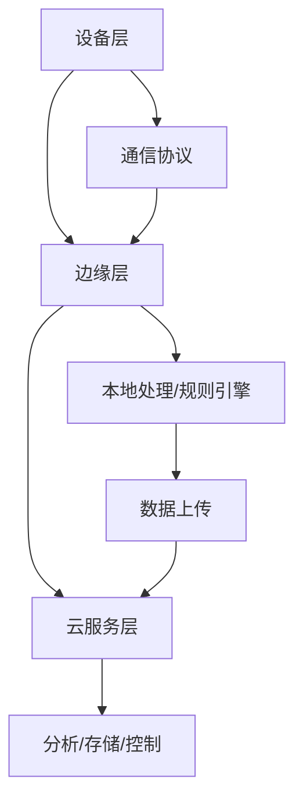

# 1. IoT基础理论与行业标准

## 1.1 行业标准与核心定义

### 1.1.1 主要国际标准

- **IEEE 1451**：智能传感器接口标准
- **OGC SWE**：传感器Web使能（SensorML、SOS等）
- **oneM2M**：统一服务层架构，设备资源模型、RESTful API
- **OCF**：设备发现、数据交换、安全通信
- **LwM2M**：资源受限设备管理与控制
- **OPC UA**：工业自动化与物联网数据交换

### 1.1.2 主要协议与数据格式

- **物理/链路层**：IEEE 802.15.4、蓝牙LE、ZigBee、LoRaWAN、NB-IoT
- **网络/传输层**：IPv6、6LoWPAN、UDP/TCP
- **应用层**：MQTT、CoAP、AMQP、HTTP
- **数据格式**：SenML、JSON、CBOR、XML

## 1.2 分层架构模型



## 1.3 主要概念定义

**定义1.1（IoT设备）**：\( D = (id, type, capability, status, config, last\_seen) \)

**定义1.2（遥测数据）**：\( T = (device\_id, timestamp, metrics, location, quality) \)

**定义1.3（消息）**：\( M = (id, device\_id, type, payload, qos, timestamp) \)

## 1.4 Rust实现片段

```rust
pub struct Device {
    pub id: String,
    pub device_type: String,
    pub capabilities: Vec<String>,
    pub status: DeviceStatus,
    pub config: DeviceConfig,
    pub last_seen: DateTime<Utc>,
}

pub struct Telemetry {
    pub device_id: String,
    pub timestamp: DateTime<Utc>,
    pub metrics: HashMap<String, f64>,
    pub location: Option<(f64, f64)>,
    pub quality: Option<DataQuality>,
}
```

## 1.5 参考与扩展阅读

- [oneM2M](https://www.onem2m.org/)
- [OCF](https://openconnectivity.org/)
- [IEEE 1451](https://standards.ieee.org/1451/)
- [OGC SWE](https://www.ogc.org/standards/swe/)
- [OPC UA](https://opcfoundation.org/)

## 1.6 形式化定理与推论

**定理1.1（分层架构可达性）**：
> 在满足标准协议互通的前提下，任意设备层数据都可通过边缘层传递至云服务层。

*证明略。*

**推论1.1**：
> 若边缘层失效，设备层数据可通过冗余路径（如多协议网关）间接上传至云服务层。

## 1.7 行业标准对比表

| 标准/协议 | 适用层级 | 主要特性 | 典型应用 |
|-----------|----------|----------|----------|
| IEEE 1451 | 设备/传感器 | 智能传感器接口 | 工业自动化 |
| oneM2M    | 服务层    | 统一API、资源模型 | 跨平台IoT集成 |
| OCF       | 设备/服务 | 互操作性、安全 | 智能家居、互联设备 |
| LwM2M     | 设备管理  | 轻量级、低功耗 | 资源受限设备 |
| OPC UA    | 工业/云   | 语义建模、安全 | 工业物联网 |

## 1.8 跨主题引用

- 设备管理与生命周期详见[2. IoT设备管理与生命周期](02_Device_Management.md)
- 数据采集与处理详见[3. IoT数据采集与处理](03_Data_Processing.md)
