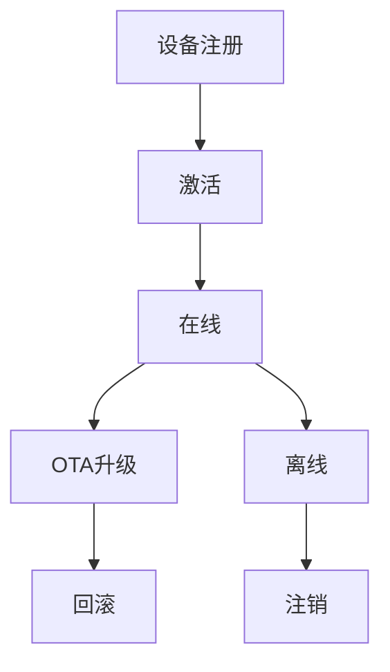
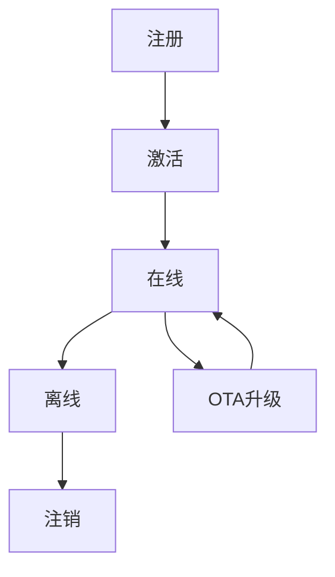

# 2. IoT设备管理与生命周期

## 2.1 设备模型与生命周期

**定义2.1（设备生命周期）**：\( L = \{注册, 激活, 在线, 离线, 升级, 注销\} \)

**定义2.2（设备管理器）**：\( DM = (devices, repo, comm, event\_bus) \)

## 2.2 设备注册与发现

- 唯一ID分配、元数据采集、自动发现协议（如mDNS、CoAP discovery）

## 2.3 状态管理与监控

- 心跳机制、健康检查、异常检测、状态机建模

## 2.4 OTA升级与配置管理

- OTA流程：固件包下载、校验、安装、回滚
- 配置管理：集中/分布式配置、动态下发



## 2.5 Rust实现片段

```rust
pub struct DeviceManager {
    devices: HashMap<DeviceId, Device>,
    // ...
}

impl DeviceManager {
    pub async fn register_device(&mut self, info: DeviceInfo) -> Result<DeviceId, Error> { /* ... */ }
    pub async fn update_status(&mut self, id: &DeviceId, status: DeviceStatus) -> Result<(), Error> { /* ... */ }
    pub async fn ota_update(&mut self, id: &DeviceId, firmware: Firmware) -> Result<(), Error> { /* ... */ }
}
```

## 2.6 参考与扩展阅读

- [LwM2M](https://www.openmobilealliance.org/release/LWM2M/)
- [OTA升级机制综述](https://en.wikipedia.org/wiki/Over-the-air_programming)

## 2.7 形式化定理与推论

**定理2.1（设备唯一性）**：
> 任意时刻，设备ID在系统中全局唯一。

**推论2.1（OTA安全性）**：
> 若OTA升级过程满足签名校验与回滚机制，则系统可恢复至任意安全状态。

## 2.8 设备状态机图



## 2.9 跨主题引用

- 安全与隐私详见[4. IoT安全与隐私](04_Security_Privacy.md)
- 性能与可靠性详见[5. IoT性能与可靠性](05_Performance_Reliability.md)
