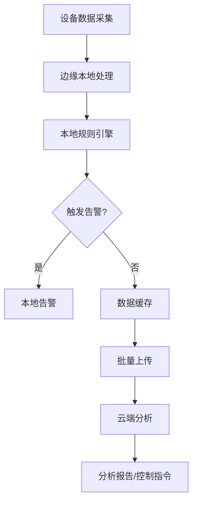
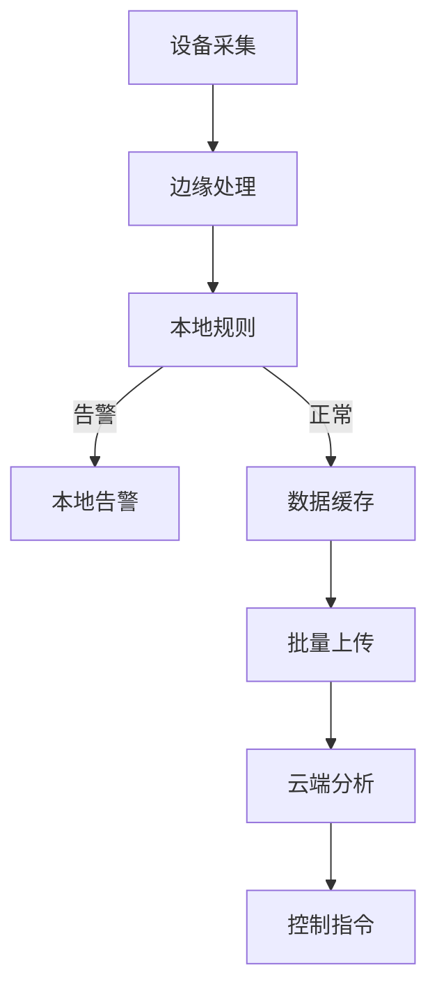

# 3. IoT数据采集与处理

## 3.1 数据流与处理模型

**定义3.1（遥测数据流）**：\( S = (device\_id, timestamp, metrics, sequence, location, quality) \)

- 实时流处理：事件驱动、窗口聚合、规则引擎
- 批量处理：本地缓存、批量上传、云端分析

## 3.2 边缘与云协同

- 边缘本地处理：初步过滤、规则执行、告警生成
- 云端分析：大数据分析、机器学习、全局优化



## 3.3 Rust实现片段

```rust
pub struct TelemetryProcessor {
    input_stream: DataStream<RawTelemetry>,
    processor_chain: Vec<Box<dyn TelemetryTransformer>>,
    output_sink: Box<dyn TelemetrySink>,
    metrics: Arc<TelemetryMetrics>,
}

impl TelemetryProcessor {
    pub async fn process(&mut self) -> Result<(), Error> { /* ... */ }
}
```

## 3.4 参考与扩展阅读

- [OGC SensorML](https://www.ogc.org/standards/sensorml/)
- [SenML](https://datatracker.ietf.org/doc/html/rfc8428)

## 3.5 形式化定理与推论

**定理3.1（数据一致性）**：
> 若所有数据流经边缘节点均满足幂等处理，则最终上传至云端的数据全局一致。

**推论3.1（边缘-云协同优化）**：
> 边缘节点具备本地规则引擎与缓存机制时，可显著降低云端负载与延迟。

## 3.6 数据流图



## 3.7 跨主题引用

- 安全与隐私详见[4. IoT安全与隐私](04_Security_Privacy.md)
- 边缘计算与WebAssembly详见[6. IoT边缘计算与WebAssembly](06_Edge_Computing_WASM.md)
