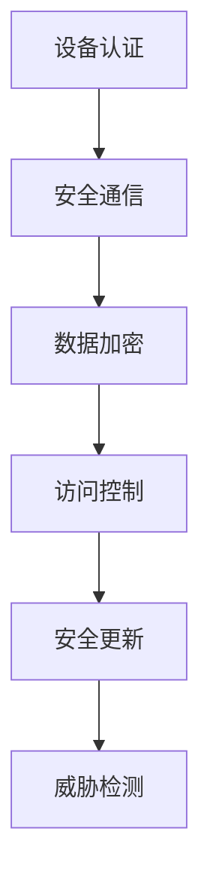
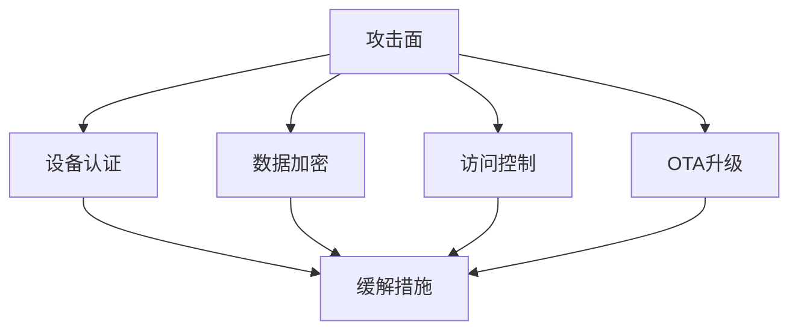

# 4. IoT安全与隐私

## 4.1 安全架构与威胁模型

**定义4.1（安全三要素）**：\( S = (Confidentiality, Integrity, Availability) \)

- 设备认证、数据加密、访问控制、固件签名、安全更新
- 威胁建模：攻击面、威胁类型、缓解措施

## 4.2 安全机制与协议

- TLS/DTLS、设备证书、端到端加密、零信任架构
- 安全OTA升级、回滚机制



## 4.3 Rust实现片段

```rust
pub struct SecurityManager {
    cert_store: CertStore,
    key_manager: KeyManager,
    access_control: AccessControl,
}

impl SecurityManager {
    pub async fn authenticate(&self, device: &Device) -> Result<(), Error> { /* ... */ }
    pub async fn encrypt(&self, data: &[u8]) -> Result<Vec<u8>, Error> { /* ... */ }
    pub async fn authorize(&self, device: &Device, action: &str) -> Result<bool, Error> { /* ... */ }
}
```

## 4.4 参考与扩展阅读
- [OCF安全规范](https://openconnectivity.org/developer/specifications/security/)
- [IoT安全最佳实践](https://www.owasp.org/index.php/OWASP_Internet_of_Things_Project) 

## 4.5 形式化定理与推论

**定理4.1（端到端安全性）**：
> 若设备认证、数据加密、访问控制均满足行业标准，则端到端通信可抵御主流攻击。

**推论4.1（OTA安全更新）**：
> OTA升级过程采用签名校验与回滚机制时，系统可防止恶意固件注入。

## 4.6 威胁建模图



## 4.7 跨主题引用
- 性能与可靠性详见[5. IoT性能与可靠性](05_Performance_Reliability.md)
- 工作流与自动化详见[8. IoT工作流与自动化](08_Workflow_Automation.md) 