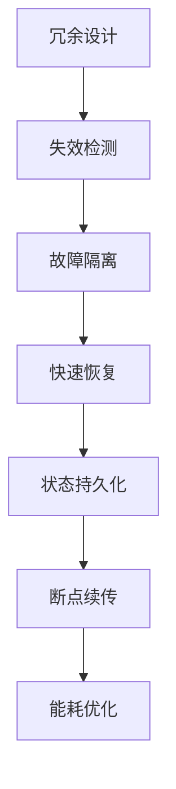

# 5. IoT性能与可靠性

## 5.1 容错与冗余机制

**定义5.1（容错模型）**：\( F = (冗余, 检测, 隔离, 恢复) \)

- 硬件/软件冗余、心跳检测、健康检查、异常检测、故障隔离、快速恢复

## 5.2 状态持久化与断点续传

- 状态机建模、持久化存储、断点续传、数据一致性

## 5.3 能耗优化与调度

- 能源感知调度、低功耗设计、自适应采样、动态休眠



## 5.4 Rust实现片段

```rust
pub struct FaultTolerance {
    redundancy: usize,
    detection: DetectionStrategy,
    isolation: IsolationStrategy,
    recovery: RecoveryStrategy,
}

impl FaultTolerance {
    pub fn detect(&self) -> bool { /* ... */ }
    pub fn recover(&self) -> bool { /* ... */ }
}
```

## 5.5 参考与扩展阅读

- [IoT容错机制综述](https://ieeexplore.ieee.org/document/8264794)
- [低功耗IoT设计](https://www.embedded.com/low-power-iot-design/)

## 5.6 形式化定理与推论

**定理5.1（系统可恢复性）**：
> 若系统具备多级冗余与断点续传机制，则在单点故障下可恢复至一致状态。

**推论5.1（能耗最优化）**：
> 能源感知调度与自适应采样可在保证服务质量前提下最小化能耗。

## 5.7 容错机制流程图


## 5.8 跨主题引用

- 边缘计算与WebAssembly详见[6. IoT边缘计算与WebAssembly](06_Edge_Computing_WASM.md)
- 工作流与自动化详见[8. IoT工作流与自动化](08_Workflow_Automation.md)
