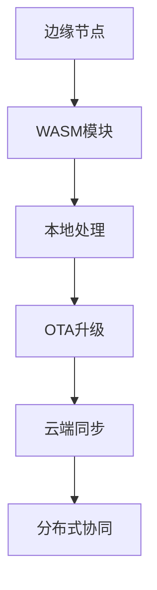
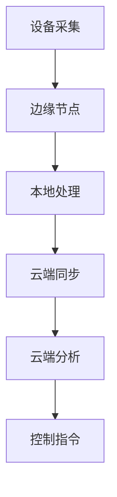

# 6. IoT边缘计算与WebAssembly

## 6.1 边缘计算架构

**定义6.1（边缘节点）**：\( EN = (设备管理, 数据处理, 规则引擎, 通信管理, 本地存储) \)

- 边缘节点本地决策、数据预处理、规则执行、云端协同

## 6.2 WebAssembly在IoT中的应用

- WASM模块安全隔离、跨平台部署、OTA升级、性能优化

## 6.3 OTA升级与分布式协同

- OTA流程、WASM模块热更新、分布式一致性、回滚机制



## 6.4 Rust/Golang实现片段

```rust
pub struct EdgeNode {
    device_manager: DeviceManager,
    data_processor: DataProcessor,
    rule_engine: RuleEngine,
    communication_manager: CommunicationManager,
    local_storage: LocalStorage,
}

impl EdgeNode {
    pub async fn run(&mut self) -> Result<(), EdgeError> { /* ... */ }
}
```

```go
// Go语言WASM OTA升级片段
func (p *EdgeOtaProtocol) applyUpdate(updatePackage *UpdatePackage, updateInfo UpdateInfo) (*UpdateResult, error) {
    // ...
}
```

## 6.5 参考与扩展阅读

- [WebAssembly IoT应用](https://webassembly.org/)
- [边缘计算综述](https://ieeexplore.ieee.org/document/7488250)

## 6.6 形式化定理与推论

**定理6.1（分布式一致性）**：
> 若边缘节点与云端采用共识协议，则全局状态最终一致。

**推论6.1（WASM模块热更新安全性）**：
> WASM模块采用签名校验与回滚机制时，支持安全热更新。

## 6.7 边缘-云协同流程图



## 6.8 跨主题引用

- 性能与可靠性详见[5. IoT性能与可靠性](05_Performance_Reliability.md)
- 业务建模与行业应用详见[7. IoT业务建模与行业应用](07_Business_Modeling.md)
