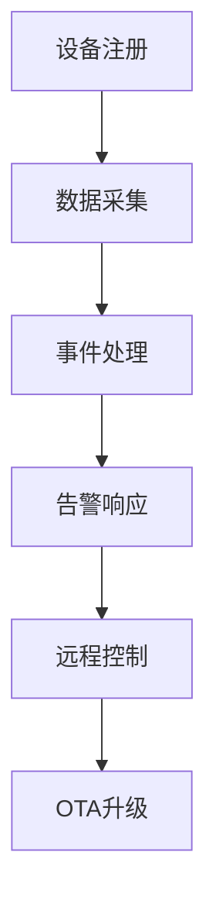
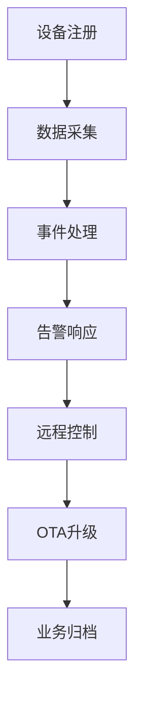

# 7. IoT业务建模与行业应用

## 7.1 行业应用场景

- 智能家居、工业物联网、智慧城市、医疗健康、能源管理等

## 7.2 业务流程与规范

- 设备注册、数据采集、事件处理、告警响应、远程控制、OTA升级
- 行业标准与合规要求（如ISO/IEC、行业联盟规范）

## 7.3 业务建模方法

**定义7.1（业务流程建模）**：\( BP = (Actor, Event, State, Action, Rule) \)

- 事件驱动、状态机、规则引擎、流程自动化



## 7.4 Rust实现片段

```rust
pub struct BusinessProcess {
    actor: String,
    event: String,
    state: String,
    action: String,
    rule: String,
}
```

## 7.5 参考与扩展阅读

- [IoT行业应用案例](https://www.iotone.com/)
- [ISO/IEC IoT标准](https://www.iso.org/committee/4533115.html)

## 7.6 形式化定理与推论

**定理7.1（业务流程可达性）**：
> 若业务流程建模为有向无环图（DAG），则所有终态均可达且无死锁。

**推论7.1（流程优化）**：
> 事件驱动与规则引擎可动态优化业务流程，提高系统响应效率。

## 7.7 行业场景流程图



## 7.8 跨主题引用

- 工作流与自动化详见[8. IoT工作流与自动化](08_Workflow_Automation.md)
- 基础理论与行业标准详见[1. IoT基础理论与行业标准](01_Foundation.md)
