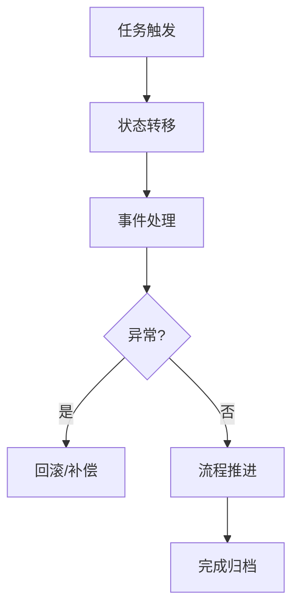
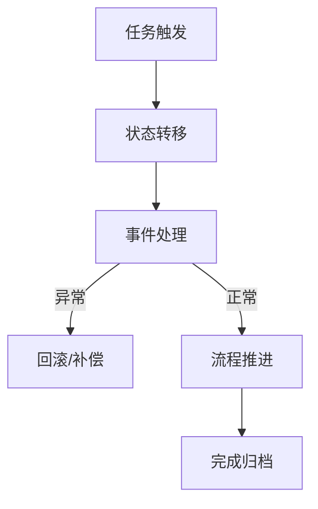

# 8. IoT工作流与自动化

## 8.1 工作流系统架构

- 分层设计：设备层、边缘层、云层
- 工作流引擎、任务编排、状态持久化、断点续传

## 8.2 同伦论与形式化建模

**定义8.1（工作流模型）**：\( WF = (State, Transition, Event, Actor, Policy) \)

- 状态机、事件驱动、异常处理、回滚机制



## 8.3 Rust实现片段

```rust
pub struct WorkflowEngine {
    state: WorkflowState,
    transitions: Vec<Transition>,
    event_queue: Vec<Event>,
}

impl WorkflowEngine {
    pub async fn execute(&mut self) -> Result<(), Error> { /* ... */ }
}
```

## 8.4 参考与扩展阅读
- [IoT工作流系统综述](https://ieeexplore.ieee.org/document/9120192)
- [同伦论与分布式工作流](https://ncatlab.org/nlab/show/homotopy+type+theory) 

## 8.5 形式化定理与推论

**定理8.1（工作流终止性）**：
> 若工作流状态转移图为有向无环图（DAG），则所有流程最终终止于归档状态。

**推论8.1（异常处理完备性）**：
> 若每个异常分支均有补偿或回滚机制，则系统具备完备的异常恢复能力。

## 8.6 工作流引擎流程图



## 8.7 跨主题引用
- 业务建模与行业应用详见[7. IoT业务建模与行业应用](07_Business_Modeling.md)
- 安全与隐私详见[4. IoT安全与隐私](04_Security_Privacy.md) 