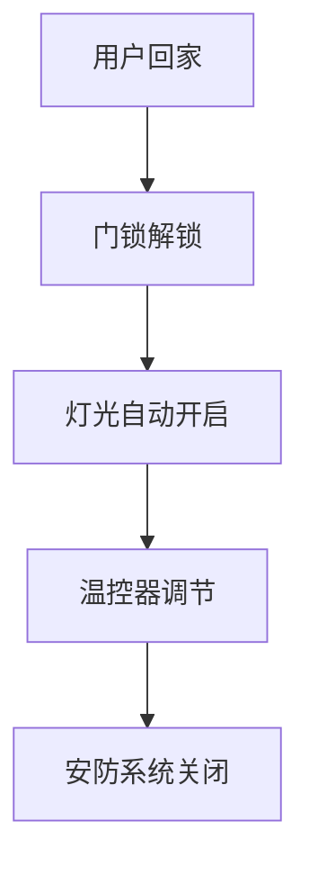
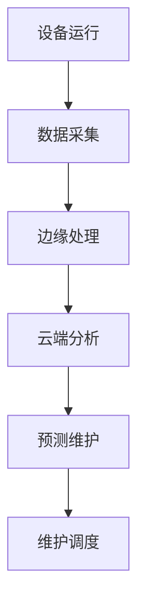
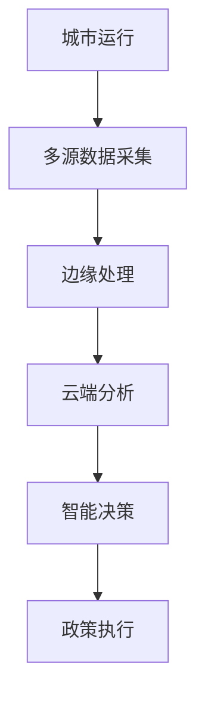
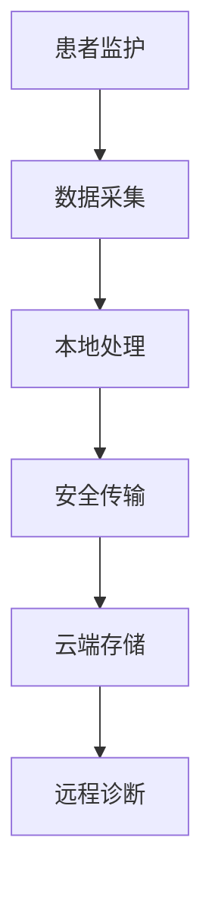
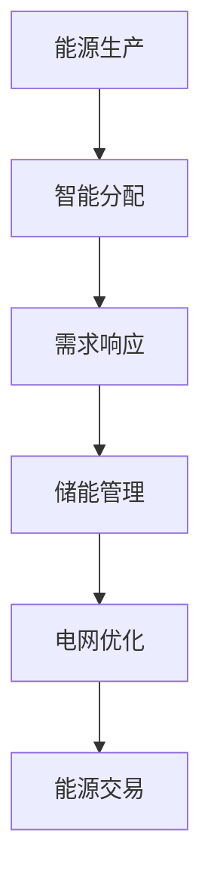

# 9. IoT行业案例与应用场景

## 9.1 智能家居

### 9.1.1 场景概述

智能家居通过IoT设备实现家庭自动化、远程控制、场景联动等功能。

### 9.1.2 核心组件

- **设备层**：智能灯泡、温控器、安防摄像头、门锁
- **边缘层**：家庭网关、本地规则引擎
- **云层**：远程控制、数据分析、用户管理

### 9.1.3 技术实现

```rust
pub struct SmartHome {
    devices: HashMap<DeviceId, SmartDevice>,
    gateway: HomeGateway,
    rules_engine: RuleEngine,
    cloud_service: CloudService,
}

impl SmartHome {
    pub async fn scene_trigger(&mut self, scene: Scene) -> Result<(), Error> {
        // 场景触发逻辑
        for device in &self.devices {
            if scene.devices.contains(&device.id) {
                device.execute_command(&scene.commands).await?;
            }
        }
        Ok(())
    }
}
```

### 9.1.4 业务流程



## 9.2 工业物联网

### 9.2.1 场景概述

工业IoT通过设备监控、预测性维护、质量控制等提升生产效率。

### 9.2.2 核心组件

- **设备层**：传感器、执行器、PLC、机器人
- **边缘层**：工业网关、本地处理
- **云层**：大数据分析、预测模型、供应链管理

### 9.2.3 技术实现

```rust
pub struct IndustrialIoT {
    sensors: Vec<Sensor>,
    actuators: Vec<Actuator>,
    gateway: IndustrialGateway,
    predictive_maintenance: PredictiveMaintenance,
}

impl IndustrialIoT {
    pub async fn monitor_equipment(&mut self) -> Result<(), Error> {
        // 设备监控逻辑
        for sensor in &self.sensors {
            let data = sensor.read().await?;
            self.predictive_maintenance.analyze(data).await?;
        }
        Ok(())
    }
}
```

### 9.2.4 业务流程



## 9.3 智慧城市

### 9.3.1 场景概述

智慧城市通过IoT技术实现交通管理、环境监测、能源管理、公共安全等。

### 9.3.2 核心组件

- **设备层**：交通信号灯、环境传感器、路灯、摄像头
- **边缘层**：区域控制器、本地决策
- **云层**：城市大脑、数据分析、政策制定

### 9.3.3 技术实现

```rust
pub struct SmartCity {
    traffic_system: TrafficSystem,
    environment_monitor: EnvironmentMonitor,
    energy_management: EnergyManagement,
    public_safety: PublicSafety,
}

impl SmartCity {
    pub async fn optimize_traffic(&mut self) -> Result<(), Error> {
        // 交通优化逻辑
        let traffic_data = self.traffic_system.collect_data().await?;
        let optimization = self.traffic_system.optimize(traffic_data).await?;
        self.traffic_system.apply_optimization(optimization).await?;
        Ok(())
    }
}
```

### 9.3.4 业务流程



## 9.4 医疗健康

### 9.4.1 场景概述

医疗IoT通过远程监护、设备管理、数据安全等提升医疗服务质量。

### 9.4.2 核心组件

- **设备层**：医疗设备、可穿戴设备、监护仪
- **边缘层**：医疗网关、本地处理
- **云层**：电子病历、数据分析、远程诊断

### 9.4.3 技术实现

```rust
pub struct MedicalIoT {
    devices: Vec<MedicalDevice>,
    gateway: MedicalGateway,
    data_security: DataSecurity,
    remote_monitoring: RemoteMonitoring,
}

impl MedicalIoT {
    pub async fn monitor_patient(&mut self, patient_id: &str) -> Result<(), Error> {
        // 患者监护逻辑
        for device in &self.devices {
            if device.patient_id == patient_id {
                let data = device.read_vitals().await?;
                self.remote_monitoring.update(data).await?;
            }
        }
        Ok(())
    }
}
```

### 9.4.4 业务流程



## 9.5 能源管理

### 9.5.1 场景概述

能源IoT通过智能电网、可再生能源、能耗优化等实现能源高效管理。

### 9.5.2 核心组件

- **设备层**：智能电表、太阳能板、储能设备
- **边缘层**：能源网关、本地控制
- **云层**：电网管理、需求响应、能源交易

### 9.5.3 技术实现

```rust
pub struct EnergyIoT {
    smart_meters: Vec<SmartMeter>,
    renewable_sources: Vec<RenewableSource>,
    storage_systems: Vec<StorageSystem>,
    grid_management: GridManagement,
}

impl EnergyIoT {
    pub async fn optimize_energy(&mut self) -> Result<(), Error> {
        // 能源优化逻辑
        let demand = self.smart_meters.iter().map(|m| m.get_demand()).sum();
        let supply = self.renewable_sources.iter().map(|s| s.get_supply()).sum();
        let optimization = self.grid_management.optimize(demand, supply).await?;
        self.apply_optimization(optimization).await?;
        Ok(())
    }
}
```

### 9.5.4 业务流程



## 9.6 跨主题引用

- 基础理论与行业标准详见[1. IoT基础理论与行业标准](01_Foundation.md)
- 业务建模与行业应用详见[7. IoT业务建模与行业应用](07_Business_Modeling.md)
- 工作流与自动化详见[8. IoT工作流与自动化](08_Workflow_Automation.md)

## 9.7 参考与扩展阅读

- [IoT行业应用案例库](https://www.iotone.com/)
- [智慧城市最佳实践](https://www.smartcitiesworld.net/)
- [工业IoT标准](https://www.isa.org/)
