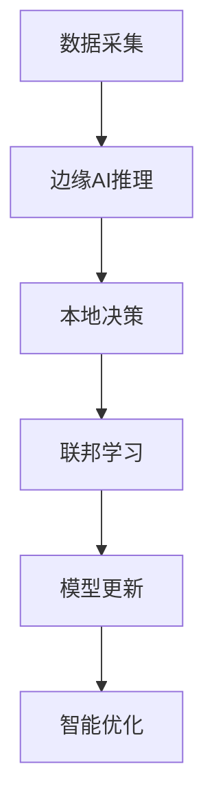

# 10. IoT进阶主题与前沿技术

## 10.1 AIoT（人工智能物联网）

### 10.1.1 概念定义
**定义10.1（AIoT）**：\( AIoT = IoT \cup AI \)，即物联网与人工智能的深度融合。

### 10.1.2 核心特性
- **边缘AI**：本地机器学习推理
- **联邦学习**：分布式模型训练
- **智能决策**：基于AI的自动化控制

### 10.1.3 技术实现

```rust
pub struct AIoT {
    edge_ai: EdgeAI,
    federated_learning: FederatedLearning,
    intelligent_decision: IntelligentDecision,
}

impl AIoT {
    pub async fn edge_inference(&mut self, data: &SensorData) -> Result<AIResult, Error> {
        // 边缘AI推理
        let features = self.edge_ai.extract_features(data).await?;
        let prediction = self.edge_ai.infer(features).await?;
        Ok(prediction)
    }
    
    pub async fn federated_training(&mut self) -> Result<(), Error> {
        // 联邦学习训练
        let local_model = self.edge_ai.get_model().await?;
        let global_model = self.federated_learning.aggregate(local_model).await?;
        self.edge_ai.update_model(global_model).await?;
        Ok(())
    }
}
```

### 10.1.4 应用流程



## 10.2 量子安全IoT

### 10.2.1 概念定义
**定义10.2（量子安全IoT）**：采用后量子密码学技术保护IoT通信安全。

### 10.2.2 核心特性
- **后量子密码学**：抗量子攻击的加密算法
- **量子密钥分发**：基于量子力学原理的密钥交换
- **量子随机数生成**：真随机数生成

### 10.2.3 技术实现

```rust
pub struct QuantumSecureIoT {
    post_quantum_crypto: PostQuantumCrypto,
    quantum_key_distribution: QuantumKeyDistribution,
    quantum_random_generator: QuantumRandomGenerator,
}

impl QuantumSecureIoT {
    pub async fn secure_communication(&mut self, message: &[u8]) -> Result<Vec<u8>, Error> {
        // 量子安全通信
        let key = self.quantum_key_distribution.generate_key().await?;
        let encrypted = self.post_quantum_crypto.encrypt(message, &key).await?;
        Ok(encrypted)
    }
}
```

## 10.3 跨链IoT集成

### 10.3.1 概念定义
**定义10.3（跨链IoT）**：\( CrossChainIoT = IoT \cup Blockchain \cup Interoperability \)

### 10.3.2 核心特性
- **区块链集成**：设备身份、数据溯源、智能合约
- **跨链互操作**：多链数据交换、资产转移
- **去中心化治理**：DAO、代币经济学

### 10.3.3 技术实现

```rust
pub struct CrossChainIoT {
    blockchain_integration: BlockchainIntegration,
    cross_chain_bridge: CrossChainBridge,
    decentralized_governance: DecentralizedGovernance,
}

impl CrossChainIoT {
    pub async fn register_device(&mut self, device: &Device) -> Result<(), Error> {
        // 设备上链注册
        let device_nft = self.blockchain_integration.create_nft(device).await?;
        self.blockchain_integration.mint_nft(device_nft).await?;
        Ok(())
    }
    
    pub async fn cross_chain_data_exchange(&mut self, data: &IoTData) -> Result<(), Error> {
        // 跨链数据交换
        let bridge_tx = self.cross_chain_bridge.create_transaction(data).await?;
        self.cross_chain_bridge.execute_transaction(bridge_tx).await?;
        Ok(())
    }
}
```

## 10.4 5G/6G IoT

### 10.4.1 概念定义
**定义10.4（5G/6G IoT）**：基于5G/6G网络的超低延迟、大带宽IoT应用。

### 10.4.2 核心特性
- **网络切片**：专用IoT网络
- **边缘计算**：5G边缘节点
- **超低延迟**：毫秒级响应

### 10.4.3 技术实现

```rust
pub struct NextGenIoT {
    network_slicing: NetworkSlicing,
    edge_computing: EdgeComputing,
    ultra_low_latency: UltraLowLatency,
}

impl NextGenIoT {
    pub async fn create_network_slice(&mut self, slice_config: &SliceConfig) -> Result<(), Error> {
        // 创建网络切片
        let slice = self.network_slicing.create_slice(slice_config).await?;
        self.network_slicing.activate_slice(slice).await?;
        Ok(())
    }
}
```

## 10.5 数字孪生

### 10.5.1 概念定义
**定义10.5（数字孪生）**：\( DigitalTwin = PhysicalSystem \mapsto DigitalModel \)

### 10.5.2 核心特性
- **实时同步**：物理与数字世界实时映射
- **预测分析**：基于孪生模型的预测
- **虚拟测试**：在数字世界中进行测试

### 10.5.3 技术实现

```rust
pub struct DigitalTwin {
    physical_system: PhysicalSystem,
    digital_model: DigitalModel,
    real_time_sync: RealTimeSync,
    predictive_analytics: PredictiveAnalytics,
}

impl DigitalTwin {
    pub async fn sync_state(&mut self) -> Result<(), Error> {
        // 实时状态同步
        let physical_state = self.physical_system.get_state().await?;
        self.digital_model.update_state(physical_state).await?;
        Ok(())
    }
    
    pub async fn predict_failure(&mut self) -> Result<Prediction, Error> {
        // 故障预测
        let current_state = self.digital_model.get_state().await?;
        let prediction = self.predictive_analytics.predict(current_state).await?;
        Ok(prediction)
    }
}
```

## 10.6 跨主题引用
- 基础理论与行业标准详见[1. IoT基础理论与行业标准](01_Foundation.md)
- 边缘计算与WebAssembly详见[6. IoT边缘计算与WebAssembly](06_Edge_Computing_WASM.md)
- 行业案例与应用场景详见[9. IoT行业案例与应用场景](09_Industry_Cases.md)

## 10.7 参考与扩展阅读
- [AIoT技术白皮书](https://www.iotworldtoday.com/aiot)
- [量子安全标准](https://www.nist.gov/quantum-internet)
- [5G IoT应用指南](https://www.3gpp.org/5g-iot)
- [数字孪生技术](https://www.digitaltwinconsortium.org/) 