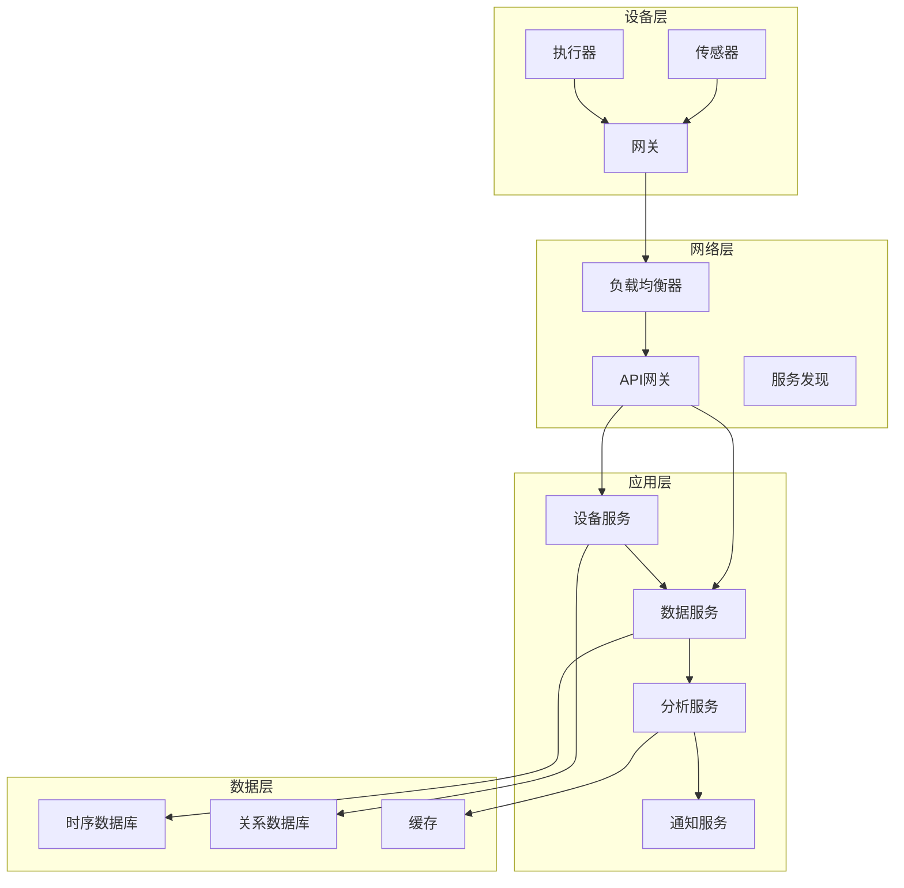
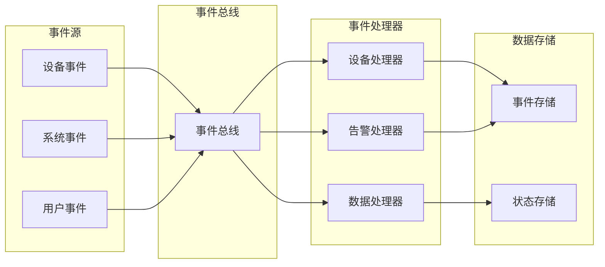

# 13. IoT集成框架与系统架构

## 13.1 系统集成概述

### 13.1.1 集成定义
**定义13.1（IoT系统集成）**：\( Integration = \bigcup_{i=1}^{n} System_i \)，即多个IoT子系统的统一集成。

### 13.1.2 集成层次
- **设备层集成**：传感器、执行器、网关设备
- **网络层集成**：通信协议、路由、负载均衡
- **应用层集成**：业务逻辑、数据处理、用户界面
- **数据层集成**：存储、分析、可视化

## 13.2 API设计与标准化

### 13.2.1 RESTful API设计

```rust
use actix_web::{web, App, HttpServer, HttpResponse, Result};
use serde::{Deserialize, Serialize};

#[derive(Serialize, Deserialize)]
pub struct DeviceInfo {
    pub id: String,
    pub name: String,
    pub device_type: String,
    pub status: DeviceStatus,
}

#[derive(Serialize, Deserialize)]
pub enum DeviceStatus {
    Online,
    Offline,
    Error,
}

pub async fn get_device(device_id: web::Path<String>) -> Result<HttpResponse> {
    // 获取设备信息
    let device = DeviceService::get_device(&device_id).await?;
    Ok(HttpResponse::Ok().json(device))
}

pub async fn update_device(
    device_id: web::Path<String>,
    device_info: web::Json<DeviceInfo>,
) -> Result<HttpResponse> {
    // 更新设备信息
    let updated_device = DeviceService::update_device(&device_id, device_info.into_inner()).await?;
    Ok(HttpResponse::Ok().json(updated_device))
}

pub async fn delete_device(device_id: web::Path<String>) -> Result<HttpResponse> {
    // 删除设备
    DeviceService::delete_device(&device_id).await?;
    Ok(HttpResponse::NoContent().finish())
}
```

### 13.2.2 GraphQL API设计

```rust
use async_graphql::{Context, Object, Schema, SimpleObject};

#[derive(SimpleObject)]
pub struct Device {
    pub id: String,
    pub name: String,
    pub device_type: String,
    pub sensors: Vec<Sensor>,
    pub actuators: Vec<Actuator>,
}

#[derive(SimpleObject)]
pub struct Sensor {
    pub id: String,
    pub name: String,
    pub data_type: String,
    pub current_value: f64,
}

pub struct Query;

#[Object]
impl Query {
    async fn device(&self, ctx: &Context<'_>, id: String) -> Result<Device> {
        let device_service = ctx.data::<DeviceService>()?;
        device_service.get_device(&id).await
    }
    
    async fn devices(&self, ctx: &Context<'_>) -> Result<Vec<Device>> {
        let device_service = ctx.data::<DeviceService>()?;
        device_service.get_all_devices().await
    }
}
```

## 13.3 微服务架构

### 13.3.1 服务拆分策略

```rust
pub struct IoTServices {
    device_service: DeviceService,
    data_service: DataService,
    analytics_service: AnalyticsService,
    notification_service: NotificationService,
    security_service: SecurityService,
}

impl IoTServices {
    pub async fn process_device_data(&self, data: DeviceData) -> Result<ProcessedData> {
        // 1. 数据验证
        let validated_data = self.security_service.validate_data(&data).await?;
        
        // 2. 数据存储
        let stored_data = self.data_service.store_data(validated_data).await?;
        
        // 3. 数据分析
        let analysis_result = self.analytics_service.analyze_data(&stored_data).await?;
        
        // 4. 通知处理
        if analysis_result.requires_notification {
            self.notification_service.send_notification(&analysis_result).await?;
        }
        
        Ok(ProcessedData {
            original_data: data,
            analysis_result,
        })
    }
}
```

### 13.3.2 服务发现与注册

```rust
use consul_client::Client as ConsulClient;

pub struct ServiceRegistry {
    consul_client: ConsulClient,
}

impl ServiceRegistry {
    pub async fn register_service(&self, service: &ServiceInfo) -> Result<()> {
        let service_def = ServiceDefinition {
            id: service.id.clone(),
            name: service.name.clone(),
            address: service.address.clone(),
            port: service.port,
            tags: service.tags.clone(),
            health_check: Some(HealthCheck {
                http: format!("http://{}:{}/health", service.address, service.port),
                interval: "10s".to_string(),
            }),
        };
        
        self.consul_client.register_service(&service_def).await?;
        Ok(())
    }
    
    pub async fn discover_service(&self, service_name: &str) -> Result<Vec<ServiceInfo>> {
        let services = self.consul_client.get_service(service_name).await?;
        Ok(services.into_iter().map(|s| s.into()).collect())
    }
}
```

## 13.4 事件驱动架构

### 13.4.1 事件定义与发布

```rust
use tokio::sync::broadcast;

#[derive(Clone, Debug, Serialize, Deserialize)]
pub enum IoTEvent {
    DeviceConnected(DeviceConnectedEvent),
    DeviceDisconnected(DeviceDisconnectedEvent),
    DataReceived(DataReceivedEvent),
    AlertTriggered(AlertEvent),
    ConfigurationChanged(ConfigChangeEvent),
}

#[derive(Clone, Debug, Serialize, Deserialize)]
pub struct DeviceConnectedEvent {
    pub device_id: String,
    pub timestamp: DateTime<Utc>,
    pub connection_info: ConnectionInfo,
}

pub struct EventBus {
    tx: broadcast::Sender<IoTEvent>,
    rx: broadcast::Receiver<IoTEvent>,
}

impl EventBus {
    pub fn new(capacity: usize) -> Self {
        let (tx, rx) = broadcast::channel(capacity);
        Self { tx, rx }
    }
    
    pub async fn publish(&self, event: IoTEvent) -> Result<()> {
        self.tx.send(event)
            .map_err(|e| IoTError::EventPublishError(e.to_string()))?;
        Ok(())
    }
    
    pub async fn subscribe(&mut self) -> Result<Option<IoTEvent>> {
        match self.rx.recv().await {
            Ok(event) => Ok(Some(event)),
            Err(broadcast::error::RecvError::Closed) => Ok(None),
            Err(e) => Err(IoTError::EventReceiveError(e.to_string())),
        }
    }
}
```

### 13.4.2 事件处理与订阅

```rust
pub struct EventHandler {
    event_bus: EventBus,
    handlers: HashMap<EventType, Box<dyn EventProcessor>>,
}

impl EventHandler {
    pub async fn start_processing(&mut self) -> Result<()> {
        loop {
            if let Some(event) = self.event_bus.subscribe().await? {
                self.process_event(event).await?;
            } else {
                break;
            }
        }
        Ok(())
    }
    
    async fn process_event(&self, event: IoTEvent) -> Result<()> {
        let event_type = self.get_event_type(&event);
        if let Some(handler) = self.handlers.get(&event_type) {
            handler.process(event).await?;
        }
        Ok(())
    }
}

#[async_trait]
pub trait EventProcessor: Send + Sync {
    async fn process(&self, event: IoTEvent) -> Result<()>;
}

pub struct DeviceEventHandler;

#[async_trait]
impl EventProcessor for DeviceEventHandler {
    async fn process(&self, event: IoTEvent) -> Result<()> {
        match event {
            IoTEvent::DeviceConnected(connected_event) => {
                self.handle_device_connected(connected_event).await?;
            }
            IoTEvent::DeviceDisconnected(disconnected_event) => {
                self.handle_device_disconnected(disconnected_event).await?;
            }
            _ => {}
        }
        Ok(())
    }
}
```

## 13.5 数据集成

### 13.5.1 数据管道设计

```rust
pub struct DataPipeline {
    extractors: Vec<Box<dyn DataExtractor>>,
    transformers: Vec<Box<dyn DataTransformer>>,
    loaders: Vec<Box<dyn DataLoader>>,
}

impl DataPipeline {
    pub async fn process(&self, source_data: RawData) -> Result<ProcessedData> {
        // 1. 数据提取
        let extracted_data = self.extract_data(source_data).await?;
        
        // 2. 数据转换
        let transformed_data = self.transform_data(extracted_data).await?;
        
        // 3. 数据加载
        let loaded_data = self.load_data(transformed_data).await?;
        
        Ok(loaded_data)
    }
    
    async fn extract_data(&self, source_data: RawData) -> Result<ExtractedData> {
        let mut extracted_data = ExtractedData::new();
        for extractor in &self.extractors {
            let data = extractor.extract(&source_data).await?;
            extracted_data.merge(data);
        }
        Ok(extracted_data)
    }
}

#[async_trait]
pub trait DataExtractor: Send + Sync {
    async fn extract(&self, data: &RawData) -> Result<ExtractedData>;
}

#[async_trait]
pub trait DataTransformer: Send + Sync {
    async fn transform(&self, data: ExtractedData) -> Result<TransformedData>;
}

#[async_trait]
pub trait DataLoader: Send + Sync {
    async fn load(&self, data: TransformedData) -> Result<LoadedData>;
}
```

### 13.5.2 实时数据流处理

```rust
use tokio::sync::mpsc;

pub struct StreamProcessor {
    input_stream: mpsc::Receiver<DataEvent>,
    output_stream: mpsc::Sender<ProcessedEvent>,
    processors: Vec<Box<dyn StreamProcessor>>,
}

impl StreamProcessor {
    pub async fn start_processing(&mut self) -> Result<()> {
        while let Some(event) = self.input_stream.recv().await {
            let processed_event = self.process_event(event).await?;
            self.output_stream.send(processed_event).await
                .map_err(|e| IoTError::StreamError(e.to_string()))?;
        }
        Ok(())
    }
    
    async fn process_event(&self, event: DataEvent) -> Result<ProcessedEvent> {
        let mut processed_event = event;
        for processor in &self.processors {
            processed_event = processor.process(processed_event).await?;
        }
        Ok(processed_event)
    }
}

#[async_trait]
pub trait StreamProcessor: Send + Sync {
    async fn process(&self, event: DataEvent) -> Result<DataEvent>;
}

pub struct FilterProcessor {
    filter_condition: FilterCondition,
}

#[async_trait]
impl StreamProcessor for FilterProcessor {
    async fn process(&self, event: DataEvent) -> Result<DataEvent> {
        if self.filter_condition.matches(&event) {
            Ok(event)
        } else {
            Err(IoTError::FilteredOut)
        }
    }
}
```

## 13.6 集成模式

### 13.6.1 适配器模式

```rust
pub trait DeviceAdapter {
    async fn connect(&mut self) -> Result<()>;
    async fn read_data(&self) -> Result<SensorData>;
    async fn write_data(&self, data: &ActuatorData) -> Result<()>;
    async fn disconnect(&mut self) -> Result<()>;
}

pub struct ModbusAdapter {
    connection: ModbusConnection,
    device_config: ModbusConfig,
}

#[async_trait]
impl DeviceAdapter for ModbusAdapter {
    async fn connect(&mut self) -> Result<()> {
        self.connection.connect(&self.device_config).await?;
        Ok(())
    }
    
    async fn read_data(&self) -> Result<SensorData> {
        let raw_data = self.connection.read_holding_registers(0, 10).await?;
        let sensor_data = self.convert_to_sensor_data(raw_data)?;
        Ok(sensor_data)
    }
    
    async fn write_data(&self, data: &ActuatorData) -> Result<()> {
        let raw_data = self.convert_from_actuator_data(data)?;
        self.connection.write_holding_registers(0, &raw_data).await?;
        Ok(())
    }
    
    async fn disconnect(&mut self) -> Result<()> {
        self.connection.disconnect().await?;
        Ok(())
    }
}
```

### 13.6.2 工厂模式

```rust
pub struct DeviceAdapterFactory;

impl DeviceAdapterFactory {
    pub async fn create_adapter(device_type: &str, config: &DeviceConfig) -> Result<Box<dyn DeviceAdapter>> {
        match device_type {
            "modbus" => {
                let modbus_config = ModbusConfig::from(config);
                Ok(Box::new(ModbusAdapter::new(modbus_config).await?))
            }
            "opcua" => {
                let opcua_config = OpcUaConfig::from(config);
                Ok(Box::new(OpcUaAdapter::new(opcua_config).await?))
            }
            "mqtt" => {
                let mqtt_config = MqttConfig::from(config);
                Ok(Box::new(MqttAdapter::new(mqtt_config).await?))
            }
            _ => Err(IoTError::UnsupportedDeviceType(device_type.to_string())),
        }
    }
}
```

## 13.7 集成架构图

### 13.7.1 整体架构



### 13.7.2 事件流架构



## 13.8 跨主题引用
- 基础理论与行业标准详见[1. IoT基础理论与行业标准](01_Foundation.md)
- 数据采集与处理详见[3. IoT数据采集与处理](03_Data_Collection_Processing.md)
- 工作流与自动化详见[8. IoT工作流与自动化](08_Workflow_Automation.md)
- 实现指南与最佳实践详见[11. IoT实现指南与最佳实践](11_Implementation_Guide.md)

## 13.9 参考与扩展阅读
- [微服务架构设计](https://microservices.io/)
- [事件驱动架构](https://martinfowler.com/articles/201701-event-driven.html)
- [API设计最佳实践](https://restfulapi.net/)
- [数据集成模式](https://www.enterpriseintegrationpatterns.com/) 