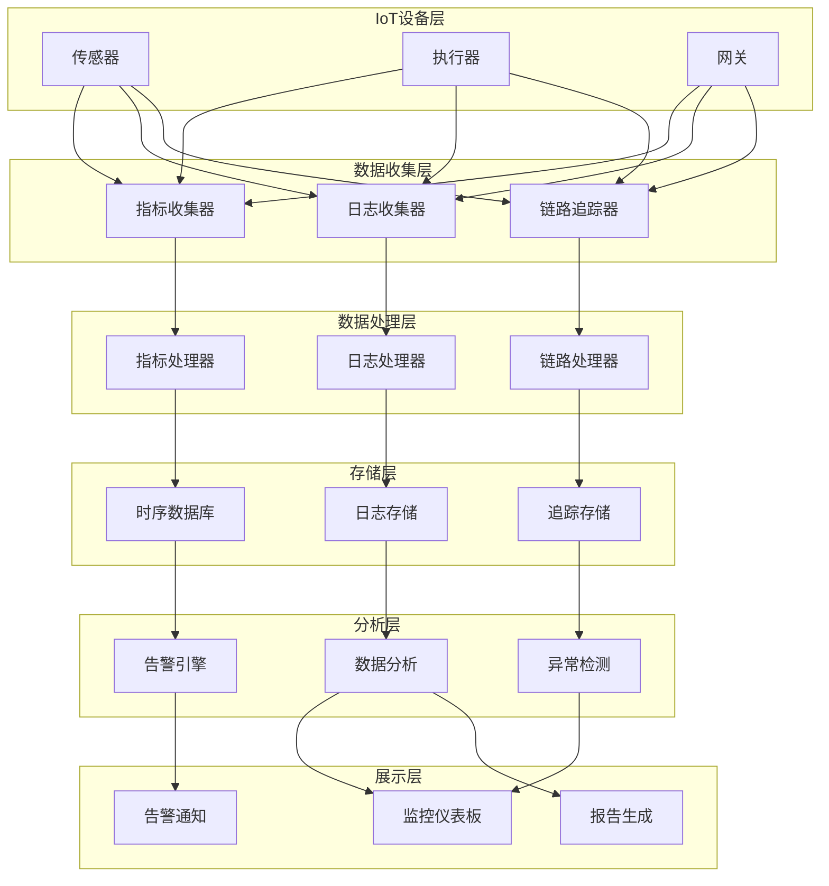
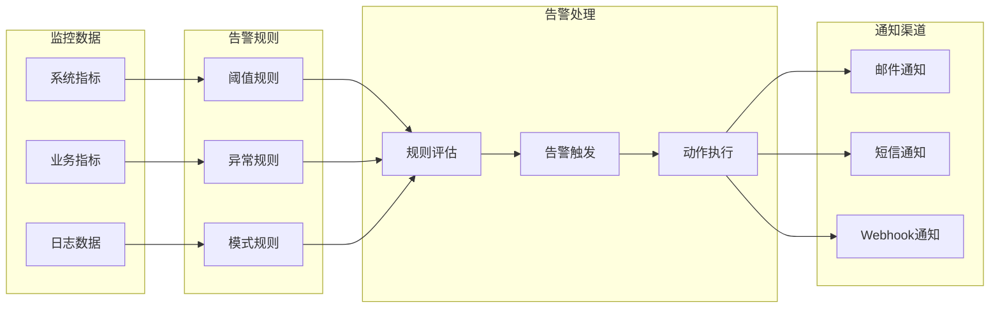

# 15. IoT监控可观测性与运维

## 15.1 可观测性概述

### 15.1.1 可观测性定义

**定义15.1（可观测性）**：\( Observability = Metrics + Logs + Traces \)，即通过指标、日志、链路追踪实现系统可观测。

### 15.1.2 可观测性支柱

- **指标（Metrics）**：数值型数据，反映系统状态
- **日志（Logs）**：文本型数据，记录事件详情
- **链路追踪（Traces）**：请求链路，分析调用关系

## 15.2 指标监控

### 15.2.1 指标定义与收集

```rust
use metrics::{counter, gauge, histogram, describe_counter, describe_gauge, describe_histogram};

pub struct IoTMetrics {
    device_manager: DeviceManager,
}

impl IoTMetrics {
    pub fn new() -> Self {
        // 定义指标
        describe_counter!("iot.devices.registered", "已注册设备数量");
        describe_gauge!("iot.devices.online", "在线设备数量");
        describe_histogram!("iot.data.processing_time", "数据处理时间");
        describe_counter!("iot.data.processed", "已处理数据量");
        describe_gauge!("iot.system.memory_usage", "系统内存使用率");
        describe_gauge!("iot.system.cpu_usage", "系统CPU使用率");
        
        Self {
            device_manager: DeviceManager::new(),
        }
    }
    
    pub async fn record_device_registration(&self, device_id: &str) {
        counter!("iot.devices.registered", 1, "device_id" => device_id.to_string());
        gauge!("iot.devices.online", self.device_manager.get_online_count() as f64);
    }
    
    pub async fn record_data_processing(&self, device_id: &str, processing_time: Duration) {
        counter!("iot.data.processed", 1, "device_id" => device_id.to_string());
        histogram!("iot.data.processing_time", processing_time.as_millis() as f64);
    }
    
    pub async fn record_system_metrics(&self) {
        let memory_usage = self.get_memory_usage().await;
        let cpu_usage = self.get_cpu_usage().await;
        
        gauge!("iot.system.memory_usage", memory_usage);
        gauge!("iot.system.cpu_usage", cpu_usage);
    }
    
    async fn get_memory_usage(&self) -> f64 {
        // 获取系统内存使用率
        let mem_info = sysinfo::System::new_all();
        let total_memory = mem_info.total_memory() as f64;
        let used_memory = mem_info.used_memory() as f64;
        (used_memory / total_memory) * 100.0
    }
    
    async fn get_cpu_usage(&self) -> f64 {
        // 获取系统CPU使用率
        let mut sys = sysinfo::System::new_all();
        sys.refresh_cpu();
        sys.global_cpu_info().cpu_usage()
    }
}
```

### 15.2.2 自定义指标

```rust
use std::sync::atomic::{AtomicU64, Ordering};

pub struct CustomMetrics {
    total_data_points: AtomicU64,
    failed_operations: AtomicU64,
    active_connections: AtomicU64,
}

impl CustomMetrics {
    pub fn new() -> Self {
        Self {
            total_data_points: AtomicU64::new(0),
            failed_operations: AtomicU64::new(0),
            active_connections: AtomicU64::new(0),
        }
    }
    
    pub fn increment_data_points(&self) {
        self.total_data_points.fetch_add(1, Ordering::Relaxed);
    }
    
    pub fn increment_failed_operations(&self) {
        self.failed_operations.fetch_add(1, Ordering::Relaxed);
    }
    
    pub fn set_active_connections(&self, count: u64) {
        self.active_connections.store(count, Ordering::Relaxed);
    }
    
    pub fn get_metrics(&self) -> MetricsSnapshot {
        MetricsSnapshot {
            total_data_points: self.total_data_points.load(Ordering::Relaxed),
            failed_operations: self.failed_operations.load(Ordering::Relaxed),
            active_connections: self.active_connections.load(Ordering::Relaxed),
            success_rate: self.calculate_success_rate(),
        }
    }
    
    fn calculate_success_rate(&self) -> f64 {
        let total = self.total_data_points.load(Ordering::Relaxed);
        let failed = self.failed_operations.load(Ordering::Relaxed);
        
        if total == 0 {
            100.0
        } else {
            ((total - failed) as f64 / total as f64) * 100.0
        }
    }
}
```

## 15.3 日志管理

### 15.3.1 结构化日志

```rust
use tracing::{info, warn, error, instrument, Level};
use tracing_subscriber::{layer::SubscriberExt, util::SubscriberInitExt};

pub struct IoTLogger {
    logger: tracing::Logger,
}

impl IoTLogger {
    pub fn init() {
        tracing_subscriber::registry()
            .with(
                tracing_subscriber::EnvFilter::try_from_default_env()
                    .unwrap_or_else(|_| "iot_system=info".into()),
            )
            .with(tracing_subscriber::fmt::layer())
            .init();
    }
    
    #[instrument(skip(self), fields(device_id = %device_id))]
    pub async fn log_device_connection(&self, device_id: &str, connection_info: &ConnectionInfo) {
        info!(
            device_id = %device_id,
            ip_address = %connection_info.ip_address,
            protocol = %connection_info.protocol,
            "设备连接成功"
        );
    }
    
    #[instrument(skip(self), fields(device_id = %device_id))]
    pub async fn log_device_disconnection(&self, device_id: &str, reason: &str) {
        warn!(
            device_id = %device_id,
            reason = %reason,
            "设备连接断开"
        );
    }
    
    #[instrument(skip(self), fields(device_id = %device_id))]
    pub async fn log_data_processing_error(&self, device_id: &str, error: &Error) {
        error!(
            device_id = %device_id,
            error = %error,
            "数据处理失败"
        );
    }
    
    #[instrument(skip(self))]
    pub async fn log_system_startup(&self, config: &SystemConfig) {
        info!(
            version = %config.version,
            environment = %config.environment,
            "IoT系统启动"
        );
    }
    
    #[instrument(skip(self))]
    pub async fn log_system_shutdown(&self, reason: &str) {
        warn!(
            reason = %reason,
            "IoT系统关闭"
        );
    }
}
```

### 15.3.2 日志聚合与分析

```rust
use elasticsearch::{Elasticsearch, IndexParts};
use serde_json::json;

pub struct LogAggregator {
    elasticsearch_client: Elasticsearch,
}

impl LogAggregator {
    pub fn new(elasticsearch_url: &str) -> Result<Self, Error> {
        let client = Elasticsearch::default()
            .url(elasticsearch_url)
            .build()?;
        
        Ok(Self {
            elasticsearch_client: client,
        })
    }
    
    pub async fn index_log(&self, log_entry: &LogEntry) -> Result<(), Error> {
        let index_name = format!("iot-logs-{}", 
            log_entry.timestamp.format("%Y.%m.%d"));
        
        let response = self.elasticsearch_client
            .index(IndexParts::Index(&index_name))
            .body(json!({
                "timestamp": log_entry.timestamp,
                "level": log_entry.level,
                "device_id": log_entry.device_id,
                "message": log_entry.message,
                "metadata": log_entry.metadata,
            }))
            .send()
            .await?;
        
        if !response.status_code().is_success() {
            return Err(Error::LogIndexingFailed);
        }
        
        Ok(())
    }
    
    pub async fn search_logs(&self, query: &LogQuery) -> Result<Vec<LogEntry>, Error> {
        let search_body = json!({
            "query": {
                "bool": {
                    "must": [
                        {"match": {"level": query.level}},
                        {"range": {"timestamp": {
                            "gte": query.start_time,
                            "lte": query.end_time
                        }}}
                    ],
                    "filter": [
                        {"term": {"device_id": query.device_id}}
                    ]
                }
            },
            "sort": [{"timestamp": {"order": "desc"}}],
            "size": query.limit
        });
        
        let response = self.elasticsearch_client
            .search()
            .body(search_body)
            .send()
            .await?;
        
        // 解析响应并转换为LogEntry
        let search_result: SearchResult<LogEntry> = response.json().await?;
        Ok(search_result.hits.hits.into_iter()
            .map(|hit| hit._source)
            .collect())
    }
}
```

## 15.4 链路追踪

### 15.4.1 分布式追踪

```rust
use opentelemetry::{global, trace::{Tracer, Span}};
use opentelemetry_jaeger as jaeger;

pub struct IoTTracer {
    tracer: Tracer,
}

impl IoTTracer {
    pub fn init() -> Result<Self, Error> {
        let tracer = opentelemetry_jaeger::new_agent_pipeline()
            .with_service_name("iot-system")
            .install_simple()?;
        
        Ok(Self { tracer })
    }
    
    pub async fn trace_data_flow(&self, device_id: &str, data: &SensorData) -> Result<(), Error> {
        let mut span = self.tracer.start("data_processing");
        span.set_attribute("device_id", device_id.to_string());
        span.set_attribute("data_type", "sensor_data");
        
        // 数据验证
        {
            let mut validation_span = self.tracer.start("data_validation");
            validation_span.set_attribute("device_id", device_id.to_string());
            
            self.validate_data(data).await?;
            validation_span.end();
        }
        
        // 数据存储
        {
            let mut storage_span = self.tracer.start("data_storage");
            storage_span.set_attribute("device_id", device_id.to_string());
            
            self.store_data(data).await?;
            storage_span.end();
        }
        
        // 数据分析
        {
            let mut analysis_span = self.tracer.start("data_analysis");
            analysis_span.set_attribute("device_id", device_id.to_string());
            
            self.analyze_data(data).await?;
            analysis_span.end();
        }
        
        span.end();
        Ok(())
    }
    
    async fn validate_data(&self, data: &SensorData) -> Result<(), Error> {
        // 数据验证逻辑
        if data.temperature < -50.0 || data.temperature > 100.0 {
            return Err(Error::InvalidData);
        }
        Ok(())
    }
    
    async fn store_data(&self, data: &SensorData) -> Result<(), Error> {
        // 数据存储逻辑
        // 模拟存储操作
        tokio::time::sleep(Duration::from_millis(10)).await;
        Ok(())
    }
    
    async fn analyze_data(&self, data: &SensorData) -> Result<(), Error> {
        // 数据分析逻辑
        // 模拟分析操作
        tokio::time::sleep(Duration::from_millis(20)).await;
        Ok(())
    }
}
```

### 15.4.2 链路上下文传播

```rust
use opentelemetry::propagation::{TextMapPropagator, TraceContextPropagator};
use opentelemetry::trace::SpanContext;

pub struct TraceContext {
    propagator: TraceContextPropagator,
}

impl TraceContext {
    pub fn new() -> Self {
        Self {
            propagator: TraceContextPropagator::new(),
        }
    }
    
    pub fn inject_context(&self, span_context: &SpanContext, headers: &mut HashMap<String, String>) {
        self.propagator.inject_context(span_context, &mut HeaderInjector(headers));
    }
    
    pub fn extract_context(&self, headers: &HashMap<String, String>) -> SpanContext {
        self.propagator.extract_context(&HeaderExtractor(headers))
    }
}

struct HeaderInjector<'a>(&'a mut HashMap<String, String>);

impl<'a> opentelemetry::propagation::Injector for HeaderInjector<'a> {
    fn set(&mut self, key: &str, value: String) {
        self.0.insert(key.to_string(), value);
    }
}

struct HeaderExtractor<'a>(&'a HashMap<String, String>);

impl<'a> opentelemetry::propagation::Extractor for HeaderExtractor<'a> {
    fn get(&self, key: &str) -> Option<&str> {
        self.0.get(key).map(|s| s.as_str())
    }
    
    fn keys(&self) -> Vec<&str> {
        self.0.keys().map(|s| s.as_str()).collect()
    }
}
```

## 15.5 告警系统

### 15.5.1 告警规则定义

```rust
use serde::{Deserialize, Serialize};

#[derive(Debug, Serialize, Deserialize)]
pub struct AlertRule {
    pub id: String,
    pub name: String,
    pub description: String,
    pub condition: AlertCondition,
    pub severity: AlertSeverity,
    pub actions: Vec<AlertAction>,
    pub enabled: bool,
}

#[derive(Debug, Serialize, Deserialize)]
pub enum AlertCondition {
    Threshold {
        metric: String,
        operator: ThresholdOperator,
        value: f64,
        duration: Duration,
    },
    Anomaly {
        metric: String,
        sensitivity: f64,
        window_size: Duration,
    },
    Pattern {
        pattern: String,
        occurrences: usize,
        time_window: Duration,
    },
}

#[derive(Debug, Serialize, Deserialize)]
pub enum ThresholdOperator {
    GreaterThan,
    LessThan,
    Equal,
    NotEqual,
}

#[derive(Debug, Serialize, Deserialize)]
pub enum AlertSeverity {
    Critical,
    Warning,
    Info,
}

#[derive(Debug, Serialize, Deserialize)]
pub enum AlertAction {
    Email { recipients: Vec<String> },
    Slack { channel: String, webhook_url: String },
    Webhook { url: String },
    SMS { phone_numbers: Vec<String> },
}

pub struct AlertManager {
    rules: Vec<AlertRule>,
    alert_history: Vec<Alert>,
}

impl AlertManager {
    pub fn new() -> Self {
        Self {
            rules: Vec::new(),
            alert_history: Vec::new(),
        }
    }
    
    pub fn add_rule(&mut self, rule: AlertRule) {
        self.rules.push(rule);
    }
    
    pub async fn evaluate_rules(&mut self, metrics: &MetricsSnapshot) -> Result<Vec<Alert>, Error> {
        let mut triggered_alerts = Vec::new();
        
        for rule in &self.rules {
            if !rule.enabled {
                continue;
            }
            
            if self.evaluate_condition(&rule.condition, metrics).await? {
                let alert = Alert {
                    id: uuid::Uuid::new_v4().to_string(),
                    rule_id: rule.id.clone(),
                    severity: rule.severity.clone(),
                    message: format!("告警: {}", rule.name),
                    timestamp: Utc::now(),
                    metadata: metrics.clone(),
                };
                
                triggered_alerts.push(alert.clone());
                self.execute_actions(&rule.actions, &alert).await?;
            }
        }
        
        Ok(triggered_alerts)
    }
    
    async fn evaluate_condition(&self, condition: &AlertCondition, metrics: &MetricsSnapshot) -> Result<bool, Error> {
        match condition {
            AlertCondition::Threshold { metric, operator, value, duration: _ } => {
                let current_value = self.get_metric_value(metric, metrics)?;
                Ok(self.compare_values(current_value, *operator, *value))
            }
            AlertCondition::Anomaly { metric, sensitivity, window_size: _ } => {
                let current_value = self.get_metric_value(metric, metrics)?;
                let historical_values = self.get_historical_values(metric).await?;
                Ok(self.detect_anomaly(current_value, &historical_values, *sensitivity))
            }
            AlertCondition::Pattern { pattern, occurrences, time_window: _ } => {
                let recent_logs = self.get_recent_logs().await?;
                Ok(self.detect_pattern(pattern, &recent_logs, *occurrences))
            }
        }
    }
    
    async fn execute_actions(&self, actions: &[AlertAction], alert: &Alert) -> Result<(), Error> {
        for action in actions {
            match action {
                AlertAction::Email { recipients } => {
                    self.send_email_alert(recipients, alert).await?;
                }
                AlertAction::Slack { channel, webhook_url } => {
                    self.send_slack_alert(channel, webhook_url, alert).await?;
                }
                AlertAction::Webhook { url } => {
                    self.send_webhook_alert(url, alert).await?;
                }
                AlertAction::SMS { phone_numbers } => {
                    self.send_sms_alert(phone_numbers, alert).await?;
                }
            }
        }
        Ok(())
    }
}
```

## 15.6 可视化仪表板

### 15.6.1 实时监控仪表板

```rust
use actix_web::{web, App, HttpServer, HttpResponse};
use serde_json::json;

pub struct DashboardService {
    metrics_collector: IoTMetrics,
    alert_manager: AlertManager,
}

impl DashboardService {
    pub fn new() -> Self {
        Self {
            metrics_collector: IoTMetrics::new(),
            alert_manager: AlertManager::new(),
        }
    }
    
    pub async fn get_system_overview(&self) -> Result<HttpResponse, Error> {
        let metrics = self.metrics_collector.get_current_metrics().await?;
        let alerts = self.alert_manager.get_active_alerts().await?;
        
        let overview = json!({
            "system_health": {
                "status": self.calculate_health_status(&metrics),
                "uptime": self.get_system_uptime(),
                "version": env!("CARGO_PKG_VERSION"),
            },
            "device_summary": {
                "total_devices": metrics.total_devices,
                "online_devices": metrics.online_devices,
                "offline_devices": metrics.total_devices - metrics.online_devices,
            },
            "data_summary": {
                "total_data_points": metrics.total_data_points,
                "data_processing_rate": metrics.data_processing_rate,
                "success_rate": metrics.success_rate,
            },
            "system_resources": {
                "cpu_usage": metrics.cpu_usage,
                "memory_usage": metrics.memory_usage,
                "disk_usage": metrics.disk_usage,
            },
            "active_alerts": alerts,
        });
        
        Ok(HttpResponse::Ok().json(overview))
    }
    
    pub async fn get_device_details(&self, device_id: &str) -> Result<HttpResponse, Error> {
        let device_metrics = self.metrics_collector.get_device_metrics(device_id).await?;
        let device_logs = self.get_device_logs(device_id).await?;
        
        let details = json!({
            "device_info": {
                "id": device_id,
                "name": device_metrics.name,
                "type": device_metrics.device_type,
                "status": device_metrics.status,
                "last_seen": device_metrics.last_seen,
            },
            "performance_metrics": {
                "data_points_today": device_metrics.data_points_today,
                "average_response_time": device_metrics.average_response_time,
                "error_rate": device_metrics.error_rate,
            },
            "recent_logs": device_logs,
        });
        
        Ok(HttpResponse::Ok().json(details))
    }
    
    pub async fn get_metrics_timeseries(&self, metric: &str, duration: &str) -> Result<HttpResponse, Error> {
        let timeseries_data = self.metrics_collector.get_timeseries_data(metric, duration).await?;
        
        Ok(HttpResponse::Ok().json(timeseries_data))
    }
}
```

## 15.7 监控架构图

### 15.7.1 整体监控架构



### 15.7.2 告警流程



## 15.8 跨主题引用

- 基础理论与行业标准详见[1. IoT基础理论与行业标准](01_Foundation.md)
- 性能与可靠性详见[5. IoT性能与可靠性](05_Performance_Reliability.md)
- 安全与隐私详见[4. IoT安全与隐私](04_Security_Privacy.md)
- 测试验证与质量保证详见[14. IoT测试验证与质量保证](14_Testing_Validation.md)

## 15.9 参考与扩展阅读

- [OpenTelemetry标准](https://opentelemetry.io/)
- [Prometheus监控](https://prometheus.io/)
- [Grafana可视化](https://grafana.com/)
- [ELK Stack日志分析](https://www.elastic.co/what-is/elk-stack)
