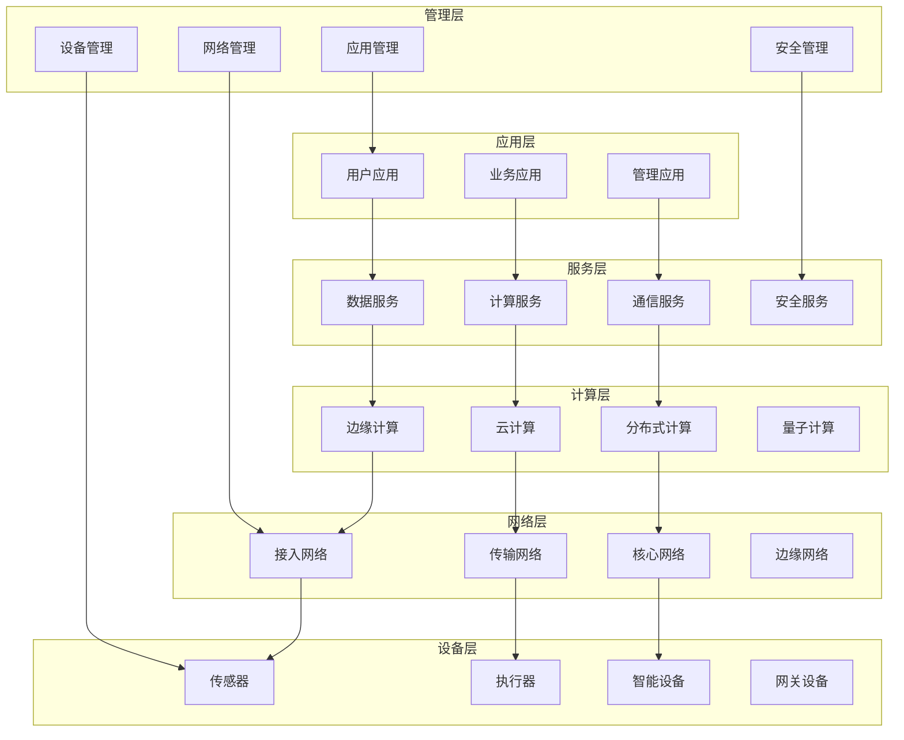
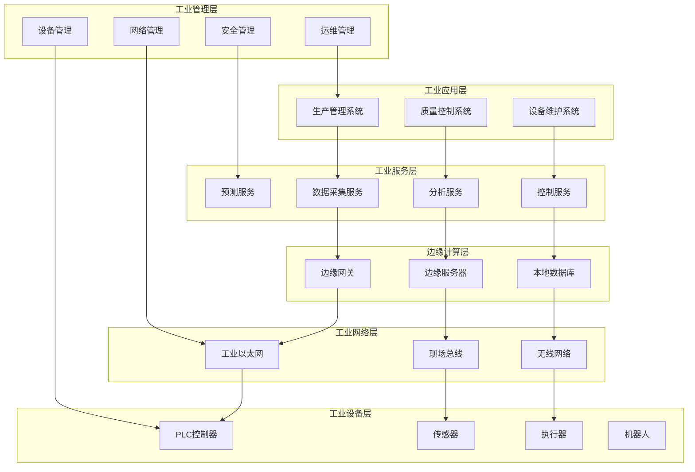
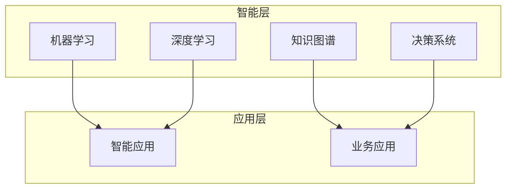
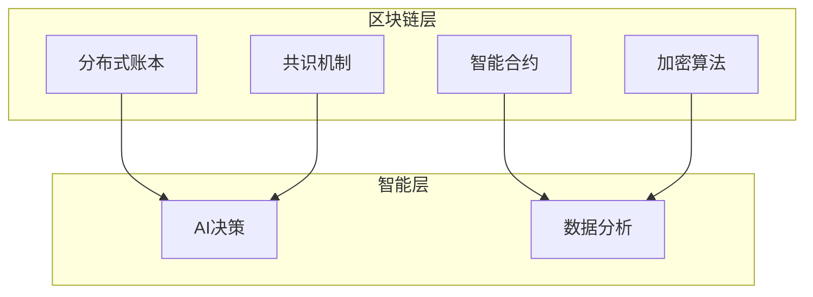

# IoT六元组模型形式化分析

## 📋 目录

1. [理论基础](#1-理论基础)
2. [六元组模型定义](#2-六元组模型定义)
3. [模型形式化](#3-模型形式化)
4. [关系分析](#4-关系分析)
5. [动态演化](#5-动态演化)
6. [实现方案](#6-实现方案)
7. [应用案例](#7-应用案例)
8. [性能分析](#8-性能分析)
9. [扩展模型](#9-扩展模型)
10. [未来展望](#10-未来展望)

## 1. 理论基础

### 1.1 系统论基础

**定义 1.1** (系统)
设 $S = (E, R, F)$ 为系统，其中：
- $E = \{e_1, e_2, ..., e_n\}$ 为元素集合
- $R = \{r_1, r_2, ..., r_m\}$ 为关系集合
- $F = \{f_1, f_2, ..., f_k\}$ 为功能集合

**系统性质**:
$$\text{System\_Property} = \text{Emergence} \land \text{Hierarchy} \land \text{Feedback}$$

### 1.2 信息论基础

**定义 1.2** (信息熵)
设 $X$ 为随机变量，其信息熵定义为：
$$H(X) = -\sum_{i=1}^n p_i \log_2 p_i$$

其中 $p_i$ 为事件 $i$ 的概率。

**互信息**:
$$I(X; Y) = H(X) + H(Y) - H(X, Y)$$

### 1.3 控制论基础

**定义 1.3** (控制系统)
设 $C = (I, P, O, F)$ 为控制系统，其中：
- $I$ 为输入集合
- $P$ 为处理集合
- $O$ 为输出集合
- $F$ 为反馈集合

**控制律**:
$$u(t) = K_p e(t) + K_i \int_0^t e(\tau) d\tau + K_d \frac{de(t)}{dt}$$

## 2. 六元组模型定义

### 2.1 基本定义

**定义 2.1** (IoT六元组模型)
设 $IoT = (D, N, C, A, S, M)$ 为IoT六元组模型，其中：
- $D = \{d_1, d_2, ..., d_n\}$ 为设备集合 (Devices)
- $N = \{n_1, n_2, ..., n_m\}$ 为网络集合 (Network)
- $C = \{c_1, c_2, ..., c_k\}$ 为计算集合 (Computing)
- $A = \{a_1, a_2, ..., a_l\}$ 为应用集合 (Application)
- $S = \{s_1, s_2, ..., s_p\}$ 为服务集合 (Service)
- $M = \{m_1, m_2, ..., m_q\}$ 为管理集合 (Management)

### 2.2 层次结构



### 2.3 元素属性

**定义 2.2** (元素属性)
设 $P = (I, S, F, T)$ 为元素属性，其中：
- $I$ 为标识属性 (Identity)
- $S$ 为状态属性 (State)
- $F$ 为功能属性 (Function)
- $T$ 为时间属性 (Time)

**设备属性**:
$$\text{Device\_Property} = (ID, Type, Status, Capability, Location, Time)$$

**网络属性**:
$$\text{Network\_Property} = (ID, Type, Bandwidth, Latency, Reliability, Security)$$

**计算属性**:
$$\text{Computing\_Property} = (ID, Type, Performance, Capacity, Availability, Power)$$

## 3. 模型形式化

### 3.1 形式化定义

**定义 3.1** (形式化IoT模型)
设 $F = (V, E, L, A)$ 为形式化IoT模型，其中：
- $V = D \cup N \cup C \cup A \cup S \cup M$ 为顶点集合
- $E \subseteq V \times V$ 为边集合
- $L: E \rightarrow \Sigma$ 为边标签函数
- $A: V \rightarrow \Delta$ 为顶点属性函数

**图表示**:
$$G = (V, E, L, A)$$

### 3.2 状态空间

**定义 3.2** (状态空间)
设 $S = S_D \times S_N \times S_C \times S_A \times S_S \times S_M$ 为状态空间，其中：
- $S_D$ 为设备状态空间
- $S_N$ 为网络状态空间
- $S_C$ 为计算状态空间
- $S_A$ 为应用状态空间
- $S_S$ 为服务状态空间
- $S_M$ 为管理状态空间

**状态转移**:
$$\delta: S \times \Sigma \rightarrow S$$

### 3.3 代数结构

**定义 3.3** (IoT代数)
设 $A = (IoT, +, \cdot, 0, 1)$ 为IoT代数，其中：
- $+$ 为并运算 (Union)
- $\cdot$ 为交运算 (Intersection)
- $0$ 为零元素 (Empty Set)
- $1$ 为单位元素 (Universal Set)

**运算性质**:
- **交换律**: $a + b = b + a$, $a \cdot b = b \cdot a$
- **结合律**: $(a + b) + c = a + (b + c)$, $(a \cdot b) \cdot c = a \cdot (b \cdot c)$
- **分配律**: $a \cdot (b + c) = a \cdot b + a \cdot c$

## 4. 关系分析

### 4.1 层次关系

**定义 4.1** (层次关系)
设 $H = (L, \preceq)$ 为层次关系，其中：
- $L = \{L_1, L_2, L_3, L_4, L_5, L_6\}$ 为层次集合
- $\preceq$ 为偏序关系

**层次映射**:
$$\text{Layer}: IoT \rightarrow L$$

**层次约束**:
$$\forall x, y \in IoT: \text{Layer}(x) \preceq \text{Layer}(y) \Rightarrow x \text{ depends on } y$$

### 4.2 依赖关系

**定义 4.2** (依赖关系)
设 $D = (V, E)$ 为依赖图，其中：
- $V$ 为顶点集合
- $E \subseteq V \times V$ 为依赖边集合

**依赖类型**:
1. **直接依赖**: $(x, y) \in E \Rightarrow x \text{ directly depends on } y$
2. **间接依赖**: $(x, y) \in E^+ \Rightarrow x \text{ indirectly depends on } y$
3. **循环依赖**: $(x, y) \in E^+ \land (y, x) \in E^+ \Rightarrow \text{circular dependency}$

### 4.3 通信关系

**定义 4.3** (通信关系)
设 $C = (N, P, M)$ 为通信关系，其中：
- $N$ 为节点集合
- $P$ 为协议集合
- $M$ 为消息集合

**通信模式**:
1. **点对点通信**: $C_{p2p} = \{(n_i, n_j) | n_i, n_j \in N\}$
2. **广播通信**: $C_{broadcast} = \{(n_i, N) | n_i \in N\}$
3. **多播通信**: $C_{multicast} = \{(n_i, N') | n_i \in N, N' \subseteq N\}$

## 5. 动态演化

### 5.1 演化模型

**定义 5.1** (演化模型)
设 $E = (S, T, F)$ 为演化模型，其中：
- $S$ 为状态集合
- $T$ 为时间集合
- $F: S \times T \rightarrow S$ 为演化函数

**演化方程**:
$$\frac{ds(t)}{dt} = f(s(t), t)$$

### 5.2 自适应机制

**定义 5.2** (自适应机制)
设 $A = (S, E, R, L)$ 为自适应机制，其中：
- $S$ 为系统状态
- $E$ 为环境状态
- $R$ 为响应函数
- $L$ 为学习函数

**自适应律**:
$$R(s, e) = L(s, e) \cdot \text{Feedback}(s, e)$$

### 5.3 优化策略

**定义 5.3** (优化目标)
设 $O = (P, C, Q)$ 为优化目标，其中：
- $P$ 为性能指标
- $C$ 为约束条件
- $Q$ 为质量指标

**优化问题**:
$$\min_{x \in X} f(x) \text{ subject to } g_i(x) \leq 0, i = 1, 2, ..., m$$

## 6. 实现方案

### 6.1 Rust实现框架

```rust
use serde::{Deserialize, Serialize};
use std::collections::HashMap;
use tokio::sync::RwLock;
use uuid::Uuid;

#[derive(Debug, Clone, Serialize, Deserialize)]
pub struct IoTElement {
    pub id: String,
    pub element_type: ElementType,
    pub properties: HashMap<String, serde_json::Value>,
    pub state: ElementState,
    pub timestamp: chrono::DateTime<chrono::Utc>,
}

#[derive(Debug, Clone, Serialize, Deserialize)]
pub enum ElementType {
    Device,
    Network,
    Computing,
    Application,
    Service,
    Management,
}

#[derive(Debug, Clone, Serialize, Deserialize)]
pub struct ElementState {
    pub status: Status,
    pub health: f64,
    pub performance: f64,
    pub availability: f64,
}

#[derive(Debug, Clone, Serialize, Deserialize)]
pub enum Status {
    Online,
    Offline,
    Degraded,
    Maintenance,
    Error,
}

#[derive(Debug, Clone, Serialize, Deserialize)]
pub struct IoTRelation {
    pub id: String,
    pub from_element: String,
    pub to_element: String,
    pub relation_type: RelationType,
    pub properties: HashMap<String, serde_json::Value>,
}

#[derive(Debug, Clone, Serialize, Deserialize)]
pub enum RelationType {
    DependsOn,
    CommunicatesWith,
    Controls,
    Monitors,
    Provides,
    Consumes,
}

#[derive(Debug, Clone, Serialize, Deserialize)]
pub struct SixElementModel {
    pub devices: HashMap<String, IoTElement>,
    pub networks: HashMap<String, IoTElement>,
    pub computing: HashMap<String, IoTElement>,
    pub applications: HashMap<String, IoTElement>,
    pub services: HashMap<String, IoTElement>,
    pub management: HashMap<String, IoTElement>,
    pub relations: Vec<IoTRelation>,
}

impl SixElementModel {
    pub fn new() -> Self {
        Self {
            devices: HashMap::new(),
            networks: HashMap::new(),
            computing: HashMap::new(),
            applications: HashMap::new(),
            services: HashMap::new(),
            management: HashMap::new(),
            relations: Vec::new(),
        }
    }

    pub fn add_element(&mut self, element: IoTElement) -> Result<(), Box<dyn std::error::Error>> {
        let id = element.id.clone();
        
        match element.element_type {
            ElementType::Device => {
                self.devices.insert(id, element);
            }
            ElementType::Network => {
                self.networks.insert(id, element);
            }
            ElementType::Computing => {
                self.computing.insert(id, element);
            }
            ElementType::Application => {
                self.applications.insert(id, element);
            }
            ElementType::Service => {
                self.services.insert(id, element);
            }
            ElementType::Management => {
                self.management.insert(id, element);
            }
        }
        
        Ok(())
    }

    pub fn add_relation(&mut self, relation: IoTRelation) -> Result<(), Box<dyn std::error::Error>> {
        if !self.element_exists(&relation.from_element) {
            return Err("From element does not exist".into());
        }
        
        if !self.element_exists(&relation.to_element) {
            return Err("To element does not exist".into());
        }
        
        self.relations.push(relation);
        Ok(())
    }

    fn element_exists(&self, element_id: &str) -> bool {
        self.devices.contains_key(element_id) ||
        self.networks.contains_key(element_id) ||
        self.computing.contains_key(element_id) ||
        self.applications.contains_key(element_id) ||
        self.services.contains_key(element_id) ||
        self.management.contains_key(element_id)
    }

    pub fn calculate_system_health(&self) -> f64 {
        let mut total_health = 0.0;
        let mut total_elements = 0;
        
        for element in self.devices.values() {
            total_health += element.state.health;
            total_elements += 1;
        }
        
        for element in self.networks.values() {
            total_health += element.state.health;
            total_elements += 1;
        }
        
        for element in self.computing.values() {
            total_health += element.state.health;
            total_elements += 1;
        }
        
        for element in self.applications.values() {
            total_health += element.state.health;
            total_elements += 1;
        }
        
        for element in self.services.values() {
            total_health += element.state.health;
            total_elements += 1;
        }
        
        for element in self.management.values() {
            total_health += element.state.health;
            total_elements += 1;
        }
        
        if total_elements > 0 {
            total_health / total_elements as f64
        } else {
            0.0
        }
    }
}

pub struct IoTModelManager {
    model: RwLock<SixElementModel>,
}

impl IoTModelManager {
    pub fn new() -> Self {
        Self {
            model: RwLock::new(SixElementModel::new()),
        }
    }

    pub async fn add_element(&self, element: IoTElement) -> Result<(), Box<dyn std::error::Error>> {
        let mut model = self.model.write().await;
        model.add_element(element)
    }

    pub async fn get_system_health(&self) -> f64 {
        let model = self.model.read().await;
        model.calculate_system_health()
    }
}
```

### 6.2 Golang实现框架

```go
package iotmodel

import (
    "encoding/json"
    "fmt"
    "sync"
    "time"
)

// ElementType 元素类型
type ElementType string

const (
    ElementTypeDevice      ElementType = "device"
    ElementTypeNetwork     ElementType = "network"
    ElementTypeComputing   ElementType = "computing"
    ElementTypeApplication ElementType = "application"
    ElementTypeService     ElementType = "service"
    ElementTypeManagement  ElementType = "management"
)

// Status 状态类型
type Status string

const (
    StatusOnline      Status = "online"
    StatusOffline     Status = "offline"
    StatusDegraded    Status = "degraded"
    StatusMaintenance Status = "maintenance"
    StatusError       Status = "error"
)

// RelationType 关系类型
type RelationType string

const (
    RelationTypeDependsOn      RelationType = "depends_on"
    RelationTypeCommunicatesWith RelationType = "communicates_with"
    RelationTypeControls       RelationType = "controls"
    RelationTypeMonitors       RelationType = "monitors"
    RelationTypeProvides       RelationType = "provides"
    RelationTypeConsumes       RelationType = "consumes"
)

// ElementState 元素状态
type ElementState struct {
    Status       Status  `json:"status"`
    Health       float64 `json:"health"`
    Performance  float64 `json:"performance"`
    Availability float64 `json:"availability"`
}

// IoTElement IoT元素
type IoTElement struct {
    ID         string                 `json:"id"`
    ElementType ElementType           `json:"element_type"`
    Properties map[string]interface{} `json:"properties"`
    State      ElementState           `json:"state"`
    Timestamp  time.Time              `json:"timestamp"`
}

// IoTRelation IoT关系
type IoTRelation struct {
    ID           string                 `json:"id"`
    FromElement  string                 `json:"from_element"`
    ToElement    string                 `json:"to_element"`
    RelationType RelationType           `json:"relation_type"`
    Properties   map[string]interface{} `json:"properties"`
}

// SixElementModel 六元组模型
type SixElementModel struct {
    Devices      map[string]*IoTElement `json:"devices"`
    Networks     map[string]*IoTElement `json:"networks"`
    Computing    map[string]*IoTElement `json:"computing"`
    Applications map[string]*IoTElement `json:"applications"`
    Services     map[string]*IoTElement `json:"services"`
    Management   map[string]*IoTElement `json:"management"`
    Relations    []*IoTRelation         `json:"relations"`
    mu           sync.RWMutex
}

// NewSixElementModel 创建六元组模型
func NewSixElementModel() *SixElementModel {
    return &SixElementModel{
        Devices:      make(map[string]*IoTElement),
        Networks:     make(map[string]*IoTElement),
        Computing:    make(map[string]*IoTElement),
        Applications: make(map[string]*IoTElement),
        Services:     make(map[string]*IoTElement),
        Management:   make(map[string]*IoTElement),
        Relations:    make([]*IoTRelation, 0),
    }
}

// AddElement 添加元素
func (m *SixElementModel) AddElement(element *IoTElement) error {
    m.mu.Lock()
    defer m.mu.Unlock()

    element.Timestamp = time.Now()

    switch element.ElementType {
    case ElementTypeDevice:
        m.Devices[element.ID] = element
    case ElementTypeNetwork:
        m.Networks[element.ID] = element
    case ElementTypeComputing:
        m.Computing[element.ID] = element
    case ElementTypeApplication:
        m.Applications[element.ID] = element
    case ElementTypeService:
        m.Services[element.ID] = element
    case ElementTypeManagement:
        m.Management[element.ID] = element
    default:
        return fmt.Errorf("unknown element type: %s", element.ElementType)
    }

    return nil
}

// AddRelation 添加关系
func (m *SixElementModel) AddRelation(relation *IoTRelation) error {
    m.mu.Lock()
    defer m.mu.Unlock()

    // 验证关系中的元素是否存在
    if !m.elementExists(relation.FromElement) {
        return fmt.Errorf("from element does not exist: %s", relation.FromElement)
    }

    if !m.elementExists(relation.ToElement) {
        return fmt.Errorf("to element does not exist: %s", relation.ToElement)
    }

    m.Relations = append(m.Relations, relation)
    return nil
}

// elementExists 检查元素是否存在
func (m *SixElementModel) elementExists(elementID string) bool {
    if _, exists := m.Devices[elementID]; exists {
        return true
    }
    if _, exists := m.Networks[elementID]; exists {
        return true
    }
    if _, exists := m.Computing[elementID]; exists {
        return true
    }
    if _, exists := m.Applications[elementID]; exists {
        return true
    }
    if _, exists := m.Services[elementID]; exists {
        return true
    }
    if _, exists := m.Management[elementID]; exists {
        return true
    }
    return false
}

// GetElement 获取元素
func (m *SixElementModel) GetElement(elementID string) *IoTElement {
    m.mu.RLock()
    defer m.mu.RUnlock()

    if element, exists := m.Devices[elementID]; exists {
        return element
    }
    if element, exists := m.Networks[elementID]; exists {
        return element
    }
    if element, exists := m.Computing[elementID]; exists {
        return element
    }
    if element, exists := m.Applications[elementID]; exists {
        return element
    }
    if element, exists := m.Services[elementID]; exists {
        return element
    }
    if element, exists := m.Management[elementID]; exists {
        return element
    }
    return nil
}

// GetRelatedElements 获取相关元素
func (m *SixElementModel) GetRelatedElements(elementID string) []*IoTElement {
    m.mu.RLock()
    defer m.mu.RUnlock()

    related := make([]*IoTElement, 0)

    for _, relation := range m.Relations {
        if relation.FromElement == elementID {
            if element := m.GetElement(relation.ToElement); element != nil {
                related = append(related, element)
            }
        } else if relation.ToElement == elementID {
            if element := m.GetElement(relation.FromElement); element != nil {
                related = append(related, element)
            }
        }
    }

    return related
}

// UpdateElementState 更新元素状态
func (m *SixElementModel) UpdateElementState(elementID string, state ElementState) error {
    m.mu.Lock()
    defer m.mu.Unlock()

    if element, exists := m.Devices[elementID]; exists {
        element.State = state
        element.Timestamp = time.Now()
        return nil
    }

    if element, exists := m.Networks[elementID]; exists {
        element.State = state
        element.Timestamp = time.Now()
        return nil
    }

    if element, exists := m.Computing[elementID]; exists {
        element.State = state
        element.Timestamp = time.Now()
        return nil
    }

    if element, exists := m.Applications[elementID]; exists {
        element.State = state
        element.Timestamp = time.Now()
        return nil
    }

    if element, exists := m.Services[elementID]; exists {
        element.State = state
        element.Timestamp = time.Now()
        return nil
    }

    if element, exists := m.Management[elementID]; exists {
        element.State = state
        element.Timestamp = time.Now()
        return nil
    }

    return fmt.Errorf("element not found: %s", elementID)
}

// CalculateSystemHealth 计算系统健康度
func (m *SixElementModel) CalculateSystemHealth() float64 {
    m.mu.RLock()
    defer m.mu.RUnlock()

    totalHealth := 0.0
    totalElements := 0

    for _, element := range m.Devices {
        totalHealth += element.State.Health
        totalElements++
    }

    for _, element := range m.Networks {
        totalHealth += element.State.Health
        totalElements++
    }

    for _, element := range m.Computing {
        totalHealth += element.State.Health
        totalElements++
    }

    for _, element := range m.Applications {
        totalHealth += element.State.Health
        totalElements++
    }

    for _, element := range m.Services {
        totalHealth += element.State.Health
        totalElements++
    }

    for _, element := range m.Management {
        totalHealth += element.State.Health
        totalElements++
    }

    if totalElements > 0 {
        return totalHealth / float64(totalElements)
    }
    return 0.0
}

// GetDependencyChain 获取依赖链
func (m *SixElementModel) GetDependencyChain(elementID string) []string {
    m.mu.RLock()
    defer m.mu.RUnlock()

    chain := make([]string, 0)
    visited := make(map[string]bool)

    m.dfsDependencies(elementID, &chain, visited)

    return chain
}

// dfsDependencies 深度优先搜索依赖
func (m *SixElementModel) dfsDependencies(elementID string, chain *[]string, visited map[string]bool) {
    if visited[elementID] {
        return
    }

    visited[elementID] = true
    *chain = append(*chain, elementID)

    for _, relation := range m.Relations {
        if relation.FromElement == elementID {
            m.dfsDependencies(relation.ToElement, chain, visited)
        }
    }
}

// IoTModelManager IoT模型管理器
type IoTModelManager struct {
    model *SixElementModel
    mu    sync.RWMutex
}

// NewIoTModelManager 创建IoT模型管理器
func NewIoTModelManager() *IoTModelManager {
    return &IoTModelManager{
        model: NewSixElementModel(),
    }
}

// AddElement 添加元素
func (m *IoTModelManager) AddElement(element *IoTElement) error {
    m.mu.Lock()
    defer m.mu.Unlock()
    return m.model.AddElement(element)
}

// AddRelation 添加关系
func (m *IoTModelManager) AddRelation(relation *IoTRelation) error {
    m.mu.Lock()
    defer m.mu.Unlock()
    return m.model.AddRelation(relation)
}

// GetSystemHealth 获取系统健康度
func (m *IoTModelManager) GetSystemHealth() float64 {
    m.mu.RLock()
    defer m.mu.RUnlock()
    return m.model.CalculateSystemHealth()
}

// UpdateElementState 更新元素状态
func (m *IoTModelManager) UpdateElementState(elementID string, state ElementState) error {
    m.mu.Lock()
    defer m.mu.Unlock()
    return m.model.UpdateElementState(elementID, state)
}

// GetDependencyAnalysis 获取依赖分析
func (m *IoTModelManager) GetDependencyAnalysis(elementID string) []string {
    m.mu.RLock()
    defer m.mu.RUnlock()
    return m.model.GetDependencyChain(elementID)
}

// ToJSON 转换为JSON
func (m *IoTModelManager) ToJSON() ([]byte, error) {
    m.mu.RLock()
    defer m.mu.RUnlock()
    return json.Marshal(m.model)
}

// FromJSON 从JSON加载
func (m *IoTModelManager) FromJSON(data []byte) error {
    m.mu.Lock()
    defer m.mu.Unlock()
    return json.Unmarshal(data, &m.model)
}
```

## 7. 应用案例

### 7.1 智能家居系统

**案例描述**:
构建基于六元组模型的智能家居系统，包含传感器、控制器、网关、云平台等组件。

**模型实例**:

```rust
// 智能家居六元组模型实例
let mut smart_home = SixElementModel::new();

// 设备层
let temperature_sensor = IoTElement {
    id: "temp_sensor_001".to_string(),
    element_type: ElementType::Device,
    properties: {
        let mut props = HashMap::new();
        props.insert("type".to_string(), serde_json::json!("temperature_sensor"));
        props.insert("location".to_string(), serde_json::json!("living_room"));
        props.insert("unit".to_string(), serde_json::json!("celsius"));
        props
    },
    state: ElementState {
        status: Status::Online,
        health: 0.95,
        performance: 0.90,
        availability: 0.98,
    },
    timestamp: chrono::Utc::now(),
};

// 网络层
let wifi_network = IoTElement {
    id: "wifi_network_001".to_string(),
    element_type: ElementType::Network,
    properties: {
        let mut props = HashMap::new();
        props.insert("type".to_string(), serde_json::json!("wifi"));
        props.insert("ssid".to_string(), serde_json::json!("SmartHome_WiFi"));
        props.insert("frequency".to_string(), serde_json::json!("2.4GHz"));
        props
    },
    state: ElementState {
        status: Status::Online,
        health: 0.88,
        performance: 0.85,
        availability: 0.95,
    },
    timestamp: chrono::Utc::now(),
};

// 添加元素
smart_home.add_element(temperature_sensor).unwrap();
smart_home.add_element(wifi_network).unwrap();
```

### 7.2 工业物联网系统

**案例描述**:
构建工业物联网系统，包含生产线设备、工业网络、边缘计算、云平台等组件。

**系统架构**:



## 8. 性能分析

### 8.1 性能指标

**定义 8.1** (性能指标)
设 $P = (T, L, C, A)$ 为性能指标，其中：
- $T$ 为吞吐量 (Throughput)
- $L$ 为延迟 (Latency)
- $C$ 为容量 (Capacity)
- $A$ 为可用性 (Availability)

**性能模型**:
$$\text{Performance} = \alpha \cdot T + \beta \cdot \frac{1}{L} + \gamma \cdot C + \delta \cdot A$$

### 8.2 性能优化

**优化策略**:

1. **负载均衡**:
   $$\text{Load\_Balance} = \frac{\sum_{i=1}^n \text{Load}_i}{n}$$

2. **缓存优化**:
   $$\text{Cache\_Hit\_Rate} = \frac{\text{Cache\_Hits}}{\text{Total\_Requests}}$$

3. **并发优化**:
   $$\text{Concurrency} = \min(\text{CPU\_Cores}, \text{I/O\_Channels})$$

### 8.3 性能监控

**监控指标**:
- 系统响应时间: $\text{Response\_Time} = \text{Processing\_Time} + \text{Network\_Time}$
- 系统吞吐量: $\text{Throughput} = \frac{\text{Requests}}{\text{Time}}$
- 系统可用性: $\text{Availability} = \frac{\text{Uptime}}{\text{Total\_Time}}$

## 9. 扩展模型

### 9.1 七元组模型

**定义 9.1** (七元组模型)
设 $IoT_7 = (D, N, C, A, S, M, I)$ 为七元组模型，其中：
- $I = \{i_1, i_2, ..., i_r\}$ 为智能集合 (Intelligence)

**智能层**:


### 9.2 八元组模型

**定义 9.2** (八元组模型)
设 $IoT_8 = (D, N, C, A, S, M, I, B)$ 为八元组模型，其中：
- $B = \{b_1, b_2, ..., b_s\}$ 为区块链集合 (Blockchain)

**区块链层**:


### 9.3 动态扩展模型

**定义 9.3** (动态扩展模型)
设 $IoT_n = (E_1, E_2, ..., E_n)$ 为n元组模型，其中：
- $E_i$ 为第i个元素集合
- $n$ 为动态扩展的元素数量

**扩展规则**:
$$\text{Extension\_Rule}: E_n \rightarrow E_{n+1}$$

## 10. 未来展望

### 10.1 技术发展趋势

1. **AI/ML集成**:
   $$\text{AI\_Integration} = \text{Model} + \text{Learning} + \text{Adaptation}$$

2. **边缘计算**:
   $$\text{Edge\_Computing} = \text{Local\_Processing} + \text{Distributed\_Intelligence}$$

3. **量子计算**:
   $$\text{Quantum\_Computing} = \text{Quantum\_Algorithms} + \text{Quantum\_Networks}$$

### 10.2 标准化发展

1. **模型标准化**:
   - 建立统一的六元组模型标准
   - 定义标准接口和协议
   - 建立互操作性规范

2. **实现标准化**:
   - 提供标准实现框架
   - 建立测试验证体系
   - 制定最佳实践指南

### 10.3 应用发展

1. **行业应用**:
   - 智能制造
   - 智慧城市
   - 智能交通
   - 智能医疗

2. **技术创新**:
   - 新型传感器技术
   - 先进通信技术
   - 智能算法技术
   - 安全防护技术

---

**相关主题**:
- [IoT分层架构分析](01-Industry_Architecture/IoT-Layered-Architecture-Formal-Analysis.md)
- [IoT设备生命周期管理](02-Enterprise_Architecture/IoT-Device-Lifecycle-Formal-Analysis.md)
- [IoT核心对象抽象](03-Conceptual_Architecture/IoT-Core-Object-Abstraction-Formal-Analysis.md)
- [IoT分布式一致性](04-Algorithms/IoT-Distributed-Consensus-Formal-Analysis.md)
- [IoT Rust/Golang技术栈](05-Technology_Stack/IoT-Rust-Golang-Technology-Stack-Formal-Analysis.md)
- [IoT业务规范](06-Business_Specifications/IoT-Business-Specifications-Formal-Analysis.md)
- [IoT性能优化](07-Performance/IoT-Performance-Optimization-Formal-Analysis.md)
- [IoT安全架构](08-Security/IoT-Security-Architecture-Formal-Analysis.md)
- [IoT集成方案](09-Integration/IoT-Integration-Formal-Analysis.md)
- [IoT行业标准](10-Standards/IoT-Standards-Formal-Analysis.md) 