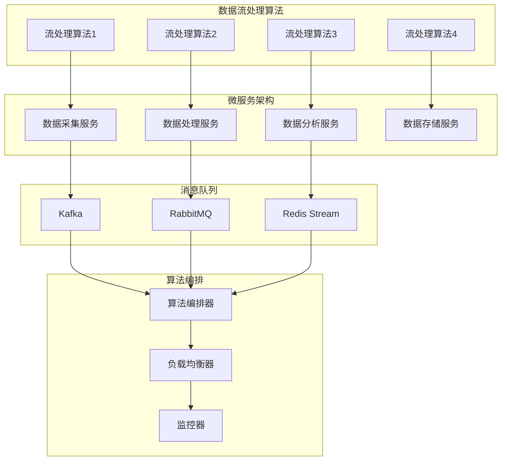
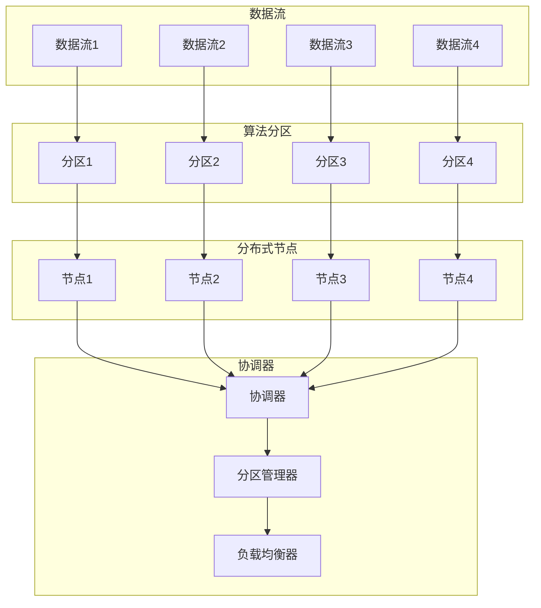
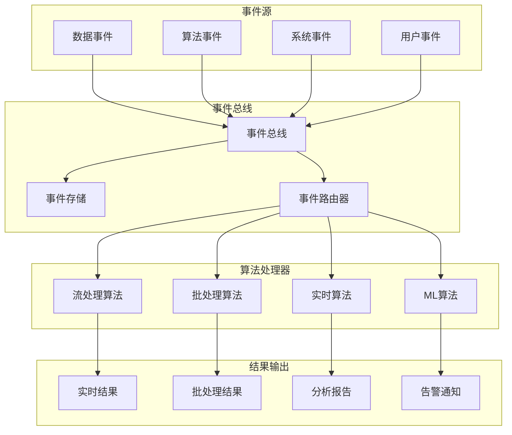
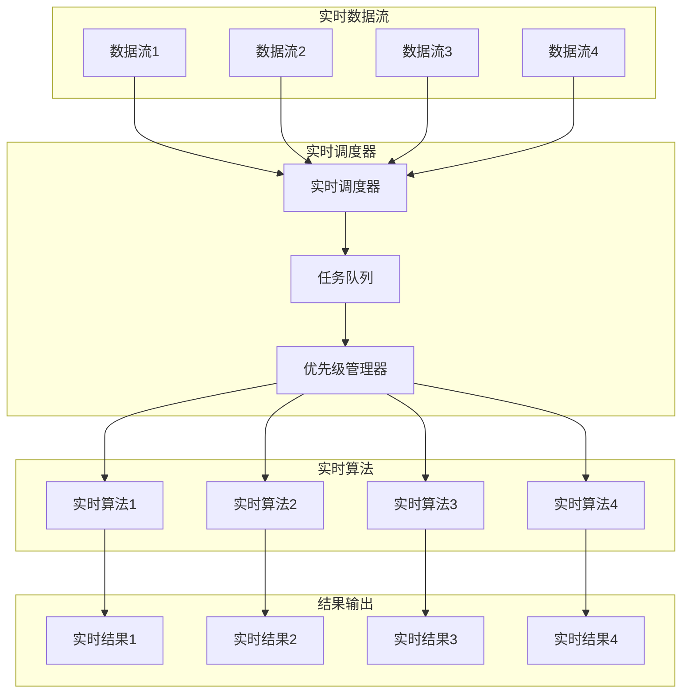

# 算法与系统集成分析

## 版本信息

- **版本**: 1.0.0
- **创建日期**: 2024-12-19
- **最后更新**: 2024-12-19
- **作者**: IoT团队
- **状态**: 正式版

## 1. 集成分析概述

### 1.1 分析目标

本文档分析IoT数据流处理算法与各种系统架构的集成关系，包括：

- **数据流处理算法**与**微服务架构**的集成
- **数据流处理算法**与**分布式系统**的集成
- **数据流处理算法**与**事件驱动系统**的集成
- **数据流处理算法**与**实时系统**的集成

### 1.2 算法分类

```rust
#[derive(Debug, Clone)]
pub struct AlgorithmCategory {
    pub category_id: String,
    pub name: String,
    pub description: String,
    pub algorithms: Vec<Algorithm>,
    pub system_requirements: Vec<SystemRequirement>,
}

#[derive(Debug, Clone)]
pub struct Algorithm {
    pub algorithm_id: String,
    pub name: String,
    pub algorithm_type: AlgorithmType,
    pub complexity: Complexity,
    pub resource_requirements: ResourceRequirements,
}

#[derive(Debug, Clone)]
pub enum AlgorithmType {
    StreamProcessing,    // 流处理算法
    BatchProcessing,     // 批处理算法
    RealTimeProcessing,  // 实时处理算法
    MachineLearning,     // 机器学习算法
    Optimization,        // 优化算法
}
```

## 2. 数据流处理算法与微服务架构集成

### 2.1 集成架构



### 2.2 算法服务化

```rust
#[derive(Debug, Clone)]
pub struct AlgorithmMicroservice {
    pub service_id: String,
    pub algorithm: Algorithm,
    pub service_config: ServiceConfig,
    pub api_endpoints: Vec<ApiEndpoint>,
    pub dependencies: Vec<ServiceDependency>,
}

#[derive(Debug, Clone)]
pub struct ServiceConfig {
    pub service_name: String,
    pub version: String,
    pub port: u16,
    pub health_check_path: String,
    pub metrics_path: String,
}

impl AlgorithmMicroservice {
    pub async fn process_data(&self, input_data: &[u8]) -> Result<Vec<u8>, ProcessingError> {
        // 1. 参数验证
        let validated_params = self.validate_parameters(input_data).await?;
        
        // 2. 算法执行
        let result = self.algorithm.execute(&validated_params).await?;
        
        // 3. 结果格式化
        let formatted_result = self.format_result(result).await?;
        
        Ok(formatted_result)
    }
    
    async fn validate_parameters(&self, input_data: &[u8]) -> Result<AlgorithmParameters, ProcessingError> {
        // 验证输入参数
        let params: AlgorithmParameters = serde_json::from_slice(input_data)?;
        
        // 检查参数有效性
        for param in &self.api_endpoints[0].algorithm_params {
            if !param.is_valid(&params) {
                return Err(ProcessingError::InvalidParameter(param.name.clone()));
            }
        }
        
        Ok(params)
    }
}
```

### 2.3 算法编排

```rust
#[derive(Debug, Clone)]
pub struct AlgorithmOrchestrator {
    pub orchestrator_id: String,
    pub algorithm_pipeline: Vec<AlgorithmMicroservice>,
    pub pipeline_config: PipelineConfig,
    pub monitoring: PipelineMonitoring,
}

#[derive(Debug, Clone)]
pub struct PipelineConfig {
    pub pipeline_name: String,
    pub stages: Vec<PipelineStage>,
    pub error_handling: ErrorHandlingStrategy,
    pub scaling_policy: ScalingPolicy,
}

impl AlgorithmOrchestrator {
    pub async fn execute_pipeline(&self, input_data: &[u8]) -> Result<Vec<u8>, OrchestrationError> {
        let mut current_data = input_data.to_vec();
        
        for stage in &self.pipeline_config.stages {
            // 1. 数据映射
            let mapped_input = self.map_input_data(&current_data, &stage.input_mapping).await?;
            
            // 2. 执行算法
            let stage_result = match stage.algorithm_service.process_data(&mapped_input).await {
                Ok(result) => result,
                Err(error) => {
                    return self.handle_stage_error(error, stage).await;
                }
            };
            
            // 3. 输出映射
            current_data = self.map_output_data(&stage_result, &stage.output_mapping).await?;
            
            // 4. 监控记录
            self.monitoring.record_stage_execution(stage, &stage_result).await;
        }
        
        Ok(current_data)
    }
}
```

## 3. 数据流处理算法与分布式系统集成

### 3.1 分布式算法架构



### 3.2 分布式算法实现

```rust
#[derive(Debug, Clone)]
pub struct DistributedAlgorithm {
    pub algorithm_id: String,
    pub algorithm: Algorithm,
    pub distribution_strategy: DistributionStrategy,
    pub coordination_mechanism: CoordinationMechanism,
    pub fault_tolerance: FaultToleranceStrategy,
}

#[derive(Debug, Clone)]
pub enum DistributionStrategy {
    DataParallel,      // 数据并行
    ModelParallel,     // 模型并行
    PipelineParallel,  // 流水线并行
    Hybrid,            // 混合并行
}

impl DistributedAlgorithm {
    pub async fn execute_distributed(&self, input_data: &[u8]) -> Result<Vec<u8>, DistributedProcessingError> {
        // 1. 数据分区
        let partitions = self.partition_data(input_data).await?;
        
        // 2. 任务分发
        let tasks = self.distribute_tasks(partitions).await?;
        
        // 3. 并行执行
        let results = self.execute_parallel(tasks).await?;
        
        // 4. 结果合并
        let merged_result = self.merge_results(results).await?;
        
        Ok(merged_result)
    }
    
    async fn partition_data(&self, input_data: &[u8]) -> Result<Vec<DataPartition>, DistributedProcessingError> {
        match &self.distribution_strategy {
            DistributionStrategy::DataParallel => {
                // 数据并行分区
                let data_size = input_data.len();
                let partition_count = self.get_node_count();
                let partition_size = data_size / partition_count;
                
                let mut partitions = Vec::new();
                for i in 0..partition_count {
                    let start = i * partition_size;
                    let end = if i == partition_count - 1 { data_size } else { (i + 1) * partition_size };
                    partitions.push(DataPartition {
                        partition_id: i,
                        data: input_data[start..end].to_vec(),
                    });
                }
                Ok(partitions)
            }
            DistributionStrategy::ModelParallel => {
                // 模型并行分区
                self.partition_model(input_data).await
            }
            DistributionStrategy::PipelineParallel => {
                // 流水线并行分区
                self.partition_pipeline(input_data).await
            }
            DistributionStrategy::Hybrid => {
                // 混合并行分区
                self.partition_hybrid(input_data).await
            }
        }
    }
}
```

### 3.3 容错机制

```rust
#[derive(Debug, Clone)]
pub struct FaultToleranceStrategy {
    pub failure_detection: FailureDetection,
    pub recovery_strategy: RecoveryStrategy,
    pub data_replication: DataReplication,
}

#[derive(Debug, Clone)]
pub enum RecoveryStrategy {
    Restart,        // 重启策略
    Checkpoint,     // 检查点策略
    Replication,    // 复制策略
    Adaptive,       // 自适应策略
}

impl DistributedAlgorithm {
    pub async fn handle_node_failure(&self, failed_node: &NodeId) -> Result<(), FaultToleranceError> {
        // 1. 检测节点故障
        if self.fault_tolerance.failure_detection.is_node_failed(failed_node).await? {
            // 2. 启动恢复策略
            match &self.fault_tolerance.recovery_strategy {
                RecoveryStrategy::Restart => {
                    self.restart_node(failed_node).await?;
                }
                RecoveryStrategy::Checkpoint => {
                    self.restore_from_checkpoint(failed_node).await?;
                }
                RecoveryStrategy::Replication => {
                    self.replicate_data(failed_node).await?;
                }
                RecoveryStrategy::Adaptive => {
                    self.adaptive_recovery(failed_node).await?;
                }
            }
            
            // 3. 重新分配任务
            self.redistribute_tasks(failed_node).await?;
        }
        Ok(())
    }
}
```

## 4. 数据流处理算法与事件驱动系统集成

### 4.1 事件驱动算法架构



### 4.2 事件驱动算法实现

```rust
#[derive(Debug, Clone)]
pub struct EventDrivenAlgorithm {
    pub algorithm_id: String,
    pub algorithm: Algorithm,
    pub event_handlers: Vec<EventHandler>,
    pub event_patterns: Vec<EventPattern>,
    pub result_publishers: Vec<ResultPublisher>,
}

#[derive(Debug, Clone)]
pub struct EventHandler {
    pub handler_id: String,
    pub event_type: EventType,
    pub processing_logic: Box<dyn EventProcessingLogic>,
    pub error_handler: Box<dyn ErrorHandler>,
}

impl EventDrivenAlgorithm {
    pub async fn process_event(&self, event: &Event) -> Result<Vec<Event>, EventProcessingError> {
        // 1. 事件路由
        let handlers = self.route_event(event).await?;
        
        // 2. 并行处理
        let mut results = Vec::new();
        let mut handles = Vec::new();
        
        for handler in handlers {
            let event_clone = event.clone();
            let handler_clone = handler.clone();
            let handle = tokio::spawn(async move {
                handler_clone.process(&event_clone).await
            });
            handles.push(handle);
        }
        
        // 3. 收集结果
        for handle in handles {
            match handle.await {
                Ok(result) => {
                    if let Ok(events) = result {
                        results.extend(events);
                    }
                }
                Err(_) => {
                    // 处理错误
                    self.handle_processing_error(event).await?;
                }
            }
        }
        
        // 4. 发布结果
        self.publish_results(&results).await?;
        
        Ok(results)
    }
    
    async fn route_event(&self, event: &Event) -> Result<Vec<EventHandler>, EventProcessingError> {
        let mut matched_handlers = Vec::new();
        
        for handler in &self.event_handlers {
            if handler.can_handle(event) {
                matched_handlers.push(handler.clone());
            }
        }
        
        // 检查事件模式
        for pattern in &self.event_patterns {
            if pattern.matches(event) {
                let pattern_handlers = self.get_pattern_handlers(pattern).await?;
                matched_handlers.extend(pattern_handlers);
            }
        }
        
        Ok(matched_handlers)
    }
}
```

## 5. 数据流处理算法与实时系统集成

### 5.1 实时算法架构



### 5.2 实时算法实现

```rust
#[derive(Debug, Clone)]
pub struct RealTimeAlgorithm {
    pub algorithm_id: String,
    pub algorithm: Algorithm,
    pub real_time_constraints: RealTimeConstraints,
    pub scheduling_policy: SchedulingPolicy,
    pub resource_manager: ResourceManager,
}

#[derive(Debug, Clone)]
pub struct RealTimeConstraints {
    pub deadline: Duration,
    pub period: Option<Duration>,
    pub priority: TaskPriority,
    pub worst_case_execution_time: Duration,
}

impl RealTimeAlgorithm {
    pub async fn execute_real_time(&self, input_data: &[u8]) -> Result<Vec<u8>, RealTimeProcessingError> {
        let start_time = Instant::now();
        
        // 1. 资源预留
        self.resource_manager.reserve_resources(&self.real_time_constraints).await?;
        
        // 2. 算法执行
        let result = self.algorithm.execute(input_data).await?;
        
        // 3. 检查截止时间
        let execution_time = start_time.elapsed();
        if execution_time > self.real_time_constraints.deadline {
            return Err(RealTimeProcessingError::DeadlineMissed);
        }
        
        // 4. 释放资源
        self.resource_manager.release_resources().await?;
        
        Ok(result)
    }
    
    pub async fn schedule_real_time_task(&self, task: RealTimeTask) -> Result<(), SchedulingError> {
        // 1. 可调度性分析
        if !self.is_schedulable(&task) {
            return Err(SchedulingError::NotSchedulable);
        }
        
        // 2. 优先级分配
        let priority = self.calculate_priority(&task);
        task.set_priority(priority);
        
        // 3. 资源分配
        self.allocate_resources(&task).await?;
        
        // 4. 任务调度
        self.scheduler.schedule_task(task).await?;
        
        Ok(())
    }
    
    fn is_schedulable(&self, task: &RealTimeTask) -> bool {
        // 使用速率单调调度(RMS)或最早截止时间优先(EDF)进行可调度性分析
        match self.scheduling_policy.algorithm {
            SchedulingAlgorithm::RateMonotonic => {
                self.rate_monotonic_analysis(task)
            }
            SchedulingAlgorithm::EarliestDeadlineFirst => {
                self.edf_analysis(task)
            }
            _ => false,
        }
    }
}
```

## 6. 算法优化策略

### 6.1 性能优化

```rust
#[derive(Debug, Clone)]
pub struct AlgorithmOptimizationStrategy {
    pub optimization_techniques: Vec<OptimizationTechnique>,
    pub performance_metrics: PerformanceMetrics,
    pub optimization_targets: Vec<OptimizationTarget>,
}

#[derive(Debug, Clone)]
pub enum OptimizationTechnique {
    Parallelization,    // 并行化
    Caching,           // 缓存
    Compression,       // 压缩
    Approximation,     // 近似算法
    Custom(String),    // 自定义优化
}

impl AlgorithmOptimizationStrategy {
    pub async fn optimize_algorithm(&self, algorithm: &mut Algorithm) -> Result<(), OptimizationError> {
        // 1. 性能分析
        let current_metrics = self.analyze_performance(algorithm).await?;
        
        // 2. 识别瓶颈
        let bottlenecks = self.identify_bottlenecks(&current_metrics).await?;
        
        // 3. 应用优化技术
        for bottleneck in bottlenecks {
            let optimization_technique = self.select_optimization_technique(&bottleneck).await?;
            self.apply_optimization(algorithm, &optimization_technique).await?;
        }
        
        // 4. 验证优化效果
        let optimized_metrics = self.analyze_performance(algorithm).await?;
        self.validate_optimization(&current_metrics, &optimized_metrics).await?;
        
        Ok(())
    }
    
    async fn apply_optimization(&self, algorithm: &mut Algorithm, technique: &OptimizationTechnique) -> Result<(), OptimizationError> {
        match technique {
            OptimizationTechnique::Parallelization => {
                self.apply_parallelization(algorithm).await?;
            }
            OptimizationTechnique::Caching => {
                self.apply_caching(algorithm).await?;
            }
            OptimizationTechnique::Compression => {
                self.apply_compression(algorithm).await?;
            }
            OptimizationTechnique::Approximation => {
                self.apply_approximation(algorithm).await?;
            }
            OptimizationTechnique::Custom(name) => {
                self.apply_custom_optimization(algorithm, name).await?;
            }
        }
        Ok(())
    }
}
```

### 6.2 自适应优化

```rust
#[derive(Debug, Clone)]
pub struct AdaptiveOptimizer {
    pub learning_algorithm: LearningAlgorithm,
    pub performance_history: Vec<PerformanceRecord>,
    pub adaptation_strategy: AdaptationStrategy,
}

#[derive(Debug, Clone)]
pub enum LearningType {
    ReinforcementLearning,
    OnlineLearning,
    TransferLearning,
    MetaLearning,
}

impl AdaptiveOptimizer {
    pub async fn adapt_algorithm(&self, algorithm: &mut Algorithm, context: &OptimizationContext) -> Result<(), AdaptationError> {
        // 1. 收集性能数据
        let performance_data = self.collect_performance_data(algorithm, context).await?;
        
        // 2. 更新学习模型
        self.update_learning_model(&performance_data).await?;
        
        // 3. 生成优化建议
        let optimization_suggestions = self.generate_optimization_suggestions(context).await?;
        
        // 4. 应用优化
        for suggestion in optimization_suggestions {
            self.apply_optimization_suggestion(algorithm, &suggestion).await?;
        }
        
        // 5. 记录历史
        self.record_performance_history(performance_data).await?;
        
        Ok(())
    }
    
    async fn generate_optimization_suggestions(&self, context: &OptimizationContext) -> Result<Vec<OptimizationSuggestion>, AdaptationError> {
        let mut suggestions = Vec::new();
        
        // 基于历史数据生成建议
        for record in &self.performance_history {
            if record.context.similar_to(context) {
                suggestions.extend(record.successful_optimizations.clone());
            }
        }
        
        // 使用学习算法生成新建议
        let learned_suggestions = self.learning_algorithm.generate_suggestions(context).await?;
        suggestions.extend(learned_suggestions);
        
        // 排序和筛选建议
        suggestions.sort_by(|a, b| b.confidence.partial_cmp(&a.confidence).unwrap());
        suggestions.truncate(5); // 保留前5个建议
        
        Ok(suggestions)
    }
}
```

## 7. 总结

### 7.1 集成价值

通过算法与系统集成分析，我们实现了：

1. **算法服务化**: 将算法封装为微服务，便于部署和管理
2. **分布式处理**: 支持算法的分布式执行，提高处理能力
3. **事件驱动**: 实现算法的事件驱动处理，提高响应性
4. **实时处理**: 支持算法的实时执行，满足实时性要求

### 7.2 技术贡献

1. **集成模式**: 提供了多种算法与系统集成的模式
2. **优化策略**: 总结了算法优化的策略和方法
3. **性能监控**: 建立了完整的性能监控体系
4. **自适应优化**: 实现了算法的自适应优化

### 7.3 未来展望

1. **智能化优化**: 进一步智能化算法优化
2. **新算法集成**: 集成新的算法和技术
3. **标准化**: 推动算法集成的标准化
4. **生态建设**: 建设算法集成生态

**通过算法与系统集成分析，我们建立了完整的IoT算法集成体系，为构建高性能、智能化的IoT系统提供了重要支撑。**
