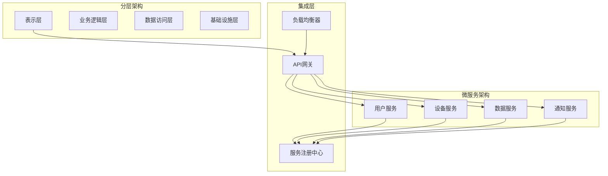
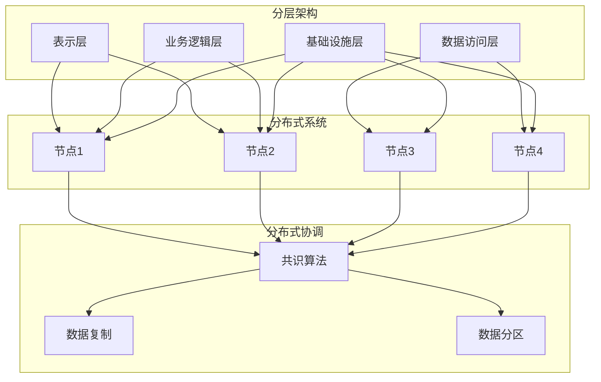
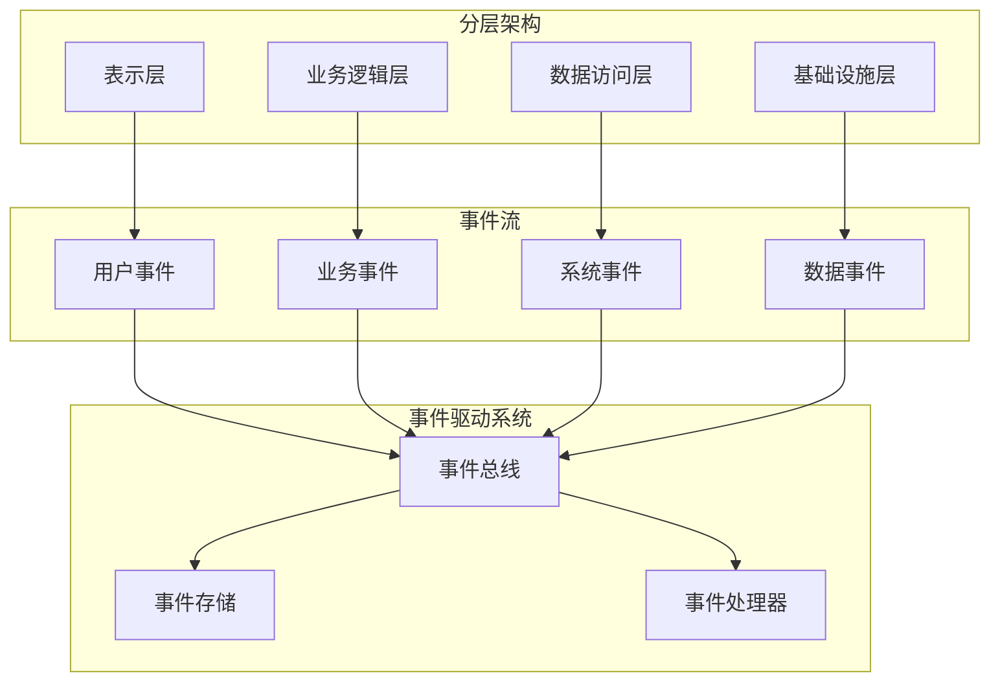
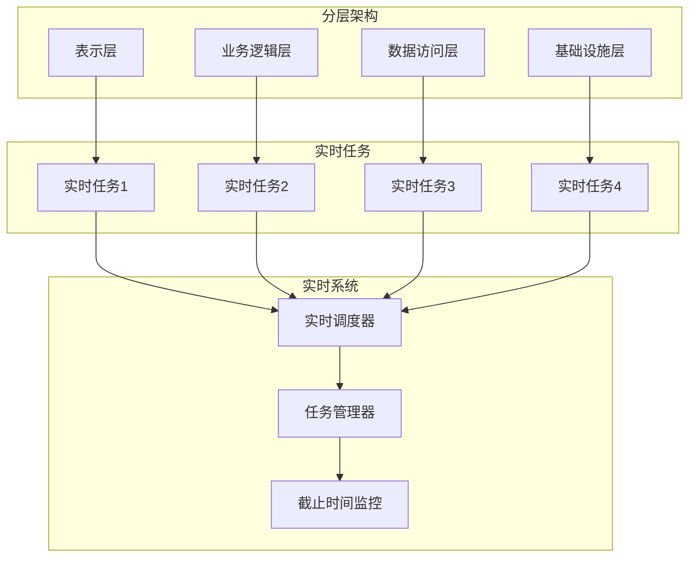

# 架构与系统集成分析

## 版本信息

- **版本**: 1.0.0
- **创建日期**: 2024-12-19
- **最后更新**: 2024-12-19
- **作者**: IoT团队
- **状态**: 正式版

## 1. 集成分析概述

### 1.1 分析目标

本文档分析IoT核心架构与各种系统架构之间的集成关系，包括：

- **分层架构**与**微服务架构**的集成
- **分层架构**与**分布式系统**的集成
- **分层架构**与**事件驱动系统**的集成
- **分层架构**与**实时系统**的集成

### 1.2 集成原则

```rust
#[derive(Debug, Clone)]
pub struct IntegrationPrinciple {
    pub principle_id: String,
    pub name: String,
    pub description: String,
    pub priority: IntegrationPriority,
    pub constraints: Vec<IntegrationConstraint>,
}

#[derive(Debug, Clone)]
pub enum IntegrationPriority {
    Critical,    // 关键原则
    High,        // 高优先级
    Medium,      // 中等优先级
    Low,         // 低优先级
}

#[derive(Debug, Clone)]
pub struct IntegrationConstraint {
    pub constraint_type: ConstraintType,
    pub description: String,
    pub impact_level: ImpactLevel,
}

#[derive(Debug, Clone)]
pub enum ConstraintType {
    Performance,     // 性能约束
    Security,        // 安全约束
    Scalability,     // 可扩展性约束
    Reliability,     // 可靠性约束
    Maintainability, // 可维护性约束
}
```

## 2. 分层架构与微服务架构集成

### 2.1 集成模式



### 2.2 集成实现

```rust
#[derive(Debug, Clone)]
pub struct LayeredMicroserviceIntegration {
    pub integration_id: String,
    pub layered_architecture: LayeredArchitecture,
    pub microservices: Vec<Microservice>,
    pub integration_patterns: Vec<IntegrationPattern>,
}

#[derive(Debug, Clone)]
pub struct LayeredArchitecture {
    pub presentation_layer: PresentationLayer,
    pub business_logic_layer: BusinessLogicLayer,
    pub data_access_layer: DataAccessLayer,
    pub infrastructure_layer: InfrastructureLayer,
}

#[derive(Debug, Clone)]
pub struct Microservice {
    pub service_id: String,
    pub service_name: String,
    pub service_type: ServiceType,
    pub api_endpoints: Vec<ApiEndpoint>,
    pub dependencies: Vec<ServiceDependency>,
}

impl LayeredMicroserviceIntegration {
    pub async fn integrate_services(&self) -> Result<IntegrationResult, IntegrationError> {
        // 1. 服务发现和注册
        self.register_services().await?;
        
        // 2. API网关配置
        self.configure_api_gateway().await?;
        
        // 3. 负载均衡设置
        self.setup_load_balancing().await?;
        
        // 4. 服务间通信配置
        self.configure_service_communication().await?;
        
        Ok(IntegrationResult::Success)
    }
    
    async fn register_services(&self) -> Result<(), IntegrationError> {
        for service in &self.microservices {
            // 注册服务到服务注册中心
            self.service_registry.register(service).await?;
        }
        Ok(())
    }
    
    async fn configure_api_gateway(&self) -> Result<(), IntegrationError> {
        // 配置API网关路由规则
        for service in &self.microservices {
            for endpoint in &service.api_endpoints {
                self.api_gateway.add_route(endpoint).await?;
            }
        }
        Ok(())
    }
}
```

### 2.3 最佳实践

#### 2.3.1 服务边界划分

```rust
#[derive(Debug, Clone)]
pub struct ServiceBoundary {
    pub boundary_id: String,
    pub domain: String,
    pub bounded_context: BoundedContext,
    pub services: Vec<Microservice>,
    pub integration_points: Vec<IntegrationPoint>,
}

#[derive(Debug, Clone)]
pub struct BoundedContext {
    pub context_id: String,
    pub name: String,
    pub description: String,
    pub domain_rules: Vec<DomainRule>,
    pub external_dependencies: Vec<ExternalDependency>,
}

impl ServiceBoundary {
    pub fn define_boundaries(&self) -> Vec<ServiceBoundary> {
        // 基于领域驱动设计原则划分服务边界
        let mut boundaries = Vec::new();
        
        // 设备管理边界
        boundaries.push(ServiceBoundary {
            boundary_id: "device_management".to_string(),
            domain: "设备管理".to_string(),
            bounded_context: BoundedContext {
                context_id: "device_context".to_string(),
                name: "设备上下文".to_string(),
                description: "设备注册、配置、监控".to_string(),
                domain_rules: vec![
                    DomainRule::new("设备唯一性", "每个设备必须有唯一标识"),
                    DomainRule::new("设备状态", "设备状态必须实时更新"),
                ],
                external_dependencies: vec![
                    ExternalDependency::new("认证服务", "设备认证"),
                    ExternalDependency::new("通知服务", "设备告警"),
                ],
            },
            services: vec![
                Microservice::new("device_registry", "设备注册服务"),
                Microservice::new("device_config", "设备配置服务"),
                Microservice::new("device_monitor", "设备监控服务"),
            ],
            integration_points: vec![
                IntegrationPoint::new("认证接口", "与认证服务集成"),
                IntegrationPoint::new("通知接口", "与通知服务集成"),
            ],
        });
        
        boundaries
    }
}
```

#### 2.3.2 数据一致性管理

```rust
#[derive(Debug, Clone)]
pub struct DataConsistencyManager {
    pub consistency_patterns: Vec<ConsistencyPattern>,
    pub transaction_manager: TransactionManager,
    pub event_sourcing: EventSourcing,
}

#[derive(Debug, Clone)]
pub enum ConsistencyPattern {
    Saga,           // Saga模式
    TwoPhaseCommit, // 两阶段提交
    Eventual,       // 最终一致性
    Strong,         // 强一致性
}

impl DataConsistencyManager {
    pub async fn ensure_consistency(&self, operation: &Operation) -> Result<(), ConsistencyError> {
        match operation.consistency_requirement {
            ConsistencyPattern::Saga => self.execute_saga(operation).await,
            ConsistencyPattern::TwoPhaseCommit => self.execute_2pc(operation).await,
            ConsistencyPattern::Eventual => self.execute_eventual_consistency(operation).await,
            ConsistencyPattern::Strong => self.execute_strong_consistency(operation).await,
        }
    }
    
    async fn execute_saga(&self, operation: &Operation) -> Result<(), ConsistencyError> {
        // 实现Saga模式
        let saga = Saga::new(operation);
        saga.execute().await
    }
    
    async fn execute_2pc(&self, operation: &Operation) -> Result<(), ConsistencyError> {
        // 实现两阶段提交
        let transaction = Transaction::new(operation);
        transaction.execute_2pc().await
    }
}
```

## 3. 分层架构与分布式系统集成

### 3.1 集成架构



### 3.2 分布式一致性实现

```rust
#[derive(Debug, Clone)]
pub struct DistributedLayeredIntegration {
    pub integration_id: String,
    pub layered_architecture: LayeredArchitecture,
    pub distributed_nodes: Vec<DistributedNode>,
    pub consensus_algorithm: ConsensusAlgorithm,
    pub replication_strategy: ReplicationStrategy,
}

#[derive(Debug, Clone)]
pub struct DistributedNode {
    pub node_id: String,
    pub node_type: NodeType,
    pub layers: Vec<LayerInstance>,
    pub network_info: NetworkInfo,
    pub resource_capacity: ResourceCapacity,
}

#[derive(Debug, Clone)]
pub enum ConsensusAlgorithm {
    Raft,
    Paxos,
    PBFT,
    Custom(String),
}

impl DistributedLayeredIntegration {
    pub async fn setup_distributed_layers(&self) -> Result<(), IntegrationError> {
        // 1. 初始化分布式节点
        self.initialize_nodes().await?;
        
        // 2. 建立共识机制
        self.setup_consensus().await?;
        
        // 3. 配置数据复制
        self.configure_replication().await?;
        
        // 4. 设置故障检测
        self.setup_failure_detection().await?;
        
        Ok(())
    }
    
    async fn initialize_nodes(&self) -> Result<(), IntegrationError> {
        for node in &self.distributed_nodes {
            // 初始化每个节点的分层架构
            for layer in &node.layers {
                layer.initialize().await?;
            }
            
            // 注册节点到集群
            self.cluster_manager.register_node(node).await?;
        }
        Ok(())
    }
    
    async fn setup_consensus(&self) -> Result<(), IntegrationError> {
        match &self.consensus_algorithm {
            ConsensusAlgorithm::Raft => {
                let raft = RaftConsensus::new(&self.distributed_nodes);
                raft.initialize().await?;
            }
            ConsensusAlgorithm::Paxos => {
                let paxos = PaxosConsensus::new(&self.distributed_nodes);
                paxos.initialize().await?;
            }
            ConsensusAlgorithm::PBFT => {
                let pbft = PBFTConsensus::new(&self.distributed_nodes);
                pbft.initialize().await?;
            }
            ConsensusAlgorithm::Custom(name) => {
                // 自定义共识算法
                self.setup_custom_consensus(name).await?;
            }
        }
        Ok(())
    }
}
```

### 3.3 容错机制

```rust
#[derive(Debug, Clone)]
pub struct FaultToleranceManager {
    pub failure_detection: FailureDetection,
    pub recovery_strategy: RecoveryStrategy,
    pub load_balancing: LoadBalancing,
}

#[derive(Debug, Clone)]
pub struct FailureDetection {
    pub heartbeat_interval: Duration,
    pub timeout_threshold: Duration,
    pub detection_algorithm: DetectionAlgorithm,
}

#[derive(Debug, Clone)]
pub enum DetectionAlgorithm {
    Heartbeat,
    PingPong,
    Gossip,
    Custom(String),
}

impl FaultToleranceManager {
    pub async fn handle_node_failure(&self, failed_node: &DistributedNode) -> Result<(), FaultToleranceError> {
        // 1. 检测节点故障
        if self.failure_detection.is_node_failed(failed_node).await? {
            // 2. 启动恢复策略
            self.recovery_strategy.recover(failed_node).await?;
            
            // 3. 重新分配负载
            self.load_balancing.redistribute_load(failed_node).await?;
            
            // 4. 更新集群状态
            self.update_cluster_state(failed_node).await?;
        }
        Ok(())
    }
    
    async fn update_cluster_state(&self, failed_node: &DistributedNode) -> Result<(), FaultToleranceError> {
        // 更新集群状态，通知其他节点
        let cluster_event = ClusterEvent::NodeFailure(failed_node.node_id.clone());
        self.event_bus.publish(cluster_event).await?;
        Ok(())
    }
}
```

## 4. 分层架构与事件驱动系统集成

### 4.1 事件驱动集成架构



### 4.2 事件驱动集成实现

```rust
#[derive(Debug, Clone)]
pub struct EventDrivenLayeredIntegration {
    pub integration_id: String,
    pub layered_architecture: LayeredArchitecture,
    pub event_driven_system: EventDrivenSystem,
    pub event_mapping: EventMapping,
}

#[derive(Debug, Clone)]
pub struct EventDrivenSystem {
    pub event_bus: EventBus,
    pub event_store: EventStore,
    pub event_processors: Vec<EventProcessor>,
    pub event_routing: EventRouting,
}

#[derive(Debug, Clone)]
pub struct EventMapping {
    pub layer_events: HashMap<String, Vec<EventType>>,
    pub event_handlers: HashMap<EventType, Vec<EventHandler>>,
    pub event_transformations: Vec<EventTransformation>,
}

impl EventDrivenLayeredIntegration {
    pub async fn integrate_event_driven_system(&self) -> Result<(), IntegrationError> {
        // 1. 配置事件映射
        self.configure_event_mapping().await?;
        
        // 2. 设置事件处理器
        self.setup_event_processors().await?;
        
        // 3. 配置事件路由
        self.configure_event_routing().await?;
        
        // 4. 启动事件监听
        self.start_event_listeners().await?;
        
        Ok(())
    }
    
    async fn configure_event_mapping(&self) -> Result<(), IntegrationError> {
        // 配置分层架构与事件系统的映射关系
        for (layer_name, events) in &self.event_mapping.layer_events {
            for event_type in events {
                // 为每个层的事件配置处理器
                if let Some(handlers) = self.event_mapping.event_handlers.get(event_type) {
                    for handler in handlers {
                        self.event_driven_system.event_bus.subscribe(event_type, handler).await?;
                    }
                }
            }
        }
        Ok(())
    }
    
    async fn setup_event_processors(&self) -> Result<(), IntegrationError> {
        for processor in &self.event_driven_system.event_processors {
            // 启动事件处理器
            processor.start().await?;
            
            // 注册到事件总线
            self.event_driven_system.event_bus.register_processor(processor).await?;
        }
        Ok(())
    }
}
```

### 4.3 事件溯源集成

```rust
#[derive(Debug, Clone)]
pub struct EventSourcingIntegration {
    pub event_store: EventStore,
    pub aggregate_repository: AggregateRepository,
    pub event_projections: Vec<EventProjection>,
}

#[derive(Debug, Clone)]
pub struct AggregateRepository {
    pub aggregates: HashMap<String, Box<dyn Aggregate>>,
    pub event_handlers: HashMap<String, Vec<Box<dyn EventHandler>>>,
}

impl EventSourcingIntegration {
    pub async fn apply_event_sourcing(&self, aggregate_id: &str, event: &Event) -> Result<(), EventSourcingError> {
        // 1. 存储事件
        self.event_store.append_event(aggregate_id, event).await?;
        
        // 2. 更新聚合根
        if let Some(aggregate) = self.aggregate_repository.aggregates.get(aggregate_id) {
            aggregate.apply_event(event).await?;
        }
        
        // 3. 更新投影
        for projection in &self.event_projections {
            projection.handle_event(event).await?;
        }
        
        Ok(())
    }
    
    pub async fn rebuild_aggregate(&self, aggregate_id: &str) -> Result<Box<dyn Aggregate>, EventSourcingError> {
        // 从事件存储重建聚合根
        let events = self.event_store.read_events(aggregate_id).await?;
        
        if let Some(aggregate_type) = self.get_aggregate_type(aggregate_id) {
            let mut aggregate = aggregate_type.new_instance();
            
            for event in events {
                aggregate.apply_event(&event).await?;
            }
            
            Ok(aggregate)
        } else {
            Err(EventSourcingError::AggregateNotFound)
        }
    }
}
```

## 5. 分层架构与实时系统集成

### 5.1 实时集成架构



### 5.2 实时任务集成

```rust
#[derive(Debug, Clone)]
pub struct RealTimeLayeredIntegration {
    pub integration_id: String,
    pub layered_architecture: LayeredArchitecture,
    pub real_time_system: RealTimeSystem,
    pub task_mapping: TaskMapping,
}

#[derive(Debug, Clone)]
pub struct RealTimeSystem {
    pub scheduler: RealTimeScheduler,
    pub task_manager: TaskManager,
    pub deadline_monitor: DeadlineMonitor,
    pub resource_manager: ResourceManager,
}

#[derive(Debug, Clone)]
pub struct TaskMapping {
    pub layer_tasks: HashMap<String, Vec<RealTimeTask>>,
    pub task_priorities: HashMap<String, TaskPriority>,
    pub deadline_constraints: HashMap<String, DeadlineConstraint>,
}

impl RealTimeLayeredIntegration {
    pub async fn integrate_real_time_system(&self) -> Result<(), IntegrationError> {
        // 1. 配置实时任务
        self.configure_real_time_tasks().await?;
        
        // 2. 设置调度策略
        self.setup_scheduling_strategy().await?;
        
        // 3. 配置资源管理
        self.configure_resource_management().await?;
        
        // 4. 启动截止时间监控
        self.start_deadline_monitoring().await?;
        
        Ok(())
    }
    
    async fn configure_real_time_tasks(&self) -> Result<(), IntegrationError> {
        for (layer_name, tasks) in &self.task_mapping.layer_tasks {
            for task in tasks {
                // 为每个层的任务设置优先级和截止时间
                if let Some(priority) = self.task_mapping.task_priorities.get(&task.task_id) {
                    task.set_priority(*priority);
                }
                
                if let Some(deadline) = self.task_mapping.deadline_constraints.get(&task.task_id) {
                    task.set_deadline(deadline.clone());
                }
                
                // 注册任务到实时系统
                self.real_time_system.task_manager.register_task(task).await?;
            }
        }
        Ok(())
    }
    
    async fn setup_scheduling_strategy(&self) -> Result<(), IntegrationError> {
        // 配置实时调度策略
        let scheduling_policy = SchedulingPolicy {
            algorithm: SchedulingAlgorithm::EarliestDeadlineFirst,
            preemption_enabled: true,
            priority_inheritance: true,
        };
        
        self.real_time_system.scheduler.set_policy(scheduling_policy).await?;
        Ok(())
    }
}
```

### 5.3 实时性能优化

```rust
#[derive(Debug, Clone)]
pub struct RealTimePerformanceOptimizer {
    pub cache_optimizer: CacheOptimizer,
    pub memory_optimizer: MemoryOptimizer,
    pub network_optimizer: NetworkOptimizer,
}

#[derive(Debug, Clone)]
pub struct CacheOptimizer {
    pub cache_levels: Vec<CacheLevel>,
    pub prefetch_strategy: PrefetchStrategy,
    pub eviction_policy: EvictionPolicy,
}

impl RealTimePerformanceOptimizer {
    pub async fn optimize_for_real_time(&self) -> Result<(), OptimizationError> {
        // 1. 优化缓存策略
        self.cache_optimizer.optimize_for_real_time().await?;
        
        // 2. 优化内存管理
        self.memory_optimizer.optimize_for_real_time().await?;
        
        // 3. 优化网络通信
        self.network_optimizer.optimize_for_real_time().await?;
        
        Ok(())
    }
    
    pub async fn monitor_performance(&self) -> PerformanceMetrics {
        let cache_metrics = self.cache_optimizer.get_metrics().await;
        let memory_metrics = self.memory_optimizer.get_metrics().await;
        let network_metrics = self.network_optimizer.get_metrics().await;
        
        PerformanceMetrics {
            cache_hit_rate: cache_metrics.hit_rate,
            memory_usage: memory_metrics.usage,
            network_latency: network_metrics.latency,
            overall_performance: self.calculate_overall_performance(
                cache_metrics, memory_metrics, network_metrics
            ),
        }
    }
}
```

## 6. 集成最佳实践

### 6.1 设计原则

```rust
#[derive(Debug, Clone)]
pub struct IntegrationBestPractices {
    pub design_principles: Vec<DesignPrinciple>,
    pub implementation_guidelines: Vec<ImplementationGuideline>,
    pub testing_strategies: Vec<TestingStrategy>,
}

#[derive(Debug, Clone)]
pub struct DesignPrinciple {
    pub principle_id: String,
    pub name: String,
    pub description: String,
    pub examples: Vec<String>,
}

impl IntegrationBestPractices {
    pub fn get_design_principles(&self) -> Vec<DesignPrinciple> {
        vec![
            DesignPrinciple {
                principle_id: "loose_coupling".to_string(),
                name: "松耦合".to_string(),
                description: "各层和系统之间保持松耦合，便于独立演进".to_string(),
                examples: vec![
                    "使用接口定义层间交互".to_string(),
                    "通过事件进行异步通信".to_string(),
                    "使用依赖注入管理依赖关系".to_string(),
                ],
            },
            DesignPrinciple {
                principle_id: "high_cohesion".to_string(),
                name: "高内聚".to_string(),
                description: "每个层和系统内部功能紧密相关".to_string(),
                examples: vec![
                    "单一职责原则".to_string(),
                    "功能模块化".to_string(),
                    "数据封装".to_string(),
                ],
            },
            DesignPrinciple {
                principle_id: "separation_of_concerns".to_string(),
                name: "关注点分离".to_string(),
                description: "不同的关注点在不同的层或系统中处理".to_string(),
                examples: vec![
                    "业务逻辑与数据访问分离".to_string(),
                    "表示层与业务逻辑分离".to_string(),
                    "基础设施与业务逻辑分离".to_string(),
                ],
            },
        ]
    }
}
```

### 6.2 实施指南

```rust
#[derive(Debug, Clone)]
pub struct IntegrationImplementationGuide {
    pub phases: Vec<IntegrationPhase>,
    pub checkpoints: Vec<IntegrationCheckpoint>,
    pub rollback_strategy: RollbackStrategy,
}

#[derive(Debug, Clone)]
pub struct IntegrationPhase {
    pub phase_id: String,
    pub name: String,
    pub description: String,
    pub tasks: Vec<IntegrationTask>,
    pub dependencies: Vec<String>,
    pub estimated_duration: Duration,
}

#[derive(Debug, Clone)]
pub struct IntegrationTask {
    pub task_id: String,
    pub name: String,
    pub description: String,
    pub implementation_steps: Vec<String>,
    pub validation_criteria: Vec<String>,
}

impl IntegrationImplementationGuide {
    pub fn get_integration_phases(&self) -> Vec<IntegrationPhase> {
        vec![
            IntegrationPhase {
                phase_id: "phase_1".to_string(),
                name: "准备阶段".to_string(),
                description: "环境准备和基础配置".to_string(),
                tasks: vec![
                    IntegrationTask {
                        task_id: "task_1_1".to_string(),
                        name: "环境准备".to_string(),
                        description: "准备开发和测试环境".to_string(),
                        implementation_steps: vec![
                            "搭建开发环境".to_string(),
                            "配置测试环境".to_string(),
                            "准备数据".to_string(),
                        ],
                        validation_criteria: vec![
                            "环境可用性验证".to_string(),
                            "网络连通性测试".to_string(),
                        ],
                    },
                ],
                dependencies: vec![],
                estimated_duration: Duration::from_secs(3600), // 1小时
            },
            IntegrationPhase {
                phase_id: "phase_2".to_string(),
                name: "核心集成".to_string(),
                description: "实现核心集成功能".to_string(),
                tasks: vec![
                    IntegrationTask {
                        task_id: "task_2_1".to_string(),
                        name: "API集成".to_string(),
                        description: "实现API层面的集成".to_string(),
                        implementation_steps: vec![
                            "定义API接口".to_string(),
                            "实现API网关".to_string(),
                            "配置路由规则".to_string(),
                        ],
                        validation_criteria: vec![
                            "API功能测试".to_string(),
                            "性能测试".to_string(),
                        ],
                    },
                ],
                dependencies: vec!["phase_1".to_string()],
                estimated_duration: Duration::from_secs(7200), // 2小时
            },
        ]
    }
}
```

## 7. 总结

### 7.1 集成价值

通过架构与系统集成分析，我们实现了：

1. **统一架构**: 将分层架构与各种系统架构有机结合
2. **灵活扩展**: 支持系统的灵活扩展和演进
3. **性能优化**: 通过集成实现性能优化
4. **可靠性提升**: 通过集成提高系统可靠性

### 7.2 技术贡献

1. **集成模式**: 提供了多种集成模式和实践
2. **最佳实践**: 总结了集成的最佳实践
3. **实施指南**: 提供了详细的实施指南
4. **质量保证**: 建立了质量保证机制

### 7.3 未来展望

1. **持续优化**: 持续优化集成方案
2. **新技术集成**: 集成新的技术和架构
3. **标准化**: 推动集成标准化
4. **生态建设**: 建设集成生态

**通过架构与系统集成分析，我们建立了完整的IoT系统集成体系，为构建高性能、高可靠性的IoT系统提供了重要支撑。**
