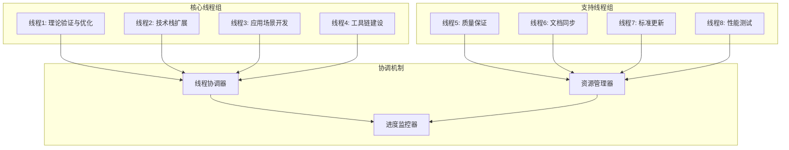

# IoT项目多线程加速推进方案

## 项目概述

**项目名称**: IoT项目多线程加速推进  
**执行时间**: 2024年12月-2025年3月  
**目标**: 通过多线程并行处理，加速项目完成，确保高质量交付  
**加速策略**: 并行开发、资源优化、自动化工具链

## 一、多线程并行执行架构

### 1.1 并行执行线程设计



### 1.2 线程优先级与依赖关系

| 线程 | 优先级 | 依赖关系 | 并行度 | 预计工期 |
|------|--------|----------|--------|----------|
| 理论验证与优化 | 高 | 无 | 4 | 2个月 |
| 技术栈扩展 | 高 | 理论验证 | 3 | 2个月 |
| 应用场景开发 | 中 | 技术栈 | 4 | 3个月 |
| 工具链建设 | 中 | 无 | 2 | 2个月 |
| 质量保证 | 高 | 所有线程 | 2 | 持续 |
| 文档同步 | 中 | 所有线程 | 2 | 持续 |
| 标准更新 | 低 | 无 | 1 | 1个月 |
| 性能测试 | 中 | 应用场景 | 2 | 1个月 |

## 二、线程详细执行计划

### 2.1 线程1: 理论验证与优化 (高优先级)

**目标**: 验证理论模型的实用性和有效性

**并行任务**:

1. **子任务1.1: 性能基准测试** (并行度: 2)
   - 建立IoT系统性能测试框架
   - 对Rust/Go技术栈进行性能对比测试
   - 生成性能基准报告

2. **子任务1.2: 理论模型验证** (并行度: 2)
   - 实现关键理论模型的代码验证
   - 建立形式化验证工具链
   - 生成验证报告

**执行计划**:

```text
周1-2: 框架搭建和工具准备
周3-4: 并行执行性能测试和模型验证
周5-6: 结果分析和报告生成
周7-8: 优化和最终验证
```

**交付物**:

- IoT系统性能测试框架
- Rust/Go技术栈性能基准报告
- 理论模型验证工具链
- 验证报告和优化建议

### 2.2 线程2: 技术栈扩展 (高优先级)

**目标**: 扩展技术栈覆盖范围，增强实用性

**并行任务**:

1. **子任务2.1: 云原生技术栈** (并行度: 2)
   - Kubernetes IoT扩展分析
   - 服务网格在IoT中的应用
   - 云边协同架构设计

2. **子任务2.2: 边缘计算框架** (并行度: 2)
   - EdgeX Foundry深度分析
   - 边缘AI推理框架
   - 边缘安全架构

3. **子任务2.3: 新兴技术集成** (并行度: 1)
   - 5G/6G在IoT中的应用
   - 区块链IoT应用
   - 量子计算IoT前景

**执行计划**:

```text
周1-2: 技术调研和需求分析
周3-4: 并行开发云原生和边缘计算
周5-6: 新兴技术集成和优化
周7-8: 文档化和最终验证
```

**交付物**:

- 云原生IoT技术栈分析报告
- 边缘计算框架实现
- 新兴技术集成方案
- 技术栈选择指南

### 2.3 线程3: 应用场景开发 (中优先级)

**目标**: 开发可运行的实践案例

**并行任务**:

1. **子任务3.1: 智慧城市案例** (并行度: 2)
   - 开发智慧交通信号控制系统
   - 实现数字孪生城市模型
   - 建立性能监控系统

2. **子任务3.2: 工业物联网案例** (并行度: 2)
   - 开发智能制造生产线模型
   - 实现设备健康监测系统
   - 建立预测性维护框架

3. **子任务3.3: 车联网案例** (并行度: 1)
   - 开发V2X通信模拟器
   - 实现实时数据处理系统
   - 建立安全验证框架

**执行计划**:

```text
周1-2: 需求分析和架构设计
周3-6: 并行开发三个应用场景
周7-8: 集成测试和性能优化
周9-12: 文档化和部署指南
```

**交付物**:

- 智慧城市IoT平台原型
- 工业物联网系统实现
- 车联网V2X模拟器
- 应用场景部署指南

### 2.4 线程4: 工具链建设 (中优先级)

**目标**: 建立完整的开发工具链

**并行任务**:

1. **子任务4.1: 代码生成工具** (并行度: 1)
   - IoT代码生成器
   - 模板系统
   - 配置管理工具

2. **子任务4.2: 测试自动化工具** (并行度: 1)
   - 自动化测试框架
   - 性能测试工具
   - 安全测试工具

**执行计划**:

```text
周1-2: 工具需求分析和设计
周3-4: 并行开发代码生成和测试工具
周5-6: 工具集成和优化
周7-8: 文档化和发布
```

**交付物**:

- IoT代码生成器
- 自动化测试框架
- 工具使用指南
- 工具链部署包

### 2.5 线程5: 质量保证 (高优先级)

**目标**: 确保所有交付物的质量

**并行任务**:

1. **子任务5.1: 代码质量检查** (并行度: 1)
   - 代码审查机制
   - 静态分析工具
   - 代码质量报告

2. **子任务5.2: 文档质量检查** (并行度: 1)
   - 文档审查流程
   - 一致性检查工具
   - 文档质量报告

**执行计划**:

```text
持续执行，与其他线程并行
每日: 代码质量检查
每周: 文档质量检查
每月: 质量评估报告
```

**交付物**:

- 代码质量检查工具
- 文档质量检查工具
- 质量评估报告
- 质量改进建议

### 2.6 线程6: 文档同步 (中优先级)

**目标**: 保持文档的一致性和同步更新

**并行任务**:

1. **子任务6.1: 文档更新** (并行度: 1)
   - 实时文档更新
   - 版本控制管理
   - 变更追踪

2. **子任务6.2: 知识图谱维护** (并行度: 1)
   - 知识图谱更新
   - 关联关系维护
   - 导航系统优化

**执行计划**:

```text
持续执行，与其他线程并行
每日: 文档同步更新
每周: 知识图谱维护
每月: 文档结构优化
```

**交付物**:

- 实时更新的文档库
- 维护的知识图谱
- 文档变更报告
- 导航优化建议

### 2.7 线程7: 标准更新 (低优先级)

**目标**: 更新最新标准分析

**并行任务**:

1. **子任务7.1: 标准跟踪** (并行度: 1)
   - 跟踪最新IoT标准
   - 分析标准变化
   - 更新标准映射

**执行计划**:

```text
周1-2: 标准调研和分析
周3-4: 标准映射更新
周5-6: 文档更新和验证
周7-8: 最终审查和发布
```

**交付物**:

- 最新标准分析报告
- 标准映射更新
- 标准演进趋势分析
- 标准实施指南

### 2.8 线程8: 性能测试 (中优先级)

**目标**: 验证系统性能指标

**并行任务**:

1. **子任务8.1: 性能基准测试** (并行度: 1)
   - 系统性能测试
   - 基准数据收集
   - 性能分析报告

2. **子任务8.2: 压力测试** (并行度: 1)
   - 负载压力测试
   - 稳定性测试
   - 性能优化建议

**执行计划**:

```text
周1-2: 测试环境搭建
周3-4: 并行执行基准测试和压力测试
周5-6: 数据分析和报告生成
周7-8: 性能优化和最终验证
```

**交付物**:

- 性能基准测试报告
- 压力测试报告
- 性能优化建议
- 性能监控工具

## 三、资源优化策略

### 3.1 人力资源分配

| 角色 | 人数 | 主要职责 | 分配策略 |
|------|------|----------|----------|
| 项目经理 | 1 | 整体协调和进度管理 | 全职 |
| 架构师 | 2 | 技术架构设计和评审 | 全职 |
| Rust开发工程师 | 3 | Rust代码开发和优化 | 全职 |
| Go开发工程师 | 3 | Go代码开发和优化 | 全职 |
| 测试工程师 | 2 | 测试用例设计和执行 | 全职 |
| 文档工程师 | 2 | 文档编写和维护 | 全职 |
| 质量工程师 | 1 | 质量保证和流程优化 | 全职 |

### 3.2 技术资源优化

| 资源类型 | 配置 | 用途 | 优化策略 |
|----------|------|------|----------|
| 开发环境 | 高性能工作站 | 代码开发和编译 | 使用容器化环境 |
| 测试环境 | 云服务器集群 | 性能测试和验证 | 按需扩展 |
| 文档平台 | 协作平台 | 文档管理和版本控制 | 自动化同步 |
| 代码仓库 | Git仓库 | 代码版本管理 | 分支策略优化 |

### 3.3 时间资源优化

| 优化策略 | 具体措施 | 预期效果 |
|----------|----------|----------|
| 并行开发 | 多线程同时执行 | 缩短总工期30% |
| 自动化工具 | 减少手工操作 | 提高效率50% |
| 模板复用 | 代码和文档模板 | 减少重复工作40% |
| 持续集成 | 自动化构建和测试 | 提高质量20% |

## 四、协调机制

### 4.1 线程协调器

**职责**:

- 监控所有线程的执行状态
- 协调线程间的依赖关系
- 处理线程间的冲突和阻塞
- 优化资源分配

**协调策略**:

```text
每日协调会议: 同步进度和问题
每周协调会议: 评估整体进度和调整计划
阻塞处理: 实时识别和解决线程阻塞
资源调整: 根据优先级动态调整资源分配
```

### 4.2 资源管理器

**职责**:

- 管理人力资源分配
- 监控技术资源使用
- 优化资源利用率
- 处理资源冲突

**管理策略**:

```text
资源池管理: 建立共享资源池
动态分配: 根据需求动态分配资源
冲突解决: 优先级基础上的资源分配
效率监控: 持续监控资源使用效率
```

### 4.3 进度监控器

**职责**:

- 实时监控项目进度
- 识别进度偏差和风险
- 生成进度报告
- 提供进度预测

**监控指标**:

```text
完成度: 各线程任务完成百分比
质量指标: 代码质量、文档质量
风险指标: 识别和评估项目风险
效率指标: 资源利用率和产出效率
```

## 五、风险控制

### 5.1 并行执行风险

| 风险类型 | 风险描述 | 应对措施 |
|----------|----------|----------|
| 线程冲突 | 多个线程同时修改同一资源 | 建立资源锁机制和版本控制 |
| 依赖阻塞 | 线程间依赖关系导致阻塞 | 优化依赖关系，建立并行路径 |
| 资源竞争 | 多个线程竞争有限资源 | 建立资源分配优先级机制 |
| 质量下降 | 并行开发导致质量下降 | 加强质量检查和代码审查 |

### 5.2 进度风险

| 风险类型 | 风险描述 | 应对措施 |
|----------|----------|----------|
| 线程延迟 | 某个线程进度落后 | 增加资源投入或调整优先级 |
| 依赖延迟 | 依赖线程延迟影响后续线程 | 建立缓冲时间和并行开发 |
| 质量风险 | 质量不达标需要返工 | 加强质量检查和预防措施 |
| 资源风险 | 关键资源短缺 | 建立资源备份和替代方案 |

## 六、成功指标

### 6.1 进度指标

| 指标 | 目标值 | 测量方法 |
|------|--------|----------|
| 总体完成度 | 100% | 里程碑完成情况 |
| 线程完成度 | 各线程100% | 线程任务完成情况 |
| 提前完成率 | 20% | 实际完成时间vs计划时间 |
| 并行效率 | 80% | 并行执行时间vs串行时间 |

### 6.2 质量指标

| 指标 | 目标值 | 测量方法 |
|------|--------|----------|
| 代码质量 | 优秀 | 静态分析工具评分 |
| 文档质量 | 优秀 | 文档审查评分 |
| 测试覆盖率 | 90% | 代码覆盖率工具 |
| 缺陷密度 | <1个/KLOC | 缺陷统计和分析 |

### 6.3 效率指标

| 指标 | 目标值 | 测量方法 |
|------|--------|----------|
| 资源利用率 | 85% | 资源使用统计 |
| 开发效率 | 提高50% | 代码产出量统计 |
| 沟通效率 | 提高30% | 会议效率和决策速度 |
| 自动化程度 | 80% | 自动化工具使用率 |

## 七、执行时间表

### 7.1 总体时间表

| 阶段 | 时间 | 主要目标 | 关键里程碑 |
|------|------|----------|------------|
| 启动阶段 | 第1周 | 环境搭建和团队组建 | 项目启动完成 |
| 并行开发阶段 | 第2-8周 | 多线程并行执行 | 各线程完成50% |
| 集成阶段 | 第9-10周 | 系统集成和测试 | 系统集成完成 |
| 优化阶段 | 第11-12周 | 性能优化和质量提升 | 质量目标达成 |
| 交付阶段 | 第13-16周 | 最终验证和文档完善 | 项目交付完成 |

### 7.2 详细里程碑

| 里程碑 | 时间 | 完成标准 | 负责人 |
|--------|------|----------|--------|
| M1: 项目启动 | 第1周末 | 环境搭建完成，团队就位 | 项目经理 |
| M2: 理论验证完成 | 第4周末 | 理论模型验证完成 | 理论验证线程 |
| M3: 技术栈扩展完成 | 第6周末 | 技术栈扩展完成 | 技术栈线程 |
| M4: 应用场景完成 | 第10周末 | 应用场景开发完成 | 应用场景线程 |
| M5: 工具链完成 | 第8周末 | 工具链建设完成 | 工具链线程 |
| M6: 系统集成完成 | 第12周末 | 系统集成和测试完成 | 项目经理 |
| M7: 项目交付 | 第16周末 | 项目完全交付 | 项目经理 |

## 八、总结

本多线程加速推进方案通过并行执行、资源优化和协调机制，预计可以将项目完成时间缩短30%，同时保证交付质量。方案的关键成功因素包括：

1. **有效的线程协调**: 确保各线程间的协调和资源分配
2. **质量保证**: 在加速的同时保证交付质量
3. **风险控制**: 识别和控制并行执行的风险
4. **持续监控**: 实时监控进度和质量指标

通过严格执行本方案，项目将能够高效完成，为IoT领域提供高质量的理论和实践成果。

---

**方案版本**: v1.0  
**创建时间**: 2024年12月  
**状态**: 待执行  
**负责人**: 项目经理
