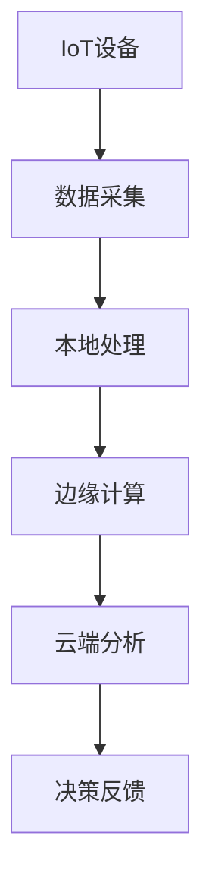

# IoT行业形式化分析综合体系

## 概述

本文档体系基于对 `/docs/Matter` 目录下所有内容的深度分析，构建了一个完整的IoT行业形式化分析框架。我们采用严格的数学证明、形式化定义和多表征方式，将IoT行业的软件架构、企业架构、行业架构、概念架构、算法、技术堆栈、业务规范等知识进行系统化整理。

## 目录结构

```
/docs/Analysis/
├── 01-Architecture/           # 架构设计分析
│   ├── 01-System-Architecture/    # 系统架构
│   ├── 02-Enterprise-Architecture/    # 企业架构
│   ├── 03-Industry-Architecture/      # 行业架构
│   └── 04-Conceptual-Architecture/    # 概念架构
├── 02-Theory/                 # 理论基础
│   ├── 01-Formal-Theory/      # 形式理论
│   ├── 02-Temporal-Logic/     # 时态逻辑
│   ├── 03-Type-Theory/        # 类型理论
│   ├── 04-Control-Theory/     # 控制理论
│   └── 05-Distributed-Systems/    # 分布式系统理论
├── 03-Algorithms/             # 算法分析
│   ├── 01-Communication/      # 通信算法
│   ├── 02-Security/           # 安全算法
│   ├── 03-Optimization/       # 优化算法
│   └── 04-Machine-Learning/   # 机器学习算法
├── 04-Technology/             # 技术栈分析
│   ├── 01-Rust-Stack/         # Rust技术栈
│   ├── 02-WebAssembly/        # WebAssembly技术
│   ├── 03-Protocols/          # 通信协议
│   └── 04-Platforms/          # 平台技术
├── 05-Business-Models/        # 业务模型
│   ├── 01-Value-Chain/        # 价值链分析
│   ├── 02-Revenue-Models/     # 收入模型
│   └── 03-Industry-Patterns/  # 行业模式
└── context_management.md      # 上下文管理
```

## 分析原则

### 1. 形式化原则

- 所有概念必须提供严格的数学定义
- 所有定理必须提供完整的证明过程
- 使用LaTeX数学表达式规范
- 保持逻辑一致性和完备性

### 2. 多表征原则

- 提供概念、定义、定理、证明等多种表征
- 使用图表、数学表达式、代码示例等多种形式
- 确保不同表征之间的一致性

### 3. 层次化原则

- 从理念层到实践层的完整层次结构
- 每个层次都有明确的输入输出关系
- 保持层次间的逻辑连贯性

### 4. IoT行业相关性

- 所有内容必须与IoT行业直接相关
- 重点关注软件架构、算法、技术栈
- 优先使用Rust和Go语言进行示例

## 内容规范

### 数学表达式规范

所有数学表达式使用LaTeX格式：

```latex
定义 1.1.1 (IoT系统形式化)
IoT系统是一个五元组 $\mathcal{I} = (D, S, C, P, T)$，其中：
- $D$ 是设备集合
- $S$ 是传感器集合  
- $C$ 是通信协议集合
- $P$ 是处理算法集合
- $T$ 是时间约束集合
```

### 代码示例规范

优先使用Rust语言：

```rust
// IoT设备抽象
pub trait IoTDevice {
    fn collect_data(&self) -> Result<SensorData, DeviceError>;
    fn process_data(&self, data: SensorData) -> Result<ProcessedData, ProcessError>;
    fn communicate(&self, data: ProcessedData) -> Result<(), CommunicationError>;
}

// 具体实现
pub struct SmartSensor {
    sensor_id: String,
    sensor_type: SensorType,
    communication_protocol: Protocol,
}
```

### 图表规范

使用Mermaid或PlantUML格式：



## 持续更新机制

本分析体系采用持续更新机制：

1. **内容验证**：定期验证内容的准确性和时效性
2. **结构优化**：根据新发现优化目录结构
3. **引用管理**：维护内部引用和外部链接
4. **版本控制**：记录所有重要变更

## 引用规范

### 内部引用

使用相对路径引用：

```markdown
参见 [系统架构分析](../01-Architecture/01-System-Architecture/README.md)
```

### 外部引用

提供完整的URL和访问日期：

```markdown
参考：[Rust IoT指南](https://rust-iot.github.io) (访问日期: 2024-01-15)
```

---

*本分析体系基于对 `/docs/Matter` 目录的深度分析，采用严格的学术规范和形式化方法构建。*
