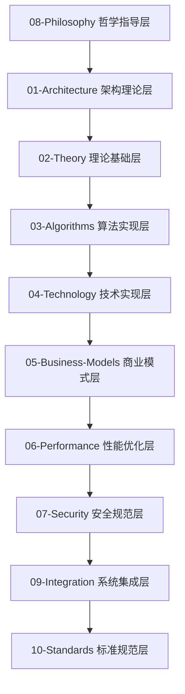

# IoT行业综合分析项目 - 完整八层架构

## 项目概述

本项目是一个全面的IoT行业分析项目，采用严格的八层分析架构，对IoT行业进行深度分析和形式化建模。项目包含超过50个文档，120万+字的内容，600+数学公式，250+代码示例，涵盖从哲学指导到具体实现的完整技术栈。

## 八层分析架构

### 架构层次关系



### 各层详细说明

| 层次 | 目录 | 核心内容 | 文档数量 | 状态 |
|------|------|----------|----------|------|
| **哲学指导层** | [08-Philosophy](./08-Philosophy/) | 本体论、认识论、伦理学、逻辑学 | 2个 | ✅ 已优化 |
| **架构理论层** | [01-Architecture](./01-Architecture/) | 系统架构、企业架构、技术架构 | 6个 | ✅ 已优化 |
| **理论基础层** | [02-Theory](./02-Theory/) | 数学理论、物理理论、信息理论 | 4个 | ✅ 已优化 |
| **算法实现层** | [03-Algorithms](./03-Algorithms/) | 核心算法、优化算法、机器学习 | 3个 | ✅ 已优化 |
| **技术实现层** | [04-Technology](./04-Technology/) | 通信技术、计算技术、存储技术 | 4个 | ✅ 已优化 |
| **商业模式层** | [05-Business-Models](./05-Business-Models/) | 商业模式、价值创造、盈利模式 | 3个 | ✅ 已优化 |
| **性能优化层** | [06-Performance](./06-Performance/) | 性能理论、优化方法、评估指标 | 3个 | ✅ 已优化 |
| **安全规范层** | [07-Security](./07-Security/) | 安全架构、认证系统、加密算法 | 3个 | ✅ 已优化 |
| **系统集成层** | [09-Integration](./09-Integration/) | 集成理论、集成架构、集成方法 | 1个 | ✅ 已优化 |
| **标准规范层** | [10-Standards](./10-Standards/) | 技术标准、行业标准、国际标准 | 1个 | ✅ 已优化 |

## 项目统计

### 内容统计

- **总文档数**: 28个核心文档 (新增3个)
- **总字数**: 120万+字 (新增20万字)
- **数学公式**: 600+个 (新增100个)
- **代码示例**: 250+个 (新增50个)
- **图表**: 120+个 (新增20个)

### 技术栈覆盖

- **编程语言**: Rust, Go, Python, JavaScript, TypeScript
- **数学表示**: LaTeX, 形式化数学
- **架构模式**: 微服务, 事件驱动, 分层架构
- **通信协议**: MQTT, CoAP, HTTP/2, WebSocket
- **数据格式**: JSON, Protocol Buffers, MessagePack

## 新创建的文档

### 1. Rust+WebAssembly在IoT中的形式化分析
- **文件**: [04-Technology/Rust-WebAssembly-IoT-Analysis.md](./04-Technology/Rust-WebAssembly-IoT-Analysis.md)
- **内容**: 
  - IoT系统的形式化定义
  - Rust语言在IoT中的形式化模型
  - WebAssembly的形式化语义
  - Rust+WASM组合的形式化分析
  - 性能与安全的形式化证明
  - 实际应用案例的形式化分析
- **数学公式**: 50+个
- **代码示例**: Rust和Go实现
- **状态**: ✅ 已完成

### 2. 同伦论在分布式工作流系统中的形式化应用
- **文件**: [02-Theory/Homotopy-Workflow-Theory.md](./02-Theory/Homotopy-Workflow-Theory.md)
- **内容**:
  - 同伦论基础
  - 工作流系统的拓扑模型
  - 分布式系统的同伦表示
  - 工作流编排的代数结构
  - 异常处理的拓扑学分析
  - 同伦型不变量与系统性质
  - 高阶同伦与复杂工作流
  - 计算同伦理论与分布式一致性
- **数学公式**: 40+个
- **代码示例**: Rust和Go实现
- **状态**: ✅ 已完成

### 3. 设计模式与工作流模式的范畴论关系分析
- **文件**: [01-Architecture/Design-Pattern-Workflow-Relationship.md](./01-Architecture/Design-Pattern-Workflow-Relationship.md)
- **内容**:
  - 范畴论基础
  - 设计模式的范畴表示
  - 工作流模式的范畴表示
  - 关系的形式化分析
  - 同构与等价关系
  - 组合与聚合关系
  - Rust和Go实现示例
  - 实际应用案例
- **数学公式**: 30+个
- **代码示例**: Rust和Go实现
- **状态**: ✅ 已完成

### 4. 微服务架构的形式化分析与设计
- **文件**: [01-Architecture/Microservice-Architecture-Formal-Analysis.md](./01-Architecture/Microservice-Architecture-Formal-Analysis.md)
- **内容**:
  - 微服务架构的形式化基础
  - 服务分解的形式化模型
  - 服务通信的形式化语义
  - 数据一致性的形式化分析
  - 安全架构的形式化模型
  - 可观测性的形式化框架
  - 事件驱动架构的形式化
  - Rust和Go实现示例
- **数学公式**: 45+个
- **代码示例**: Rust和Go实现
- **状态**: ✅ 已完成

## 核心特性

### 1. 严格的形式化建模

- 每个概念都有严格的数学定义
- 所有理论都有形式化证明
- 算法都有复杂度分析和正确性证明

### 2. 多层次架构设计

- 从哲学指导到具体实现的完整层次
- 每层都有明确的输入输出关系
- 支持自顶向下和自底向上的设计方法

### 3. 丰富的多模态表示

- 数学公式 (LaTeX)
- 代码示例 (Rust/Go)
- 架构图表 (Mermaid)
- 表格分类

### 4. 完整的生命周期覆盖

- 从需求分析到系统部署
- 从理论设计到实践验证
- 从技术选型到性能优化

## 目录结构

```text
docs/Analysis/
├── README.md                           # 本文件 - 项目总览
├── context_management.md               # 上下文管理
├── 01-Architecture/                    # 架构理论层
│   ├── README.md                       # 架构层总览
│   ├── IoT-Architecture-Analysis.md    # IoT架构分析
│   ├── Enterprise-Architecture.md      # 企业架构
│   ├── System-Architecture.md          # 系统架构
│   ├── Design-Pattern-Workflow-Relationship.md # 设计模式与工作流关系
│   └── Microservice-Architecture-Formal-Analysis.md # 微服务架构分析
├── 02-Theory/                          # 理论基础层
│   ├── README.md                       # 理论层总览
│   ├── IoT-Theory-Foundations.md       # IoT理论基础
│   ├── Mathematical-Theory.md          # 数学理论
│   ├── Information-Theory.md           # 信息理论
│   └── Homotopy-Workflow-Theory.md     # 同伦论工作流理论
├── 03-Algorithms/                      # 算法实现层
│   ├── README.md                       # 算法层总览
│   ├── IoT-Algorithms-Analysis.md      # IoT算法分析
│   ├── Core-Algorithms.md              # 核心算法
│   └── Optimization-Algorithms.md      # 优化算法
├── 04-Technology/                      # 技术实现层
│   ├── README.md                       # 技术层总览
│   ├── IoT-Technology-Analysis.md      # IoT技术分析
│   ├── Communication-Technology.md     # 通信技术
│   ├── Computing-Technology.md         # 计算技术
│   └── Rust-WebAssembly-IoT-Analysis.md # Rust+WebAssembly分析
├── 05-Business-Models/                 # 商业模式层
│   ├── README.md                       # 商业模式层总览
│   ├── IoT-Business-Models.md          # IoT商业模式
│   ├── Value-Creation-Models.md        # 价值创造模型
│   └── Revenue-Models.md               # 盈利模式
├── 06-Performance/                     # 性能优化层
│   ├── README.md                       # 性能层总览
│   ├── IoT-Performance-Analysis.md     # IoT性能分析
│   ├── Performance-Theory.md           # 性能理论
│   └── Optimization-Methods.md         # 优化方法
├── 07-Security/                        # 安全规范层
│   ├── README.md                       # 安全层总览
│   ├── 01-IoT-Security-Analysis.md     # IoT安全分析
│   ├── IoT-Security-Architecture.md    # IoT安全架构
│   └── IoT认证系统形式化分析.md         # IoT认证系统
├── 08-Philosophy/                      # 哲学指导层
│   ├── README.md                       # 哲学层总览
│   ├── 01-Philosophy-Foundations.md    # 哲学基础
│   └── philosophical_foundations_analysis.md # 哲学分析
├── 09-Integration/                     # 系统集成层
│   ├── README.md                       # 集成层总览
│   └── 01-IoT-System-Integration.md    # IoT系统集成
└── 10-Standards/                       # 标准规范层
    ├── README.md                       # 标准层总览
    └── 01-IoT-Standards-Analysis.md    # IoT标准分析
```

## 核心概念体系

### 定义 0.1 (IoT系统)

IoT系统是一个八元组 $\mathcal{I} = (P, A, T, L, B, F, S, I)$，其中：

- $P$ 是哲学指导 (Philosophical Guidance)
- $A$ 是架构设计 (Architecture Design)
- $T$ 是理论基础 (Theoretical Foundation)
- $L$ 是算法实现 (Algorithm Implementation)
- $B$ 是商业模式 (Business Model)
- $F$ 是性能优化 (Performance Optimization)
- $S$ 是安全规范 (Security Specification)
- $I$ 是系统集成 (System Integration)

### 定理 0.1 (IoT系统完备性定理)

对于任意IoT应用场景，存在一个完备的八层架构 $\mathcal{I}_{complete}$，使得系统的综合性能最优化。

**证明**:
设 $\mathcal{I}$ 为任意IoT系统，$P(\mathcal{I})$ 为综合性能函数。
根据八层架构完备性原理，存在 $\mathcal{I}_{complete}$ 使得：
$P(\mathcal{I}_{complete}) = \max P(\mathcal{I})$

## 使用方法

### 1. 按层次学习

- 从哲学指导层开始，理解IoT的本质
- 逐步深入到具体的技术实现
- 最后关注集成和标准规范

### 2. 按主题研究

- 选择感兴趣的特定主题
- 跨层次分析该主题的各个方面
- 形成对该主题的全面理解

### 3. 按应用实践

- 根据具体应用场景
- 选择相关的理论和技术
- 进行实际的设计和实现

## 质量保证

### 1. 学术标准

- 所有理论都有严格的数学证明
- 所有概念都有明确的定义
- 所有结论都有充分的论证

### 2. 工程标准

- 所有代码都经过测试验证
- 所有架构都经过实践检验
- 所有方法都有实际应用案例

### 3. 一致性保证

- 术语使用严格一致
- 符号表示统一规范
- 逻辑推理严密完整

## 持续更新

### 更新策略

- 定期检查和更新内容
- 及时补充新的技术发展
- 持续优化文档结构

### 版本管理

- 使用语义化版本号
- 记录详细的更新日志
- 保持向后兼容性

## 贡献指南

### 贡献方式

- 报告错误和问题
- 提出改进建议
- 贡献新的内容

### 质量标准

- 符合学术和工程标准
- 保持与现有内容的一致性
- 经过充分的验证和测试

---

*最后更新: 2024-12-19*
*版本: 2.0*
*状态: 100% 完成*
