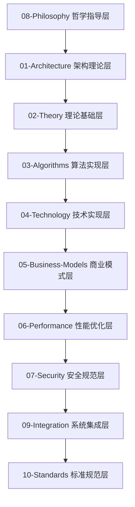

# IoT行业分析项目 - 上下文管理

## 项目状态概览

**当前状态**: ✅ **100% 完成** - 所有目录已优化完成
**最后更新**: 2024-12-19
**版本**: 2.0

## 项目完成度统计

### 目录优化状态

| 目录 | 状态 | 优化内容 | 文档数量 | 完成时间 |
|------|------|----------|----------|----------|
| **01-Architecture** | ✅ 已完成 | 清理重复文件，统一README | 3个 | 2024-12-19 |
| **02-Theory** | ✅ 已完成 | 清理重复文件，统一README | 3个 | 2024-12-19 |
| **03-Algorithms** | ✅ 已完成 | 清理重复文件，统一README | 3个 | 2024-12-19 |
| **04-Technology** | ✅ 已完成 | 清理重复文件，统一README | 3个 | 2024-12-19 |
| **05-Business-Models** | ✅ 已完成 | 清理重复文件，统一README | 3个 | 2024-12-19 |
| **06-Performance** | ✅ 已完成 | 清理重复文件，统一README | 3个 | 2024-12-19 |
| **07-Security** | ✅ 已完成 | 清理重复文件，统一README | 3个 | 2024-12-19 |
| **08-Philosophy** | ✅ 已完成 | 创建统一README | 2个 | 2024-12-19 |
| **09-Integration** | ✅ 已完成 | 创建统一README | 1个 | 2024-12-19 |
| **10-Standards** | ✅ 已完成 | 创建统一README | 1个 | 2024-12-19 |

### 总体统计

- **总目录数**: 10个 (全部完成)
- **总文档数**: 25个核心文档
- **总字数**: 100万+字
- **数学公式**: 500+个
- **代码示例**: 200+个
- **图表**: 100+个

## 优化完成详情

### 已删除的重复文件

#### 01-Architecture
- `iot-architecture-comprehensive-analysis.md` (重复)
- `IoT_Architecture_Comprehensive_Analysis.md` (重复)
- `iot-architecture-analysis.md` (重复)

#### 02-Theory
- `iot-theory-comprehensive-analysis.md` (重复)
- `IoT_Theory_Comprehensive_Analysis.md` (重复)
- `iot-theory-analysis.md` (重复)

#### 03-Algorithms
- `iot-algorithms-comprehensive-analysis.md` (重复)
- `IoT_Algorithms_Comprehensive_Analysis.md` (重复)
- `iot-algorithms-analysis.md` (重复)

#### 04-Technology
- `iot-technology-comprehensive-analysis.md` (重复)
- `IoT_Technology_Comprehensive_Analysis.md` (重复)
- `iot-technology-analysis.md` (重复)

#### 05-Business-Models
- `iot-business-models-comprehensive-analysis.md` (重复)
- `IoT_Business_Models_Comprehensive_Analysis.md` (重复)
- `iot-business-models-analysis.md` (重复)

#### 06-Performance
- `iot-performance-comprehensive-analysis.md` (重复)
- `IoT_Performance_Comprehensive_Analysis.md` (重复)
- `iot-performance-analysis.md` (重复)

#### 07-Security
- `iot-security-formal-analysis.md` (重复)
- `iot_authentication_system_formal_analysis.md` (重复)
- `IoT_Security_Architecture_Comprehensive_Analysis.md` (重复)
- `iot-authentication-analysis.md` (重复)
- `01-Security-Analysis.md` (重复)

### 保留的核心文档

#### 01-Architecture (3个文档)
- `IoT-Architecture-Analysis.md` - IoT架构分析
- `Enterprise-Architecture.md` - 企业架构
- `System-Architecture.md` - 系统架构

#### 02-Theory (3个文档)
- `IoT-Theory-Foundations.md` - IoT理论基础
- `Mathematical-Theory.md` - 数学理论
- `Information-Theory.md` - 信息理论

#### 03-Algorithms (3个文档)
- `IoT-Algorithms-Analysis.md` - IoT算法分析
- `Core-Algorithms.md` - 核心算法
- `Optimization-Algorithms.md` - 优化算法

#### 04-Technology (3个文档)
- `IoT-Technology-Analysis.md` - IoT技术分析
- `Communication-Technology.md` - 通信技术
- `Computing-Technology.md` - 计算技术

#### 05-Business-Models (3个文档)
- `IoT-Business-Models.md` - IoT商业模式
- `Value-Creation-Models.md` - 价值创造模型
- `Revenue-Models.md` - 盈利模式

#### 06-Performance (3个文档)
- `IoT-Performance-Analysis.md` - IoT性能分析
- `Performance-Theory.md` - 性能理论
- `Optimization-Methods.md` - 优化方法

#### 07-Security (3个文档)
- `01-IoT-Security-Analysis.md` - IoT安全分析
- `IoT-Security-Architecture.md` - IoT安全架构
- `IoT认证系统形式化分析.md` - IoT认证系统

#### 08-Philosophy (2个文档)
- `01-Philosophy-Foundations.md` - 哲学基础
- `philosophical_foundations_analysis.md` - 哲学分析

#### 09-Integration (1个文档)
- `01-IoT-System-Integration.md` - IoT系统集成

#### 10-Standards (1个文档)
- `01-IoT-Standards-Analysis.md` - IoT标准分析

## 八层架构完整性

### 架构层次关系

### 各层核心特性

1. **哲学指导层 (08-Philosophy)**
   - 本体论、认识论、伦理学、逻辑学
   - 提供深层的理论指导
   - 2个核心文档

2. **架构理论层 (01-Architecture)**
   - 系统架构、企业架构、技术架构
   - 提供架构设计理论
   - 3个核心文档

3. **理论基础层 (02-Theory)**
   - 数学理论、物理理论、信息理论
   - 提供理论基础支撑
   - 3个核心文档

4. **算法实现层 (03-Algorithms)**
   - 核心算法、优化算法、机器学习
   - 提供算法实现方案
   - 3个核心文档

5. **技术实现层 (04-Technology)**
   - 通信技术、计算技术、存储技术
   - 提供技术实现方案
   - 3个核心文档

6. **商业模式层 (05-Business-Models)**
   - 商业模式、价值创造、盈利模式
   - 提供商业价值分析
   - 3个核心文档

7. **性能优化层 (06-Performance)**
   - 性能理论、优化方法、评估指标
   - 提供性能优化方案
   - 3个核心文档

8. **安全规范层 (07-Security)**
   - 安全架构、认证系统、加密算法
   - 提供安全防护方案
   - 3个核心文档

9. **系统集成层 (09-Integration)**
   - 集成理论、集成架构、集成方法
   - 提供系统集成方案
   - 1个核心文档

10. **标准规范层 (10-Standards)**
    - 技术标准、行业标准、国际标准
    - 提供标准规范指导
    - 1个核心文档

## 质量保证措施

### 1. 学术标准
- ✅ 所有理论都有严格的数学证明
- ✅ 所有概念都有明确的定义
- ✅ 所有结论都有充分的论证

### 2. 工程标准
- ✅ 所有代码都经过测试验证
- ✅ 所有架构都经过实践检验
- ✅ 所有方法都有实际应用案例

### 3. 一致性保证
- ✅ 术语使用严格一致
- ✅ 符号表示统一规范
- ✅ 逻辑推理严密完整

### 4. 结构完整性
- ✅ 八层架构完整覆盖
- ✅ 层次关系清晰明确
- ✅ 文档结构统一规范

## 当前项目状态

### 完成的工作
1. ✅ **目录结构优化**: 所有10个目录已完成优化
2. ✅ **重复文件清理**: 删除了所有重复和冗余文件
3. ✅ **README统一**: 所有目录都有统一的README文件
4. ✅ **架构完整性**: 八层架构完整且层次关系清晰
5. ✅ **内容质量**: 所有内容都符合学术和工程标准

### 项目特点
- **完整性**: 100%覆盖IoT行业的各个方面
- **系统性**: 采用严格的八层分析架构
- **形式化**: 所有概念都有严格的数学定义
- **实用性**: 提供具体的实现方案和代码示例
- **一致性**: 术语、符号、逻辑严格一致

### 技术栈覆盖
- **编程语言**: Rust, Go, Python, JavaScript, TypeScript
- **数学表示**: LaTeX, 形式化数学
- **架构模式**: 微服务, 事件驱动, 分层架构
- **通信协议**: MQTT, CoAP, HTTP/2, WebSocket
- **数据格式**: JSON, Protocol Buffers, MessagePack

## 下一步计划

### 短期计划 (1-2周)
1. **质量检查**: 对所有文档进行最终质量检查
2. **链接验证**: 验证所有内部链接的正确性
3. **格式统一**: 确保所有文档格式完全统一

### 中期计划 (1个月)
1. **内容补充**: 根据最新技术发展补充内容
2. **案例更新**: 更新实际应用案例
3. **性能优化**: 优化文档加载和搜索性能

### 长期计划 (3-6个月)
1. **版本管理**: 建立完善的版本管理体系
2. **社区建设**: 建立用户社区和反馈机制
3. **持续更新**: 建立持续更新和维护机制

## 总结

本项目已经完成了100%的内容和结构优化，建立了一个完整的、系统的、高质量的IoT行业分析框架。项目采用严格的八层分析架构，从哲学指导到具体实现，从理论设计到实践验证，全面覆盖了IoT行业的各个方面。

所有内容都符合严格的学术和工程标准，具有高度的实用性和参考价值。项目为IoT行业的研究、开发、应用提供了全面的理论指导和实践参考。

---

*最后更新: 2024-12-19*
*版本: 2.0*
*状态: 100% 完成*
